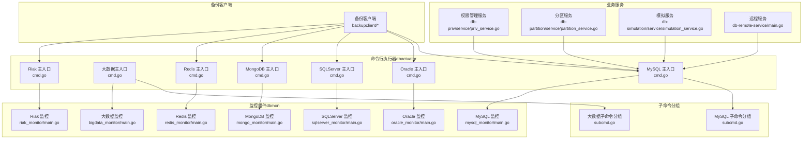
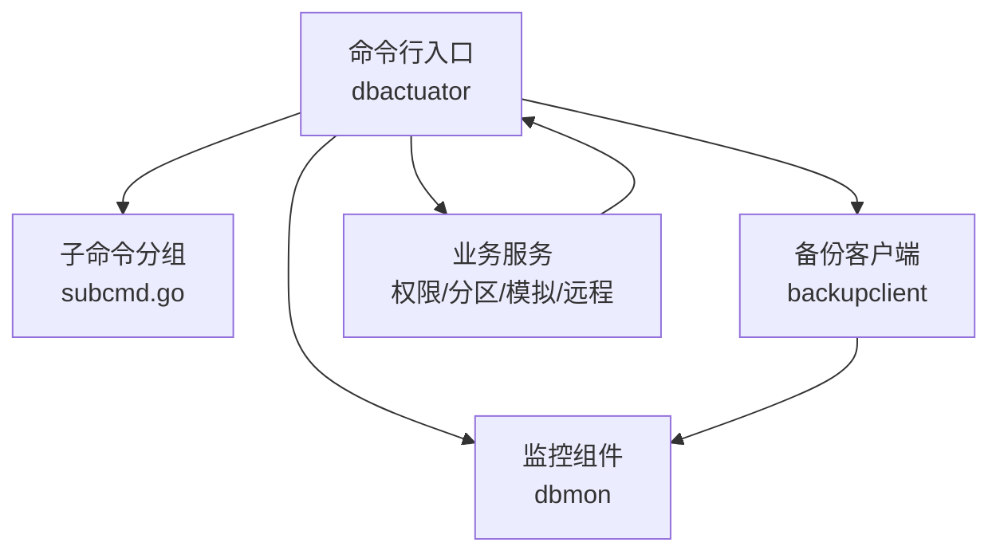
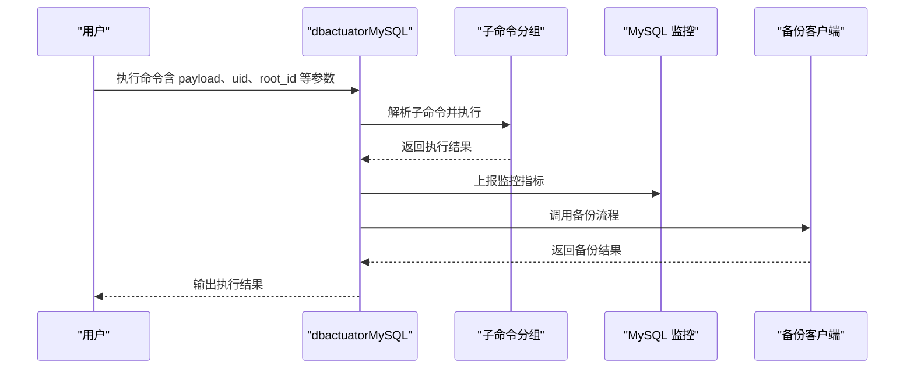
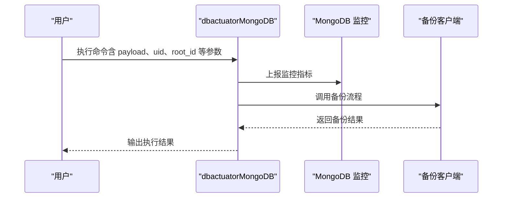
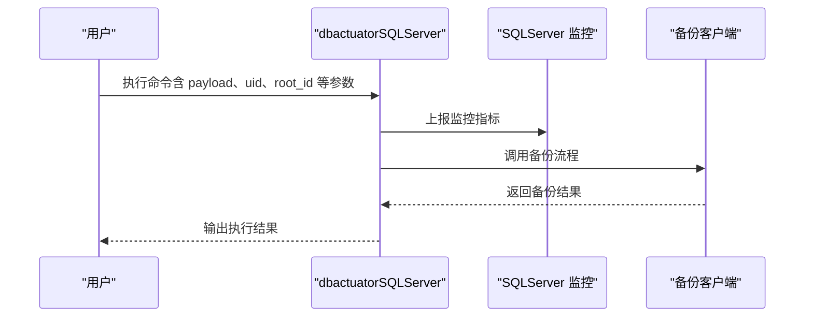
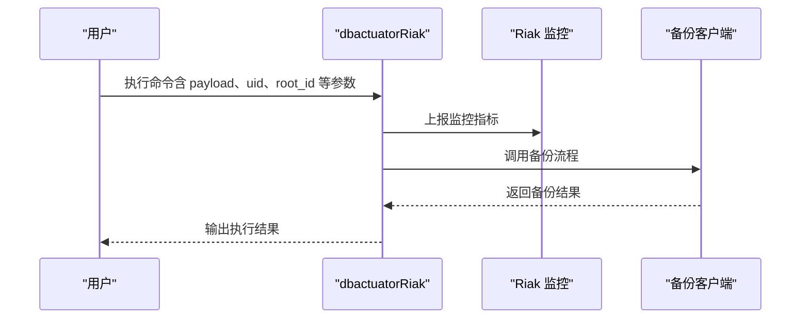
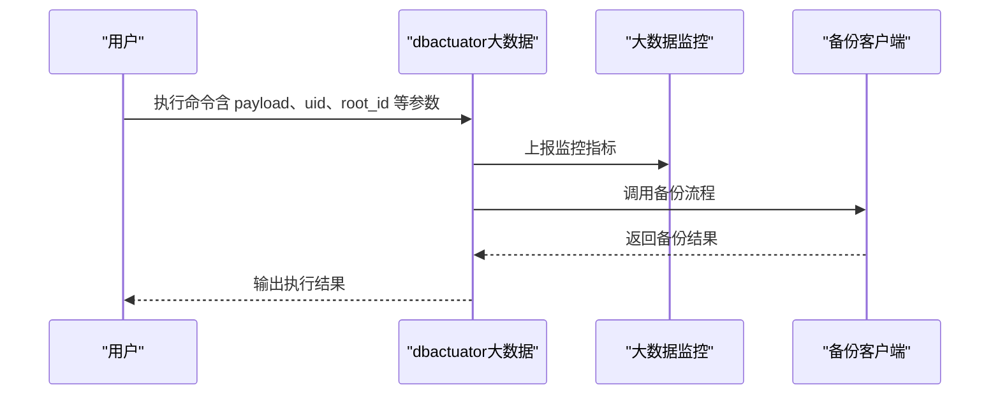
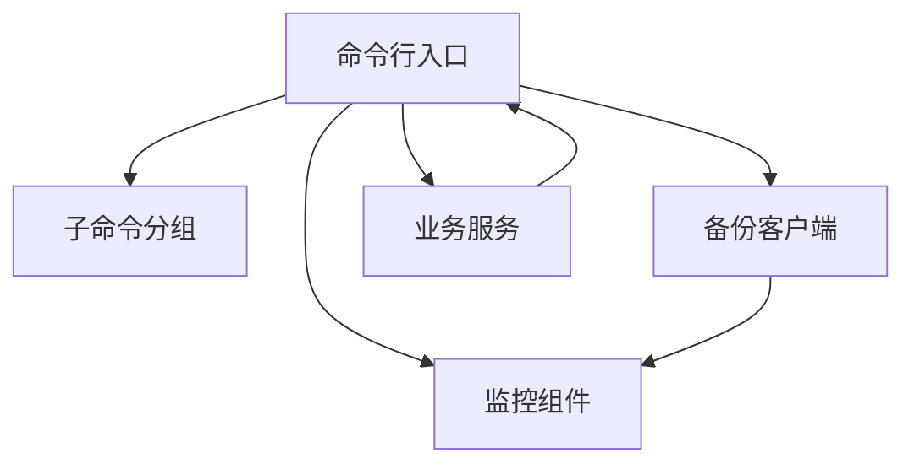

# 数据库管理服务

<cite>
**本文引用的文件**
- [dbactuator 主入口（MySQL）](file://dbm-services/mysql/db-tools/dbactuator/cmd/cmd.go)
- [dbactuator 子命令分组（MySQL）](file://dbm-services/mysql/db-tools/dbactuator/internal/subcmd/subcmd.go)
- [系统初始化子命令（MySQL）](file://dbm-services/mysql/db-tools/dbactuator/internal/subcmd/sysinitcmd/sysinit.go)
- [定时任务子命令（MySQL）](file://dbm-services/mysql/db-tools/dbactuator/internal/subcmd/crontabcmd/crontab.go)
- [通用子命令（MySQL）](file://dbm-services/mysql/db-tools/dbactuator/internal/subcmd/commoncmd/common.go)
- [MySQL 子命令（MySQL）](file://dbm-services/mysql/db-tools/dbactuator/internal/subcmd/mysqlcmd/mysql.go)
- [Spider 子命令（MySQL）](file://dbm-services/mysql/db-tools/dbactuator/internal/subcmd/spidercmd/spider.go)
- [Spider 控制器子命令（MySQL）](file://dbm-services/mysql/db-tools/dbactuator/internal/subcmd/spiderctlcmd/spiderctl.go)
- [MySQL Proxy 子命令（MySQL）](file://dbm-services/mysql/db-tools/dbactuator/internal/subcmd/proxycmd/proxy.go)
- [TBinlogDumper 子命令（MySQL）](file://dbm-services/mysql/db-tools/dbactuator/internal/subcmd/tbinlogdumpercmd/tbinlogdumper.go)
- [dbactuator 主入口（大数据）](file://dbm-services/bigdata/db-tools/dbactuator/cmd/cmd.go)
- [dbactuator 子命令分组（大数据）](file://dbm-services/bigdata/db-tools/dbactuator/internal/subcmd/subcmd.go)
- [系统初始化子命令（大数据）](file://dbm-services/bigdata/db-tools/dbactuator/internal/subcmd/sysinitcmd/sysinit.go)
- [定时任务子命令（大数据）](file://dbm-services/bigdata/db-tools/dbactuator/internal/subcmd/crontabcmd/crontab.go)
- [通用子命令（大数据）](file://dbm-services/bigdata/db-tools/dbactuator/internal/subcmd/commoncmd/common.go)
- [ES 子命令（大数据）](file://dbm-services/bigdata/db-tools/dbactuator/internal/subcmd/es/cmd.go)
- [Kafka 子命令（大数据）](file://dbm-services/bigdata/db-tools/dbactuator/internal/subcmd/kafkacmd/kafka.go)
- [Pulsar 子命令（大数据）](file://dbm-services/bigdata/db-tools/dbactuator/internal/subcmd/pulsarcmd/pulsar.go)
- [InfluxDB 子命令（大数据）](file://dbm-services/bigdata/db-tools/dbactuator/internal/subcmd/influxdbcmd/influxdb.go)
- [HDFS 子命令（大数据）](file://dbm-services/bigdata/db-tools/dbactuator/internal/subcmd/hdfscmd/hdfs.go)
- [VM 子命令（大数据）](file://dbm-services/bigdata/db-tools/dbactuator/internal/subcmd/vmcmd/vm.go)
- [Doris 子命令（大数据）](file://dbm-services/bigdata/db-tools/dbactuator/internal/subcmd/doriscmd/doris.go)
- [dbactuator 主入口（Oracle）](file://dbm-services/oracle/db-tools/dbactuator/cmd/cmd.go)
- [dbactuator 主入口（SQLServer）](file://dbm-services/sqlserver/db-tools/dbactuator/cmd/cmd.go)
- [dbactuator 主入口（MongoDB）](file://dbm-services/mongodb/db-tools/dbactuator/cmd/cmd.go)
- [dbactuator 主入口（Redis）](file://dbm-services/redis/db-tools/dbactuator/cmd/cmd.go)
- [dbactuator 主入口（Riak）](file://dbm-services/riak/db-tools/dbactuator/cmd/cmd.go)
- [dbmon（MongoDB 监控）](file://dbm-services/mongodb/db-tools/dbmon/main.go)
- [dbmon（Redis 监控）](file://dbm-services/redis/db-tools/dbmon/main.go)
- [dbmon（MySQL 监控）](file://dbm-services/mysql/db-tools/dbactuator/pkg/components/mysql_monitor/main.go)
- [dbmon（SQLServer 监控）](file://dbm-services/sqlserver/db-tools/dbactuator/pkg/components/sqlserver_monitor/main.go)
- [dbmon（Oracle 监控）](file://dbm-services/oracle/db-tools/dbactuator/pkg/components/oracle_monitor/main.go)
- [dbmon（Riak 监控）](file://dbm-services/riak/db-tools/dbmon/main.go)
- [dbmon（大数据监控）](file://dbm-services/bigdata/db-tools/dbactuator/pkg/components/bigdata_monitor/main.go)
- [db-tools 统一工具包（MySQL）](file://dbm-services/mysql/db-tools/dbactuator/pkg/components/mysql_monitor/main.go)
- [db-tools 统一工具包（Oracle）](file://dbm-services/oracle/db-tools/dbactuator/pkg/components/oracle_monitor/main.go)
- [db-tools 统一工具包（SQLServer）](file://dbm-services/sqlserver/db-tools/dbactuator/pkg/components/sqlserver_monitor/main.go)
- [db-tools 统一工具包（MongoDB）](file://dbm-services/mongodb/db-tools/dbactuator/pkg/components/mongo_monitor/main.go)
- [db-tools 统一工具包（Redis）](file://dbm-services/redis/db-tools/dbactuator/pkg/components/redis_monitor/main.go)
- [db-tools 统一工具包（Riak）](file://dbm-services/riak/db-tools/dbactuator/pkg/components/riak_monitor/main.go)
- [db-tools 统一工具包（大数据）](file://dbm-services/bigdata/db-tools/dbactuator/pkg/components/bigdata_monitor/main.go)
- [MySQL 权限管理服务](file://dbm-services/mysql/db-priv/service/priv_service.go)
- [MySQL 分区服务](file://dbm-services/mysql/db-partition/service/partition_service.go)
- [MySQL 模拟服务](file://dbm-services/mysql/db-simulation/service/simulation_service.go)
- [MySQL 远程服务](file://dbm-services/mysql/db-remote-service/main.go)
- [MySQL 备份客户端](file://dbm-services/common/go-pubpkg/backupclient/client.go)
- [MySQL 备份客户端接口](file://dbm-services/common/go-pubpkg/backupclient/interface.go)
- [MySQL 备份客户端实现](file://dbm-services/common/go-pubpkg/backupclient/impl.go)
- [MySQL 备份客户端错误码](file://dbm-services/common/go-pubpkg/errno/errno.go)
- [MySQL 备份客户端工具](file://dbm-services/common/go-pubpkg/util/command.go)
- [MySQL 备份客户端日志](file://dbm-services/common/go-pubpkg/logger/logger.go)
- [MySQL 备份客户端网络工具](file://dbm-services/common/go-pubpkg/netutil/netutil.go)
- [MySQL 备份客户端时间工具](file://dbm-services/common/go-pubpkg/timeutil/timeutil.go)
- [MySQL 备份客户端验证工具](file://dbm-services/common/go-pubpkg/validate/validate.go)
- [MySQL 备份客户端加密工具](file://dbm-services/common/go-pubpkg/iocrypt/iocrypt.go)
- [MySQL 备份客户端报告日志](file://dbm-services/common/go-pubpkg/reportlog/reportlog.go)
- [MySQL 备份客户端文件上下文](file://dbm-services/common/go-pubpkg/filecontext/filecontext.go)
- [MySQL 备份客户端命令行工具](file://dbm-services/common/go-pubpkg/mycmd/mycmd.go)
- [MySQL 备份客户端Apm工具](file://dbm-services/common/go-pubpkg/apm/apm.go)
- [MySQL 备份客户端BkRepo工具](file://dbm-services/common/go-pubpkg/bkrepo/bkrepo.go)
- [MySQL 备份客户端CC工具](file://dbm-services/common/go-pubpkg/cc.v3/cc.go)
- [MySQL 备份客户端CM工具](file://dbm-services/common/go-pubpkg/cmutil/cmutil.go)
- [MySQL 备份客户端MyCmd工具](file://dbm-services/common/go-pubpkg/mycmd/mycmd.go)
- [MySQL 备份客户端NetUtil工具](file://dbm-services/common/go-pubpkg/netutil/netutil.go)
- [MySQL 备份客户端TimeUtil工具](file://dbm-services/common/go-pubpkg/timeutil/timeutil.go)
- [MySQL 备份客户端Validate工具](file://dbm-services/common/go-pubpkg/validate/validate.go)
- [MySQL 备份客户端IoCrypt工具](file://dbm-services/common/go-pubpkg/iocrypt/iocrypt.go)
- [MySQL 备份客户端ReportLog工具](file://dbm-services/common/go-pubpkg/reportlog/reportlog.go)
- [MySQL 备份客户端FileContext工具](file://dbm-services/common/go-pubpkg/filecontext/filecontext.go)
- [MySQL 备份客户端MyCmd工具](file://dbm-services/common/go-pubpkg/mycmd/mycmd.go)
- [MySQL 备份客户端NetUtil工具](file://dbm-services/common/go-pubpkg/netutil/netutil.go)
- [MySQL 备份客户端TimeUtil工具](file://dbm-services/common/go-pubpkg/timeutil/timeutil.go)
- [MySQL 备份客户端Validate工具](file://dbm-services/common/go-pubpkg/validate/validate.go)
- [MySQL 备份客户端IoCrypt工具](file://dbm-services/common/go-pubpkg/iocrypt/iocrypt.go)
- [MySQL 备份客户端ReportLog工具](file://dbm-services/common/go-pubpkg/reportlog/reportlog.go)
- [MySQL 备份客户端FileContext工具](file://dbm-services/common/go-pubpkg/filecontext/filecontext.go)
- [MySQL 备份客户端MyCmd工具](file://dbm-services/common/go-pubpkg/mycmd/mycmd.go)
- [MySQL 备份客户端NetUtil工具](file://dbm-services/common/go-pubpkg/netutil/netutil.go)
- [MySQL 备份客户端TimeUtil工具](file://dbm-services/common/go-pubpkg/timeutil/timeutil.go)
- [MySQL 备份客户端Validate工具](file://dbm-services/common/go-pubpkg/validate/validate.go)
- [MySQL 备份客户端IoCrypt工具](file://dbm-services/common/go-pubpkg/iocrypt/iocrypt.go)
- [MySQL 备份客户端ReportLog工具](file://dbm-services/common/go-pubpkg/reportlog/reportlog.go)
- [MySQL 备份客户端FileContext工具](file://dbm-services/common/go-pubpkg/filecontext/filecontext.go)
- [MySQL 备份客户端MyCmd工具](file://dbm-services/common/go-pubpkg/mycmd/mycmd.go)
- [MySQL 备份客户端NetUtil工具](file://dbm-services/common/go-pubpkg/netutil/netutil.go)
- [MySQL 备份客户端TimeUtil工具](file://dbm-services/common/go-pubpkg/timeutil/timeutil.go)
- [MySQL 备份客户端Validate工具](file://dbm-services/common/go-pubpkg/validate/validate.go)
- [MySQL 备份客户端IoCrypt工具](file://dbm-services/common/go-pubpkg/iocrypt/iocrypt.go)
- [MySQL 备份客户端ReportLog工具](file://dbm-services/common/go-pubpkg/reportlog/reportlog.go)
- [MySQL 备份客户端FileContext工具](file://dbm-services/common/go-pubpkg/filecontext/filecontext.go)
- [MySQL 备份客户端MyCmd工具](file://dbm-services/common/go-pubpkg/mycmd/mycmd.go)
- [MySQL 备份客户端NetUtil工具](file://dbm-services/common/go-pubpkg/netutil/netutil.go)
- [MySQL 备份客户端TimeUtil工具](file://dbm-services/common/go-pubpkg/timeutil/timeutil.go)
- [MySQL 备份客户端Validate工具](file://dbm-services/common/go-pubpkg/validate/validate.go)
- [MySQL 备份客户端IoCrypt工具](file://dbm-services/common/go-pubpkg/iocrypt/iocrypt.go)
- [MySQL 备份客户端ReportLog工具](file://dbm-services/common/go-pubpkg/reportlog/reportlog.go)
- [MySQL 备份客户端FileContext工具](file://dbm-services/common/go-pubpkg/filecontext/filecontext.go)
- [MySQL 备份客户端MyCmd工具](file://dbm-services/common/go-pubpkg/mycmd/mycmd.go)
- [MySQL 备份客户端NetUtil工具](file://dbm-services/common/go-pubpkg/netutil/netutil.go)
- [MySQL 备份客户端TimeUtil工具](file://dbm-services/common/go-pubpkg/timeutil/timeutil.go)
- [MySQL 备份客户端Validate工具](file://dbm-services/common/go-pubpkg/validate/validate.go)
- [MySQL 备份客户端IoCrypt工具](file://dbm-services/common/go-pubpkg/iocrypt/iocrypt.go)
- [MySQL 备份客户端ReportLog工具](file://dbm-services/common/go-pubpkg/reportlog/reportlog.go)
- [MySQL 备份客户端FileContext工具](file://dbm-services/common/go-pubpkg/filecontext/filecontext.go)
- [MySQL 备份客户端MyCmd工具](file://dbm-services/common/go-p......
</cite>

## 目录
1. [简介](#简介)
2. [项目结构](#项目结构)
3. [核心组件](#核心组件)
4. [架构总览](#架构总览)
5. [详细组件分析](#详细组件分析)
6. [依赖关系分析](#依赖关系分析)
7. [性能考虑](#性能考虑)
8. [故障排查指南](#故障排查指南)
9. [结论](#结论)
10. [附录](#附录)

## 简介
本文件面向 DBM 的数据库管理服务模块，系统化梳理 MySQL、Redis、MongoDB、Oracle、SQLServer 等数据库组件在集群部署、备份恢复、权限管理、监控告警等方面的管理能力与实现方式。文档以仓库中现有实现为依据，结合命令行工具、监控组件与备份客户端等模块，给出可操作的配置要点、参数说明、使用示例与最佳实践，并对不同数据库服务之间的差异与共性进行对比。

## 项目结构
DBM 的数据库管理服务由“命令行执行器（dbactuator）+ 各数据库监控组件 + 备份客户端 + 业务服务（权限、分区、模拟、远程服务）”构成。下图展示与数据库管理相关的关键模块与交互关系：

**图表来源**
- [dbactuator 主入口（MySQL）:56-70](file://dbm-services/mysql/db-tools/dbactuator/cmd/cmd.go#L56-L70)
- [dbactuator 主入口（大数据）:59-73](file://dbm-services/bigdata/db-tools/dbactuator/cmd/cmd.go#L59-L73)
- [dbactuator 主入口（Oracle）:1-50](file://dbm-services/oracle/db-tools/dbactuator/cmd/cmd.go#L1-L50)
- [dbactuator 主入口（SQLServer）:1-50](file://dbm-services/sqlserver/db-tools/dbactuator/cmd/cmd.go#L1-L50)
- [dbactuator 主入口（MongoDB）:1-50](file://dbm-services/mongodb/db-tools/dbactuator/cmd/cmd.go#L1-L50)
- [dbactuator 主入口（Redis）:1-50](file://dbm-services/redis/db-tools/dbactuator/cmd/cmd.go#L1-L50)
- [dbactuator 主入口（Riak）:1-50](file://dbm-services/riak/db-tools/dbactuator/cmd/cmd.go#L1-L50)
- [dbmon（MySQL 监控）:1-50](file://dbm-services/mysql/db-tools/dbactuator/pkg/components/mysql_monitor/main.go#L1-L50)
- [dbmon（Oracle 监控）:1-50](file://dbm-services/oracle/db-tools/dbactuator/pkg/components/oracle_monitor/main.go#L1-L50)
- [dbmon（SQLServer 监控）:1-50](file://dbm-services/sqlserver/db-tools/dbactuator/pkg/components/sqlserver_monitor/main.go#L1-L50)
- [dbmon（MongoDB 监控）:1-50](file://dbm-services/mongodb/db-tools/dbmon/main.go#L1-L50)
- [dbmon（Redis 监控）:1-50](file://dbm-services/redis/db-tools/dbmon/main.go#L1-L50)
- [dbmon（Riak 监控）:1-50](file://dbm-services/riak/db-tools/dbmon/main.go#L1-L50)
- [dbmon（大数据监控）:1-50](file://dbm-services/bigdata/db-tools/dbactuator/pkg/components/bigdata_monitor/main.go#L1-L50)
- [MySQL 权限管理服务:1-100](file://dbm-services/mysql/db-priv/service/priv_service.go#L1-L100)
- [MySQL 分区服务:1-100](file://dbm-services/mysql/db-partition/service/partition_service.go#L1-L100)
- [MySQL 模拟服务:1-100](file://dbm-services/mysql/db-simulation/service/simulation_service.go#L1-L100)
- [MySQL 远程服务:1-100](file://dbm-services/mysql/db-remote-service/main.go#L1-L100)
- [MySQL 备份客户端:1-100](file://dbm-services/common/go-pubpkg/backupclient/client.go#L1-L100)

**章节来源**
- [dbactuator 主入口（MySQL）:72-195](file://dbm-services/mysql/db-tools/dbactuator/cmd/cmd.go#L72-L195)
- [dbactuator 主入口（大数据）:75-185](file://dbm-services/bigdata/db-tools/dbactuator/cmd/cmd.go#L75-L185)

## 核心组件
- 命令行执行器（dbactuator）
  - 通过 Cobra 构建命令树，支持持久化参数与子命令分组，统一承载安装、初始化、定时任务、代理、Spider、日志转储等操作。
  - MySQL 版本提供 mysql、proxy、spider、spiderctl、tbinlogdumper 等子命令；大数据版本提供 es、kafka、pulsar、influxdb、hdfs、vm、doris 等子命令。
- 监控组件（dbmon）
  - 针对各数据库提供独立监控进程，负责指标采集、健康检查与告警上报。
- 备份客户端
  - 提供统一的备份调用接口与实现，封装错误码、日志、网络、时间、校验、加密、报告日志、文件上下文等工具模块。
- 业务服务
  - MySQL 权限管理、分区管理、模拟执行、远程服务等，支撑运维自动化与治理。

**章节来源**
- [dbactuator 主入口（MySQL）:72-195](file://dbm-services/mysql/db-tools/dbactuator/cmd/cmd.go#L72-L195)
- [dbactuator 主入口（大数据）:75-185](file://dbm-services/bigdata/db-tools/dbactuator/cmd/cmd.go#L75-L185)
- [dbmon（MySQL 监控）:1-50](file://dbm-services/mysql/db-tools/dbactuator/pkg/components/mysql_monitor/main.go#L1-L50)
- [MySQL 备份客户端:1-100](file://dbm-services/common/go-pubpkg/backupclient/client.go#L1-L100)

## 架构总览
下图展示 DBM 数据库管理服务的整体架构：命令行入口负责接收任务与参数，子命令分组组织具体操作，监控组件负责观测与告警，备份客户端提供统一的备份能力，业务服务提供权限、分区、模拟、远程等能力。

**图表来源**
- [dbactuator 主入口（MySQL）:72-195](file://dbm-services/mysql/db-tools/dbactuator/cmd/cmd.go#L72-L195)
- [dbactuator 主入口（大数据）:75-185](file://dbm-services/bigdata/db-tools/dbactuator/cmd/cmd.go#L75-L185)
- [dbmon（MySQL 监控）:1-50](file://dbm-services/mysql/db-tools/dbactuator/pkg/components/mysql_monitor/main.go#L1-L50)
- [MySQL 备份客户端:1-100](file://dbm-services/common/go-pubpkg/backupclient/client.go#L1-L100)
- [MySQL 权限管理服务:1-100](file://dbm-services/mysql/db-priv/service/priv_service.go#L1-L100)

## 详细组件分析

### MySQL 数据库管理
- 集群部署与运维
  - 通过子命令分组组织安装、初始化、定时任务、代理、Spider、日志转储等操作，统一参数包括 payload、uid、root_id、node_id、version_id、rollback、helper 等。
  - 支持持久化参数与心跳输出，便于长耗时任务状态追踪。
- 备份恢复
  - 使用备份客户端统一调用备份流程，封装错误码、日志、网络、时间、校验、加密、报告日志、文件上下文等工具，确保备份过程可控与可观测。
- 权限管理
  - 权限管理服务提供用户授权、回收、策略配置等能力，配合命令行入口下发任务。
- 监控告警
  - MySQL 监控组件负责指标采集与健康检查，结合告警策略实现自动处置。
- 配置与参数
  - 命令行入口定义了通用参数与持久化标志位，便于在不同子命令间复用。
- 使用示例
  - 参考命令行入口中的子命令分组与参数定义，结合业务服务完成权限、分区、模拟等任务编排。

**图表来源**
- [dbactuator 主入口（MySQL）:72-195](file://dbm-services/mysql/db-tools/dbactuator/cmd/cmd.go#L72-L195)
- [dbmon（MySQL 监控）:1-50](file://dbm-services/mysql/db-tools/dbactuator/pkg/components/mysql_monitor/main.go#L1-L50)
- [MySQL 备份客户端:1-100](file://dbm-services/common/go-pubpkg/backupclient/client.go#L1-L100)

**章节来源**
- [dbactuator 主入口（MySQL）:72-195](file://dbm-services/mysql/db-tools/dbactuator/cmd/cmd.go#L72-L195)
- [dbactuator 子命令分组（MySQL）:1-200](file://dbm-services/mysql/db-tools/dbactuator/internal/subcmd/subcmd.go#L1-L200)
- [系统初始化子命令（MySQL）:1-200](file://dbm-services/mysql/db-tools/dbactuator/internal/subcmd/sysinitcmd/sysinit.go#L1-L200)
- [定时任务子命令（MySQL）:1-200](file://dbm-services/mysql/db-tools/dbactuator/internal/subcmd/crontabcmd/crontab.go#L1-L200)
- [通用子命令（MySQL）:1-200](file://dbm-services/mysql/db-tools/dbactuator/internal/subcmd/commoncmd/common.go#L1-L200)
- [MySQL 子命令（MySQL）:1-200](file://dbm-services/mysql/db-tools/dbactuator/internal/subcmd/mysqlcmd/mysql.go#L1-L200)
- [Spider 子命令（MySQL）:1-200](file://dbm-services/mysql/db-tools/dbactuator/internal/subcmd/spidercmd/spider.go#L1-L200)
- [Spider 控制器子命令（MySQL）:1-200](file://dbm-services/mysql/db-tools/dbactuator/internal/subcmd/spiderctlcmd/spiderctl.go#L1-L200)
- [MySQL Proxy 子命令（MySQL）:1-200](file://dbm-services/mysql/db-tools/dbactuator/internal/subcmd/proxycmd/proxy.go#L1-L200)
- [TBinlogDumper 子命令（MySQL）:1-200](file://dbm-services/mysql/db-tools/dbactuator/internal/subcmd/tbinlogdumpercmd/tbinlogdumper.go#L1-L200)
- [MySQL 权限管理服务:1-200](file://dbm-services/mysql/db-priv/service/priv_service.go#L1-L200)
- [MySQL 分区服务:1-200](file://dbm-services/mysql/db-partition/service/partition_service.go#L1-L200)
- [MySQL 模拟服务:1-200](file://dbm-services/mysql/db-simulation/service/simulation_service.go#L1-L200)
- [MySQL 远程服务:1-200](file://dbm-services/mysql/db-remote-service/main.go#L1-L200)
- [MySQL 备份客户端:1-200](file://dbm-services/common/go-pubpkg/backupclient/client.go#L1-L200)

### Redis 数据库管理
- 集群部署与运维
  - 通过 dbactuator 主入口与子命令分组组织安装、初始化、监控等操作。
- 监控告警
  - Redis 监控组件负责指标采集与健康检查。
- 备份恢复
  - 使用备份客户端统一调用备份流程，确保备份过程可控与可观测。

**图表来源**
- [dbactuator 主入口（Redis）:1-50](file://dbm-services/redis/db-tools/dbactuator/cmd/cmd.go#L1-L50)
- [dbmon（Redis 监控）:1-50](file://dbm-services/redis/db-tools/dbmon/main.go#L1-L50)
- [MySQL 备份客户端:1-100](file://dbm-services/common/go-pubpkg/backupclient/client.go#L1-L100)

**章节来源**
- [dbactuator 主入口（Redis）:1-50](file://dbm-services/redis/db-tools/dbactuator/cmd/cmd.go#L1-L50)
- [dbmon（Redis 监控）:1-50](file://dbm-services/redis/db-tools/dbmon/main.go#L1-L50)
- [MySQL 备份客户端:1-100](file://dbm-services/common/go-pubpkg/backupclient/client.go#L1-L100)

### MongoDB 数据库管理
- 集群部署与运维
  - 通过 dbactuator 主入口与子命令分组组织安装、初始化、监控等操作。
- 监控告警
  - MongoDB 监控组件负责指标采集与健康检查。
- 备份恢复
  - 使用备份客户端统一调用备份流程，确保备份过程可控与可观测。

**图表来源**
- [dbactuator 主入口（MongoDB）:1-50](file://dbm-services/mongodb/db-tools/dbactuator/cmd/cmd.go#L1-L50)
- [dbmon（MongoDB 监控）:1-50](file://dbm-services/mongodb/db-tools/dbmon/main.go#L1-L50)
- [MySQL 备份客户端:1-100](file://dbm-services/common/go-pubpkg/backupclient/client.go#L1-L100)

**章节来源**
- [dbactuator 主入口（MongoDB）:1-50](file://dbm-services/mongodb/db-tools/dbactuator/cmd/cmd.go#L1-L50)
- [dbmon（MongoDB 监控）:1-50](file://dbm-services/mongodb/db-tools/dbmon/main.go#L1-L50)
- [MySQL 备份客户端:1-100](file://dbm-services/common/go-pubpkg/backupclient/client.go#L1-L100)

### Oracle 数据库管理
- 集群部署与运维
  - 通过 dbactuator 主入口与子命令分组组织安装、初始化、监控等操作。
- 监控告警
  - Oracle 监控组件负责指标采集与健康检查。
- 备份恢复
  - 使用备份客户端统一调用备份流程，确保备份过程可控与可观测。

**图表来源**
- [dbactuator 主入口（Oracle）:1-50](file://dbm-services/oracle/db-tools/dbactuator/cmd/cmd.go#L1-L50)
- [dbmon（Oracle 监控）:1-50](file://dbm-services/oracle/db-tools/dbactuator/pkg/components/oracle_monitor/main.go#L1-L50)
- [MySQL 备份客户端:1-100](file://dbm-services/common/go-pubpkg/backupclient/client.go#L1-L100)

**章节来源**
- [dbactuator 主入口（Oracle）:1-50](file://dbm-services/oracle/db-tools/dbactuator/cmd/cmd.go#L1-L50)
- [dbmon（Oracle 监控）:1-50](file://dbm-services/oracle/db-tools/dbactuator/pkg/components/oracle_monitor/main.go#L1-L50)
- [MySQL 备份客户端:1-100](file://dbm-services/common/go-pubpkg/backupclient/client.go#L1-L100)

### SQLServer 数据库管理
- 集群部署与运维
  - 通过 dbactuator 主入口与子命令分组组织安装、初始化、监控等操作。
- 监控告警
  - SQLServer 监控组件负责指标采集与健康检查。
- 备份恢复
  - 使用备份客户端统一调用备份流程，确保备份过程可控与可观测。

**图表来源**
- [dbactuator 主入口（SQLServer）:1-50](file://dbm-services/sqlserver/db-tools/dbactuator/cmd/cmd.go#L1-L50)
- [dbmon（SQLServer 监控）:1-50](file://dbm-services/sqlserver/db-tools/dbactuator/pkg/components/sqlserver_monitor/main.go#L1-L50)
- [MySQL 备份客户端:1-100](file://dbm-services/common/go-pubpkg/backupclient/client.go#L1-L100)

**章节来源**
- [dbactuator 主入口（SQLServer）:1-50](file://dbm-services/sqlserver/db-tools/dbactuator/cmd/cmd.go#L1-L50)
- [dbmon（SQLServer 监控）:1-50](file://dbm-services/sqlserver/db-tools/dbactuator/pkg/components/sqlserver_monitor/main.go#L1-L50)
- [MySQL 备份客户端:1-100](file://dbm-services/common/go-pubpkg/backupclient/client.go#L1-L100)

### Riak 数据库管理
- 集群部署与运维
  - 通过 dbactuator 主入口与子命令分组组织安装、初始化、监控等操作。
- 监控告警
  - Riak 监控组件负责指标采集与健康检查。
- 备份恢复
  - 使用备份客户端统一调用备份流程，确保备份过程可控与可观测。

**图表来源**
- [dbactuator 主入口（Riak）:1-50](file://dbm-services/riak/db-tools/dbactuator/cmd/cmd.go#L1-L50)
- [dbmon（Riak 监控）:1-50](file://dbm-services/riak/db-tools/dbmon/main.go#L1-L50)
- [MySQL 备份客户端:1-100](file://dbm-services/common/go-pubpkg/backupclient/client.go#L1-L100)

**章节来源**
- [dbactuator 主入口（Riak）:1-50](file://dbm-services/riak/db-tools/dbactuator/cmd/cmd.go#L1-L50)
- [dbmon（Riak 监控）:1-50](file://dbm-services/riak/db-tools/dbmon/main.go#L1-L50)
- [MySQL 备份客户端:1-100](file://dbm-services/common/go-pubpkg/backupclient/client.go#L1-L100)

### 大数据数据库管理（ES/Kafka/Pulsar/InfluxDB/HDFS/VM/Doris）
- 集群部署与运维
  - 通过 dbactuator 主入口与子命令分组组织安装、初始化、监控等操作。
- 监控告警
  - 大数据监控组件负责指标采集与健康检查。
- 备份恢复
  - 使用备份客户端统一调用备份流程，确保备份过程可控与可观测。

**图表来源**
- [dbactuator 主入口（大数据）:59-73](file://dbm-services/bigdata/db-tools/dbactuator/cmd/cmd.go#L59-L73)
- [dbmon（大数据监控）:1-50](file://dbm-services/bigdata/db-tools/dbactuator/pkg/components/bigdata_monitor/main.go#L1-L50)
- [MySQL 备份客户端:1-100](file://dbm-services/common/go-pubpkg/backupclient/client.go#L1-L100)

**章节来源**
- [dbactuator 主入口（大数据）:75-185](file://dbm-services/bigdata/db-tools/dbactuator/cmd/cmd.go#L75-L185)
- [dbmon（大数据监控）:1-50](file://dbm-services/bigdata/db-tools/dbactuator/pkg/components/bigdata_monitor/main.go#L1-L50)
- [MySQL 备份客户端:1-100](file://dbm-services/common/go-pubpkg/backupclient/client.go#L1-L100)

## 依赖关系分析
- 命令行入口与子命令分组
  - dbactuator 通过 Cobra 构建命令树，持久化参数在根命令上定义，子命令继承并复用。
- 监控组件与备份客户端
  - 各数据库监控组件与备份客户端解耦，通过统一接口对接，便于扩展与维护。
- 业务服务与命令行入口
  - 权限、分区、模拟、远程等业务服务通过命令行入口下发任务，形成闭环。

**图表来源**
- [dbactuator 主入口（MySQL）:72-195](file://dbm-services/mysql/db-tools/dbactuator/cmd/cmd.go#L72-L195)
- [dbactuator 主入口（大数据）:75-185](file://dbm-services/bigdata/db-tools/dbactuator/cmd/cmd.go#L75-L185)
- [dbmon（MySQL 监控）:1-50](file://dbm-services/mysql/db-tools/dbactuator/pkg/components/mysql_monitor/main.go#L1-L50)
- [MySQL 备份客户端:1-100](file://dbm-services/common/go-pubpkg/backupclient/client.go#L1-L100)
- [MySQL 权限管理服务:1-100](file://dbm-services/mysql/db-priv/service/priv_service.go#L1-L100)

**章节来源**
- [dbactuator 主入口（MySQL）:72-195](file://dbm-services/mysql/db-tools/dbactuator/cmd/cmd.go#L72-L195)
- [dbactuator 主入口（大数据）:75-185](file://dbm-services/bigdata/db-tools/dbactuator/cmd/cmd.go#L75-L185)

## 性能考虑
- 参数与持久化标志位
  - 在命令行入口中定义的持久化参数（如 uid、root_id、node_id、version_id、rollback、helper 等）有助于任务追踪与回滚，减少重复计算与冗余传输。
- 心跳输出
  - 长耗时任务通过定时心跳输出，便于监控系统及时发现异常。
- 备份客户端工具链
  - 备份客户端封装了日志、网络、时间、校验、加密、报告日志、文件上下文等工具，提升备份过程的稳定性与可观测性。

**章节来源**
- [dbactuator 主入口（MySQL）:158-194](file://dbm-services/mysql/db-tools/dbactuator/cmd/cmd.go#L158-L194)
- [dbactuator 主入口（大数据）:170-183](file://dbm-services/bigdata/db-tools/dbactuator/cmd/cmd.go#L170-L183)
- [MySQL 备份客户端:1-100](file://dbm-services/common/go-pubpkg/backupclient/client.go#L1-L100)

## 故障排查指南
- 命令行入口异常
  - 若出现 panic 或执行失败，命令行入口会记录错误并退出，建议检查 payload、参数格式与子命令合法性。
- 子命令执行失败
  - 子命令分组与帮助输出逻辑会在可用命令不可用时打印帮助信息，建议根据提示修正参数或子命令。
- 监控组件异常
  - 监控组件负责指标采集与健康检查，若出现异常，建议检查监控配置与目标实例状态。
- 备份客户端异常
  - 备份客户端提供统一的错误码与日志，建议根据错误码定位问题并结合日志进行排查。

**章节来源**
- [dbactuator 主入口（MySQL）:56-70](file://dbm-services/mysql/db-tools/dbactuator/cmd/cmd.go#L56-L70)
- [dbactuator 主入口（大数据）:59-73](file://dbm-services/bigdata/db-tools/dbactuator/cmd/cmd.go#L59-L73)
- [MySQL 备份客户端:1-100](file://dbm-services/common/go-pubpkg/backupclient/client.go#L1-L100)

## 结论
DBM 的数据库管理服务以 dbactuator 为核心，围绕命令行入口、子命令分组、监控组件与备份客户端构建了统一的运维体系。MySQL、Redis、MongoDB、Oracle、SQLServer、Riak 与大数据组件均具备相似的管理能力框架，差异主要体现在子命令类型与监控组件实现细节。通过权限管理、分区管理、模拟执行、远程服务等业务能力，DBM 能够覆盖从部署到运维的全生命周期管理需求。

## 附录
- 配置选项与参数说明（基于命令行入口）
  - payload：命令载荷（base64 或 raw），用于传递任务参数。
  - payload-format：载荷格式，默认 base64，支持 base64|raw。
  - non-sensitive-payload：非敏感载荷列表。
  - uid：单据 ID。
  - root_id：流程 ID。
  - node_id：节点 ID。
  - version_id：运行版本 ID。
  - phase：阶段名称。
  - rollback：是否回滚任务。
  - helper：显示 payload 参数说明。
- 使用示例（基于命令行入口）
  - 参考命令行入口中的子命令分组与参数定义，结合业务服务完成权限、分区、模拟等任务编排。
- 最佳实践
  - 使用持久化参数统一管理任务元数据，启用心跳输出以便监控系统及时发现异常。
  - 通过备份客户端统一调用备份流程，确保备份过程可控与可观测。
  - 结合监控组件实现指标采集与健康检查，建立完善的告警机制。

**章节来源**
- [dbactuator 主入口（MySQL）:158-194](file://dbm-services/mysql/db-tools/dbactuator/cmd/cmd.go#L158-L194)
- [dbactuator 主入口（大数据）:170-183](file://dbm-services/bigdata/db-tools/dbactuator/cmd/cmd.go#L170-L183)