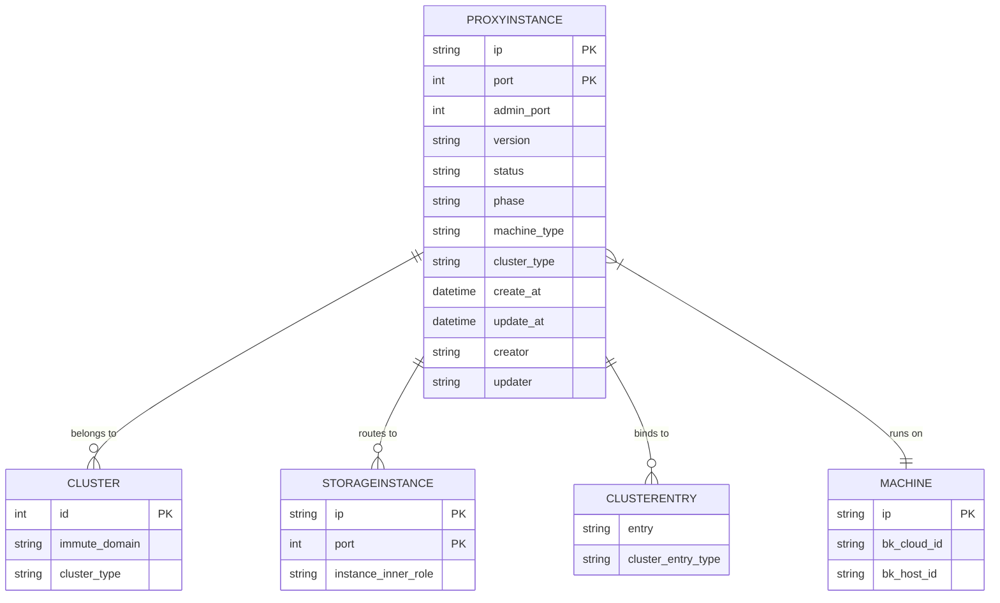
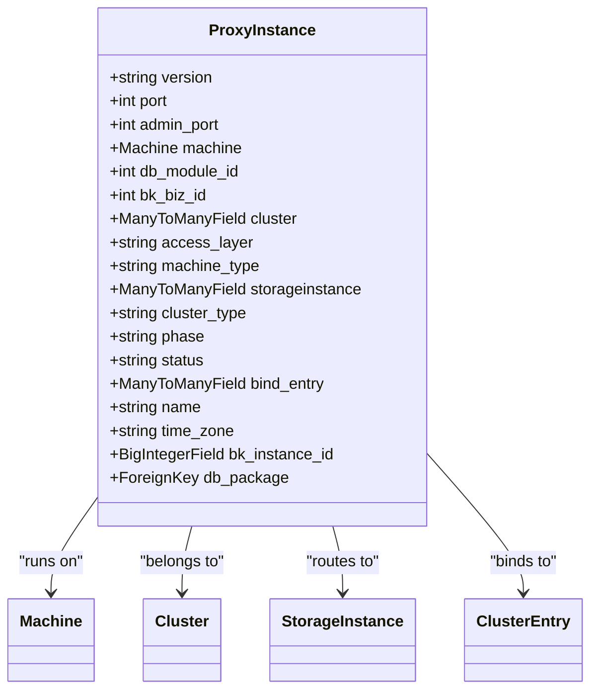
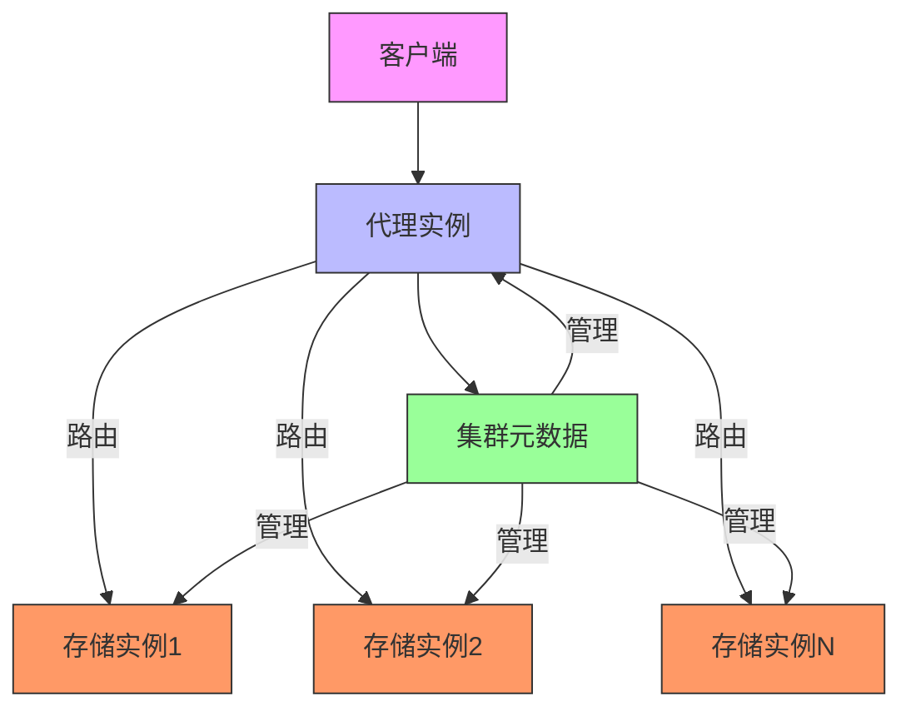
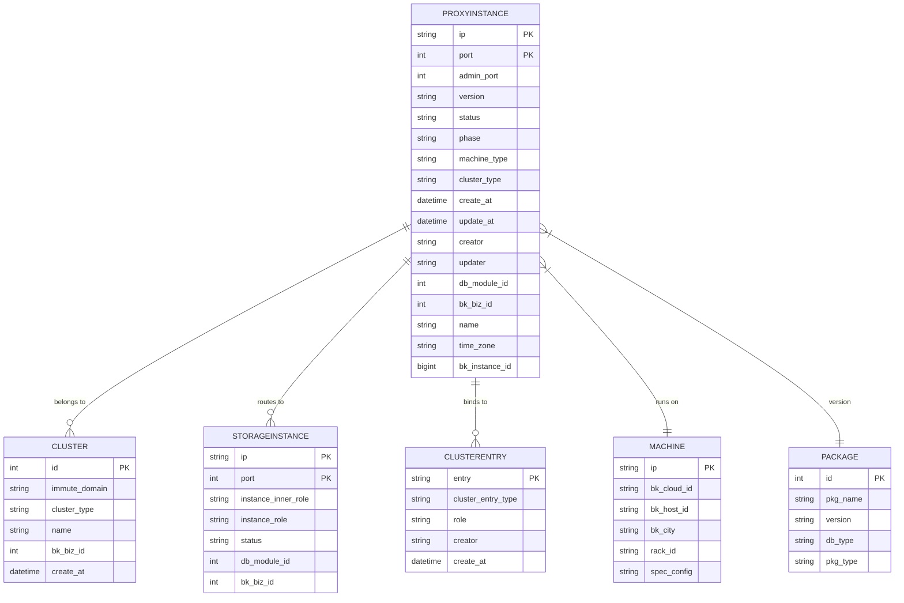
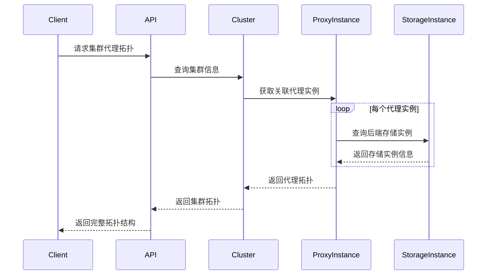

# 代理实例模型

<cite>
**本文档引用的文件**
- [proxy_instance_ext.py](file://dbm-ui/backend/db_meta/models/proxy_instance_ext.py)
- [instance.py](file://dbm-ui/backend/db_meta/models/instance.py)
- [instance_status.py](file://dbm-ui/backend/db_meta/enums/instance_status.py)
- [instance_phase.py](file://dbm-ui/backend/db_meta/enums/instance_phase.py)
- [access_layer.py](file://dbm-ui/backend/db_meta/enums/access_layer.py)
- [machine_type.py](file://dbm-ui/backend/db_meta/enums/machine_type.py)
- [cluster_type.py](file://dbm-ui/backend/db_meta/enums/cluster_type.py)
- [proxy_instance.py](file://dbm-ui/backend/db_meta/request_validator/proxy_instance.py)
- [flatten/proxy_instance.py](file://dbm-ui/backend/db_meta/flatten/proxy_instance.py)
</cite>

## 目录
1. [引言](#引言)
2. [代理实例数据模型](#代理实例数据模型)
3. [核心字段详解](#核心字段详解)
4. [与集群和存储实例的关系](#与集群和存储实例的关系)
5. [负载均衡与读写分离配置](#负载均衡与读写分离配置)
6. [ER图](#er图)
7. [查询集群代理拓扑结构](#查询集群代理拓扑结构)

## 引言
代理实例（ProxyInstance）是数据库管理系统中的关键组件，作为客户端与后端存储实例之间的中间层，负责流量转发、负载均衡和读写分离等功能。本文档详细描述了代理实例的数据模型，包括其核心字段、与集群和存储实例的关系，以及在数据库访问链路中的作用。

## 代理实例数据模型
代理实例模型定义了代理服务的元数据信息，包括网络配置、状态、版本等。该模型通过Django ORM实现，继承自`InstanceMixin`和`AuditedModel`，确保了实例的通用属性和审计功能。



**图源**
- [instance.py](file://dbm-ui/backend/db_meta/models/instance.py#L165-L210)
- [cluster_type.py](file://dbm-ui/backend/db_meta/enums/cluster_type.py#L19-L168)

## 核心字段详解
代理实例模型包含以下核心字段：

- **IP与端口**：通过`machine.ip`和`port`字段定义代理实例的网络地址。`admin_port`字段用于管理接口。
- **代理类型**：通过`machine_type`字段标识代理类型，支持`spider`、`proxy`、`twemproxy`、`predixy`等。
- **版本**：`version`字段记录代理实例的软件版本。
- **状态**：`status`字段表示实例运行状态，包括`running`、`unavailable`、`available`等。
- **阶段**：`phase`字段表示实例生命周期阶段，如`online`、`offline`、`upgrading`等。



**图源**
- [instance.py](file://dbm-ui/backend/db_meta/models/instance.py#L165-L210)
- [machine_type.py](file://dbm-ui/backend/db_meta/enums/machine_type.py#L16-L75)

## 与集群和存储实例的关系
代理实例与集群（Cluster）和存储实例（StorageInstance）之间存在多对多关系，这是数据库访问链路的核心。

### 与集群的关系
每个代理实例可以属于多个集群，通过`cluster`多对多字段关联。这种设计支持代理实例在多个集群间共享，提高资源利用率。

```python
# 在代码中添加代理实例到集群
cluster.proxyinstance_set.add(*proxy_objs)
```

### 与存储实例的关系
代理实例通过`storageinstance`多对多字段关联后端存储实例，定义了流量转发的目标。

```python
# 获取代理实例关联的存储实例
for backend_instance in proxy_instance.storageinstance.all():
    # 处理后端实例
    pass
```



**图源**
- [instance.py](file://dbm-ui/backend/db_meta/models/instance.py#L173-L178)
- [switch_proxy.py](file://dbm-ui/backend/db_meta/api/cluster/tendbha/switch_proxy.py#L24-L53)

## 负载均衡与读写分离配置
代理实例的负载均衡和读写分离配置主要通过以下方式实现：

1. **配置文件生成**：在代理实例部署时，根据集群配置生成相应的代理配置文件。
2. **后端实例映射**：通过`storageinstance`关系确定后端实例列表。
3. **访问层控制**：通过`access_layer`字段区分不同类型的接入层。

对于Twemproxy和Predixy等代理，配置信息存储在DBConfig中，包括：
- `servers`：后端实例列表
- `password`：认证密码
- `redis_password`：Redis认证密码
- `conf_configs`：特定配置参数

```python
# 生成Twemproxy配置
instConfig.NosqlProxy.Servers = newServers
instConfig.NosqlProxy.Password = job.params.Password
instConfig.NosqlProxy.RedisPassword = job.params.RedisPassword
```

**本节源**
- [twemproxy_install.go](file://dbm-services/redis/db-tools/dbactuator/pkg/atomjobs/atomproxy/twemproxy_install.go#L406-L435)
- [proxy_reuse.go](file://dbm-services/redis/db-tools/dbactuator/pkg/atomjobs/atomproxy/proxy_reuse.go#L219-L265)

## ER图
以下是代理实例的完整ER图，展示了其与相关实体的关系。



**图源**
- [instance.py](file://dbm-ui/backend/db_meta/models/instance.py#L165-L210)
- [cluster_type.py](file://dbm-ui/backend/db_meta/enums/cluster_type.py#L19-L168)
- [machine_type.py](file://dbm-ui/backend/db_meta/enums/machine_type.py#L16-L75)

## 查询集群代理拓扑结构
查询某个集群的代理拓扑结构可以通过以下步骤实现：

1. 获取集群对象
2. 查询关联的代理实例
3. 获取每个代理实例的后端存储实例
4. 构建拓扑图

```python
def get_cluster_proxy_topology(cluster_id):
    """
    获取集群的代理拓扑结构
    """
    cluster = Cluster.objects.get(id=cluster_id)
    proxy_instances = cluster.proxyinstance_set.all()
    
    topology = {}
    for proxy in proxy_instances:
        backend_instances = []
        for storage in proxy.storageinstance.all():
            backend_instances.append({
                'ip': storage.machine.ip,
                'port': storage.port,
                'role': storage.instance_inner_role
            })
        
        topology[proxy.ip_port] = {
            'admin_port': proxy.admin_port,
            'status': proxy.status,
            'backends': backend_instances
        }
    
    return topology
```



**图源**
- [flatten/proxy_instance.py](file://dbm-ui/backend/db_meta/flatten/proxy_instance.py#L21-L62)
- [detail.py](file://dbm-ui/backend/db_meta/api/cluster/tendbha/detail.py#L73-L83)