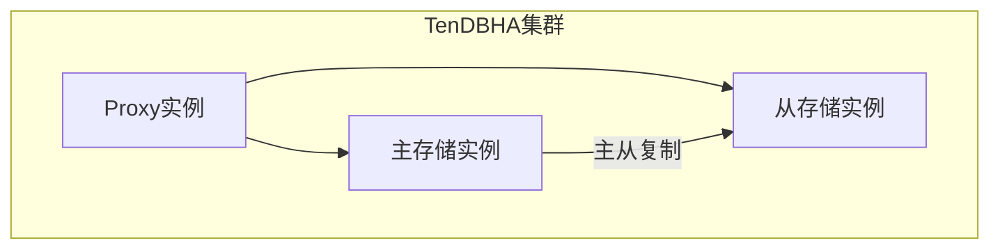
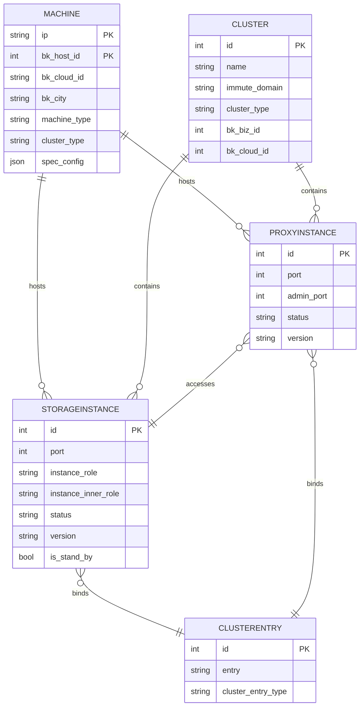

# 存储实例模型

<cite>
**本文档引用的文件**
- [instance.py](file://dbm-ui/backend/db_meta/models/instance.py)
- [cluster.py](file://dbm-ui/backend/db_meta/models/cluster.py)
- [machine.py](file://dbm-ui/backend/db_meta/models/machine.py)
- [instance_role.py](file://dbm-ui/backend/db_meta/enums/instance_role.py)
- [instance_status.py](file://dbm-ui/backend/db_meta/enums/instance_status.py)
- [instance_inner_role.py](file://dbm-ui/backend/db_meta/enums/instance_inner_role.py)
- [storage_instance/apis.py](file://dbm-ui/backend/db_meta/api/storage_instance/apis.py)
- [spec_init.json](file://dbm-ui/backend/db_meta/init/spec_init.json)
</cite>

## 目录
1. [简介](#简介)
2. [存储实例字段详解](#存储实例字段详解)
3. [关联关系](#关联关系)
4. [高可用架构在数据模型中的体现](#高可用架构在数据模型中的体现)
5. [实例配置参数存储](#实例配置参数存储)
6. [ORM操作示例](#orm操作示例)
7. [存储实例ER图](#存储实例er图)

## 简介
存储实例（StorageInstance）是蓝鲸智云-DB管理系统（BlueKing-BK-DBM）中的核心数据模型之一，用于表示数据库存储节点的元数据信息。该模型不仅记录了实例的基本属性，如端口、状态、角色等，还通过与集群（Cluster）、机器（Machine）和代理实例（ProxyInstance）的关联，构建了完整的数据库拓扑结构。本文档详细描述了StorageInstance实体的各个字段、关联关系以及在高可用架构中的作用。

## 存储实例字段详解
存储实例模型（StorageInstance）定义了数据库实例的详细信息，其主要字段包括：

- **端口（port）**: 实例监听的端口号，类型为正整数。
- **实例角色（instance_role）**: 实例的逻辑角色，如主节点（BACKEND_MASTER）、从节点（BACKEND_SLAVE）等，具体值由InstanceRole枚举定义。
- **实例内部角色（instance_inner_role）**: 实例在集群内部的角色，如master、slave等，具体值由InstanceInnerRole枚举定义。
- **实例状态（status）**: 实例的当前运行状态，如运行中（RUNNING）、不可用（UNAVAILABLE）等，具体值由InstanceStatus枚举定义。
- **所属集群（cluster）**: 多对多关系，表示实例所属的一个或多个集群。
- **所在机器（machine）**: 外键关联，指向实例所在的物理或虚拟机器。
- **版本号（version）**: 实例的数据库软件版本。
- **时区（time_zone）**: 实例所在的时区，默认为系统默认时区。
- **是否备选（is_stand_by）**: 布尔值，表示该实例是否可作为故障转移的备选节点。

**Section sources**
- [instance.py](file://dbm-ui/backend/db_meta/models/instance.py#L114-L137)

## 关联关系
存储实例与系统中的其他核心实体存在紧密的关联关系，这些关系构成了数据库管理系统的拓扑结构。

### 与集群的关联
每个存储实例通过多对多关系与一个或多个集群关联。这种设计允许实例在不同的集群配置中复用，提高了资源利用率。集群模型（Cluster）通过storageinstance_set反向访问其所有存储实例。

### 与机器的关联
存储实例与机器（Machine）之间是一对一的外键关系。每个实例必须部署在一台具体的机器上，通过machine字段关联。机器模型（Machine）通过storageinstance_set反向访问其上部署的所有存储实例。

### 与代理实例的关联
在高可用架构中，代理实例（ProxyInstance）作为接入层，与后端的存储实例形成关联。代理实例通过多对多关系（storageinstance）关联到其后端的存储实例。例如，在TenDBHA集群中，proxy实例必须且只能关联到master角色的存储实例。

**Section sources**
- [instance.py](file://dbm-ui/backend/db_meta/models/instance.py#L114-L211)
- [cluster.py](file://dbm-ui/backend/db_meta/models/cluster.py#L57-L200)
- [machine.py](file://dbm-ui/backend/db_meta/models/machine.py#L34-L200)

## 高可用架构在数据模型中的体现
存储实例模型通过实例角色和状态字段，清晰地体现了系统的高可用架构。

### 主从复制
在主从复制架构中，通过instance_inner_role字段区分主节点（MASTER）和从节点（SLAVE）。系统通过监控这些实例的状态（status），在主节点故障时自动触发故障转移，将一个从节点提升为新的主节点。

### 集群模式
对于TenDBCluster等分布式集群，模型通过cluster_type字段标识集群类型，并通过instance_role字段区分不同的角色，如REMOTE_MASTER、REMOTE_SLAVE等。这种设计支持复杂的集群拓扑，如一主多从、多主多从等。



**Diagram sources**
- [instance.py](file://dbm-ui/backend/db_meta/models/instance.py#L114-L137)
- [cluster.py](file://dbm-ui/backend/db_meta/models/cluster.py#L57-L200)

## 实例配置参数存储
实例的配置参数主要通过以下方式存储：

- **规格配置（spec_config）**: 存储在机器（Machine）模型的spec_config字段中，为JSON格式，包含CPU、内存、存储等资源配置。
- **版本管理（db_package）**: 通过外键关联到db_package.Package，记录实例使用的软件包版本。
- **系统信息（system_info）**: 存储在机器模型的system_info字段中，为JSON格式，包含操作系统、硬件等信息。

此外，系统还通过spec_init.json文件预定义了各种实例规格模板，供实例创建时选择。

**Section sources**
- [machine.py](file://dbm-ui/backend/db_meta/models/machine.py#L57)
- [spec_init.json](file://dbm-ui/backend/db_meta/init/spec_init.json)

## ORM操作示例
以下示例展示了如何通过Django ORM进行存储实例的故障转移和扩容操作。

### 故障转移
```python
# 在TenDBHA集群中切换主从角色
def switch_slave_role(cluster_id, source_ip, source_port, target_ip, target_port):
    cluster = Cluster.objects.get(id=cluster_id)
    source_storage = StorageInstance.objects.get(machine__ip=source_ip, port=source_port)
    target_storage = StorageInstance.objects.get(machine__ip=target_ip, port=target_port)
    
    # 更新实例角色
    source_storage.instance_inner_role = InstanceInnerRole.SLAVE
    target_storage.instance_inner_role = InstanceInnerRole.MASTER
    
    # 更新集群拓扑
    cluster.storageinstance_set.remove(source_storage)
    cluster.storageinstance_set.add(target_storage)
    
    # 保存更改
    source_storage.save()
    target_storage.save()
```

### 扩容
```python
# 为集群添加新的存储实例
def add_storage_instance(cluster_id, machine_ip, port, role):
    cluster = Cluster.objects.get(id=cluster_id)
    machine = Machine.objects.get(ip=machine_ip)
    
    # 创建新的存储实例
    new_storage = StorageInstance.objects.create(
        port=port,
        machine=machine,
        instance_role=role,
        instance_inner_role=InstanceRoleInstanceInnerRoleMap[role],
        cluster_type=cluster.cluster_type,
        status=InstanceStatus.UNAVAILABLE
    )
    
    # 将实例加入集群
    cluster.storageinstance_set.add(new_storage)
    
    return new_storage
```

**Section sources**
- [switch_slave.py](file://dbm-ui/backend/db_meta/api/cluster/tendbha/switch_slave.py#L48-L56)
- [apis.py](file://dbm-ui/backend/db_meta/api/storage_instance/apis.py#L57-L80)

## 存储实例ER图


**Diagram sources**
- [instance.py](file://dbm-ui/backend/db_meta/models/instance.py#L114-L137)
- [cluster.py](file://dbm-ui/backend/db_meta/models/cluster.py#L57-L200)
- [machine.py](file://dbm-ui/backend/db_meta/models/machine.py#L34-L200)