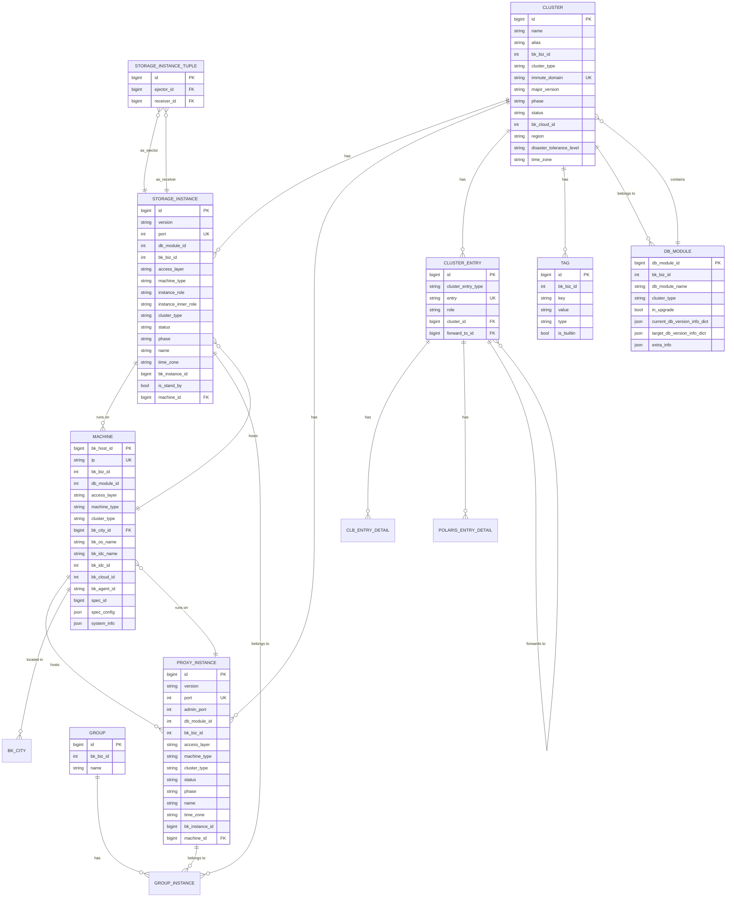

# 数据模型与ORM映射

<cite>
**本文档引用的文件**   
- [cluster.py](file://dbm-ui/backend/db_meta/models/cluster.py)
- [machine.py](file://dbm-ui/backend/db_meta/models/machine.py)
- [instance.py](file://dbm-ui/backend/db_meta/models/instance.py)
- [storage_instance_tuple.py](file://dbm-ui/backend/db_meta/models/storage_instance_tuple.py)
- [group.py](file://dbm-ui/backend/db_meta/models/group.py)
- [tag.py](file://dbm-ui/backend/db_meta/models/tag.py)
- [cluster_entry.py](file://dbm-ui/backend/db_meta/models/cluster_entry.py)
- [db_module.py](file://dbm-ui/backend/db_meta/models/db_module.py)
- [0001_initial.py](file://dbm-ui/backend/db_meta/migrations/0001_initial.py)
- [0018_extraprocessinstance.py](file://dbm-ui/backend/db_meta/migrations/0018_extraprocessinstance.py)
- [0033_clusterdbhaext.py](file://dbm-ui/backend/db_meta/migrations/0033_clusterdbhaext.py)
</cite>

## 目录
1. [引言](#引言)
2. [核心数据实体](#核心数据实体)
3. [实体关系图(ERD)](#实体关系图erd)
4. [数据模型演变历史](#数据模型演变历史)
5. [Django ORM使用与查询优化](#django-orm使用与查询优化)
6. [数据生命周期管理](#数据生命周期管理)

## 引言

蓝鲸智云-DB管理系统（BlueKing-BK-DBM）是一个全面的数据库管理平台，其数据模型设计旨在支持多种数据库类型的集群化管理。本文档深入分析了平台的核心数据模型，重点关注`Cluster`（集群）、`Machine`（机器）、`StorageInstance`（存储实例）和`ProxyInstance`（代理实例）等关键实体。通过详细阐述这些实体之间的关系、关键字段以及Django ORM的使用方式，本文档为开发者和系统管理员提供了理解平台数据架构的全面指南。

## 核心数据实体

### 集群 (Cluster)

`Cluster`是平台的核心实体，代表一个逻辑上的数据库集群。它封装了所有与特定数据库集群相关的配置和元数据。

**关键字段：**
- `name` (CharField): 集群的英文名。
- `alias` (CharField): 集群的别名，用于用户识别。
- `bk_biz_id` (IntegerField): 关联的业务ID。
- `cluster_type` (CharField): 集群类型，如`TenDBHA`、`TenDBCluster`等，定义了集群的架构。
- `immute_domain` (CharField): 集群的不变域名，作为集群的唯一访问入口，是集群最重要的标识。
- `major_version` (CharField): 数据库的主版本号。
- `phase` (CharField): 集群的生命周期阶段，如`online`（在线）、`offline`（离线）。
- `status` (CharField): 集群的运行状态，如`normal`（正常）、`abnormal`（异常）。
- `bk_cloud_id` (IntegerField): 云区域ID，用于区分不同云环境。
- `region` (CharField): 集群所在的物理地域。
- `disaster_tolerance_level` (CharField): 容灾要求等级。
- `time_zone` (CharField): 集群所在的时区。

**Section sources**
- [cluster.py](file://dbm-ui/backend/db_meta/models/cluster.py#L57-L80)

### 机器 (Machine)

`Machine`实体代表物理或虚拟的服务器主机，是所有数据库实例的运行载体。

**关键字段：**
- `ip` (GenericIPAddressField): 机器的IP地址。
- `bk_host_id` (PositiveBigIntegerField): 主机在配置中心（CMDB）中的唯一ID，作为主键。
- `bk_biz_id` (IntegerField): 所属业务ID。
- `access_layer` (CharField): 接入层，如`core`（核心）、`edge`（边缘）。
- `machine_type` (CharField): 机器类型，如`backend`（后端存储）、`proxy`（代理）、`redis_slave`（Redis从节点）等。
- `cluster_type` (CharField): 该机器所属的集群类型。
- `bk_city` (ForeignKey): 外键关联到`BKCity`，表示机器所在的城市。
- `bk_os_name` (CharField): 操作系统名称。
- `bk_idc_name` (CharField): 机房名称。
- `bk_cloud_id` (IntegerField): 云区域ID。
- `bk_agent_id` (CharField): GSE Agent ID。
- `spec_id` (PositiveBigIntegerField): 虚拟规格ID。
- `spec_config` (JSONField): 当前的虚拟规格配置，以JSON格式存储。
- `system_info` (JSONField): 采集的机器系统信息，如CPU、内存、磁盘等。

**Section sources**
- [machine.py](file://dbm-ui/backend/db_meta/models/machine.py#L34-L62)

### 存储实例 (StorageInstance) 与 代理实例 (ProxyInstance)

`StorageInstance`和`ProxyInstance`都继承自`InstanceMixin`，代表运行在`Machine`上的具体数据库服务进程。

#### 存储实例 (StorageInstance)

`StorageInstance`通常指数据库的存储节点，如MySQL实例、Redis实例等。

**关键字段：**
- `port` (PositiveIntegerField): 实例监听的端口。
- `machine` (ForeignKey): 外键关联到`Machine`，表示实例所在的主机。
- `instance_role` (CharField): 实例角色，如`master`（主）、`slave`（从）、`single`（单点）。
- `instance_inner_role` (CharField): 实例内部角色，用于更精细的区分，如`orphan`（孤儿实例）。
- `status` (CharField): 实例的运行状态。
- `is_stand_by` (BooleanField): 标志位，用于多从节点场景下的备选标志。
- `cluster` (ManyToManyField): 多对多关系，关联到`Cluster`，一个实例可以属于多个集群（在特定场景下）。
- `bind_entry` (ManyToManyField): 多对多关系，关联到`ClusterEntry`，表示实例绑定的访问入口。

**Section sources**
- [instance.py](file://dbm-ui/backend/db_meta/models/instance.py#L114-L145)

#### 代理实例 (ProxyInstance)

`ProxyInstance`指数据库的代理层，如TendbCluster的Spider、Redis的Twemproxy/Predixy等。

**关键字段：**
- `port` (PositiveIntegerField): 代理服务监听的端口。
- `admin_port` (PositiveIntegerField): 代理管理端口。
- `machine` (ForeignKey): 外键关联到`Machine`。
- `storageinstance` (ManyToManyField): 多对多关系，关联到`StorageInstance`，表示该代理后端连接的存储实例。
- `cluster` (ManyToManyField): 多对多关系，关联到`Cluster`。

**Section sources**
- [instance.py](file://dbm-ui/backend/db_meta/models/instance.py#L165-L197)

### 存储实例元组对 (StorageInstanceTuple)

`StorageInstanceTuple`是一个关系表，用于描述主从复制关系。

**关键字段：**
- `ejector` (ForeignKey): 外键，指向作为主节点的`StorageInstance`。
- `receiver` (ForeignKey): 外键，指向作为从节点的`StorageInstance`。

该表通过`ejector`和`receiver`的组合唯一性约束，确保了主从关系的唯一性。

**Section sources**
- [storage_instance_tuple.py](file://dbm-ui/backend/db_meta/models/storage_instance_tuple.py#L18-L38)

### 分组 (Group) 与 标签 (Tag)

#### 分组 (Group)

`Group`用于对实例进行逻辑分组管理。

**关键字段：**
- `bk_biz_id` (IntegerField): 所属业务ID。
- `name` (CharField): 分组名称。

`GroupInstance`是`Group`和`Instance`（通过`instance_id`）之间的多对多关系表。

**Section sources**
- [group.py](file://dbm-ui/backend/db_meta/models/group.py#L17-L40)

#### 标签 (Tag)

`Tag`用于对集群、实例等资源进行灵活的标签化管理。

**关键字段：**
- `bk_biz_id` (IntegerField): 所属业务ID。
- `key` (CharField): 标签键。
- `value` (CharField): 标签值。
- `type` (CharField): 标签类型。
- `is_builtin` (BooleanField): 是否为内置标签。

**Section sources**
- [tag.py](file://dbm-ui/backend/db_meta/models/tag.py#L19-L28)

### 集群访问入口 (ClusterEntry)

`ClusterEntry`代表集群的访问入口，支持多种类型。

**关键字段：**
- `cluster` (ForeignKey): 外键关联到`Cluster`。
- `cluster_entry_type` (CharField): 入口类型，如`dns`（DNS）、`clb`（负载均衡）、`polaris`（北极星服务发现）。
- `entry` (CharField): 入口地址，如域名或IP。
- `forward_to` (ForeignKey): 可选的外键，指向另一个`ClusterEntry`，用于实现入口的转发（如DNS指向CLB）。
- `role` (CharField): 入口角色，如`master_entry`（主入口）、`slave_entry`（从入口）。

**Section sources**
- [cluster_entry.py](file://dbm-ui/backend/db_meta/models/cluster_entry.py#L27-L54)

### DB模块 (DBModule)

`DBModule`是业务和数据库集群类型之间的逻辑模块，用于组织和管理数据库资源。

**关键字段：**
- `bk_biz_id` (IntegerField): 所属业务ID。
- `db_module_name` (CharField): 模块名称。
- `db_module_id` (BigAutoField): 模块的唯一ID。
- `cluster_type` (CharField): 关联的集群类型。
- `current_db_version_info_dict` (JSONField): 存储当前数据库版本信息的JSON字典。
- `target_db_version_info_dict` (JSONField): 存储目标数据库版本信息的JSON字典，用于版本升级。

**Section sources**
- [db_module.py](file://dbm-ui/backend/db_meta/models/db_module.py#L40-L61)

## 实体关系图(ERD)

**Diagram sources **
- [cluster.py](file://dbm-ui/backend/db_meta/models/cluster.py)
- [machine.py](file://dbm-ui/backend/db_meta/models/machine.py)
- [instance.py](file://dbm-ui/backend/db_meta/models/instance.py)
- [storage_instance_tuple.py](file://dbm-ui/backend/db_meta/models/storage_instance_tuple.py)
- [group.py](file://dbm-ui/backend/db_meta/models/group.py)
- [tag.py](file://dbm-ui/backend/db_meta/models/tag.py)
- [cluster_entry.py](file://dbm-ui/backend/db_meta/models/cluster_entry.py)
- [db_module.py](file://dbm-ui/backend/db_meta/models/db_module.py)

## 数据模型演变历史

平台的数据模型通过Django的迁移文件（migrations）进行版本化管理，确保了数据库结构的平滑演进。

### 初始模型 (0001_initial.py)
初始迁移文件创建了所有核心表，包括`Cluster`、`Machine`、`StorageInstance`、`ProxyInstance`、`ClusterEntry`、`Tag`等。这奠定了整个数据模型的基础。

### 关键演变
- **0018_extraprocessinstance.py**: 在2023年8月24日，引入了`ExtraProcessInstance`模型。该模型用于记录集群中除标准存储和代理之外的额外进程实例，如中控节点（tdbctl），增强了对复杂集群架构的支持。
- **0033_clusterdbhaext.py**: 在2024年4月23日，引入了`ClusterDBHAExt`模型。这是一个与`Cluster`一对一关联的扩展表，专门用于存储TenDB HA集群的特定扩展信息，如高可用屏蔽的开始和结束时间。这体现了将特定功能的字段分离到独立表中的设计模式，保持了核心`Cluster`表的简洁性。

这些迁移文件清晰地展示了数据模型如何随着业务需求的增长而逐步完善。

**Section sources**
- [0001_initial.py](file://dbm-ui/backend/db_meta/migrations/0001_initial.py)
- [0018_extraprocessinstance.py](file://dbm-ui/backend/db_meta/migrations/0018_extraprocessinstance.py)
- [0033_clusterdbhaext.py](file://dbm-ui/backend/db_meta/migrations/0033_clusterdbhaext.py)

## Django ORM使用与查询优化

平台广泛使用Django ORM来操作数据库，结合了其易用性和灵活性。

### ORM使用方式
- **继承与Mixin**: `StorageInstance`和`ProxyInstance`都继承自`AuditedModel`（包含创建/更新人、时间戳等审计字段）和`InstanceMixin`（提供实例通用方法，如`ip_port`属性）。这种设计实现了代码复用。
- **外键与多对多关系**: 广泛使用`ForeignKey`和`ManyToManyField`来建立实体间的关联。例如，`StorageInstance`通过`machine`外键与`Machine`关联，并通过`cluster`多对多字段与`Cluster`关联。
- **自定义方法**: 在模型中定义了大量业务逻辑方法。例如，`Cluster`模型中的`get_partition_port()`方法根据集群类型返回不同的端口号，`Machine`模型中的`dbm_meta`属性动态生成用于Agent的元数据。

### 查询优化技巧
- **select_related()**: 用于预取外键关联的对象，避免N+1查询。例如，在查询`StorageInstance`时，使用`select_related('machine')`可以一次性获取实例及其所在机器的信息。
- **prefetch_related()**: 用于预取多对多或反向外键关联的对象。例如，获取一个`Cluster`并预取其所有的`storageinstance_set`和`proxyinstance_set`。
- **values() 和 values_list()**: 当只需要特定字段时，使用这些方法可以减少内存占用和网络传输。例如，`Cluster.objects.values_list('id', 'immute_domain')`只返回ID和域名。
- **批量操作**: 使用`bulk_create()`和`bulk_update()`进行批量数据操作，显著提升性能。例如，在同步大量主机信息时，使用`Machine.objects.bulk_create()`。
- **索引优化**: 在频繁查询的字段上创建了数据库索引。例如，`Cluster`表的`immute_domain`字段有`db_index=True`，`Machine`表的`ip`和`bk_cloud_id`组合有唯一性约束和索引。

**Section sources**
- [cluster.py](file://dbm-ui/backend/db_meta/models/cluster.py)
- [machine.py](file://dbm-ui/backend/db_meta/models/machine.py)
- [instance.py](file://dbm-ui/backend/db_meta/models/instance.py)

## 数据生命周期管理

平台通过多种机制实现数据的生命周期管理。

### 软删除
平台并未直接使用Django的`SoftDelete`模式，而是通过`status`字段来管理实体的状态。例如，`Cluster`和`Instance`都有`status`字段，其值可以是`normal`、`abnormal`、`deleted`等。当需要“删除”一个资源时，实际上是将其`status`更新为`deleted`，而不是从数据库中物理移除。这允许在需要时进行数据恢复和审计追踪。

### 数据归档
虽然核心模型中没有直接体现归档逻辑，但数据生命周期管理主要通过以下方式实现：
- **迁移文件**: 历史迁移文件本身就是一种数据结构的“归档”，记录了模型的演变过程。
- **状态标记**: 通过`phase`（阶段）和`status`（状态）字段，可以轻松查询出已下线（`phase=offline`）或已删除（`status=deleted`）的集群和实例，便于进行后续的清理或归档操作。
- **外部系统集成**: 对于更复杂的归档需求，平台可能依赖外部系统（如备份系统、日志系统）来处理历史数据，而DBM平台主要负责元数据的管理和状态追踪。

**Section sources**
- [cluster.py](file://dbm-ui/backend/db_meta/models/cluster.py#L66)
- [instance.py](file://dbm-ui/backend/db_meta/models/instance.py#L128)