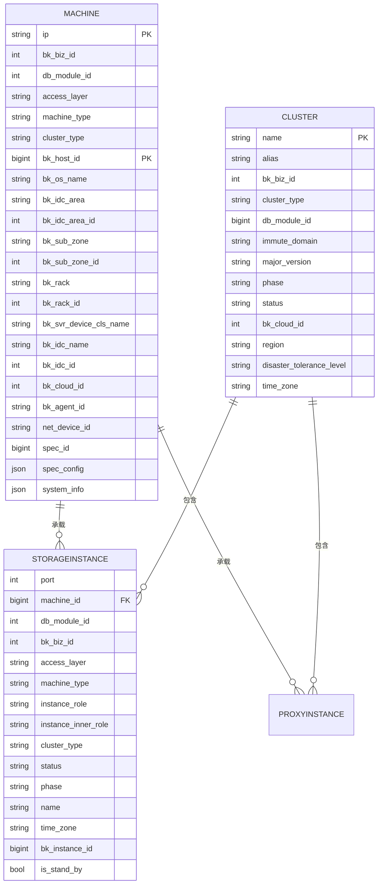
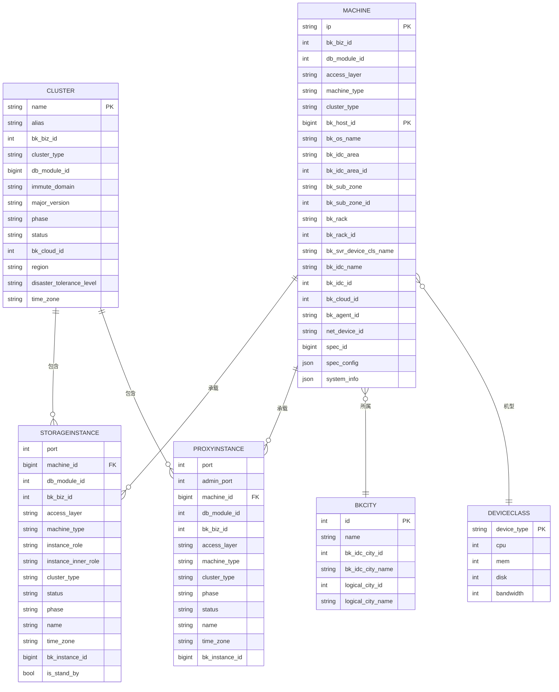

# 机器模型

<cite>
**本文档引用的文件**
- [machine.py](file://dbm-ui/backend/db_meta/models/machine.py)
- [cluster.py](file://dbm-ui/backend/db_meta/models/cluster.py)
- [instance.py](file://dbm-ui/backend/db_meta/models/instance.py)
- [machine_type.py](file://dbm-ui/backend/db_meta/enums/machine_type.py)
- [rs_list.go](file://dbm-services/common/db-resource/internal/controller/manage/rs_list.go)
- [constants.py](file://dbm-ui/backend/db_dirty/constants.py)
</cite>

## 目录
1. [机器实体关键字段](#机器实体关键字段)
2. [机器与集群、存储实例的关系](#机器与集群存储实例的关系)
3. [机器资源分配与状态管理](#机器资源分配与状态管理)
4. [机器资源池管理策略](#机器资源池管理策略)
5. [查询机器上运行的数据库实例](#查询机器上运行的数据库实例)
6. [机器实体ER图](#机器实体er图)

## 机器实体关键字段

机器（Machine）实体是数据库管理系统中的核心基础设施单元，用于描述物理或虚拟服务器的详细信息。该实体包含以下关键字段：

- **IP地址** (`ip`): 机器的IP地址，与云区域ID共同构成唯一性约束
- **业务ID** (`bk_biz_id`): 机器所属的业务ID
- **数据库模块ID** (`db_module_id`): 机器所属的数据库模块ID
- **接入层** (`access_layer`): 机器的接入层类型，如核心层、汇聚层等
- **机器类型** (`machine_type`): 机器的类型，如后端、代理、单实例等
- **集群类型** (`cluster_type`): 机器所属的集群类型
- **主机ID** (`bk_host_id`): 机器在配置中心（CMDB）中的主机ID，作为主键
- **操作系统** (`bk_os_name`): 机器的操作系统名称
- **区域** (`bk_idc_area`): 机器所在的区域
- **区域ID** (`bk_idc_area_id`): 机器所在区域的ID
- **子Zone** (`bk_sub_zone`): 机器所在的子Zone
- **子ZoneID** (`bk_sub_zone_id`): 机器所在子Zone的ID
- **机架** (`bk_rack`): 机器所在的机架
- **机架ID** (`bk_rack_id`): 机器所在机架的ID
- **标准设备类型** (`bk_svr_device_cls_name`): 机器的标准设备类型
- **机房** (`bk_idc_name`): 机器所在的机房名称
- **机房ID** (`bk_idc_id`): 机器所在机房的ID
- **云区域ID** (`bk_cloud_id`): 机器所在的云区域ID
- **AgentID** (`bk_agent_id`): 机器的Agent ID
- **网络设备ID** (`net_device_id`): 机器的网络设备ID
- **虚拟规格ID** (`spec_id`): 机器的虚拟规格ID
- **虚拟规格配置** (`spec_config`): 机器当前的虚拟规格配置，以JSON格式存储
- **系统信息** (`system_info`): 机器采集的系统信息，以JSON格式存储
- **逻辑城市** (`bk_city`): 机器所属的逻辑城市，外键关联BKCity表

**Section sources**
- [machine.py](file://dbm-ui/backend/db_meta/models/machine.py#L34-L59)

## 机器与集群、存储实例的关系

机器实体与集群（Cluster）和存储实例（StorageInstance）之间存在多对多的复杂关系。这些关系通过中间表进行管理，确保了数据的一致性和完整性。

机器与集群的关系是间接的，通过存储实例（StorageInstance）和代理实例（ProxyInstance）作为桥梁。一个机器可以承载多个存储实例，而每个存储实例又可以属于多个集群。这种设计允许灵活的资源分配和高可用架构的实现。



**Diagram sources**
- [machine.py](file://dbm-ui/backend/db_meta/models/machine.py#L34-L59)
- [cluster.py](file://dbm-ui/backend/db_meta/models/cluster.py#L57-L80)
- [instance.py](file://dbm-ui/backend/db_meta/models/instance.py#L114-L137)

## 机器资源分配与状态管理

机器的资源分配和状态管理是数据库管理系统的核心功能之一。系统通过多种状态来跟踪机器的生命周期和使用情况。

机器的状态主要分为以下几种：
- **空闲**：机器未被分配给任何业务，可以被申请使用
- **已分配**：机器已被分配给特定业务或集群使用
- **维护中**：机器处于维护状态，暂时不可用
- **故障**：机器出现故障，需要维修或更换

系统通过`Machine`模型中的`status`字段来管理机器的状态。同时，通过`spec_id`和`spec_config`字段来管理机器的虚拟规格配置，实现资源的动态分配和调整。

机器的状态转换通过事件驱动的方式进行管理。例如，当机器被导入资源池时，会触发`ImportResource`事件；当机器被申请使用时，会触发`ApplyResource`事件；当机器被退回时，会触发`ReturnResource`事件。

**Section sources**
- [machine.py](file://dbm-ui/backend/db_meta/models/machine.py#L34-L59)
- [constants.py](file://dbm-ui/backend/db_dirty/constants.py#L29-L49)

## 机器资源池管理策略

机器资源池的管理策略旨在实现资源的高效利用和灵活调度。系统通过以下策略来管理机器资源池：

1. **资源查询与过滤**：系统支持根据CPU、内存、磁盘、机型等多种条件查询和过滤机器资源。在`rs_list.go`文件中，`matchSpec`函数实现了根据设备类型、CPU和内存规格匹配机器资源的逻辑。

2. **资源状态管理**：资源池中的机器状态通过`status`字段进行管理。在`rs_list.go`文件中，`queryBs`函数通过`status = Unused`条件查询未使用的机器资源。

3. **资源分配与回收**：系统支持将机器资源分配给特定业务，并在使用完毕后回收资源。资源的分配和回收通过事件驱动的方式进行管理，确保了资源状态的一致性。

4. **资源规格管理**：系统支持定义和管理机器的虚拟规格。通过`DeviceClass`模型，可以定义不同机型的CPU、内存、磁盘等规格，并实现机型的同步和管理。

5. **资源归属管理**：系统支持管理机器资源的归属业务。通过`dedicated_biz`字段，可以指定机器资源的专属业务，实现资源的隔离和专有使用。

**Section sources**
- [rs_list.go](file://dbm-services/common/db-resource/internal/controller/manage/rs_list.go#L177-L218)
- [machine.py](file://dbm-ui/backend/db_meta/models/machine.py#L214-L249)

## 查询机器上运行的数据库实例

要查询某台机器上运行的所有数据库实例，可以通过以下步骤实现：

1. 首先根据机器的IP地址和云区域ID查询机器对象
2. 然后通过机器对象的外键关系查询其承载的所有存储实例和代理实例
3. 最后将查询结果进行整合和展示

以下是查询机器上运行的数据库实例的代码示例：

```python
def get_instances_on_machine(ip, bk_cloud_id):
    """
    查询指定机器上运行的所有数据库实例
    """
    try:
        # 查询机器对象
        machine = Machine.objects.get(ip=ip, bk_cloud_id=bk_cloud_id)
        
        # 查询机器上的存储实例
        storage_instances = StorageInstance.objects.filter(machine=machine)
        
        # 查询机器上的代理实例
        proxy_instances = ProxyInstance.objects.filter(machine=machine)
        
        # 整合结果
        instances = []
        for storage in storage_instances:
            instances.append({
                'type': 'storage',
                'ip': storage.machine.ip,
                'port': storage.port,
                'cluster_type': storage.cluster_type,
                'instance_role': storage.instance_role,
                'status': storage.status
            })
        
        for proxy in proxy_instances:
            instances.append({
                'type': 'proxy',
                'ip': proxy.machine.ip,
                'port': proxy.port,
                'cluster_type': proxy.cluster_type,
                'access_layer': proxy.access_layer,
                'status': proxy.status
            })
        
        return instances
        
    except Machine.DoesNotExist:
        return []
```

**Section sources**
- [machine.py](file://dbm-ui/backend/db_meta/models/machine.py#L34-L59)
- [instance.py](file://dbm-ui/backend/db_meta/models/instance.py#L114-L137)

## 机器实体ER图



**Diagram sources**
- [machine.py](file://dbm-ui/backend/db_meta/models/machine.py#L34-L59)
- [cluster.py](file://dbm-ui/backend/db_meta/models/cluster.py#L57-L80)
- [instance.py](file://dbm-ui/backend/db_meta/models/instance.py#L114-L137)
- [machine.py](file://dbm-ui/backend/db_meta/models/machine.py#L214-L249)