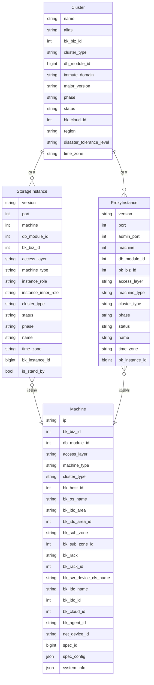
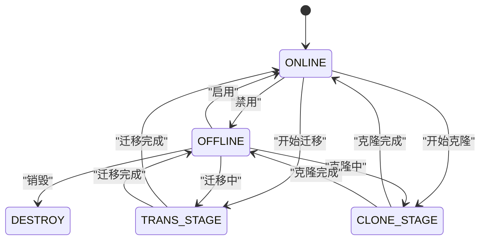
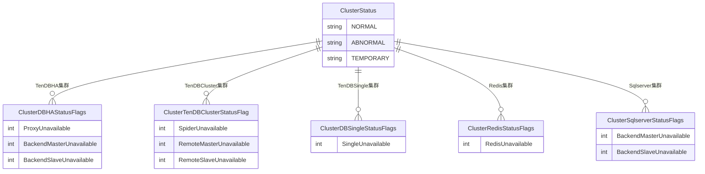
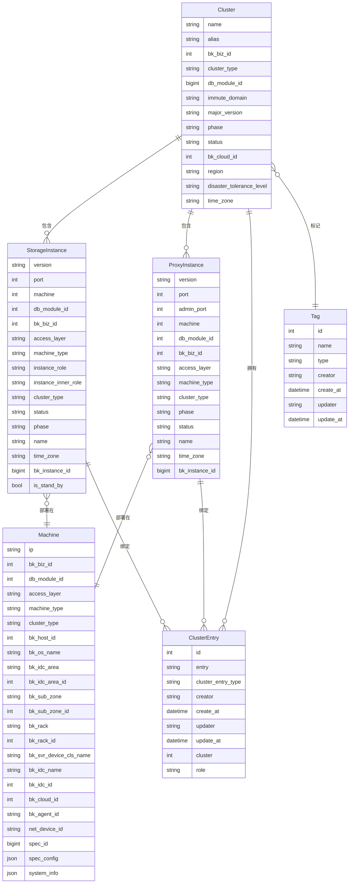

# 集群模型

<cite>
**本文档引用的文件**   
- [cluster.py](file://dbm-ui/backend/db_meta/models/cluster.py)
- [instance.py](file://dbm-ui/backend/db_meta/models/instance.py)
- [machine.py](file://dbm-ui/backend/db_meta/models/machine.py)
- [cluster_type.py](file://dbm-ui/backend/db_meta/enums/cluster_type.py)
- [cluster_status.py](file://dbm-ui/backend/db_meta/enums/cluster_status.py)
- [cluster_phase.py](file://dbm-ui/backend/db_meta/enums/cluster_phase.py)
</cite>

## 目录
1. [集群实体字段说明](#集群实体字段说明)
2. [集群与相关实体的关系](#集群与相关实体的关系)
3. [集群生命周期状态机](#集群生命周期状态机)
4. [集群ER图](#集群er图)
5. [Django ORM查询示例](#django-orm查询示例)
6. [集群配置继承与覆盖机制](#集群配置继承与覆盖机制)

## 集群实体字段说明

集群（Cluster）实体是数据库管理系统中的核心数据模型，用于描述和管理各种类型的数据库集群。以下是Cluster实体的主要字段及其说明：

- **name**: 集群英文名，最大长度64字符
- **alias**: 集群别名，最大长度64字符
- **bk_biz_id**: 业务ID，整数类型
- **cluster_type**: 集群类型，从预定义的枚举值中选择
- **db_module_id**: DB模块ID，长整型
- **immute_domain**: 集群域名，最大长度255字符，建立索引
- **major_version**: 主版本号，最大长度64字符
- **phase**: 集群阶段，表示集群的生命周期阶段
- **status**: 集群状态，表示集群的运行状态
- **bk_cloud_id**: 云区域ID，整数类型
- **region**: 地域，最大长度128字符
- **disaster_tolerance_level**: 容灾要求，从预定义的枚举值中选择
- **time_zone**: 时区，最大长度16字符
- **tags**: 标签，与Tag模型的多对多关系
- **zone_list**: 指定机房列表，JSON格式，空列表代表随机

**Section sources**
- [cluster.py](file://dbm-ui/backend/db_meta/models/cluster.py#L57-L75)

## 集群与相关实体的关系

集群模型与多个相关实体存在一对多的关系，这些关系构成了数据库管理系统的整体架构。

### 集群与机器（Machine）的关系

每个集群包含多个机器实例，机器是集群的物理或虚拟基础。Machine模型包含以下关键字段：
- ip: IP地址
- bk_host_id: 主机ID，作为主键
- bk_cloud_id: 云区域ID
- machine_type: 机器类型
- spec_config: 虚拟规格配置，JSON格式

集群通过存储实例（StorageInstance）和代理实例（ProxyInstance）间接关联到机器。

### 集群与存储实例（StorageInstance）的关系

存储实例是集群中负责数据存储的核心组件。StorageInstance模型的关键字段包括：
- port: 端口号
- machine: 与Machine模型的外键关系
- cluster: 与Cluster模型的多对多关系
- machine_type: 机器类型
- instance_role: 实例角色
- instance_inner_role: 实例内部角色
- status: 实例状态

### 集群与代理实例（ProxyInstance）的关系

代理实例是集群的访问入口，负责请求的转发和负载均衡。ProxyInstance模型的关键字段包括：
- port: 端口号
- admin_port: 管理端口号
- machine: 与Machine模型的外键关系
- cluster: 与Cluster模型的多对多关系
- machine_type: 机器类型
- status: 实例状态



**Diagram sources**
- [cluster.py](file://dbm-ui/backend/db_meta/models/cluster.py#L57-L75)
- [instance.py](file://dbm-ui/backend/db_meta/models/instance.py#L114-L211)
- [machine.py](file://dbm-ui/backend/db_meta/models/machine.py#L34-L62)

## 集群生命周期状态机

集群的生命周期由两个关键枚举类型管理：ClusterPhase（阶段）和ClusterStatus（状态）。

### 集群阶段（ClusterPhase）

集群阶段表示集群在其生命周期中的主要状态：

- **ONLINE**: 正常运行状态，集群可以正常提供服务
- **OFFLINE**: 禁用状态，集群被禁用，不能提供服务
- **DESTROY**: 销毁状态，仅用于单据校验，不实际写入
- **TRANS_STAGE**: SCR/GCS迁移中的中间阶段
- **CLONE_STAGE**: 克隆过程中的中间阶段

集群阶段之间的合法转换关系如下：
- ONLINE → OFFLINE（启用到禁用）
- OFFLINE → ONLINE（禁用到启用）
- OFFLINE → DESTROY（禁用到销毁）



**Diagram sources**
- [cluster_phase.py](file://dbm-ui/backend/db_meta/enums/cluster_phase.py#L16-L44)

### 集群状态（ClusterStatus）

集群状态表示集群的运行健康状况：

- **NORMAL**: 正常状态，集群运行正常
- **ABNORMAL**: 异常状态，集群运行状态异常
- **TEMPORARY**: 临时集群状态，用于spider定点构造的集群

不同类型的集群有不同的状态标志位，用于精确描述集群的健康状况：



**Diagram sources**
- [cluster_status.py](file://dbm-ui/backend/db_meta/enums/cluster_status.py#L19-L59)

## 集群ER图

以下是集群及其相关实体的完整ER图，展示了各个实体之间的关系和属性。



**Diagram sources**
- [cluster.py](file://dbm-ui/backend/db_meta/models/cluster.py#L57-L75)
- [instance.py](file://dbm-ui/backend/db_meta/models/instance.py#L114-L211)
- [machine.py](file://dbm-ui/backend/db_meta/models/machine.py#L34-L62)

## Django ORM查询示例

以下是使用Django ORM查询特定集群及其关联实例的代码示例：

### 查询特定业务下的所有集群

```python
# 查询特定业务ID下的所有MySQL高可用集群
clusters = Cluster.objects.filter(
    bk_biz_id=123,
    cluster_type=ClusterType.TenDBHA
).prefetch_related(
    'storageinstance_set__machine',
    'proxyinstance_set__machine',
    'clusterentry_set'
)
```

### 查询集群及其所有关联实例

```python
# 获取特定集群及其所有关联的存储实例和代理实例
cluster = Cluster.objects.prefetch_related(
    'storageinstance_set__machine',
    'proxyinstance_set__machine'
).get(immute_domain='example.cluster.com')

# 访问存储实例
for storage in cluster.storageinstance_set.all():
    print(f"Storage: {storage.machine.ip}:{storage.port}")

# 访问代理实例
for proxy in cluster.proxyinstance_set.all():
    print(f"Proxy: {proxy.machine.ip}:{proxy.port}")
```

### 查询特定条件下的集群实例

```python
# 根据过滤条件查询业务下的集群信息
def query_clusters_by_filter(bk_biz_id, cluster_type, limit, offset):
    clusters = Cluster.objects.filter(
        bk_biz_id=bk_biz_id,
        cluster_type__in=cluster_type
    ).prefetch_related(
        'storageinstance_set',
        'proxyinstance_set',
        'storageinstance_set__machine',
        'proxyinstance_set__machine'
    )[offset:offset+limit]
    
    return clusters
```

### 批量查询集群的属性字段

```python
# 查询业务下集群的属性字段
def query_biz_cluster_attrs(bk_biz_id, cluster_types, cluster_attrs):
    clusters = Cluster.objects.filter(
        bk_biz_id=bk_biz_id,
        cluster_type__in=cluster_types
    )
    
    # 聚合每个属性字段
    cluster_attrs_result = {}
    existing_values = {}
    
    if cluster_attrs:
        # 获取choice map
        field__choice_map = {
            attr: {value: label for value, label in getattr(Cluster, attr).field.choices or []}
            for attr in cluster_attrs
        }
        
        for attr in clusters.values(*cluster_attrs):
            for key, value in attr.items():
                if value is not None and value not in existing_values.get(key, set()):
                    if key not in existing_values:
                        existing_values[key] = set()
                    existing_values[key].add(value)
                    
                    if key not in cluster_attrs_result:
                        cluster_attrs_result[key] = []
                    cluster_attrs_result[key].append({
                        "value": value, 
                        "text": field__choice_map[key].get(value, value)
                    })
    
    return cluster_attrs_result
```

**Section sources**
- [cluster.py](file://dbm-ui/backend/db_meta/models/cluster.py#L57-L75)
- [instance.py](file://dbm-ui/backend/db_meta/models/instance.py#L114-L211)
- [dbbase/views.py](file://dbm-ui/backend/db_services/dbbase/views.py#L273-L291)

## 集群配置继承与覆盖机制

集群配置的继承与覆盖机制是系统中重要的配置管理功能，确保了配置的一致性和灵活性。

### 配置继承机制

集群配置继承主要通过以下方式实现：

1. **业务层级继承**: 集群继承所属业务的默认配置
2. **模块层级继承**: 集群继承DB模块的配置
3. **类型层级继承**: 不同集群类型有预定义的默认配置

### 配置覆盖机制

当需要特定集群有特殊配置时，系统支持配置覆盖：

1. **集群级别覆盖**: 在集群级别设置特定配置，覆盖继承的配置
2. **实例级别覆盖**: 在存储实例或代理实例级别设置配置，覆盖集群级别的配置

### 配置验证

系统在配置继承和覆盖时进行严格的验证：

```python
# 配置验证示例
def validate_cluster_config(data, machine_types):
    schema = {
        "type": "object",
        "$defs": {
            "version_description": {
                "type": "object",
                "properties": {
                    "db_version_id": {"type": "integer"},
                    "permit_os_type": {"type": "string"},
                    "permit_os": {"type": "array", "items": {"type": "string"}}
                },
                "required": ["db_version_id", "permit_os_type", "permit_os"],
                "additionalProperties": False
            }
        },
        "properties": {m: {"$ref": "#/$defs/version_description"} for m in machine_types},
        "propertyNames": {"enum": machine_types},
        "additionalProperties": False
    }
    validate(instance=data, schema=schema)
```

### 配置优先级

配置的优先级顺序从高到低为：
1. 实例级别配置
2. 集群级别配置
3. DB模块级别配置
4. 业务级别配置
5. 系统默认配置

这种层次化的配置管理机制确保了系统既有一致的默认行为，又能灵活应对特殊需求。

**Section sources**
- [db_module.py](file://dbm-ui/backend/db_meta/models/db_module.py#L188-L210)
- [cluster.py](file://dbm-ui/backend/db_meta/models/cluster.py#L57-L75)