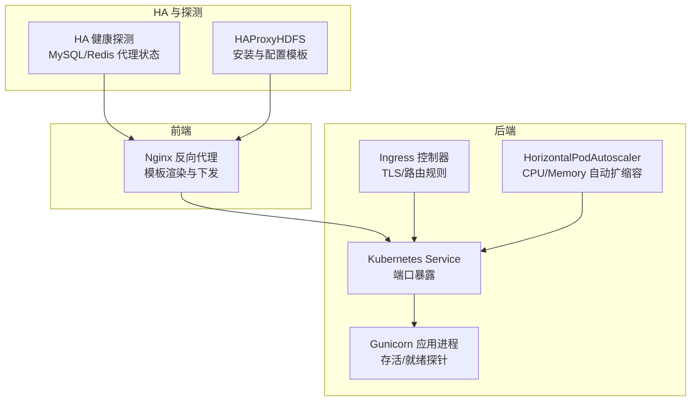
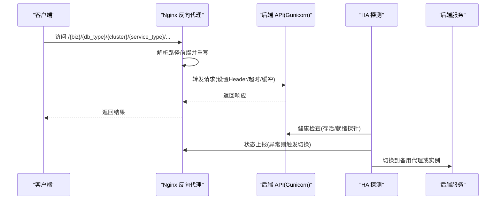
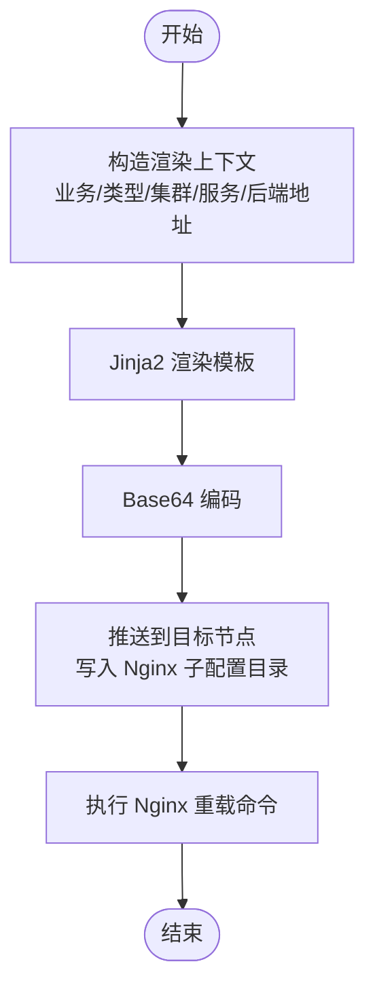
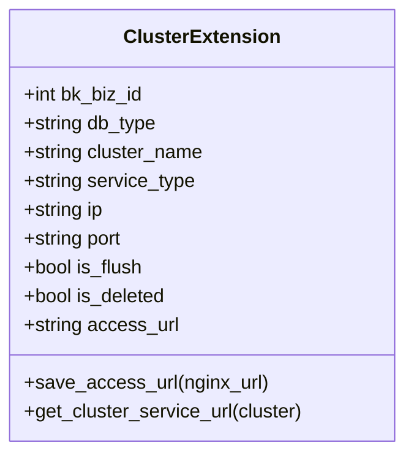
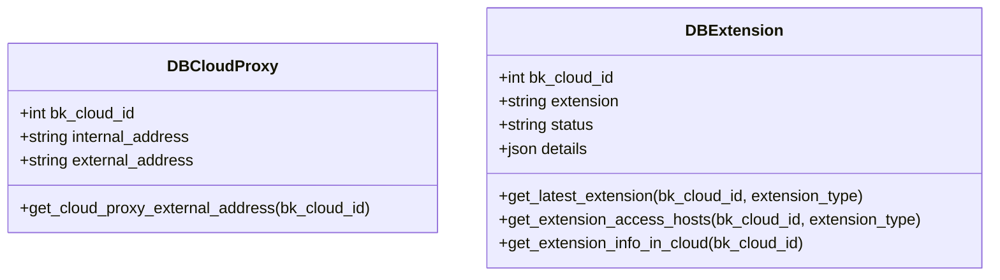
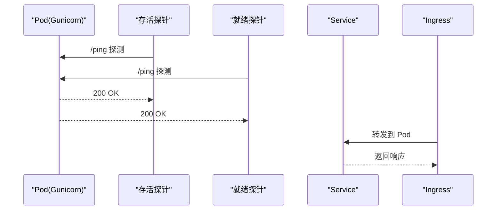
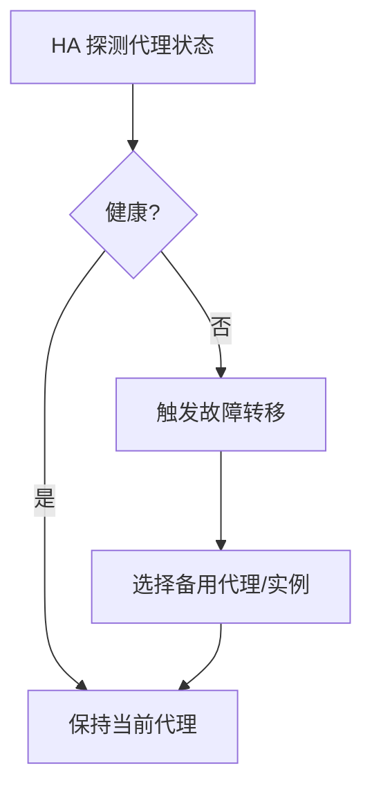
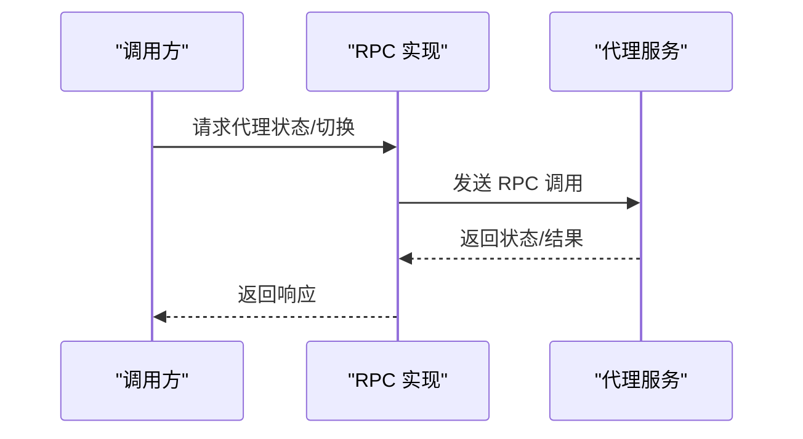
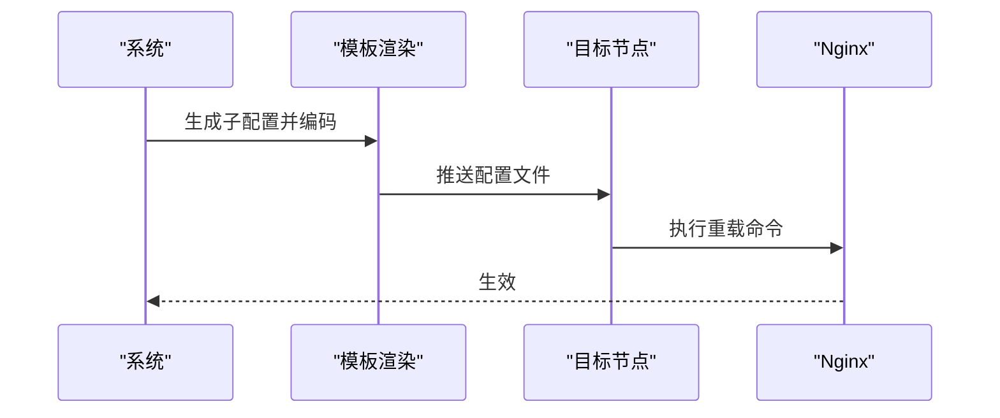
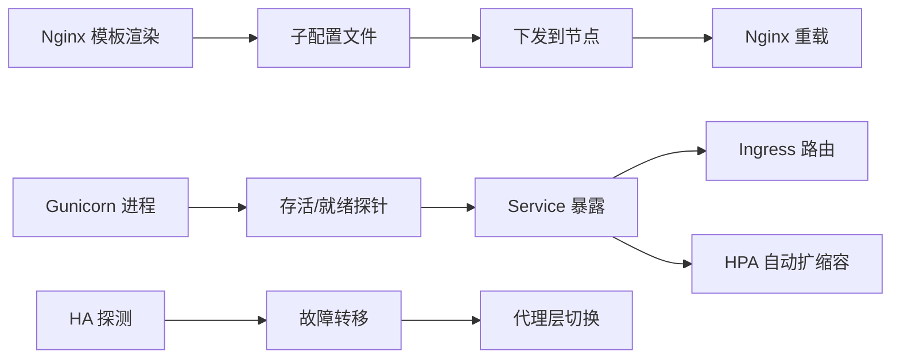

# 代理模型

<cite>
**本文引用的文件**
- [nginxconf_tpl.py](file://dbm-ui/backend/db_proxy/nginxconf_tpl.py)
- [models.py](file://dbm-ui/backend/db_proxy/models.py)
- [urls.py](file://dbm-ui/backend/db_proxy/urls.py)
- [constants.py](file://dbm-ui/backend/db_proxy/constants.py)
- [backend-api.yaml](file://helm-charts/bk-dbm/charts/dbm/templates/deployments/backend-api/backend-api.yaml)
- [service.yaml](file://helm-charts/bk-dbm/charts/dbm/templates/deployments/backend-api/service.yaml)
- [ingress-backend-api.yaml](file://helm-charts/bk-dbm/charts/dbm/templates/deployments/backend-api/ingress-backend-api.yaml)
- [backend-api-hpa.yaml](file://helm-charts/bk-dbm/charts/dbm/templates/hpas/backend-api-hpa.yaml)
- [install_haproxy.go](file://dbm-services/bigdata/db-tools/dbactuator/internal/subcmd/hdfscmd/install_haproxy.go)
- [haproxy.cfg](file://dbm-services/bigdata/db-tools/dbactuator/pkg/components/hdfs/config_tpl/haproxy.cfg)
- [proxy.go](file://dbm-services/bigdata/db-tools/dbactuator/pkg/core/cst/proxy.go)
- [MySQL_proxy_handle.go](file://dbm-services/common/dbha/ha-module/dbmodule/dbmysql/MySQL_proxy_handle.go)
- [twemproxy_detect.go](file://dbm-services/common/dbha/ha-module/dbmodule/redis/twemproxy_detect.go)
- [twemproxy_switch.go](file://dbm-services/common/dbha/ha-module/dbmodule/redis/twemproxy_switch.go)
- [mysql_proxy_status.go](file://dbm-services/common/dbha-v2/pkg/storage/haprobe/mysql_proxy_status.go)
- [redis_proxy_status.go](file://dbm-services/common/dbha-v2/pkg/storage/haprobe/redis_proxy_status.go)
- [proxy_rpc.go](file://dbm-services/mysql/db-remote-service/pkg/rpc_implement/proxy_rpc/proxy_rpc.go)
- [twemproxy_rpc.go](file://dbm-services/mysql/db-remote-service/pkg/rpc_implement/redis_rpc/twemproxy_rpc.go)
- [proxy.go](file://dbm-services/mysql/db-remote-service/pkg/service/handler_rpc/proxy.go)
- [settings.py](file://dbm-ui/blueking/bkvision/settings.py)
</cite>

## 目录
1. [引言](#引言)
2. [项目结构](#项目结构)
3. [核心组件](#核心组件)
4. [架构总览](#架构总览)
5. [详细组件分析](#详细组件分析)
6. [依赖关系分析](#依赖关系分析)
7. [性能考量](#性能考量)
8. [故障排查指南](#故障排查指南)
9. [结论](#结论)
10. [附录](#附录)

## 引言
本文件系统化梳理 DBM 的代理模型，重点覆盖以下方面：
- 容器代理与 Nginx 配置：如何为不同数据库类型生成与下发 Nginx 子配置，以及如何通过模板渲染与编码下发至目标节点。
- 负载均衡策略与路由规则：基于路径前缀的路由与后端服务映射，以及针对特定协议（如 Kafka、Pulsar、Doris、HDFS）的特殊处理。
- 与后端服务的连接管理与健康检查：通过 Helm 部署的后端 API 的存活/就绪探针，以及 HA 模块对代理的健康探测与切换。
- 代理配置的热更新与动态调整：Nginx 配置推送路径、重启命令模板与定时刷新流程。
- 与监控系统的集成：指标采集与告警策略的对接点。
- 性能优化与故障转移：连接超时、缓冲区配置、HPA 自动扩缩容、以及代理层的高可用策略。

## 项目结构
DBM 的代理模型由“前端反向代理（Nginx）+ 后端 API（Gunicorn）+ HA 探测与切换”三层组成。前端通过模板渲染生成 Nginx 子配置并下发到各云区域节点；后端 API 提供统一的反向代理入口；HA 模块负责健康检查与故障转移。

**图表来源**
- [nginxconf_tpl.py:17-37](file://dbm-ui/backend/db_proxy/nginxconf_tpl.py#L17-L37)
- [backend-api.yaml:34-83](file://helm-charts/bk-dbm/charts/dbm/templates/deployments/backend-api/backend-api.yaml#L34-L83)
- [service.yaml:1-19](file://helm-charts/bk-dbm/charts/dbm/templates/deployments/backend-api/service.yaml#L1-L19)
- [ingress-backend-api.yaml:29-61](file://helm-charts/bk-dbm/charts/dbm/templates/deployments/backend-api/ingress-backend-api.yaml#L29-L61)
- [backend-api-hpa.yaml:1-28](file://helm-charts/bk-dbm/charts/dbm/templates/hpas/backend-api-hpa.yaml#L1-L28)
- [mysql_proxy_status.go](file://dbm-services/common/dbha-v2/pkg/storage/haprobe/mysql_proxy_status.go)
- [redis_proxy_status.go](file://dbm-services/common/dbha-v2/pkg/storage/haprobe/redis_proxy_status.go)
- [install_haproxy.go](file://dbm-services/bigdata/db-tools/dbactuator/internal/subcmd/hdfscmd/install_haproxy.go)
- [haproxy.cfg](file://dbm-services/bigdata/db-tools/dbactuator/pkg/components/hdfs/config_tpl/haproxy.cfg)

**章节来源**
- [nginxconf_tpl.py:17-37](file://dbm-ui/backend/db_proxy/nginxconf_tpl.py#L17-L37)
- [backend-api.yaml:34-83](file://helm-charts/bk-dbm/charts/dbm/templates/deployments/backend-api/backend-api.yaml#L34-L83)
- [service.yaml:1-19](file://helm-charts/bk-dbm/charts/dbm/templates/deployments/backend-api/service.yaml#L1-L19)
- [ingress-backend-api.yaml:29-61](file://helm-charts/bk-dbm/charts/dbm/templates/deployments/backend-api/ingress-backend-api.yaml#L29-L61)
- [backend-api-hpa.yaml:1-28](file://helm-charts/bk-dbm/charts/dbm/templates/hpas/backend-api-hpa.yaml#L1-L28)

## 核心组件
- Nginx 模板渲染与下发：根据集群扩展信息生成 Nginx 子配置文件，按业务/类型/集群维度命名并进行 Base64 编码，便于安全传输与落盘。
- 集群扩展记录：记录每个集群扩展服务的访问地址、是否已刷新、是否删除等元数据，支撑统一的访问 URL 生成与路由。
- 云区域代理与组件扩展：维护云区域内的代理与组件（Nginx/DNS/DRS/DBHA 等）的部署与状态，提供访问主机列表与最新组件信息。
- 后端 API 部署与探针：通过 Helm 模板定义 Gunicorn 进程、存活/就绪探针、Service 暴露与 Ingress 规则，以及 HPA 自动扩缩容。
- HA 探测与切换：针对 MySQL/Redis 代理的状态探测与故障切换逻辑，保障代理层高可用。

**章节来源**
- [nginxconf_tpl.py:17-37](file://dbm-ui/backend/db_proxy/nginxconf_tpl.py#L17-L37)
- [models.py:65-139](file://dbm-ui/backend/db_proxy/models.py#L65-L139)
- [models.py:169-232](file://dbm-ui/backend/db_proxy/models.py#L169-L232)
- [constants.py:33-104](file://dbm-ui/backend/db_proxy/constants.py#L33-L104)
- [backend-api.yaml:34-83](file://helm-charts/bk-dbm/charts/dbm/templates/deployments/backend-api/backend-api.yaml#L34-L83)
- [mysql_proxy_status.go](file://dbm-services/common/dbha-v2/pkg/storage/haprobe/mysql_proxy_status.go)
- [redis_proxy_status.go](file://dbm-services/common/dbha-v2/pkg/storage/haprobe/redis_proxy_status.go)

## 架构总览
DBM 代理模型采用“模板驱动 + Kubernetes 编排 + HA 探测”的架构。前端 Nginx 依据模板生成子配置，后端通过 Gunicorn 承载 API，Ingress 负责外部流量接入，HPA 根据 CPU/Memory 动态扩缩容。HA 模块定期探测代理状态并在异常时触发切换。

**图表来源**
- [nginxconf_tpl.py:40-143](file://dbm-ui/backend/db_proxy/nginxconf_tpl.py#L40-L143)
- [backend-api.yaml:34-83](file://helm-charts/bk-dbm/charts/dbm/templates/deployments/backend-api/backend-api.yaml#L34-L83)
- [mysql_proxy_status.go](file://dbm-services/common/dbha-v2/pkg/storage/haprobe/mysql_proxy_status.go)
- [redis_proxy_status.go](file://dbm-services/common/dbha-v2/pkg/storage/haprobe/redis_proxy_status.go)

## 详细组件分析

### Nginx 模板与路由规则
- 模板渲染：根据集群扩展信息构造渲染上下文，输出包含业务 ID、云区域、数据库类型、集群名、服务类型与后端服务地址的子配置，并进行 Base64 编码以便安全下发。
- 路由规则：
  - ES/Kibana：基于 location 前缀重写，转发至后端服务。
  - Doris：除重写外，还设置 Cookie 路径以适配管理端。
  - HDFS：使用 sub_filter 替换页面中的静态资源与链接，确保在子路径下正确加载。
  - Kafka：直通转发，设置常见 Header。
  - Pulsar：重写并追加 UI 入口，同时对多个子路径进行替换。
- 连接与缓冲：统一设置连接、发送、读取超时与缓冲区大小，保证大文件上传与长连接稳定性。

**图表来源**
- [nginxconf_tpl.py:17-37](file://dbm-ui/backend/db_proxy/nginxconf_tpl.py#L17-L37)
- [nginxconf_tpl.py:145-149](file://dbm-ui/backend/db_proxy/nginxconf_tpl.py#L145-L149)

**章节来源**
- [nginxconf_tpl.py:17-37](file://dbm-ui/backend/db_proxy/nginxconf_tpl.py#L17-L37)
- [nginxconf_tpl.py:40-143](file://dbm-ui/backend/db_proxy/nginxconf_tpl.py#L40-L143)

### 集群扩展与访问 URL 生成
- ClusterExtension 记录每个集群扩展服务的部署信息与访问地址，提供“是否刷新/是否删除”等状态字段，配合定时任务进行配置下发与清理。
- 访问 URL 生成：结合系统管理地址与服务类型，拼接标准访问路径，支持部分服务类型的尾部斜杠差异。

**图表来源**
- [models.py:169-232](file://dbm-ui/backend/db_proxy/models.py#L169-L232)

**章节来源**
- [models.py:169-232](file://dbm-ui/backend/db_proxy/models.py#L169-L232)

### 云区域代理与组件扩展
- DBCloudProxy：提供云区域的外部代理地址，支持缓存与异常处理，避免频繁查询数据库。
- DBExtension：记录云区域内各类组件（Nginx/DNS/DRS/DBHA）的部署详情与状态，提供最新组件查询与访问主机提取。

**图表来源**
- [models.py:34-139](file://dbm-ui/backend/db_proxy/models.py#L34-L139)

**章节来源**
- [models.py:34-139](file://dbm-ui/backend/db_proxy/models.py#L34-L139)
- [constants.py:33-104](file://dbm-ui/backend/db_proxy/constants.py#L33-L104)

### 后端 API 部署与健康检查
- Gunicorn 进程：通过 Helm 模板启动，设置最大请求数、抖动、超时、工作进程数等参数，保证稳定运行与优雅重启。
- 探针：存活探针与就绪探针分别用于容器生命周期管理与流量接入时机控制。
- Service 与 Ingress：Service 将 Pod 暴露为 8000 端口；Ingress 提供 TLS 与多路径路由规则。
- HPA：根据 CPU/Memory 使用率自动扩缩容，提升弹性与成本效率。

**图表来源**
- [backend-api.yaml:34-83](file://helm-charts/bk-dbm/charts/dbm/templates/deployments/backend-api/backend-api.yaml#L34-L83)
- [service.yaml:1-19](file://helm-charts/bk-dbm/charts/dbm/templates/deployments/backend-api/service.yaml#L1-L19)
- [ingress-backend-api.yaml:29-61](file://helm-charts/bk-dbm/charts/dbm/templates/deployments/backend-api/ingress-backend-api.yaml#L29-L61)
- [backend-api-hpa.yaml:1-28](file://helm-charts/bk-dbm/charts/dbm/templates/hpas/backend-api-hpa.yaml#L1-L28)

**章节来源**
- [backend-api.yaml:34-83](file://helm-charts/bk-dbm/charts/dbm/templates/deployments/backend-api/backend-api.yaml#L34-L83)
- [service.yaml:1-19](file://helm-charts/bk-dbm/charts/dbm/templates/deployments/backend-api/service.yaml#L1-L19)
- [ingress-backend-api.yaml:29-61](file://helm-charts/bk-dbm/charts/dbm/templates/deployments/backend-api/ingress-backend-api.yaml#L29-L61)
- [backend-api-hpa.yaml:1-28](file://helm-charts/bk-dbm/charts/dbm/templates/hpas/backend-api-hpa.yaml#L1-L28)

### HA 探测与故障转移
- MySQL/Redis 代理状态探测：通过 HA 模块定期检查代理状态，异常时触发切换流程，保障代理层高可用。
- HDFS HAProxy：提供安装脚本与配置模板，用于在大数据场景下实现代理层的高可用与负载均衡。

**图表来源**
- [mysql_proxy_status.go](file://dbm-services/common/dbha-v2/pkg/storage/haprobe/mysql_proxy_status.go)
- [redis_proxy_status.go](file://dbm-services/common/dbha-v2/pkg/storage/haprobe/redis_proxy_status.go)
- [install_haproxy.go](file://dbm-services/bigdata/db-tools/dbactuator/internal/subcmd/hdfscmd/install_haproxy.go)
- [haproxy.cfg](file://dbm-services/bigdata/db-tools/dbactuator/pkg/components/hdfs/config_tpl/haproxy.cfg)

**章节来源**
- [MySQL_proxy_handle.go](file://dbm-services/common/dbha/ha-module/dbmodule/dbmysql/MySQL_proxy_handle.go)
- [twemproxy_detect.go](file://dbm-services/common/dbha/ha-module/dbmodule/redis/twemproxy_detect.go)
- [twemproxy_switch.go](file://dbm-services/common/dbha/ha-module/dbmodule/redis/twemproxy_switch.go)
- [mysql_proxy_status.go](file://dbm-services/common/dbha-v2/pkg/storage/haprobe/mysql_proxy_status.go)
- [redis_proxy_status.go](file://dbm-services/common/dbha-v2/pkg/storage/haprobe/redis_proxy_status.go)
- [install_haproxy.go](file://dbm-services/bigdata/db-tools/dbactuator/internal/subcmd/hdfscmd/install_haproxy.go)
- [haproxy.cfg](file://dbm-services/bigdata/db-tools/dbactuator/pkg/components/hdfs/config_tpl/haproxy.cfg)

### 代理与后端服务的连接管理
- RPC 与代理：MySQL/Redis 的远程服务通过 RPC 实现与代理的交互，支持代理状态查询与切换等操作。
- 代理常量与配置：代理相关常量与映射（如集群到服务类型的映射）集中定义，便于统一管理。

**图表来源**
- [proxy_rpc.go](file://dbm-services/mysql/db-remote-service/pkg/rpc_implement/proxy_rpc/proxy_rpc.go)
- [twemproxy_rpc.go](file://dbm-services/mysql/db-remote-service/pkg/rpc_implement/redis_rpc/twemproxy_rpc.go)
- [proxy.go](file://dbm-services/mysql/db-remote-service/pkg/service/handler_rpc/proxy.go)
- [proxy.go](file://dbm-services/bigdata/db-tools/dbactuator/pkg/core/cst/proxy.go)

**章节来源**
- [proxy_rpc.go](file://dbm-services/mysql/db-remote-service/pkg/rpc_implement/proxy_rpc/proxy_rpc.go)
- [twemproxy_rpc.go](file://dbm-services/mysql/db-remote-service/pkg/rpc_implement/redis_rpc/twemproxy_rpc.go)
- [proxy.go](file://dbm-services/mysql/db-remote-service/pkg/service/handler_rpc/proxy.go)
- [proxy.go](file://dbm-services/bigdata/db-tools/dbactuator/pkg/core/cst/proxy.go)

### 代理配置的热更新与动态调整
- 下发路径：Nginx 子配置文件写入指定目录，随后执行重载命令使变更生效。
- 刷新流程：通过 ClusterExtension 的“是否刷新”字段与定时任务协同，实现配置的批量下发与清理。
- 云区域代理缓存：对外部代理地址进行缓存，降低查询压力并提高响应速度。

**图表来源**
- [nginxconf_tpl.py:17-37](file://dbm-ui/backend/db_proxy/nginxconf_tpl.py#L17-L37)
- [nginxconf_tpl.py:145-149](file://dbm-ui/backend/db_proxy/nginxconf_tpl.py#L145-L149)
- [models.py:192-195](file://dbm-ui/backend/db_proxy/models.py#L192-L195)
- [models.py:45-62](file://dbm-ui/backend/db_proxy/models.py#L45-L62)

**章节来源**
- [nginxconf_tpl.py:17-37](file://dbm-ui/backend/db_proxy/nginxconf_tpl.py#L17-L37)
- [nginxconf_tpl.py:145-149](file://dbm-ui/backend/db_proxy/nginxconf_tpl.py#L145-L149)
- [models.py:192-195](file://dbm-ui/backend/db_proxy/models.py#L192-L195)
- [models.py:45-62](file://dbm-ui/backend/db_proxy/models.py#L45-L62)

### 与监控系统的集成
- 指标采集：后端 API 通过中间件与指标模块收集 HTTP 请求计数、耗时等指标，便于 Grafana 展示与告警。
- 探测集成：HA 模块的健康探测结果可作为监控数据源，辅助判断代理层健康状况。

**章节来源**
- [backend-api.yaml:34-83](file://helm-charts/bk-dbm/charts/dbm/templates/deployments/backend-api/backend-api.yaml#L34-L83)
- [mysql_proxy_status.go](file://dbm-services/common/dbha-v2/pkg/storage/haprobe/mysql_proxy_status.go)
- [redis_proxy_status.go](file://dbm-services/common/dbha-v2/pkg/storage/haprobe/redis_proxy_status.go)

### 代理模型与监控系统的集成方式
- 指标与告警：后端 API 的 HTTP 指标（计数、耗时）可用于 Grafana 仪表盘与告警策略；HA 探测结果可作为代理层健康度指标。
- 配置与日志：Nginx 的访问/错误日志格式在 Helm 中定义，便于统一采集与分析。

**章节来源**
- [backend-api.yaml:34-83](file://helm-charts/bk-dbm/charts/dbm/templates/deployments/backend-api/backend-api.yaml#L34-L83)

## 依赖关系分析
- 模板渲染依赖：Nginx 模板渲染依赖于集群扩展信息与系统设置，输出 Base64 编码的配置文件。
- 部署依赖：后端 API 的健康检查依赖于探针配置；Ingress 依赖于 Service；HPA 依赖于资源指标。
- HA 依赖：代理层的健康状态依赖于 HA 模块的探测与切换逻辑。

**图表来源**
- [nginxconf_tpl.py:17-37](file://dbm-ui/backend/db_proxy/nginxconf_tpl.py#L17-L37)
- [backend-api.yaml:34-83](file://helm-charts/bk-dbm/charts/dbm/templates/deployments/backend-api/backend-api.yaml#L34-L83)
- [service.yaml:1-19](file://helm-charts/bk-dbm/charts/dbm/templates/deployments/backend-api/service.yaml#L1-L19)
- [ingress-backend-api.yaml:29-61](file://helm-charts/bk-dbm/charts/dbm/templates/deployments/backend-api/ingress-backend-api.yaml#L29-L61)
- [backend-api-hpa.yaml:1-28](file://helm-charts/bk-dbm/charts/dbm/templates/hpas/backend-api-hpa.yaml#L1-L28)
- [mysql_proxy_status.go](file://dbm-services/common/dbha-v2/pkg/storage/haprobe/mysql_proxy_status.go)
- [redis_proxy_status.go](file://dbm-services/common/dbha-v2/pkg/storage/haprobe/redis_proxy_status.go)

**章节来源**
- [urls.py:14-47](file://dbm-ui/backend/db_proxy/urls.py#L14-L47)
- [constants.py:97-104](file://dbm-ui/backend/db_proxy/constants.py#L97-L104)

## 性能考量
- 连接与缓冲：统一设置连接、发送、读取超时与缓冲区大小，适合大文件上传与长连接场景。
- 并发与超时：Gunicorn 工作进程数与超时参数影响吞吐与响应时间，需结合业务峰值合理配置。
- 自动扩缩容：HPA 基于 CPU/Memory 指标动态调整副本数，提升资源利用率与弹性。
- 负载均衡：HDFS 场景下的 HAProxy 配置模板提供高可用与负载均衡能力。

**章节来源**
- [nginxconf_tpl.py:40-143](file://dbm-ui/backend/db_proxy/nginxconf_tpl.py#L40-L143)
- [backend-api.yaml:34-83](file://helm-charts/bk-dbm/charts/dbm/templates/deployments/backend-api/backend-api.yaml#L34-L83)
- [backend-api-hpa.yaml:1-28](file://helm-charts/bk-dbm/charts/dbm/templates/hpas/backend-api-hpa.yaml#L1-L28)
- [haproxy.cfg](file://dbm-services/bigdata/db-tools/dbactuator/pkg/components/hdfs/config_tpl/haproxy.cfg)

## 故障排查指南
- Nginx 配置问题：
  - 检查子配置文件是否成功下发至指定目录。
  - 执行重载命令后确认生效，查看 Nginx 错误日志定位问题。
- 后端 API 不可用：
  - 查看存活/就绪探针返回状态，确认容器健康。
  - 检查 Service 与 Ingress 配置，确保端口与路径匹配。
- 代理层异常：
  - 关注 HA 探测日志与切换记录，定位故障原因。
  - 对照 HDFS HAProxy 配置模板，核对安装与配置一致性。
- 云区域代理不可用：
  - 检查缓存键与缓存过期时间，确认外部代理地址是否正确返回。

**章节来源**
- [nginxconf_tpl.py:145-149](file://dbm-ui/backend/db_proxy/nginxconf_tpl.py#L145-L149)
- [backend-api.yaml:34-83](file://helm-charts/bk-dbm/charts/dbm/templates/deployments/backend-api/backend-api.yaml#L34-L83)
- [mysql_proxy_status.go](file://dbm-services/common/dbha-v2/pkg/storage/haprobe/mysql_proxy_status.go)
- [redis_proxy_status.go](file://dbm-services/common/dbha-v2/pkg/storage/haprobe/redis_proxy_status.go)
- [models.py:45-62](file://dbm-ui/backend/db_proxy/models.py#L45-L62)

## 结论
DBM 的代理模型通过“模板驱动的 Nginx 配置 + Kubernetes 编排 + HA 探测”的组合，实现了对多数据库类型与多场景（含 HDFS）的统一代理与高可用保障。其关键优势包括：
- 易于扩展的模板体系与标准化的路由规则；
- 健壮的后端 API 部署与弹性伸缩能力；
- 面向代理层的健康探测与故障转移机制；
- 与监控系统的自然集成，便于运维观测与告警。

## 附录
- 反向代理入口注册：代理视图通过统一路由器注册，覆盖 DNS、DBMeta、NameService、DRS、HADB、JobCallback、BKRepo、Redis DTS、热点分析、KeyStat 报表、JobAPI、Dumper、DBPriv、K8s 等模块。
- 外部系统代理：bkvision 的统一转发前缀与预处理钩子，便于对接外部系统接口。

**章节来源**
- [urls.py:14-47](file://dbm-ui/backend/db_proxy/urls.py#L14-L47)
- [settings.py:6-18](file://dbm-ui/blueking/bkvision/settings.py#L6-L18)