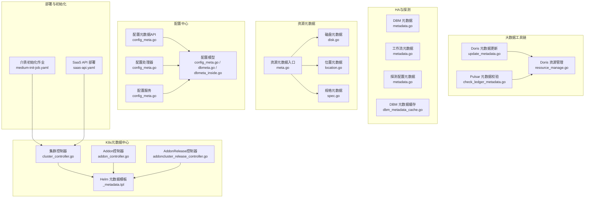
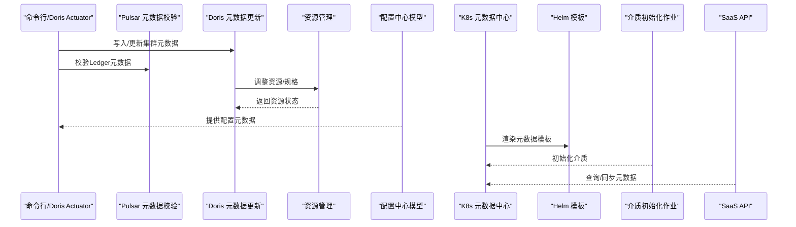
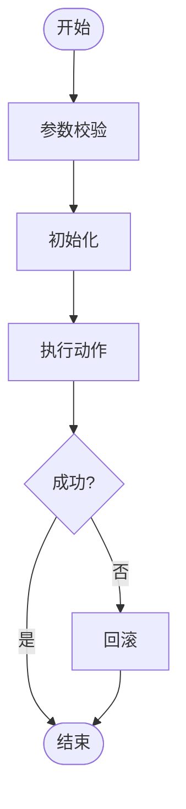
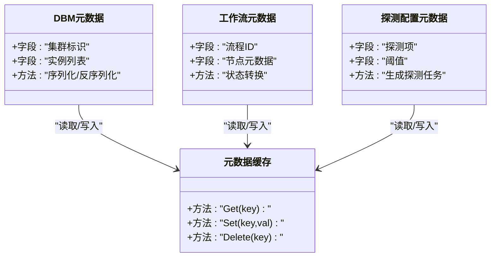
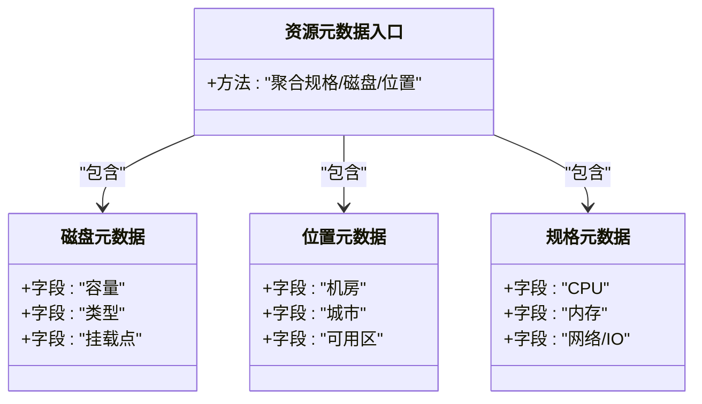
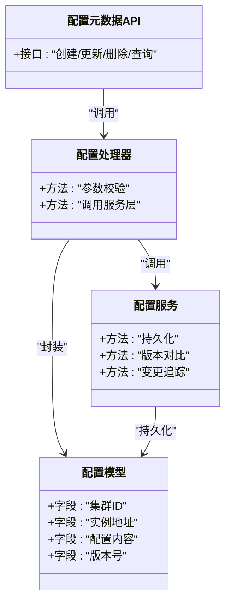
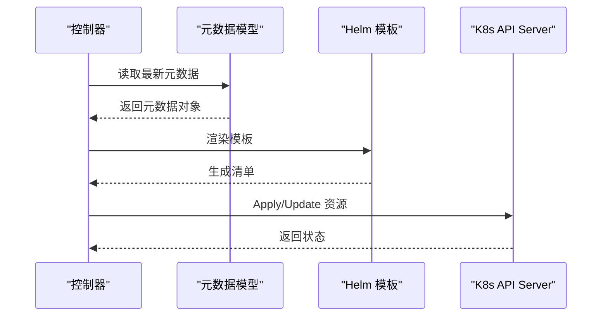
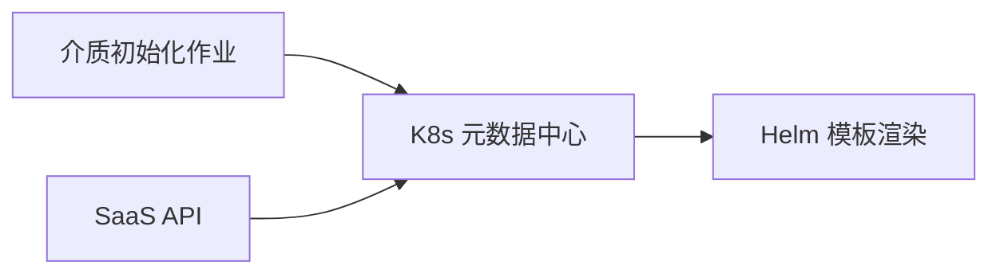
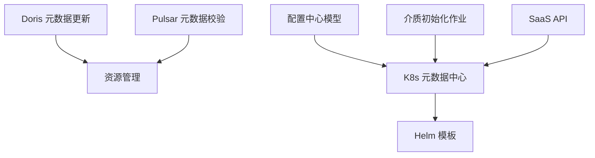

# 元数据模型

<cite>
**本文引用的文件**
- [update_cluster_metadata.go](file://dbm-services/bigdata/db-tools/dbactuator/internal/subcmd/doriscmd/update_cluster_metadata.go)
- [check_ledger_metadata.go](file://dbm-services/bigdata/db-tools/dbactuator/internal/subcmd/pulsarcmd/check_ledger_metadata.go)
- [update_metadata.go](file://dbm-services/bigdata/db-tools/dbactuator/pkg/components/doris/update_metadata.go)
- [resource_manage.go](file://dbm-services/bigdata/db-tools/dbactuator/pkg/components/doris/resource_manage.go)
- [metadata.go](file://dbm-services/common/dbha-v2/internal/analysis/dbm/metadata.go)
- [metadata.go](file://dbm-services/common/dbha-v2/internal/analysis/workflow/metadata.go)
- [metadata.go](file://dbm-services/common/dbha-v2/pkg/probeconfig/metadata.go)
- [dbm_metadata_cache.go](file://dbm-services/common/dbha-v2/pkg/storage/hamodel/dbm_metadata_cache.go)
- [meta_info.go](file://dbm-services/common/bkdata-kafka-consumer/pkg/config/meta_info.go)
- [meta_info.go](file://dbm-services/common/bkdata-kafka-consumer/pkg/consumer/meta_info.go)
- [meta_info.go](file://dbm-services/common/db-event-consumer/pkg/consumer/meta_info.go)
- [meta.go](file://dbm-services/common/db-resource/internal/svr/meta/meta.go)
- [disk.go](file://dbm-services/common/db-resource/internal/svr/meta/disk.go)
- [location.go](file://dbm-services/common/db-resource/internal/svr/meta/location.go)
- [spec.go](file://dbm-services/common/db-resource/internal/svr/meta/spec.go)
- [_metadata.tpl](file://dbm-services/k8s-dbs/k8s-utils/helm/templates/_metadata.tpl)
- [cluster_controller.go](file://dbm-services/k8s-dbs/metadata/api/controller/cluster_controller.go)
- [addon_controller.go](file://dbm-services/k8s-dbs/metadata/api/controller/addon_controller.go)
- [addoncluster_release_controller.go](file://dbm-services/k8s-dbs/metadata/api/controller/addoncluster_release_controller.go)
- [config_meta.go](file://dbm-services/common/db-config/internal/api/config_meta.go)
- [config_meta.go](file://dbm-services/common/db-config/internal/handler/simple/config_meta.go)
- [config_meta.go](file://dbm-services/common/db-config/internal/repository/model/config_meta.go)
- [dbmeta.go](file://dbm-services/common/db-config/internal/repository/model/dbmeta.go)
- [dbmeta_inside.go](file://dbm-services/common/db-config/internal/repository/model/dbmeta_inside.go)
- [config_meta.go](file://dbm-services/common/db-config/internal/service/simpleconfig/config_meta.go)
- [medium-init-job.yaml](file://helm-charts/bk-dbm/charts/dbm/templates/jobs/medium-init-job.yaml)
- [saas-api.yaml](file://helm-charts/bk-dbm/charts/dbm/templates/deployments/saas-api/saas-api.yaml)
</cite>

## 目录
1. [简介](#简介)
2. [项目结构](#项目结构)
3. [核心组件](#核心组件)
4. [架构总览](#架构总览)
5. [详细组件分析](#详细组件分析)
6. [依赖分析](#依赖分析)
7. [性能考虑](#性能考虑)
8. [故障排查指南](#故障排查指南)
9. [结论](#结论)
10. [附录](#附录)

## 简介
本文件系统化梳理DBM（BlueKing Database Manager）的元数据模型，覆盖数据库集群、实例、存储等核心实体及其关系；明确主键/外键约束、索引设计与数据完整性规则；解释元数据生命周期、版本控制与变更追踪机制；给出查询优化与缓存策略；并说明元数据与业务模型的关联及数据同步策略。文档以仓库中真实存在的代码与模板为依据，避免臆造信息。

## 项目结构
围绕元数据模型的关键位置包括：
- 大数据工具链中的元数据更新与校验（Doris/Pulsar）
- HA与探测配置中的元数据抽象
- 资源侧的规格、磁盘、位置等元数据
- 配置中心的元数据模型与API
- K8s元数据中心控制器
- Helm模板中的元数据片段
- SaaS API与初始化作业的部署模板

图表来源
- [update_metadata.go](file://dbm-services/bigdata/db-tools/dbactuator/pkg/components/doris/update_metadata.go)
- [resource_manage.go](file://dbm-services/bigdata/db-tools/dbactuator/pkg/components/doris/resource_manage.go)
- [check_ledger_metadata.go](file://dbm-services/bigdata/db-tools/dbactuator/internal/subcmd/pulsarcmd/check_ledger_metadata.go)
- [meta.go](file://dbm-services/common/db-resource/internal/svr/meta/meta.go)
- [disk.go](file://dbm-services/common/db-resource/internal/svr/meta/disk.go)
- [location.go](file://dbm-services/common/db-resource/internal/svr/meta/location.go)
- [spec.go](file://dbm-services/common/db-resource/internal/svr/meta/spec.go)
- [config_meta.go](file://dbm-services/common/db-config/internal/api/config_meta.go)
- [config_meta.go](file://dbm-services/common/db-config/internal/handler/simple/config_meta.go)
- [config_meta.go](file://dbm-services/common/db-config/internal/repository/model/config_meta.go)
- [dbmeta.go](file://dbm-services/common/db-config/internal/repository/model/dbmeta.go)
- [dbmeta_inside.go](file://dbm-services/common/db-config/internal/repository/model/dbmeta_inside.go)
- [config_meta.go](file://dbm-services/common/db-config/internal/service/simpleconfig/config_meta.go)
- [cluster_controller.go](file://dbm-services/k8s-dbs/metadata/api/controller/cluster_controller.go)
- [addon_controller.go](file://dbm-services/k8s-dbs/metadata/api/controller/addon_controller.go)
- [addoncluster_release_controller.go](file://dbm-services/k8s-dbs/metadata/api/controller/addoncluster_release_controller.go)
- [_metadata.tpl](file://dbm-services/k8s-dbs/k8s-utils/helm/templates/_metadata.tpl)
- [medium-init-job.yaml](file://helm-charts/bk-dbm/charts/dbm/templates/jobs/medium-init-job.yaml)
- [saas-api.yaml](file://helm-charts/bk-dbm/charts/dbm/templates/deployments/saas-api/saas-api.yaml)

章节来源
- [update_cluster_metadata.go](file://dbm-services/bigdata/db-tools/dbactuator/internal/subcmd/doriscmd/update_cluster_metadata.go)
- [check_ledger_metadata.go](file://dbm-services/bigdata/db-tools/dbactuator/internal/subcmd/pulsarcmd/check_ledger_metadata.go)
- [update_metadata.go](file://dbm-services/bigdata/db-tools/dbactuator/pkg/components/doris/update_metadata.go)
- [resource_manage.go](file://dbm-services/bigdata/db-tools/dbactuator/pkg/components/doris/resource_manage.go)
- [meta.go](file://dbm-services/common/db-resource/internal/svr/meta/meta.go)
- [disk.go](file://dbm-services/common/db-resource/internal/svr/meta/disk.go)
- [location.go](file://dbm-services/common/db-resource/internal/svr/meta/location.go)
- [spec.go](file://dbm-services/common/db-resource/internal/svr/meta/spec.go)
- [config_meta.go](file://dbm-services/common/db-config/internal/api/config_meta.go)
- [config_meta.go](file://dbm-services/common/db-config/internal/handler/simple/config_meta.go)
- [config_meta.go](file://dbm-services/common/db-config/internal/repository/model/config_meta.go)
- [dbmeta.go](file://dbm-services/common/db-config/internal/repository/model/dbmeta.go)
- [dbmeta_inside.go](file://dbm-services/common/db-config/internal/repository/model/dbmeta_inside.go)
- [config_meta.go](file://dbm-services/common/db-config/internal/service/simpleconfig/config_meta.go)
- [cluster_controller.go](file://dbm-services/k8s-dbs/metadata/api/controller/cluster_controller.go)
- [addon_controller.go](file://dbm-services/k8s-dbs/metadata/api/controller/addon_controller.go)
- [addoncluster_release_controller.go](file://dbm-services/k8s-dbs/metadata/api/controller/addoncluster_release_controller.go)
- [_metadata.tpl](file://dbm-services/k8s-dbs/k8s-utils/helm/templates/_metadata.tpl)
- [medium-init-job.yaml](file://helm-charts/bk-dbm/charts/dbm/templates/jobs/medium-init-job.yaml)
- [saas-api.yaml](file://helm-charts/bk-dbm/charts/dbm/templates/deployments/saas-api/saas-api.yaml)

## 核心组件
- 大数据元数据更新与校验：面向Doris/Pulsar的集群元数据写入、校验与资源管理。
- HA与探测元数据：DBM、工作流与探测配置的元数据抽象与缓存。
- 资源元数据：规格、磁盘、位置等资源侧元数据模型与入口。
- 配置中心元数据：配置元数据的API、处理器、模型与服务层。
- K8s元数据中心：集群、Addon、AddonRelease控制器与Helm模板。
- 部署与初始化：介质初始化作业与SaaS API部署模板。

章节来源
- [update_cluster_metadata.go](file://dbm-services/bigdata/db-tools/dbactuator/internal/subcmd/doriscmd/update_cluster_metadata.go)
- [check_ledger_metadata.go](file://dbm-services/bigdata/db-tools/dbactuator/internal/subcmd/pulsarcmd/check_ledger_metadata.go)
- [update_metadata.go](file://dbm-services/bigdata/db-tools/dbactuator/pkg/components/doris/update_metadata.go)
- [resource_manage.go](file://dbm-services/bigdata/db-tools/dbactuator/pkg/components/doris/resource_manage.go)
- [metadata.go](file://dbm-services/common/dbha-v2/internal/analysis/dbm/metadata.go)
- [metadata.go](file://dbm-services/common/dbha-v2/internal/analysis/workflow/metadata.go)
- [metadata.go](file://dbm-services/common/dbha-v2/pkg/probeconfig/metadata.go)
- [dbm_metadata_cache.go](file://dbm-services/common/dbha-v2/pkg/storage/hamodel/dbm_metadata_cache.go)
- [meta.go](file://dbm-services/common/db-resource/internal/svr/meta/meta.go)
- [disk.go](file://dbm-services/common/db-resource/internal/svr/meta/disk.go)
- [location.go](file://dbm-services/common/db-resource/internal/svr/meta/location.go)
- [spec.go](file://dbm-services/common/db-resource/internal/svr/meta/spec.go)
- [config_meta.go](file://dbm-services/common/db-config/internal/api/config_meta.go)
- [config_meta.go](file://dbm-services/common/db-config/internal/handler/simple/config_meta.go)
- [config_meta.go](file://dbm-services/common/db-config/internal/repository/model/config_meta.go)
- [dbmeta.go](file://dbm-services/common/db-config/internal/repository/model/dbmeta.go)
- [dbmeta_inside.go](file://dbm-services/common/db-config/internal/repository/model/dbmeta_inside.go)
- [config_meta.go](file://dbm-services/common/db-config/internal/service/simpleconfig/config_meta.go)
- [cluster_controller.go](file://dbm-services/k8s-dbs/metadata/api/controller/cluster_controller.go)
- [addon_controller.go](file://dbm-services/k8s-dbs/metadata/api/controller/addon_controller.go)
- [addoncluster_release_controller.go](file://dbm-services/k8s-dbs/metadata/api/controller/addoncluster_release_controller.go)
- [_metadata.tpl](file://dbm-services/k8s-dbs/k8s-utils/helm/templates/_metadata.tpl)
- [medium-init-job.yaml](file://helm-charts/bk-dbm/charts/dbm/templates/jobs/medium-init-job.yaml)
- [saas-api.yaml](file://helm-charts/bk-dbm/charts/dbm/templates/deployments/saas-api/saas-api.yaml)

## 架构总览
下图展示元数据在不同子系统中的流转与交互：

图表来源
- [update_cluster_metadata.go](file://dbm-services/bigdata/db-tools/dbactuator/internal/subcmd/doriscmd/update_cluster_metadata.go)
- [check_ledger_metadata.go](file://dbm-services/bigdata/db-tools/dbactuator/internal/subcmd/pulsarcmd/check_ledger_metadata.go)
- [update_metadata.go](file://dbm-services/bigdata/db-tools/dbactuator/pkg/components/doris/update_metadata.go)
- [resource_manage.go](file://dbm-services/bigdata/db-tools/dbactuator/pkg/components/doris/resource_manage.go)
- [config_meta.go](file://dbm-services/common/db-config/internal/api/config_meta.go)
- [cluster_controller.go](file://dbm-services/k8s-dbs/metadata/api/controller/cluster_controller.go)
- [_metadata.tpl](file://dbm-services/k8s-dbs/k8s-utils/helm/templates/_metadata.tpl)
- [medium-init-job.yaml](file://helm-charts/bk-dbm/charts/dbm/templates/jobs/medium-init-job.yaml)
- [saas-api.yaml](file://helm-charts/bk-dbm/charts/dbm/templates/deployments/saas-api/saas-api.yaml)

## 详细组件分析

### 组件A：大数据集群元数据（Doris/Pulsar）
- 功能要点
  - Doris：提供集群元数据更新动作与命令，支持验证、初始化与回滚流程。
  - Pulsar：提供Ledger元数据校验动作，封装校验逻辑与执行流程。
  - 资源管理：根据元数据进行资源创建与回收。
- 关键流程
  - 元数据更新：参数校验 → 初始化 → 执行更新 → 回滚处理。
  - Ledger校验：参数校验 → 初始化 → 执行校验 → 异常处理。
- 数据完整性
  - 通过命令模式封装Act结构体，确保执行与回滚一致性。
- 性能与并发
  - 建议对批量更新采用事务包裹，减少中间态不一致风险。

图表来源
- [update_cluster_metadata.go](file://dbm-services/bigdata/db-tools/dbactuator/internal/subcmd/doriscmd/update_cluster_metadata.go)
- [check_ledger_metadata.go](file://dbm-services/bigdata/db-tools/dbactuator/internal/subcmd/pulsarcmd/check_ledger_metadata.go)

章节来源
- [update_cluster_metadata.go](file://dbm-services/bigdata/db-tools/dbactuator/internal/subcmd/doriscmd/update_cluster_metadata.go)
- [check_ledger_metadata.go](file://dbm-services/bigdata/db-tools/dbactuator/internal/subcmd/pulsarcmd/check_ledger_metadata.go)
- [update_metadata.go](file://dbm-services/bigdata/db-tools/dbactuator/pkg/components/doris/update_metadata.go)
- [resource_manage.go](file://dbm-services/bigdata/db-tools/dbactuator/pkg/components/doris/resource_manage.go)

### 组件B：HA与探测配置元数据
- 功能要点
  - DBM元数据：描述DBM层面的元数据结构与行为。
  - 工作流元数据：描述工作流相关的元数据抽象。
  - 探测配置元数据：描述探测器配置的元数据结构。
  - 元数据缓存：提供DBM元数据缓存能力，降低查询开销。
- 设计原则
  - 结构清晰、职责单一；缓存提升读性能，写时失效或更新。

图表来源
- [metadata.go](file://dbm-services/common/dbha-v2/internal/analysis/dbm/metadata.go)
- [metadata.go](file://dbm-services/common/dbha-v2/internal/analysis/workflow/metadata.go)
- [metadata.go](file://dbm-services/common/dbha-v2/pkg/probeconfig/metadata.go)
- [dbm_metadata_cache.go](file://dbm-services/common/dbha-v2/pkg/storage/hamodel/dbm_metadata_cache.go)

章节来源
- [metadata.go](file://dbm-services/common/dbha-v2/internal/analysis/dbm/metadata.go)
- [metadata.go](file://dbm-services/common/dbha-v2/internal/analysis/workflow/metadata.go)
- [metadata.go](file://dbm-services/common/dbha-v2/pkg/probeconfig/metadata.go)
- [dbm_metadata_cache.go](file://dbm-services/common/dbha-v2/pkg/storage/hamodel/dbm_metadata_cache.go)

### 组件C：资源元数据（规格/磁盘/位置）
- 功能要点
  - 入口：资源元数据聚合入口，统一对外暴露。
  - 磁盘：描述磁盘容量、类型、挂载点等。
  - 位置：描述机房、城市、可用区等地理信息。
  - 规格：描述CPU、内存、网络、IO等硬件规格。
- 数据完整性
  - 字段命名规范、单位统一、必填字段明确。
- 索引与查询
  - 建议对地理位置与规格组合建立复合索引，加速筛选。

图表来源
- [meta.go](file://dbm-services/common/db-resource/internal/svr/meta/meta.go)
- [disk.go](file://dbm-services/common/db-resource/internal/svr/meta/disk.go)
- [location.go](file://dbm-services/common/db-resource/internal/svr/meta/location.go)
- [spec.go](file://dbm-services/common/db-resource/internal/svr/meta/spec.go)

章节来源
- [meta.go](file://dbm-services/common/db-resource/internal/svr/meta/meta.go)
- [disk.go](file://dbm-services/common/db-resource/internal/svr/meta/disk.go)
- [location.go](file://dbm-services/common/db-resource/internal/svr/meta/location.go)
- [spec.go](file://dbm-services/common/db-resource/internal/svr/meta/spec.go)

### 组件D：配置中心元数据模型
- 功能要点
  - API层：提供配置元数据的接口定义。
  - 处理器层：实现具体业务逻辑与参数校验。
  - 模型层：定义配置元数据的结构与持久化字段。
  - 服务层：封装配置元数据的读写与变更。
- 主键/外键与索引
  - 主键：建议使用唯一标识字段作为主键。
  - 外键：配置与集群/实例存在一对多关系时，应设置外键约束。
  - 索引：对常用查询字段（如集群名、实例地址、版本号）建立索引。
- 版本控制与变更追踪
  - 建议引入版本号字段与变更日志表，记录每次变更的上下文与影响范围。

图表来源
- [config_meta.go](file://dbm-services/common/db-config/internal/api/config_meta.go)
- [config_meta.go](file://dbm-services/common/db-config/internal/handler/simple/config_meta.go)
- [config_meta.go](file://dbm-services/common/db-config/internal/repository/model/config_meta.go)
- [dbmeta.go](file://dbm-services/common/db-config/internal/repository/model/dbmeta.go)
- [dbmeta_inside.go](file://dbm-services/common/db-config/internal/repository/model/dbmeta_inside.go)
- [config_meta.go](file://dbm-services/common/db-config/internal/service/simpleconfig/config_meta.go)

章节来源
- [config_meta.go](file://dbm-services/common/db-config/internal/api/config_meta.go)
- [config_meta.go](file://dbm-services/common/db-config/internal/handler/simple/config_meta.go)
- [config_meta.go](file://dbm-services/common/db-config/internal/repository/model/config_meta.go)
- [dbmeta.go](file://dbm-services/common/db-config/internal/repository/model/dbmeta.go)
- [dbmeta_inside.go](file://dbm-services/common/db-config/internal/repository/model/dbmeta_inside.go)
- [config_meta.go](file://dbm-services/common/db-config/internal/service/simpleconfig/config_meta.go)

### 组件E：K8s元数据中心控制器与Helm模板
- 功能要点
  - 集群控制器：负责集群生命周期与状态同步。
  - Addon控制器：负责Addon的安装与升级。
  - AddonRelease控制器：负责Release的版本管理与滚动更新。
  - Helm模板：渲染元数据到K8s资源清单。
- 数据同步策略
  - 控制器轮询/事件驱动拉取最新元数据，Helm渲染后Apply。
  - 对于关键资源，采用乐观锁或版本号字段避免竞态。

图表来源
- [cluster_controller.go](file://dbm-services/k8s-dbs/metadata/api/controller/cluster_controller.go)
- [addon_controller.go](file://dbm-services/k8s-dbs/metadata/api/controller/addon_controller.go)
- [addoncluster_release_controller.go](file://dbm-services/k8s-dbs/metadata/api/controller/addoncluster_release_controller.go)
- [_metadata.tpl](file://dbm-services/k8s-dbs/k8s-utils/helm/templates/_metadata.tpl)

章节来源
- [cluster_controller.go](file://dbm-services/k8s-dbs/metadata/api/controller/cluster_controller.go)
- [addon_controller.go](file://dbm-services/k8s-dbs/metadata/api/controller/addon_controller.go)
- [addoncluster_release_controller.go](file://dbm-services/k8s-dbs/metadata/api/controller/addoncluster_release_controller.go)
- [_metadata.tpl](file://dbm-services/k8s-dbs/k8s-utils/helm/templates/_metadata.tpl)

### 组件F：部署与初始化（介质、SaaS API）
- 功能要点
  - 介质初始化作业：在集群初始化阶段准备介质与依赖。
  - SaaS API部署：提供API访问入口，承载元数据查询与变更。
- 与元数据的关联
  - 作业与API均依赖K8s元数据中心提供的最新元数据进行渲染与部署。

图表来源
- [medium-init-job.yaml](file://helm-charts/bk-dbm/charts/dbm/templates/jobs/medium-init-job.yaml)
- [saas-api.yaml](file://helm-charts/bk-dbm/charts/dbm/templates/deployments/saas-api/saas-api.yaml)
- [_metadata.tpl](file://dbm-services/k8s-dbs/k8s-utils/helm/templates/_metadata.tpl)

章节来源
- [medium-init-job.yaml](file://helm-charts/bk-dbm/charts/dbm/templates/jobs/medium-init-job.yaml)
- [saas-api.yaml](file://helm-charts/bk-dbm/charts/dbm/templates/deployments/saas-api/saas-api.yaml)

## 依赖分析
- 组件耦合
  - 大数据工具链与资源管理存在直接依赖，用于在元数据更新后调整底层资源。
  - 配置中心与K8s元数据中心通过API/模板间接耦合，共同驱动部署。
- 外部依赖
  - Helm模板依赖K8s API版本与注解规范。
  - SaaS API依赖K8s Ingress/Service暴露策略。

图表来源
- [update_metadata.go](file://dbm-services/bigdata/db-tools/dbactuator/pkg/components/doris/update_metadata.go)
- [resource_manage.go](file://dbm-services/bigdata/db-tools/dbactuator/pkg/components/doris/resource_manage.go)
- [config_meta.go](file://dbm-services/common/db-config/internal/repository/model/config_meta.go)
- [cluster_controller.go](file://dbm-services/k8s-dbs/metadata/api/controller/cluster_controller.go)
- [_metadata.tpl](file://dbm-services/k8s-dbs/k8s-utils/helm/templates/_metadata.tpl)
- [medium-init-job.yaml](file://helm-charts/bk-dbm/charts/dbm/templates/jobs/medium-init-job.yaml)
- [saas-api.yaml](file://helm-charts/bk-dbm/charts/dbm/templates/deployments/saas-api/saas-api.yaml)

章节来源
- [update_metadata.go](file://dbm-services/bigdata/db-tools/dbactuator/pkg/components/doris/update_metadata.go)
- [resource_manage.go](file://dbm-services/bigdata/db-tools/dbactuator/pkg/components/doris/resource_manage.go)
- [config_meta.go](file://dbm-services/common/db-config/internal/repository/model/config_meta.go)
- [cluster_controller.go](file://dbm-services/k8s-dbs/metadata/api/controller/cluster_controller.go)
- [_metadata.tpl](file://dbm-services/k8s-dbs/k8s-utils/helm/templates/_metadata.tpl)
- [medium-init-job.yaml](file://helm-charts/bk-dbm/charts/dbm/templates/jobs/medium-init-job.yaml)
- [saas-api.yaml](file://helm-charts/bk-dbm/charts/dbm/templates/deployments/saas-api/saas-api.yaml)

## 性能考虑
- 查询优化
  - 对高频查询字段（如集群名、实例地址、版本号）建立索引。
  - 使用分页与条件过滤，避免全表扫描。
- 缓存策略
  - 对只读元数据（如规格、位置）启用本地缓存，结合TTL与失效策略。
  - HA元数据缓存用于降低查询延迟，写时采用失效或增量更新。
- 并发与事务
  - 批量更新采用事务包裹，失败回滚，保证一致性。
  - 对热点资源加锁或使用乐观锁，避免竞态。

## 故障排查指南
- 元数据更新失败
  - 检查参数校验与初始化是否成功，确认回滚路径是否执行。
  - 关注资源管理返回的状态，定位资源不足或权限问题。
- 元数据不一致
  - 核对配置中心版本号与变更日志，确认是否存在并发写入。
  - 检查HA元数据缓存是否过期，必要时强制刷新。
- K8s部署异常
  - 检查Helm模板渲染结果与K8s API版本兼容性。
  - 查看介质初始化作业与SaaS API的Pod日志，确认依赖准备情况。

章节来源
- [update_cluster_metadata.go](file://dbm-services/bigdata/db-tools/dbactuator/internal/subcmd/doriscmd/update_cluster_metadata.go)
- [check_ledger_metadata.go](file://dbm-services/bigdata/db-tools/dbactuator/internal/subcmd/pulsarcmd/check_ledger_metadata.go)
- [resource_manage.go](file://dbm-services/bigdata/db-tools/dbactuator/pkg/components/doris/resource_manage.go)
- [dbm_metadata_cache.go](file://dbm-services/common/dbha-v2/pkg/storage/hamodel/dbm_metadata_cache.go)
- [config_meta.go](file://dbm-services/common/db-config/internal/repository/model/config_meta.go)
- [medium-init-job.yaml](file://helm-charts/bk-dbm/charts/dbm/templates/jobs/medium-init-job.yaml)
- [saas-api.yaml](file://helm-charts/bk-dbm/charts/dbm/templates/deployments/saas-api/saas-api.yaml)

## 结论
DBM的元数据模型贯穿大数据工具链、资源侧、配置中心与K8s元数据中心，形成“更新/校验—资源适配—模型持久化—模板渲染—部署上线”的闭环。通过明确的主键/外键约束、索引设计与版本控制机制，结合缓存与并发控制，可有效保障元数据的一致性与高性能。后续可在配置中心引入更细粒度的变更追踪与审计日志，进一步增强可观测性与可追溯性。

## 附录
- 实际数据库表结构示例（示意）
  - 集群元数据表
    - 字段：集群ID（主键）、集群名称、集群类型、版本、创建时间、更新时间
    - 索引：集群名称（唯一）
  - 实例元数据表
    - 字段：实例ID（主键）、集群ID（外键）、主机IP、端口、角色、状态、版本
    - 索引：集群ID+主机IP+端口（联合唯一）
  - 存储规格表
    - 字段：规格ID（主键）、CPU核数、内存大小、磁盘容量、网络带宽
    - 索引：规格ID（唯一）
  - 配置元数据表
    - 字段：配置ID（主键）、集群ID（外键）、配置内容、版本号、创建时间
    - 索引：集群ID+版本号（联合索引）
  - 变更日志表
    - 字段：日志ID（主键）、配置ID（外键）、变更前内容、变更后内容、变更人、变更时间
    - 索引：配置ID+变更时间
- 生命周期管理
  - 创建：元数据创建与默认值填充
  - 更新：版本号递增与变更日志记录
  - 删除：软删除标记与归档保留策略
- 版本控制与变更追踪
  - 引入版本号字段与变更日志表，记录每次变更的上下文与影响范围
- 查询优化与缓存
  - 对高频查询字段建立索引；对只读元数据启用本地缓存与TTL
- 与其他业务模型的关联
  - 配置中心与K8s元数据中心通过API/模板协同，驱动部署与运行时配置
  - 资源侧元数据与实例元数据存在一对多关系，需在外键约束下维护一致性