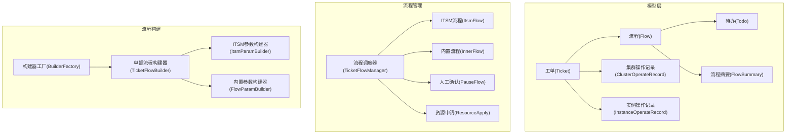
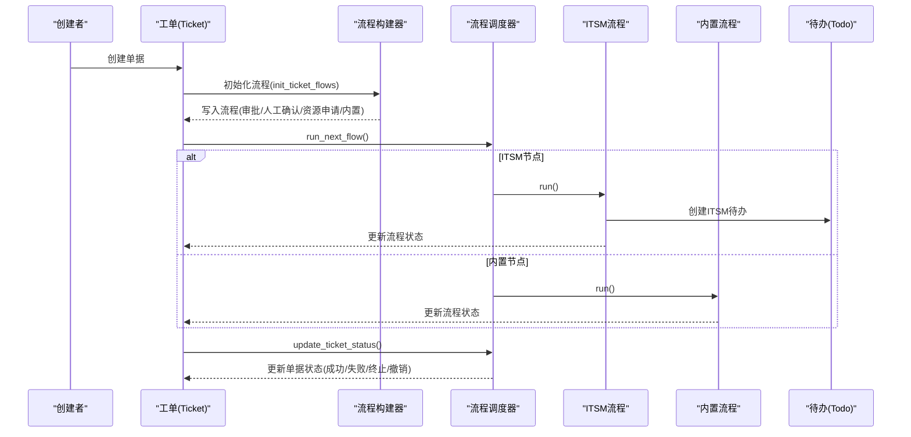
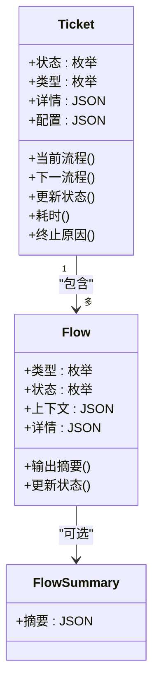
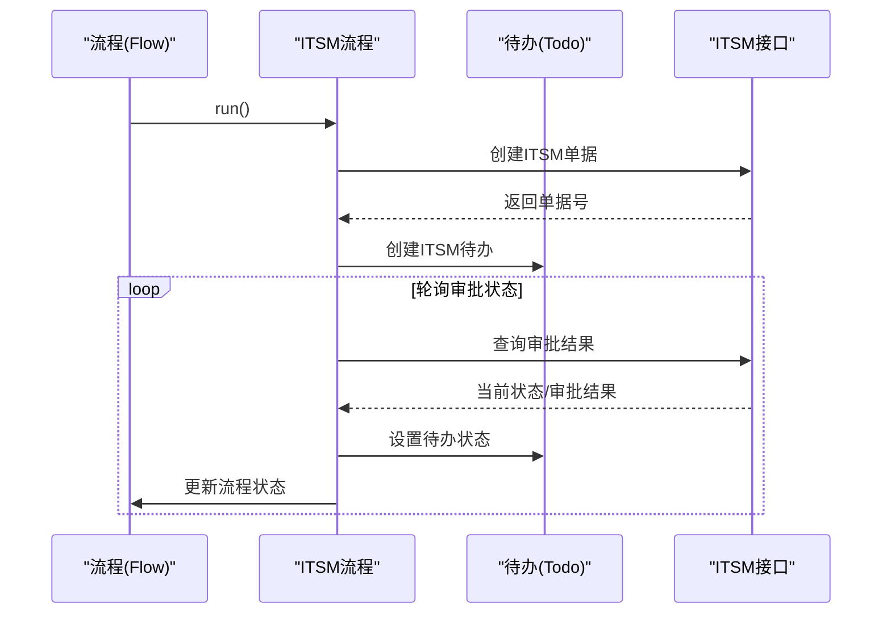
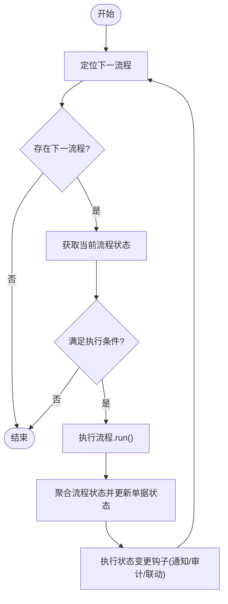
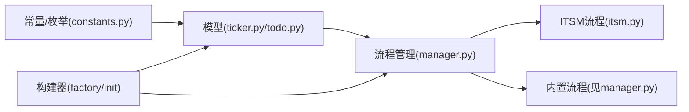

# 工单模型

<cite>
**本文引用的文件**
- [ticket.py](file://dbm-ui/backend/ticket/models/ticket.py)
- [todo.py](file://dbm-ui/backend/ticket/models/todo.py)
- [constants.py](file://dbm-ui/backend/ticket/constants.py)
- [itsm.py](file://dbm-ui/backend/ticket/flow_manager/itsm.py)
- [manager.py](file://dbm-ui/backend/ticket/flow_manager/manager.py)
- [builders/__init__.py](file://dbm-ui/backend/ticket/builders/__init__.py)
- [sqlserver_data_export.py](file://dbm-ui/backend/ticket/builders/sqlserver/sqlserver_data_export.py)
- [itsm_todo.py](file://dbm-ui/backend/ticket/todos/itsm_todo.py)
- [0001_initial.py](file://dbm-ui/backend/ticket/migrations/0001_initial.py)
</cite>

## 目录
1. [简介](#简介)
2. [项目结构](#项目结构)
3. [核心组件](#核心组件)
4. [架构总览](#架构总览)
5. [详细组件分析](#详细组件分析)
6. [依赖分析](#依赖分析)
7. [性能考量](#性能考量)
8. [故障排查指南](#故障排查指南)
9. [结论](#结论)
10. [附录](#附录)

## 简介
本文件系统化梳理 DBM 的工单模型，覆盖工单、待办事项、流程等核心实体及其相互关系，明确状态流转与审批机制，解释工单与业务流程的绑定与执行策略，阐述权限控制与责任分配，记录数据查询统计与报表能力，并说明与外部流程引擎（ITSM）的集成方式。

## 项目结构
围绕工单模型的关键模块包括：
- 模型层：工单、流程、待办、流程摘要、集群/实例操作记录等
- 常量与枚举：工单类型、流程类型、状态、待办类型等
- 流程管理：流程调度器、ITSM 流程适配器、内置流程适配器等
- 流程构建：按单据类型构建流程序列（审批/人工确认/资源申请/内部执行）
- 待办适配：ITSM 待办上下文与操作

图表来源
- [ticket.py:133-768](file://dbm-ui/backend/ticket/models/ticket.py#L133-L768)
- [manager.py:62-178](file://dbm-ui/backend/ticket/flow_manager/manager.py#L62-L178)
- [itsm.py:27-146](file://dbm-ui/backend/ticket/flow_manager/itsm.py#L27-L146)
- [builders/__init__.py:492-771](file://dbm-ui/backend/ticket/builders/__init__.py#L492-L771)

章节来源
- [ticket.py:133-768](file://dbm-ui/backend/ticket/models/ticket.py#L133-L768)
- [constants.py:30-800](file://dbm-ui/backend/ticket/constants.py#L30-L800)
- [manager.py:62-178](file://dbm-ui/backend/ticket/flow_manager/manager.py#L62-L178)
- [builders/__init__.py:492-771](file://dbm-ui/backend/ticket/builders/__init__.py#L492-L771)

## 核心组件
- 工单（Ticket）：承载业务单据，包含类型、状态、详情、配置、通知设置等，提供耗时计算、终止原因解析、当前流程/下一流程定位、关联单据等能力。
- 流程（Flow）：单据内的步骤单元，支持 ITSM、内置执行、暂停、资源申请、定时、交付等类型，具备状态、上下文、输出摘要等属性。
- 待办（Todo）：与流程绑定的待办事项，支持 ITSM、人工确认、失败后确认、内部确认、资源补货、定时、回收/故障主机等类型，具备处理人、协助人、状态、完成人与时间等。
- 流程摘要（FlowSummary）：流程运行时的摘要/交付结果。
- 集群/实例操作记录：用于互斥控制与运行状态可视化，支撑集群/实例层面的并发保护与状态追踪。

章节来源
- [ticket.py:133-768](file://dbm-ui/backend/ticket/models/ticket.py#L133-L768)
- [todo.py:84-211](file://dbm-ui/backend/ticket/models/todo.py#L84-L211)
- [constants.py:30-800](file://dbm-ui/backend/ticket/constants.py#L30-L800)

## 架构总览
工单系统采用“单据驱动流程”的架构：创建单据后，由构建器按单据类型生成流程序列（审批/人工确认/资源申请/内置执行），流程调度器按序驱动执行，ITSM 流程与内置流程分别对接外部 ITSM 与内部执行引擎，最终通过待办与流程状态联动更新单据整体状态。

图表来源
- [builders/__init__.py:581-653](file://dbm-ui/backend/ticket/builders/__init__.py#L581-L653)
- [manager.py:73-135](file://dbm-ui/backend/ticket/flow_manager/manager.py#L73-L135)
- [itsm.py:126-146](file://dbm-ui/backend/ticket/flow_manager/itsm.py#L126-L146)
- [ticket.py:280-331](file://dbm-ui/backend/ticket/models/ticket.py#L280-L331)

## 详细组件分析

### 工单（Ticket）与流程（Flow）
- 工单状态与流程状态映射：流程状态集合决定单据最终状态，优先级为终止 > 失败 > 撤销 > 运行中 > 成功。
- 当前/下一流程定位：基于流程对象 ID 与状态判断，支持跳过 ITSM 节点的环境配置。
- 流程上下文：用于传递执行上下文与互斥控制信息，支持重试类型（自动/手动）。
- 输出摘要：内置流程可通过 FlowSummary 汇总执行结果，便于报表与审计。

图表来源
- [ticket.py:133-280](file://dbm-ui/backend/ticket/models/ticket.py#L133-L280)
- [ticket.py:50-115](file://dbm-ui/backend/ticket/models/ticket.py#L50-L115)

章节来源
- [ticket.py:133-280](file://dbm-ui/backend/ticket/models/ticket.py#L133-L280)
- [ticket.py:50-115](file://dbm-ui/backend/ticket/models/ticket.py#L50-L115)

### 待办（Todo）与审批（ITSM）
- 待办类型：ITSM、人工确认、失败后确认、内部确认、资源补货、定时、回收/故障主机等。
- 处理人与协助人：依据单据状态与 DBA 配置动态计算，ITSM 待办从 ITSM 构建器获取审批人。
- 待办状态：待处理、已处理、已终止；完成时记录完成人与时间。
- ITSM 待办：创建 ITSM 单据并生成 ITSM 待办，审批状态变化映射为流程与单据状态。

图表来源
- [itsm.py:126-146](file://dbm-ui/backend/ticket/flow_manager/itsm.py#L126-L146)
- [itsm.py:91-118](file://dbm-ui/backend/ticket/flow_manager/itsm.py#L91-L118)
- [todo.py:123-145](file://dbm-ui/backend/ticket/models/todo.py#L123-L145)
- [itsm_todo.py:60-86](file://dbm-ui/backend/ticket/todos/itsm_todo.py#L60-L86)

章节来源
- [todo.py:84-145](file://dbm-ui/backend/ticket/models/todo.py#L84-L145)
- [itsm.py:91-118](file://dbm-ui/backend/ticket/flow_manager/itsm.py#L91-L118)
- [itsm_todo.py:60-86](file://dbm-ui/backend/ticket/todos/itsm_todo.py#L60-L86)

### 流程调度与执行策略
- 调度器：按序驱动下一流程，确保并发一致性；初始流程或当前流程完成后方可推进。
- 状态聚合：根据各流程状态聚合计算单据状态，触发状态变更钩子（通知、审计、联动回收等）。
- 执行策略：内置流程通过控制器函数执行具体业务；ITSM 流程对接外部审批；暂停节点用于人工确认；资源申请节点用于资源池对接。

图表来源
- [manager.py:73-135](file://dbm-ui/backend/ticket/flow_manager/manager.py#L73-L135)

章节来源
- [manager.py:62-135](file://dbm-ui/backend/ticket/flow_manager/manager.py#L62-L135)

### 工单与业务流程的绑定与执行
- 构建器：按单据类型生成流程序列，支持 ITSM、人工确认、资源申请、内置执行等节点组合。
- 默认流程：审批（可选）→ 人工确认（可选）→ 资源申请（按需）→ 内置执行。
- 自定义流程：复杂场景可覆写构建器以替换内置执行节点或增加描述/定时节点。
- 示例：SQLServer 数据导出单据构建包含“运维审批”“产品审批”“人工确认”“数据导出执行”。

章节来源
- [builders/__init__.py:581-653](file://dbm-ui/backend/ticket/builders/__init__.py#L581-L653)
- [builders/__init__.py:675-690](file://dbm-ui/backend/ticket/builders/__init__.py#L675-L690)
- [sqlserver_data_export.py:153-176](file://dbm-ui/backend/ticket/builders/sqlserver/sqlserver_data_export.py#L153-L176)

### 权限控制与责任分配
- 审批人：ITSM 审批人默认取业务 DBA，必要时追加 admin。
- 处理人与协助人：依据待办类型与单据状态动态计算，支持 DBA、协助人、第二 DBA、其他 DBA 等角色。
- 权限动作映射：单据类型与 IAM 动作/资源类型映射，用于鉴权与审计事件上报。
- 责任分配：通过待办的 operators/helpers 字段明确处理人与协助人，完成时记录完成人与时间。

章节来源
- [builders/__init__.py:128-134](file://dbm-ui/backend/ticket/builders/__init__.py#L128-L134)
- [todo.py:35-72](file://dbm-ui/backend/ticket/models/todo.py#L35-L72)
- [constants.py:170-181](file://dbm-ui/backend/ticket/constants.py#L170-L181)

### 数据查询统计与报表
- 单据计数类型：我的申请、待我审批、待我确认执行、待我继续、待我补货、失败待处理、我的已办、我负责的业务、定时等。
- 集群/实例互斥：通过集群操作记录与实例操作记录，提供正在运行的任务列表与互斥判断，支持加锁读取避免并发异常。
- 报表与导出：内置流程可生成执行结果摘要，授权类流程可生成授权结果 Excel 下载链接，便于报表与审计。

章节来源
- [constants.py:47-61](file://dbm-ui/backend/ticket/constants.py#L47-L61)
- [ticket.py:473-584](file://dbm-ui/backend/ticket/models/ticket.py#L473-L584)
- [builders/__init__.py:84-91](file://dbm-ui/backend/ticket/builders/__init__.py#L84-L91)

### 与外部流程引擎（ITSM）的集成
- 单据创建：ITSM 参数构建器格式化审批标题、业务、域名、摘要、审批人、回调地址等字段，创建 ITSM 单据。
- 状态同步：轮询 ITSM 审批状态，映射为流程与单据状态，更新待办状态与流程状态。
- 回调与通知：ITSM 回调触发通知；单据状态变更时触发审计事件与通知。

章节来源
- [builders/__init__.py:139-168](file://dbm-ui/backend/ticket/builders/__init__.py#L139-L168)
- [itsm.py:31-87](file://dbm-ui/backend/ticket/flow_manager/itsm.py#L31-L87)
- [itsm.py:126-146](file://dbm-ui/backend/ticket/flow_manager/itsm.py#L126-L146)
- [manager.py:136-148](file://dbm-ui/backend/ticket/flow_manager/manager.py#L136-L148)

## 依赖分析
- 模块耦合：流程调度器依赖流程类型映射与各流程适配器；流程适配器依赖模型层（Flow/Todo）与外部接口（ITSM）。
- 枚举与常量：统一定义在 constants 中，被模型与流程构建器广泛引用。
- 构建器工厂：集中注册与获取单据构建器，支持按单据类型动态装配流程。

图表来源
- [constants.py:30-800](file://dbm-ui/backend/ticket/constants.py#L30-L800)
- [manager.py:42-57](file://dbm-ui/backend/ticket/flow_manager/manager.py#L42-L57)
- [builders/__init__.py:693-771](file://dbm-ui/backend/ticket/builders/__init__.py#L693-L771)

章节来源
- [constants.py:30-800](file://dbm-ui/backend/ticket/constants.py#L30-L800)
- [manager.py:42-57](file://dbm-ui/backend/ticket/flow_manager/manager.py#L42-L57)
- [builders/__init__.py:693-771](file://dbm-ui/backend/ticket/builders/__init__.py#L693-L771)

## 性能考量
- 并发一致性：流程推进前先取下一流程，再取当前流程，避免并发导致的顺序错乱；状态更新采用原子更新。
- 互斥控制：集群/实例操作记录提供加锁读取，避免并发冲突；支持互斥映射与解锁条件。
- 状态聚合：按流程状态集合聚合计算单据状态，减少重复扫描；通知与审计事件异步触发。
- 资源申请校验：资源规格与数量在流程参数构建阶段进行校验，降低执行期失败概率。

章节来源
- [manager.py:73-135](file://dbm-ui/backend/ticket/flow_manager/manager.py#L73-L135)
- [ticket.py:547-584](file://dbm-ui/backend/ticket/models/ticket.py#L547-L584)
- [builders/__init__.py:223-247](file://dbm-ui/backend/ticket/builders/__init__.py#L223-L247)

## 故障排查指南
- 单据状态异常：检查流程状态集合与聚合逻辑，确认是否存在终止/失败/撤销状态；查看流程错误码与上下文。
- ITSM 审批不同步：核对 ITSM 回调地址与轮询逻辑，确认审批状态映射与待办状态更新是否正确。
- 待办处理人缺失：检查待办类型与处理人计算逻辑，确认 DBA 配置与单据配置是否正确。
- 资源申请失败：核对资源规格与数量校验，确认资源池服务可用性与亲和性参数配置。
- 互斥冲突：检查集群/实例操作记录与互斥映射，确认解锁条件与并发控制策略。

章节来源
- [ticket.py:206-218](file://dbm-ui/backend/ticket/models/ticket.py#L206-L218)
- [itsm.py:91-118](file://dbm-ui/backend/ticket/flow_manager/itsm.py#L91-L118)
- [todo.py:35-72](file://dbm-ui/backend/ticket/models/todo.py#L35-L72)
- [builders/__init__.py:223-247](file://dbm-ui/backend/ticket/builders/__init__.py#L223-L247)
- [ticket.py:547-584](file://dbm-ui/backend/ticket/models/ticket.py#L547-L584)

## 结论
DBM 工单模型以“单据驱动流程”为核心，通过统一的流程调度器与多种流程适配器（ITSM、内置、暂停、资源申请等）实现灵活的业务编排；借助待办与流程状态映射，保障审批与执行过程的可观测与可追溯；通过构建器工厂与配置体系，实现按业务类型与业务域的差异化流程定制；配合互斥控制与审计通知机制，满足生产环境的稳定性与合规性要求。

## 附录
- 数据模型索引与字段参考：待办模型包含关联流程、工单、处理人、状态、完成人与时间等字段，便于查询与统计。

章节来源
- [0001_initial.py:154-181](file://dbm-ui/backend/ticket/migrations/0001_initial.py#L154-L181)
- [todo.py:84-114](file://dbm-ui/backend/ticket/models/todo.py#L84-L114)