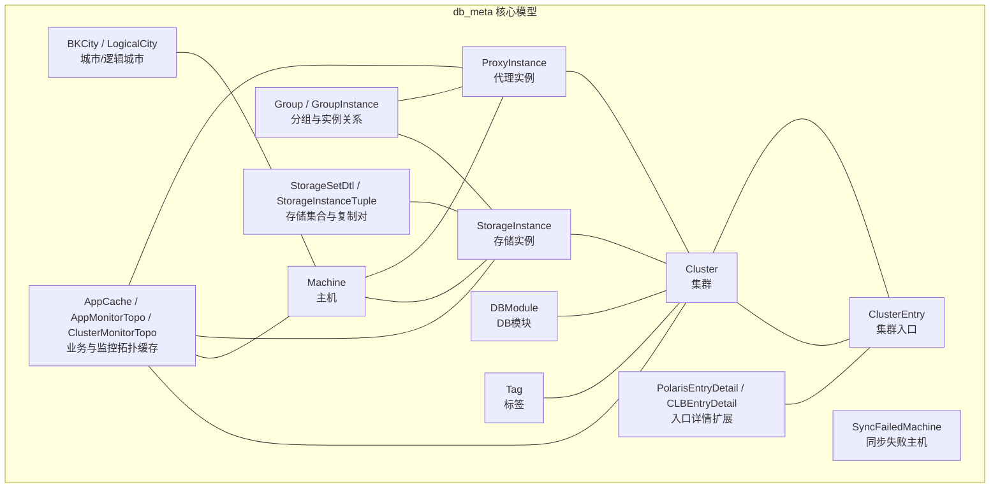
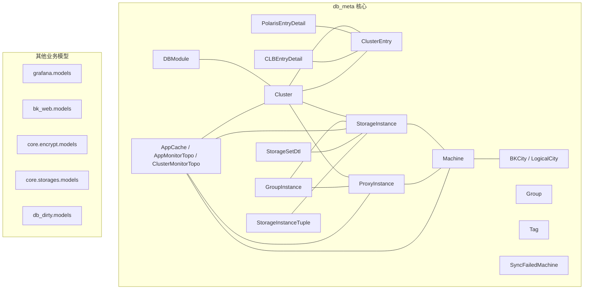
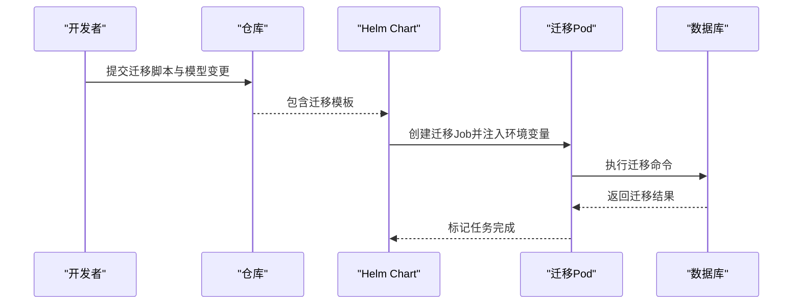
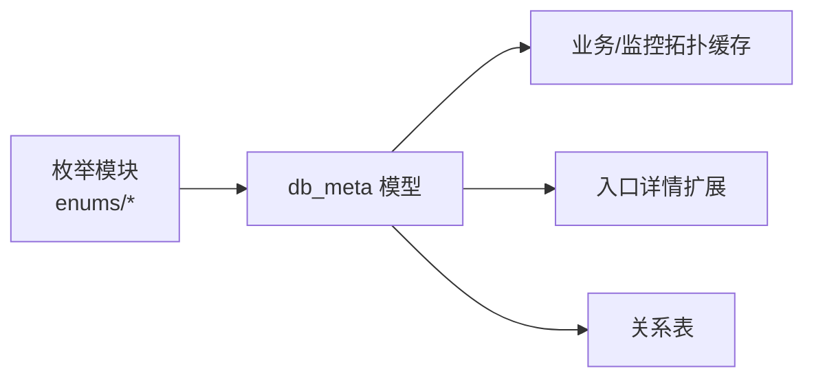

# 数据模型设计

<cite>
**本文引用的文件**
- [0001_initial.py](file://dbm-ui/backend/db_meta/migrations/0001_initial.py)
- [__init__.py（枚举导出）](file://dbm-ui/backend/db_meta/enums/__init__.py)
- [migrate-job.yaml](file://helm-charts/bk-dbm/charts/dbm/templates/jobs/migrate-job.yaml)
- [models.py（grafana 模型）](file://dbm-ui/backend/bk_dataview/grafana/models.py)
- [models.py（bk_web 模型）](file://dbm-ui/backend/bk_web/models.py)
- [models.py（encrypt 模型）](file://dbm-ui/backend/core/encrypt/models.py)
- [models.py（storages 模型）](file://dbm-ui/backend/core/storages/models.py)
- [models.py（db_dirty 模型）](file://dbm-ui/backend/db_dirty/models.py)
</cite>

## 目录
1. [简介](#简介)
2. [项目结构](#项目结构)
3. [核心组件](#核心组件)
4. [架构总览](#架构总览)
5. [详细组件分析](#详细组件分析)
6. [依赖分析](#依赖分析)
7. [性能考虑](#性能考虑)
8. [故障排查指南](#故障排查指南)
9. [结论](#结论)
10. [附录](#附录)

## 简介
本文件面向 DBM 的数据模型设计，系统性梳理实体关系、字段定义与数据类型、主键/外键与索引约束、数据验证与业务规则，并给出数据库模式图与示例数据。同时覆盖数据访问模式、缓存策略、性能优化建议、数据生命周期与归档策略、数据迁移路径与版本管理、以及数据安全与隐私要求。

## 项目结构
DBM 的数据模型主要位于后端 Python/Django 工程中，核心位于 dbm-ui/backend/db_meta 子系统，配合枚举与迁移脚本完成模型演进；同时在其他子应用中也存在各自的数据模型以支撑业务功能。

图表来源
- [0001_initial.py:28-571](file://dbm-ui/backend/db_meta/migrations/0001_initial.py#L28-L571)

章节来源
- [0001_initial.py:1-571](file://dbm-ui/backend/db_meta/migrations/0001_initial.py#L1-L571)

## 核心组件
本节从实体、字段、类型、约束与关系五个维度，对关键模型进行逐项说明。

- 集群 Cluster
  - 字段要点：名称、别名、业务ID、集群类型、DB模块ID、不可变域名、主版本号、阶段、状态、云区域、地域、时区等
  - 主键：自增ID
  - 约束：唯一联合索引（业务ID，名称，集群类型，DB模块ID）
  - 关系：与 ClusterEntry 多对一；与 StorageInstance/ProxyInstance 通过中间表关联

- 主机 Machine
  - 字段要点：IP、业务ID、DB模块ID、接入层、机型、集群类型、主机ID、操作系统、机房/区域/子区、 Rack、网络设备ID、城市
  - 主键：主机ID（bk_host_id）
  - 约束：唯一联合索引（IP，云区域ID）
  - 关系：与 StorageInstance/ProxyInstance 一对多；与 BKCity 外键

- 存储实例 StorageInstance
  - 字段要点：版本、端口、DB模块ID、业务ID、接入层、机型、角色、内角色、集群类型、状态、阶段、名称、时区、绑定入口、所属集群、机器
  - 主键：自增ID
  - 约束：唯一联合索引（机器，端口）
  - 关系：与 Cluster/ClusterEntry 多对多；与 Machine 外键

- 代理实例 ProxyInstance
  - 字段要点：版本、端口、管理端口、DB模块ID、业务ID、接入层、机型、集群类型、状态、名称、时区、绑定入口、所属集群、机器、存储实例
  - 主键：自增ID
  - 约束：唯一联合索引（机器，端口）
  - 关系：与 Cluster/ClusterEntry 多对多；与 Machine 外键；与 StorageInstance 多对多

- 集群入口 ClusterEntry
  - 字段要点：入口类型、入口值、所属集群
  - 主键：自增ID
  - 约束：唯一联合索引（入口类型，入口值）
  - 关系：与 Cluster 外键（保护删除）

- DB模块 DBModule
  - 字段要点：业务ID、模块名、模块ID、集群类型
  - 主键：模块ID（自增）
  - 约束：唯一联合索引（模块名，业务ID，集群类型）、（模块ID，业务ID，集群类型）

- 分组与关系 Group / GroupInstance
  - 字段要点：分组名、业务ID；分组ID-实例ID映射
  - 关系：GroupInstance 将 Group 与 StorageInstance/ProxyInstance 绑定

- 城市与逻辑城市 BKCity / LogicalCity
  - 字段要点：名称、唯一性约束
  - 关系：BKCity -> LogicalCity（保护删除）

- 标签 Tag
  - 字段要点：业务ID、标签名
  - 约束：唯一联合索引（业务ID，标签名）

- 业务与监控拓扑缓存 AppCache / AppMonitorTopo / ClusterMonitorTopo
  - 字段要点：业务信息、监控插件、CMDB 集合/模块映射等
  - 用途：加速查询与减少外部依赖调用

- 同步失败主机 SyncFailedMachine
  - 字段要点：主机ID、错误信息
  - 用途：记录外部同步失败的主机以便重试或人工处理

- 入口详情扩展 PolarisEntryDetail / CLBEntryDetail
  - 字段要点：Polaris/CLB 相关标识与令牌、入口外键
  - 关系：与 ClusterEntry 一对一

- 存储集合与复制对 StorageSetDtl / StorageInstanceTuple
  - 字段要点：分片范围、实例、集群
  - 约束：唯一联合索引（实例，集群，业务ID）
  - 关系：描述实例与集群的归属及分片范围；Tuple 描述复制对

章节来源
- [0001_initial.py:96-137](file://dbm-ui/backend/db_meta/migrations/0001_initial.py#L96-L137)
- [0001_initial.py:214-266](file://dbm-ui/backend/db_meta/migrations/0001_initial.py#L214-L266)
- [0001_initial.py:267-347](file://dbm-ui/backend/db_meta/migrations/0001_initial.py#L267-L347)
- [0001_initial.py:511-570](file://dbm-ui/backend/db_meta/migrations/0001_initial.py#L511-L570)
- [0001_initial.py:138-156](file://dbm-ui/backend/db_meta/migrations/0001_initial.py#L138-L156)
- [0001_initial.py:413-434](file://dbm-ui/backend/db_meta/migrations/0001_initial.py#L413-L434)
- [0001_initial.py:396-412](file://dbm-ui/backend/db_meta/migrations/0001_initial.py#L396-L412)
- [0001_initial.py:48-81](file://dbm-ui/backend/db_meta/migrations/0001_initial.py#L48-L81)
- [0001_initial.py:348-362](file://dbm-ui/backend/db_meta/migrations/0001_initial.py#L348-L362)
- [0001_initial.py:378-395](file://dbm-ui/backend/db_meta/migrations/0001_initial.py#L378-L395)
- [0001_initial.py:435-452](file://dbm-ui/backend/db_meta/migrations/0001_initial.py#L435-L452)
- [0001_initial.py:458-479](file://dbm-ui/backend/db_meta/migrations/0001_initial.py#L458-L479)
- [0001_initial.py:480-510](file://dbm-ui/backend/db_meta/migrations/0001_initial.py#L480-L510)

## 架构总览
下图展示 DBM 数据模型在不同子系统中的分布与交互，重点体现 db_meta 核心模型与其他业务模型的关系。

图表来源
- [0001_initial.py:28-571](file://dbm-ui/backend/db_meta/migrations/0001_initial.py#L28-L571)
- [models.py（grafana 模型）](file://dbm-ui/backend/bk_dataview/grafana/models.py)
- [models.py（bk_web 模型）](file://dbm-ui/backend/bk_web/models.py)
- [models.py（encrypt 模型）](file://dbm-ui/backend/core/encrypt/models.py)
- [models.py（storages 模型）](file://dbm-ui/backend/core/storages/models.py)
- [models.py（db_dirty 模型）](file://dbm-ui/backend/db_dirty/models.py)

## 详细组件分析

### 实体关系与字段定义
- 主键与外键
  - ClusterEntry.cluster 外键指向 Cluster，删除策略为保护删除
  - Machine.bk_city 外键指向 BKCity，删除策略为保护删除
  - StorageInstance.machine 外键指向 Machine，删除策略为保护删除
  - ProxyInstance.machine 外键指向 Machine，删除策略为保护删除
  - PolarisEntryDetail.entry 外键指向 ClusterEntry，删除策略为级联
  - CLBEntryDetail.entry 外键指向 ClusterEntry，删除策略为级联
  - StorageSetDtl.cluster 外键指向 Cluster，删除策略为级联；StorageSetDtl.instance 外键指向 StorageInstance，删除策略为级联
  - StorageInstanceTuple.ejector/receiver 外键均指向 StorageInstance，删除策略为级联

- 索引与唯一约束
  - Cluster：唯一联合索引（业务ID，名称，集群类型，DB模块ID）
  - Machine：唯一联合索引（IP，云区域ID）
  - StorageInstance：唯一联合索引（机器，端口）
  - ProxyInstance：唯一联合索引（机器，端口）
  - ClusterEntry：唯一联合索引（入口类型，入口值）
  - DBModule：唯一联合索引（模块名，业务ID，集群类型）、（模块ID，业务ID，集群类型）
  - StorageSetDtl：唯一联合索引（实例，集群，业务ID）
  - Tag：唯一联合索引（业务ID，标签名）
  - PolarisEntryDetail：唯一索引（polaris_name）
  - CLBEntryDetail：唯一索引（clb_ip）

- 字段类型与含义
  - 文本类：CharField（含最大长度、默认值、帮助文本）
  - 数值类：IntegerField/PositiveIntegerField（含默认值、范围约束）
  - 时间类：DateTimeField（auto_now/auto_now_add）
  - IP类：GenericIPAddressField
  - 枚举类：通过 ChoiceField 映射枚举值（如 ClusterType、MachineType、InstanceRole 等）
  - 多对多：ManyToManyField（如 StorageInstance.bind_entry、cluster）

章节来源
- [0001_initial.py:96-137](file://dbm-ui/backend/db_meta/migrations/0001_initial.py#L96-L137)
- [0001_initial.py:138-156](file://dbm-ui/backend/db_meta/migrations/0001_initial.py#L138-L156)
- [0001_initial.py:214-266](file://dbm-ui/backend/db_meta/migrations/0001_initial.py#L214-L266)
- [0001_initial.py:267-347](file://dbm-ui/backend/db_meta/migrations/0001_initial.py#L267-L347)
- [0001_initial.py:413-434](file://dbm-ui/backend/db_meta/migrations/0001_initial.py#L413-L434)
- [0001_initial.py:435-452](file://dbm-ui/backend/db_meta/migrations/0001_initial.py#L435-L452)
- [0001_initial.py:458-479](file://dbm-ui/backend/db_meta/migrations/0001_initial.py#L458-L479)
- [0001_initial.py:480-510](file://dbm-ui/backend/db_meta/migrations/0001_initial.py#L480-L510)
- [__init__.py（枚举导出）:11-38](file://dbm-ui/backend/db_meta/enums/__init__.py#L11-L38)

### 数据验证与业务规则
- 枚举约束：通过枚举类统一取值范围，确保状态、角色、类型等字段一致性
- 唯一性约束：防止重复注册与配置冲突
- 外键保护：禁止误删被引用对象，保障数据完整性
- 时区与时序：实例与集群均包含时区字段，便于跨时区场景的时间计算与展示
- 分片与复制：通过 StorageSetDtl 与 StorageInstanceTuple 描述分片范围与复制对，支撑高可用与扩缩容

章节来源
- [__init__.py（枚举导出）:11-38](file://dbm-ui/backend/db_meta/enums/__init__.py#L11-L38)
- [0001_initial.py:458-479](file://dbm-ui/backend/db_meta/migrations/0001_initial.py#L458-L479)
- [0001_initial.py:480-510](file://dbm-ui/backend/db_meta/migrations/0001_initial.py#L480-L510)

### 示例数据
以下为常见实体的示例数据结构（仅示意，非真实数据）：
- Cluster
  - 字段：name, alias, bk_biz_id, cluster_type, db_module_id, immute_domain, major_version, phase, status, bk_cloud_id, region, time_zone
  - 示例：{"name":"tendbcluster","bk_biz_id":2,"cluster_type":"TenDBCluster","db_module_id":1001,"immute_domain":"cluster.example.com","phase":"online","status":"normal","bk_cloud_id":0,"region":"gz","time_zone":"+08:00"}
- Machine
  - 字段：ip, bk_host_id, machine_type, access_layer, bk_city_id
  - 示例：{"ip":"1.1.1.1","bk_host_id":10001,"machine_type":"SINGLE","access_layer":"storage","bk_city_id":1}
- StorageInstance
  - 字段：machine_id, port, instance_role, instance_inner_role, cluster_type, status, phase
  - 示例：{"machine_id":10001,"port":20000,"instance_role":"BACKEND_RW","instance_inner_role":"MASTER","cluster_type":"TENDBCLUSTER","status":"running","phase":"online"}
- ProxyInstance
  - 字段：machine_id, port, admin_port, machine_type, cluster_type, status
  - 示例：{"machine_id":10001,"port":10000,"admin_port":30000,"machine_type":"PROXY","cluster_type":"TENDBCLUSTER","status":"running"}
- ClusterEntry
  - 字段：cluster_id, cluster_entry_type, entry
  - 示例：{"cluster_id":1,"cluster_entry_type":"ADMIN","entry":"admin.cluster.example.com"}

章节来源
- [0001_initial.py:96-137](file://dbm-ui/backend/db_meta/migrations/0001_initial.py#L96-L137)
- [0001_initial.py:138-156](file://dbm-ui/backend/db_meta/migrations/0001_initial.py#L138-L156)
- [0001_initial.py:214-266](file://dbm-ui/backend/db_meta/migrations/0001_initial.py#L214-L266)
- [0001_initial.py:267-347](file://dbm-ui/backend/db_meta/migrations/0001_initial.py#L267-L347)
- [0001_initial.py:511-570](file://dbm-ui/backend/db_meta/migrations/0001_initial.py#L511-L570)

### 数据访问模式与缓存策略
- 访问模式
  - 读多写少：业务与监控拓扑缓存表用于降低外部系统调用频率
  - 关联查询：通过外键与多对多关系实现跨实体聚合查询
  - 分页与过滤：结合唯一索引与组合索引支持高效分页与过滤
- 缓存策略
  - AppCache/AppMonitorTopo/ClusterMonitorTopo：集中式缓存业务与监控拓扑，定期刷新
  - 同步失败记录：SyncFailedMachine 用于追踪与重试

章节来源
- [0001_initial.py:48-81](file://dbm-ui/backend/db_meta/migrations/0001_initial.py#L48-L81)
- [0001_initial.py:348-362](file://dbm-ui/backend/db_meta/migrations/0001_initial.py#L348-L362)

### 性能考虑
- 索引优化
  - 在高频过滤字段上建立唯一索引或组合索引，如 Cluster 的唯一联合索引、Machine 的 IP+云区域唯一索引
- 查询优化
  - 使用 select_related/ prefetch_related 减少 N+1 查询
  - 对大表分页时使用基于索引的游标分页
- 写入优化
  - 批量插入与事务合并，避免频繁小事务
- 存储与复制
  - 利用 StorageInstanceTuple 描述复制对，结合 StorageSetDtl 的分片范围，提升扩容与迁移效率

章节来源
- [0001_initial.py:96-137](file://dbm-ui/backend/db_meta/migrations/0001_initial.py#L96-L137)
- [0001_initial.py:214-266](file://dbm-ui/backend/db_meta/migrations/0001_initial.py#L214-L266)
- [0001_initial.py:458-479](file://dbm-ui/backend/db_meta/migrations/0001_initial.py#L458-L479)
- [0001_initial.py:480-510](file://dbm-ui/backend/db_meta/migrations/0001_initial.py#L480-L510)

### 数据生命周期、保留策略与归档规则
- 生命周期
  - 集群：在线阶段可变更；下线后进入归档流程
  - 实例：随集群生命周期变化；停用后进入归档
- 保留策略
  - 建议按业务与合规要求设置保留周期（例如：日志与审计数据保留90天至1年）
- 归档规则
  - 通过标记状态字段与独立归档库/表实现；归档前需保证数据完整性与可恢复性

（本节为通用实践建议，不直接引用具体代码）

### 数据迁移路径与版本管理
- 迁移执行
  - 通过 Django 迁移脚本初始化与演进模型
  - Helm Chart 中提供迁移 Job，启动时自动执行迁移命令
- 版本管理
  - 迁移文件命名与顺序即版本序列；新增字段与索引通过新迁移维护
  - 迁移作业在部署时自动执行，确保数据库结构与代码一致

图表来源
- [migrate-job.yaml:23-27](file://helm-charts/bk-dbm/charts/dbm/templates/jobs/migrate-job.yaml#L23-L27)

章节来源
- [migrate-job.yaml:1-37](file://helm-charts/bk-dbm/charts/dbm/templates/jobs/migrate-job.yaml#L1-L37)
- [0001_initial.py:1-27](file://dbm-ui/backend/db_meta/migrations/0001_initial.py#L1-L27)

### 数据安全、隐私要求与访问控制
- 安全基线
  - 严格限制敏感字段（如入口令牌）的可见范围与访问权限
  - 对外部接口与内部服务间通信启用加密与鉴权
- 隐私保护
  - 业务与主机信息属于敏感数据，应遵循最小化原则与合规要求
- 访问控制
  - 建议在应用层引入基于角色的访问控制（RBAC），限制对 db_meta 与业务模型的写操作权限
  - 对迁移与运维操作采用双人复核与审计日志

（本节为通用实践建议，不直接引用具体代码）

## 依赖分析
- 枚举依赖
  - 模型通过导入枚举类统一状态与角色取值，确保一致性
- 外部系统依赖
  - 业务与监控拓扑缓存表用于降低对外部系统（如 CMDB、监控）的依赖
- 模块耦合
  - db_meta 核心模型之间耦合度适中，通过外键与多对多关系解耦业务模型

图表来源
- [__init__.py（枚举导出）:11-38](file://dbm-ui/backend/db_meta/enums/__init__.py#L11-L38)
- [0001_initial.py:48-81](file://dbm-ui/backend/db_meta/migrations/0001_initial.py#L48-L81)
- [0001_initial.py:378-395](file://dbm-ui/backend/db_meta/migrations/0001_initial.py#L378-L395)
- [0001_initial.py:435-452](file://dbm-ui/backend/db_meta/migrations/0001_initial.py#L435-L452)
- [0001_initial.py:480-510](file://dbm-ui/backend/db_meta/migrations/0001_initial.py#L480-L510)

章节来源
- [__init__.py（枚举导出）:11-38](file://dbm-ui/backend/db_meta/enums/__init__.py#L11-L38)
- [0001_initial.py:48-81](file://dbm-ui/backend/db_meta/migrations/0001_initial.py#L48-L81)

## 性能考虑
- 索引与查询
  - 优先在过滤与排序字段上建立索引；避免在枚举字段上重复冗余索引
- 写入吞吐
  - 批量写入与事务合并；对大字段（如 JSON/长文本）谨慎使用
- 缓存与降载
  - 使用 AppCache/AppMonitorTopo/ClusterMonitorTopo 缓存热点数据，减少外部调用
- 分片与复制
  - 结合 StorageSetDtl 与 StorageInstanceTuple，合理规划分片与副本分布

（本节为通用指导，不直接引用具体代码）

## 故障排查指南
- 迁移失败
  - 检查迁移命令是否正确执行；确认数据库连接与权限
- 外键冲突
  - 删除或修改引用对象前，先清理或解除关联
- 唯一约束冲突
  - 核对唯一联合索引字段组合，避免重复注册
- 缓存异常
  - 清理缓存表并重新加载；检查缓存刷新策略

章节来源
- [migrate-job.yaml:23-27](file://helm-charts/bk-dbm/charts/dbm/templates/jobs/migrate-job.yaml#L23-L27)
- [0001_initial.py:96-137](file://dbm-ui/backend/db_meta/migrations/0001_initial.py#L96-L137)
- [0001_initial.py:214-266](file://dbm-ui/backend/db_meta/migrations/0001_initial.py#L214-L266)

## 结论
DBM 的数据模型以 db_meta 为核心，围绕集群、主机、实例、入口与模块等实体构建，辅以枚举与缓存机制，满足多数据库类型的统一管理需求。通过合理的索引、约束与迁移策略，保障了数据一致性与可演进性；结合缓存与分片复制设计，提升了查询与运维效率。建议在生产环境中进一步完善访问控制、隐私保护与归档策略，确保安全与合规。

## 附录
- 其他业务模型参考
  - grafana.models：监控可视化相关模型
  - bk_web.models：Web 层基础模型
  - core.encrypt.models：加密相关模型
  - core.storages.models：存储相关模型
  - db_dirty.models：脏数据相关模型

章节来源
- [models.py（grafana 模型）](file://dbm-ui/backend/bk_dataview/grafana/models.py)
- [models.py（bk_web 模型）](file://dbm-ui/backend/bk_web/models.py)
- [models.py（encrypt 模型）](file://dbm-ui/backend/core/encrypt/models.py)
- [models.py（storages 模型）](file://dbm-ui/backend/core/storages/models.py)
- [models.py（db_dirty 模型）](file://dbm-ui/backend/db_dirty/models.py)