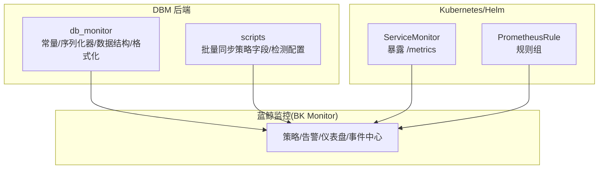
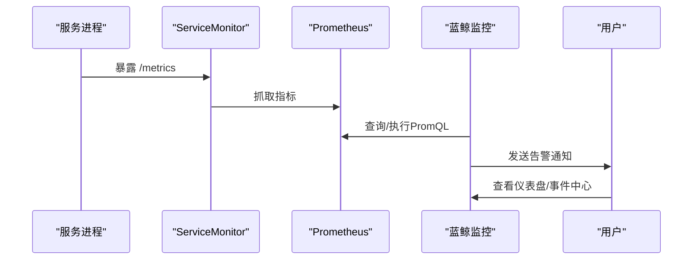
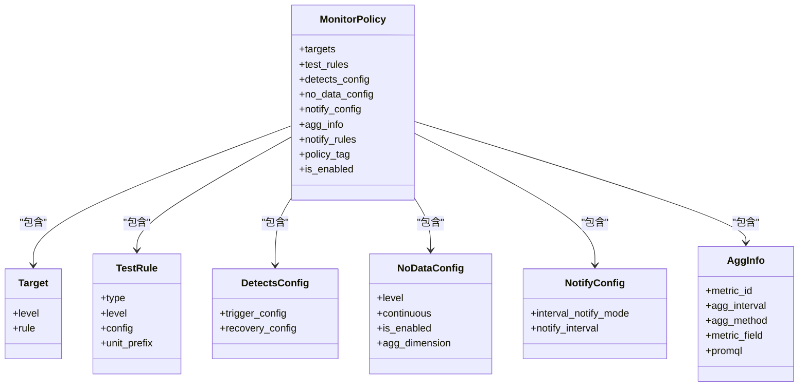
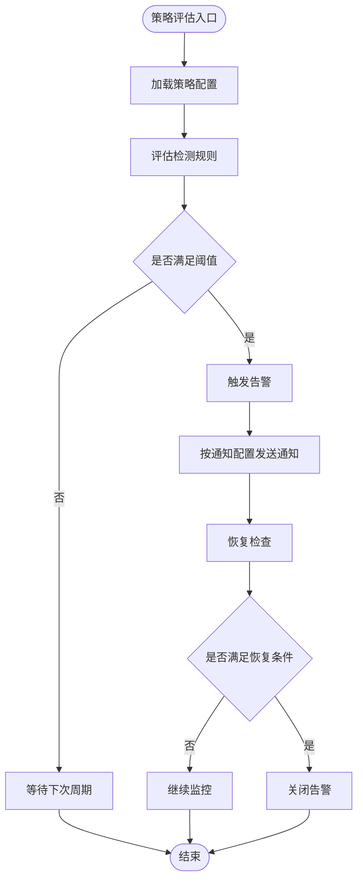
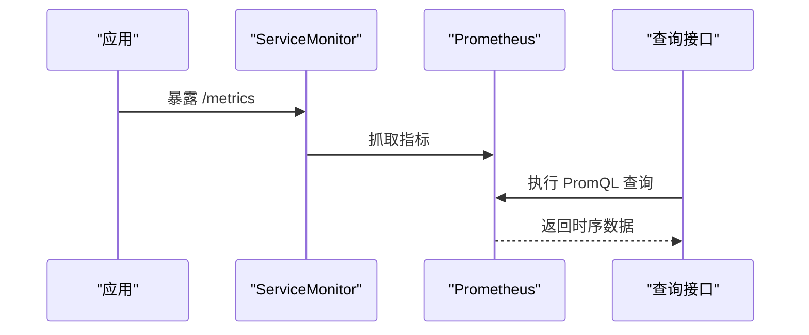
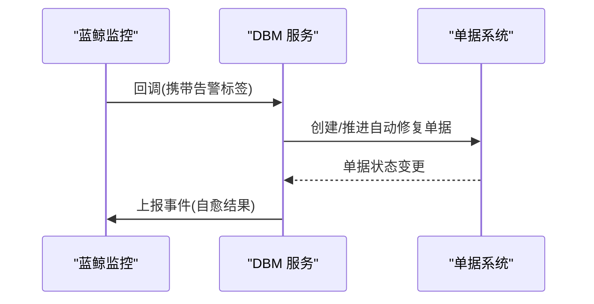
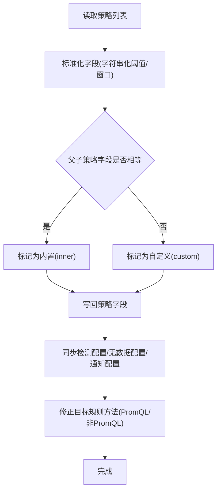
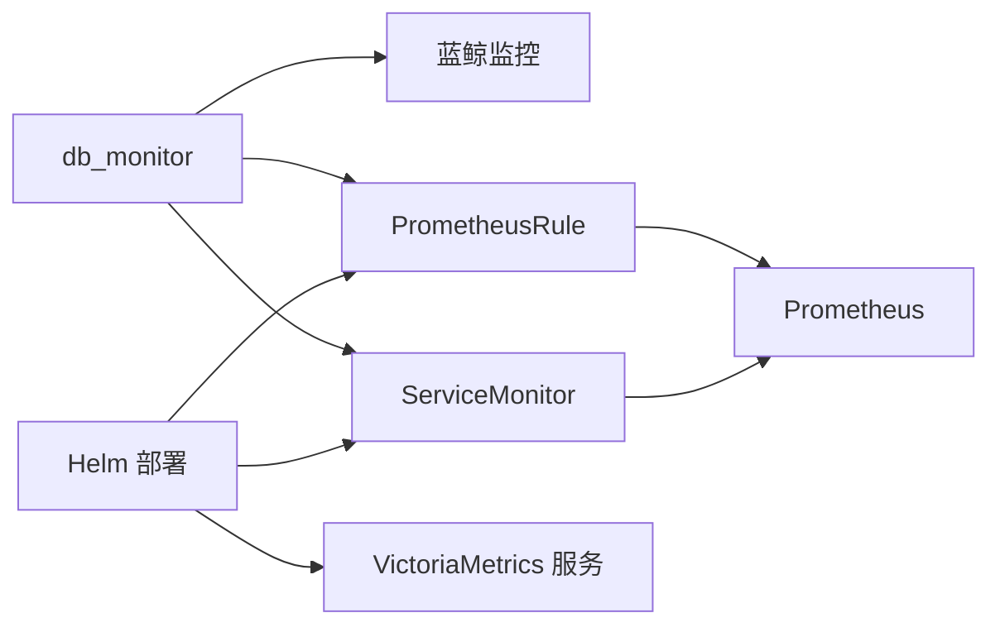

# 监控模型

<cite>
**本文引用的文件**
- [constants.py](file://dbm-ui/backend/db_monitor/constants.py)
- [serializers.py](file://dbm-ui/backend/db_monitor/serializers.py)
- [dataclass.py](file://dbm-ui/backend/db_monitor/dataclass.py)
- [format.py](file://dbm-ui/backend/db_monitor/format.py)
- [batch_sync_alarm_policy_field.py](file://dbm-ui/scripts/batch_sync_alarm_policy_field.py)
- [batch_policy_detects.py](file://dbm-ui/scripts/batch_policy_detects.py)
- [mysql_dbha_af_event_register.py](file://dbm-ui/backend/ticket/builders/mysql/dbha_autofix/mysql_dbha_af_event_register.py)
- [servicemonitor.yaml](file://helm-charts/bk-dbm/charts/k8s-dbs/templates/servicemonitor.yaml)
- [prometheusrules.yaml](file://helm-charts/bk-dbm/charts/grafana/templates/prometheusrules.yaml)
- [servicemonitor.yaml](file://helm-charts/bk-dbm/charts/grafana/templates/servicemonitor.yaml)
- [deployment.yaml](file://helm-charts/bk-dbm/charts/k8s-dbs/templates/deployment.yaml)
</cite>

## 目录
1. [简介](#简介)
2. [项目结构](#项目结构)
3. [核心组件](#核心组件)
4. [架构总览](#架构总览)
5. [详细组件分析](#详细组件分析)
6. [依赖关系分析](#依赖关系分析)
7. [性能考量](#性能考量)
8. [故障排查指南](#故障排查指南)
9. [结论](#结论)
10. [附录](#附录)

## 简介
本文件系统性梳理 DBM 的监控模型，覆盖告警、指标、策略等监控实体的设计与用途；记录监控数据的采集、存储与查询模式；解释告警规则的配置格式与触发机制；给出监控指标的分类体系与命名规范；说明监控数据的时间序列存储策略与历史数据管理；并阐述监控模型与外部监控系统的集成方式与数据同步机制。

## 项目结构
DBM 的监控能力主要由以下部分组成：
- 后端监控模型与策略：位于 dbm-ui 后端模块 backend/db_monitor，包含常量、序列化器、数据结构与格式化工具。
- 监控策略与模板：通过脚本批量同步策略字段、检测配置与通知配置，确保策略在蓝鲸监控侧的一致性。
- 采集与导出：通过 Helm Charts 中的 ServiceMonitor/PrometheusRule 将服务指标暴露给 Prometheus 抓取。
- 外部监控集成：通过回调、事件上报与自动修复动作，打通 DBM 与蓝鲸监控的联动。

图表来源
- [constants.py:1-636](file://dbm-ui/backend/db_monitor/constants.py#L1-L636)
- [serializers.py:1-523](file://dbm-ui/backend/db_monitor/serializers.py#L1-L523)
- [batch_sync_alarm_policy_field.py:57-146](file://dbm-ui/scripts/batch_sync_alarm_policy_field.py#L57-L146)
- [batch_policy_detects.py:32-46](file://dbm-ui/scripts/batch_policy_detects.py#L32-L46)
- [servicemonitor.yaml:1-28](file://helm-charts/bk-dbm/charts/k8s-dbs/templates/servicemonitor.yaml#L1-L28)
- [prometheusrules.yaml:1-24](file://helm-charts/bk-dbm/charts/grafana/templates/prometheusrules.yaml#L1-L24)

章节来源
- [constants.py:1-636](file://dbm-ui/backend/db_monitor/constants.py#L1-L636)
- [serializers.py:1-523](file://dbm-ui/backend/db_monitor/serializers.py#L1-L523)
- [batch_sync_alarm_policy_field.py:57-146](file://dbm-ui/scripts/batch_sync_alarm_policy_field.py#L57-L146)
- [batch_policy_detects.py:32-46](file://dbm-ui/scripts/batch_policy_detects.py#L32-L46)
- [servicemonitor.yaml:1-28](file://helm-charts/bk-dbm/charts/k8s-dbs/templates/servicemonitor.yaml#L1-L28)
- [prometheusrules.yaml:1-24](file://helm-charts/bk-dbm/charts/grafana/templates/prometheusrules.yaml#L1-L24)

## 核心组件
- 监控常量与枚举：定义策略目标层级、优先级、告警级别、检测算法、通知方式、仪表盘类型、屏蔽类型等。
- 策略序列化器：定义策略的输入输出结构，包括目标、检测规则、无数据配置、通知配置、聚合信息等。
- 数据结构：统一事件与指标的数据载体，便于上报与消费。
- 格式化工具：针对不同采集场景生成目标上下文，支持多 DB 类型的采集拓扑。

章节来源
- [constants.py:28-161](file://dbm-ui/backend/db_monitor/constants.py#L28-L161)
- [serializers.py:128-263](file://dbm-ui/backend/db_monitor/serializers.py#L128-L263)
- [dataclass.py:19-68](file://dbm-ui/backend/db_monitor/dataclass.py#L19-L68)
- [format.py:22-170](file://dbm-ui/backend/db_monitor/format.py#L22-L170)

## 架构总览
DBM 的监控架构围绕“采集-存储-查询-告警-通知”闭环展开：
- 采集：各组件通过 ServiceMonitor 暴露 /metrics 接口，Prometheus 抓取指标。
- 存储：Prometheus 作为时序数据库，保留历史数据并支持查询。
- 查询：提供统一查询参数模板与 PromQL 模板，支撑策略与仪表盘。
- 告警：策略在蓝鲸监控侧生成，结合检测算法与阈值触发告警。
- 通知：按策略配置的通知规则与通知组进行多通道通知。
- 自动修复：当策略命中特定标签时，触发 DBM 自动修复流程。

图表来源
- [servicemonitor.yaml:1-28](file://helm-charts/bk-dbm/charts/k8s-dbs/templates/servicemonitor.yaml#L1-L28)
- [prometheusrules.yaml:1-24](file://helm-charts/bk-dbm/charts/grafana/templates/prometheusrules.yaml#L1-L24)
- [constants.py:292-312](file://dbm-ui/backend/db_monitor/constants.py#L292-L312)

## 详细组件分析

### 策略与告警实体设计
- 目标层级与优先级：支持平台级、业务级、模块级、集群级、自定义级；优先级从平台到自定义逐级递增。
- 告警级别：致命、预警、提醒三级，用于区分严重程度。
- 检测算法：当前采用阈值检测；支持触发/恢复配置与无数据检测。
- 通知配置：支持通知间隔类型与通知间隔时间。
- 聚合信息：支持 metric_id、聚合周期、聚合方法、指标字段、PromQL 等。
- 策略标签：内置、自定义、子策略，用于区分策略来源与继承关系。

图表来源
- [serializers.py:169-263](file://dbm-ui/backend/db_monitor/serializers.py#L169-L263)
- [constants.py:44-90](file://dbm-ui/backend/db_monitor/constants.py#L44-L90)

章节来源
- [serializers.py:169-263](file://dbm-ui/backend/db_monitor/serializers.py#L169-L263)
- [constants.py:44-90](file://dbm-ui/backend/db_monitor/constants.py#L44-L90)

### 告警规则配置格式与触发机制
- 配置格式：策略以 JSON 结构描述，包含目标、检测规则、触发/恢复配置、无数据配置、通知配置与聚合信息。
- 触发机制：阈值检测结合触发次数与检测周期；恢复通过恢复配置的目标状态判定。
- 无数据检测：可配置连续周期与告警级别，用于检测指标缺失场景。
- 通知机制：按策略配置的通知规则与通知组进行通知；支持通知间隔控制。

图表来源
- [serializers.py:199-241](file://dbm-ui/backend/db_monitor/serializers.py#L199-L241)
- [constants.py:103-140](file://dbm-ui/backend/db_monitor/constants.py#L103-L140)

章节来源
- [serializers.py:199-241](file://dbm-ui/backend/db_monitor/serializers.py#L199-L241)
- [constants.py:103-140](file://dbm-ui/backend/db_monitor/constants.py#L103-L140)

### 指标分类体系与命名规范
- 指标命名：遵循 Prometheus 命名规范，使用小写字母、数字与下划线，避免特殊字符；指标名应清晰表达含义。
- 指标分类：按业务域与组件划分，例如 mysqld_exporter、redis_exporter、系统指标等。
- PromQL 模板：提供统一的查询模板与范围配置，支持按集群类型与角色进行过滤与聚合。

章节来源
- [constants.py:344-515](file://dbm-ui/backend/db_monitor/constants.py#L344-L515)

### 监控数据采集、存储与查询模式
- 采集：通过 ServiceMonitor 将服务的 /metrics 接口暴露给 Prometheus 抓取。
- 存储：Prometheus 作为本地时序存储，支持数据保留与压缩策略。
- 查询：提供统一查询参数模板与 PromQL 模板，支持按时间范围、别名、采样等进行查询。

图表来源
- [servicemonitor.yaml:1-28](file://helm-charts/bk-dbm/charts/k8s-dbs/templates/servicemonitor.yaml#L1-L28)
- [constants.py:292-312](file://dbm-ui/backend/db_monitor/constants.py#L292-L312)

章节来源
- [servicemonitor.yaml:1-28](file://helm-charts/bk-dbm/charts/k8s-dbs/templates/servicemonitor.yaml#L1-L28)
- [constants.py:292-312](file://dbm-ui/backend/db_monitor/constants.py#L292-L312)

### 历史数据管理与保留策略
- 历史数据管理：通过 Prometheus 的保留策略与压缩配置实现长期存储与清理。
- 查询优化：提供 down_sample_range 与 slimit 等参数，加速查询并限制返回条目。

章节来源
- [constants.py:292-312](file://dbm-ui/backend/db_monitor/constants.py#L292-L312)

### 监控模型与外部监控系统的集成
- 回调与自动修复：当策略命中特定标签时，蓝鲸监控回调 DBM，触发自动修复流程。
- 事件上报：DBM 上报自定义事件，用于记录故障自愈过程与结果。
- 策略同步：通过脚本批量同步策略字段、检测配置与通知配置，确保策略一致性。

图表来源
- [mysql_dbha_af_event_register.py:89-109](file://dbm-ui/backend/ticket/builders/mysql/dbha_autofix/mysql_dbha_af_event_register.py#L89-L109)
- [constants.py:245-275](file://dbm-ui/backend/db_monitor/constants.py#L245-L275)

章节来源
- [mysql_dbha_af_event_register.py:89-109](file://dbm-ui/backend/ticket/builders/mysql/dbha_autofix/mysql_dbha_af_event_register.py#L89-L109)
- [constants.py:245-275](file://dbm-ui/backend/db_monitor/constants.py#L245-L275)

### 策略字段与配置的批量同步
- 字段同步：脚本遍历策略，标准化测试规则、检测配置、无数据配置与通知配置，并根据父子策略差异标记策略标签。
- 检测配置同步：提取策略的触发/恢复配置并写回。
- 目标规则修正：根据策略类型调整目标规则的比较方法。

图表来源
- [batch_sync_alarm_policy_field.py:57-146](file://dbm-ui/scripts/batch_sync_alarm_policy_field.py#L57-L146)
- [batch_policy_detects.py:32-46](file://dbm-ui/scripts/batch_policy_detects.py#L32-L46)

章节来源
- [batch_sync_alarm_policy_field.py:57-146](file://dbm-ui/scripts/batch_sync_alarm_policy_field.py#L57-L146)
- [batch_policy_detects.py:32-46](file://dbm-ui/scripts/batch_policy_detects.py#L32-L46)

## 依赖关系分析
- 组件耦合：db_monitor 模块与蓝鲸监控侧紧密耦合，通过策略、事件与回调实现联动。
- 外部依赖：Prometheus 作为时序数据库，Grafana 作为可视化前端，ServiceMonitor/PrometheusRule 作为采集与规则配置入口。
- 环境变量：VictoriaMetrics 服务器地址、数据库连接参数等通过 Helm Values 注入。

图表来源
- [deployment.yaml:38-65](file://helm-charts/bk-dbm/charts/k8s-dbs/templates/deployment.yaml#L38-L65)
- [servicemonitor.yaml:1-50](file://helm-charts/bk-dbm/charts/grafana/templates/servicemonitor.yaml#L1-L50)
- [prometheusrules.yaml:1-24](file://helm-charts/bk-dbm/charts/grafana/templates/prometheusrules.yaml#L1-L24)

章节来源
- [deployment.yaml:38-65](file://helm-charts/bk-dbm/charts/k8s-dbs/templates/deployment.yaml#L38-L65)
- [servicemonitor.yaml:1-50](file://helm-charts/bk-dbm/charts/grafana/templates/servicemonitor.yaml#L1-L50)
- [prometheusrules.yaml:1-24](file://helm-charts/bk-dbm/charts/grafana/templates/prometheusrules.yaml#L1-L24)

## 性能考量
- 采集频率与抓取超时：通过 ServiceMonitor 的 interval 与 scrapeTimeout 控制抓取节奏与稳定性。
- 查询优化：合理设置 down_sample_range 与 slimit，减少大范围查询的开销。
- PromQL 设计：尽量使用按维度过滤与聚合，避免全量扫描。
- 存储与保留：根据业务需求配置 Prometheus 的保留策略与压缩，平衡存储成本与查询性能。

## 故障排查指南
- 策略字段不一致：使用批量同步脚本修复测试规则、检测配置、无数据配置与通知配置。
- 采集失败：检查 ServiceMonitor 的路径、端口与命名空间选择器是否正确。
- 规则未生效：核对 PrometheusRule 的规则组与命名空间，确保与 ServiceMonitor 的 jobLabel 匹配。
- 回调异常：检查回调 URL、Bearer Token 与单据类型标签是否正确配置。

章节来源
- [batch_sync_alarm_policy_field.py:57-146](file://dbm-ui/scripts/batch_sync_alarm_policy_field.py#L57-L146)
- [batch_policy_detects.py:32-46](file://dbm-ui/scripts/batch_policy_detects.py#L32-L46)
- [servicemonitor.yaml:1-50](file://helm-charts/bk-dbm/charts/grafana/templates/servicemonitor.yaml#L1-L50)
- [prometheusrules.yaml:1-24](file://helm-charts/bk-dbm/charts/grafana/templates/prometheusrules.yaml#L1-L24)
- [constants.py:245-275](file://dbm-ui/backend/db_monitor/constants.py#L245-L275)

## 结论
DBM 的监控模型以策略为核心，结合 Prometheus 采集与蓝鲸监控的告警通知，形成完整的可观测闭环。通过统一的策略配置格式、PromQL 模板与批量同步机制，确保策略在多环境与多组件中的一致性与可维护性。建议持续优化 PromQL 与查询参数，完善自动修复与事件上报链路，提升监控的准确性与自动化水平。

## 附录
- 术语
  - 策略：在蓝鲸监控侧定义的告警规则集合。
  - 目标：策略作用的对象维度，如业务、集群、实例等。
  - 无数据检测：当指标长时间缺失时触发的告警。
  - 通知配置：控制告警通知的间隔与方式。
- 最佳实践
  - 明确策略层级与优先级，避免重复与冲突。
  - 合理设置检测周期与阈值，兼顾误报与漏报。
  - 使用 PromQL 模板与聚合方法，提升查询效率。
  - 定期运行批量同步脚本，保持策略一致性。