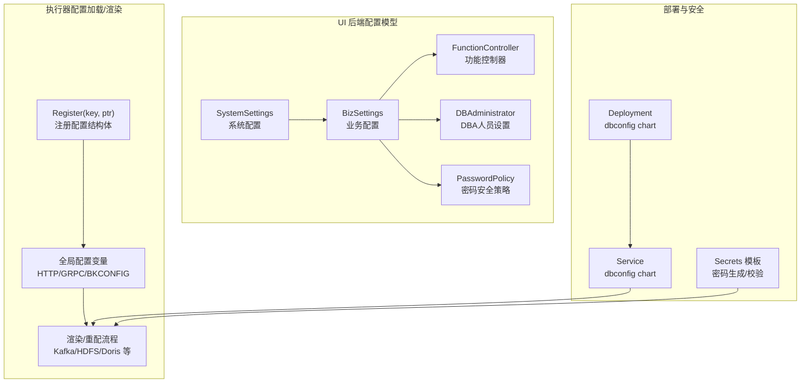
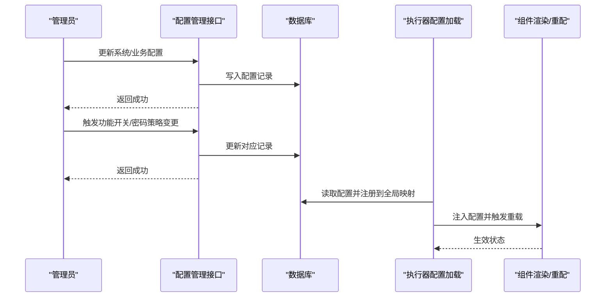
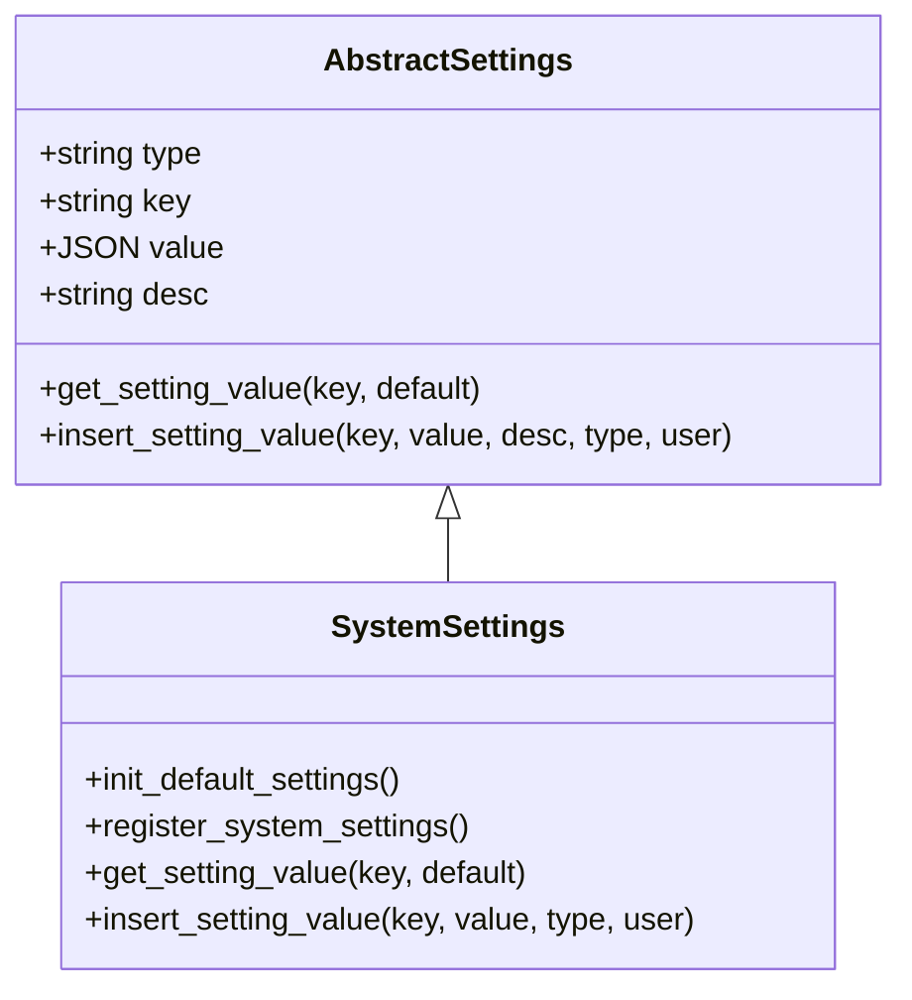
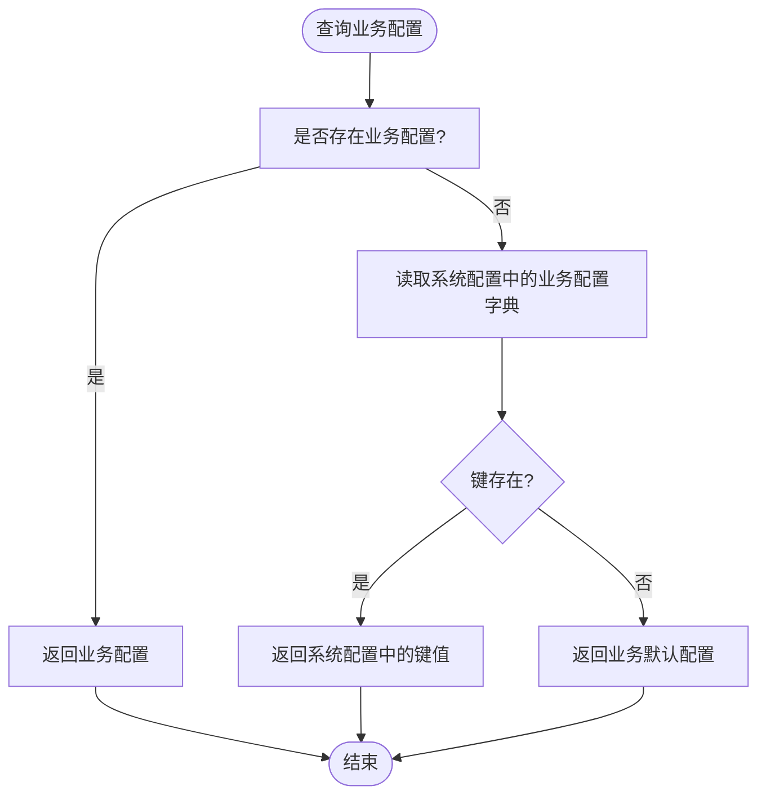
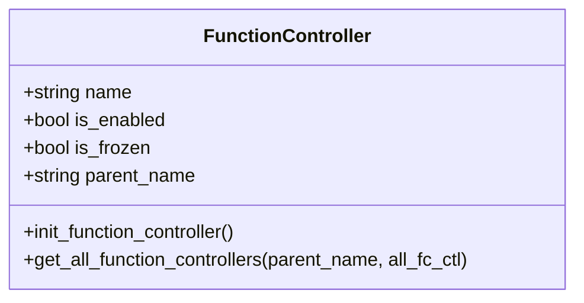
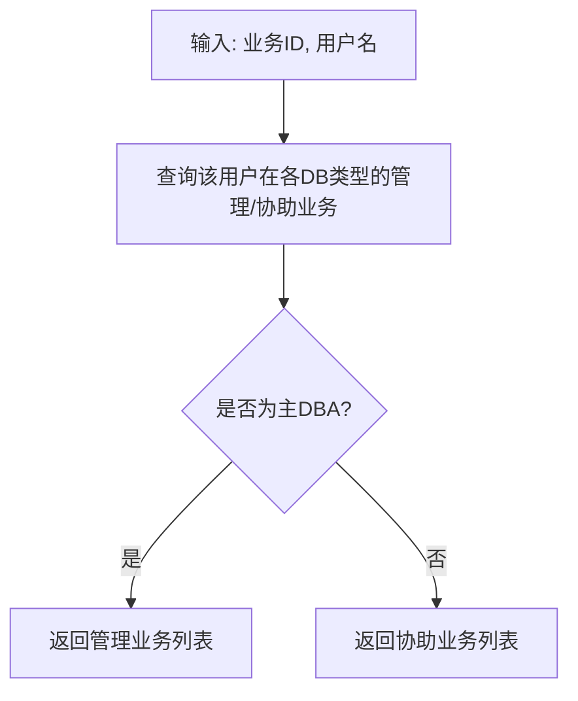
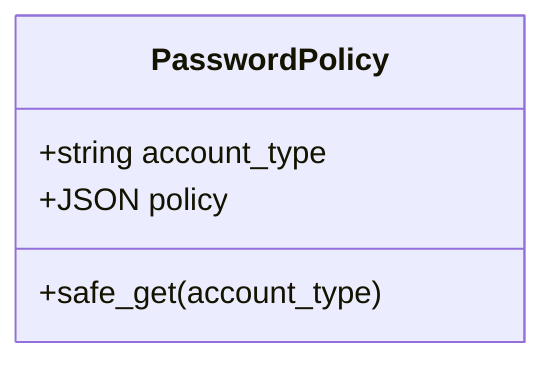
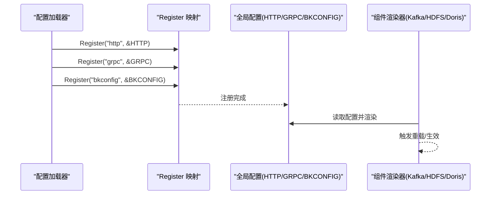
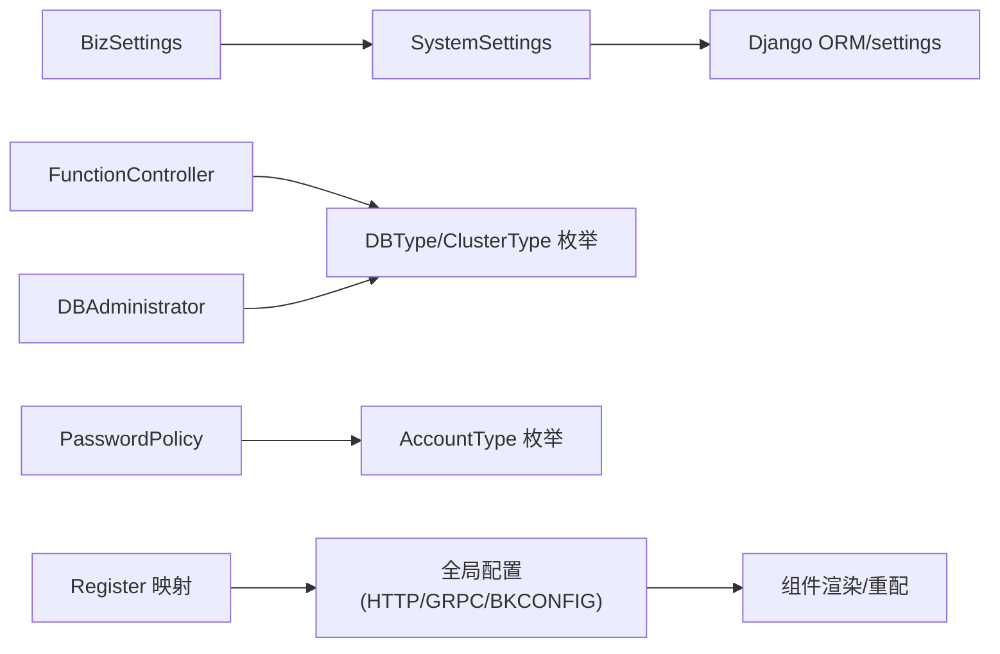

# 配置模型

<cite>
**本文引用的文件**
- [base.go](file://dbm-services/bigdata/db-tools/dbactuator/pkg/core/config/base.go)
- [init.go](file://dbm-services/bigdata/db-tools/dbactuator/pkg/core/config/init.go)
- [dbconfig.go](file://dbm-services/bigdata/db-tools/dbactuator/pkg/components/dbconfig/dbconfig.go)
- [query_change.go](file://dbm-services/bigdata/db-tools/dbactuator/pkg/components/dbconfig/query_change.go)
- [render_config.go](file://dbm-services/bigdata/db-tools/dbactuator/internal/subcmd/kafkacmd/render_config.go)
- [render_config.go](file://dbm-services/bigdata/db-tools/dbactuator/pkg/util/kafkautil/render_config.go)
- [reconfig.go](file://dbm-services/bigdata/db-tools/dbactuator/pkg/components/kafka/reconfig.go)
- [reconfig_add.go](file://dbm-services/bigdata/db-tools/dbactuator/internal/subcmd/kafkacmd/reconfig_add.go)
- [reconfig_remove.go](file://dbm-services/bigdata/db-tools/dbactuator/internal/subcmd/kafkacmd/reconfig_remove.go)
- [deployment.yaml](file://helm-charts/bk-dbm/charts/dbconfig/templates/deployment.yaml)
- [service.yaml](file://helm-charts/bk-dbm/charts/dbconfig/templates/service.yaml)
- [_secrets.tpl](file://helm-charts/bk-dbm/charts/grafana/charts/common/templates/_secrets.tpl)
- [_secrets.tpl](file://helm-charts/bk-dbm/charts/common/templates/_secrets.tpl)
- [dba.py](file://dbm-ui/backend/configuration/models/dba.py)
- [function_controller.py](file://dbm-ui/backend/configuration/models/function_controller.py)
- [password_policy.py](file://dbm-ui/backend/configuration/models/password_policy.py)
- [system.py](file://dbm-ui/backend/configuration/models/system.py)
- [__init__.py](file://dbm-ui/backend/configuration/models/__init__.py)
- [mysql_single_apply.py](file://dbm-ui/backend/ticket/builders/mysql/mysql_single_apply.py)
- [redis_cluster_apply.py](file://dbm-ui/backend/ticket/builders/redis/redis_cluster_apply.py)
- [0003_auto_20231201_2032.py](file://dbm-ui/backend/ticket/migrations/0003_auto_20231201_2032.py)
</cite>

## 目录
1. [简介](#简介)
2. [项目结构](#项目结构)
3. [核心组件](#核心组件)
4. [架构总览](#架构总览)
5. [详细组件分析](#详细组件分析)
6. [依赖分析](#依赖分析)
7. [性能考量](#性能考量)
8. [故障排查指南](#故障排查指南)
9. [结论](#结论)
10. [附录](#附录)

## 简介
本文件系统化梳理 DBM 的配置模型，覆盖用户配置、密码策略、功能控制器等配置相关实体的设计原理与实现；记录配置项的分类体系与继承关系；解释配置的动态更新机制与生效策略；说明配置数据的安全存储与访问控制设计；记录配置模型与权限系统的集成方式；并说明配置变更的日志记录与审计功能。

## 项目结构
DBM 的配置模型由“UI 后端配置模型”和“执行器配置加载/渲染”两部分组成：
- UI 后端配置模型：提供系统配置、业务配置、功能控制器、DBA 人员、密码策略等实体，持久化于数据库并通过 Django ORM 访问。
- 执行器配置加载/渲染：提供统一的配置注册、加载与渲染能力，支持从环境变量、配置中心、文件等方式读取，并支持运行时变更触发重载。

图表来源
- [system.py:67-207](file://dbm-ui/backend/configuration/models/system.py#L67-L207)
- [function_controller.py:95-166](file://dbm-ui/backend/configuration/models/function_controller.py#L95-L166)
- [dba.py:20-90](file://dbm-ui/backend/configuration/models/dba.py#L20-L90)
- [password_policy.py:22-45](file://dbm-ui/backend/configuration/models/password_policy.py#L22-L45)
- [init.go:25-34](file://dbm-services/bigdata/db-tools/dbactuator/pkg/core/config/init.go#L25-L34)
- [base.go:1-21](file://dbm-services/bigdata/db-tools/dbactuator/pkg/core/config/base.go#L1-L21)
- [deployment.yaml:1-46](file://helm-charts/bk-dbm/charts/dbconfig/templates/deployment.yaml#L1-L46)
- [service.yaml:1-15](file://helm-charts/bk-dbm/charts/dbconfig/templates/service.yaml#L1-L15)
- [_secrets.tpl:83-140](file://helm-charts/bk-dbm/charts/grafana/charts/common/templates/_secrets.tpl#L83-L140)

章节来源
- [system.py:67-207](file://dbm-ui/backend/configuration/models/system.py#L67-L207)
- [function_controller.py:95-166](file://dbm-ui/backend/configuration/models/function_controller.py#L95-L166)
- [dba.py:20-90](file://dbm-ui/backend/configuration/models/dba.py#L20-L90)
- [password_policy.py:22-45](file://dbm-ui/backend/configuration/models/password_policy.py#L22-L45)
- [init.go:25-34](file://dbm-services/bigdata/db-tools/dbactuator/pkg/core/config/init.go#L25-L34)
- [base.go:1-21](file://dbm-services/bigdata/db-tools/dbactuator/pkg/core/config/base.go#L1-L21)
- [deployment.yaml:1-46](file://helm-charts/bk-dbm/charts/dbconfig/templates/deployment.yaml#L1-L46)
- [service.yaml:1-15](file://helm-charts/bk-dbm/charts/dbconfig/templates/service.yaml#L1-L15)
- [_secrets.tpl:83-140](file://helm-charts/bk-dbm/charts/grafana/charts/common/templates/_secrets.tpl#L83-L140)

## 核心组件
- 系统配置 SystemSettings：面向全局的系统级配置，支持注册到 Django settings 中，供应用启动时读取。
- 业务配置 BizSettings：面向业务域的配置，支持按业务 ID 与键查询，若无业务配置则回退到系统默认或业务默认配置。
- 功能控制器 FunctionController：树形结构的功能开关，支持初始化、冻结与递归查询。
- DBA 人员设置 DBAdministrator：按业务与数据库类型维护 DBA 人员列表，支持主/备/二线角色拆分。
- 密码安全策略 PasswordPolicy：按账号类型维护密码策略，不存在时自动创建默认策略。
- 执行器配置加载/注册：通过 Register(key, ptr) 将配置结构体注册到全局映射，运行时可按需读取。
- 渲染与重配：针对具体组件（如 Kafka）提供渲染与增量重配能力，支持动态变更生效。

章节来源
- [system.py:67-207](file://dbm-ui/backend/configuration/models/system.py#L67-L207)
- [function_controller.py:95-166](file://dbm-ui/backend/configuration/models/function_controller.py#L95-L166)
- [dba.py:20-90](file://dbm-ui/backend/configuration/models/dba.py#L20-L90)
- [password_policy.py:22-45](file://dbm-ui/backend/configuration/models/password_policy.py#L22-L45)
- [init.go:25-34](file://dbm-services/bigdata/db-tools/dbactuator/pkg/core/config/init.go#L25-L34)
- [base.go:1-21](file://dbm-services/bigdata/db-tools/dbactuator/pkg/core/config/base.go#L1-L21)

## 架构总览
DBM 配置模型采用“后端持久化 + 执行器动态加载”的双层架构：
- 后端持久化层：SystemSettings/BizSettings/FunctionController/DBAdministrator/PasswordPolicy 均持久化至数据库，提供统一的增删改查与回退策略。
- 执行器动态加载层：通过 Register 将配置结构体注册到全局映射，结合环境变量/配置中心/文件读取，实现运行时配置注入与热更新。

图表来源
- [system.py:90-118](file://dbm-ui/backend/configuration/models/system.py#L90-L118)
- [function_controller.py:110-147](file://dbm-ui/backend/configuration/models/function_controller.py#L110-L147)
- [password_policy.py:31-44](file://dbm-ui/backend/configuration/models/password_policy.py#L31-L44)
- [init.go:25-34](file://dbm-services/bigdata/db-tools/dbactuator/pkg/core/config/init.go#L25-L34)

## 详细组件分析

### 系统配置 SystemSettings
- 设计要点
  - 抽象基类提供通用的增删改查与回退逻辑。
  - 初始化默认配置，确保首次部署可用。
  - 注册到 Django settings，避免覆盖已存在的配置项。
- 关键行为
  - get_setting_value：按 key 获取值，不存在时返回默认值。
  - insert_setting_value：按 key 更新或创建记录。
  - register_system_settings：将数据库中的系统配置注册到 settings。

图表来源
- [system.py:28-65](file://dbm-ui/backend/configuration/models/system.py#L28-L65)
- [system.py:67-119](file://dbm-ui/backend/configuration/models/system.py#L67-L119)

章节来源
- [system.py:67-119](file://dbm-ui/backend/configuration/models/system.py#L67-L119)

### 业务配置 BizSettings
- 设计要点
  - 支持按业务 ID 与键查询，若无业务配置则回退到系统配置或业务默认配置。
  - 提供批量插入与辅助查询（如协助人开关）。
  - 提供托管业务识别逻辑，兼容不同托管模式。
- 关键行为
  - get_setting_value：优先业务配置，其次系统配置，最后业务默认配置。
  - batch_insert_setting_value：批量写入。
  - get_exact_hosting_biz：根据集群类型判断托管业务。

图表来源
- [system.py:137-144](file://dbm-ui/backend/configuration/models/system.py#L137-L144)

章节来源
- [system.py:121-207](file://dbm-ui/backend/configuration/models/system.py#L121-L207)

### 功能控制器 FunctionController
- 设计要点
  - 树形结构的功能开关，支持初始化、冻结与递归查询。
  - 初始化策略：不存在即创建，已存在且未冻结则更新，已冻结则保持不变。
  - 父开关关闭时，子开关必须关闭。
- 关键行为
  - init_function_controller：按初始化映射批量创建/更新。
  - get_all_function_controllers：递归获取所有开关及其子节点。

图表来源
- [function_controller.py:95-166](file://dbm-ui/backend/configuration/models/function_controller.py#L95-L166)

章节来源
- [function_controller.py:95-166](file://dbm-ui/backend/configuration/models/function_controller.py#L95-L166)

### DBA 人员设置 DBAdministrator
- 设计要点
  - 按业务与数据库类型维护 DBA 人员列表。
  - 支持主/备/二线角色拆分与业务管理范围查询。
- 关键行为
  - list_biz_admins：按 DB 类型聚合业务与平台配置，平台优先。
  - get_dba_for_db_type：拆分主/备/二线 DBA。
  - get_manage_bizs：查询某 DB 类型下某用户的管理/协助业务。

图表来源
- [dba.py:73-85](file://dbm-ui/backend/configuration/models/dba.py#L73-L85)

章节来源
- [dba.py:20-90](file://dbm-ui/backend/configuration/models/dba.py#L20-L90)

### 密码安全策略 PasswordPolicy
- 设计要点
  - 按账号类型维护密码策略，不存在时自动创建默认策略。
- 关键行为
  - safe_get：安全获取策略，不存在则创建默认策略。

图表来源
- [password_policy.py:22-45](file://dbm-ui/backend/configuration/models/password_policy.py#L22-L45)

章节来源
- [password_policy.py:22-45](file://dbm-ui/backend/configuration/models/password_policy.py#L22-L45)

### 执行器配置加载与渲染
- 配置注册与全局变量
  - Register(key, ptr)：将配置结构体注册到全局映射，确保类型正确。
  - 全局变量示例：HTTP、GRPC、BKCONFIG 等。
- 渲染与重配
  - 针对 Kafka/HDFS/Doris 等组件提供渲染/重配能力，支持动态变更生效。
  - 通过 Helm Chart 的 ConfigMap/Secrets 提供配置注入与密码管理。

图表来源
- [init.go:25-34](file://dbm-services/bigdata/db-tools/dbactuator/pkg/core/config/init.go#L25-L34)
- [base.go:1-21](file://dbm-services/bigdata/db-tools/dbactuator/pkg/core/config/base.go#L1-L21)
- [reconfig.go](file://dbm-services/bigdata/db-tools/dbactuator/pkg/components/kafka/reconfig.go)
- [render_config.go](file://dbm-services/bigdata/db-tools/dbactuator/internal/subcmd/kafkacmd/render_config.go)
- [render_config.go](file://dbm-services/bigdata/db-tools/dbactuator/pkg/util/kafkautil/render_config.go)

章节来源
- [init.go:25-34](file://dbm-services/bigdata/db-tools/dbactuator/pkg/core/config/init.go#L25-L34)
- [base.go:1-21](file://dbm-services/bigdata/db-tools/dbactuator/pkg/core/config/base.go#L1-L21)
- [reconfig.go](file://dbm-services/bigdata/db-tools/dbactuator/pkg/components/kafka/reconfig.go)
- [render_config.go](file://dbm-services/bigdata/db-tools/dbactuator/internal/subcmd/kafkacmd/render_config.go)
- [render_config.go](file://dbm-services/bigdata/db-tools/dbactuator/pkg/util/kafkautil/render_config.go)

### 配置项分类体系与继承关系
- 分类体系
  - 系统配置：全局生效，注册到 Django settings。
  - 业务配置：按业务 ID 生效，支持回退到系统配置或默认配置。
  - 功能控制器：树形结构，支持父子继承与冻结。
  - DBA 人员：按业务与数据库类型生效。
  - 密码策略：按账号类型生效。
- 继承关系
  - 业务配置继承系统配置与业务默认配置。
  - 功能控制器继承父开关状态，父关闭则子必关闭。
  - DBA 人员优先业务配置，其次平台配置。

章节来源
- [system.py:137-144](file://dbm-ui/backend/configuration/models/system.py#L137-L144)
- [function_controller.py:110-147](file://dbm-ui/backend/configuration/models/function_controller.py#L110-L147)
- [dba.py:30-54](file://dbm-ui/backend/configuration/models/dba.py#L30-L54)

### 动态更新机制与生效策略
- 动态更新
  - 执行器侧：通过 Register 注册配置结构体，结合外部配置源（环境变量/配置中心/文件）实现运行时注入。
  - 组件侧：Kafka/HDFS/Doris 等提供渲染/重配接口，支持增量更新与热生效。
- 生效策略
  - 系统配置：注册到 settings，启动时加载；运行时可通过重载机制刷新。
  - 业务配置：按业务键查询，支持回退策略。
  - 功能控制器：初始化与冻结策略保证一致性。
  - DBA 人员与密码策略：按需查询与创建默认策略。

章节来源
- [init.go:25-34](file://dbm-services/bigdata/db-tools/dbactuator/pkg/core/config/init.go#L25-L34)
- [reconfig.go](file://dbm-services/bigdata/db-tools/dbactuator/pkg/components/kafka/reconfig.go)
- [system.py:90-118](file://dbm-ui/backend/configuration/models/system.py#L90-L118)
- [function_controller.py:110-147](file://dbm-ui/backend/configuration/models/function_controller.py#L110-L147)

### 安全存储与访问控制设计
- 安全存储
  - 使用 Helm Chart Secrets 模板生成/校验密码，支持强口令策略与随机生成。
  - 通过 Secret 资源存储敏感信息，避免明文配置。
- 访问控制
  - DBA 人员设置支持按业务与 DB 类型隔离。
  - 功能控制器支持冻结，防止误更新。
  - 密码策略按账号类型隔离，避免跨类型策略泄露。

章节来源
- [_secrets.tpl:83-140](file://helm-charts/bk-dbm/charts/grafana/charts/common/templates/_secrets.tpl#L83-L140)
- [_secrets.tpl:91-129](file://helm-charts/bk-dbm/charts/common/templates/_secrets.tpl#L91-L129)
- [dba.py:20-90](file://dbm-ui/backend/configuration/models/dba.py#L20-L90)
- [function_controller.py:95-166](file://dbm-ui/backend/configuration/models/function_controller.py#L95-L166)
- [password_policy.py:22-45](file://dbm-ui/backend/configuration/models/password_policy.py#L22-L45)

### 配置模型与权限系统的集成
- DBA 人员与业务权限
  - 通过 DBAdministrator 维护 DBA 人员，支持主/备/二线角色，便于权限分配与工作流协作。
- 功能开关与访问入口
  - FunctionController 作为前端访问入口开关，后续可用于限制后台功能与 API 返回数据。
- 单据配置与用户可编辑性
  - 单据配置包含 editable 字段，指示是否支持用户配置，便于权限控制与界面呈现。

章节来源
- [dba.py:65-85](file://dbm-ui/backend/configuration/models/dba.py#L65-L85)
- [function_controller.py:95-166](file://dbm-ui/backend/configuration/models/function_controller.py#L95-L166)
- [0003_auto_20231201_2032.py:35-54](file://dbm-ui/backend/ticket/migrations/0003_auto_20231201_2032.py#L35-L54)

### 配置变更的日志记录与审计
- 审计点建议
  - SystemSettings/BizSettings：记录每次 insert_setting_value 的调用者与时间戳（基于 AuditedModel）。
  - FunctionController：记录初始化/更新/冻结操作。
  - DBAdministrator/PasswordPolicy：记录创建/修改操作。
- 日志采集
  - 结合 Django 日志框架与数据库审计，确保关键配置变更可追溯。

章节来源
- [system.py:28-65](file://dbm-ui/backend/configuration/models/system.py#L28-L65)
- [function_controller.py:110-147](file://dbm-ui/backend/configuration/models/function_controller.py#L110-L147)
- [dba.py:20-90](file://dbm-ui/backend/configuration/models/dba.py#L20-L90)
- [password_policy.py:22-45](file://dbm-ui/backend/configuration/models/password_policy.py#L22-L45)

## 依赖分析
- 组件耦合
  - SystemSettings/BizSettings 依赖 Django ORM 与 settings 注册。
  - FunctionController 依赖枚举与树形结构，保证父子一致性。
  - DBAdministrator 依赖 DB 类型枚举与业务 ID。
  - 密码策略依赖账号类型枚举。
- 外部依赖
  - 执行器配置依赖 Helm Chart 的 ConfigMap/Secrets 与渲染模板。
  - 组件渲染依赖 Kafka/HDFS/Doris 等子模块提供的渲染/重配接口。

图表来源
- [system.py:67-119](file://dbm-ui/backend/configuration/models/system.py#L67-L119)
- [function_controller.py:95-166](file://dbm-ui/backend/configuration/models/function_controller.py#L95-L166)
- [dba.py:20-90](file://dbm-ui/backend/configuration/models/dba.py#L20-L90)
- [password_policy.py:22-45](file://dbm-ui/backend/configuration/models/password_policy.py#L22-L45)
- [init.go:25-34](file://dbm-services/bigdata/db-tools/dbactuator/pkg/core/config/init.go#L25-L34)
- [base.go:1-21](file://dbm-services/bigdata/db-tools/dbactuator/pkg/core/config/base.go#L1-L21)

章节来源
- [system.py:67-119](file://dbm-ui/backend/configuration/models/system.py#L67-L119)
- [function_controller.py:95-166](file://dbm-ui/backend/configuration/models/function_controller.py#L95-L166)
- [dba.py:20-90](file://dbm-ui/backend/configuration/models/dba.py#L20-L90)
- [password_policy.py:22-45](file://dbm-ui/backend/configuration/models/password_policy.py#L22-L45)
- [init.go:25-34](file://dbm-services/bigdata/db-tools/dbactuator/pkg/core/config/init.go#L25-L34)
- [base.go:1-21](file://dbm-services/bigdata/db-tools/dbactuator/pkg/core/config/base.go#L1-L21)

## 性能考量
- 数据库访问
  - SystemSettings/BizSettings 的查询应尽量复用 ORM 缓存，避免重复查询。
  - FunctionController 的递归查询应一次性拉取全部记录，减少多次 ORM 查询。
- 执行器配置
  - Register 映射使用并发安全的 sync.Map，避免锁竞争。
  - 渲染/重配应尽量增量更新，减少全量重启带来的开销。
- Helm 注入
  - ConfigMap/Secrets 的挂载与重载应配合自动重载注解，减少手动干预。

## 故障排查指南
- 配置未生效
  - 检查 SystemSettings 是否已注册到 settings。
  - 检查 BizSettings 的键是否正确，是否存在回退逻辑。
  - 检查 FunctionController 的父开关状态。
- 密码问题
  - 检查 Helm Secrets 模板是否正确生成/校验密码。
  - 检查密码策略是否按账号类型正确匹配。
- 渲染失败
  - 检查组件渲染接口是否正确读取全局配置。
  - 检查 ConfigMap/Secrets 是否正确挂载。

章节来源
- [system.py:90-118](file://dbm-ui/backend/configuration/models/system.py#L90-L118)
- [function_controller.py:110-147](file://dbm-ui/backend/configuration/models/function_controller.py#L110-L147)
- [_secrets.tpl:83-140](file://helm-charts/bk-dbm/charts/grafana/charts/common/templates/_secrets.tpl#L83-L140)
- [base.go:1-21](file://dbm-services/bigdata/db-tools/dbactuator/pkg/core/config/base.go#L1-L21)

## 结论
DBM 的配置模型通过“后端持久化 + 执行器动态加载”的架构实现了灵活、可审计、可扩展的配置管理体系。系统配置、业务配置、功能控制器、DBA 人员与密码策略共同构成完整的配置生态，既满足多租户场景下的差异化需求，又通过冻结与回退策略保障稳定性。配合 Helm Secrets 与渲染/重配能力，实现了安全、高效的配置生命周期管理。

## 附录
- 配置模型导出
  - 通过 __init__.py 汇总导出 DBA、功能控制器、密码策略、配置档案、系统与业务配置等模型，便于统一导入与使用。

章节来源
- [__init__.py:11-16](file://dbm-ui/backend/configuration/models/__init__.py#L11-L16)