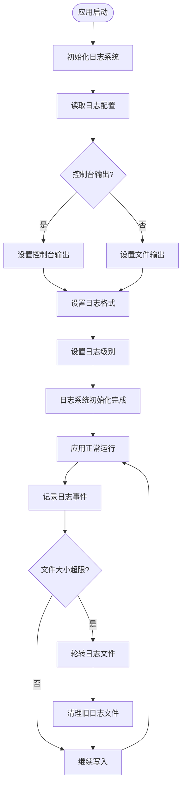
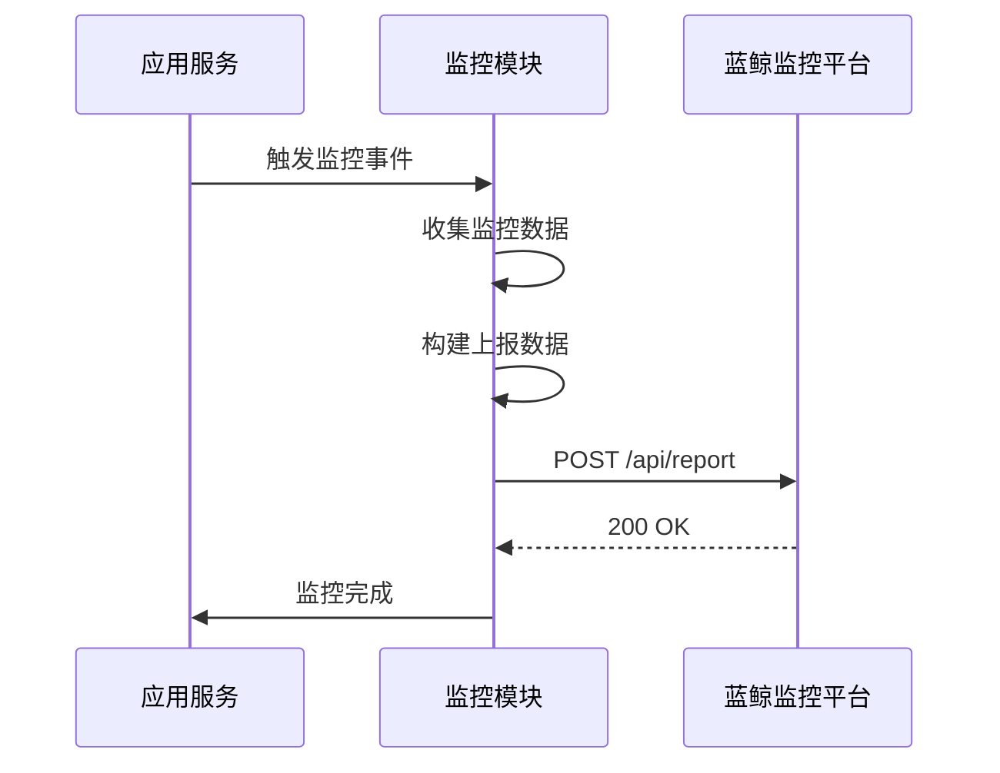
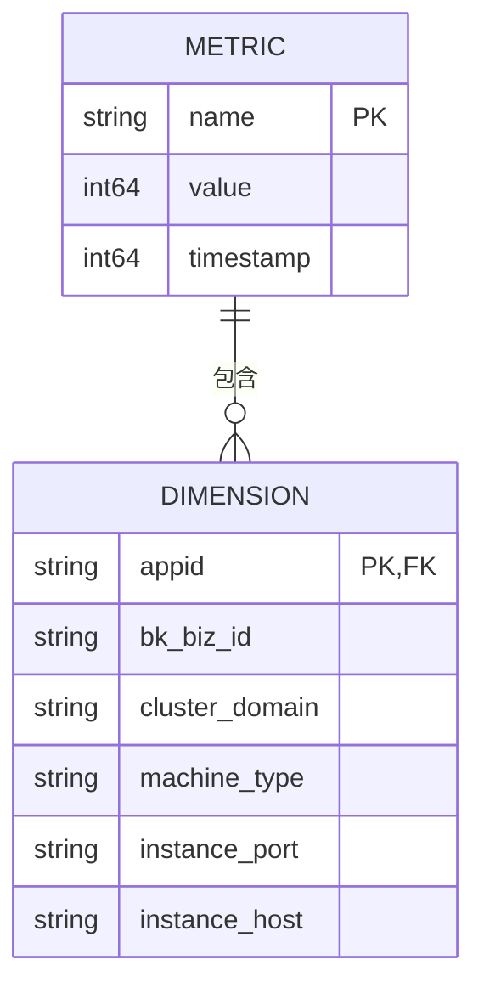

# 日志与监控

<cite>
**本文档引用的文件**   
- [logger.go](file://dbm-services/common/go-pubpkg/logger/logger.go)
- [monitor.go](file://dbm-services/mysql/db-partition/monitor/monitor.go)
- [send_monitor_metrics.go](file://dbm-services/mysql/db-tools/mysql-monitor/pkg/utils/send_monitor_metrics.go)
- [send_monitor_event.go](file://dbm-services/mysql/db-tools/mysql-monitor/pkg/utils/send_monitor_event.go)
- [monitor_config.go](file://dbm-services/mysql/db-tools/mysql-monitor/pkg/config/monitor_config.go)
- [bk_monitor_beat_config.go](file://dbm-services/mysql/db-tools/mysql-crond/pkg/config/bk_monitor_beat_config.go)
- [format.py](file://dbm-ui/backend/db_monitor/format.py)
- [lumberjack.go](file://dbm-services/common/db-config/pkg/core/logger/lumberjack/lumberjack.go)
</cite>

## 目录
1. [日志记录策略](#日志记录策略)
2. [监控数据收集与处理](#监控数据收集与处理)
3. [蓝鲸监控集成](#蓝鲸监控集成)
4. [关键监控指标](#关键监控指标)
5. [告警规则配置](#告警规则配置)
6. [故障诊断指南](#故障诊断指南)

## 日志记录策略

该平台采用统一的日志记录策略，使用zap日志库实现结构化日志输出。日志系统支持JSON格式输出，便于后续的日志收集和分析。

日志级别包括：Debug、Info、Warn、Error、DPanic、Panic和Fatal。日志格式包含以下关键字段：
- msg: 日志消息内容
- levelname: 日志级别
- time: 时间戳(RFC3339格式)
- funcName: 函数名
- caller: 调用者信息
- stacktrace: 堆栈跟踪信息

日志存储位置由配置文件中的`log_file_dir`参数指定，支持控制台输出和文件输出两种模式。当`console`参数为true时，日志会同时输出到控制台。

日志轮转机制基于lumberjack库实现，具有以下配置参数：
- Filename: 日志文件路径
- MaxSize: 单个日志文件的最大大小(MB)
- MaxBackups: 保留的旧日志文件最大数量
- MaxAge: 旧日志文件的最大保存天数
- LocalTime: 使用本地时间而非UTC时间

当日志文件达到MaxSize指定的大小时，会自动进行轮转。旧的日志文件会根据MaxBackups和MaxAge设置进行清理，确保磁盘空间的有效利用。



**图示来源**
- [logger.go](file://dbm-services/common/go-pubpkg/logger/logger.go#L101-L117)
- [lumberjack.go](file://dbm-services/common/db-config/pkg/core/logger/lumberjack/lumberjack.go#L79-L83)

**本节来源**
- [logger.go](file://dbm-services/common/go-pubpkg/logger/logger.go)
- [lumberjack.go](file://dbm-services/common/db-config/pkg/core/logger/lumberjack/lumberjack.go)

## 监控数据收集与处理

db_monitor模块负责收集、处理和展示监控数据。该模块通过定时任务和事件驱动两种方式收集监控数据。

监控数据收集主要分为两类：指标数据(metrics)和事件数据(event)。指标数据用于记录系统性能指标，如CPU使用率、内存使用率等；事件数据用于记录系统状态变化，如服务启动、停止等。

监控数据处理流程如下：
1. 数据采集：通过各种监控项收集器收集原始数据
2. 数据处理：对原始数据进行加工处理，如计算、聚合等
3. 数据上报：将处理后的数据发送到蓝鲸监控平台
4. 数据展示：在前端界面展示监控数据

监控数据的上报采用HTTP API方式，通过POST请求将数据发送到指定的监控服务地址。上报的数据格式遵循统一的结构，包含数据ID、访问令牌、目标地址、时间戳、维度信息和具体数据。

```mermaid
classDiagram
class MonitorMetric {
+metrics : map[string]int
+target : string
+dimension : map[string]interface{}
}
class MonitorEvent {
+event_name : string
+event : map[string]interface{}
+target : string
+dimension : map[string]interface{}
+timestamp : int
}
class Setting {
+MonitorMetricDataID : int
+MonitorEventDataID : int
+MonitorMetricAccessToken : string
+MonitorEventAccessToken : string
+MonitorService : string
}
class MonitorManager {
-apiUrl : string
+SendMetrics(name : string, value : int64, dimension : map[string]interface{})
+SendEvent(name : string, msg : string, dimension : map[string]interface{})
}
MonitorManager --> Setting : "使用"
MonitorManager --> MonitorMetric : "发送"
MonitorManager --> MonitorEvent : "发送"
```

**图示来源**
- [monitor.go](file://dbm-services/mysql/db-partition/monitor/monitor.go#L3-L41)
- [send_monitor_metrics.go](file://dbm-services/mysql/db-tools/mysql-monitor/pkg/utils/send_monitor_metrics.go)
- [send_monitor_event.go](file://dbm-services/mysql/db-tools/mysql-monitor/pkg/utils/send_monitor_event.go)

**本节来源**
- [monitor.go](file://dbm-services/mysql/db-partition/monitor/monitor.go)
- [send_monitor_metrics.go](file://dbm-services/mysql/db-tools/mysql-monitor/pkg/utils/send_monitor_metrics.go)
- [send_monitor_event.go](file://dbm-services/mysql/db-tools/mysql-monitor/pkg/utils/send_monitor_event.go)

## 蓝鲸监控集成

平台通过配置文件与蓝鲸监控(BKMONITOR)进行集成。集成配置主要包含以下内容：

1. 数据ID配置：指定指标数据和事件数据的数据ID
2. 访问令牌配置：用于身份验证的访问令牌
3. 服务地址配置：蓝鲸监控服务的API地址
4. 上报路径配置：监控数据上报的具体路径

集成配置通过YAML文件进行管理，主要配置项包括：
- custom_metrics: 自定义指标配置
- custom_event: 自定义事件配置
- beat_path: 上报路径
- agent_address: Agent地址

系统通过`BkMonitorBeat`结构体管理蓝鲸监控的集成配置，确保监控数据能够正确上报到蓝鲸监控平台。配置验证通过后，系统会定期将监控数据发送到蓝鲸监控平台，实现监控数据的集中管理和分析。



**图示来源**
- [bk_monitor_beat_config.go](file://dbm-services/mysql/db-tools/mysql-crond/pkg/config/bk_monitor_beat_config.go)
- [monitor_config.go](file://dbm-services/mysql/db-tools/mysql-monitor/pkg/config/monitor_config.go)

**本节来源**
- [bk_monitor_beat_config.go](file://dbm-services/mysql/db-tools/mysql-crond/pkg/config/bk_monitor_beat_config.go)
- [monitor_config.go](file://dbm-services/mysql/db-tools/mysql-monitor/pkg/config/monitor_config.go)

## 关键监控指标

平台监控的关键指标分为以下几类：

### 系统资源指标
- CPU使用率
- 内存使用率
- 磁盘使用率
- 网络IO

### 数据库性能指标
- 查询延迟
- 连接数
- 缓存命中率
- 慢查询数量
- 锁等待时间

### 服务健康指标
- 服务可用性
- API响应时间
- 错误率
- 请求吞吐量

### 业务指标
- 事务处理量
- 数据同步延迟
- 备份成功率
- 容量使用率

这些指标通过不同的监控项收集器进行收集，并按照预设的维度进行分类。每个指标都有对应的维度信息，包括业务ID、集群域名、机器类型、实例端口等，便于进行多维度分析。



**图示来源**
- [send_monitor_metrics.go](file://dbm-services/mysql/db-tools/mysql-monitor/pkg/utils/send_monitor_metrics.go)
- [format.py](file://dbm-ui/backend/db_monitor/format.py)

**本节来源**
- [send_monitor_metrics.go](file://dbm-services/mysql/db-tools/mysql-monitor/pkg/utils/send_monitor_metrics.go)
- [format.py](file://dbm-ui/backend/db_monitor/format.py)

## 告警规则配置

告警规则配置通过蓝鲸监控平台进行管理。系统提供了一套完整的告警配置接口，支持以下功能：

1. 告警策略创建
2. 告警条件设置
3. 告警通知配置
4. 告警级别定义
5. 告警恢复通知

告警规则的配置流程如下：
1. 选择监控对象(业务、集群、实例等)
2. 选择监控指标
3. 设置告警条件(阈值、持续时间等)
4. 配置告警通知方式(邮件、短信、微信等)
5. 设置告警级别(警告、严重、紧急等)
6. 配置告警恢复通知

告警规则支持多种条件组合，可以设置复杂的告警逻辑。例如，可以设置"CPU使用率连续5分钟超过80%"的告警条件。告警通知支持多级通知策略，可以根据告警级别发送不同的通知。

**本节来源**
- [format.py](file://dbm-ui/backend/db_monitor/format.py)

## 故障诊断指南

基于日志和监控数据进行故障诊断的指南如下：

### 诊断流程
1. 确认故障现象
2. 查看相关服务日志
3. 分析监控指标变化
4. 定位故障根源
5. 实施修复措施
6. 验证修复效果

### 日志分析要点
- 查找错误级别日志
- 分析异常堆栈信息
- 追踪请求处理链路
- 检查配置加载情况
- 验证依赖服务状态

### 监控数据分析要点
- 检查系统资源使用率
- 分析API响应时间变化
- 查看错误率趋势
- 比较历史数据
- 关联多个监控指标

### 常见故障处理
- 服务不可用：检查进程状态、端口占用、依赖服务
- 性能下降：分析慢查询、检查资源瓶颈、优化配置
- 数据不一致：验证同步状态、检查网络延迟、确认数据完整性
- 容量不足：评估存储使用、规划扩容方案、执行迁移操作

运维人员应结合日志和监控数据，建立完整的故障诊断思维框架，快速定位和解决系统问题。

**本节来源**
- [monitor.go](file://dbm-services/mysql/db-partition/monitor/monitor.go)
- [send_monitor_metrics.go](file://dbm-services/mysql/db-tools/mysql-monitor/pkg/utils/send_monitor_metrics.go)
- [send_monitor_event.go](file://dbm-services/mysql/db-tools/mysql-monitor/pkg/utils/send_monitor_event.go)