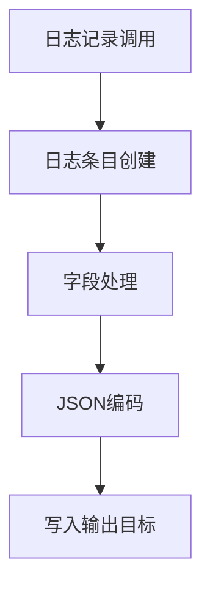
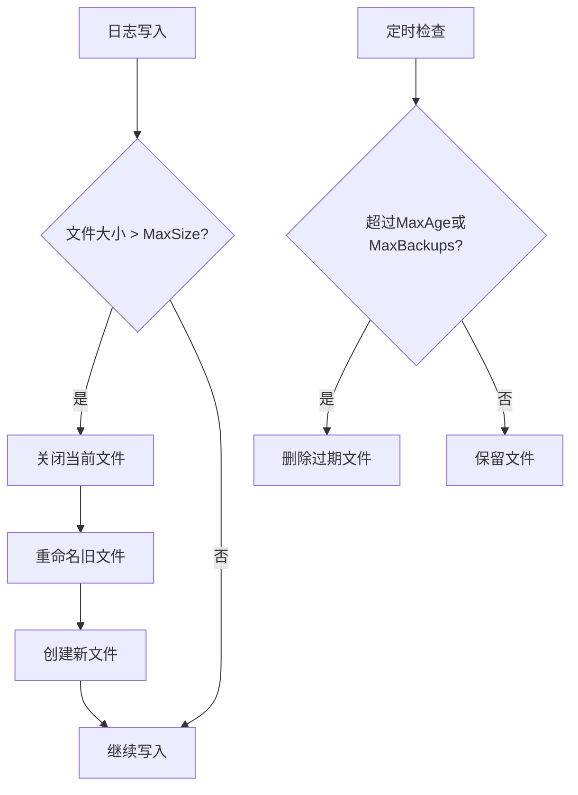

# 日志管理

<cite>
**本文档引用的文件**  
- [logger.go](file://dbm-services/common/go-pubpkg/logger/logger.go)
- [rotate.go](file://dbm-services/common/go-pubpkg/logger/rotate.go)
- [encoder.go](file://dbm-services/common/go-pubpkg/logger/encoder.go)
- [field.go](file://dbm-services/common/go-pubpkg/logger/field.go)
- [lumberjack.go](file://dbm-services/common/db-config/pkg/core/logger/lumberjack/lumberjack.go)
- [bklog.py](file://dbm-ui/env/bklog.py)
- [default.py](file://dbm-ui/config/default.py)
- [log.go](file://dbm-services/common/db-config/pkg/core/logger/log.go)
</cite>

## 目录
1. [简介](#简介)
2. [日志框架概览](#日志框架概览)
3. [日志级别](#日志级别)
4. [JSON格式输出](#json格式输出)
5. [日志轮转与文件切割](#日志轮转与文件切割)
6. [存储路径与保留策略](#存储路径与保留策略)
7. [性能优化方法](#性能优化方法)
8. [结构化日志与自定义字段](#结构化日志与自定义字段)
9. [与蓝鲸日志平台集成](#与蓝鲸日志平台集成)
10. [最佳实践与常见问题](#最佳实践与常见问题)

## 简介
本文档详细介绍了蓝鲸DBM系统中统一的日志管理框架，重点阐述了`go-pubpkg/logger`包的实现机制。文档涵盖日志级别、JSON格式输出、日志轮转策略、存储路径、保留策略、性能优化以及与蓝鲸日志平台（BKLOG）的集成方式。同时提供开发者在代码中正确使用日志记录器的示例和最佳实践，帮助避免日志性能瓶颈和敏感信息泄露等常见问题。

## 日志框架概览
蓝鲸DBM系统采用`go-pubpkg/logger`包作为统一的日志记录框架，该框架基于Uber的Zap日志库构建，提供了高性能、结构化的日志记录能力。框架支持多种日志输出格式，包括JSON和控制台格式，并通过Lumberjack库实现日志文件的自动轮转和压缩。

**Section sources**
- [logger.go](file://dbm-services/common/go-pubpkg/logger/logger.go#L1-L144)
- [rotate.go](file://dbm-services/common/go-pubpkg/logger/rotate.go#L1-L66)

## 日志级别
日志框架支持以下五个标准日志级别，按严重程度递增：

- **DEBUG**: 用于调试信息，记录详细的程序执行流程
- **INFO**: 用于常规信息，记录程序正常运行的关键事件
- **WARNING**: 用于警告信息，记录可能影响系统正常运行的异常情况
- **ERROR**: 用于错误信息，记录导致功能失败的错误
- **FATAL**: 用于致命错误，记录导致程序终止的严重错误

日志级别通过`Level`类型定义，开发者可以根据需要设置不同的日志级别来控制日志输出的详细程度。

**Section sources**
- [logger.go](file://dbm-services/common/go-pubpkg/logger/logger.go#L34-L65)

## JSON格式输出
日志框架默认使用JSON格式输出日志，便于日志的解析和分析。JSON格式的日志包含以下关键字段：

- **msg**: 日志消息内容
- **levelname**: 日志级别
- **time**: 日志记录时间
- **name**: 日志记录器名称
- **funcName**: 记录日志的函数名
- **caller**: 调用日志记录函数的文件和行号
- **stacktrace**: 堆栈跟踪信息（仅在DPanic及以上级别）

JSON格式的输出通过`NewEncoder`函数创建，使用`zapcore.NewJSONEncoder`配置编码器。



**Diagram sources**
- [encoder.go](file://dbm-services/common/go-pubpkg/logger/encoder.go#L17-L20)
- [logger.go](file://dbm-services/common/go-pubpkg/logger/logger.go#L100-L117)

## 日志轮转与文件切割
日志轮转机制通过Lumberjack库实现，主要配置参数包括：

- **MaxSize**: 单个日志文件的最大大小（MB），默认100MB
- **MaxAge**: 保留旧日志文件的最大天数
- **MaxBackups**: 保留的旧日志文件最大数量
- **Compress**: 是否压缩轮转后的日志文件
- **LocalTime**: 是否使用本地时间而非UTC时间

当日志文件大小超过`MaxSize`时，会自动创建新的日志文件，旧的日志文件会被重命名并保留。系统会根据`MaxAge`和`MaxBackups`策略清理过期的日志文件。



**Diagram sources**
- [lumberjack.go](file://dbm-services/common/db-config/pkg/core/logger/lumberjack/lumberjack.go#L79-L116)
- [rotate.go](file://dbm-services/common/go-pubpkg/logger/rotate.go#L48-L55)

## 存储路径与保留策略
日志文件的存储路径和保留策略通过配置文件进行管理。系统默认的日志保留天数为30天，但不同类型的日志可以配置不同的保留策略：

- MySQL备份结果日志
- MySQL Binlog结果日志
- Redis Binlog备份结果日志
- Redis全量备份结果日志
- Redis大Key分析日志
- Redis慢查询日志
- MongoDB备份结果日志

这些保留策略通过环境变量进行配置，可以在`bklog.py`文件中找到相关设置。

**Section sources**
- [bklog.py](file://dbm-ui/env/bklog.py#L21-L31)
- [lumberjack.go](file://dbm-services/common/db-config/pkg/core/logger/lumberjack/lumberjack.go#L80-L83)

## 性能优化方法
为了确保日志记录不会成为系统性能瓶颈，框架采用了以下优化措施：

1. **异步日志记录**: 使用Zap的异步日志记录功能，避免日志I/O阻塞主业务流程
2. **结构化日志**: 使用JSON格式的结构化日志，便于后续的自动化分析和处理
3. **字段重用**: 通过`With`方法重用日志字段，减少内存分配
4. **级别过滤**: 在日志记录前进行级别过滤，避免不必要的日志处理开销

开发者应避免在循环中频繁记录DEBUG级别的日志，以免影响系统性能。

**Section sources**
- [logger.go](file://dbm-services/common/go-pubpkg/logger/logger.go#L69-L72)
- [rotate.go](file://dbm-services/common/go-pubpkg/logger/rotate.go#L45-L47)

## 结构化日志与自定义字段
框架支持结构化日志记录，开发者可以添加自定义字段来丰富日志内容。通过`With`方法可以为日志记录器添加固定的上下文字段，这些字段会自动包含在后续的所有日志记录中。

```mermaid
classDiagram
class Logger {
+Zap *zap.Logger
+EmptyZap *zap.Logger
+Level Level
+Fields []zap.Field
+Debug(format string, args ...interface{})
+Info(format string, args ...interface{})
+Warn(format string, args ...interface{})
+Error(format string, args ...interface{})
+With(fields ...Field) *Logger
}
class CustomField {
+UID string
+NodeID string
+IP string
+MarshalLogObject(enc zapcore.ObjectEncoder) error
}
Logger --> CustomField : "支持"
```

**Diagram sources**
- [logger.go](file://dbm-services/common/go-pubpkg/logger/logger.go#L26-L31)
- [field.go](file://dbm-services/common/go-pubpkg/logger/field.go#L55-L64)

## 与蓝鲸日志平台集成
日志框架与蓝鲸日志平台（BKLOG）集成，实现集中式日志收集和分析。集成方式包括：

1. **日志采集配置**: 通过BKLOG的采集配置，将各服务的日志文件纳入监控范围
2. **数据ID管理**: 为不同类型的服务分配独立的数据ID，便于日志的分类管理
3. **索引集配置**: 创建索引集，定义日志的存储和检索策略
4. **搜索分析**: 通过ES查询接口对日志进行搜索和分析

集成代码中包含了创建采集配置、预检查、列出采集器等操作，确保日志能够正确地被BKLOG平台收集。

**Section sources**
- [bklog.py](file://dbm-ui/env/bklog.py#L61-L118)
- [default.py](file://dbm-ui/config/default.py#L452-L487)

## 最佳实践与常见问题
### 最佳实践
1. **合理选择日志级别**: 根据信息的重要性选择合适的日志级别
2. **使用结构化日志**: 尽量使用结构化字段而非在消息字符串中拼接数据
3. **避免敏感信息**: 不要在日志中记录密码、密钥等敏感信息
4. **添加上下文信息**: 使用`With`方法添加请求ID、用户ID等上下文信息
5. **定期审查日志**: 定期审查日志内容，确保日志的有用性和安全性

### 常见问题与解决方案
1. **日志性能瓶颈**: 减少DEBUG级别日志的记录频率，避免在循环中记录日志
2. **敏感信息泄露**: 使用专门的日志脱敏工具，或在记录前对敏感字段进行处理
3. **磁盘空间不足**: 配置合理的日志轮转和保留策略，定期清理过期日志
4. **日志难以分析**: 使用统一的结构化日志格式，便于自动化分析工具处理

**Section sources**
- [logger.go](file://dbm-services/common/go-pubpkg/logger/logger.go#L124-L131)
- [log.go](file://dbm-services/common/db-config/pkg/core/logger/log.go#L64-L87)
- [field.go](file://dbm-services/common/go-pubpkg/logger/field.go#L124-L150)