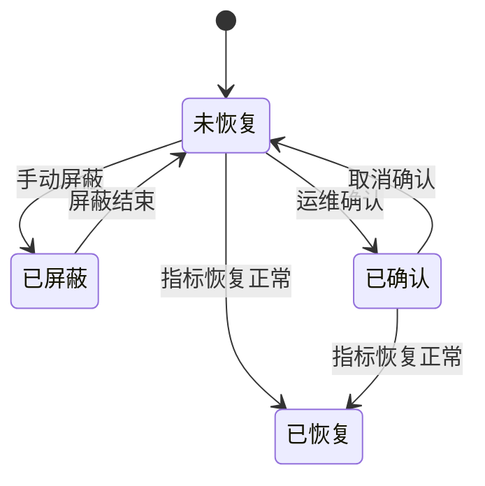
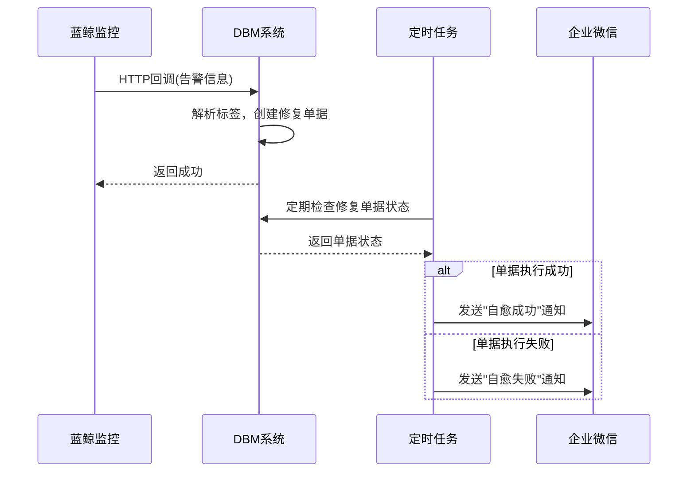

# 告警事件处理

<cite>
**本文档引用的文件**   
- [NoticeGroup.py](file://dbm-ui/backend/db_monitor/models/alarm.py#L69-L233)
- [event.py](file://dbm-ui/backend/db_monitor/views/event.py#L1-L125)
- [alarm.py](file://dbm-ui/backend/db_monitor/models/alarm.py#L69-L233)
- [constants.py](file://dbm-ui/backend/db_monitor/constants.py#L1-L275)
- [utils.py](file://dbm-ui/backend/db_monitor/utils.py#L1-L241)
- [serializers.py](file://dbm-ui/backend/db_monitor/serializers.py#L1-L435)
- [grafana.py](file://dbm-ui/backend/db_monitor/views/grafana.py#L28-L64)
- [dashboard.py](file://dbm-ui/backend/db_monitor/models/dashboard.py#L34-L55)
- [dbha/tendbha/__init__.py](file://dbm-ui/backend/db_periodic_task/local_tasks/mysql_autofix/dbha/tendbha/__init__.py#L1-L11)
- [redis_autofix.py](file://dbm-ui/backend/db_periodic_task/local_tasks/redis_autofix.py#L86-L136)
- [enums.py](file://dbm-ui/backend/db_services/redis/autofix/enums.py#L25-L49)
- [client.py](file://dbm-ui/backend/components/bkmonitorv3/client.py#L166-L202)
</cite>

## 目录
1. [告警事件生命周期](#告警事件生命周期)
2. [告警事件查询、确认与处理接口](#告警事件查询确认与处理接口)
3. [通知组（NoticeGroup）配置](#通知组noticegroup配置)
4. [多种通知方式](#多种通知方式)
5. [自动修复（AutoFix）流程](#自动修复autofix流程)
6. [告警诊断流程与Grafana视图验证](#告警诊断流程与grafana视图验证)

## 告警事件生命周期

告警事件的生命周期从触发、通知到恢复，涵盖了完整的监控与响应流程。系统通过蓝鲸监控（BKMonitor）实现告警的全生命周期管理。

告警事件的生命周期主要包括以下几个阶段：

1.  **触发（Trigger）**：当监控指标达到预设的阈值或满足特定条件时，系统会触发告警。告警策略（MonitorPolicy）定义了触发条件，包括检测规则（test_rules）、监控目标（targets）和自定义过滤条件（custom_conditions）。告警数据来源可以是时序数据（time_series）、事件数据（event）或日志关键字（log）。

2.  **通知（Notify）**：告警触发后，系统根据策略中的通知规则（notify_rules）和通知组（notify_groups）向指定的接收人发送通知。通知方式包括RTX、邮件、语音、微信等。通知的级别（level）与告警级别（severity）相对应，分为致命（1级）、预警（2级）和提醒（3级）。

3.  **处理与确认（Handle & Acknowledge）**：运维人员收到告警后，可以进行确认（ack）操作，表示已知晓该告警。系统支持“待我处理”和“待我协助”两种模式，帮助运维人员快速定位需要自己处理的告警事件。

4.  **恢复（Recover）**：当触发告警的条件消失，监控指标恢复正常时，系统会自动将告警状态更新为“已恢复”（RECOVERED）。整个生命周期结束。

5.  **屏蔽（Shield）**：在特定时间段内，可以对告警进行屏蔽，使其不再产生通知。屏蔽操作通常用于计划内的维护或已知的临时问题。

**告警事件状态流转图**

**图示来源**
- [constants.py](file://dbm-ui/backend/db_monitor/constants.py#L112-L118)
- [event.py](file://dbm-ui/backend/db_monitor/views/event.py#L31-L36)

## 告警事件查询、确认与处理接口

系统提供了丰富的API接口，用于查询、确认和处理告警事件。

### 告警事件查询接口

`/api/v1/monitor/alert/search/` 接口用于查询告警事件列表。该接口支持多种查询条件，包括：
- **业务ID (bk_biz_id)**：指定查询的业务范围。
- **告警级别 (severity)**：可按致命、预警、提醒级别过滤。
- **处理阶段 (stage)**：可查询“已通知”、“已确认”、“已屏蔽”等不同阶段的告警。
- **状态 (status)**：可查询“未恢复”、“已恢复”、“已失效”等状态的告警。
- **时间范围 (start_time, end_time)**：指定查询的时间段。
- **自定义过滤**：支持按集群域名、实例、IP等维度进行过滤。

查询接口还支持分页（offset, limit）和排序（ordering）功能。

### 告警事件确认与处理

系统通过权限控制和视图逻辑来管理告警的确认与处理：
- **权限控制**：通过 `ListAlertEventPermission` 权限类，确保用户只能查看和处理自己有权限的业务的告警事件。
- **处理逻辑**：当用户在界面上对告警进行确认或屏蔽操作时，前端会调用蓝鲸监控V3的API（如 `search_alert`）来更新告警状态。

**接口来源**
- [event.py](file://dbm-ui/backend/db_monitor/views/event.py#L31-L125)
- [serializers.py](file://dbm-ui/backend/db_monitor/serializers.py#L298-L331)
- [client.py](file://dbm-ui/backend/components/bkmonitorv3/client.py#L170-L174)

## 通知组（NoticeGroup）配置

通知组（NoticeGroup）是告警通知的核心配置，它定义了告警的接收人和通知方式。

### 核心属性

- **bk_biz_id**：业务ID，0代表全业务。
- **name**：告警通知组名称。
- **receivers**：告警接收人员/组列表，支持用户和用户组（如运维人员、开发人员等）。
- **details**：通知方式详情，包含不同时间段和不同告警级别的通知配置。
- **is_built_in**：是否为内置告警组，内置组不允许删除。
- **dba_sync**：是否自动同步DBA人员配置。

### 配置流程

1.  **创建/更新通知组**：通过 `NoticeGroupViewSet` 的 `create` 和 `update` 方法创建或更新通知组。
2.  **同步到监控**：在 `save` 方法中，系统会调用 `save_monitor_group` 方法，将通知组的配置同步到蓝鲸监控平台。
3.  **轮值规则**：对于内置告警组，系统会自动创建或更新一条轮值规则（DutyRule），并将其与通知组关联。

**配置来源**
- [alarm.py](file://dbm-ui/backend/db_monitor/models/alarm.py#L69-L233)
- [alarm.py](file://dbm-ui/backend/db_monitor/models/alarm.py#L237-L428)

## 多种通知方式

系统支持多种通知方式，确保告警信息能够及时送达。

### 支持的通知方式

根据代码中的 `NOTICE_GROUP_DETAIL` 示例，系统支持以下通知方式：
- **微信 (weixin)**：通过企业微信发送消息。
- **邮件 (mail)**：发送电子邮件。
- **RTX**：腾讯内部的即时通讯工具。
- **语音 (voice)**：电话语音通知。
- **企业微信机器人 (wxwork-bot)**：向企业微信群发送消息。

### 通知策略配置

通知策略可以在 `details` 字段中进行精细化配置，例如：
- **按时间分段**：可以为不同时间段（如白天和夜晚）配置不同的通知方式。
- **按告警级别**：不同级别的告警可以使用不同的通知方式。例如，致命告警使用RTX和语音，而提醒告警仅使用微信。
- **接收人**：可以为不同的通知方式指定不同的接收人。

**通知方式来源**
- [mock_data.py](file://dbm-ui/backend/db_monitor/mock_data.py#L24-L70)
- [constants.py](file://dbm-ui/backend/db_monitor/constants.py#L153-L162)

## 自动修复（AutoFix）流程

自动修复（AutoFix）是一种自动化处理故障的机制，旨在减少人工干预，提高系统稳定性。

### 触发条件

自动修复的触发条件通常与特定的告警标签（labels）相关。当告警事件的标签中包含 `NEED_AUTOFIX` 前缀时，系统会识别该告警需要自动修复。例如，标签 `NEED_AUTOFIX/MYSQL_HA_SWITCH` 表示需要执行MySQL高可用切换的自动修复流程。

### 执行机制

1.  **告警回调**：当满足触发条件的告警产生时，蓝鲸监控会通过HTTP回调（callback）将告警信息发送到DBM系统的指定接口。
2.  **单据创建**：DBM系统接收到回调后，会根据告警信息创建一个自动修复单据（Ticket）。
3.  **任务执行**：系统启动一个后台任务（如 `watch_autofix_flow`），监控该单据的执行状态。
4.  **状态流转**：任务会根据单据的状态（如运行中、成功、失败）更新自动修复的核心记录（如 `RedisAutofixCore`）的状态。
5.  **结果通知**：当自动修复成功或失败时，系统会通过企业微信机器人（qywx）向相关人员发送结果通知。

**自动修复流程图**

**流程来源**
- [redis_autofix.py](file://dbm-ui/backend/db_periodic_task/local_tasks/redis_autofix.py#L86-L136)
- [enums.py](file://dbm-ui/backend/db_services/redis/autofix/enums.py#L36-L49)
- [ticket.py](file://dbm-ui/backend/ticket/builders/mysql/dbha_autofix/mysql_dbha_af_event_register.py)

## 告警诊断流程与Grafana视图验证

为了帮助运维人员快速定位问题根源，系统提供了一套完整的告警诊断流程，并结合Grafana视图进行数据验证。

### 告警诊断流程

1.  **接收告警**：运维人员通过微信、邮件等方式收到告警通知。
2.  **查看告警详情**：登录DBM系统，进入告警事件列表，查看告警的详细信息，包括告警名称、描述、级别、触发时间、关联的集群和实例等。
3.  **关联Grafana视图**：在告警详情页面，系统会提供一个“查看监控”按钮，点击后可直接跳转到与该集群或实例关联的Grafana仪表盘。
4.  **数据验证**：在Grafana视图中，运维人员可以查看相关的监控指标（如CPU、内存、磁盘IO、数据库连接数等），分析指标的异常波动，验证告警的准确性，并定位问题根源。
5.  **处理与反馈**：根据诊断结果，采取相应的处理措施，并在系统中更新告警的处理状态。

### Grafana视图集成

系统通过 `MonitorGrafanaViewSet` 提供了与Grafana的集成接口。`get_dashboard` 接口可以根据业务ID、集群类型和集群ID，返回对应的Grafana仪表盘URL。这些仪表盘预先配置了与数据库组件相关的监控图表，为诊断提供了直观的数据支持。

**诊断流程来源**
- [grafana.py](file://dbm-ui/backend/db_monitor/views/grafana.py#L28-L64)
- [dashboard.py](file://dbm-ui/backend/db_monitor/models/dashboard.py#L34-L55)
- [event.py](file://dbm-ui/backend/db_monitor/views/event.py#L118-L124)