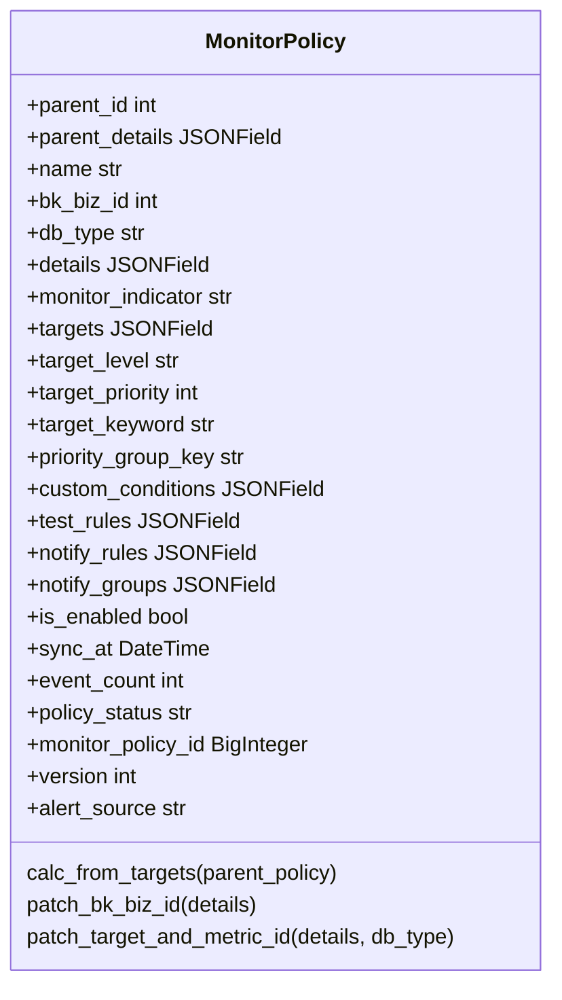
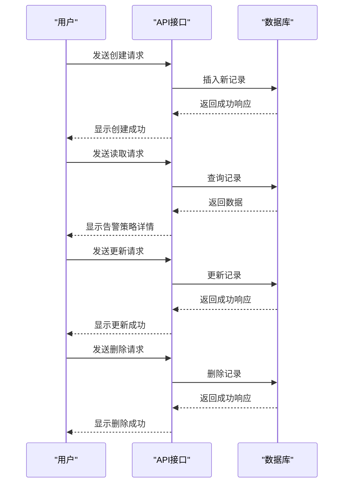
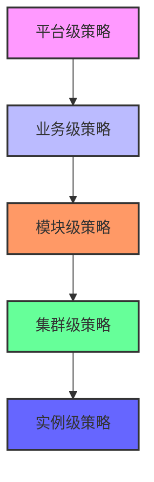

# 告警策略管理

<cite>
**本文档引用的文件**
- [alarm.py](file://dbm-ui/backend/db_monitor/models/alarm.py)
- [alarm_config.go](file://dbm-services/mongodb/db-tools/dbmon/config/alarm_config.go)
- [constants.py](file://dbm-ui/backend/db_monitor/constants.py)
- [utils.py](file://dbm-ui/backend/db_monitor/utils.py)
- [export_alarm.py](file://dbm-ui/backend/db_monitor/management/commands/export_alarm.py)
- [MySQL 主机磁盘空间使用率.json](file://dbm-ui/backend/db_monitor/tpls/alarm/mysql/MySQL 主机磁盘空间使用率.json)
- [MySQL 从库延迟.json](file://dbm-ui/backend/db_monitor/tpls/alarm/mysql/MySQL 从库延迟.json)
- [add_alarm_shield.py](file://dbm-ui/backend/flow/plugins/components/collections/common/add_alarm_shield.py)
</cite>

## 目录
1. [引言](#引言)
2. [告警模型与核心概念](#告警模型与核心概念)
3. [告警策略的CRUD操作](#告警策略的crud操作)
4. [预设告警规则详解](#预设告警规则详解)
5. [告警策略继承与覆盖机制](#告警策略继承与覆盖机制)
6. [告警屏蔽与值班规则](#告警屏蔽与值班规则)
7. [结论](#结论)

## 引言
告警策略管理是数据库管理系统(DBM)中确保系统稳定性和及时响应异常的关键功能。本系统通过集成蓝鲸监控(BKMonitor)能力，实现了对多种数据库组件的全面监控与告警管理。告警策略不仅涵盖了CPU使用率过高、磁盘空间不足等常见问题，还支持通过API或管理命令进行灵活的CRUD操作。此外，系统提供了告警策略的继承与覆盖机制，以及告警屏蔽和值班规则配置，以实现精准的通知。本文档将全面阐述告警策略管理的核心概念、操作流程及具体实现。

## 告警模型与核心概念
告警模型是告警策略管理的基础，它定义了告警的触发条件、严重级别、恢复通知和生效时间等核心属性。在本系统中，告警模型主要由`MonitorPolicy`类表示，该类位于`dbm-ui/backend/db_monitor/models/alarm.py`文件中。`MonitorPolicy`类包含了告警策略的名称、业务ID、数据库类型、监控目标、检测规则、通知规则等关键字段。

告警的触发条件通常基于时序数据、事件数据或日志关键字。例如，当CPU使用率超过90%时，系统会触发一个致命级别的告警。严重级别分为致命、预警和提醒三个等级，分别对应不同的处理优先级。恢复通知是指当告警条件不再满足时，系统会发送一条恢复通知，告知相关人员问题已解决。生效时间则指定了告警策略的有效时间段，可以是全天候有效，也可以是特定时间段内有效。



**图源**
- [alarm.py](file://dbm-ui/backend/db_monitor/models/alarm.py#L597-L718)

## 告警策略的CRUD操作
告警策略的CRUD操作允许用户通过API或管理命令对告警策略进行创建、读取、更新和删除。这些操作主要通过`MonitorPolicy`类的方法来实现。例如，创建一个新的告警策略可以通过调用`save()`方法完成，而删除一个告警策略则需要调用`delete()`方法。

在实际应用中，用户可以通过管理命令`export_alarm.py`来导出告警策略模板，或者使用`update_alarm.py`来更新现有的告警策略。这些脚本位于`dbm-ui/backend/db_monitor/management/commands/`目录下，为用户提供了一种便捷的方式来批量管理和维护告警策略。

**告警策略的CRUD操作流程如下：**

1. **创建**：用户定义告警策略的名称、业务ID、数据库类型等基本信息，并设置监控目标、检测规则和通知规则。
2. **读取**：用户可以通过查询接口获取指定告警策略的详细信息。
3. **更新**：用户可以修改现有告警策略的任何属性，如调整触发阈值或更改通知组。
4. **删除**：用户可以选择删除不再需要的告警策略。



**图源**
- [alarm.py](file://dbm-ui/backend/db_monitor/models/alarm.py#L597-L718)
- [export_alarm.py](file://dbm-ui/backend/db_monitor/management/commands/export_alarm.py)

## 预设告警规则详解
系统为不同数据库组件预设了多种告警规则，这些规则位于`dbm-ui/backend/db_monitor/tpls/alarm/`目录下的JSON文件中。每个JSON文件代表一个具体的告警策略模板，包含了告警的名称、触发条件、严重级别等信息。

### MySQL主机磁盘空间使用率
此告警规则用于监控MySQL主机的磁盘空间使用情况。当磁盘空间使用率达到90%以上时，系统会触发一个致命级别的告警；当使用率达到85%以上时，会触发一个预警级别的告警。该规则的配置文件位于`dbm-ui/backend/db_monitor/tpls/alarm/mysql/MySQL 主机磁盘空间使用率.json`。

```json
{
  "name": "MySQL 主机磁盘空间使用率",
  "items": [
    {
      "algorithms": [
        {
          "type": "Threshold",
          "level": 1,
          "config": [[{"method": "gte", "threshold": 90}]]
        },
        {
          "type": "Threshold",
          "level": 2,
          "config": [[{"method": "gte", "threshold": 85}]]
        }
      ]
    }
  ]
}
```

### MySQL从库延迟
此告警规则用于监控MySQL从库的数据同步延迟。当从库延迟超过21600秒（6小时）时，系统会触发一个致命级别的告警；当延迟超过300秒（5分钟）时，会触发一个预警级别的告警；当延迟超过60秒（1分钟）时，会触发一个提醒级别的告警。该规则的配置文件位于`dbm-ui/backend/db_monitor/tpls/alarm/mysql/MySQL 从库延迟.json`。

```json
{
  "name": "MySQL 从库延迟",
  "items": [
    {
      "algorithms": [
        {
          "type": "Threshold",
          "level": 1,
          "config": [[{"method": "gte", "threshold": 21600}]]
        },
        {
          "type": "Threshold",
          "level": 2,
          "config": [[{"method": "gte", "threshold": 300}]]
        },
        {
          "type": "Threshold",
          "level": 3,
          "config": [[{"method": "gte", "threshold": 60}]]
        }
      ]
    }
  ]
}
```

**图源**
- [MySQL 主机磁盘空间使用率.json](file://dbm-ui/backend/db_monitor/tpls/alarm/mysql/MySQL 主机磁盘空间使用率.json)
- [MySQL 从库延迟.json](file://dbm-ui/backend/db_monitor/tpls/alarm/mysql/MySQL 从库延迟.json)

## 告警策略继承与覆盖机制
告警策略的继承与覆盖机制允许用户在不同层级上定义和应用告警策略。系统支持平台级、业务级、模块级、集群级和实例级的告警策略。当多个层级的策略同时存在时，较低层级的策略会覆盖较高层级的策略。

例如，如果在平台级定义了一个通用的CPU使用率告警策略，但在某个特定业务中需要更严格的阈值，则可以在该业务级别定义一个新的告警策略，其阈值将覆盖平台级的设置。这种机制确保了告警策略的灵活性和可定制性。



**图源**
- [constants.py](file://dbm-ui/backend/db_monitor/constants.py#L42-L53)

## 告警屏蔽与值班规则
告警屏蔽和值班规则是实现精准通知的重要手段。告警屏蔽允许用户在特定时间内暂停告警通知，以避免在维护期间收到不必要的告警。值班规则则定义了在不同时间段内负责处理告警的人员或团队。

### 告警屏蔽
告警屏蔽功能通过`AlarmConfig`类实现，该类位于`dbm-services/mongodb/db-tools/dbmon/config/alarm_config.go`文件中。用户可以通过调用`Shield()`方法来屏蔽某个服务器的告警，直到指定的结束时间。如果未指定结束时间，则告警将被永久屏蔽。

```go
func (a *AlarmConfig) Shield(server *ConfServerItem, endTime string) error {
    _, err := a.c.UpdateOne(server, "alarm", "shield", "true")
    if err != nil {
        return err
    }
    _, err = a.c.UpdateOne(server, "alarm", ShieldEndTimeKey, endTime)
    if err != nil {
        return err
    }
    return nil
}
```

### 值班规则
值班规则通过`DutyRule`类实现，该类位于`dbm-ui/backend/db_monitor/models/alarm.py`文件中。用户可以定义固定值班或交替轮值两种类型的值班规则。每条规则包含生效时间、截止时间、轮值人员等信息。

```python
class DutyRule(AuditedModel):
    name = models.CharField(verbose_name=_("轮值规则名称"), max_length=LEN_MIDDLE)
    monitor_duty_rule_id = models.IntegerField(verbose_name=_("监控轮值规则 ID"), default=0)
    priority = models.PositiveIntegerField(verbose_name=_("优先级"))
    is_enabled = models.BooleanField(verbose_name=_("是否启用"), default=True)
    effective_time = models.DateTimeField(verbose_name=_("生效时间"))
    end_time = models.DateTimeField(verbose_name=_("截止时间"), blank=True, null=True)
    category = models.CharField(verbose_name=_("轮值类型"), choices=DutyRuleCategory.get_choices(), max_length=LEN_SHORT)
    db_type = models.CharField(_("数据库类型"), choices=DBType.get_choices(), max_length=LEN_SHORT)
    duty_arranges = models.JSONField(_("轮值人员设置"))
    biz_config = models.JSONField(_("业务设置(包含业务include/排除业务exclude)"), default=dict)
```

**图源**
- [alarm_config.go](file://dbm-services/mongodb/db-tools/dbmon/config/alarm_config.go#L21-L32)
- [alarm.py](file://dbm-ui/backend/db_monitor/models/alarm.py#L237-L282)

## 结论
告警策略管理是数据库管理系统中不可或缺的一部分，它通过定义和执行告警策略，帮助运维人员及时发现并处理潜在的问题。本文档详细介绍了告警模型的核心概念、CRUD操作流程、预设告警规则、继承与覆盖机制以及告警屏蔽和值班规则。通过这些功能，系统能够提供灵活且精准的告警服务，从而保障数据库系统的稳定运行。