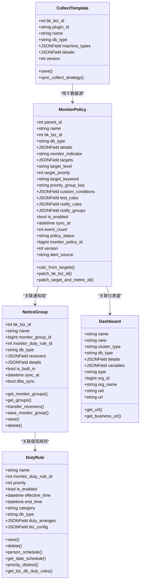
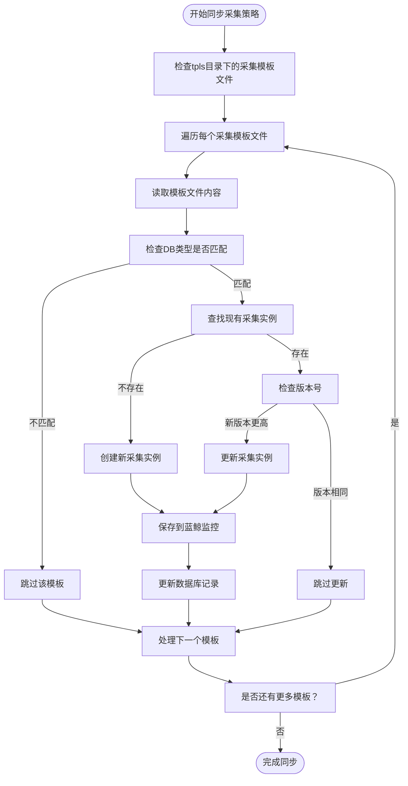
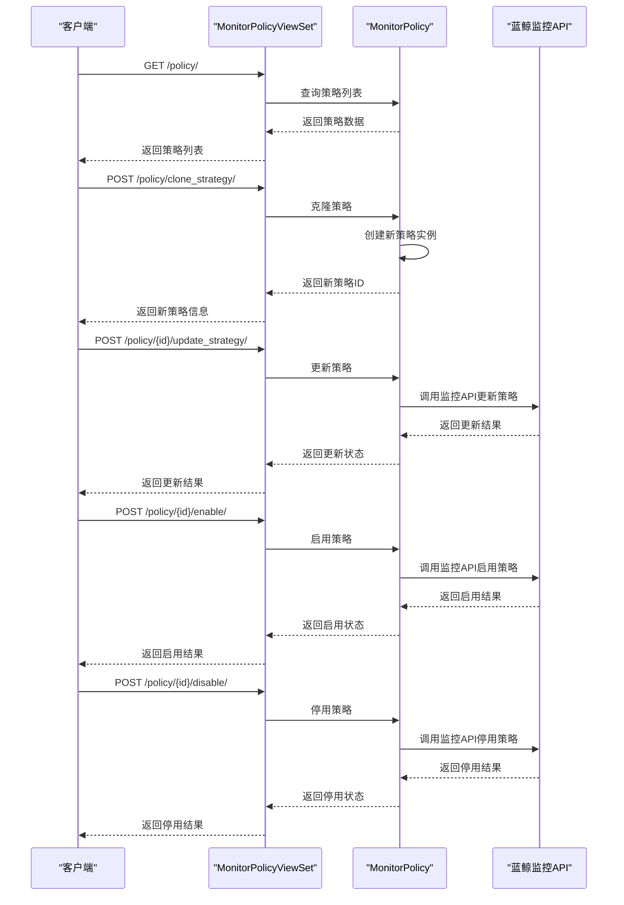
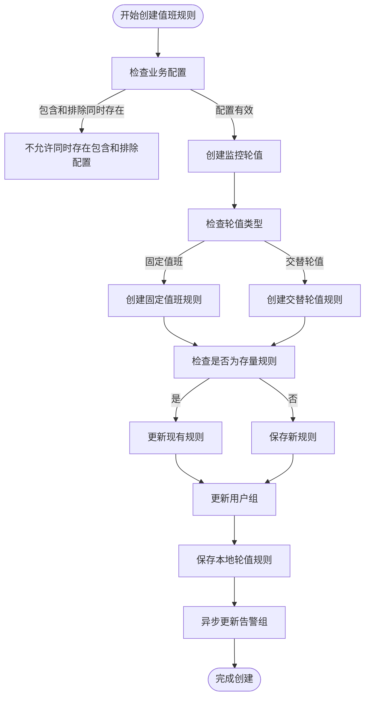
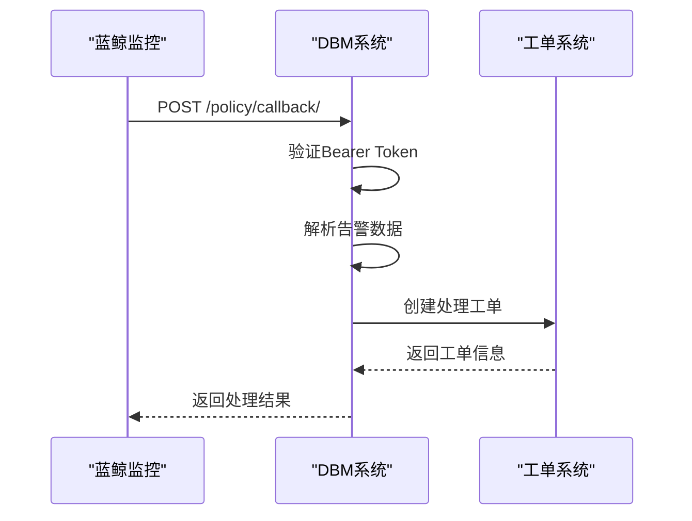
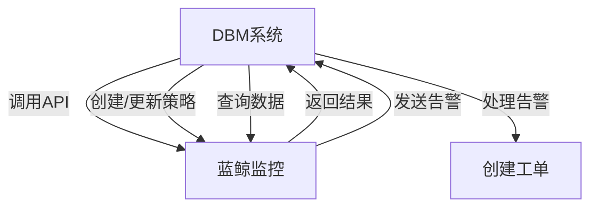

# 监控告警

<cite>
**本文档引用文件**   
- [collect.py](file://dbm-ui/backend/db_monitor/models/collect.py)
- [alarm.py](file://dbm-ui/backend/db_monitor/models/alarm.py)
- [dashboard.py](file://dbm-ui/backend/db_monitor/models/dashboard.py)
- [policy.py](file://dbm-ui/backend/db_monitor/views/policy.py)
- [notice_group.py](file://dbm-ui/backend/db_monitor/views/notice_group.py)
- [export_collect.py](file://dbm-ui/backend/db_monitor/management/commands/export_collect.py)
- [export_alarm.py](file://dbm-ui/backend/db_monitor/management/commands/export_alarm.py)
- [urls.py](file://dbm-ui/backend/db_monitor/urls.py)
- [serializers.py](file://dbm-ui/backend/db_monitor/serializers.py)
- [constants.py](file://dbm-ui/backend/db_monitor/constants.py)
</cite>

## 目录
1. [引言](#引言)
2. [核心模型架构](#核心模型架构)
3. [监控数据采集](#监控数据采集)
4. [告警策略管理](#告警策略管理)
5. [预置监控模板](#预置监控模板)
6. [通知组与值班规则](#通知组与值班规则)
7. [告警屏蔽与自动修复](#告警屏蔽与自动修复)
8. [蓝鲸监控集成](#蓝鲸监控集成)
9. [Grafana可视化](#grafana可视化)
10. [告警诊断与处理指南](#告警诊断与处理指南)

## 引言

本文档详细介绍了DBM系统的监控告警模块，涵盖监控数据采集、告警策略、告警事件、通知组等核心模型。文档说明了如何通过API或管理命令创建、更新和导出监控采集模板和告警策略，解释了预置在tpls目录下的针对MySQL、Redis、Kafka等组件的监控模板和告警规则。同时，文档还说明了告警的屏蔽、值班规则和自动修复流程，提供了与蓝鲸监控（BKMONITOR）集成的配置指南，以及如何基于Grafana视图进行数据可视化，为运维人员提供告警诊断和处理的实用指南。

## 核心模型架构

监控告警系统的核心由多个关键模型构成，这些模型共同实现了完整的监控告警功能。系统通过采集模板（CollectTemplate）定义数据采集策略，通过告警策略（MonitorPolicy）定义告警规则，通过通知组（NoticeGroup）管理告警接收人，通过值班规则（DutyRule）实现轮值调度。



**图源**
- [collect.py](file://dbm-ui/backend/db_monitor/models/collect.py#L39-L172)
- [alarm.py](file://dbm-ui/backend/db_monitor/models/alarm.py#L70-L719)
- [dashboard.py](file://dbm-ui/backend/db_monitor/models/dashboard.py#L28-L83)

**本节源**
- [collect.py](file://dbm-ui/backend/db_monitor/models/collect.py#L39-L172)
- [alarm.py](file://dbm-ui/backend/db_monitor/models/alarm.py#L70-L719)
- [dashboard.py](file://dbm-ui/backend/db_monitor/models/dashboard.py#L28-L83)

## 监控数据采集

监控数据采集模块负责定义和管理数据采集策略。系统通过采集模板（CollectTemplate）来定义采集配置，这些模板可以同步到蓝鲸监控系统中执行。

### 采集模板管理

采集模板通过`CollectTemplate`模型定义，包含以下关键字段：
- `bk_biz_id`: 业务ID，0代表全业务
- `plugin_id`: 插件ID，标识采集插件
- `name`: 策略名称，全局唯一
- `db_type`: DB类型，如MySQL、Redis等
- `machine_types`: 绑定的机器类型列表
- `details`: 采集详情，包含具体的采集配置
- `version`: 版本号，用于版本管理

系统提供了管理命令来导出和同步采集模板：

```bash
# 导出MySQL采集模板
python manage.py export_collect mysql 7 91
python manage.py export_collect mysql 14 -m spider

# 导出Redis采集模板
python manage.py export_collect redis 5 9 10
```

采集模板的同步通过`sync_collect_strategy`方法实现，该方法会遍历tpls目录下的采集模板文件，将其同步到蓝鲸监控系统中。同步过程中会检查模板版本，只有当新版本高于现有版本时才会更新。



**图源**
- [collect.py](file://dbm-ui/backend/db_monitor/models/collect.py#L76-L168)
- [export_collect.py](file://dbm-ui/backend/db_monitor/management/commands/export_collect.py#L31-L136)

**本节源**
- [collect.py](file://dbm-ui/backend/db_monitor/models/collect.py#L39-L172)
- [export_collect.py](file://dbm-ui/backend/db_monitor/management/commands/export_collect.py#L31-L136)

## 告警策略管理

告警策略管理模块负责定义和管理告警规则。系统通过`MonitorPolicy`模型来定义告警策略，这些策略可以同步到蓝鲸监控系统中执行。

### 告警策略模型

`MonitorPolicy`模型包含以下关键字段：
- `parent_id`: 父级策略ID，0代表父级
- `name`: 策略名称，全局唯一
- `bk_biz_id`: 业务ID，0代表全业务
- `db_type`: DB类型
- `details`: 当前策略详情，可用于patch
- `monitor_indicator`: 监控指标名
- `targets`: 监控目标
- `target_level`: 监控目标级别
- `target_priority`: 监控策略优先级
- `target_keyword`: 监控目标检索冗余字段
- `priority_group_key`: 策略分组ID
- `custom_conditions`: 自定义过滤列表
- `test_rules`: 检测规则
- `notify_rules`: 通知规则
- `notify_groups`: 通知组
- `is_enabled`: 是否已启用
- `sync_at`: 最近一次的同步时间
- `event_count`: 告警事件数量
- `policy_status`: 策略状态
- `monitor_policy_id`: 蓝鲸监控策略ID
- `version`: 版本号
- `alert_source`: 告警数据来源

### 告警策略API

系统提供了REST API来管理告警策略，主要端点包括：



**图源**
- [policy.py](file://dbm-ui/backend/db_monitor/views/policy.py#L126-L400)
- [alarm.py](file://dbm-ui/backend/db_monitor/models/alarm.py#L597-L719)

**本节源**
- [policy.py](file://dbm-ui/backend/db_monitor/views/policy.py#L126-L400)
- [alarm.py](file://dbm-ui/backend/db_monitor/models/alarm.py#L597-L719)

## 预置监控模板

系统预置了针对不同数据库组件的监控模板和告警规则，这些模板存储在`tpls`目录下，分为采集模板和告警模板两类。

### 采集模板

采集模板位于`tpls/collect`目录下，为不同组件提供了预定义的采集配置：

- `dbm_mysqld_exporter.json`: MySQL实例监控采集
- `dbm_redis_exporter.json`: Redis实例监控采集
- `dbm_kafka_exporter.json`: Kafka实例监控采集
- `dbm_elasticsearch_exporter.json`: Elasticsearch实例监控采集
- `dbm_mongodb_exporter.json`: MongoDB实例监控采集
- `dbm_hdfs_exporter.json`: HDFS实例监控采集
- `dbm_influxdb_bkpull.json`: InfluxDB实例监控采集
- `dbm_pulsarbroker_bkpull.json`: Pulsar Broker实例监控采集

这些采集模板定义了如何从各个组件收集监控数据，包括采集指标、采集频率、采集插件配置等。

### 告警模板

告警模板位于`tpls/alarm`目录下，按数据库类型组织，为不同组件提供了预定义的告警规则：

#### MySQL告警规则

MySQL告警规则涵盖了实例、主机、备份、同步等多个方面的监控：

- **实例性能**: MySQL 主机 CPU 负载、MySQL 主机内存使用率、MySQL 主机磁盘IO利用率、MySQL 主机磁盘空间使用率、MySQL 实例 Threads_running、MySQL 连接数使用率
- **数据同步**: MySQL Slave 同步异常、MySQL 从库同步异常、MySQL 从库延迟、MySQL monitor 主从心跳异常
- **备份恢复**: MySQL 备份执行失败、MySQL 集群备份连续失败
- **安全审计**: MySQL 注入、MySQL Routine Definer、MySQL Trigger Definer、MySQL View Definer
- **配置管理**: MySQL 配置异常、MySQL 库字符集、MySQL 存储引擎检查
- **故障自愈**: MySQL 故障自愈失败、Mysql dbha切换mysql失败策略
- **组件监控**: MySQL Monitor 执行异常、Mysql monitor组件心跳监控、Mysql dbha组件心跳丢失

#### Redis告警规则

Redis告警规则主要关注实例性能和数据安全：

- **性能指标**: Redis 内存使用率、Redis Key数量、Redis QPS、Redis Slave延迟
- **数据安全**: Redis 持久化失败、Redis 主从同步异常
- **连接管理**: Redis 连接数使用率、Redis 连接失败
- **组件监控**: Redis Proxy端口探测异常、Redis 实例进程异常

#### Kafka告警规则

Kafka告警规则关注集群健康和消息处理：

- **集群健康**: Kafka Broker存活、Kafka Zookeeper存活
- **消息处理**: Kafka Topic消息堆积、Kafka Consumer延迟
- **性能指标**: Kafka Broker CPU使用率、Kafka Broker内存使用率
- **数据安全**: Kafka Topic分区不平衡

这些预置模板可以通过管理命令导出和更新：

```bash
# 导出MySQL告警策略
python manage.py export_alarm mysql 39901 39900 39763 39759 39783 39760 39785 39779 39723 39738 39739 39787 39767 39751 39733 39762 39729 39782 39734 39788 39730 39768 39731 39769 39737 39721 39773 39786 39771 39742 39755 39745 39789 39991 39992 39993 39994 39996 40004 46286 46287

# 导出Redis告警策略
python manage.py export_alarm redis 46031

# 导出Kafka告警策略
python manage.py export_alarm kafka 39770 39724 39765 39772 39775 -d -c consumergroup topic
```

**本节源**
- [constants.py](file://dbm-ui/backend/db_monitor/constants.py#L19-L21)
- [export_alarm.py](file://dbm-ui/backend/db_monitor/management/commands/export_alarm.py#L31-L240)

## 通知组与值班规则

通知组和值班规则模块负责管理告警通知的接收人和轮值调度，确保告警信息能够及时准确地送达相关人员。

### 通知组管理

通知组通过`NoticeGroup`模型定义，包含以下关键字段：
- `bk_biz_id`: 业务ID，0代表全业务
- `name`: 告警通知组名称
- `monitor_group_id`: 监控通知组ID
- `monitor_duty_rule_id`: 监控轮值规则ID
- `db_type`: 数据库类型
- `receivers`: 告警接收人员/组列表
- `details`: 通知方式详情
- `is_built_in`: 是否内置
- `sync_at`: 最近一次的同步时间
- `dba_sync`: 是否自动同步DBA人员配置

通知组支持多种通知方式，包括RTX、邮件、电话等。系统通过`save_monitor_group`方法将通知组同步到蓝鲸监控系统中。

### 值班规则管理

值班规则通过`DutyRule`模型定义，支持固定值班和交替轮值两种模式：

- **固定值班 (REGULAR)**: 指定日期和时间段的固定人员值班
- **交替轮值 (HANDOFF)**: 按照指定周期和轮换规则的交替值班

`DutyRule`模型包含以下关键字段：
- `name`: 轮值规则名称
- `monitor_duty_rule_id`: 监控轮值规则ID
- `priority`: 优先级
- `is_enabled`: 是否启用
- `effective_time`: 生效时间
- `end_time`: 截止时间
- `category`: 轮值类型
- `db_type`: 数据库类型
- `duty_arranges`: 轮值人员设置
- `biz_config`: 业务设置（包含业务include/排除业务exclude）

系统提供了API来管理值班规则，包括创建、更新、删除和查询值班安排。



**图源**
- [alarm.py](file://dbm-ui/backend/db_monitor/models/alarm.py#L70-L235)
- [alarm.py](file://dbm-ui/backend/db_monitor/models/alarm.py#L237-L428)

**本节源**
- [alarm.py](file://dbm-ui/backend/db_monitor/models/alarm.py#L70-L428)
- [notice_group.py](file://dbm-ui/backend/db_monitor/views/notice_group.py#L59-L150)

## 告警屏蔽与自动修复

告警屏蔽和自动修复模块提供了高级的告警管理功能，帮助运维人员在特定情况下控制告警行为，并实现故障的自动恢复。

### 告警屏蔽

告警屏蔽功能允许在特定时间段内屏蔽指定的告警策略，避免在维护窗口或已知问题期间产生不必要的告警。系统通过`AlarmShieldView`视图提供告警屏蔽API，支持按策略ID、屏蔽时间、屏蔽原因等参数进行屏蔽操作。

### 自动修复

自动修复功能与DBM的故障自愈流程集成，当检测到特定故障时，系统可以自动触发修复流程。告警策略可以通过配置动作（actions）来触发自动修复任务。

告警回调接口处理来自蓝鲸监控的告警事件，并根据告警内容创建相应的处理工单：



**图源**
- [policy.py](file://dbm-ui/backend/db_monitor/views/policy.py#L383-L400)
- [urls.py](file://dbm-ui/backend/db_monitor/urls.py#L28-L29)

**本节源**
- [policy.py](file://dbm-ui/backend/db_monitor/views/policy.py#L383-L400)

## 蓝鲸监控集成

DBM系统与蓝鲸监控（BKMONITOR）深度集成，通过调用蓝鲸监控API实现监控策略的创建、更新和管理。

### 集成配置

系统通过`BKMonitorV3Api`组件与蓝鲸监控交互，关键配置包括：

- `env.DBA_APP_BK_BIZ_ID`: DBA业务ID
- `env.BKMONITOR_BEARER_TOKEN`: 监控回调验证Token
- `env.BKMONITOR_URL`: 蓝鲸监控URL

### API调用流程

DBM系统通过以下流程与蓝鲸监控集成：

1. **策略同步**: 将本地定义的监控策略同步到蓝鲸监控
2. **告警回调**: 接收蓝鲸监控的告警事件并处理
3. **数据查询**: 从蓝鲸监控查询监控数据和告警事件



**本节源**
- [policy.py](file://dbm-ui/backend/db_monitor/views/policy.py#L24-L25)
- [alarm.py](file://dbm-ui/backend/db_monitor/models/alarm.py#L26-L27)

## Grafana可视化

系统通过Grafana实现监控数据的可视化展示，为运维人员提供直观的监控视图。

### 仪表盘管理

仪表盘通过`Dashboard`模型管理，包含以下关键字段：
- `name`: 名称
- `view`: 视图类型
- `cluster_type`: 集群类型
- `db_type`: DB类型
- `details`: 详情
- `variables`: 变量
- `type`: 仪表盘类型
- `org_id`: grafana-org_id
- `org_name`: grafana-org_name
- `uid`: grafana-uid
- `url`: grafana-url

### URL生成

系统提供了`get_url`方法生成仪表盘访问URL，自动填充业务ID、集群域名等参数：

```python
def get_url(self, bk_biz_id, cluster_id, view=None):
    cluster = Cluster.objects.filter(id=cluster_id).last()
    params = {
        "orgId": DEFAULT_ORG_ID,
        "orgName": DEFAULT_ORG_NAME,
        "var-cluster_domain": getattr(cluster, "immute_domain", None),
        "var-cluster_name": getattr(cluster, "name", None),
        "var-app_id": bk_biz_id,
        "var-appid": bk_biz_id,
        "var-app": AppCache.get_app_attr(bk_biz_id, default=bk_biz_id),
    }
    return env.BK_SAAS_HOST + f"{self.url}?" + urllib.parse.urlencode(params)
```

**图源**
- [dashboard.py](file://dbm-ui/backend/db_monitor/models/dashboard.py#L28-L83)

**本节源**
- [dashboard.py](file://dbm-ui/backend/db_monitor/models/dashboard.py#L28-L83)

## 告警诊断与处理指南

为帮助运维人员快速诊断和处理告警，提供以下实用指南：

### 告警诊断流程

1. **确认告警真实性**: 检查告警是否为误报，确认监控数据的准确性
2. **定位问题根源**: 根据告警内容和相关指标，定位问题的根本原因
3. **评估影响范围**: 确定问题影响的业务范围和严重程度
4. **制定处理方案**: 根据问题类型，选择合适的处理方案
5. **执行修复操作**: 按照方案执行修复操作
6. **验证修复结果**: 确认问题已解决，监控指标恢复正常

### 常见告警处理

#### MySQL相关告警

- **MySQL 主机 CPU 负载过高**: 检查是否有慢查询或大事务，优化SQL或调整资源配置
- **MySQL 从库延迟**: 检查网络状况和主从同步状态，必要时重建从库
- **MySQL 备份执行失败**: 检查存储空间和备份脚本，重新执行备份任务
- **MySQL 连接数使用率过高**: 检查应用连接池配置，优化连接管理

#### Redis相关告警

- **Redis 内存使用率过高**: 检查数据过期策略，清理无用数据，或扩容实例
- **Redis 主从同步异常**: 检查网络连接和主从配置，重新建立同步关系
- **Redis 持久化失败**: 检查磁盘空间和权限，修复文件系统问题

#### Kafka相关告警

- **Kafka Topic消息堆积**: 检查消费者处理能力，增加消费者实例或优化消费逻辑
- **Kafka Broker存活异常**: 检查Broker进程状态和资源使用情况，重启服务或扩容节点

### 告警处理最佳实践

1. **建立告警分级机制**: 根据告警严重程度，制定不同的响应策略
2. **实施值班轮换**: 确保7x24小时有人响应告警
3. **记录处理过程**: 完整记录告警处理过程，便于后续分析和优化
4. **定期复盘总结**: 定期回顾告警事件，优化监控策略和处理流程
5. **自动化处理**: 对常见问题实现自动化修复，提高处理效率

**本节源**
- [docs/autofix_readme.md](file://dbm-ui/backend/docs/autofix_readme.md)