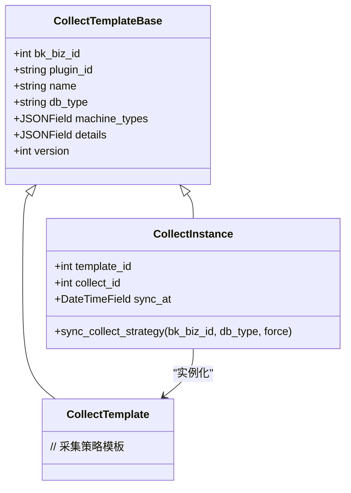
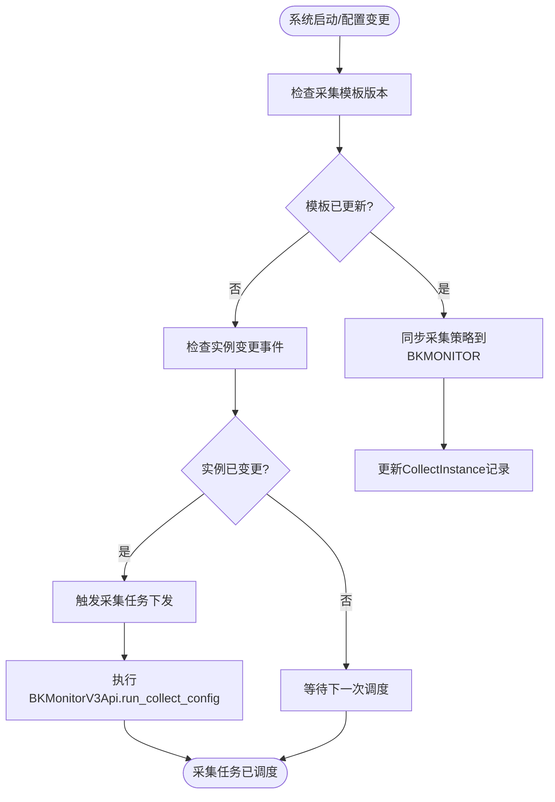
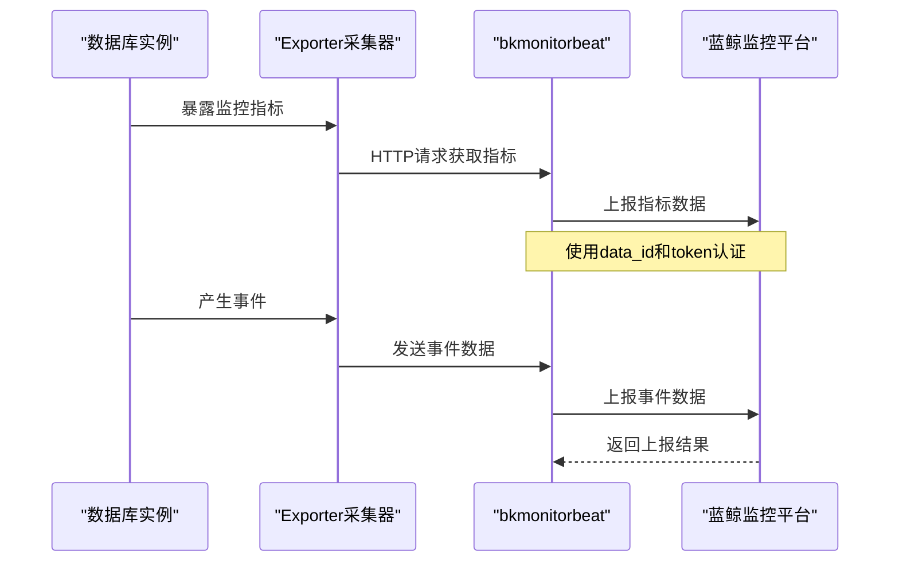

# 监控数据采集

<cite>
**本文档引用的文件**  
- [collect.py](file://dbm-ui/backend/db_monitor/models/collect.py)
- [export_collect.py](file://dbm-ui/backend/db_monitor/management/commands/export_collect.py)
- [constants.py](file://dbm-ui/backend/db_monitor/constants.py)
- [dbm_mysqld_exporter.json](file://dbm-ui/backend/db_monitor/tpls/collect/dbm_mysqld_exporter.json)
- [dbm_redis_exporter.json](file://dbm-ui/backend/db_monitor/tpls/collect/dbm_redis_exporter.json)
- [dbm_kafka_bkpull.json](file://dbm-ui/backend/db_monitor/tpls/collect/dbm_kafka_bkpull.json)
- [dbm_mongodb_exporter.json](file://dbm-ui/backend/db_monitor/tpls/collect/dbm_mongodb_exporter.json)
- [send_bk_monitor_beat.go](file://dbm-services/mysql/db-tools/mysql-crond/pkg/config/send_bk_monitor_beat.go)
- [redis_act_playload.py](file://dbm-ui/backend/flow/utils/redis/redis_act_playload.py)
- [cc_manage.py](file://dbm-ui/backend/flow/utils/cc_manage.py)
</cite>

## 目录
1. [引言](#引言)
2. [采集模型设计](#采集模型设计)
3. [采集模板管理](#采集模板管理)
4. [预置采集模板结构](#预置采集模板结构)
5. [采集任务调度机制](#采集任务调度机制)
6. [数据上报流程](#数据上报流程)
7. [自定义采集配置](#自定义采集配置)
8. [采集失败诊断](#采集失败诊断)
9. [结论](#结论)

## 引言
蓝鲸数据库管理系统（DBM）提供了一套完整的监控数据采集体系，用于对MySQL、Redis、Kafka、MongoDB等数据库组件进行性能监控和状态采集。本系统通过蓝鲸监控（BKMONITOR）平台实现数据采集、上报和告警功能，支持灵活的采集策略配置和自动化调度机制。本文档详细阐述了监控数据采集的核心设计、模板管理、调度机制和数据上报流程。

## 采集模型设计

监控数据采集模型基于`CollectTemplate`和`CollectInstance`两个核心模型构建。`CollectTemplate`表示采集策略模板，定义了采集目标、指标项、采集周期和数据源配置等元信息；`CollectInstance`表示采集策略实例，是模板在具体业务环境中的实例化。

采集模型的关键设计要素包括：
- **采集目标（db_type）**：定义被监控的数据库类型，如MySQL、Redis、Kafka等
- **指标项（metrics）**：通过`metric_relabel_configs`配置需要采集和过滤的指标
- **采集周期（period）**：在`params.collector.period`中定义，单位为秒
- **数据源配置**：通过`plugin`参数配置数据源连接信息和采集器参数

采集策略通过蓝鲸监控API进行管理，支持创建、更新和同步操作。系统通过`sync_collect_strategy`方法实现采集策略的同步，确保模板变更能够及时应用到监控系统中。

**采集模型关系图**


**图源**
- [collect.py](file://dbm-ui/backend/db_monitor/models/collect.py#L39-L171)

**本节源**
- [collect.py](file://dbm-ui/backend/db_monitor/models/collect.py#L39-L171)

## 采集模板管理

系统提供了通过API和管理命令创建、更新和导出采集模板的能力。采集模板的管理主要通过`export_collect.py`命令实现，支持从蓝鲸监控系统导出采集策略并保存为本地模板文件。

### 创建和更新采集模板
采集模板的创建和更新通过`BKMonitorV3Api.save_collect_config`接口实现。系统在启动或配置变更时，会调用`sync_collect_strategy`方法同步采集策略。该方法会遍历`tpls/collect/`目录下的所有JSON模板文件，将其同步到蓝鲸监控系统中。

当模板版本号（version）增加时，系统会自动更新对应的采集策略，确保配置变更能够及时生效。对于已存在的采集实例，系统会比较模板版本号，只有当新版本号大于当前版本号时才会执行更新操作。

### 导出采集模板
通过`export_collect`管理命令可以将蓝鲸监控中的采集策略导出为本地模板文件。命令使用示例如下：
```bash
python manage.py export_collect mysql 39901 39900 39763 --machine_types backend remote
```

该命令会：
1. 调用`BKMonitorV3Api.query_collect_config_detail`获取指定ID的采集策略详情
2. 通过`to_template`方法将策略转换为模板格式
3. 清理与模板无关的字段，如ID、订阅信息等
4. 将模板保存到`tpls/collect/`目录下，文件名为`{name}.json`

导出的模板包含版本控制信息，每次导出时版本号会自动递增，便于追踪配置变更历史。

**本节源**
- [export_collect.py](file://dbm-ui/backend/db_monitor/management/commands/export_collect.py#L31-L136)
- [collect.py](file://dbm-ui/backend/db_monitor/models/collect.py#L76-L171)

## 预置采集模板结构

系统在`tpls/collect/`目录下为MySQL、Redis、Kafka、MongoDB等组件预置了采集模板，这些模板定义了各组件的标准化监控配置。

### MySQL采集模板
`dbm_mysqld_exporter.json`模板用于MySQL数据库的监控采集，其主要配置如下：

```json
{
  "bk_biz_id": 0,
  "name": "dbm_mysqld_exporter",
  "details": {
    "collect_type": "Exporter",
    "params": {
      "collector": {
        "period": 60,
        "timeout": 60,
        "host": "127.0.0.1",
        "port": ""
      },
      "plugin": {
        "--web.listen-address": "${host}:${port}",
        "--config.my-cnf": "/etc/{{ target.service.labels[\"exporter_conf_path\"] }}",
        "--collect.global_variables": "true",
        "--collect.slave_status": "true",
        "--collect.info_schema.innodb_metrics": "true"
      }
    }
  },
  "db_type": "mysql",
  "version": 19,
  "machine_types": ["backend", "remote", "single"]
}
```

**关键字段说明：**
- `collect_type`: 采集类型为Exporter，表示通过Prometheus Exporter方式采集
- `period`: 采集周期为60秒
- `plugin`参数配置了mysqld_exporter的启动参数，包括：
  - `--collect.global_variables`: 采集全局变量
  - `--collect.slave_status`: 采集从库状态
  - `--collect.info_schema.innodb_metrics`: 采集InnoDB性能指标
- `machine_types`: 绑定的机器类型，包括backend、remote和single

### Redis采集模板
`dbm_redis_exporter.json`模板用于Redis数据库的监控采集：

```json
{
  "bk_biz_id": 0,
  "name": "dbm_redis_exporter",
  "details": {
    "collect_type": "Exporter",
    "params": {
      "plugin": {
        "-redis.addr": "{{ target.host.bk_host_innerip }}:{{ target.service.labels[\"instance_port\"] }}",
        "-web.listen-address": "${host}:${port}",
        "-redis.password-file": "/home/mysql/.exporter/{{ target.service.labels[\"instance_port\"] }}.conf"
      },
      "collector": {
        "period": 60
      }
    }
  },
  "db_type": "redis",
  "version": 17
}
```

**关键字段说明：**
- `-redis.addr`: Redis实例地址，通过CMDB主机内网IP和实例端口动态生成
- `-redis.password-file`: 密码文件路径，按实例端口区分
- `period`: 采集周期为60秒

### Kafka采集模板
`dbm_kafka_bkpull.json`模板用于Kafka集群的监控采集：

```json
{
  "bk_biz_id": 0,
  "name": "dbm_kafka_bkpull",
  "details": {
    "collect_type": "Pushgateway",
    "metric_relabel_configs": [{
      "source_labels": ["__name__"],
      "action": "drop",
      "regex": "kafka_cluster_partition_laststableoffsetlag|kafka_log_log_logendoffset|..."
    }],
    "params": {
      "collector": {
        "period": 60,
        "metrics_url": "http://localhost:7071"
      }
    }
  },
  "db_type": "kafka",
  "version": 18
}
```

**关键字段说明：**
- `collect_type`: 采集类型为Pushgateway，表示通过推送方式上报指标
- `metric_relabel_configs`: 指标过滤配置，通过正则表达式排除不需要的指标
- `metrics_url`: 指标推送地址

### MongoDB采集模板
`dbm_mongodb_exporter.json`模板用于MongoDB数据库的监控采集：

```json
{
  "bk_biz_id": 0,
  "name": "dbm_mongodb_exporter",
  "details": {
    "collect_type": "Exporter",
    "metric_relabel_configs": [{
      "source_labels": ["__name__"],
      "action": "drop",
      "regex": "^mongodb_sys_.*|^mongodb_ss_metrics_.*|^mongodb_connPoolStats_.*"
    }],
    "params": {
      "collector": {
        "period": 60
      },
      "plugin": {
        "-addr": "{{ target.host.bk_host_innerip }}:{{ target.service.labels[\"instance_port\"] }}",
        "-bind": "${host}:${port}"
      }
    }
  },
  "db_type": "mongodb",
  "version": 2
}
```

**关键字段说明：**
- `metric_relabel_configs`: 排除系统级和内部统计指标，减少监控数据量
- `-addr`: MongoDB实例连接地址
- `period`: 采集周期为60秒

**本节源**
- [dbm_mysqld_exporter.json](file://dbm-ui/backend/db_monitor/tpls/collect/dbm_mysqld_exporter.json)
- [dbm_redis_exporter.json](file://dbm-ui/backend/db_monitor/tpls/collect/dbm_redis_exporter.json)
- [dbm_kafka_bkpull.json](file://dbm-ui/backend/db_monitor/tpls/collect/dbm_kafka_bkpull.json)
- [dbm_mongodb_exporter.json](file://dbm-ui/backend/db_monitor/tpls/collect/dbm_mongodb_exporter.json)

## 采集任务调度机制

系统采用基于定时任务和事件驱动的混合调度机制来管理采集任务的执行。

### 定时调度
系统通过`cycle_trigger_operator_collector`定时任务（每分钟执行一次）来触发采集任务的下发。该任务从Redis缓存中获取待处理的采集任务列表，并逐个执行：

```python
@register_periodic_task(run_every=crontab(minute="*/1"))
def cycle_trigger_operator_collector():
    script = RedisConn.register_script(GET_AND_DELETE_SET_LUA)
    task_list = script(keys=["operate_collector"])
    for cache_key in task_list:
        bk_biz_id, db_type, machine_type, action = parser_operate_collector_cache_key(cache_key)
        instance_id_to_host_id = script(keys=[cache_key])
        operate_collector(bk_biz_id, db_type, machine_type, instance_id_to_host_id, action)
```

### 事件驱动调度
除了定时调度外，系统还支持事件驱动的采集任务触发。当数据库实例发生变更（如创建、删除、扩容等）时，系统会自动触发相应的采集任务配置更新。

采集任务的下发通过`cc_manage.py`中的逻辑实现：
```python
plugin_id = INSTANCE_MONITOR_PLUGINS[db_type][machine_type]["plugin_id"]
collect_instances = CollectInstance.objects.filter(db_type=collect_db_type, plugin_id=plugin_id)
for collect_ins in collect_instances:
    if collect_ins.machine_types and machine_type not in collect_ins.machine_types:
        continue
    try:
        BKMonitorV3Api.run_collect_config(
            {"bk_biz_id": env.DBA_APP_BK_BIZ_ID, "id": collect_ins.collect_id, "scope": scope, "action": action},
            use_admin=True,
        )
    except ApiError as err:
        logger.error(f"[monitor] id:{collect_ins.collect_id} error: {err}")
```

**采集任务调度流程图**


**图源**
- [collect.py](file://dbm-ui/backend/db_monitor/models/collect.py#L76-L171)
- [cc_manage.py](file://dbm-ui/backend/flow/utils/cc_manage.py#L636-L656)
- [db_periodic_task.py](file://dbm-ui/backend/db_periodic_task/local_tasks/db_monitor.py#L211-L222)

**本节源**
- [collect.py](file://dbm-ui/backend/db_monitor/models/collect.py#L76-L171)
- [cc_manage.py](file://dbm-ui/backend/flow/utils/cc_manage.py#L636-L656)
- [db_periodic_task.py](file://dbm-ui/backend/db_periodic_task/local_tasks/db_monitor.py#L211-L222)

## 数据上报流程

监控数据上报流程涉及多个组件的协同工作，从数据采集到最终上报到蓝鲸监控平台。

### 上报机制
系统通过`send_bk_monitor_beat.go`中的`SendBkMonitorBeat`函数实现数据上报。该函数封装了向蓝鲸监控平台发送数据的标准流程：

```go
func SendBkMonitorBeat(
    dataId int, reportType string,
    messageKind string, body interface{},
) error {
    output, err := json.Marshal(body)
    if err != nil {
        slog.Error(
            "send bk monitor heart beat encode body",
            slog.String("error", err.Error()),
            slog.Any("body", body),
        )
        return err
    }
    
    cmd := exec.Command("bkmonitorbeat", "-type", reportType, "-message_kind", messageKind)
    cmd.Stdin = bytes.NewBuffer(output)
    return cmd.Run()
}
```

### 上报数据结构
上报数据分为事件数据和指标数据两种类型：

**事件数据结构：**
```go
type eventData struct {
    EventName string                 `json:"event_name"`
    Event     map[string]interface{} `json:"event"`
    commonData
}
```

**指标数据结构：**
```go
type metricsData struct {
    commonData
}

type commonData struct {
    Target    string                 `json:"target"`
    Timestamp int64                  `json:"timestamp"`
    Dimension map[string]interface{} `json:"dimension"`
    Metrics   map[string]int64       `json:"metrics"`
}
```

### 配置参数获取
系统通过`SystemSettings`获取上报所需的配置参数，包括数据ID和访问令牌：

```python
bkm_dbm_report = SystemSettings.get_setting_value(key="BKM_DBM_REPORT")
monitor_config["bkmonitor_event_data_id"] = bkm_dbm_report["event"]["data_id"]
monitor_config["bkmonitor_event_token"] = bkm_dbm_report["event"]["token"]
monitor_config["bkmonitor_metric_data_id"] = bkm_dbm_report["metric"]["data_id"]
monitor_config["bkmonitor_metirc_token"] = bkm_dbm_report["metric"]["token"]
```

**数据上报流程图**


**图源**
- [send_bk_monitor_beat.go](file://dbm-services/mysql/db-tools/mysql-crond/pkg/config/send_bk_monitor_beat.go#L1-L58)
- [redis_act_playload.py](file://dbm-ui/backend/flow/utils/redis/redis_act_playload.py#L1186-L1193)

**本节源**
- [send_bk_monitor_beat.go](file://dbm-services/mysql/db-tools/mysql-crond/pkg/config/send_bk_monitor_beat.go#L1-L58)
- [redis_act_playload.py](file://dbm-ui/backend/flow/utils/redis/redis_act_playload.py#L1186-L1193)

## 自定义采集配置

系统支持通过配置文件和API接口进行自定义采集项的配置。以下是配置自定义采集项的步骤和最佳实践：

### 配置步骤
1. **创建采集模板文件**：在`tpls/collect/`目录下创建新的JSON模板文件
2. **定义采集参数**：配置`collect_type`、`params`、`plugin`等关键参数
3. **设置采集周期**：在`params.collector.period`中设置合适的采集间隔
4. **配置指标过滤**：通过`metric_relabel_configs`排除不需要的指标
5. **绑定服务实例**：在`plugin`参数中使用`{{ target.service.labels[\"xxx\"] }}`语法绑定服务实例属性
6. **版本控制**：为模板设置初始版本号，便于后续更新管理

### 最佳实践
- **合理设置采集周期**：对于高频变化的指标，可设置较短的采集周期（如15-30秒）；对于低频变化的指标，可设置较长的采集周期（如5-10分钟）
- **精细化指标过滤**：通过`metric_relabel_configs`排除不必要的指标，减少监控系统负载
- **使用服务实例维度**：在`plugin`参数中注入服务实例维度，便于在监控系统中进行多维度分析
- **版本化管理**：每次修改模板时递增版本号，便于追踪配置变更历史
- **测试验证**：在生产环境应用前，先在测试环境验证采集配置的正确性

## 采集失败诊断

当采集任务失败时，系统提供了多种诊断方法：

### 日志分析
检查相关组件的日志文件，重点关注以下日志：
- `collect.py`中的`[init_collect_strategy]`日志，记录采集策略同步过程
- `export_collect.py`中的导出操作日志
- `cc_manage.py`中的采集任务下发日志

### API调用诊断
通过调用蓝鲸监控API检查采集配置状态：
```python
# 查询采集配置详情
instance = BKMonitorV3Api.query_collect_config_detail(
    {"bk_biz_id": env.DBA_APP_BK_BIZ_ID, "id": str(collect_id)}
)
```

### 常见问题及解决方案
| 问题现象 | 可能原因 | 解决方案 |
|--------|--------|--------|
| 采集任务未执行 | 采集模板版本未更新 | 检查模板版本号，确保新版本号大于当前版本号 |
| 数据上报失败 | data_id或token配置错误 | 检查`BKM_DBM_REPORT`配置项中的data_id和token |
| 采集器无法连接 | 网络不通或端口未开放 | 检查数据库实例的网络连通性和端口开放情况 |
| 指标数据缺失 | 指标过滤配置过于严格 | 检查`metric_relabel_configs`配置，确保必要指标未被过滤 |

**本节源**
- [collect.py](file://dbm-ui/backend/db_monitor/models/collect.py#L161-L163)
- [export_collect.py](file://dbm-ui/backend/db_monitor/management/commands/export_collect.py#L109-L110)
- [cc_manage.py](file://dbm-ui/backend/flow/utils/cc_manage.py#L651-L652)

## 结论
蓝鲸数据库管理系统的监控数据采集体系设计完善，通过标准化的采集模板、灵活的调度机制和可靠的数据上报流程，实现了对多种数据库组件的高效监控。系统支持通过API和管理命令进行采集模板的全生命周期管理，并提供了详细的诊断方法来处理采集失败情况。通过遵循最佳实践，用户可以配置出高效、可靠的自定义采集方案，满足不同场景下的监控需求。