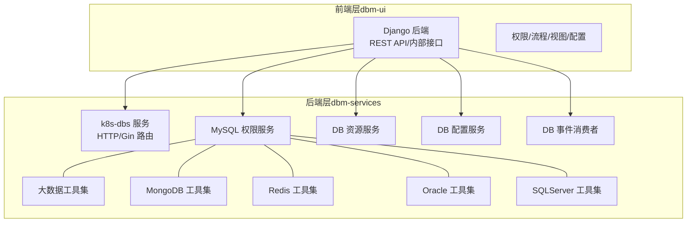
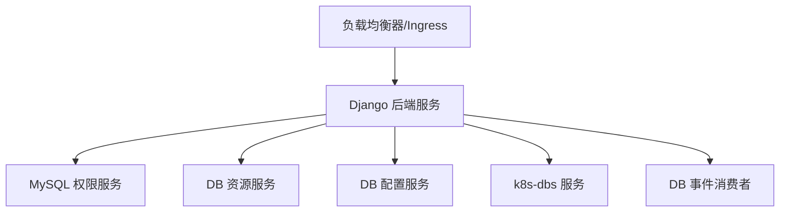
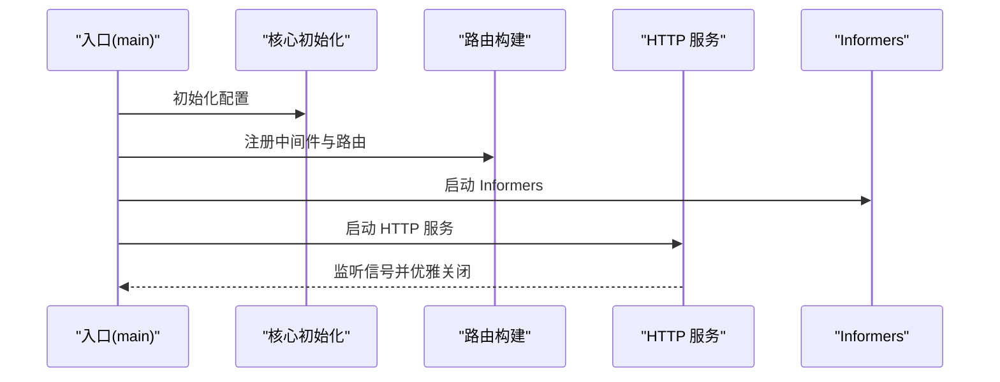
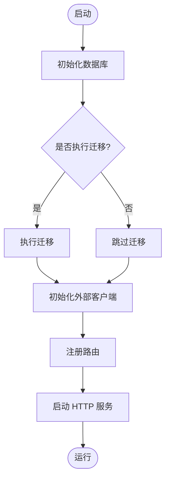
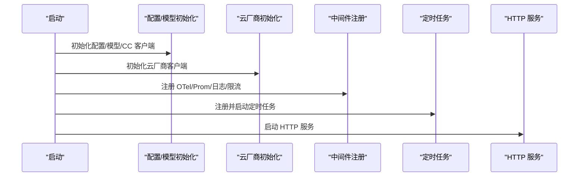
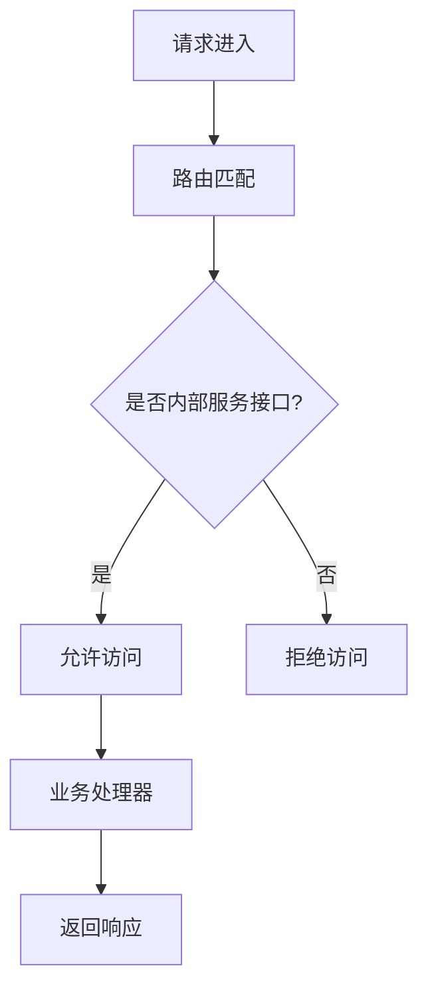
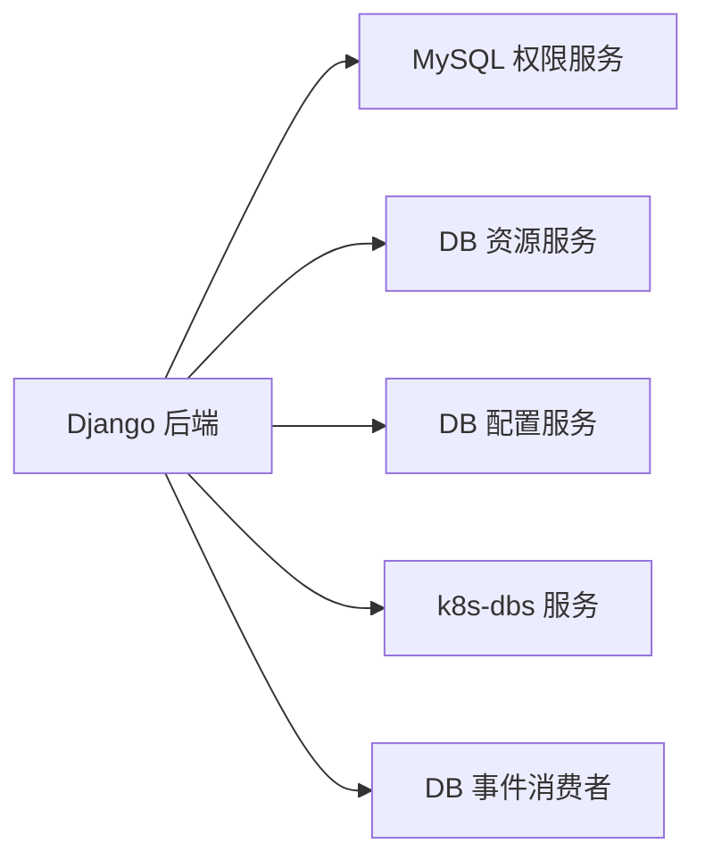

# 微服务架构设计

<cite>
**本文引用的文件**
- [readme.md](file://readme.md)
- [server.go](file://dbm-services/k8s-dbs/cmd/server.go)
- [router.go](file://dbm-services/k8s-dbs/router/router.go)
- [main.go](file://dbm-services/common/db-resource/main.go)
- [main.go](file://dbm-services/mysql/db-priv/main.go)
- [main.go](file://dbm-services/common/db-config/cmd/bkconfigsvr/main.go)
- [main.go](file://dbm-services/common/db-event-consumer/main.go)
- [urls.py](file://dbm-ui/backend/db_meta/urls.py)
- [Chart.yaml](file://helm-charts/bk-dbm/Chart.yaml)
- [values.yaml](file://helm-charts/bk-dbm/values.yaml)
</cite>

## 目录
1. [引言](#引言)
2. [项目结构](#项目结构)
3. [核心组件](#核心组件)
4. [架构总览](#架构总览)
5. [详细组件分析](#详细组件分析)
6. [依赖关系分析](#依赖关系分析)
7. [性能考虑](#性能考虑)
8. [故障排查指南](#故障排查指南)
9. [结论](#结论)
10. [附录](#附录)

## 引言
本文件为 DBM（数据库管理）项目的微服务架构设计文档，聚焦于服务拆分原则、服务边界与职责分配，Go 语言服务层（dbm-services）与 Python/Django 服务层（dbm-ui）的架构设计，服务间通信机制（HTTP REST API、WebSocket、内部 RPC），服务注册与发现、负载均衡与故障转移策略，服务依赖关系与拓扑结构，以及部署策略、容器化与扩缩容机制。本文旨在帮助读者从整体到细节全面理解 DBM 的微服务体系。

## 项目结构
DBM 采用前后端分离的双层架构：
- Go 语言后端（dbm-services）：以独立可执行微服务为主，围绕数据库类型与能力域拆分，提供 HTTP API、定时任务、事件消费、资源编排等能力。
- Python/Django 前端（dbm-ui）：以 Web 后端服务为主，提供统一的 REST API、内部服务接口、权限与流程编排、数据视图与监控对接等。

下图展示 DBM 项目的核心模块与层次关系：

图表来源
- [server.go:48-78](file://dbm-services/k8s-dbs/cmd/server.go#L48-L78)
- [router.go:47-54](file://dbm-services/k8s-dbs/router/router.go#L47-L54)
- [main.go:46-109](file://dbm-services/common/db-resource/main.go#L46-L109)
- [main.go:29-79](file://dbm-services/mysql/db-priv/main.go#L29-L79)
- [main.go:43-85](file://dbm-services/common/db-config/cmd/bkconfigsvr/main.go#L43-L85)
- [main.go:15-17](file://dbm-services/common/db-event-consumer/main.go#L15-L17)
- [urls.py:18-76](file://dbm-ui/backend/db_meta/urls.py#L18-L76)

章节来源
- [readme.md:11-21](file://readme.md#L11-L21)

## 核心组件
- k8s-dbs 服务：基于 Gin 的 HTTP 服务，提供统一的 REST API 路由与健康检查、指标暴露，作为集群与拓扑相关能力的统一入口。
- MySQL 权限服务：提供权限管理、账号与授权相关的 API，支持迁移与配置加载。
- DB 资源服务：提供资源编排、云厂商对接、LLM 分析、定时任务等能力。
- DB 配置服务：提供配置中心能力，支持 Swagger UI、跨域与请求链路追踪。
- DB 事件消费者：消费事件并驱动内部流程或状态更新。
- 大数据/数据库工具集：按数据库类型拆分的工具与守护进程集合，支撑部署、监控、巡检等。

章节来源
- [server.go:48-78](file://dbm-services/k8s-dbs/cmd/server.go#L48-L78)
- [router.go:47-54](file://dbm-services/k8s-dbs/router/router.go#L47-L54)
- [main.go:46-109](file://dbm-services/common/db-resource/main.go#L46-L109)
- [main.go:29-79](file://dbm-services/mysql/db-priv/main.go#L29-L79)
- [main.go:43-85](file://dbm-services/common/db-config/cmd/bkconfigsvr/main.go#L43-L85)
- [main.go:15-17](file://dbm-services/common/db-event-consumer/main.go#L15-L17)

## 架构总览
DBM 的微服务架构遵循“按领域与数据库类型拆分”的原则，结合 Go 与 Python 的技术栈优势：
- Go 层负责高性能、高并发的 API 服务与工具链，强调可观测性（APM/Tracing/Metrics）、优雅停机与中间件生态。
- Django 层负责业务编排、权限治理、流程引擎与内部服务接口，强调模块化与可扩展性。

服务间通信机制：
- HTTP REST API：所有对外与对内 API 基于 HTTP，统一路径前缀与中间件链路。
- WebSocket：用于实时通知与长连接场景（具体实现以各服务为准）。
- 内部 RPC/HTTP 调用：服务间通过 HTTP 调用或内部路由转发，配合鉴权与限流。

服务注册与发现、负载均衡与故障转移：
- 服务注册与发现：通过 Kubernetes Service 与命名空间隔离实现服务发现；也可结合外部注册中心（如 Consul/Nacos）。
- 负载均衡：Kubernetes Service ClusterIP/LoadBalancer 实现流量分发。
- 故障转移：Pod 重启策略、探针（Liveness/Readiness）、多副本与滚动升级。

部署策略、容器化与扩缩容：
- Helm Charts：提供标准化的部署模板与 Values 配置，便于多环境管理与版本化发布。
- 扩缩容：基于副本数与 HPA（水平自动伸缩）策略，结合 CPU/内存与自定义指标。

图表来源
- [urls.py:18-76](file://dbm-ui/backend/db_meta/urls.py#L18-L76)
- [server.go:82-108](file://dbm-services/k8s-dbs/cmd/server.go#L82-L108)
- [router.go:47-54](file://dbm-services/k8s-dbs/router/router.go#L47-L54)

## 详细组件分析

### k8s-dbs 服务（Go）
- 入口与启动：主函数初始化核心配置、注册中间件、构建路由、启动 Informers，并以 HTTP 服务方式运行，支持优雅关闭。
- 路由与指标：统一的 API 基础路径，内置健康检查与 Prometheus 指标端点。
- 中间件：日志、认证、限流、链路追踪与指标采集。

图表来源
- [server.go:48-78](file://dbm-services/k8s-dbs/cmd/server.go#L48-L78)
- [server.go:82-108](file://dbm-services/k8s-dbs/cmd/server.go#L82-L108)
- [router.go:47-54](file://dbm-services/k8s-dbs/router/router.go#L47-L54)

章节来源
- [server.go:48-108](file://dbm-services/k8s-dbs/cmd/server.go#L48-L108)
- [router.go:47-54](file://dbm-services/k8s-dbs/router/router.go#L47-L54)

### MySQL 权限服务（Go）
- 功能定位：提供权限与账号管理 API，支持数据库迁移、外部服务客户端初始化、链路追踪与指标。
- 启动流程：初始化数据库、可选执行迁移、注册路由、启动 HTTP 服务。

图表来源
- [main.go:29-79](file://dbm-services/mysql/db-priv/main.go#L29-L79)
- [main.go:102-117](file://dbm-services/mysql/db-priv/main.go#L102-L117)

章节来源
- [main.go:29-79](file://dbm-services/mysql/db-priv/main.go#L29-L79)

### DB 资源服务（Go）
- 功能定位：资源编排、云厂商对接、LLM 分析、定时任务与可观测性中间件。
- 启动流程：初始化日志、配置、模型与云厂商客户端，注册路由与 pprof、OTel、Prometheus 中间件，启动 HTTP 服务与 Cron。

图表来源
- [main.go:112-124](file://dbm-services/common/db-resource/main.go#L112-L124)
- [main.go:165-222](file://dbm-services/common/db-resource/main.go#L165-L222)
- [main.go:73-109](file://dbm-services/common/db-resource/main.go#L73-L109)

章节来源
- [main.go:112-124](file://dbm-services/common/db-resource/main.go#L112-L124)
- [main.go:165-222](file://dbm-services/common/db-resource/main.go#L165-L222)
- [main.go:73-109](file://dbm-services/common/db-resource/main.go#L73-L109)

### DB 配置服务（Go）
- 功能定位：配置中心服务，支持 Swagger UI、跨域、请求链路追踪与指标。
- 启动流程：初始化数据库与缓存、可选执行迁移、注册路由与中间件、启动 HTTP 服务。

章节来源
- [main.go:43-85](file://dbm-services/common/db-config/cmd/bkconfigsvr/main.go#L43-L85)

### DB 事件消费者（Go）
- 功能定位：消费事件并驱动内部流程或状态更新。
- 启动流程：入口调用命令执行器。

章节来源
- [main.go:15-17](file://dbm-services/common/db-event-consumer/main.go#L15-L17)

### Django 后端（dbm-ui）
- 功能定位：提供统一的 REST API、内部服务接口、权限与流程编排、数据视图与监控对接。
- 内部服务接口：通过路由限定仅供内部服务（如 dbha/dbpriv）访问，确保安全边界。

图表来源
- [urls.py:18-76](file://dbm-ui/backend/db_meta/urls.py#L18-L76)

章节来源
- [urls.py:18-76](file://dbm-ui/backend/db_meta/urls.py#L18-L76)

## 依赖关系分析
- 组件耦合：前端 Django 服务通过 HTTP 调用后端 Go 服务；后端服务之间通过 HTTP 或共享数据库/缓存耦合；部分服务存在定时任务与外部云厂商/第三方组件依赖。
- 依赖可视化：

图表来源
- [urls.py:18-76](file://dbm-ui/backend/db_meta/urls.py#L18-L76)
- [server.go:82-108](file://dbm-services/k8s-dbs/cmd/server.go#L82-L108)

章节来源
- [urls.py:18-76](file://dbm-ui/backend/db_meta/urls.py#L18-L76)

## 性能考虑
- 中间件与可观测性：统一启用链路追踪与指标采集，便于定位性能瓶颈。
- 优雅停机与超时：HTTP 服务设置合理的 Read/Write/Idle 超时，支持优雅关闭。
- 定时任务与并发：合理配置 Cron 任务与并发度，避免对主业务造成抖动。
- 负载均衡与副本：通过多副本与 HPA 实现弹性伸缩，结合探针保障健康实例比例。

## 故障排查指南
- 日志与链路：启用 OTel 与日志中间件，结合请求 ID 快速定位问题。
- 健康检查：通过健康检查端点与指标端点快速判断服务状态。
- 优雅关闭：确保信号处理与超时控制，避免强制中断导致的数据不一致。
- 内部接口访问控制：严格限制内部服务接口的访问范围，防止越权与误调用。

章节来源
- [server.go:82-108](file://dbm-services/k8s-dbs/cmd/server.go#L82-L108)
- [router.go:52-54](file://dbm-services/k8s-dbs/router/router.go#L52-L54)
- [urls.py:18-76](file://dbm-ui/backend/db_meta/urls.py#L18-L76)

## 结论
DBM 的微服务架构以“领域与数据库类型”为核心拆分原则，结合 Go 与 Python 的技术栈优势，实现了高内聚、低耦合的服务体系。通过统一的 HTTP API、可观测性中间件与容器化部署，DBM 能够在多数据库场景下提供稳定、可扩展、易维护的数据库全生命周期管理能力。

## 附录
- Helm 部署：使用 Helm Charts 管理多环境与版本化发布，Values 文件用于差异化配置。
- 服务拓扑：前端 Django 服务作为统一入口，后端按领域拆分为多个独立服务，形成清晰的调用拓扑。

章节来源
- [Chart.yaml](file://helm-charts/bk-dbm/Chart.yaml)
- [values.yaml](file://helm-charts/bk-dbm/values.yaml)