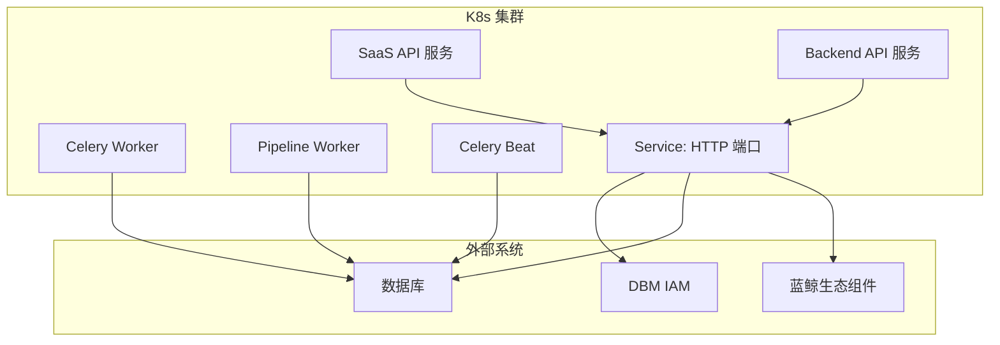
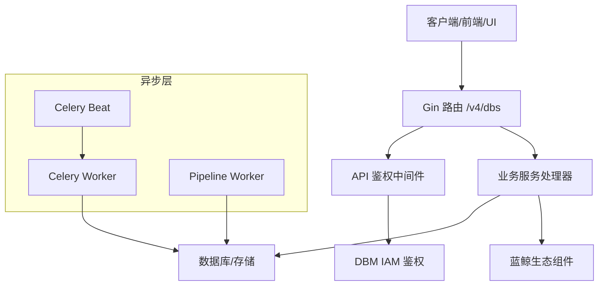
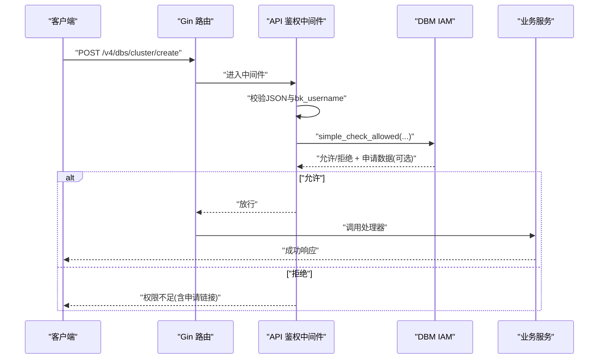
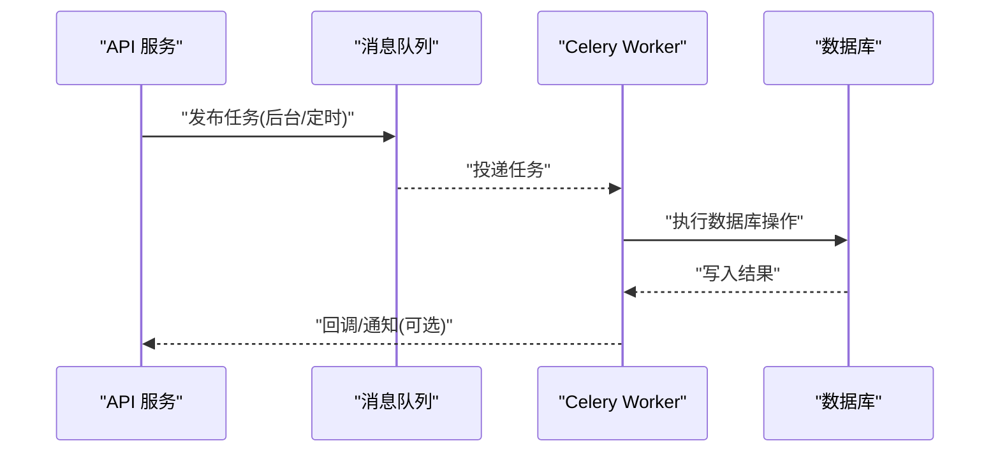
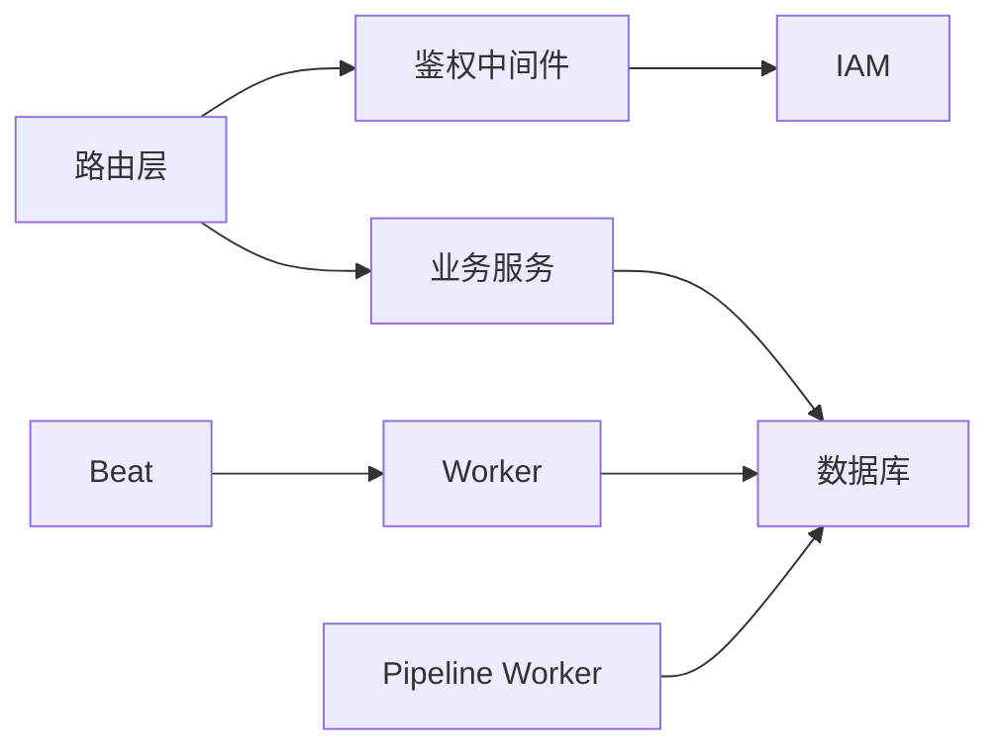

# 服务间通信机制

<cite>
**本文引用的文件**   
- [router.go](file://dbm-services/k8s-dbs/router/router.go)
- [api_auth_middleware.go](file://dbm-services/k8s-dbs/middleware/api_auth_middleware.go)
- [api_auth_middleware_test.go](file://dbm-services/k8s-dbs/middleware/api_auth_middleware_test.go)
- [metric_factory.go](file://dbm-services/k8s-dbs/metric/metric_factory.go)
- [celery-worker.yaml](file://helm-charts/bk-dbm/charts/dbm/templates/deployments/celery/celery-worker.yaml)
- [pipeline-worker.yaml](file://helm-charts/bk-dbm/charts/dbm/templates/deployments/celery/pipeline-worker.yaml)
- [celery-beater.yaml](file://helm-charts/bk-dbm/charts/dbm/templates/deployments/celery/celery-beater.yaml)
- [db-celery-service-configmap.yaml](file://helm-charts/bk-dbm/templates/configmaps/db-celery-service-configmap.yaml)
- [values.yaml](file://helm-charts/bk-dbm/charts/dbm/values.yaml)
- [saas-api.yaml](file://helm-charts/bk-dbm/charts/dbm/templates/deployments/saas-api/saas-api.yaml)
- [backend-api.yaml](file://helm-charts/bk-dbm/charts/dbm/templates/deployments/backend-api/backend-api.yaml)
- [service.yaml](file://helm-charts/bk-dbm/charts/db-dns-api/templates/service.yaml)
- [service.yaml](file://helm-charts/bk-dbm/charts/hadb-api/templates/service.yaml)
</cite>

## 目录
1. [引言](#引言)
2. [项目结构](#项目结构)
3. [核心组件](#核心组件)
4. [架构总览](#架构总览)
5. [详细组件分析](#详细组件分析)
6. [依赖分析](#依赖分析)
7. [性能考量](#性能考量)
8. [故障排查指南](#故障排查指南)
9. [结论](#结论)
10. [附录](#附录)

## 引言
本文件面向DBM（蓝鲸智云-数据库管理）项目的微服务通信机制，系统性梳理服务间通信协议与模式，覆盖同步调用（HTTP REST）、异步消息传递（Celery任务队列）与实时通信（WebSocket）现状与扩展建议；同时文档化内部服务接口设计、外部系统集成接口（蓝鲸生态），以及认证授权、API版本管理、错误处理策略、通信安全、性能优化与监控方案。

## 项目结构
DBM采用多模块分层组织，核心通信载体包括：
- Web API层：基于Gin框架的HTTP REST服务，暴露统一的/v4/dbs基础路径，提供健康检查、指标导出与业务API。
- 中间件层：统一鉴权中间件对接DBM IAM能力，支持业务级与实例级权限控制。
- 异步任务层：基于Celery的Worker/Pipeline Worker/Beat部署，支撑后台任务与定时任务。
- 外部系统集成：通过ConfigMap注入DB连接信息，对接蓝鲸生态组件（如DBM IAM、DB资源、事件消费等）。
- Kubernetes服务暴露：通过Service将API容器端口暴露为集群内可访问的网络入口。

图表来源
- [saas-api.yaml:39-62](file://helm-charts/bk-dbm/charts/dbm/templates/deployments/saas-api/saas-api.yaml#L39-L62)
- [backend-api.yaml:34-55](file://helm-charts/bk-dbm/charts/dbm/templates/deployments/backend-api/backend-api.yaml#L34-L55)
- [celery-worker.yaml:1-62](file://helm-charts/bk-dbm/charts/dbm/templates/deployments/celery/celery-worker.yaml#L1-L62)
- [pipeline-worker.yaml:36-62](file://helm-charts/bk-dbm/charts/dbm/templates/deployments/celery/pipeline-worker.yaml#L36-L62)
- [celery-beater.yaml:1-59](file://helm-charts/bk-dbm/charts/dbm/templates/deployments/celery/celery-beater.yaml#L1-L59)
- [service.yaml:1-16](file://helm-charts/bk-dbm/charts/db-dns-api/templates/service.yaml#L1-L16)

章节来源
- [router.go:33-54](file://dbm-services/k8s-dbs/router/router.go#L33-L54)
- [values.yaml:25-77](file://helm-charts/bk-dbm/charts/dbm/values.yaml#L25-L77)

## 核心组件
- HTTP REST API网关与路由
  - 统一基础路径“/v4/dbs”，内置健康检查与Prometheus指标端点。
  - 通过Gin Engine构建路由组，集中注册业务路由与监控端点。
- 认证授权中间件
  - 对POST类非GET请求进行鉴权拦截，要求请求体包含bk_username；对未知API或GET请求放行。
  - 支持Addon级操作与集群实例级操作两类鉴权路径，自动解析集群类型并映射到对应action_id。
  - 远程IAM调用失败与本地解析失败分别返回不同错误码，确保可观测性与可诊断性。
- 异步任务系统
  - Celery Worker：通用后台任务执行，限制单任务生命周期与每进程任务数，保障稳定性。
  - Pipeline Worker：特定队列（er_execute、er_schedule）专用，支持优先级与时间限制。
  - Celery Beat：周期性任务调度器，配合Worker执行定时任务。
  - 通过ConfigMap注入数据库连接信息，确保Worker与Beat具备一致的后端数据源。
- 外部系统集成
  - 通过Service暴露HTTP端口，结合蓝鲸生态组件域名与凭证完成跨系统调用。
  - 通过环境变量与ConfigMap注入DB连接参数，避免硬编码。

章节来源
- [router.go:33-54](file://dbm-services/k8s-dbs/router/router.go#L33-L54)
- [api_auth_middleware.go:29-95](file://dbm-services/k8s-dbs/middleware/api_auth_middleware.go#L29-L95)
- [api_auth_middleware.go:97-154](file://dbm-services/k8s-dbs/middleware/api_auth_middleware.go#L97-L154)
- [api_auth_middleware.go:156-183](file://dbm-services/k8s-dbs/middleware/api_auth_middleware.go#L156-L183)
- [celery-worker.yaml:41-46](file://helm-charts/bk-dbm/charts/dbm/templates/deployments/celery/celery-worker.yaml#L41-L46)
- [pipeline-worker.yaml:41-46](file://helm-charts/bk-dbm/charts/dbm/templates/deployments/celery/pipeline-worker.yaml#L41-L46)
- [celery-beater.yaml:38-42](file://helm-charts/bk-dbm/charts/dbm/templates/deployments/celery/celery-beater.yaml#L38-L42)
- [db-celery-service-configmap.yaml:11-24](file://helm-charts/bk-dbm/templates/configmaps/db-celery-service-configmap.yaml#L11-L24)

## 架构总览
下图展示DBM服务间通信的整体视图：HTTP REST作为主要同步调用通道，Celery异步队列承载后台与定时任务，Prometheus指标端点用于运行时观测，IAM与DB作为外部依赖。

图表来源
- [router.go:47-54](file://dbm-services/k8s-dbs/router/router.go#L47-L54)
- [api_auth_middleware.go:36-95](file://dbm-services/k8s-dbs/middleware/api_auth_middleware.go#L36-L95)
- [celery-worker.yaml:36-46](file://helm-charts/bk-dbm/charts/dbm/templates/deployments/celery/celery-worker.yaml#L36-L46)
- [pipeline-worker.yaml:36-46](file://helm-charts/bk-dbm/charts/dbm/templates/deployments/celery/pipeline-worker.yaml#L36-L46)
- [celery-beater.yaml:33-42](file://helm-charts/bk-dbm/charts/dbm/templates/deployments/celery/celery-beater.yaml#L33-L42)

## 详细组件分析

### HTTP REST 同步调用流程
- 路由与健康检查
  - 基础路径“/v4/dbs”下注册健康检查与Prometheus指标端点，便于探针与监控。
- 鉴权拦截
  - 对POST类请求强制校验请求体JSON合法性与bk_username字段；GET请求与未知路径直接放行。
  - 鉴权失败时区分本地解析错误与远程IAM错误，返回不同错误码以指导修复。
- 典型调用序列

图表来源
- [router.go:47-54](file://dbm-services/k8s-dbs/router/router.go#L47-L54)
- [api_auth_middleware.go:36-95](file://dbm-services/k8s-dbs/middleware/api_auth_middleware.go#L36-L95)
- [api_auth_middleware.go:97-154](file://dbm-services/k8s-dbs/middleware/api_auth_middleware.go#L97-L154)

章节来源
- [router.go:33-54](file://dbm-services/k8s-dbs/router/router.go#L33-L54)
- [api_auth_middleware.go:29-95](file://dbm-services/k8s-dbs/middleware/api_auth_middleware.go#L29-L95)
- [api_auth_middleware_test.go:179-326](file://dbm-services/k8s-dbs/middleware/api_auth_middleware_test.go#L179-L326)

### 异步消息传递（Celery 任务队列）
- Worker与队列
  - 通用Worker：执行通用后台任务，限制单任务超时与每进程任务数，提升稳定性。
  - Pipeline Worker：绑定专用队列（er_execute、er_schedule），支持优先级与时间限制。
  - Beat：负责周期性任务调度，配合Worker执行定时任务。
- 数据库连接
  - 通过ConfigMap注入DB连接信息（名称、地址、用户名、密码），确保Worker/Beat与API共享一致的数据源。
- 典型调用序列

图表来源
- [celery-worker.yaml:41-46](file://helm-charts/bk-dbm/charts/dbm/templates/deployments/celery/celery-worker.yaml#L41-L46)
- [pipeline-worker.yaml:41-46](file://helm-charts/bk-dbm/charts/dbm/templates/deployments/celery/pipeline-worker.yaml#L41-L46)
- [celery-beater.yaml:38-42](file://helm-charts/bk-dbm/charts/dbm/templates/deployments/celery/celery-beater.yaml#L38-L42)
- [db-celery-service-configmap.yaml:11-24](file://helm-charts/bk-dbm/templates/configmaps/db-celery-service-configmap.yaml#L11-L24)

章节来源
- [celery-worker.yaml:1-62](file://helm-charts/bk-dbm/charts/dbm/templates/deployments/celery/celery-worker.yaml#L1-L62)
- [pipeline-worker.yaml:36-62](file://helm-charts/bk-dbm/charts/dbm/templates/deployments/celery/pipeline-worker.yaml#L36-L62)
- [celery-beater.yaml:1-59](file://helm-charts/bk-dbm/charts/dbm/templates/deployments/celery/celery-beater.yaml#L1-L59)
- [db-celery-service-configmap.yaml:1-24](file://helm-charts/bk-dbm/templates/configmaps/db-celery-service-configmap.yaml#L1-L24)

### 实时通信（WebSocket）
- 当前状态
  - 仓库中未发现WebSocket服务端或客户端实现；HTTP REST与Celery异步队列是当前主要通信方式。
- 扩展建议
  - 若需引入实时通信，可在现有Gin引擎上接入WebSocket路由，并复用鉴权中间件进行会话校验。
  - 建议结合Kafka或Redis Pub/Sub作为消息桥接，实现跨服务事件广播与订阅。

[本节为概念性说明，不直接分析具体文件]

### 内部服务接口设计
- 路由与版本
  - 基础路径“/v4/dbs”作为API版本前缀，便于后续演进与兼容。
  - 健康检查与指标端点统一暴露，便于运维与自动化。
- 鉴权与资源映射
  - 鉴权中间件根据API名映射到具体action_id，支持Addon级与实例级两种资源模型。
  - 通过集群类型解析器自动识别资源上下文，减少调用方心智负担。

章节来源
- [router.go:33-54](file://dbm-services/k8s-dbs/router/router.go#L33-L54)
- [api_auth_middleware.go:97-154](file://dbm-services/k8s-dbs/middleware/api_auth_middleware.go#L97-L154)

### 外部系统集成接口（蓝鲸生态）
- DBM IAM
  - 通过simple_check_allowed进行细粒度权限校验，支持业务级与实例级资源。
- DB资源与事件
  - 通过Service暴露HTTP端口，结合ConfigMap注入DB连接参数，实现跨模块共享。
- DNS/HADB等子服务
  - 子Chart通过Service将API端口暴露为集群内可访问的网络入口，便于统一接入。

章节来源
- [api_auth_middleware.go:21-27](file://dbm-services/k8s-dbs/middleware/api_auth_middleware.go#L21-L27)
- [service.yaml:1-16](file://helm-charts/bk-dbm/charts/db-dns-api/templates/service.yaml#L1-L16)
- [service.yaml:1-15](file://helm-charts/bk-dbm/charts/hadb-api/templates/service.yaml#L1-L15)

### 认证授权机制
- 鉴权流程
  - GET请求与未知路径放行；POST请求强制校验JSON与bk_username。
  - 解析集群类型并映射action_id，支持Addon固定action_id与实例级动态映射。
  - 远程IAM错误与本地解析错误区分处理，返回不同错误码。
- 测试覆盖
  - 单元测试覆盖未知API跳过、解析错误、创建/删除场景、Addon鉴权、非法JSON等边界条件。

章节来源
- [api_auth_middleware.go:36-95](file://dbm-services/k8s-dbs/middleware/api_auth_middleware.go#L36-L95)
- [api_auth_middleware.go:97-154](file://dbm-services/k8s-dbs/middleware/api_auth_middleware.go#L97-L154)
- [api_auth_middleware_test.go:69-177](file://dbm-services/k8s-dbs/middleware/api_auth_middleware_test.go#L69-L177)
- [api_auth_middleware_test.go:179-326](file://dbm-services/k8s-dbs/middleware/api_auth_middleware_test.go#L179-L326)
- [api_auth_middleware_test.go:364-424](file://dbm-services/k8s-dbs/middleware/api_auth_middleware_test.go#L364-L424)

### API 版本管理
- 版本前缀
  - “/v4/dbs”作为当前版本前缀，后续可通过新增前缀（如/v5）实现平滑迁移。
- 兼容策略
  - 保留旧接口一段时间，逐步引导调用方迁移至新版本；变更时通过注释与发布日志明确升级路径。

章节来源
- [router.go:33-33](file://dbm-services/k8s-dbs/router/router.go#L33-L33)

### 错误处理策略
- 参数校验
  - 非法JSON与缺失bk_username返回参数错误；本地解析失败与远程IAM失败返回不同错误码。
- 权限拒绝
  - 返回包含申请链接与权限信息的结构，便于用户自助申请。
- 测试验证
  - 单测覆盖多种错误分支，确保响应一致性与可观测性。

章节来源
- [api_auth_middleware.go:47-94](file://dbm-services/k8s-dbs/middleware/api_auth_middleware.go#L47-L94)
- [api_auth_middleware_test.go:223-326](file://dbm-services/k8s-dbs/middleware/api_auth_middleware_test.go#L223-L326)

## 依赖分析
- 组件耦合
  - 路由层与中间件层低耦合，便于独立演进；业务服务通过统一鉴权入口接入。
  - Celery Worker/Beat与API共享ConfigMap注入的DB连接，降低配置漂移风险。
- 外部依赖
  - IAM与数据库为关键外部依赖，需关注可用性与延迟；建议在中间件层增加降级策略与重试机制。

图表来源
- [router.go:47-54](file://dbm-services/k8s-dbs/router/router.go#L47-L54)
- [api_auth_middleware.go:36-95](file://dbm-services/k8s-dbs/middleware/api_auth_middleware.go#L36-L95)
- [celery-worker.yaml:36-46](file://helm-charts/bk-dbm/charts/dbm/templates/deployments/celery/celery-worker.yaml#L36-L46)
- [pipeline-worker.yaml:36-46](file://helm-charts/bk-dbm/charts/dbm/templates/deployments/celery/pipeline-worker.yaml#L36-L46)
- [celery-beater.yaml:33-42](file://helm-charts/bk-dbm/charts/dbm/templates/deployments/celery/celery-beater.yaml#L33-L42)

## 性能考量
- HTTP服务
  - Gunicorn工作进程数与超时配置可调；建议结合负载与峰值流量进行压测与调优。
  - 通过HPA（已定义）实现Worker/Beat的弹性伸缩，避免资源浪费。
- 异步任务
  - Worker并发与任务超时参数需平衡吞吐与稳定性；Pipeline Worker队列隔离可提升关键任务优先级。
  - 通过Prefetch与时间限制控制内存占用与长尾任务影响。
- 指标与监控
  - 暴露Prometheus指标端点，结合Grafana看板进行趋势分析与告警。

章节来源
- [values.yaml:34-77](file://helm-charts/bk-dbm/charts/dbm/values.yaml#L34-L77)
- [saas-api.yaml:39-62](file://helm-charts/bk-dbm/charts/dbm/templates/deployments/saas-api/saas-api.yaml#L39-L62)
- [backend-api.yaml:34-55](file://helm-charts/bk-dbm/charts/dbm/templates/deployments/backend-api/backend-api.yaml#L34-L55)
- [celery-worker.yaml:41-46](file://helm-charts/bk-dbm/charts/dbm/templates/deployments/celery/celery-worker.yaml#L41-L46)
- [pipeline-worker.yaml:41-46](file://helm-charts/bk-dbm/charts/dbm/templates/deployments/celery/pipeline-worker.yaml#L41-L46)
- [router.go:52-53](file://dbm-services/k8s-dbs/router/router.go#L52-L53)

## 故障排查指南
- 鉴权失败
  - 检查请求体是否包含合法JSON与bk_username；确认API名是否在映射表中。
  - 若IAM不可达，查看中间件日志中的错误分类，区分本地解析与远程调用问题。
- Worker/Beat异常
  - 查看容器日志与HPA状态；核对ConfigMap中的DB连接参数是否正确。
- 指标与健康
  - 通过“/ping”与“/metrics”端点快速判断服务健康与运行状态。

章节来源
- [api_auth_middleware.go:47-94](file://dbm-services/k8s-dbs/middleware/api_auth_middleware.go#L47-L94)
- [api_auth_middleware_test.go:179-326](file://dbm-services/k8s-dbs/middleware/api_auth_middleware_test.go#L179-L326)
- [db-celery-service-configmap.yaml:11-24](file://helm-charts/bk-dbm/templates/configmaps/db-celery-service-configmap.yaml#L11-L24)
- [router.go:50-53](file://dbm-services/k8s-dbs/router/router.go#L50-L53)

## 结论
DBM当前以HTTP REST为主、Celery异步为辅的混合通信架构，配合统一鉴权中间件与Prometheus指标端点，满足了蓝鲸生态下的权限治理与可观测性需求。未来可在保持REST主干的同时，按需引入WebSocket实现实时交互；并通过版本前缀与渐进式迁移策略持续演进API体系。

## 附录
- 关键路径参考
  - 路由与健康检查：[router.go:47-54](file://dbm-services/k8s-dbs/router/router.go#L47-L54)
  - 鉴权中间件实现：[api_auth_middleware.go:36-95](file://dbm-services/k8s-dbs/middleware/api_auth_middleware.go#L36-L95)
  - 鉴权逻辑细节：[api_auth_middleware.go:97-154](file://dbm-services/k8s-dbs/middleware/api_auth_middleware.go#L97-L154)
  - Addon鉴权与环境变量：[api_auth_middleware.go:156-183](file://dbm-services/k8s-dbs/middleware/api_auth_middleware.go#L156-L183)
  - Celery Worker配置：[celery-worker.yaml:41-46](file://helm-charts/bk-dbm/charts/dbm/templates/deployments/celery/celery-worker.yaml#L41-L46)
  - Pipeline Worker配置：[pipeline-worker.yaml:41-46](file://helm-charts/bk-dbm/charts/dbm/templates/deployments/celery/pipeline-worker.yaml#L41-L46)
  - Celery Beat配置：[celery-beater.yaml:38-42](file://helm-charts/bk-dbm/charts/dbm/templates/deployments/celery/celery-beater.yaml#L38-L42)
  - DB连接注入：[db-celery-service-configmap.yaml:11-24](file://helm-charts/bk-dbm/templates/configmaps/db-celery-service-configmap.yaml#L11-L24)
  - API服务部署（SaaS）：[saas-api.yaml:39-62](file://helm-charts/bk-dbm/charts/dbm/templates/deployments/saas-api/saas-api.yaml#L39-L62)
  - API服务部署（Backend）：[backend-api.yaml:34-55](file://helm-charts/bk-dbm/charts/dbm/templates/deployments/backend-api/backend-api.yaml#L34-L55)
  - Service暴露（DNS）：[service.yaml:1-16](file://helm-charts/bk-dbm/charts/db-dns-api/templates/service.yaml#L1-L16)
  - Service暴露（HADB）：[service.yaml:1-15](file://helm-charts/bk-dbm/charts/hadb-api/templates/service.yaml#L1-L15)