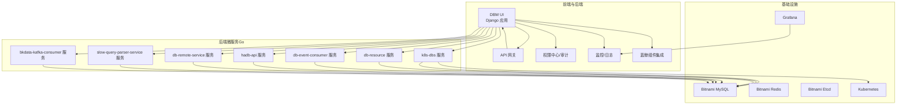
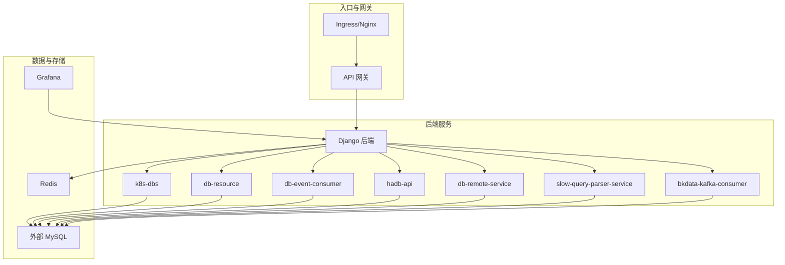
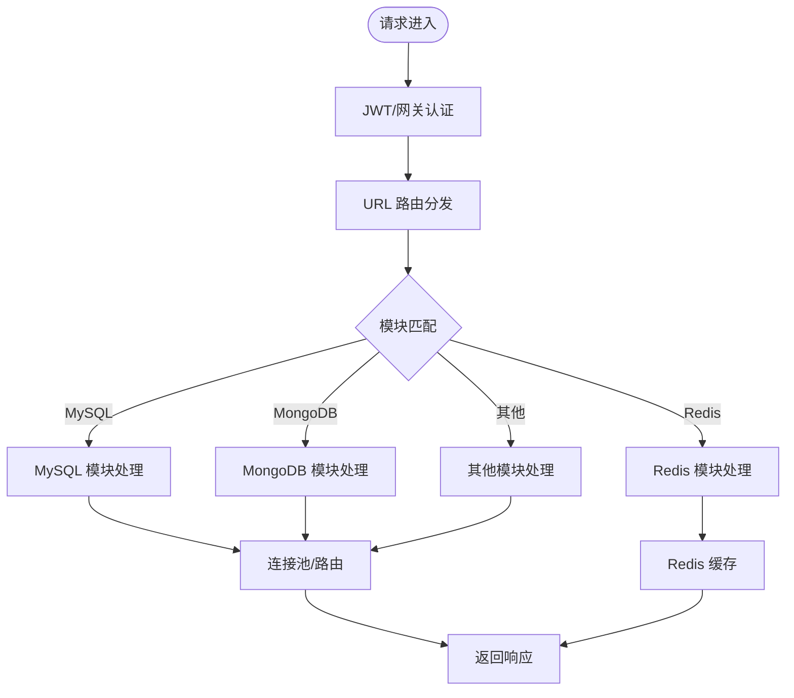
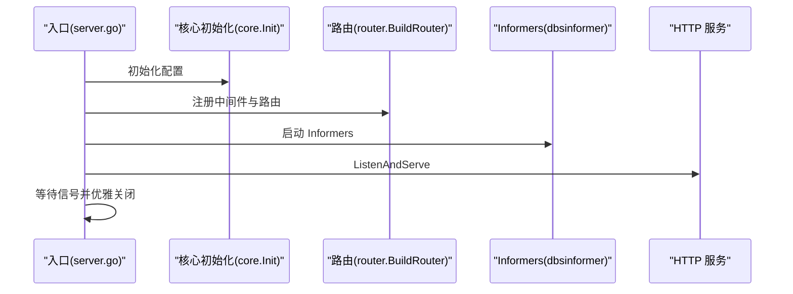
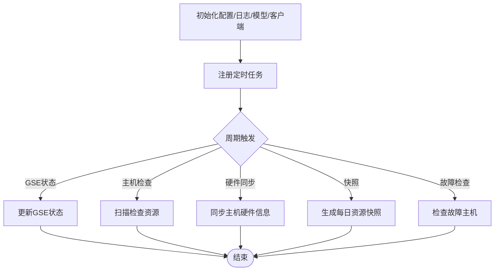
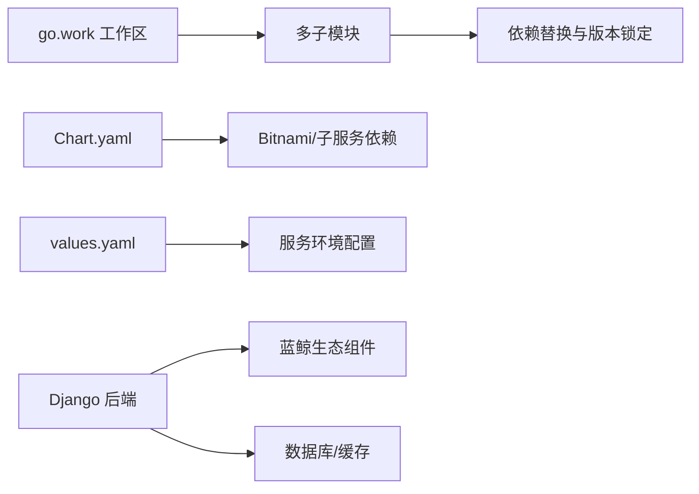

# 架构设计

<cite>
**本文引用的文件**
- [readme.md](file://readme.md)
- [build.yml](file://build.yml)
- [dbm-ui/manage.py](file://dbm-ui/manage.py)
- [dbm-ui/backend/urls.py](file://dbm-ui/backend/urls.py)
- [dbm-ui/config/default.py](file://dbm-ui/config/default.py)
- [dbm-services/go.work](file://dbm-services/go.work)
- [helm-charts/bk-dbm/Chart.yaml](file://helm-charts/bk-dbm/Chart.yaml)
- [helm-charts/bk-dbm/values.yaml](file://helm-charts/bk-dbm/values.yaml)
- [dbm-services/k8s-dbs/cmd/server.go](file://dbm-services/k8s-dbs/cmd/server.go)
- [dbm-services/common/db-resource/main.go](file://dbm-services/common/db-resource/main.go)
- [dbm-services/common/db-event-consumer/main.go](file://dbm-services/common/db-event-consumer/main.go)
- [dbm-services/common/dbha/hadb-api/main.go](file://dbm-services/common/dbha/hadb-api/main.go)
</cite>

## 目录
1. [引言](#引言)
2. [项目结构](#项目结构)
3. [核心组件](#核心组件)
4. [架构总览](#架构总览)
5. [详细组件分析](#详细组件分析)
6. [依赖分析](#依赖分析)
7. [性能考量](#性能考量)
8. [故障排查指南](#故障排查指南)
9. [结论](#结论)
10. [附录](#附录)

## 引言
本架构设计文档面向 DBM（数据库管理）平台，系统性阐述其高层设计、架构模式与系统边界。DBM 采用微服务架构，围绕多数据库（MySQL、Redis、MongoDB、Oracle、SQLServer、大数据组件等）的全生命周期管理，提供统一的 SaaS 化前端与后端服务，结合蓝鲸生态（权限、网关、监控、作业平台、制品库等），实现高可用、可观测、可扩展的数据库运维能力。本文重点覆盖：
- 微服务架构与服务间通信机制
- 数据流设计与集成模式
- 技术决策、权衡与约束
- 基础设施需求、可扩展性与部署拓扑
- 安全性、监控与灾难恢复等横切关注点
- 技术栈、第三方依赖与版本兼容性

## 项目结构
DBM 仓库采用“前后端分离 + 多语言微服务”的组织方式：
- 前端与后端（Python/Django）位于 dbm-ui 目录，提供统一的 Web 门户、API 网关对接、权限与审计、任务编排、监控与报表等能力。
- 后端微服务（Go）位于 dbm-services 目录，涵盖各数据库工具链、HA、资源管理、事件消费、备份消费、慢查询解析、K8s 管理等子系统。
- Helm Charts 位于 helm-charts，提供一键部署与配置管理，整合蓝鲸生态组件与外部依赖（MySQL、Redis、Etcd、Grafana 等）。

图表来源
- [helm-charts/bk-dbm/Chart.yaml:1-108](file://helm-charts/bk-dbm/Chart.yaml#L1-L108)
- [helm-charts/bk-dbm/values.yaml:1-792](file://helm-charts/bk-dbm/values.yaml#L1-L792)
- [dbm-ui/backend/urls.py:35-91](file://dbm-ui/backend/urls.py#L35-L91)
- [dbm-services/k8s-dbs/cmd/server.go:53-77](file://dbm-services/k8s-dbs/cmd/server.go#L53-L77)
- [dbm-services/common/db-resource/main.go:46-109](file://dbm-services/common/db-resource/main.go#L46-L109)

章节来源
- [readme.md:11-28](file://readme.md#L11-L28)
- [helm-charts/bk-dbm/Chart.yaml:1-108](file://helm-charts/bk-dbm/Chart.yaml#L1-L108)
- [helm-charts/bk-dbm/values.yaml:1-792](file://helm-charts/bk-dbm/values.yaml#L1-L792)

## 核心组件
- 前端与后端（Django）
  - 提供统一门户、API 路由聚合、权限与审计、任务编排、监控与报表、文件存储与制品库集成。
  - 关键特性：多数据库模块化路由、Celery 定时任务、OpenTelemetry APM、跨域与安全中间件、数据库连接池与路由。
- 微服务（Go）
  - k8s-dbs：Kubernetes 集群与对象管理、路由与 Informer 启动。
  - db-resource：资源管理、云厂商适配、LLM 分析、定时任务。
  - db-event-consumer：Kafka 事件消费、模型映射与目标库写入。
  - hadb-api：高可用数据库 API，配置驱动启动。
  - 其他：db-remote-service、slow-query-parser-service、bkdata-kafka-consumer 等。

章节来源
- [dbm-ui/backend/urls.py:35-91](file://dbm-ui/backend/urls.py#L35-L91)
- [dbm-ui/config/default.py:227-286](file://dbm-ui/config/default.py#L227-L286)
- [dbm-services/k8s-dbs/cmd/server.go:53-77](file://dbm-services/k8s-dbs/cmd/server.go#L53-L77)
- [dbm-services/common/db-resource/main.go:46-109](file://dbm-services/common/db-resource/main.go#L46-L109)
- [dbm-services/common/db-event-consumer/main.go:15-17](file://dbm-services/common/db-event-consumer/main.go#L15-L17)
- [dbm-services/common/dbha/hadb-api/main.go:19-41](file://dbm-services/common/dbha/hadb-api/main.go#L19-L41)

## 架构总览
DBM 采用“前端 SaaS + 后端微服务 + Helm 部署 + 蓝鲸生态”的整体架构：
- 前端通过 API 网关统一接入，后端按领域拆分微服务，服务间通过 HTTP/REST 与内部网关域名互通。
- 数据层采用外部 MySQL（或内置 Bitnami MySQL）与 Redis 缓存；部分服务内置 Grafana 作为可视化。
- 部署通过 Helm Charts 将所有子服务与依赖打包，支持多环境与多集群部署。

图表来源
- [helm-charts/bk-dbm/values.yaml:135-177](file://helm-charts/bk-dbm/values.yaml#L135-L177)
- [helm-charts/bk-dbm/values.yaml:180-195](file://helm-charts/bk-dbm/values.yaml#L180-L195)
- [dbm-ui/backend/urls.py:35-91](file://dbm-ui/backend/urls.py#L35-L91)

## 详细组件分析

### 组件一：前端与后端（Django）
- 路由与模块化
  - 后端通过统一的 URL 聚合，按数据库类型与功能划分模块路由，便于扩展与维护。
- 数据库与缓存
  - 使用连接池与多库路由，支持报告与统计库分离，提升查询隔离与性能。
- 安全与中间件
  - CORS、安全响应头、JWT 与 API 网关认证、白名单与 CSRF 配置。
- APM 与可观测
  - OpenTelemetry Trace 与 Prometheus 指标，支持 Celery 与 Web 请求指标上报。
- 文件存储与制品库
  - 支持本地文件系统与蓝鲸制品库，满足包与介质管理需求。

图表来源
- [dbm-ui/backend/urls.py:35-91](file://dbm-ui/backend/urls.py#L35-L91)
- [dbm-ui/config/default.py:227-286](file://dbm-ui/config/default.py#L227-L286)

章节来源
- [dbm-ui/manage.py:10-23](file://dbm-ui/manage.py#L10-L23)
- [dbm-ui/backend/urls.py:35-91](file://dbm-ui/backend/urls.py#L35-L91)
- [dbm-ui/config/default.py:159-193](file://dbm-ui/config/default.py#L159-L193)
- [dbm-ui/config/default.py:227-286](file://dbm-ui/config/default.py#L227-L286)

### 组件二：k8s-dbs（Go）
- 启动流程
  - 初始化配置、注册中间件、构建路由、启动 Informer、启动 HTTP 服务并优雅关闭。
- 能力范围
  - Kubernetes 资源管理、路由与控制器、指标与日志中间件。

图表来源
- [dbm-services/k8s-dbs/cmd/server.go:53-77](file://dbm-services/k8s-dbs/cmd/server.go#L53-L77)

章节来源
- [dbm-services/k8s-dbs/cmd/server.go:53-77](file://dbm-services/k8s-dbs/cmd/server.go#L53-L77)

### 组件三：db-resource（Go）
- 能力范围
  - 资源管理、云厂商适配、LLM 分析器、定时任务（GSE 状态、主机检查、硬件同步、快照生成、故障主机检查）。
- 安全与可观测
  - pprof、OTEL Trace、Prometheus 指标、安全响应头、请求体大小限制、日志中间件。

图表来源
- [dbm-services/common/db-resource/main.go:165-222](file://dbm-services/common/db-resource/main.go#L165-L222)

章节来源
- [dbm-services/common/db-resource/main.go:46-109](file://dbm-services/common/db-resource/main.go#L46-L109)
- [dbm-services/common/db-resource/main.go:165-222](file://dbm-services/common/db-resource/main.go#L165-L222)

### 组件四：db-event-consumer（Go）
- 能力范围
  - Kafka 事件消费、模型表映射、严格 Schema、数据源配置、从开头/增量消费策略。
- 集成点
  - 与后端报告库对接，实现事件到表的落库。

章节来源
- [dbm-services/common/db-event-consumer/main.go:15-17](file://dbm-services/common/db-event-consumer/main.go#L15-L17)
- [helm-charts/bk-dbm/values.yaml:561-601](file://helm-charts/bk-dbm/values.yaml#L561-L601)

### 组件五：hadb-api（Go）
- 能力范围
  - 高可用数据库 API，配置驱动启动、日志与模型初始化、命令入口。
- 集成点
  - 与 MySQL 数据库交互，提供 HA 相关接口。

章节来源
- [dbm-services/common/dbha/hadb-api/main.go:19-41](file://dbm-services/common/dbha/hadb-api/main.go#L19-L41)

## 依赖分析
- Go 工作区（go.work）
  - 聚合多子模块，统一替换依赖版本，确保一致性与可复现构建。
- Helm 依赖
  - Chart.yaml 声明依赖 Bitnami MySQL/Redis/Etcd 与 Grafana，以及各子服务 Chart。
- 前后端依赖
  - Django 后端依赖蓝鲸生态组件（权限、网关、监控、作业平台、制品库）、数据库连接池、缓存、APM。

图表来源
- [dbm-services/go.work:1-47](file://dbm-services/go.work#L1-L47)
- [helm-charts/bk-dbm/Chart.yaml:1-108](file://helm-charts/bk-dbm/Chart.yaml#L1-L108)
- [helm-charts/bk-dbm/values.yaml:1-792](file://helm-charts/bk-dbm/values.yaml#L1-L792)
- [dbm-ui/config/default.py:78-149](file://dbm-ui/config/default.py#L78-L149)

章节来源
- [dbm-services/go.work:1-47](file://dbm-services/go.work#L1-L47)
- [helm-charts/bk-dbm/Chart.yaml:1-108](file://helm-charts/bk-dbm/Chart.yaml#L1-L108)
- [helm-charts/bk-dbm/values.yaml:1-792](file://helm-charts/bk-dbm/values.yaml#L1-L792)
- [dbm-ui/config/default.py:78-149](file://dbm-ui/config/default.py#L78-L149)

## 性能考量
- 连接池与路由
  - Django 后端使用连接池与多库路由，降低热点与锁竞争，提升并发吞吐。
- 缓存与异步
  - Redis 缓存热点数据，Celery 异步任务处理耗时操作，减少请求延迟。
- APM 与指标
  - OpenTelemetry 与 Prometheus 指标，辅助定位慢调用与资源瓶颈。
- 部署弹性
  - Helm Chart 支持副本数与资源限制配置，结合 Ingress 与负载均衡实现横向扩展。

## 故障排查指南
- 日志与追踪
  - 前端与后端均配置结构化日志与请求 ID，便于端到端追踪。
- 优雅关闭
  - Go 服务统一使用信号处理与超时优雅关闭，避免数据丢失与连接异常中断。
- 数据库与缓存
  - 检查连接池配置、最大溢出与回收周期；确认缓存序列化与客户端参数。
- 事件消费
  - 核对 Kafka Broker、认证信息、Topic 映射与严格 Schema 设置。

章节来源
- [dbm-services/k8s-dbs/cmd/server.go:80-109](file://dbm-services/k8s-dbs/cmd/server.go#L80-L109)
- [dbm-services/common/db-resource/main.go:73-109](file://dbm-services/common/db-resource/main.go#L73-L109)
- [dbm-ui/config/default.py:489-540](file://dbm-ui/config/default.py#L489-L540)

## 结论
DBM 通过“前端 SaaS + 后端微服务 + Helm 部署 + 蓝鲸生态”的架构，实现了对多数据库与大数据组件的全生命周期管理。微服务之间以 HTTP/REST 与内部网关域名协同，结合连接池、缓存与 APM，保障高可用与可观测。Helm Charts 提供标准化部署与配置，便于在多环境与多集群中快速复制。未来可在以下方面持续演进：服务网格与 mTLS、事件驱动与流式计算、AI 辅助运维与自动化决策、灾备与跨地域复制。

## 附录

### 技术栈与版本兼容性
- 前端与后端
  - Python/Django、DRF、Celery、OpenTelemetry、Gunicorn、Whitenoise、Django-extensions、MySQL 连接池。
- 微服务（Go）
  - Gin、Cron、OTEL、Prometheus、pprof、Viper、Robfig Cron。
- 基础设施
  - Bitnami MySQL/Redis/Etcd、Grafana、Kubernetes、Helm。
- 蓝鲸生态
  - 权限中心、API 网关、监控、作业平台、制品库、节点管理、通知。

章节来源
- [build.yml:1-29](file://build.yml#L1-L29)
- [dbm-ui/config/default.py:105-109](file://dbm-ui/config/default.py#L105-L109)
- [dbm-services/go.work:1-47](file://dbm-services/go.work#L1-L47)
- [helm-charts/bk-dbm/Chart.yaml:1-108](file://helm-charts/bk-dbm/Chart.yaml#L1-L108)