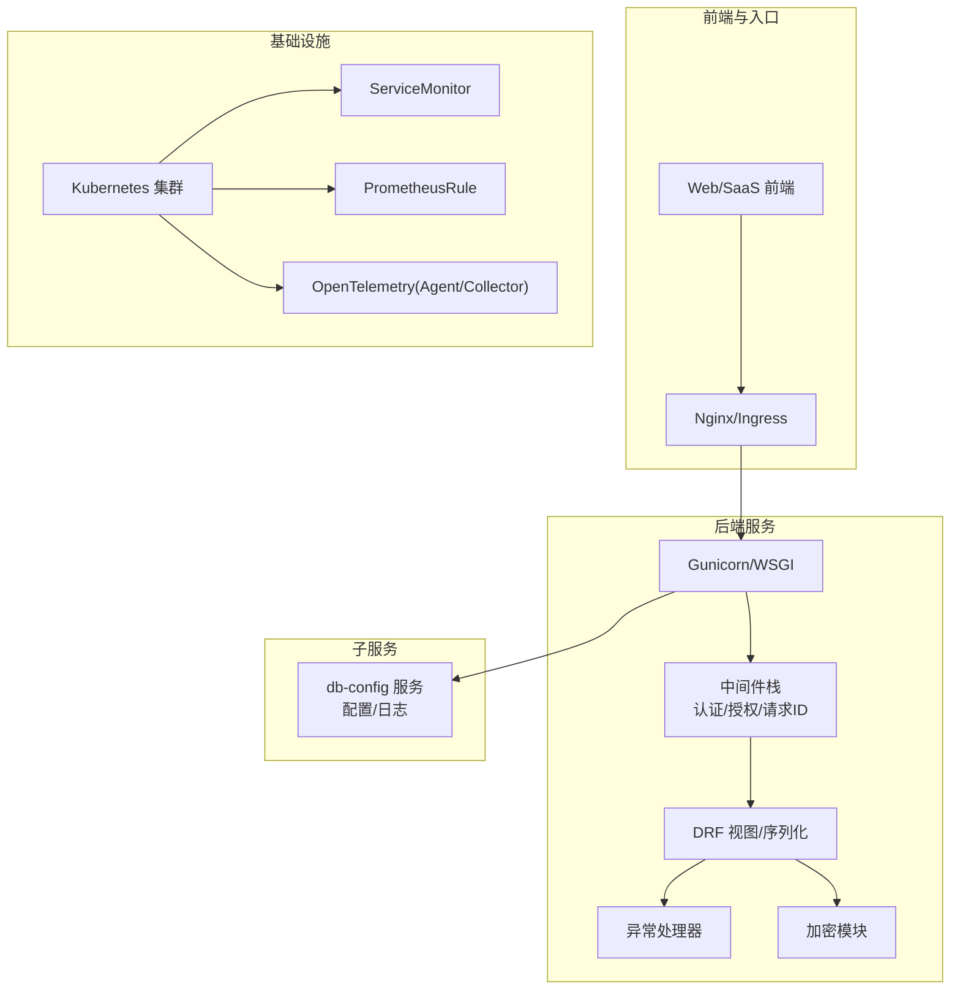
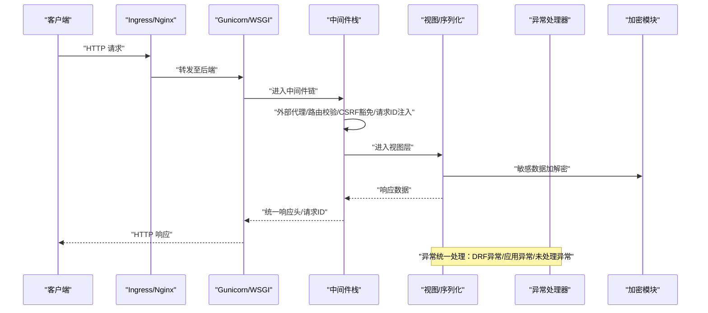
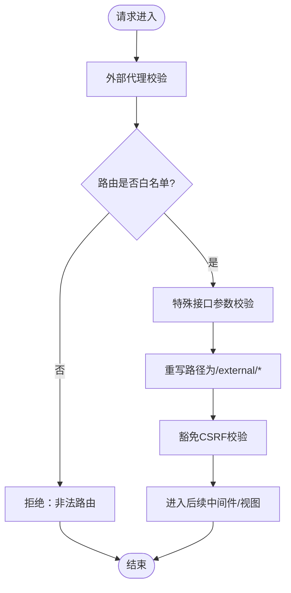
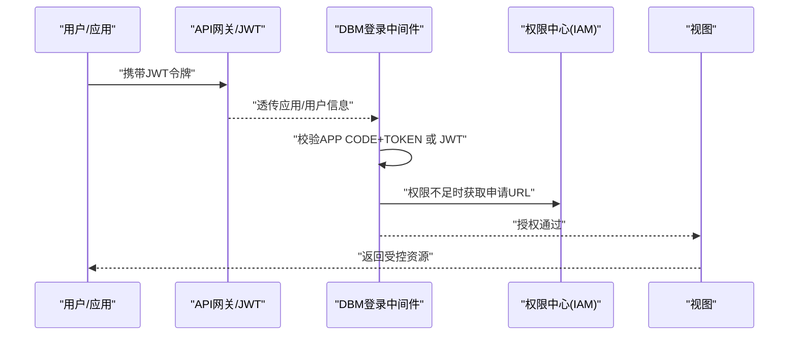
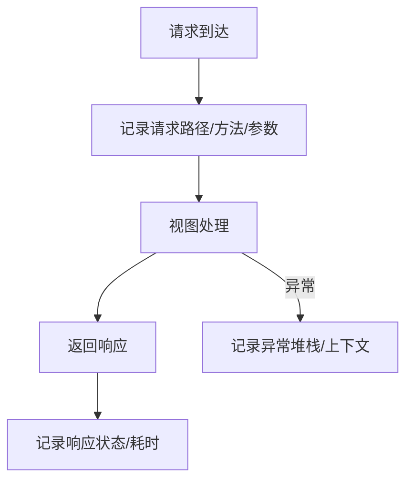
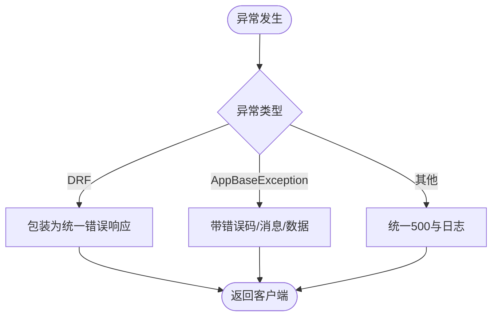
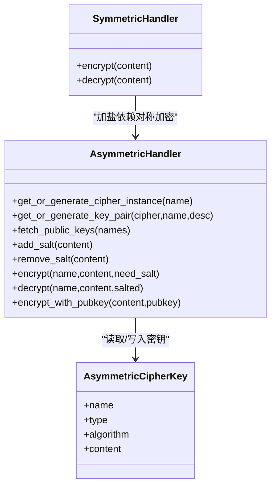
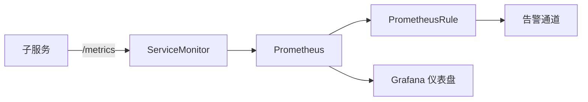
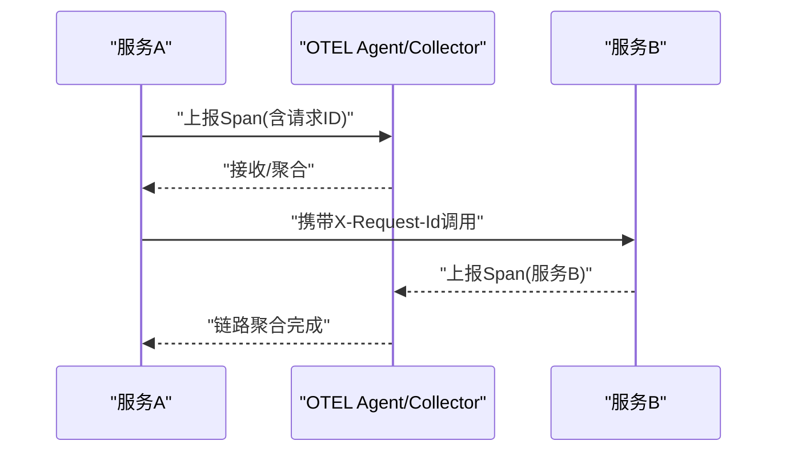
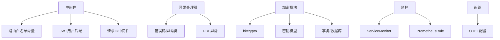

# 横切关注点

<cite>
**本文引用的文件**
- [dbm-ui/backend/bk_web/middleware.py](file://dbm-ui/backend/bk_web/middleware.py)
- [dbm-ui/config/default.py](file://dbm-ui/config/default.py)
- [dbm-ui/backend/bk_web/handlers.py](file://dbm-ui/backend/bk_web/handlers.py)
- [dbm-ui/backend/exceptions.py](file://dbm-ui/backend/exceptions.py)
- [dbm-ui/backend/core/encrypt/handlers.py](file://dbm-ui/backend/core/encrypt/handlers.py)
- [dbm-ui/backend/core/encrypt/__init__.py](file://dbm-ui/backend/core/encrypt/__init__.py)
- [dbm-services/common/db-config/conf/config.yaml](file://dbm-services/common/db-config/conf/config.yaml)
- [dbm-services/common/db-config/conf/logger.yaml](file://dbm-services/common/db-config/conf/logger.yaml)
- [helm-charts/bk-dbm/values.yaml](file://helm-charts/bk-dbm/values.yaml)
- [helm-charts/bk-dbm/charts/dbconfig/templates/servicemonitor.yaml](file://helm-charts/bk-dbm/charts/dbconfig/templates/servicemonitor.yaml)
- [helm-charts/bk-dbm/charts/db-simulation/templates/servicemonitor.yaml](file://helm-charts/bk-dbm/charts/db-simulation/templates/servicemonitor.yaml)
- [helm-charts/bk-dbm/charts/grafana/templates/prometheusrules.yaml](file://helm-charts/bk-dbm/charts/grafana/templates/prometheusrules.yaml)
- [dbm-ui/scripts/batch_sync_alarm_policy_field.py](file://dbm-ui/scripts/batch_sync_alarm_policy_field.py)
- [dbm-ui/scripts/version_log_auto_sync.py](file://dbm-ui/scripts/version_log_auto_sync.py)
- [dbm-ui/backend/version_log/migrations/0001_initial.py](file://dbm-ui/backend/version_log/migrations/0001_initial.py)
- [dbm-ui/backend/bk_web/constants.py](file://dbm-ui/backend/bk_web/constants.py)
- [helm-charts/bk-dbm/charts/dbm/templates/deployments/backend-api/backend-api.yaml](file://helm-charts/bk-dbm/charts/dbm/templates/deployments/backend-api/backend-api.yaml)
- [helm-charts/bk-dbm/charts/dbm/templates/deployments/saas-api/saas-api.yaml](file://helm-charts/bk-dbm/charts/dbm/templates/deployments/saas-api/saas-api.yaml)
- [dbm-ui/bin/pytest.sh](file://dbm-ui/bin/pytest.sh)
- [dbm-ui/scripts/ci/code_quality.sh](file://dbm-ui/scripts/ci/code_quality.sh)
</cite>

## 目录
1. [引言](#引言)
2. [项目结构](#项目结构)
3. [核心组件](#核心组件)
4. [架构总览](#架构总览)
5. [详细组件分析](#详细组件分析)
6. [依赖关系分析](#依赖关系分析)
7. [性能考量](#性能考量)
8. [故障排查指南](#故障排查指南)
9. [结论](#结论)
10. [附录](#附录)

## 引言
本文件聚焦DBM项目的横切关注点，覆盖认证授权、日志记录、监控告警、错误处理与性能优化，并系统阐述中间件架构（请求拦截、响应处理、异常捕获）、安全机制（数据加密、访问控制、审计日志）、监控指标与告警规则、分布式追踪与链路监控、以及配置管理与版本维护策略。文档面向技术与非技术读者，力求以渐进方式呈现复杂主题。

## 项目结构
DBM由前后端与多子服务构成，横切能力主要分布在：
- Django后端：中间件栈、异常处理、加密模块、配置与日志
- Helm Charts：服务监控、探活健康检查、指标暴露
- 子服务：如db-config提供独立配置与日志示例
- 脚本：告警策略同步、版本日志同步、CI质量脚本

图表来源
- [dbm-ui/config/default.py:158-193](file://dbm-ui/config/default.py#L158-L193)
- [dbm-ui/backend/bk_web/middleware.py:41-241](file://dbm-ui/backend/bk_web/middleware.py#L41-L241)
- [dbm-ui/backend/bk_web/handlers.py:25-94](file://dbm-ui/backend/bk_web/handlers.py#L25-L94)
- [dbm-ui/backend/core/encrypt/handlers.py:29-216](file://dbm-ui/backend/core/encrypt/handlers.py#L29-L216)
- [helm-charts/bk-dbm/charts/dbconfig/templates/servicemonitor.yaml:1-21](file://helm-charts/bk-dbm/charts/dbconfig/templates/servicemonitor.yaml#L1-L21)
- [helm-charts/bk-dbm/charts/db-simulation/templates/servicemonitor.yaml:1-21](file://helm-charts/bk-dbm/charts/db-simulation/templates/servicemonitor.yaml#L1-L21)
- [helm-charts/bk-dbm/charts/grafana/templates/prometheusrules.yaml:1-24](file://helm-charts/bk-dbm/charts/grafana/templates/prometheusrules.yaml#L1-L24)

章节来源
- [dbm-ui/config/default.py:158-193](file://dbm-ui/config/default.py#L158-L193)
- [helm-charts/bk-dbm/values.yaml:1-200](file://helm-charts/bk-dbm/values.yaml#L1-L200)

## 核心组件
- 中间件栈：负责跨域、外部代理、JWT认证、请求ID注入、异常捕获与统一响应包装
- 异常处理：DRF异常与应用自定义异常的统一输出，含错误码、消息与上下文数据
- 加密模块：对称/非对称加密、密钥生成与持久化、加盐处理
- 日志与配置：Django日志、子服务日志与配置模板
- 监控与告警：ServiceMonitor指标暴露、PrometheusRule规则、Grafana仪表盘
- 分布式追踪：OTEL开关与服务侧环境变量
- 性能与稳定性：Gunicorn参数、连接池、健康探针

章节来源
- [dbm-ui/backend/bk_web/middleware.py:41-241](file://dbm-ui/backend/bk_web/middleware.py#L41-L241)
- [dbm-ui/backend/bk_web/handlers.py:25-94](file://dbm-ui/backend/bk_web/handlers.py#L25-L94)
- [dbm-ui/backend/exceptions.py:21-177](file://dbm-ui/backend/exceptions.py#L21-L177)
- [dbm-ui/backend/core/encrypt/handlers.py:29-216](file://dbm-ui/backend/core/encrypt/handlers.py#L29-L216)
- [dbm-services/common/db-config/conf/config.yaml:1-26](file://dbm-services/common/db-config/conf/config.yaml#L1-L26)
- [dbm-services/common/db-config/conf/logger.yaml:1-18](file://dbm-services/common/db-config/conf/logger.yaml#L1-L18)
- [helm-charts/bk-dbm/charts/dbconfig/templates/servicemonitor.yaml:1-21](file://helm-charts/bk-dbm/charts/dbconfig/templates/servicemonitor.yaml#L1-L21)
- [helm-charts/bk-dbm/charts/grafana/templates/prometheusrules.yaml:1-24](file://helm-charts/bk-dbm/charts/grafana/templates/prometheusrules.yaml#L1-L24)

## 架构总览
DBM的横切关注点通过“中间件-异常-加密-日志-监控-追踪”形成闭环：
- 认证授权：JWT与蓝鲸网关、登录中间件、权限中心对接
- 请求拦截：外部代理、路由白名单、参数校验、CSRF豁免
- 响应处理：统一错误码封装、登录态失效提示
- 异常捕获：DRF异常、应用自定义异常、未处理异常
- 安全机制：对称/非对称加密、密钥持久化、加盐策略
- 审计日志：BK-AUDIT格式化器
- 监控告警：ServiceMonitor暴露指标、PrometheusRule规则、Grafana仪表盘
- 分布式追踪：OTEL开关、服务名与端点配置
- 性能优化：Gunicorn并发与超时、连接池、健康探针

图表来源
- [dbm-ui/config/default.py:158-193](file://dbm-ui/config/default.py#L158-L193)
- [dbm-ui/backend/bk_web/middleware.py:41-241](file://dbm-ui/backend/bk_web/middleware.py#L41-L241)
- [dbm-ui/backend/bk_web/handlers.py:25-94](file://dbm-ui/backend/bk_web/handlers.py#L25-L94)
- [dbm-ui/backend/core/encrypt/handlers.py:29-216](file://dbm-ui/backend/core/encrypt/handlers.py#L29-L216)

## 详细组件分析

### 中间件架构设计
- 外部代理中间件：对外部路由进行白名单校验、参数校验、路径重写与CSRF豁免；对特殊接口（单据）进行白名单限制
- 登录中间件：支持APP CODE+APP TOKEN内调、JWT透传用户、匿名用户回退与超级用户授予
- 请求ID中间件：注入X-Request-Id并贯穿响应头，便于链路追踪
- 异常捕获：通过异常处理器统一包装错误码与消息

图表来源
- [dbm-ui/backend/bk_web/middleware.py:117-241](file://dbm-ui/backend/bk_web/middleware.py#L117-L241)
- [dbm-ui/backend/bk_web/constants.py:45-86](file://dbm-ui/backend/bk_web/constants.py#L45-L86)

章节来源
- [dbm-ui/backend/bk_web/middleware.py:41-241](file://dbm-ui/backend/bk_web/middleware.py#L41-L241)
- [dbm-ui/backend/bk_web/constants.py:45-86](file://dbm-ui/backend/bk_web/constants.py#L45-L86)

### 认证授权与访问控制
- JWT与网关认证：ApiGatewayJWTGeneric/App/User三类中间件，透传应用与用户信息
- 登录中间件扩展：支持内调APP CODE+TOKEN、JWT用户自动注册、匿名用户降级
- 权限中心：IAM集成，权限不足时构造申请URL
- 外部代理白名单：限定可转发的路由与单据类型，避免越权访问

图表来源
- [dbm-ui/config/default.py:166-187](file://dbm-ui/config/default.py#L166-L187)
- [dbm-ui/backend/bk_web/middleware.py:74-114](file://dbm-ui/backend/bk_web/middleware.py#L74-L114)
- [dbm-ui/backend/exceptions.py:147-171](file://dbm-ui/backend/exceptions.py#L147-L171)

章节来源
- [dbm-ui/config/default.py:166-187](file://dbm-ui/config/default.py#L166-L187)
- [dbm-ui/backend/bk_web/middleware.py:74-114](file://dbm-ui/backend/bk_web/middleware.py#L74-L114)
- [dbm-ui/backend/exceptions.py:147-171](file://dbm-ui/backend/exceptions.py#L147-L171)

### 日志记录与审计
- Django日志：统一异常日志输出、请求参数记录、未处理异常定位
- 子服务日志：db-config提供独立日志配置模板，支持输出目标、格式、轮转策略
- 审计日志：BK-AUDIT Formatter统一格式化，便于集中审计

图表来源
- [dbm-ui/backend/bk_web/handlers.py:25-94](file://dbm-ui/backend/bk_web/handlers.py#L25-L94)
- [dbm-services/common/db-config/conf/logger.yaml:1-18](file://dbm-services/common/db-config/conf/logger.yaml#L1-L18)
- [dbm-ui/config/default.py:335-338](file://dbm-ui/config/default.py#L335-L338)

章节来源
- [dbm-ui/backend/bk_web/handlers.py:25-94](file://dbm-ui/backend/bk_web/handlers.py#L25-L94)
- [dbm-services/common/db-config/conf/logger.yaml:1-18](file://dbm-services/common/db-config/conf/logger.yaml#L1-L18)
- [dbm-ui/config/default.py:335-338](file://dbm-ui/config/default.py#L335-L338)

### 错误处理与异常捕获
- DRF异常：序列化错误、认证失败、API异常统一包装
- 应用自定义异常：按模块/错误码分类，支持动态消息模板
- 未处理异常：DEBUG模式透传，生产环境统一500与错误日志

图表来源
- [dbm-ui/backend/bk_web/handlers.py:25-94](file://dbm-ui/backend/bk_web/handlers.py#L25-L94)
- [dbm-ui/backend/exceptions.py:21-177](file://dbm-ui/backend/exceptions.py#L21-L177)

章节来源
- [dbm-ui/backend/bk_web/handlers.py:25-94](file://dbm-ui/backend/bk_web/handlers.py#L25-L94)
- [dbm-ui/backend/exceptions.py:21-177](file://dbm-ui/backend/exceptions.py#L21-L177)

### 安全机制实现
- 对称加密：基于配置的对称算法实例，支持加密/解密
- 非对称加密：密钥池缓存、密钥生成与持久化、公钥查询、加盐处理
- 密钥管理：事务性创建私钥/公钥对，原子性写入数据库
- 数据加密：密码加盐后经对称加密，解密时去盐还原明文

图表来源
- [dbm-ui/backend/core/encrypt/handlers.py:29-216](file://dbm-ui/backend/core/encrypt/handlers.py#L29-L216)
- [dbm-ui/backend/core/encrypt/__init__.py:1-11](file://dbm-ui/backend/core/encrypt/__init__.py#L1-L11)

章节来源
- [dbm-ui/backend/core/encrypt/handlers.py:29-216](file://dbm-ui/backend/core/encrypt/handlers.py#L29-L216)
- [dbm-ui/backend/core/encrypt/__init__.py:1-11](file://dbm-ui/backend/core/encrypt/__init__.py#L1-L11)

### 监控指标体系与告警规则
- 指标暴露：ServiceMonitor在各子服务中暴露/metrics端点
- 告警规则：PrometheusRule集中管理，结合Grafana仪表盘
- 配置样例：db-config提供独立配置与日志模板，便于统一治理

图表来源
- [helm-charts/bk-dbm/charts/dbconfig/templates/servicemonitor.yaml:1-21](file://helm-charts/bk-dbm/charts/dbconfig/templates/servicemonitor.yaml#L1-L21)
- [helm-charts/bk-dbm/charts/db-simulation/templates/servicemonitor.yaml:1-21](file://helm-charts/bk-dbm/charts/db-simulation/templates/servicemonitor.yaml#L1-L21)
- [helm-charts/bk-dbm/charts/grafana/templates/prometheusrules.yaml:1-24](file://helm-charts/bk-dbm/charts/grafana/templates/prometheusrules.yaml#L1-L24)
- [dbm-services/common/db-config/conf/config.yaml:1-26](file://dbm-services/common/db-config/conf/config.yaml#L1-L26)

章节来源
- [helm-charts/bk-dbm/charts/dbconfig/templates/servicemonitor.yaml:1-21](file://helm-charts/bk-dbm/charts/dbconfig/templates/servicemonitor.yaml#L1-L21)
- [helm-charts/bk-dbm/charts/db-simulation/templates/servicemonitor.yaml:1-21](file://helm-charts/bk-dbm/charts/db-simulation/templates/servicemonitor.yaml#L1-L21)
- [helm-charts/bk-dbm/charts/grafana/templates/prometheusrules.yaml:1-24](file://helm-charts/bk-dbm/charts/grafana/templates/prometheusrules.yaml#L1-L24)
- [dbm-services/common/db-config/conf/config.yaml:1-26](file://dbm-services/common/db-config/conf/config.yaml#L1-L26)

### 分布式追踪与链路监控
- OTEL开关：通过配置启用/禁用DB访问trace
- 服务侧配置：各服务通过环境变量控制Trace服务名、端点、类型与令牌
- 链路标识：中间件注入X-Request-Id，便于跨服务关联

图表来源
- [dbm-ui/config/default.py:340-344](file://dbm-ui/config/default.py#L340-L344)
- [helm-charts/bk-dbm/values.yaml:441-447](file://helm-charts/bk-dbm/values.yaml#L441-L447)
- [dbm-ui/backend/bk_web/middleware.py:54-71](file://dbm-ui/backend/bk_web/middleware.py#L54-L71)

章节来源
- [dbm-ui/config/default.py:340-344](file://dbm-ui/config/default.py#L340-L344)
- [helm-charts/bk-dbm/values.yaml:441-447](file://helm-charts/bk-dbm/values.yaml#L441-L447)
- [dbm-ui/backend/bk_web/middleware.py:54-71](file://dbm-ui/backend/bk_web/middleware.py#L54-L71)

### 性能优化与稳定性
- Gunicorn参数：最大请求、抖动、超时、工作进程数、gevent
- 连接池：数据库连接池配置与回收策略
- 健康探针：存活/就绪探针路径与节拍
- 日志轮转：子服务日志大小、备份数与保留天数

章节来源
- [helm-charts/bk-dbm/charts/dbm/templates/deployments/backend-api/backend-api.yaml:40-44](file://helm-charts/bk-dbm/charts/dbm/templates/deployments/backend-api/backend-api.yaml#L40-L44)
- [helm-charts/bk-dbm/charts/dbm/templates/deployments/saas-api/saas-api.yaml:40-44](file://helm-charts/bk-dbm/charts/dbm/templates/deployments/saas-api/saas-api.yaml#L40-L44)
- [dbm-ui/config/default.py:229-286](file://dbm-ui/config/default.py#L229-L286)
- [dbm-services/common/db-config/conf/logger.yaml:1-18](file://dbm-services/common/db-config/conf/logger.yaml#L1-L18)

## 依赖关系分析
- 中间件依赖：外部代理依赖白名单常量；登录中间件依赖JWT与用户模型；异常处理器依赖错误码与DRF异常
- 加密模块依赖：bkcrypto对称/非对称算法、Django事务、数据库模型
- 监控依赖：ServiceMonitor选择器与端口、PrometheusRule规则组
- 追踪依赖：OTEL开关与服务环境变量

图表来源
- [dbm-ui/backend/bk_web/middleware.py:41-241](file://dbm-ui/backend/bk_web/middleware.py#L41-L241)
- [dbm-ui/backend/bk_web/constants.py:45-86](file://dbm-ui/backend/bk_web/constants.py#L45-L86)
- [dbm-ui/backend/bk_web/handlers.py:25-94](file://dbm-ui/backend/bk_web/handlers.py#L25-L94)
- [dbm-ui/backend/exceptions.py:21-177](file://dbm-ui/backend/exceptions.py#L21-L177)
- [dbm-ui/backend/core/encrypt/handlers.py:29-216](file://dbm-ui/backend/core/encrypt/handlers.py#L29-L216)
- [helm-charts/bk-dbm/charts/dbconfig/templates/servicemonitor.yaml:1-21](file://helm-charts/bk-dbm/charts/dbconfig/templates/servicemonitor.yaml#L1-L21)
- [helm-charts/bk-dbm/charts/grafana/templates/prometheusrules.yaml:1-24](file://helm-charts/bk-dbm/charts/grafana/templates/prometheusrules.yaml#L1-L24)
- [dbm-ui/config/default.py:340-344](file://dbm-ui/config/default.py#L340-L344)

章节来源
- [dbm-ui/backend/bk_web/middleware.py:41-241](file://dbm-ui/backend/bk_web/middleware.py#L41-L241)
- [dbm-ui/backend/bk_web/handlers.py:25-94](file://dbm-ui/backend/bk_web/handlers.py#L25-L94)
- [dbm-ui/backend/core/encrypt/handlers.py:29-216](file://dbm-ui/backend/core/encrypt/handlers.py#L29-L216)
- [helm-charts/bk-dbm/charts/dbconfig/templates/servicemonitor.yaml:1-21](file://helm-charts/bk-dbm/charts/dbconfig/templates/servicemonitor.yaml#L1-L21)
- [helm-charts/bk-dbm/charts/grafana/templates/prometheusrules.yaml:1-24](file://helm-charts/bk-dbm/charts/grafana/templates/prometheusrules.yaml#L1-L24)
- [dbm-ui/config/default.py:340-344](file://dbm-ui/config/default.py#L340-L344)

## 性能考量
- 并发与超时：Gunicorn工作进程数、最大请求与抖动、超时时间
- 连接池：数据库连接池大小、最大空闲/活跃、生命周期
- 健康探针：存活/就绪探针路径、初始延迟、周期与超时
- 日志轮转：单文件大小、备份数、保留天数，避免磁盘压力

章节来源
- [helm-charts/bk-dbm/charts/dbm/templates/deployments/backend-api/backend-api.yaml:40-44](file://helm-charts/bk-dbm/charts/dbm/templates/deployments/backend-api/backend-api.yaml#L40-L44)
- [helm-charts/bk-dbm/charts/dbm/templates/deployments/saas-api/saas-api.yaml:40-44](file://helm-charts/bk-dbm/charts/dbm/templates/deployments/saas-api/saas-api.yaml#L40-L44)
- [dbm-ui/config/default.py:229-286](file://dbm-ui/config/default.py#L229-L286)
- [dbm-services/common/db-config/conf/logger.yaml:1-18](file://dbm-services/common/db-config/conf/logger.yaml#L1-L18)

## 故障排查指南
- 异常定位：查看异常处理器日志，确认错误码与消息；区分DRF异常与应用自定义异常
- 认证问题：核对JWT中间件顺序、APP CODE+TOKEN配置、权限中心申请链接
- 外部代理：检查路由白名单与特殊接口参数校验，确认是否命中豁免逻辑
- 加密问题：核对密钥生成与持久化事务、加盐流程、对称/非对称算法配置
- 监控告警：确认ServiceMonitor端点、PrometheusRule规则、Grafana面板
- 追踪链路：核对X-Request-Id注入与OTEL配置，确保跨服务关联

章节来源
- [dbm-ui/backend/bk_web/handlers.py:25-94](file://dbm-ui/backend/bk_web/handlers.py#L25-L94)
- [dbm-ui/backend/exceptions.py:21-177](file://dbm-ui/backend/exceptions.py#L21-L177)
- [dbm-ui/backend/bk_web/middleware.py:117-241](file://dbm-ui/backend/bk_web/middleware.py#L117-L241)
- [dbm-ui/backend/core/encrypt/handlers.py:29-216](file://dbm-ui/backend/core/encrypt/handlers.py#L29-L216)
- [helm-charts/bk-dbm/charts/dbconfig/templates/servicemonitor.yaml:1-21](file://helm-charts/bk-dbm/charts/dbconfig/templates/servicemonitor.yaml#L1-L21)
- [helm-charts/bk-dbm/charts/grafana/templates/prometheusrules.yaml:1-24](file://helm-charts/bk-dbm/charts/grafana/templates/prometheusrules.yaml#L1-L24)

## 结论
DBM通过中间件栈实现统一的认证授权、请求拦截与异常处理；通过加密模块保障敏感数据安全；通过日志与审计实现可观测性；通过监控与告警体系实现自动化运维；通过OTEL与请求ID实现分布式追踪与链路监控；通过Gunicorn与连接池优化性能与稳定性。建议在生产环境中启用OTEL、完善告警规则、定期轮转日志并审查白名单与权限策略。

## 附录
- 配置管理：通过Helm Values与子服务配置模板集中管理；服务侧通过环境变量控制追踪与指标
- 版本控制：版本日志迁移表与同步脚本，确保变更可追溯
- 维护策略：CI质量脚本与单元测试覆盖率统计，保障发布质量

章节来源
- [helm-charts/bk-dbm/values.yaml:1-200](file://helm-charts/bk-dbm/values.yaml#L1-L200)
- [dbm-ui/scripts/version_log_auto_sync.py:1-30](file://dbm-ui/scripts/version_log_auto_sync.py#L1-L30)
- [dbm-ui/backend/version_log/migrations/0001_initial.py:1-37](file://dbm-ui/backend/version_log/migrations/0001_initial.py#L1-L37)
- [dbm-ui/bin/pytest.sh:1-7](file://dbm-ui/bin/pytest.sh#L1-L7)
- [dbm-ui/scripts/ci/code_quality.sh:1-61](file://dbm-ui/scripts/ci/code_quality.sh#L1-L61)