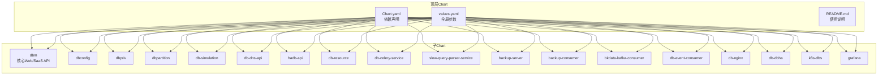
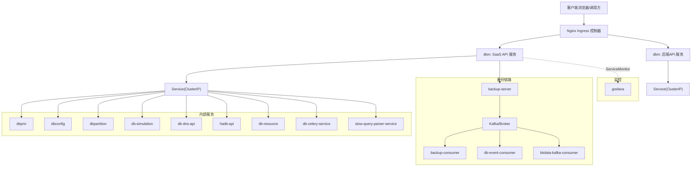
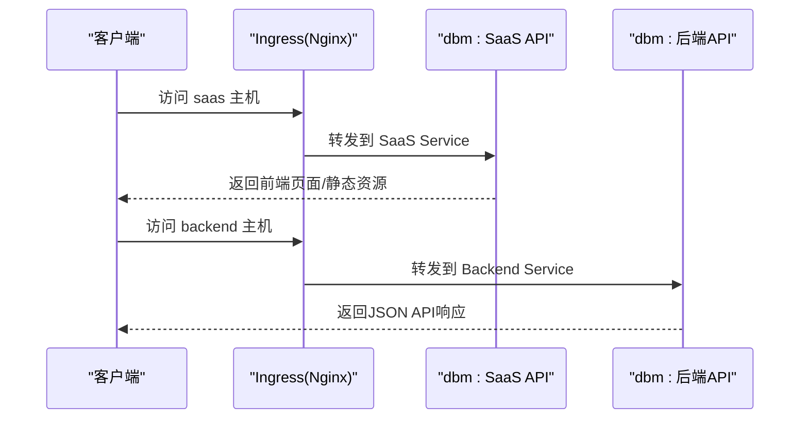
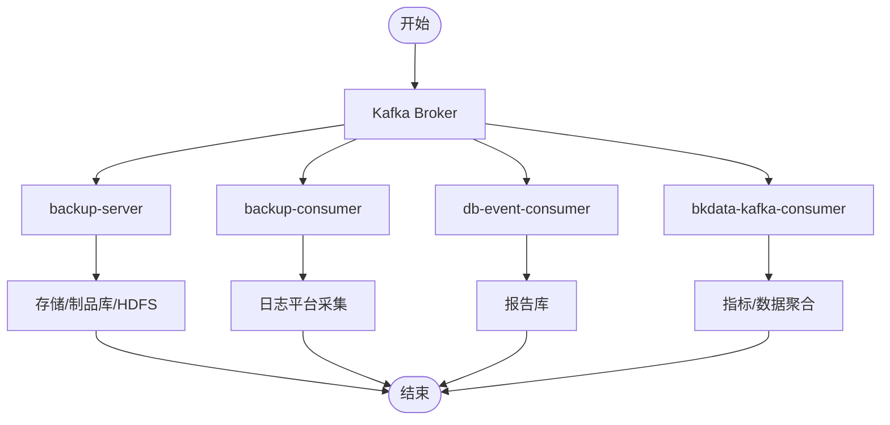
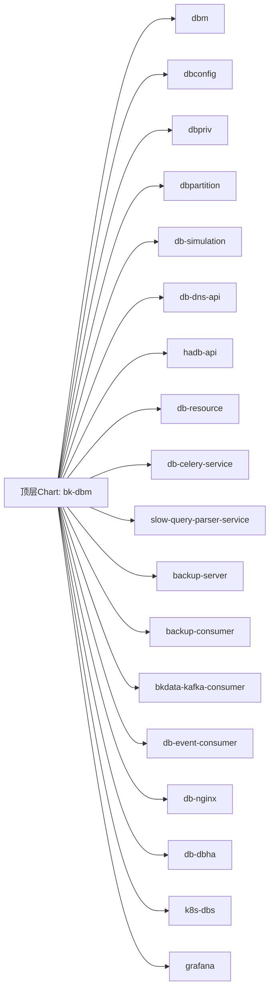

# 部署拓扑

<cite>
**本文引用的文件**
- [Chart.yaml](file://helm-charts/bk-dbm/Chart.yaml)
- [values.yaml](file://helm-charts/bk-dbm/values.yaml)
- [README.md](file://helm-charts/README.md)
- [deployment.yaml](file://helm-charts/bk-dbm/charts/db-dns-api/templates/deployment.yaml)
- [deployment.yaml](file://helm-charts/bk-dbm/charts/backup-consumer/templates/deployment.yaml)
- [deployment.yaml](file://helm-charts/bk-dbm/charts/backup-server/templates/deployment.yaml)
- [ingress.yaml](file://helm-charts/bk-dbm/charts/dbm/templates/deployments/saas-api/ingress.yaml)
- [ingress.yaml](file://helm-charts/bk-dbm/charts/db-nginx/templates/ingress.yaml)
- [_labels.tpl](file://helm-charts/bk-dbm/charts/k8s-dbs/charts/common/templates/_labels.tpl)
- [server.go](file://dbm-services/k8s-dbs/cmd/server.go)
- [Dockerfile](file://dbm-ui/Dockerfile)
- [bkdbm.ini](file://dbm-ui/backend/bk_dataview/bkdbm.ini)
- [deployment.yaml](file://dbm-services/common/dbha/ha-module/bk-dbha/templates/deployment.yaml)
- [values.yaml](file://dbm-services/common/dbha/ha-module/bk-dbha/values.yaml)
</cite>

## 目录
1. [简介](#简介)
2. [项目结构](#项目结构)
3. [核心组件](#核心组件)
4. [架构总览](#架构总览)
5. [详细组件分析](#详细组件分析)
6. [依赖关系分析](#依赖关系分析)
7. [性能考虑](#性能考虑)
8. [故障排查指南](#故障排查指南)
9. [结论](#结论)
10. [附录](#附录)

## 简介
本文件面向DBM项目的部署与运维，系统性梳理单机部署、集群部署与容器化部署方案，详解Kubernetes原生部署配置（Helm Chart结构、Service Mesh集成与Ingress配置），并给出服务间依赖关系、资源需求与环境要求、高可用策略、负载均衡与故障恢复机制、监控告警与日志收集、运维工具集成以及不同规模场景的最佳实践与性能调优建议。

## 项目结构
DBM采用“顶层Helm Chart + 多个子Chart”的分层结构，统一管理DBM核心服务与周边组件（如db-dns-api、backup-server、db-nginx、db-dbha等）。顶层Chart负责全局参数、依赖声明与渲染入口；各子Chart封装具体服务的Deployment、Service、Ingress与配置项。

图表来源
- [Chart.yaml:1-108](file://helm-charts/bk-dbm/Chart.yaml#L1-L108)
- [values.yaml:1-792](file://helm-charts/bk-dbm/values.yaml#L1-L792)

章节来源
- [Chart.yaml:1-108](file://helm-charts/bk-dbm/Chart.yaml#L1-L108)
- [values.yaml:1-792](file://helm-charts/bk-dbm/values.yaml#L1-L792)
- [README.md:1-30](file://helm-charts/README.md#L1-L30)

## 核心组件
- Web/SaaS API（dbm）：提供前端页面与后端API，支持多副本与Ingress暴露。
- 数据配置服务（dbconfig）、权限服务（dbpriv）、分区服务（dbpartition）、仿真服务（db-simulation）：各自独立Chart，按需启用。
- DNS服务（db-dns-api）、HA服务（hadb-api）、资源服务（db-resource）、队列服务（db-celery-service）、慢查询解析（slow-query-parser-service）：作为后端支撑服务。
- 备份链路（backup-server、backup-consumer、bkdata-kafka-consumer、db-event-consumer）：覆盖备份数据采集、消费与落库。
- 网关与反向代理（db-nginx）：统一入口与路径转发。
- HA模块（db-dbha）：提供高可用相关能力。
- Kubernetes DBS（k8s-dbs）：K8s原生数据库管理服务，当前示例值中默认禁用。
- 监控（grafana）：内置Grafana子Chart，用于可视化与仪表盘。

章节来源
- [values.yaml:77-512](file://helm-charts/bk-dbm/values.yaml#L77-L512)

## 架构总览
DBM在Kubernetes中的部署以Helm为核心，通过顶层Chart统一编排所有子服务。典型流量路径：客户端经Ingress进入，Web服务（dbm）对外提供SaaS API与前端页面；内部服务通过ClusterIP Service互相访问；备份链路通过Kafka/消息队列与消费者组件完成数据流转；监控通过Grafana与ServiceMonitor对接Prometheus。

图表来源
- [values.yaml:135-177](file://helm-charts/bk-dbm/values.yaml#L135-L177)
- [ingress.yaml:35-61](file://helm-charts/bk-dbm/charts/dbm/templates/deployments/saas-api/ingress.yaml#L35-L61)
- [values.yaml:514-560](file://helm-charts/bk-dbm/values.yaml#L514-L560)

## 详细组件分析

### Web/SaaS API（dbm）
- 部署形态：多副本（saas.api、backend.api、celery beat/worker、pipeline worker）。
- Ingress配置：提供多个主机名与路径，支持注解增强（如真实IP透传、请求体大小）。
- 环境变量：包含蓝鲸平台地址、网关域名、Broker地址、SSL开关等。
- 资源与弹性：支持requests/limits与HPA（autoscaling.enabled）。
- 日志与监控：支持bkLogConfig与ServiceMonitor。

图表来源
- [values.yaml:135-177](file://helm-charts/bk-dbm/values.yaml#L135-L177)
- [ingress.yaml:35-61](file://helm-charts/bk-dbm/charts/dbm/templates/deployments/saas-api/ingress.yaml#L35-L61)

章节来源
- [values.yaml:77-195](file://helm-charts/bk-dbm/values.yaml#L77-L195)

### 备份链路（backup-server、backup-consumer、bkdata-kafka-consumer、db-event-consumer）
- backup-server：提供备份存储与下载能力，支持HDFS开关与制品库配置。
- backup-consumer：消费备份事件，支持日志平台采集项配置。
- bkdata-kafka-consumer：消费Kafka主题（表大小、备份结果、Binlog结果）并设置连接数与fetch参数。
- db-event-consumer：消费Kafka事件并写入报告库，配置严格schema与数据源。

图表来源
- [values.yaml:514-601](file://helm-charts/bk-dbm/values.yaml#L514-L601)

章节来源
- [values.yaml:514-601](file://helm-charts/bk-dbm/values.yaml#L514-L601)

### 网关与反向代理（db-nginx）
- Ingress模板根据Kubernetes版本选择API版本，支持className、annotations、tls与rules。
- 适配多路径与主机，便于统一入口与路径转发。

章节来源
- [ingress.yaml:1-40](file://helm-charts/bk-dbm/charts/db-nginx/templates/ingress.yaml#L1-L40)

### HA模块（db-dbha）
- 提供高可用相关能力，示例值中默认禁用Ingress，支持资源限制与亲和性配置。
- 部署模板包含ConfigMap挂载与容器端口映射。

章节来源
- [values.yaml:43-57](file://dbm-services/common/dbha/ha-module/bk-dbha/values.yaml#L43-L57)
- [deployment.yaml:41-63](file://dbm-services/common/dbha/ha-module/bk-dbha/templates/deployment.yaml#L41-L63)

### Kubernetes DBS（k8s-dbs）
- 服务端入口通过Gin启动HTTP服务，默认监听端口，注册中间件与路由，并启动informers。
- 示例值中默认禁用，可按需启用。

章节来源
- [server.go:53-77](file://dbm-services/k8s-dbs/cmd/server.go#L53-L77)

### 监控与可视化（grafana）
- 内置grafana子Chart，支持镜像、持久化、管理员账号与配置文件注入。
- 通过ServiceMonitor与Prometheus对接，支持规则与告警配置（示例值中默认关闭）。

章节来源
- [values.yaml:343-359](file://helm-charts/bk-dbm/values.yaml#L343-L359)

## 依赖关系分析
- 顶层Chart声明了多个子Chart依赖，并通过condition字段按需启用（如mysql、redis、etcd、stakater、k8s-dbs等）。
- 子Chart之间无直接耦合，主要通过Service名称与命名空间进行逻辑隔离与通信。
- 全局参数（global.*）贯穿顶层与子Chart，用于镜像仓库、域名、监控、云区域容器化等。

图表来源
- [Chart.yaml:2-102](file://helm-charts/bk-dbm/Chart.yaml#L2-L102)

章节来源
- [Chart.yaml:1-108](file://helm-charts/bk-dbm/Chart.yaml#L1-L108)

## 性能考虑
- 资源规划
  - Web/SaaS API：建议为SaaS与Backend分别设置requests/limits，结合HPA实现弹性伸缩。
  - 备份链路：根据Kafka吞吐与消费者数量调整CPU/Memory，合理设置fetch_min_bytes与dsn_connection_per_partition。
  - 监控：Grafana与ServiceMonitor应与Prometheus实例资源匹配，避免指标过多导致内存压力。
- 网络与Ingress
  - 使用注解提升代理性能（如真实IP透传、请求体大小限制），并确保TLS配置正确。
  - 对于跨云场景，公网Ingress需配合CLB/负载均衡器。
- 存储
  - 外部数据库与持久化：优先使用外部高可用数据库，内部Chart仅用于测试环境。
  - 备份存储：HDFS或对象存储需评估带宽与延迟，避免成为瓶颈。
- 调度与亲和
  - 使用nodeSelector/affinity/tolerations将关键服务调度到稳定节点，避免频繁重启。
- 蓝牙监控与日志
  - 开启bkLogConfig与ServiceMonitor，确保异常可追踪、指标可观测。

## 故障排查指南
- Ingress无法访问
  - 检查Ingress控制器版本与className兼容性，确认annotations与hosts配置。
  - 排查Service端口与后端Pod就绪状态。
- 备份链路异常
  - 核对Kafka Broker地址、认证信息与topic配置；检查消费者组位点与严格schema设置。
  - 关注日志平台采集项dataid与group_id是否一致。
- Web服务启动失败
  - 查看容器日志与启动参数，确认数据库连接、Broker地址与证书配置。
  - 如启用HPA，检查CPU/内存阈值与最小/最大副本数。
- 监控不可见
  - 确认ServiceMonitor命名空间与jobLabel；检查Prometheus抓取间隔与超时。
  - Grafana配置文件bkdbm.ini中的数据库与代理设置需与实际一致。

章节来源
- [ingress.yaml:35-61](file://helm-charts/bk-dbm/charts/dbm/templates/deployments/saas-api/ingress.yaml#L35-L61)
- [values.yaml:514-601](file://helm-charts/bk-dbm/values.yaml#L514-L601)
- [bkdbm.ini:1-70](file://dbm-ui/backend/bk_dataview/bkdbm.ini#L1-L70)

## 结论
DBM通过Helm Chart实现了多服务统一编排与灵活启用，结合Ingress、Service、ServiceMonitor与Grafana构建了完整的可观测与可扩展部署拓扑。针对不同规模场景，建议在生产环境采用外部高可用数据库、合理的资源与弹性策略、完善的备份链路与监控告警，并通过亲和与调度策略保障高可用与稳定性。

## 附录

### 单机部署（本地/开发）
- 使用Helm模板渲染与kubectl apply快速部署，适用于本地开发与测试。
- 顶层Chart依赖需提前添加Bitnami与Stakater仓库。
- 建议禁用外部组件（如mysql、redis、etcd）并启用内置Chart或使用外部服务。

章节来源
- [README.md:3-29](file://helm-charts/README.md#L3-L29)

### 集群部署（生产）
- 使用外部高可用数据库与对象存储，启用HPA与亲和调度。
- Ingress统一入口，结合TLS与WAF防护。
- 备份链路与监控独立部署，避免单点故障。

章节来源
- [values.yaml:612-792](file://helm-charts/bk-dbm/values.yaml#L612-L792)

### 容器化部署
- 前端与后端采用多阶段构建，静态资源与依赖分离，减少镜像体积。
- 容器内通过环境变量与ConfigMap注入配置，支持热更新（配合reloader）。

章节来源
- [Dockerfile:1-102](file://dbm-ui/Dockerfile#L1-L102)

### Kubernetes原生部署配置要点
- Helm Chart结构：顶层Chart声明依赖与全局参数，子Chart定义资源清单与默认值。
- Service Mesh集成：可在values中通过envs与ServiceMonitor对接，按需启用。
- Ingress配置：根据Kubernetes版本选择API版本，统一className与annotations。

章节来源
- [Chart.yaml:1-108](file://helm-charts/bk-dbm/Chart.yaml#L1-L108)
- [_labels.tpl:1-18](file://helm-charts/bk-dbm/charts/k8s-dbs/charts/common/templates/_labels.tpl#L1-L18)