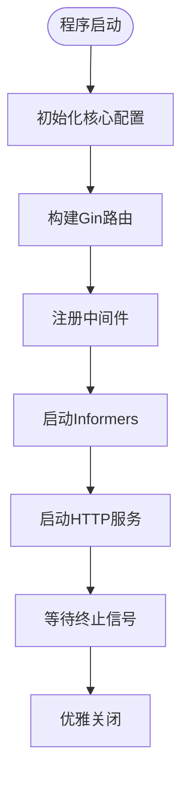
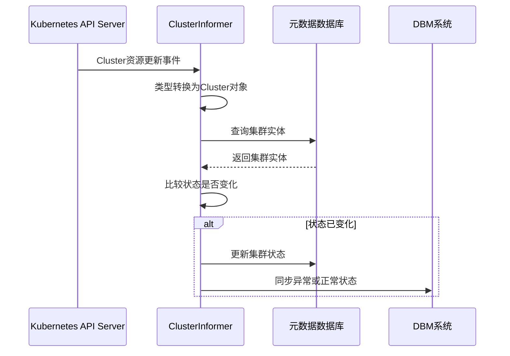
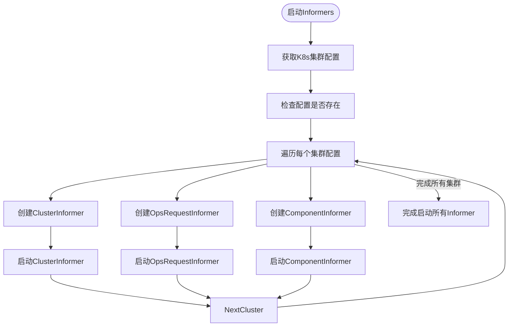
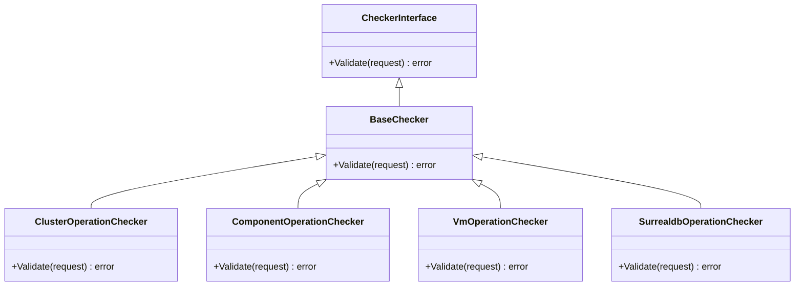
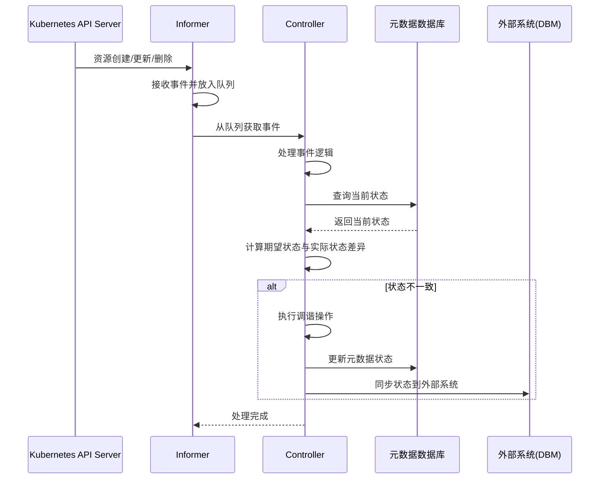

# CRD与Operator模式

<cite>
**本文档中引用的文件**  
- [cluster_informer.go](file://dbm-services/k8s-dbs/informers/cluster_informer.go)
- [component_informer.go](file://dbm-services/k8s-dbs/informers/component_informer.go)
- [opsrequest_informer.go](file://dbm-services/k8s-dbs/informers/opsrequest_informer.go)
- [informer.go](file://dbm-services/k8s-dbs/informers/informer.go)
- [addon_entity.go](file://dbm-services/k8s-dbs/core/entity/addon_entity.go)
- [cluster_entity.go](file://dbm-services/k8s-dbs/metadata/entity/cluster_entity.go)
- [victoriametrics.json](file://dbm-services/k8s-dbs/samples/addon_tolopogy_instance/victoriametrics.json)
- [server.go](file://dbm-services/k8s-dbs/cmd/server.go)
- [base.go](file://dbm-services/k8s-dbs/core/checker/addonoperation/base.go)
- [cluster_operation_checker.go](file://dbm-services/k8s-dbs/core/checker/addonoperation/cluster_operation_checker.go)
- [component_operation_checker.go](file://dbm-services/k8s-dbs/core/checker/addonoperation/component_operation_checker.go)
</cite>

## 目录
1. [引言](#引言)
2. [CRD结构设计](#crd结构设计)
3. [Operator模式实现](#operator模式实现)
4. [Informer机制分析](#informer机制分析)
5. [状态管理与操作校验](#状态管理与操作校验)
6. [CRD YAML示例](#crd-yaml示例)
7. [Operator处理流程时序图](#operator处理流程时序图)

## 引言
本文档详细介绍了k8s-dbs项目中CRD（自定义资源定义）与Operator模式的实现机制。系统通过CRD声明数据库实例、集群和附加组件，利用Operator模式实现对这些资源的声明式管理和自动化运维。文档重点分析了CRD的结构设计、Informer监听机制、控制器调谐逻辑、状态管理以及操作校验等核心组件。

**Section sources**
- [server.go](file://dbm-services/k8s-dbs/cmd/server.go#L48-L53)

## CRD结构设计
k8s-dbs通过CRD定义了多种数据库相关的资源类型，主要包括集群（Cluster）、组件（Component）和操作请求（OpsRequest）等。这些CRD在系统内部通过Go结构体进行建模，用于数据持久化和业务逻辑处理。

### 附加组件CRD设计
`AddonEntity`结构体定义了附加组件的核心属性，包括K8s集群名称、附加组件类型、版本信息和历史标记等。该结构体作为创建和管理附加组件的请求载体。

```go
type AddonEntity struct {
    K8sClusterName string `json:"k8sClusterName,omitempty"`
    AddonType      string `json:"addonType,omitempty"`
    AddonVersion   string `json:"addonVersion,omitempty"`
    IsHistory      bool   `json:"isHistory"`
}
```

### 集群CRD设计
`K8sCrdClusterEntity`结构体定义了集群实体的完整属性，包括ID、附加组件信息、拓扑名称、终止策略、K8s集群配置、请求ID、集群名称、命名空间、业务ID、标签、状态、VIP等。该结构体还包含`Tags`、`Components`和`Relations`等复杂嵌套结构，用于描述集群的完整拓扑关系。

**Section sources**
- [addon_entity.go](file://dbm-services/k8s-dbs/core/entity/addon_entity.go#L23-L29)
- [cluster_entity.go](file://dbm-services/k8s-dbs/metadata/entity/cluster_entity.go#L30-L100)

## Operator模式实现
k8s-dbs采用Operator模式来管理数据库资源的生命周期。Operator通过监听Kubernetes API Server中的自定义资源变更，然后根据期望状态与实际状态的差异进行调谐（Reconcile），确保系统最终达到期望状态。

### 控制器启动流程
Operator的启动流程在`server.go`中定义。`main`函数首先初始化核心配置，然后构建Gin路由引擎并注册中间件。最关键的是调用`dbsinformer.StartInformers(ctx)`启动所有Informer，开始监听资源变更。



**Diagram sources**
- [server.go](file://dbm-services/k8s-dbs/cmd/server.go#L53-L110)

**Section sources**
- [server.go](file://dbm-services/k8s-dbs/cmd/server.go#L53-L110)

## Informer机制分析
Informer是Kubernetes客户端库提供的一个核心机制，用于高效地监听API Server中的资源变更。k8s-dbs实现了多个Informer来监听不同类型的资源。

### Informer接口设计
系统定义了`DbsInformerStarter`接口，所有Informer都必须实现`Start`方法。这种设计实现了Informer的统一管理和启动。

```go
type DbsInformerStarter interface {
    Start(ctx context.Context, factory dynamicinformer.DynamicSharedInformerFactory) error
}
```

### 集群Informer
`ClusterInformer`负责监听`Cluster`资源的变更。当检测到集群状态变化时，它会更新本地元数据存储，并根据配置决定是否将状态同步到DBM系统。



**Diagram sources**
- [cluster_informer.go](file://dbm-services/k8s-dbs/informers/cluster_informer.go#L45-L144)

**Section sources**
- [cluster_informer.go](file://dbm-services/k8s-dbs/informers/cluster_informer.go#L45-L144)

### 组件Informer
`ComponentInformer`监听`Component`资源的变更，负责更新组件的状态信息。它通过集群名称和命名空间查找对应的集群实体，然后更新组件的元数据。

### 操作请求Informer
`OpsRequestInformer`监听`OpsRequest`资源的变更，当操作请求的状态发生变化时，更新本地存储中的操作请求实体，包括状态和完成时间等信息。

### Informer统一启动
`StartInformers`函数负责启动所有类型的Informer。它首先获取所有K8s集群配置，然后为每个集群配置启动`ClusterInformer`、`OpsRequestInformer`和`ComponentInformer`。



**Diagram sources**
- [informer.go](file://dbm-services/k8s-dbs/informers/informer.go#L41-L112)

**Section sources**
- [informer.go](file://dbm-services/k8s-dbs/informers/informer.go#L41-L112)

## 状态管理与操作校验
系统通过元数据数据库持久化存储资源的状态，并通过校验器确保操作的合法性。

### 状态管理
系统通过`K8sCrdClusterProvider`、`K8sCrdComponentProvider`等Provider接口与元数据数据库交互，实现对集群、组件等实体的CRUD操作。当Informer检测到资源状态变化时，会调用相应的Provider方法更新数据库中的状态。

### 操作校验
系统在`core/checker/addonoperation`目录下实现了多种校验器，用于验证不同类型的操作请求。这些校验器实现了统一的接口，可以根据附加组件类型动态选择合适的校验逻辑。



**Diagram sources**
- [base.go](file://dbm-services/k8s-dbs/core/checker/addonoperation/base.go)
- [cluster_operation_checker.go](file://dbm-services/k8s-dbs/core/checker/addonoperation/cluster_operation_checker.go)
- [component_operation_checker.go](file://dbm-services/k8s-dbs/core/checker/addonoperation/component_operation_checker.go)

**Section sources**
- [base.go](file://dbm-services/k8s-dbs/core/checker/addonoperation/base.go)
- [cluster_operation_checker.go](file://dbm-services/k8s-dbs/core/checker/addonoperation/cluster_operation_checker.go)
- [component_operation_checker.go](file://dbm-services/k8s-dbs/core/checker/addonoperation/component_operation_checker.go)

## CRD YAML示例
以下是一个VictoriaMetrics附加组件的CRD实例示例：

```json
[
  {
    "addonName": "victoriametrics",
    "addonCategory": "TimeSeries",
    "addonVersion": "1.0.0",
    "clusterName": "vm-test-6",
    "k8sClusterName": "BCS-xxxx-xxxx",
    "namespace": "demo",
    "status": "Running",
    "topologies": [
      {
        "name": "cluster",
        "alias": "集群模式",
        "description":"涵盖 VM 服务所需组件（存储、查询和写入），适用于需要完整 VM 存储服务的场景。",
        "default": true,
        "components": [
          {
            "name": "vminsert",
            "alias": "插入组件",
            "description": "负责数据写入，接收并缓冲时间序列数据，然后高效分发给 vmstorage 进行持久化。",
            "instances":[
              {
                "podName": "vm-test-6-vminsert-0",
                "status": "Running",
                "createdTime": "2025-07-08 12:27:37 +0800 CST"
              },
              {
                "podName": "vm-test-6-vminsert-1",
                "status": "Running",
                "createdTime": "2025-07-08 12:27:37 +0800 CST"
              }
            ]
          },
          {
            "name": "vmselect",
            "alias": "查询组件",
            "description": "负责查询处理，接收 PromQL 查询请求并从存储中检索匹配的时间序列数据。",
            "instances":[
              {
                "podName": "vm-test-6-vmselect-0",
                "status": "Running",
                "createdTime": "2025-07-08 12:27:37 +0800 CST"
              },
              {
                "podName": "vm-test-6-vmselect-1",
                "status": "Running",
                "createdTime": "2025-07-08 12:27:37 +0800 CST"
              }
            ]
          },
          {
            "name": "vmstorage",
            "alias": "存储组件",
            "description": "负责数据存储，长期保存时间序列数据，并支持高效的数据读取和压缩",
            "instances":[
              {
                "podName": "vm-test-6-vmstorage-0",
                "status": "Running",
                "createdTime": "2025-07-08 12:27:37 +0800 CST"
              },
              {
                "podName": "vm-test-6-vmstorage-1",
                "status": "Running",
                "createdTime": "2025-07-08 12:27:37 +0800 CST"
              }
            ]
          }
        ],
        "relations": [
          {
            "name": "write_data",
            "typeName": "write",
            "typeAlias": "写入",
            "from": "vminsert",
            "to": "vmstorage",
            "direction": "single"
          },
          {
            "name": "query_data",
            "typeName": "read",
            "typeAlias": "读取",
            "from": "vmselect",
            "to": "vmstorage",
            "direction": "single"
          }
        ]
      }
    ]
  }
]
```

**Section sources**
- [victoriametrics.json](file://dbm-services/k8s-dbs/samples/addon_tolopogy_instance/victoriametrics.json)

## Operator处理流程时序图
以下时序图展示了Operator处理资源变更的完整流程：



**Diagram sources**
- [cluster_informer.go](file://dbm-services/k8s-dbs/informers/cluster_informer.go#L85-L143)
- [component_informer.go](file://dbm-services/k8s-dbs/informers/component_informer.go#L82-L141)
- [opsrequest_informer.go](file://dbm-services/k8s-dbs/informers/opsrequest_informer.go#L83-L138)