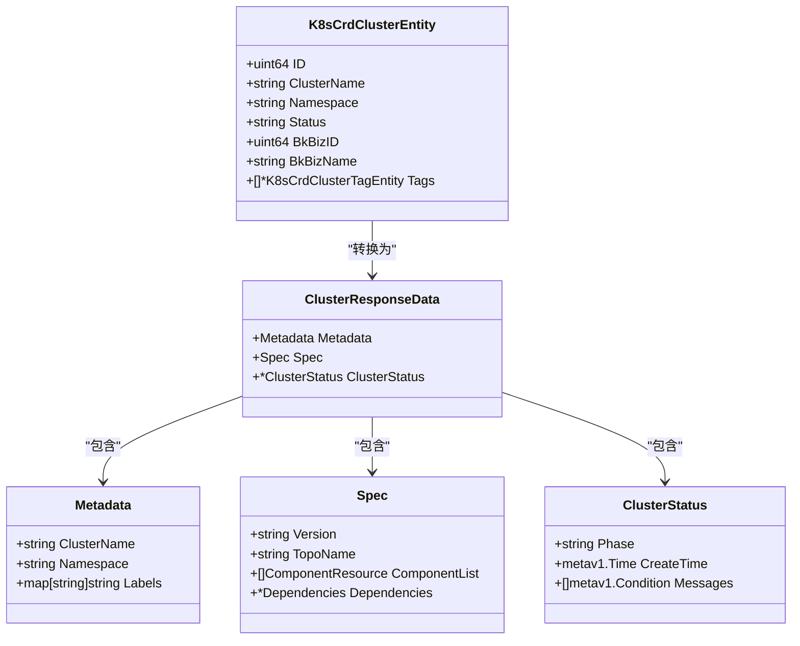

# CRD定义与资源模型

<cite>
**本文档引用的文件**  
- [cluster_entity.go](file://dbm-services/k8s-dbs/metadata/entity/cluster_entity.go)
- [addon_entity.go](file://dbm-services/k8s-dbs/metadata/entity/addon_entity.go)
- [cluster_data.go](file://dbm-services/k8s-dbs/core/entity/cluster_data.go)
- [addon_entity.go](file://dbm-services/k8s-dbs/core/entity/addon_entity.go)
- [opsrequest_data.go](file://dbm-services/k8s-dbs/core/entity/opsrequest_data.go)
- [opsrequest_entity.go](file://dbm-services/k8s-dbs/metadata/entity/opsrequest_entity.go)
- [component_detail.go](file://dbm-services/k8s-dbs/core/entity/component_detail.go)
- [dependencies.go](file://dbm-services/k8s-dbs/core/entity/dependencies.go)
- [crd.go](file://dbm-services/k8s-dbs/core/entity/crd.go)
</cite>

## 目录
1. [引言](#引言)
2. [核心CRD资源概述](#核心crd资源概述)
3. [Cluster资源模型](#cluster资源模型)
4. [Addon资源模型](#addon资源模型)
5. [OpsRequest资源模型](#opsrequest资源模型)
6. [资源间引用与继承机制](#资源间引用与继承机制)
7. [CRD YAML示例](#crd-yaml示例)
8. [Go结构体与Kubernetes资源映射](#go结构体与kubernetes资源映射)
9. [结论](#结论)

## 引言
本项目通过Kubernetes自定义资源定义（CRD）实现数据库实例的声明式管理。核心资源包括Cluster、Addon、Component和OpsRequest，它们共同构成了数据库集群生命周期管理的基础。本文档详细解析这些CRD的结构定义、字段含义及其在系统中的作用。

## 核心CRD资源概述
k8s-dbs模块定义了多个自定义资源来管理数据库服务，主要包括：

- **Cluster**：代表一个数据库集群实例，包含其拓扑、组件、配置和状态
- **Addon**：表示可插拔的数据库附加组件类型，如MySQL、Redis等
- **Component**：集群内的逻辑组件，如主节点、从节点等
- **OpsRequest**：用于声明对集群执行的操作请求，如扩容、升级等

这些资源通过Kubernetes API进行管理，实现了数据库服务的声明式配置和自动化运维。

## Cluster资源模型

Cluster是核心资源，用于声明和管理数据库集群实例。其结构分为Spec和Status两部分。

### Spec字段结构
Cluster的Spec定义了集群的期望状态，主要包含以下字段：

- **metadata**：元数据，包括集群名称、命名空间、标签等
- **version**：集群版本
- **topoName**：拓扑名称，定义集群的架构模式
- **terminationPolicy**：终止策略，控制集群删除时的行为
- **componentList**：组件列表，定义集群中各组件的配置
- **dependencies**：外部依赖配置，如S3、Etcd、Kafka等
- **observeConfig**：监控观测配置

其中，`componentList`中的每个组件包含名称、副本数、资源请求与限制、存储配置等信息。

### Status字段结构
Status反映集群的实际运行状态：

- **phase**：集群当前阶段（如Running、Failed等）
- **createTime**：创建时间
- **updateTime**：最后更新时间
- **messages**：状态条件和消息列表

该状态由控制器根据实际运行情况更新，用户可通过查询Status了解集群健康状况。

**Section sources**
- [cluster_data.go](file://dbm-services/k8s-dbs/core/entity/cluster_data.go#L33-L185)
- [cluster_entity.go](file://dbm-services/k8s-dbs/metadata/entity/cluster_entity.go#L29-L56)

## Addon资源模型

Addon资源定义了可部署的数据库附加组件类型及其属性。

### Spec字段结构
Addon的Spec主要包含：

- **addonName**：附加组件名称
- **addonCategory**：分类（如数据库、中间件）
- **addonType**：类型标识
- **addonVersion**：版本号
- **topologies**：支持的拓扑结构
- **recommendedVersion**：推荐版本
- **supportedVersions**：支持的版本列表
- **active**：是否激活可用

### Status字段结构
Addon的状态信息包括：

- **description**：描述信息
- **createdBy/createdAt**：创建者和创建时间
- **updatedBy/updatedAt**：最后更新者和时间

Addon资源作为模板存在，供创建实际的Cluster实例时引用。

**Section sources**
- [addon_entity.go](file://dbm-services/k8s-dbs/metadata/entity/addon_entity.go#L24-L43)
- [addon_entity.go](file://dbm-services/k8s-dbs/core/entity/addon_entity.go#L23-L28)

## OpsRequest资源模型

OpsRequest用于声明对数据库集群执行的运维操作。

### Spec字段结构
操作请求的Spec包含：

- **metadata**：关联的集群信息
- **操作类型特定字段**：根据操作类型（如垂直扩缩容、水平扩缩容）包含不同的参数
- **OpsService内联字段**：操作服务相关配置

### Status字段结构
操作状态包括：

- **phase**：操作阶段（Pending、Running、Succeeded、Failed等）
- **startTime/completeTime**：开始和完成时间
- **messages**：操作过程中的状态消息和错误信息

通过观察OpsRequest的Status，可以跟踪运维操作的执行进度和结果。

**Section sources**
- [opsrequest_data.go](file://dbm-services/k8s-dbs/core/entity/opsrequest_data.go#L29-L68)
- [opsrequest_entity.go](file://dbm-services/k8s-dbs/metadata/entity/opsrequest_entity.go#L24-L41)

## 资源间引用与继承机制

系统中的CRD资源通过多种方式建立关联：

- **Cluster引用Addon**：通过`addonType`和`addonVersion`字段指定使用的附加组件
- **OpsRequest引用Cluster**：通过`metadata.clusterName`字段关联目标集群
- **Component属于Cluster**：作为Cluster的子资源存在，通过`componentName`标识

继承机制主要体现在：
- `Spec`结构体通过内联（inline）方式继承`OpsService`等公共字段
- 组件配置继承集群级别的默认设置
- 操作请求继承集群的上下文信息

这种设计实现了配置的复用和管理的一致性。

**Section sources**
- [cluster_data.go](file://dbm-services/k8s-dbs/core/entity/cluster_data.go#L55-L64)
- [dependencies.go](file://dbm-services/k8s-dbs/core/entity/dependencies.go#L22-L67)

## CRD YAML示例

以下是一个完整的Cluster CRD YAML示例：

```yaml
apiVersion: apps.kubeblocks.io/v1alpha1
kind: Cluster
metadata:
  name: mysql-cluster
  namespace: dbm
  labels:
    bkapp: myapp
spec:
  version: "8.0"
  topoName: master-slave
  terminationPolicy: Delete
  componentList:
    - componentName: mysql
      componentDef: apecloud-mysql
      replicas: 3
      version: "8.0"
      request:
        cpu: "2"
        memory: "4Gi"
      limit:
        cpu: "4"
        memory: "8Gi"
      volumeClaimTemplates:
        storage: 100Gi
        storageClassName: cbs
  dependencies:
    externalS3:
      enabled: true
      host: s3.example.com
      bucketName: mysql-backup
```

该示例声明了一个MySQL主从架构的数据库集群，包含3个副本，配置了CPU、内存和存储资源。

**Section sources**
- [cluster_data.go](file://dbm-services/k8s-dbs/core/entity/cluster_data.go#L55-L99)

## Go结构体与Kubernetes资源映射

业务概念通过Go结构体映射为Kubernetes资源：

### Cluster映射
`K8sCrdClusterEntity`结构体定义了数据库集群的持久化模型，包含业务所需的额外字段如`bkBizID`、`tags`等，而`ClusterResponseData`则用于API响应，从Kubernetes的Unstructured对象转换而来。

### Addon映射
`K8sCrdStorageAddonEntity`结构体定义了附加组件的元数据和配置，通过`GetClusterResponseData`等函数实现与Kubernetes资源的相互转换。

这种双层结构设计分离了存储模型和API模型，提高了系统的灵活性和可维护性。



**Diagram sources**
- [cluster_entity.go](file://dbm-services/k8s-dbs/metadata/entity/cluster_entity.go#L29-L56)
- [cluster_data.go](file://dbm-services/k8s-dbs/core/entity/cluster_data.go#L33-L73)

**Section sources**
- [cluster_entity.go](file://dbm-services/k8s-dbs/metadata/entity/cluster_entity.go#L29-L56)
- [cluster_data.go](file://dbm-services/k8s-dbs/core/entity/cluster_data.go#L33-L185)

## 结论
k8s-dbs模块通过精心设计的CRD体系实现了数据库服务的声明式管理。Cluster、Addon、OpsRequest等资源构成了完整的管理模型，支持数据库实例的全生命周期操作。通过Go结构体与Kubernetes资源的映射，系统在保持Kubernetes原生体验的同时，扩展了丰富的业务功能。这种设计模式为数据库即服务（DBaaS）平台提供了坚实的基础。