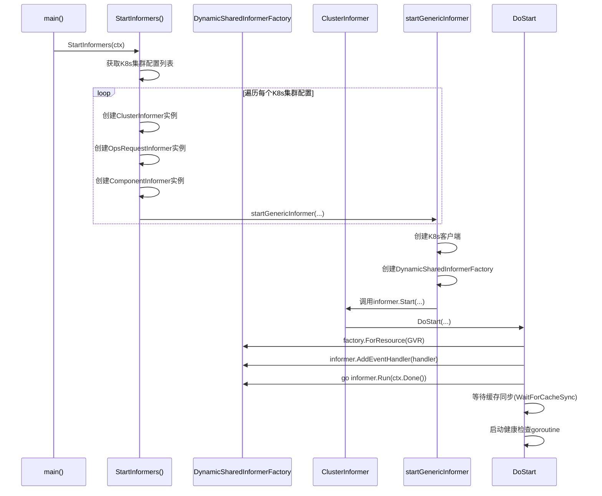
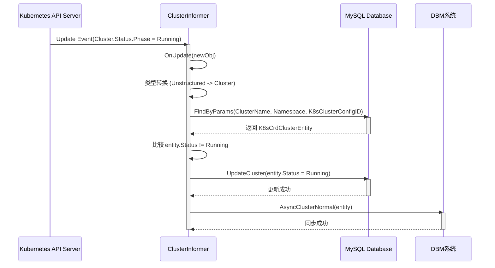

# Operator调谐循环

<cite>
**本文档引用的文件**   
- [cluster_informer.go](file://dbm-services/k8s-dbs/informers/cluster_informer.go)
- [component_informer.go](file://dbm-services/k8s-dbs/informers/component_informer.go)
- [informer.go](file://dbm-services/k8s-dbs/informers/informer.go)
- [informer_helper.go](file://dbm-services/k8s-dbs/informers/informer_helper.go)
- [opsrequest_informer.go](file://dbm-services/k8s-dbs/informers/opsrequest_informer.go)
- [cluster_controller.go](file://dbm-services/k8s-dbs/metadata/api/controller/cluster_controller.go)
- [server.go](file://dbm-services/k8s-dbs/cmd/server.go)
- [cluster_provider.go](file://dbm-services/k8s-dbs/metadata/provider/cluster_provider.go)
- [component_provider.go](file://dbm-services/k8s-dbs/metadata/provider/component_provider.go)
</cite>

## 目录
1. [引言](#引言)
2. [Informer机制与事件监听](#informer机制与事件监听)
3. [控制器调谐逻辑](#控制器调谐逻辑)
4. [典型调谐周期分析](#典型调谐周期分析)
5. [时序图：资源变更到状态同步](#时序图资源变更到状态同步)
6. [总结](#总结)

## 引言
k8s-dbs Operator是蓝鲸智云-DB管理系统中的核心组件，负责管理Kubernetes上数据库集群的生命周期。其核心工作模式是基于Kubernetes的声明式API和控制器模式，通过Informer机制监听自定义资源（CRD）的变更事件，并通过调谐循环（Reconciliation Loop）确保集群的实际状态与期望状态一致。本文档将深入分析k8s-dbs Operator的调谐循环，重点解析其Informer事件处理流程和控制器的调谐逻辑。

## Informer机制与事件监听

k8s-dbs Operator通过Informer机制实现对Kubernetes集群中特定CRD资源的高效、实时监听。Informer是Kubernetes客户端库提供的一个高级抽象，它结合了List-Watch机制和本地缓存，能够避免频繁的API调用，同时保证事件的不丢失。

### Informer的启动流程
Operator的Informer启动流程始于`server.go`中的`main`函数。在初始化核心配置和路由后，会调用`dbsinformer.StartInformers(ctx)`来启动所有Informer。



**Diagram sources**
- [server.go](file://dbm-services/k8s-dbs/cmd/server.go#L69-L72)
- [informer.go](file://dbm-services/k8s-dbs/informers/informer.go#L42-L66)
- [informer.go](file://dbm-services/k8s-dbs/informers/informer.go#L76-L111)
- [informer_helper.go](file://dbm-services/k8s-dbs/informers/informer_helper.go#L35-L96)

**Section sources**
- [server.go](file://dbm-services/k8s-dbs/cmd/server.go#L53-L76)
- [informer.go](file://dbm-services/k8s-dbs/informers/informer.go#L42-L111)

### 事件队列处理流程
k8s-dbs Operator为不同类型的CRD资源创建了专门的Informer，主要包括`ClusterInformer`、`ComponentInformer`和`OpsRequestInformer`。它们都遵循相同的事件处理模式：

1.  **注册事件处理器**：在`Start`方法中，通过`DoStart`函数为Informer注册一个`ResourceEventHandler`。从代码分析来看，这些Informer目前主要监听`UpdateFunc`事件。
2.  **事件处理**：当监听的资源发生变更时，Informer会调用注册的事件处理函数（如`OnUpdate`）。
3.  **类型转换与状态比对**：`OnUpdate`函数首先将接收到的`interface{}`对象转换为具体的Unstructured资源，再通过`runtime.DefaultUnstructuredConverter`转换为强类型的Go结构体（如`appsv1.Cluster`）。
4.  **元数据查询与更新**：根据新资源的状态，查询本地数据库中的元数据实体。如果发现状态发生变化，则更新数据库中的记录。
5.  **外部系统同步**：在某些情况下（如`ClusterInformer`），还会根据状态变化调用外部系统的API进行同步。

以`ClusterInformer`为例，其`OnUpdate`方法的处理流程如下：
- 将`newObj`转换为`*unstructured.Unstructured`。
- 进一步转换为`appsv1.Cluster`类型，获取其最新的`Status.Phase`。
- 查询数据库中对应的`K8sCrdClusterEntity`实体。
- 比较数据库中的`Status`与CRD的`Status.Phase`，若不一致则更新数据库。
- 如果环境变量`AsyncToDBMEnv`启用，还会根据`Phase`状态调用`AsyncClusterAbnormal`或`AsyncClusterNormal`函数，将状态同步到DBM系统。

```mermaid
flowchart TD
A[收到Update事件] --> B[类型转换: interface{} -> Unstructured]
B --> C[类型转换: Unstructured -> appsv1.Cluster]
C --> D[查询数据库中的集群元数据]
D --> E{状态是否变化?}
E --> |否| F[忽略事件]
E --> |是| G[更新数据库中的状态]
G --> H[调用外部API同步状态]
H --> I[处理完成]
```

**Diagram sources**
- [cluster_informer.go](file://dbm-services/k8s-dbs/informers/cluster_informer.go#L86-L143)
- [component_informer.go](file://dbm-services/k8s-dbs/informers/component_informer.go#L83-L141)
- [opsrequest_informer.go](file://dbm-services/k8s-dbs/informers/opsrequest_informer.go#L84-L138)

**Section sources**
- [cluster_informer.go](file://dbm-services/k8s-dbs/informers/cluster_informer.go#L86-L143)
- [component_informer.go](file://dbm-services/k8s-dbs/informers/component_informer.go#L83-L141)
- [opsrequest_informer.go](file://dbm-services/k8s-dbs/informers/opsrequest_informer.go#L84-L138)

## 控制器调谐逻辑

k8s-dbs Operator的调谐逻辑主要体现在其Informer的事件处理中，它遵循了经典的“获取-计算-执行”模式。

### 获取当前状态
控制器通过两种方式获取当前状态：
1.  **从Kubernetes API获取**：Informer通过List-Watch机制，将Kubernetes集群中CRD资源的最新状态缓存在本地。当`OnUpdate`事件触发时，`newObj`参数就代表了资源的最新状态。
2.  **从本地数据库获取**：控制器通过`metaprovider`（元数据提供者）接口，从本地MySQL数据库中查询与CRD资源对应的元数据实体。例如，`ClusterInformer`使用`K8sCrdClusterProvider`来查询`K8sCrdClusterEntity`。

### 计算期望状态
在k8s-dbs Operator的当前实现中，其“期望状态”并非一个预先定义的复杂配置，而是直接由CRD资源的`Spec`字段所描述。控制器的调谐目标是确保本地数据库中的元数据状态（如`Status`字段）与CRD资源的`Status`字段保持一致。因此，计算过程非常直接：
- **期望状态**：CRD资源的`Status.Phase`。
- **当前状态**：数据库中`K8sCrdClusterEntity.Status`的值。
- **差异**：两者是否相等。

### 执行操作以消除差异
一旦发现差异，控制器会立即执行操作来消除它：
- **更新本地元数据**：调用`metaprovider`的`UpdateCluster`、`UpdateComponent`等方法，将数据库中的状态更新为CRD的最新状态。
- **触发外部动作**：在`ClusterInformer`中，当集群状态变为`Abnormal`或`Failed`时，会调用`infrautil.AsyncClusterAbnormal`函数，通过HTTP API通知DBM系统，从而触发告警或运维流程。

这种设计使得k8s-dbs Operator更像是一个“状态同步器”或“事件处理器”，其核心职责是确保Kubernetes集群的实时状态能够准确地反映在DBM系统的元数据库中，为上层的监控、告警和自动化运维提供可靠的数据基础。

**Section sources**
- [cluster_informer.go](file://dbm-services/k8s-dbs/informers/cluster_informer.go#L100-L128)
- [component_informer.go](file://dbm-services/k8s-dbs/informers/component_informer.go#L101-L139)
- [opsrequest_informer.go](file://dbm-services/k8s-dbs/informers/opsrequest_informer.go#L102-L137)

## 典型调谐周期分析

我们以处理一个集群创建请求的完整流程为例，分析k8s-dbs Operator的典型调谐周期。虽然Informer主要监听`Update`事件，但集群的创建过程也会触发一系列`Update`事件（如从`Pending`到`Creating`再到`Running`）。

1.  **资源创建**：用户通过Kubectl或API创建一个`Cluster`类型的CRD资源。Kubernetes API Server接收请求并持久化该资源。
2.  **事件触发**：`ClusterInformer`监听到该资源的第一次`Update`事件（通常是从`nil`到`Pending`状态）。
3.  **状态获取**：
    - Informer从`newObj`中获取`Cluster`资源的初始状态。
    - `ClusterInformer`尝试通过`clusterMetaProvider.FindByParams`在数据库中查找该集群的元数据。
4.  **状态计算与执行**：
    - 由于是新创建的集群，数据库中可能还不存在该记录，`FindByParams`返回`nil`或错误。
    - 代码中对此情况进行了处理（`if err != nil || entity == nil`），会直接返回，不进行后续操作。这表明集群元数据的创建可能由其他机制（如`CreateCluster` API）完成，而Informer主要负责状态的更新。
5.  **后续调谐**：随着集群创建过程的推进，`Cluster`资源的`Status.Phase`会不断变化（如变为`Creating`、`Running`）。每一次状态变更都会触发`OnUpdate`事件。
6.  **状态同步**：当`Status.Phase`变为`Running`时，`OnUpdate`方法会：
    - 成功查询到数据库中的集群实体。
    - 发现`entity.Status`（可能是`Creating`）与新的`newPhase`（`Running`）不一致。
    - 调用`UpdateCluster`将数据库中的状态更新为`Running`。
    - 调用`AsyncClusterNormal`通知DBM系统该集群已正常运行。

这个周期会持续进行，确保任何状态变更都能被及时捕获和同步。

**Section sources**
- [cluster_informer.go](file://dbm-services/k8s-dbs/informers/cluster_informer.go#L100-L143)
- [cluster_provider.go](file://dbm-services/k8s-dbs/metadata/provider/cluster_provider.go#L43-L53)

## 时序图：资源变更到最终状态同步

以下时序图展示了从Kubernetes中`Cluster`资源状态变更，到k8s-dbs Operator处理事件，最终将状态同步到DBM系统的完整过程。



**Diagram sources**
- [cluster_informer.go](file://dbm-services/k8s-dbs/informers/cluster_informer.go#L86-L143)
- [infrastructure/util/util.go](file://dbm-services/k8s-dbs/infrastructure/util/util.go) (AsyncClusterNormal函数)
- [cluster_provider.go](file://dbm-services/k8s-dbs/metadata/provider/cluster_provider.go#L48)

## 总结
k8s-dbs Operator通过精心设计的Informer机制，实现了对Kubernetes集群中数据库资源的高效监控。其调谐循环简洁而有效，核心逻辑在于监听CRD资源的`Update`事件，获取资源的最新状态，并与本地数据库中的元数据进行比对。一旦发现状态差异，立即执行更新操作，确保元数据的实时性和准确性。这种模式虽然不直接管理资源的创建和删除，但为上层系统提供了至关重要的状态同步能力，是整个DBM系统实现自动化运维的关键一环。