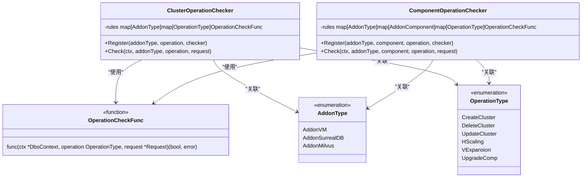
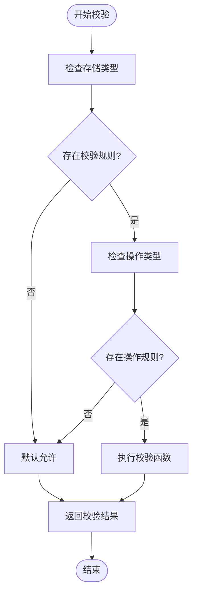
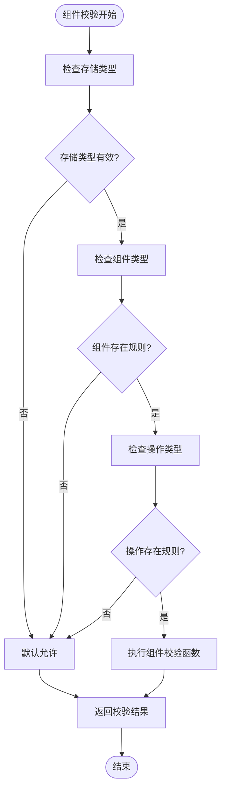
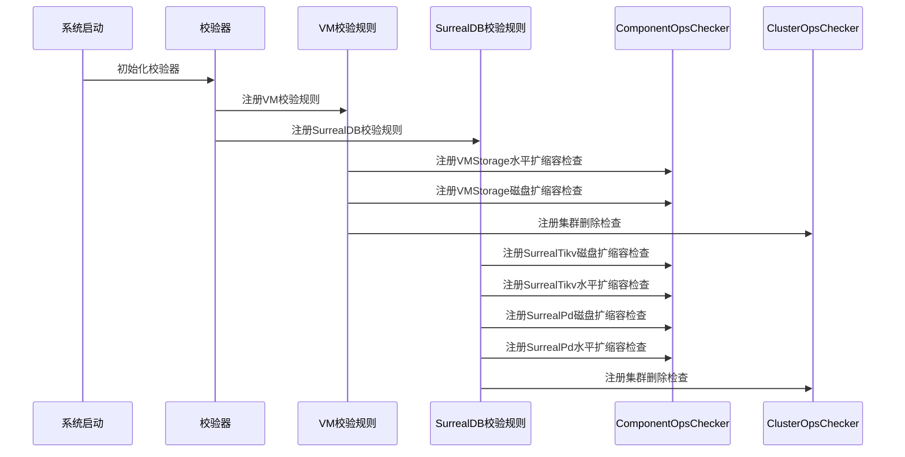
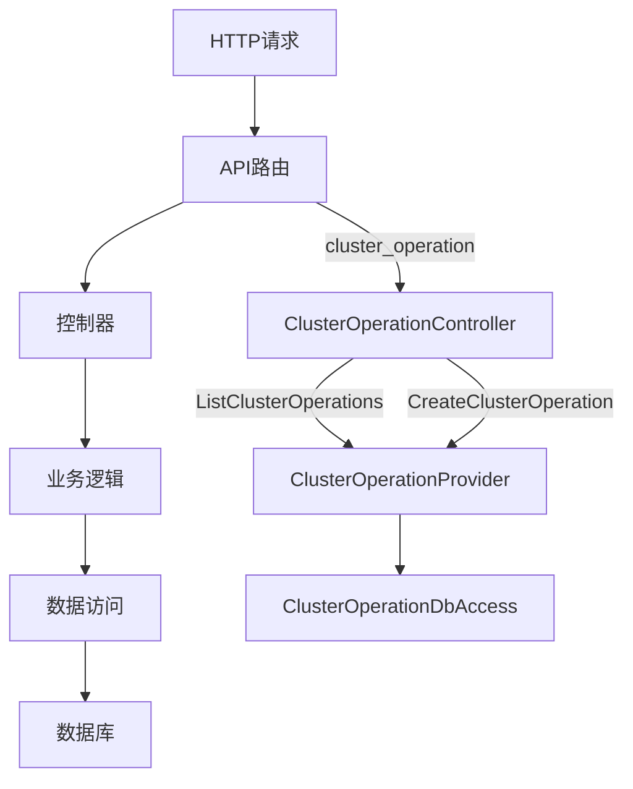
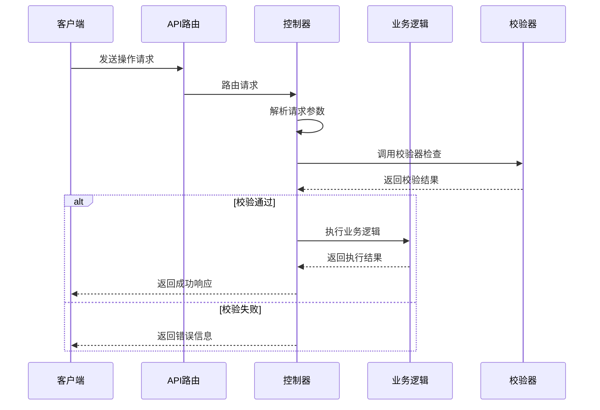
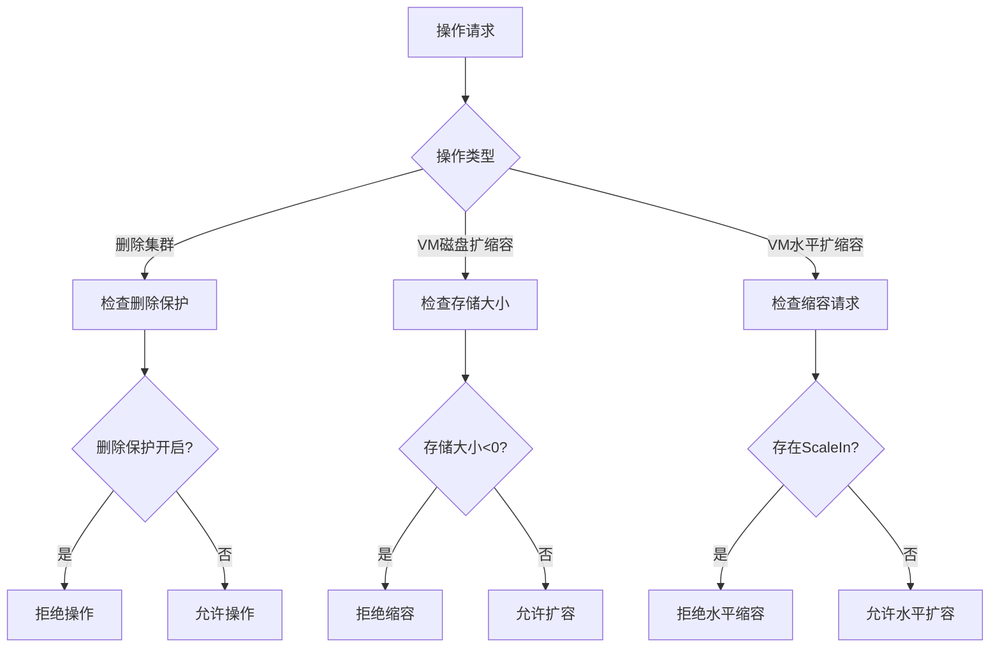
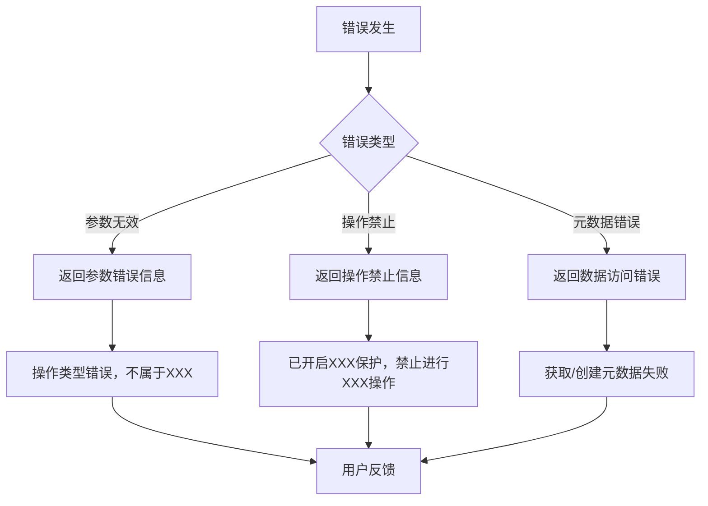

# 操作校验与安全检查

<cite>
**本文档引用的文件**  
- [base.go](file://dbm-services/k8s-dbs/core/checker/addonoperation/base.go)
- [cluster_operation_checker.go](file://dbm-services/k8s-dbs/core/checker/addonoperation/cluster_operation_checker.go)
- [component_operation_checker.go](file://dbm-services/k8s-dbs/core/checker/addonoperation/component_operation_checker.go)
- [surrealdb_operation_checker.go](file://dbm-services/k8s-dbs/core/checker/addonoperation/surrealdb_operation_checker.go)
- [vm_operation_checker.go](file://dbm-services/k8s-dbs/core/checker/addonoperation/vm_operation_checker.go)
- [cluster_operation.go](file://dbm-services/k8s-dbs/router/metadata/cluster_operation.go)
- [cluster_operation_controller.go](file://dbm-services/k8s-dbs/metadata/api/controller/cluster_operation_controller.go)
- [cluster_operation_provider.go](file://dbm-services/k8s-dbs/metadata/provider/cluster_operation_provider.go)
</cite>

## 目录
1. [简介](#简介)
2. [核心校验器架构](#核心校验器架构)
3. [集群级操作校验机制](#集群级操作校验机制)
4. [组件级操作校验机制](#组件级操作校验机制)
5. [校验器注册与初始化](#校验器注册与初始化)
6. [API路由与控制器集成](#api路由与控制器集成)
7. [常见校验场景](#常见校验场景)
8. [错误处理与用户反馈](#错误处理与用户反馈)
9. [总结](#总结)

## 简介
本文档详细介绍了k8s-dbs系统中操作校验与安全检查机制的设计与实现。重点分析了checker目录下各类校验器的职责，包括前置条件检查、资源可用性验证和权限校验。文档还解释了这些校验器如何集成到API路由和控制器逻辑中，确保数据库操作的安全性和正确性。

## 核心校验器架构

k8s-dbs系统采用分层的校验架构，主要包含两个核心校验器：

1. **集群操作校验器 (ClusterOperationChecker)**：负责集群级别的操作校验
2. **组件操作校验器 (ComponentOperationChecker)**：负责具体组件级别的操作校验

校验器采用策略模式设计，通过注册机制动态绑定校验规则，实现了高扩展性和灵活性。



**图源**
- [cluster_operation_checker.go](file://dbm-services/k8s-dbs/core/checker/addonoperation/cluster_operation_checker.go)
- [component_operation_checker.go](file://dbm-services/k8s-dbs/core/checker/addonoperation/component_operation_checker.go)
- [base.go](file://dbm-services/k8s-dbs/core/checker/addonoperation/base.go)

## 集群级操作校验机制

集群操作校验器（ClusterOperationChecker）负责对整个集群级别的操作进行安全检查。其主要职责包括：

- 验证操作类型的有效性
- 检查集群的删除保护状态
- 确保操作符合业务规则

校验器通过规则映射表管理不同存储类型和操作类型的校验函数，支持动态注册和灵活扩展。



**图源**
- [cluster_operation_checker.go](file://dbm-services/k8s-dbs/core/checker/addonoperation/cluster_operation_checker.go)

**本节来源**
- [cluster_operation_checker.go](file://dbm-services/k8s-dbs/core/checker/addonoperation/cluster_operation_checker.go#L27-L71)

## 组件级操作校验机制

组件操作校验器（ComponentOperationChecker）负责对具体组件的操作进行精细化校验。其设计支持三级规则匹配：

1. 存储类型 (AddonType)
2. 组件类型 (AddonComponent)
3. 操作类型 (OperationType)

这种分层设计使得校验规则可以精确到特定存储系统的特定组件的特定操作。



**图源**
- [component_operation_checker.go](file://dbm-services/k8s-dbs/core/checker/addonoperation/component_operation_checker.go)

**本节来源**
- [component_operation_checker.go](file://dbm-services/k8s-dbs/core/checker/addonoperation/component_operation_checker.go#L27-L81)

## 校验器注册与初始化

系统通过`init()`函数在启动时自动注册各类校验规则。这种设计确保了校验规则的集中管理和自动加载。

### VictoriaMetrics校验规则注册

```go
func init() {
    ComponentOpsChecker.Register(AddonVM, ComponentVMStorage, HScaling, VMStorageHScaleCheck)
    ComponentOpsChecker.Register(AddonVM, ComponentVMStorage, VExpansion, VMStorageVExpansionCheck)
    ClusterOpsChecker.Register(AddonVM, DeleteCluster, ClusterDeleteCheck)
}
```

### SurrealDB校验规则注册

```go
func init() {
    ComponentOpsChecker.Register(AddonSurrealDB, ComponentSurrealTikv, VExpansion, SurrealTikvVExpansionCheck)
    ComponentOpsChecker.Register(AddonSurrealDB, ComponentSurrealTikv, HScaling, SurrealTikvHScaleCheck)
    ComponentOpsChecker.Register(AddonSurrealDB, ComponentSurrealPd, VExpansion, SurrealPdVExpansionCheck)
    ComponentOpsChecker.Register(AddonSurrealDB, ComponentSurrealPd, HScaling, SurrealPdHScaleCheck)
    ClusterOpsChecker.Register(AddonSurrealDB, DeleteCluster, ClusterDeleteCheck)
}
```



**图源**
- [vm_operation_checker.go](file://dbm-services/k8s-dbs/core/checker/addonoperation/vm_operation_checker.go)
- [surrealdb_operation_checker.go](file://dbm-services/k8s-dbs/core/checker/addonoperation/surrealdb_operation_checker.go)

**本节来源**
- [vm_operation_checker.go](file://dbm-services/k8s-dbs/core/checker/addonoperation/vm_operation_checker.go#L73-L77)
- [surrealdb_operation_checker.go](file://dbm-services/k8s-dbs/core/checker/addonoperation/surrealdb_operation_checker.go#L119-L125)

## API路由与控制器集成

校验机制通过分层架构与API路由和控制器紧密集成，确保所有操作请求都经过严格的安全检查。

### 路由层集成

API路由通过`BuildClusterOpMetaRouter`函数构建，将HTTP请求映射到相应的控制器方法。



**图源**
- [cluster_operation.go](file://dbm-services/k8s-dbs/router/metadata/cluster_operation.go)

### 控制器层集成

控制器层负责接收请求、调用校验器进行安全检查，并处理业务逻辑。



**图源**
- [cluster_operation_controller.go](file://dbm-services/k8s-dbs/metadata/api/controller/cluster_operation_controller.go)
- [cluster_operation_provider.go](file://dbm-services/k8s-dbs/metadata/provider/cluster_operation_provider.go)

**本节来源**
- [cluster_operation.go](file://dbm-services/k8s-dbs/router/metadata/cluster_operation.go#L32-L48)
- [cluster_operation_controller.go](file://dbm-services/k8s-dbs/metadata/api/controller/cluster_operation_controller.go#L37-L95)
- [cluster_operation_provider.go](file://dbm-services/k8s-dbs/metadata/provider/cluster_operation_provider.go#L33-L100)

## 常见校验场景

### 集群删除保护检查

当集群开启删除保护时，禁止执行删除操作：

```go
func ClusterDeleteCheck(ctx *commentity.DbsContext, operationType OperationType, _ *coreentity.Request) (bool, error) {
    if operationType != DeleteCluster {
        return false, errors.NewK8sDbsError(errors.ParameterInvalidError,
            fmt.Errorf("操作类型错误，不属于集群删除。操作类型:%s", operationType))
    }
    terminationPolicy := ctx.ClusterEntity.TerminationPolicy
    if terminationPolicy == coreconst.DoNotTerminate {
        return false, errors.NewK8sDbsError(errors.OperationForbidden,
            fmt.Errorf("已开启删除保护，禁止进行删除操作"))
    }
    return true, nil
}
```

### VictoriaMetrics存储组件校验

1. **磁盘扩缩容检查**：禁止对vmstorage节点执行磁盘缩容操作
2. **水平扩缩容检查**：禁止对vmstorage组件执行水平缩容操作

### SurrealDB组件校验

1. **Tikv组件**：
   - 禁止磁盘缩容
   - 禁止水平缩容
2. **Pd组件**：
   - 禁止磁盘缩容
   - 禁止水平缩容



**本节来源**
- [base.go](file://dbm-services/k8s-dbs/core/checker/addonoperation/base.go#L99-L112)
- [vm_operation_checker.go](file://dbm-services/k8s-dbs/core/checker/addonoperation/vm_operation_checker.go#L29-L72)
- [surrealdb_operation_checker.go](file://dbm-services/k8s-dbs/core/checker/addonoperation/surrealdb_operation_checker.go#L29-L117)

## 错误处理与用户反馈

系统采用统一的错误处理机制，提供清晰的用户反馈信息。

### 错误类型

1. **参数无效错误** (ParameterInvalidError)：操作类型不匹配
2. **操作禁止错误** (OperationForbidden)：违反业务规则
3. **元数据获取错误** (GetMetaDataError)：数据访问失败
4. **元数据创建错误** (CreateMetaDataError)：数据写入失败

### 用户友好错误信息

系统为每种错误类型提供中文描述，确保用户能够理解错误原因：

- "操作类型错误，不属于集群删除"
- "已开启删除保护，禁止进行删除操作"
- "vmstorage 节点禁止执行磁盘缩容操作"
- "surreal tikv 组件禁止执行水平缩容操作"



**本节来源**
- [base.go](file://dbm-services/k8s-dbs/core/checker/addonoperation/base.go#L103-L109)
- [vm_operation_checker.go](file://dbm-services/k8s-dbs/core/checker/addonoperation/vm_operation_checker.go#L36-L37)
- [surrealdb_operation_checker.go](file://dbm-services/k8s-dbs/core/checker/addonoperation/surrealdb_operation_checker.go#L36-L37)

## 总结

k8s-dbs系统的操作校验与安全检查机制通过分层设计实现了高灵活性和可扩展性：

1. **双层校验架构**：集群级和组件级校验器分工明确
2. **动态注册机制**：通过`init()`函数自动注册校验规则
3. **策略模式设计**：支持灵活的校验策略管理
4. **统一错误处理**：提供清晰的用户反馈信息
5. **深度集成**：与API路由和控制器紧密集成

该机制有效保障了数据库操作的安全性，防止了误操作和违规操作，为系统的稳定运行提供了重要保障。