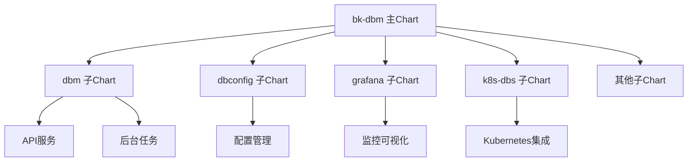

# Helm Chart结构解析

<cite>
**本文档引用的文件**  
- [Chart.yaml](file://helm-charts/bk-dbm/Chart.yaml)
- [values.yaml](file://helm-charts/bk-dbm/values.yaml)
- [_helpers.tpl](file://helm-charts/bk-dbm/templates/_helpers.tpl)
- [NOTES.txt](file://helm-charts/bk-dbm/templates/NOTES.txt)
- [dbm/Chart.yaml](file://helm-charts/bk-dbm/charts/dbm/Chart.yaml)
- [grafana/Chart.yaml](file://helm-charts/bk-dbm/charts/grafana/Chart.yaml)
- [k8s-dbs/Chart.yaml](file://helm-charts/bk-dbm/charts/k8s-dbs/Chart.yaml)
- [dbconfig/Chart.yaml](file://helm-charts/bk-dbm/charts/dbconfig/Chart.yaml)
- [grafana/templates/deployment.yaml](file://helm-charts/bk-dbm/charts/grafana/templates/deployment.yaml)
- [dbconfig/templates/deployment.yaml](file://helm-charts/bk-dbm/charts/dbconfig/templates/deployment.yaml)
</cite>

## 目录

1. [Chart元数据与版本信息](#chart元数据与版本信息)
2. [依赖关系管理](#依赖关系管理)
3. [子Chart组织结构](#子chart组织结构)
4. [_helpers.tpl模板文件解析](#_helperstpl模板文件解析)
5. [模块化部署实现](#模块化部署实现)
6. [组件启用控制机制](#组件启用控制机制)

## Chart元数据与版本信息

在bk-dbm Helm Chart的`Chart.yaml`文件中，定义了Chart的基本元数据和版本信息。该Chart遵循Helm v2规范，其主要元数据包括：

- **名称**：`bk-dbm`，标识了该Chart的名称
- **类型**：`application`，表明这是一个应用类型的Chart
- **版本**：`1.5.0-alpha.78`，表示当前Chart的版本号
- **应用版本**：`1.5.0-alpha.78`，与Chart版本保持一致，用于标识所部署应用的版本

这些元数据为Chart的识别、管理和版本控制提供了基础信息，确保了在Kubernetes集群中部署时的可追溯性和一致性。

**Section sources**
- [Chart.yaml](file://helm-charts/bk-dbm/Chart.yaml#L1-L108)

## 依赖关系管理

bk-dbm Chart通过`dependencies`字段定义了丰富的依赖关系，实现了对多个子Chart和外部组件的集成管理。依赖关系的管理具有以下特点：

1. **条件化依赖**：大多数依赖项都配置了`condition`字段，允许根据配置值动态启用或禁用特定组件。例如，`mysql.enabled`、`redis.enabled`等条件控制着相应数据库组件的部署。

2. **本地与远程依赖混合**：Chart同时引用了本地和远程的依赖。本地依赖通过`file://./charts/`路径引用，如`grafana`、`dbm`等子Chart；远程依赖则通过仓库URL引用，如Bitnami仓库中的`common`、`mysql`、`redis`等Chart。

3. **版本约束**：每个依赖项都指定了明确的版本号或版本范围，如`common`依赖版本`1.13.0`，`mysql`依赖版本`9.x.x`，确保了依赖组件的兼容性和稳定性。

4. **别名机制**：通过`alias`字段为依赖项设置别名，如`reloader`依赖被设置为`stakater`别名，便于在配置中引用。

这种灵活的依赖管理机制使得bk-dbm Chart能够根据实际需求动态组合不同的组件，实现高度可定制的部署方案。

**Section sources**
- [Chart.yaml](file://helm-charts/bk-dbm/Chart.yaml#L2-L102)

## 子Chart组织结构

bk-dbm Chart的`charts/`目录下组织了多个子Chart，形成了模块化的部署架构。主要子Chart包括：

- **核心服务组件**：`dbm`、`dbconfig`、`dbpriv`、`dbpartition`等，分别对应数据库管理平台的不同功能模块。
- **监控与可视化组件**：`grafana`用于监控数据的可视化展示。
- **基础设施组件**：`mysql`、`redis`、`etcd`等提供基础数据存储服务。
- **专用工具组件**：`k8s-dbs`、`db-simulation`、`slow-query-parser-service`等提供特定功能支持。

每个子Chart都包含完整的`Chart.yaml`、`values.yaml`和`templates/`目录，遵循标准的Helm Chart结构。主Chart通过`dependencies`字段引用这些子Chart，并通过`values.yaml`文件中的对应配置块（如`dbm:`、`grafana:`等）传递配置参数，实现了配置的分层管理和模块间的解耦。

**Section sources**
- [Chart.yaml](file://helm-charts/bk-dbm/Chart.yaml#L23-L102)
- [values.yaml](file://helm-charts/bk-dbm/values.yaml#L77-L792)

## _helpers.tpl模板文件解析

`_helpers.tpl`文件是bk-dbm Chart中的核心模板文件，提供了多个可复用的命名模板，用于生成标准化的资源名称、标签和配置片段。

### 命名规范

文件定义了三个关键的命名模板：
- `bk-dbm.name`：基于Chart名称和`nameOverride`值生成资源名称
- `bk-dbm.fullname`：生成完整的资源名称，考虑了`fullnameOverride`配置
- `bk-dbm.chart`：生成包含Chart名称和版本的标识符

这些模板确保了资源名称的一致性和可预测性，同时通过`trunc 63`限制名称长度，符合Kubernetes的命名规范。

### 标签生成

`bk-dbm.labels`和`bk-dbm.selectorLabels`模板定义了标准的标签集合，包括：
- `helm.sh/chart`：标识Chart名称和版本
- `app.kubernetes.io/name`和`app.kubernetes.io/instance`：用于资源选择和关联
- `app.kubernetes.io/version`：记录应用版本
- `app.kubernetes.io/managed-by`：标识资源管理工具

这些标准化标签有助于资源的组织、查询和管理。

### 公共函数复用

文件还定义了多个实用的公共函数：
- `bk-dbm.serviceAccountName`：根据配置生成Service Account名称
- `bk-dbm.database`：根据是否启用内建MySQL，生成相应的数据库连接配置
- `bk-dbm.etcd`：类似地，生成ETCD服务的连接配置
- `initContainersWaitFor`：定义初始化容器，用于等待其他Pod启动，实现部署顺序编排

这些公共函数的复用大大减少了模板中的重复代码，提高了配置的可维护性。

**Section sources**
- [_helpers.tpl](file://helm-charts/bk-dbm/templates/_helpers.tpl#L1-L139)

## 模块化部署实现

bk-dbm Chart通过主Chart与子Chart的组合，实现了高度模块化的部署架构。主Chart作为协调者，负责整体部署的编排和配置的分发，而各个子Chart则专注于特定功能模块的部署。

以`grafana`子Chart为例，其`Chart.yaml`文件定义了独立的版本信息（`version: 7.9.8`）和依赖（`common` Chart），并通过`values.yaml`文件接收来自主Chart的配置。主Chart通过`grafana.enabled`条件控制其部署，并通过`grafana:`配置块传递具体的参数，如镜像地址、持久化配置等。

同样，`dbconfig`子Chart作为数据库配置服务，其`Chart.yaml`文件定义了独立的应用版本（`appVersion: 0.0.1-alpha.159`），并通过`deployment.yaml`模板文件定义了具体的部署配置。主Chart通过`dbconfig.enabled`条件控制其部署，并通过`dbconfig:`配置块传递环境变量、资源限制等参数。

这种模块化设计使得各个功能组件可以独立开发、测试和版本迭代，同时通过主Chart进行统一的集成和部署，极大地提高了系统的可维护性和可扩展性。



**Diagram sources**
- [dbm/Chart.yaml](file://helm-charts/bk-dbm/charts/dbm/Chart.yaml)
- [dbconfig/Chart.yaml](file://helm-charts/bk-dbm/charts/dbconfig/Chart.yaml)
- [grafana/Chart.yaml](file://helm-charts/bk-dbm/charts/grafana/Chart.yaml)
- [k8s-dbs/Chart.yaml](file://helm-charts/bk-dbm/charts/k8s-dbs/Chart.yaml)

**Section sources**
- [dbm/Chart.yaml](file://helm-charts/bk-dbm/charts/dbm/Chart.yaml)
- [dbconfig/Chart.yaml](file://helm-charts/bk-dbm/charts/dbconfig/Chart.yaml)
- [grafana/Chart.yaml](file://helm-charts/bk-dbm/charts/grafana/Chart.yaml)
- [k8s-dbs/Chart.yaml](file://helm-charts/bk-dbm/charts/k8s-dbs/Chart.yaml)

## 组件启用控制机制

bk-dbm Chart通过条件判断（`condition`）和标签（`tags`）机制，实现了对组件的精细控制。

### 条件判断（Condition）

在`Chart.yaml`的`dependencies`字段中，大量使用了`condition`属性来控制子Chart的启用。例如：
```yaml
- condition: mysql.enabled
  name: mysql
  version: 9.x.x
  repository: https://charts.bitnami.com/bitnami
```
这种机制允许用户通过在`values.yaml`中设置`mysql.enabled: true/false`来决定是否部署MySQL组件。类似的条件控制应用于`redis`、`etcd`、`grafana`等几乎所有可选组件，提供了极大的部署灵活性。

### 标签控制（Tags）

虽然在提供的文件中未直接体现，但Helm Chart通常还支持通过`tags`属性进行分组控制。结合`condition`，可以实现更复杂的启用逻辑，如按功能模块、环境类型等维度进行批量启用或禁用。

### 全局条件

Chart还定义了`global.cloudContainer`这样的全局条件，用于控制云区域容器化相关的组件组，包括`db-remote-service`、`db-dns`、`db-nginx`和`db-dbha`。这种全局条件的使用，使得可以一键切换整个部署模式，从传统部署切换到云原生容器化部署。

通过这些控制机制，bk-dbm Chart能够适应不同的部署环境和需求，实现从最小化核心功能到完整功能套件的灵活配置。

**Section sources**
- [Chart.yaml](file://helm-charts/bk-dbm/Chart.yaml#L6-L102)
- [values.yaml](file://helm-charts/bk-dbm/values.yaml#L21-L22)