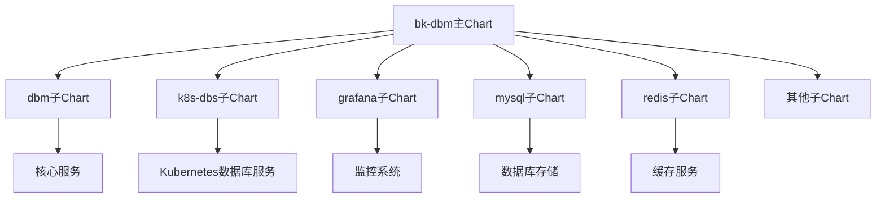
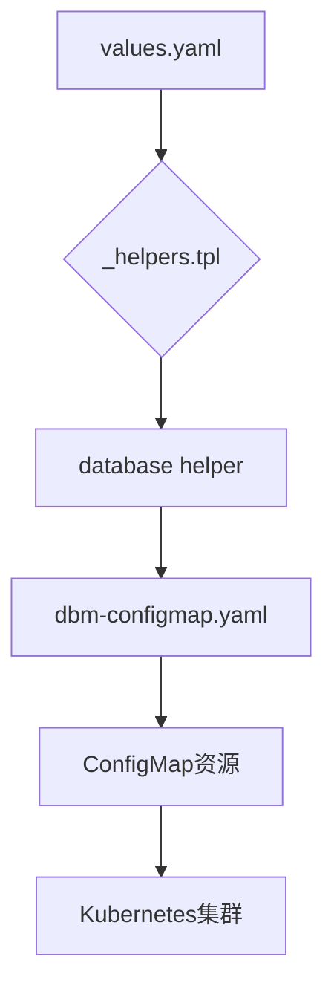

# Helm部署与配置

<cite>
**本文档引用的文件**
- [Chart.yaml](file://helm-charts/bk-dbm/Chart.yaml)
- [values.yaml](file://helm-charts/bk-dbm/values.yaml)
- [NOTES.txt](file://helm-charts/bk-dbm/templates/NOTES.txt)
- [_helpers.tpl](file://helm-charts/bk-dbm/templates/_helpers.tpl)
- [dbm-configmap.yaml](file://helm-charts/bk-dbm/templates/configmaps/dbm-configmap.yaml)
- [k8s-dbs/values.yaml](file://helm-charts/bk-dbm/charts/k8s-dbs/values.yaml)
- [dbm/Chart.yaml](file://helm-charts/bk-dbm/charts/dbm/Chart.yaml)
- [k8s-dbs/Chart.yaml](file://helm-charts/bk-dbm/charts/k8s-dbs/Chart.yaml)
- [k8s-dbs/templates/deployment.yaml](file://helm-charts/bk-dbm/charts/k8s-dbs/templates/deployment.yaml)
- [k8s-dbs/templates/service.yaml](file://helm-charts/bk-dbm/charts/k8s-dbs/templates/service.yaml)
- [k8s-dbs/templates/ingress.yaml](file://helm-charts/bk-dbm/charts/k8s-dbs/templates/ingress.yaml)
- [dbm/templates/_helpers.tpl](file://helm-charts/bk-dbm/charts/dbm/templates/_helpers.tpl)
</cite>

## 目录
1. [简介](#简介)
2. [主Chart结构](#主chart结构)
3. [values.yaml配置详解](#valuesyaml配置详解)
4. [k8s-dbs子Chart配置](#k8sdbs子chart配置)
5. [模板文件与资源生成](#模板文件与资源生成)
6. [部署步骤](#部署步骤)
7. [升级与回滚策略](#升级与回滚策略)
8. [总结](#总结)

## 简介
bk-dbm Helm Chart是一个用于在Kubernetes集群中部署整个DB平台的综合解决方案。该Chart通过整合多个子Chart，实现了对数据库管理平台的完整部署，包括核心服务、数据库组件、监控系统等。本文档将详细介绍该Helm Chart的结构、配置选项以及部署流程。

## 主Chart结构

bk-dbm主Chart的结构设计遵循了模块化和可扩展的原则，通过`Chart.yaml`文件定义了所有依赖的子Chart。主Chart本身不包含具体的部署资源，而是作为一个协调器，管理各个子Chart的部署顺序和配置。



**图表来源**
- [Chart.yaml](file://helm-charts/bk-dbm/Chart.yaml)

**本节来源**
- [Chart.yaml](file://helm-charts/bk-dbm/Chart.yaml)

## values.yaml配置详解

`values.yaml`文件是bk-dbm Chart的核心配置文件，包含了所有可配置的参数。这些参数可以分为几个主要类别：

### 全局配置
全局配置定义了整个部署的通用设置，包括镜像仓库、存储类、域名等。

- **imageRegistry**: 镜像仓库地址，用于拉取所有容器镜像
- **imagePullSecrets**: 镜像拉取密钥，用于访问私有仓库
- **storageClass**: 存储类名称，定义了持久化存储的类型
- **bkDomain**: 蓝鲸主域名，用于外部访问
- **cloudContainer**: 云区域容器化标志，控制是否启用云区域相关组件

### 服务配置
每个子Chart都有自己的配置部分，以`dbm`、`dbconfig`、`dbpriv`等开头。

- **enabled**: 布尔值，控制该子Chart是否启用
- **replicaCount**: 副本数量，定义了Deployment的副本数
- **image**: 镜像配置，包括registry、repository和tag
- **resources**: 资源限制，定义了CPU和内存的requests和limits
- **envs**: 环境变量，用于配置应用程序的行为

### 数据库连接配置
数据库连接配置定义了应用程序如何连接到后端数据库。

- **externalDatabase**: 外部数据库配置，包括host、port、username、password等
- **externalRedis**: 外部Redis配置
- **externalEtcd**: 外部etcd配置

### 监控与日志
监控和日志配置用于集成蓝鲸监控平台。

- **serviceMonitor**: 是否启用Prometheus ServiceMonitor
- **bkLogConfig**: 蓝鲸日志采集配置，包括dataId等

**本节来源**
- [values.yaml](file://helm-charts/bk-dbm/values.yaml)

## k8s-dbs子Chart配置

k8s-dbs子Chart是bk-dbm中的关键组件，负责管理Kubernetes上的数据库服务。其配置文件位于`charts/k8s-dbs/values.yaml`，包含了详细的部署选项。

### 基础配置
```yaml
replicaCount: 1
image:
  pullPolicy: IfNotPresent
  registry: "mirrors.tencent.com"
  repository: "build/blueking/k8s-dbs"
  tag: ""
```

- **replicaCount**: 定义了k8s-dbs服务的副本数量
- **image**: 镜像配置，指定了镜像的registry、repository和tag
- **pullPolicy**: 镜像拉取策略，控制何时拉取新镜像

### 资源限制
```yaml
resources:
  limits:
    cpu: 2
    memory: 4Gi
  requests:
    cpu: 1
    memory: 2Gi
```

- **limits**: 定义了容器的最大资源使用量
- **requests**: 定义了容器启动时请求的资源量

### 服务配置
```yaml
server:
  port: 8000
  serviceType: ClusterIP
  timezone: "Asia/Shanghai"
```

- **port**: 服务监听端口
- **serviceType**: Kubernetes服务类型，可选ClusterIP、NodePort或LoadBalancer
- **timezone**: 时区配置

### 数据库连接
```yaml
datasource:
  auth:
    host: ""
    port: 
    user: ""
    password: ""
    dbname: ""
  dbs:
    host: ""
    port: 
    user: ""
    password: ""
    dbname: ""
```

- **auth**: 认证数据库连接配置
- **dbs**: 主数据库连接配置

### 探针配置
```yaml
livenessProbe:
  httpGet:
    path: /v4/dbs/common/health
    port: 8000
  initialDelaySeconds: 30
  periodSeconds: 30
  timeoutSeconds: 5
  failureThreshold: 3

readinessProbe:
  httpGet:
    path: /v4/dbs/common/health
    port: 8000
  initialDelaySeconds: 30
  periodSeconds: 30
  timeoutSeconds: 5
  failureThreshold: 3
```

- **livenessProbe**: 存活探针，用于检测容器是否正常运行
- **readinessProbe**: 就绪探针，用于检测容器是否准备好接收流量

**本节来源**
- [k8s-dbs/values.yaml](file://helm-charts/bk-dbm/charts/k8s-dbs/values.yaml)

## 模板文件与资源生成

Helm模板文件位于`templates/`目录下，使用Go模板语法将`values.yaml`中的配置转换为Kubernetes资源。

### 配置映射（ConfigMap）生成
配置映射用于将应用程序的配置从代码中分离出来。在`templates/configmaps/dbm-configmap.yaml`中，通过模板函数生成了包含数据库连接信息的ConfigMap。



**图表来源**
- [_helpers.tpl](file://helm-charts/bk-dbm/templates/_helpers.tpl)
- [dbm-configmap.yaml](file://helm-charts/bk-dbm/templates/configmaps/dbm-configmap.yaml)

**本节来源**
- [_helpers.tpl](file://helm-charts/bk-dbm/templates/_helpers.tpl)
- [dbm-configmap.yaml](file://helm-charts/bk-dbm/templates/configmaps/dbm-configmap.yaml)

### 部署（Deployment）生成
k8s-dbs子Chart的Deployment模板位于`charts/k8s-dbs/templates/deployment.yaml`，它使用了Bitnami的common库来简化模板编写。

```yaml
apiVersion: apps/v1
kind: Deployment
metadata:
  name: {{ include "k8s-dbs.fullname" . }}
  labels:
    {{- include "k8s-dbs.labels" . | nindent 4 }}
spec:
  replicas: {{ .Values.replicaCount }}
  selector:
    matchLabels:
      {{- include "k8s-dbs.selectorLabels" . | nindent 6 }}
  template:
    metadata:
      labels:
        {{- include "k8s-dbs.selectorLabels" . | nindent 8 }}
    spec:
      containers:
        - name: {{ .Chart.Name }}
          image: "{{ .Values.image.registry }}/{{ .Values.image.repository }}:{{ .Values.image.tag }}"
          imagePullPolicy: {{ .Values.image.pullPolicy }}
          ports:
            - name: http
              containerPort: {{ .Values.containerPorts.http }}
              protocol: TCP
          livenessProbe:
            {{- toYaml .Values.livenessProbe | nindent 12 }}
          readinessProbe:
            {{- toYaml .Values.readinessProbe | nindent 12 }}
          resources:
            {{- toYaml .Values.resources | nindent 12 }}
```

### 服务（Service）生成
服务模板定义了如何将Deployment暴露给集群内部或外部。

```yaml
apiVersion: v1
kind: Service
metadata:
  name: {{ include "k8s-dbs.fullname" . }}
  labels:
    {{- include "k8s-dbs.labels" . | nindent 4 }}
spec:
  type: {{ .Values.server.serviceType }}
  ports:
    - port: {{ .Values.server.port }}
      targetPort: http
      protocol: TCP
      name: http
  selector:
    {{- include "k8s-dbs.selectorLabels" . | nindent 4 }}
```

### Ingress生成
Ingress模板用于将服务暴露给外部网络。

```yaml
{{- if .Values.ingress.enabled }}
apiVersion: networking.k8s.io/v1
kind: Ingress
metadata:
  name: {{ include "k8s-dbs.fullname" . }}
  labels:
    {{- include "k8s-dbs.labels" . | nindent 4 }}
  {{- with .Values.ingress.annotations }}
  annotations:
    {{- toYaml . | nindent 4 }}
  {{- end }}
spec:
  {{- if .Values.ingress.tls }}
  tls:
    {{- toYaml .Values.ingress.tls | nindent 4 }}
  {{- end }}
  rules:
    {{- range .Values.ingress.hosts }}
    - host: {{ .name }}
      http:
        paths:
          {{- range .paths }}
          - path: {{ .path }}
            pathType: {{ .pathType }}
            backend:
              service:
                name: {{ include "k8s-dbs.fullname" $ }}
                port:
                  number: {{ $.Values.server.port }}
          {{- end }}
    {{- end }}
{{- end }}
```

**本节来源**
- [k8s-dbs/templates/deployment.yaml](file://helm-charts/bk-dbm/charts/k8s-dbs/templates/deployment.yaml)
- [k8s-dbs/templates/service.yaml](file://helm-charts/bk-dbm/charts/k8s-dbs/templates/service.yaml)
- [k8s-dbs/templates/ingress.yaml](file://helm-charts/bk-dbm/charts/k8s-dbs/templates/ingress.yaml)

## 部署步骤

### 前置条件
1. 确保Kubernetes集群正常运行
2. 安装并配置Helm客户端
3. 准备外部数据库（可选）

### 部署流程
1. **克隆代码库**
   ```bash
   git clone https://github.com/TencentBlueKing/blueking-dbm.git
   cd blueking-dbm/helm-charts/bk-dbm
   ```

2. **修改values.yaml**
   根据实际环境修改`values.yaml`文件中的配置，特别是数据库连接信息、域名等。

3. **添加依赖Chart**
   ```bash
   helm dependency update
   ```

4. **部署Chart**
   ```bash
   helm install bk-dbm . -n <namespace> -f values.yaml
   ```

5. **验证部署**
   ```bash
   helm status bk-dbm -n <namespace>
   kubectl get pods -n <namespace>
   ```

### 验证部署
部署完成后，可以通过以下命令验证服务状态：

```bash
# 查看Pod状态
kubectl get pods -n <namespace>

# 查看服务
kubectl get svc -n <namespace>

# 查看部署
kubectl get deployments -n <namespace>

# 查看日志
kubectl logs -l app.kubernetes.io/instance=bk-dbm -n <namespace>
```

**本节来源**
- [values.yaml](file://helm-charts/bk-dbm/values.yaml)
- [Chart.yaml](file://helm-charts/bk-dbm/Chart.yaml)
- [NOTES.txt](file://helm-charts/bk-dbm/templates/NOTES.txt)

## 升级与回滚策略

### 升级流程
1. **备份当前配置**
   ```bash
   helm get values bk-dbm -n <namespace> -o yaml > backup-values.yaml
   ```

2. **更新Chart**
   ```bash
   helm dependency update
   ```

3. **执行升级**
   ```bash
   helm upgrade bk-dbm . -n <namespace> -f values.yaml
   ```

4. **验证升级**
   ```bash
   helm status bk-dbm -n <namespace>
   ```

### 回滚策略
当升级出现问题时，可以使用Helm的回滚功能恢复到之前的版本。

1. **查看历史版本**
   ```bash
   helm history bk-dbm -n <namespace>
   ```

2. **执行回滚**
   ```bash
   helm rollback bk-dbm <revision> -n <namespace>
   ```

3. **验证回滚**
   ```bash
   helm status bk-dbm -n <namespace>
   ```

### 蓝绿部署
对于生产环境，建议使用蓝绿部署策略来减少停机时间。

1. **部署新版本**
   ```bash
   helm install bk-dbm-v2 . -n <namespace> -f values-v2.yaml
   ```

2. **验证新版本**
   ```bash
   helm test bk-dbm-v2 -n <namespace>
   ```

3. **切换流量**
   更新Ingress或Service的selector，将流量切换到新版本。

4. **删除旧版本**
   ```bash
   helm uninstall bk-dbm -n <namespace>
   ```

**本节来源**
- [NOTES.txt](file://helm-charts/bk-dbm/templates/NOTES.txt)
- [values.yaml](file://helm-charts/bk-dbm/values.yaml)

## 总结
bk-dbm Helm Chart提供了一个完整的数据库管理平台部署解决方案。通过合理的Chart结构设计和详细的配置选项，用户可以灵活地定制部署方案。模板文件的使用使得配置管理更加高效和可靠。部署、升级和回滚流程的标准化确保了生产环境的稳定性和可维护性。

**本节来源**
- [Chart.yaml](file://helm-charts/bk-dbm/Chart.yaml)
- [values.yaml](file://helm-charts/bk-dbm/values.yaml)
- [NOTES.txt](file://helm-charts/bk-dbm/templates/NOTES.txt)