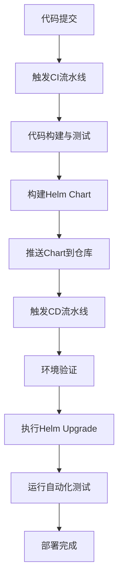

# 部署与运维指南

<cite>
**本文档中引用的文件**  
- [README.md](file://helm-charts/README.md)
- [Chart.yaml](file://helm-charts/bk-dbm/Chart.yaml)
- [values.yaml](file://helm-charts/bk-dbm/values.yaml)
- [NOTES.txt](file://helm-charts/bk-dbm/templates/NOTES.txt)
- [_helpers.tpl](file://helm-charts/bk-dbm/templates/_helpers.tpl)
- [dbm/values.yaml](file://helm-charts/bk-dbm/charts/dbm/values.yaml)
</cite>

## 目录
1. [Helm部署前的环境检查](#helm部署前的环境检查)
2. [Helm部署命令使用](#helm部署命令使用)
3. [部署后验证与NOTES.txt说明](#部署后验证与notestxt说明)
4. [版本升级与回滚操作](#版本升级与回滚操作)
5. [Helm Secrets敏感信息管理](#helm-secrets敏感信息管理)
6. [CI/CD流水线集成](#cicd流水线集成)
7. [最佳实践与风险规避](#最佳实践与风险规避)

## Helm部署前的环境检查

在执行Helm部署之前，必须完成以下环境检查和准备工作：

1. **Kubernetes集群状态检查**：确保Kubernetes集群正常运行，节点状态健康，资源充足。使用`kubectl get nodes`命令验证所有节点处于Ready状态。

2. **Helm客户端安装**：确认Helm CLI工具已正确安装并配置。可通过`helm version`命令验证客户端与Tiller（或Helm 3的等效组件）版本兼容性。

3. **依赖仓库添加**：根据项目要求，添加必要的Helm仓库。在本项目中，需要添加Bitnami和Stakater等第三方仓库：
   ```bash
   helm repo add bitnami https://charts.bitnami.com/bitnami
   helm repo add stakater-charts https://stakater.github.io/stakater-charts
   ```

4. **依赖更新**：在`helm-charts`目录下执行`helm dependency update bk-dbm`命令，确保所有子图表（subchart）依赖项已下载并锁定版本。

5. **命名空间准备**：创建目标命名空间（如`bk-dbm`），并确保有足够的资源配额：
   ```bash
   kubectl create namespace bk-dbm
   ```

6. **存储类配置**：检查集群中是否存在合适的StorageClass，用于持久化存储卷的动态供给。可通过`kubectl get storageclass`命令查看可用的存储类。

7. **镜像仓库访问**：确保Kubernetes节点能够访问`mirrors.tencent.com`等配置的镜像仓库，并在必要时配置imagePullSecrets。

8. **网络策略检查**：验证Ingress控制器是否正常运行，并确保域名解析（如`bkdbm.example.com`）已正确配置指向集群入口。

**Section sources**
- [README.md](file://helm-charts/README.md#L3-L30)
- [values.yaml](file://helm-charts/bk-dbm/values.yaml#L4-L22)

## Helm部署命令使用

Helm部署操作主要通过`helm install`和`helm upgrade`命令完成。以下是具体使用方法：

### Helm Install命令

使用`helm install`命令进行首次部署：

```bash
helm install <release-name> ./bk-dbm \
  -n <namespace> \
  -f ./bk-dbm/values.yaml \
  --create-namespace
```

关键参数说明：
- `<release-name>`：指定发布名称，如`bk-dbm-prod`
- `-n`：指定目标命名空间
- `-f`：指定自定义values文件路径
- `--create-namespace`：如果命名空间不存在则自动创建

### Helm Upgrade命令

使用`helm upgrade`命令进行配置更新或版本升级：

```bash
helm upgrade <release-name> ./bk-dbm \
  -n <namespace> \
  -f ./bk-dbm/values.yaml \
  --install
```

`--install`参数确保如果发布不存在则执行安装，存在则执行升级。

### 部署前渲染验证

在实际部署前，建议先使用`helm template`命令渲染模板并验证：

```bash
helm template ./bk-dbm -f bk-dbm/values.yaml
```

此命令将输出所有将要创建的Kubernetes资源清单，可用于语法检查和逻辑验证。

### 值文件覆盖

可以通过`--set`参数临时覆盖values.yaml中的配置：

```bash
helm upgrade bk-dbm ./bk-dbm \
  -n bk-dbm \
  --set global.bkDomain=prod.example.com \
  --set dbm.ingress.hostname=prod-bkdbm.example.com
```

**Section sources**
- [README.md](file://helm-charts/README.md#L27-L30)
- [values.yaml](file://helm-charts/bk-dbm/values.yaml#L77-L195)
- [Chart.yaml](file://helm-charts/bk-dbm/Chart.yaml#L2-L108)

## 部署后验证与NOTES.txt说明

部署完成后，Helm会自动显示NOTES.txt中的提示信息，指导用户进行后续操作。

### NOTES.txt内容解析

部署成功后显示的NOTES.txt文件包含以下关键信息：

```
感谢安装 蓝鲸数据库管理平台，对应的 Release 为 {{ .Release.Name }}.

同时也可以通过命令行来查看安装状况：

$ helm status {{ .Release.Name }} -n {{ .Release.Namespace }}
$ helm get all {{ .Release.Name }} -n {{ .Release.Namespace }}

如需卸载，请执行：
$ helm uninstall {{ .Release.Name }} -n {{ .Release.Namespace }}
$ kubectl delete pvc -l app.kubernetes.io/instance={{ .Release.Name }} -n {{ .Release.Namespace }}

祝你的蓝鲸体验之旅愉快！
```

### 部署后验证步骤

1. **检查发布状态**：
   ```bash
   helm status <release-name> -n <namespace>
   ```
   确认状态为`deployed`，所有资源创建成功。

2. **查看所有资源**：
   ```bash
   helm get all <release-name> -n <namespace>
   ```
   查看部署的所有Kubernetes资源详情。

3. **验证Pod状态**：
   ```bash
   kubectl get pods -n <namespace> -l app.kubernetes.io/instance=<release-name>
   ```
   确保所有Pod处于Running状态，且就绪探针通过。

4. **访问服务**：
   根据values.yaml中配置的ingress.hostname，通过浏览器访问平台：
   - 前台地址：`http://bkdbm.example.com`
   - 后台API地址：`http://bkdbm-backend-api.example.com`

5. **初始密码**：
   Grafana初始用户名密码在values.yaml中配置：
   ```yaml
   grafana:
     admin:
       user: admin
       password: admin
   ```

6. **配置检查**：
   检查关键配置是否正确应用：
   - 数据库连接信息
   - 外部服务API地址
   - 存储类配置
   - 资源限制和请求

**Section sources**
- [NOTES.txt](file://helm-charts/bk-dbm/templates/NOTES.txt#L1-L13)
- [values.yaml](file://helm-charts/bk-dbm/values.yaml#L340-L354)
- [_helpers.tpl](file://helm-charts/bk-dbm/templates/_helpers.tpl#L68-L88)

## 版本升级与回滚操作

### 版本升级流程

1. **备份当前配置**：
   ```bash
   helm get values <release-name> -n <namespace> -o yaml > backup-values.yaml
   ```

2. **更新Chart版本**：
   修改`Chart.yaml`中的`version`和`appVersion`字段，或更新依赖的子图表版本。

3. **执行升级**：
   ```bash
   helm upgrade <release-name> ./bk-dbm \
     -n <namespace> \
     -f ./bk-dbm/values.yaml
   ```

4. **验证升级结果**：
   检查新版本Pod是否正常启动，服务功能是否正常。

### 回滚操作

当升级出现问题时，可使用`helm rollback`命令回滚到之前的版本：

1. **查看历史版本**：
   ```bash
   helm history <release-name> -n <namespace>
   ```
   此命令列出所有版本变更历史，包括版本号、状态和更新时间。

2. **执行回滚**：
   ```bash
   helm rollback <release-name> <revision> -n <namespace>
   ```
   其中`<revision>`为要回滚到的历史版本号（如1、2等）。

3. **验证回滚结果**：
   ```bash
   helm status <release-name> -n <namespace>
   kubectl get pods -n <namespace>
   ```
   确认系统已恢复到指定版本状态。

### 最佳实践

- **灰度升级**：对于关键服务，建议先在测试环境验证，再逐步推广到生产环境。
- **版本标记**：每次升级前记录当前版本号，便于快速回滚。
- **自动化验证**：结合CI/CD流水线，在升级后自动运行健康检查和功能测试。
- **监控告警**：升级期间加强监控，设置关键指标告警阈值。

**Section sources**
- [Chart.yaml](file://helm-charts/bk-dbm/Chart.yaml#L106-L108)
- [values.yaml](file://helm-charts/bk-dbm/values.yaml#L77-L195)
- [NOTES.txt](file://helm-charts/bk-dbm/templates/NOTES.txt#L8-L9)

## Helm Secrets敏感信息管理

### 敏感信息处理策略

在Helm部署中，敏感信息如数据库密码、API密钥等应通过Secrets进行安全管理。

### 使用外部Secrets

推荐将敏感信息预先创建为Kubernetes Secret，然后在values.yaml中引用：

```yaml
externalDatabase:
  dbm:
    username: bk-dbm
    password: external-db-pwd-example
    host: external-db-host-example
    port: 3306
    name: bk_dbm
```

对应的Secret创建命令：
```bash
kubectl create secret generic db-credentials \
  --from-literal=password=your-actual-password \
  -n bk-dbm
```

### 使用Helm Secrets插件

对于需要加密存储的场景，可使用Helm Secrets插件（基于Mozilla SOPS）：

1. **安装插件**：
   ```bash
   helm plugin install https://github.com/jkroepke/helm-secrets
   ```

2. **加密values文件**：
   ```bash
   helm secrets encrypt values.secret.yaml
   ```

3. **部署时解密**：
   ```bash
   helm secrets upgrade <release-name> ./bk-dbm \
     -n <namespace> \
     -f secrets://values.secret.yaml
   ```

### Bitnami Common库支持

项目中使用的Bitnami Charts通过common库提供了强大的Secrets管理功能：

```yaml
common.secrets.passwords.manage:
  secret: "db-password"
  key: "password"
  providedValues: ["auth.password", "existingSecret.password"]
  length: 10
  strong: true
```

此模板函数按优先级顺序处理密码：
1. 已存在的Secret资源
2. values.yaml中提供的密码
3. 随机生成的新密码

**Section sources**
- [values.yaml](file://helm-charts/bk-dbm/values.yaml#L620-L624)
- [externalDatabase](file://helm-charts/bk-dbm/values.yaml#L713-L792)
- [_secrets.tpl](file://helm-charts/bk-dbm/charts/grafana/charts/common/templates/_secrets.tpl#L60-L85)

## CI/CD流水线集成

### 自动化部署流程

将Helm部署集成到CI/CD流水线中，实现从代码提交到生产部署的自动化：



### GitOps实践

采用GitOps模式管理部署，将values.yaml文件存储在Git仓库中：

1. **环境分支策略**：
   - `main`：生产环境配置
   - `staging`：预发布环境配置
   - `develop`：开发环境配置

2. **自动化同步**：
   使用ArgoCD或Flux等工具监控Git仓库变化，自动同步到Kubernetes集群。

### 流水线脚本示例

```bash
#!/bin/bash
# deploy.sh

set -e

RELEASE_NAME="bk-dbm"
NAMESPACE="bk-dbm"
CHART_PATH="./helm-charts/bk-dbm"
VALUES_FILE="./helm-charts/bk-dbm/values-${ENV}.yaml"

# 1. 依赖更新
helm dependency update ${CHART_PATH}

# 2. 渲染模板并验证
helm template ${RELEASE_NAME} ${CHART_PATH} -f ${VALUES_FILE} > rendered.yaml
kubectl apply -f rendered.yaml --dry-run=client

# 3. 执行部署
helm upgrade ${RELEASE_NAME} ${CHART_PATH} \
  -n ${NAMESPACE} \
  -f ${VALUES_FILE} \
  --install \
  --create-namespace \
  --wait

# 4. 验证部署
helm test ${RELEASE_NAME} -n ${NAMESPACE}
```

### 与蓝鲸体系集成

结合蓝鲸CI/CD能力，实现：
- 通过蓝鲸作业平台执行部署任务
- 使用蓝鲸配置平台管理环境变量
- 集成蓝鲸监控告警系统
- 记录部署日志到蓝鲸日志平台

**Section sources**
- [values.yaml](file://helm-charts/bk-dbm/values.yaml#L77-L195)
- [Chart.yaml](file://helm-charts/bk-dbm/Chart.yaml#L2-L108)
- [README.md](file://helm-charts/README.md#L27-L30)

## 最佳实践与风险规避

### 部署最佳实践

1. **分环境管理**：为开发、测试、预发布、生产环境维护独立的values文件。
2. **版本控制**：将Chart和values文件纳入Git版本控制，记录每次变更。
3. **资源限制**：为所有Pod设置合理的资源请求和限制，避免资源争用。
4. **健康检查**：配置完善的liveness和readiness探针，确保服务自愈能力。
5. **备份策略**：定期备份数据库和关键配置，确保可恢复性。

### 风险规避策略

1. **变更窗口**：在业务低峰期执行重大变更，减少对用户影响。
2. **蓝绿部署**：对于关键服务，采用蓝绿部署模式，实现零停机升级。
3. **金丝雀发布**：先在小部分用户中验证新版本，再逐步扩大范围。
4. **回滚预案**：每次升级前制定详细的回滚计划，确保能在5分钟内恢复。
5. **监控覆盖**：确保所有关键指标都有监控和告警，及时发现异常。

### 安全建议

1. **最小权限原则**：为ServiceAccount分配最小必要权限。
2. **网络策略**：配置NetworkPolicy，限制Pod间不必要的网络通信。
3. **镜像安全**：使用可信的基础镜像，定期扫描漏洞。
4. **审计日志**：启用Kubernetes审计日志，记录所有敏感操作。
5. **定期轮换**：定期轮换证书和密钥，降低泄露风险。

**Section sources**
- [values.yaml](file://helm-charts/bk-dbm/values.yaml#L109-L107)
- [dbm/values.yaml](file://helm-charts/bk-dbm/charts/dbm/values.yaml#L22-L73)
- [_helpers.tpl](file://helm-charts/bk-dbm/templates/_helpers.tpl#L127-L139)