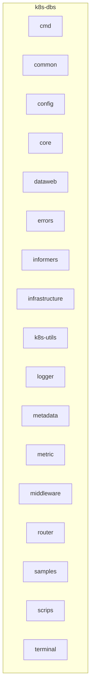
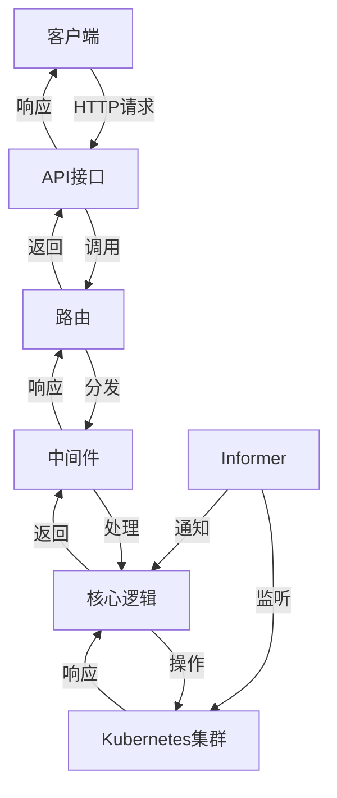
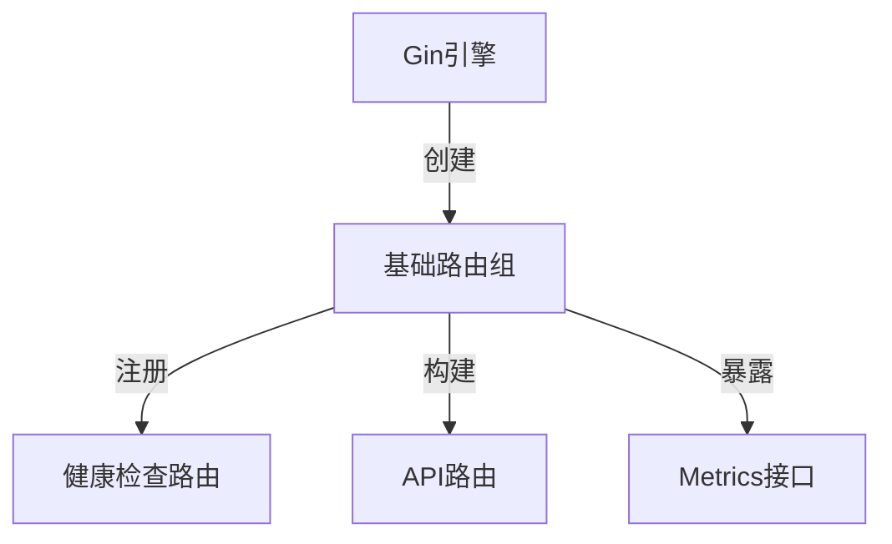
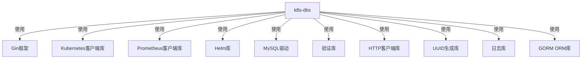

# Kubernetes集成

<cite>
**本文档引用文件**   
- [k8s-dbs/README.md](file://dbm-services/k8s-dbs/README.md)
- [k8s-dbs/cmd/server.go](file://dbm-services/k8s-dbs/cmd/server.go)
- [k8s-dbs/go.mod](file://dbm-services/k8s-dbs/go.mod)
- [k8s-dbs/core/init.go](file://dbm-services/k8s-dbs/core/init.go)
- [k8s-dbs/router/router.go](file://dbm-services/k8s-dbs/router/router.go)
- [k8s-dbs/informers/informer.go](file://dbm-services/k8s-dbs/informers/informer.go)
- [k8s-dbs/middleware/middleware_helper.go](file://dbm-services/k8s-dbs/middleware/middleware_helper.go)
- [k8s-dbs/core/entity/crd.go](file://dbm-services/k8s-dbs/core/entity/crd.go)
- [k8s-dbs/core/provider/cluster_provider.go](file://dbm-services/k8s-dbs/core/provider/cluster_provider.go)
- [k8s-dbs/metadata/entity/k8s_cluster_config_entity.go](file://dbm-services/k8s-dbs/metadata/entity/k8s_cluster_config_entity.go)
- [helm-charts/bk-dbm/Chart.yaml](file://helm-charts/bk-dbm/Chart.yaml)
- [helm-charts/bk-dbm/values.yaml](file://helm-charts/bk-dbm/values.yaml)
</cite>

## 目录
1. [简介](#简介)
2. [项目结构](#项目结构)
3. [核心组件](#核心组件)
4. [架构概述](#架构概述)
5. [详细组件分析](#详细组件分析)
6. [依赖分析](#依赖分析)
7. [性能考虑](#性能考虑)
8. [故障排查指南](#故障排查指南)
9. [结论](#结论)

## 简介
k8s-dbs服务是基于Go客户端和KubeBlocks API构建的数据库管控服务，使用Gin框架开发。该服务提供了一系列RESTful API，允许用户在Kubernetes集群中基于KubeBlocks组件轻松部署、管理和操作数据库集群。主要功能包括数据库集群的创建、删除、缩放、启动、停止、重启和升级等。通过自定义资源定义（CRD）和Operator模式，实现了数据库的全生命周期管理，并结合Helm Chart进行部署。

## 项目结构
k8s-dbs服务的项目结构清晰地组织了各个功能模块，包括命令行接口、通用工具、配置管理、核心逻辑、数据访问、错误处理、中间件、路由、日志记录、元数据管理、指标监控、提供者接口、终端接口等。此外，还包括了脚本、示例和测试文件，确保了项目的可维护性和扩展性。

**图源**
- [k8s-dbs](file://dbm-services/k8s-dbs)

**章节源**
- [k8s-dbs](file://dbm-services/k8s-dbs)

## 核心组件
k8s-dbs服务的核心组件包括服务启动、初始化、路由构建、中间件注册、Informer启动等。这些组件协同工作，确保服务能够正确地与Kubernetes集群交互，执行数据库管理任务。

**章节源**
- [k8s-dbs/cmd/server.go](file://dbm-services/k8s-dbs/cmd/server.go)
- [k8s-dbs/core/init.go](file://dbm-services/k8s-dbs/core/init.go)
- [k8s-dbs/router/router.go](file://dbm-services/k8s-dbs/router/router.go)
- [k8s-dbs/middleware/middleware_helper.go](file://dbm-services/k8s-dbs/middleware/middleware_helper.go)
- [k8s-dbs/informers/informer.go](file://dbm-services/k8s-dbs/informers/informer.go)

## 架构概述
k8s-dbs服务采用微服务架构，通过RESTful API与外部系统交互，内部通过Gin框架处理HTTP请求，利用Informer监听Kubernetes资源的变化，通过中间件实现日志记录、认证授权、性能监控等功能。服务启动时，会初始化数据库连接，构建路由，注册中间件，并启动Informer以监听资源变化。

**图源**
- [k8s-dbs/cmd/server.go](file://dbm-services/k8s-dbs/cmd/server.go)
- [k8s-dbs/router/router.go](file://dbm-services/k8s-dbs/router/router.go)
- [k8s-dbs/middleware/middleware_helper.go](file://dbm-services/k8s-dbs/middleware/middleware_helper.go)
- [k8s-dbs/informers/informer.go](file://dbm-services/k8s-dbs/informers/informer.go)

## 详细组件分析
### 服务启动
服务启动时，首先初始化核心配置，然后创建并配置Gin路由引擎，注册中间件，构建路由，启动Informer，最后启动HTTP服务并监听终止信号。在接收到终止信号时，优雅关闭服务器。

**章节源**
- [k8s-dbs/cmd/server.go](file://dbm-services/k8s-dbs/cmd/server.go)

### 初始化
初始化过程中，服务会建立与MySQL数据库的连接，这是后续所有操作的基础。如果初始化失败，服务将无法正常运行。

**章节源**
- [k8s-dbs/core/init.go](file://dbm-services/k8s-dbs/core/init.go)

### 路由构建
路由构建过程中，服务会创建一个基础路径为`/v4/dbs`的路由组，注册健康检查路由，构建API路由，并暴露Prometheus标准metrics接口。

**图源**
- [k8s-dbs/router/router.go](file://dbm-services/k8s-dbs/router/router.go)

**章节源**
- [k8s-dbs/router/router.go](file://dbm-services/k8s-dbs/router/router.go)

### 中间件
中间件负责日志记录、认证授权、性能监控等非业务功能。服务启动时会注册这些中间件，确保每个请求都能被正确处理。

**章节源**
- [k8s-dbs/middleware/middleware_helper.go](file://dbm-services/k8s-dbs/middleware/middleware_helper.go)

### Informer
Informer用于监听Kubernetes资源的变化，当资源发生变化时，会触发相应的处理逻辑。服务启动时会启动Informer，确保能够及时响应资源变化。

**章节源**
- [k8s-dbs/informers/informer.go](file://dbm-services/k8s-dbs/informers/informer.go)

## 依赖分析
k8s-dbs服务依赖于多个外部库，包括Gin框架、Kubernetes客户端库、Prometheus客户端库、Helm库等。这些库提供了必要的功能，使得服务能够与Kubernetes集群交互，实现数据库管理功能。

**图源**
- [k8s-dbs/go.mod](file://dbm-services/k8s-dbs/go.mod)

**章节源**
- [k8s-dbs/go.mod](file://dbm-services/k8s-dbs/go.mod)

## 性能考虑
为了提高性能，k8s-dbs服务采用了多种优化措施，包括使用Informer监听资源变化，减少不必要的API调用；使用中间件实现日志记录和性能监控，帮助开发者快速定位问题；使用GORM ORM库简化数据库操作，提高开发效率。

## 故障排查指南
当遇到问题时，可以按照以下步骤进行排查：
1. 检查服务是否正常启动，查看日志输出。
2. 检查数据库连接是否正常，确认数据库服务是否可用。
3. 检查Kubernetes集群状态，确认集群是否正常运行。
4. 检查Informer是否正常工作，确认资源变化是否被正确监听。
5. 检查中间件配置，确认日志记录、认证授权、性能监控等功能是否正常。

**章节源**
- [k8s-dbs/cmd/server.go](file://dbm-services/k8s-dbs/cmd/server.go)
- [k8s-dbs/core/init.go](file://dbm-services/k8s-dbs/core/init.go)
- [k8s-dbs/router/router.go](file://dbm-services/k8s-dbs/router/router.go)
- [k8s-dbs/middleware/middleware_helper.go](file://dbm-services/k8s-dbs/middleware/middleware_helper.go)
- [k8s-dbs/informers/informer.go](file://dbm-services/k8s-dbs/informers/informer.go)

## 结论
k8s-dbs服务通过自定义资源定义（CRD）和Operator模式，实现了数据库的全生命周期管理。结合Helm Chart进行部署，简化了安装和配置过程。服务采用微服务架构，通过RESTful API与外部系统交互，内部通过Gin框架处理HTTP请求，利用Informer监听Kubernetes资源的变化，通过中间件实现日志记录、认证授权、性能监控等功能。整体设计合理，功能完善，能够满足数据库管理的需求。