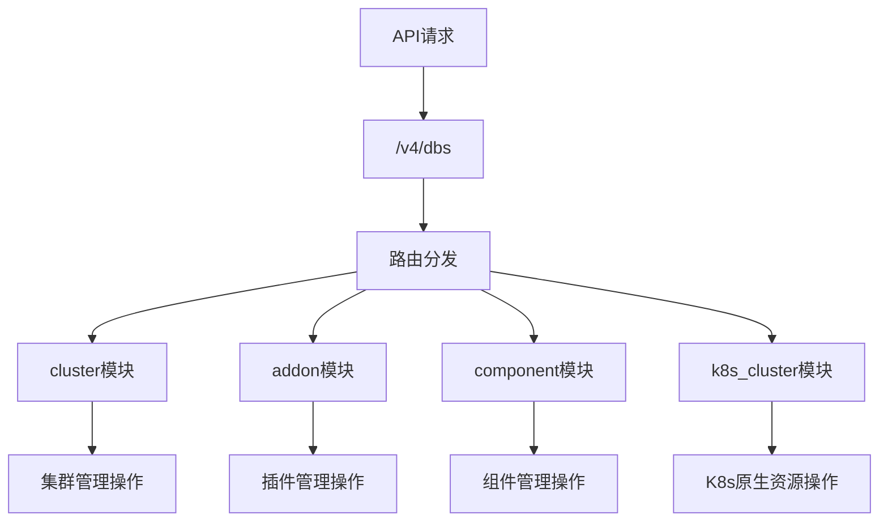
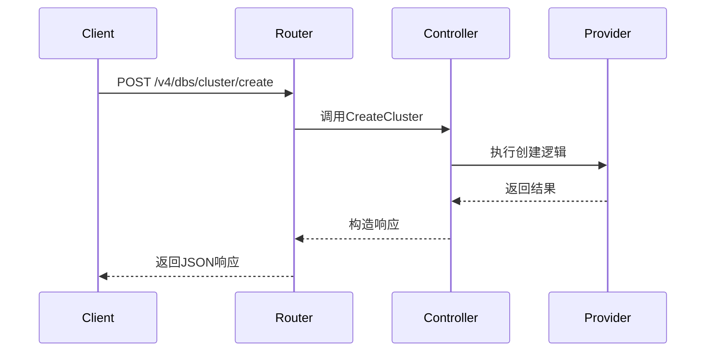
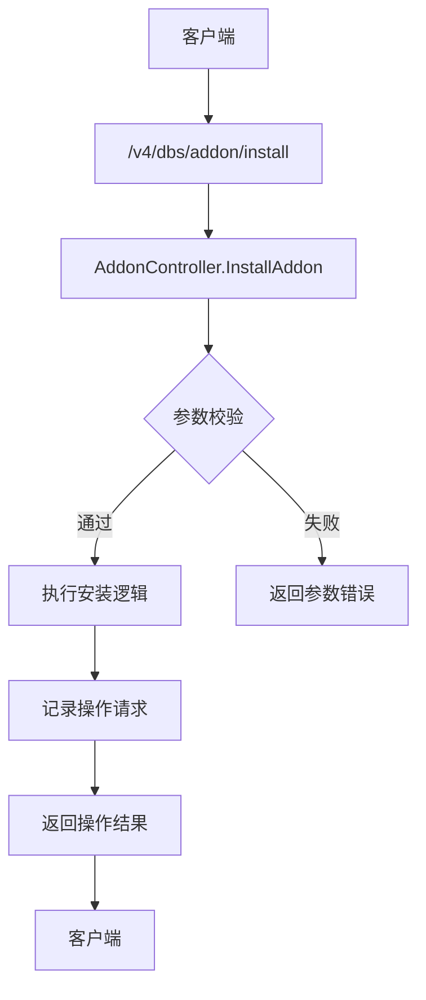
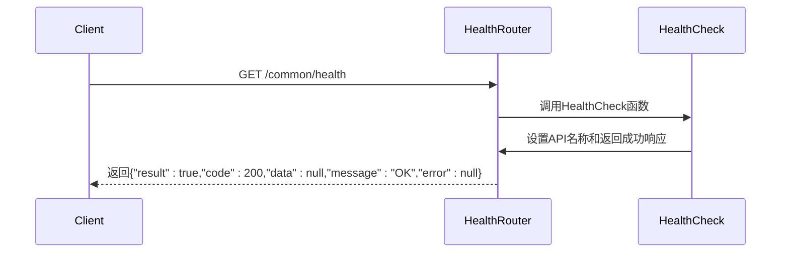

# API接口与路由

<cite>
**本文档引用的文件**
- [cluster.go](file://dbm-services/k8s-dbs/router/core/cluster.go)
- [addon.go](file://dbm-services/k8s-dbs/router/core/addon.go)
- [component.go](file://dbm-services/k8s-dbs/router/core/component.go)
- [k8s_cluster.go](file://dbm-services/k8s-dbs/router/core/k8s_cluster.go)
- [health_check.go](file://dbm-services/k8s-dbs/common/api/health_check.go)
- [response.go](file://dbm-services/k8s-dbs/common/api/response.go)
- [router_util.go](file://dbm-services/k8s-dbs/router/util/router_util.go)
- [api_url_mapping_const.go](file://dbm-services/k8s-dbs/common/constant/api_url_mapping_const.go)
</cite>

## 目录
1. [简介](#简介)
2. [API版本控制与URL映射](#api版本控制与url映射)
3. [统一响应格式](#统一响应格式)
4. [核心API端点文档](#核心api端点文档)
5. [健康检查接口](#健康检查接口)
6. [错误处理说明](#错误处理说明)

## 简介
k8s-dbs服务提供了一套完整的Kubernetes集群管理RESTful API，支持集群、组件、插件和K8s原生资源的全生命周期管理。所有API均通过Gin框架实现，遵循统一的路由注册机制和响应格式规范。本文档详细说明了所有核心API端点的使用方法、参数结构和响应格式。

**Section sources**
- [cluster.go](file://dbm-services/k8s-dbs/router/core/cluster.go#L1-L129)
- [addon.go](file://dbm-services/k8s-dbs/router/core/addon.go#L1-L80)

## API版本控制与URL映射
k8s-dbs服务采用基于路径的API版本控制策略，所有API均位于`/v4/dbs`基础路径下。该基础路径在`router.go`文件中定义，确保了API版本的统一管理和演进。

URL映射常量定义在`api_url_mapping_const.go`文件中，通过常量管理所有API路径，避免了硬编码，提高了代码的可维护性。路由注册采用注册器模式，通过`RegisterAPIRouterBuilder`函数注册各个模块的路由构建器，实现了路由的模块化和可扩展性。



**Diagram sources**
- [router.go](file://dbm-services/k8s-dbs/router/router.go#L33-L54)
- [api_url_mapping_const.go](file://dbm-services/k8s-dbs/common/constant/api_url_mapping_const.go)

**Section sources**
- [router.go](file://dbm-services/k8s-dbs/router/router.go#L33-L54)
- [api_url_mapping_const.go](file://dbm-services/k8s-dbs/common/constant/api_url_mapping_const.go)

## 统一响应格式
所有API响应均遵循统一的JSON格式，由`response.go`文件中的`Response`结构体定义。该设计确保了客户端能够以一致的方式处理成功和失败响应。

响应结构包含以下字段：
- `result`: 布尔值，表示请求是否成功
- `code`: 响应状态码
- `data`: 成功时的返回数据
- `message`: 响应消息
- `error`: 错误详情（失败时）

成功响应使用`SuccessResponse`函数生成，失败响应使用`ErrorResponse`函数生成。错误处理还包含`HandleValidationError`函数，专门处理参数校验错误。

```mermaid
classDiagram
class Response {
+bool result
+ResponseCode code
+interface{} data
+string message
+interface{} error
}
class ResponseFunctions {
+SuccessResponse(ctx *gin.Context, data interface{}, message string)
+ErrorResponse(ctx *gin.Context, err error)
+HandleValidationError(ctx *gin.Context, err error, request any)
}
Response <-- ResponseFunctions : "使用"
```

**Diagram sources**
- [response.go](file://dbm-services/k8s-dbs/common/api/response.go#L33-L93)

**Section sources**
- [response.go](file://dbm-services/k8s-dbs/common/api/response.go#L33-L93)

## 核心API端点文档
### 集群管理API
集群管理API提供集群的创建、更新、删除和查询功能，以及集群操作请求的管理。



**Diagram sources**
- [cluster.go](file://dbm-services/k8s-dbs/router/core/cluster.go#L34-L63)
- [cluster_controller.go](file://dbm-services/k8s-dbs/core/api/controller/cluster_controller.go)

**Section sources**
- [cluster.go](file://dbm-services/k8s-dbs/router/core/cluster.go#L34-L63)

#### 集群管理端点
| HTTP方法 | URL路径 | 功能描述 | 请求体结构 | 响应格式 | 状态码 |
|---------|--------|---------|----------|---------|--------|
| POST | /cluster/create | 创建集群 | ClusterCreateRequest | ClusterInfo | 200 |
| POST | /cluster/update | 更新集群 | ClusterUpdateRequest | ClusterInfo | 200 |
| POST | /cluster/partial_update | 部分更新集群 | ClusterPartialUpdateRequest | ClusterInfo | 200 |
| POST | /cluster/delete | 删除集群 | ClusterDeleteRequest | OperationResult | 200 |
| POST | /cluster/describe | 查询集群详情 | ClusterDescribeRequest | ClusterInfo | 200 |
| GET | /cluster/services | 获取集群服务列表 | 无 | ServiceList | 200 |
| POST | /cluster/status | 获取集群状态 | ClusterStatusRequest | ClusterStatus | 200 |
| POST | /cluster/event | 获取集群事件 | ClusterEventRequest | EventList | 200 |

### 插件管理API
插件管理API提供存储插件的安装、卸载和升级功能。



**Diagram sources**
- [addon.go](file://dbm-services/k8s-dbs/router/core/addon.go#L34-L42)
- [addon_controller.go](file://dbm-services/k8s-dbs/core/api/controller/addon_controller.go)

**Section sources**
- [addon.go](file://dbm-services/k8s-dbs/router/core/addon.go#L34-L42)

#### 插件管理端点
| HTTP方法 | URL路径 | 功能描述 | 请求体结构 | 响应格式 | 状态码 |
|---------|--------|---------|----------|---------|--------|
| POST | /addon/install | 安装插件 | AddonInstallRequest | OperationResult | 200 |
| POST | /addon/uninstall | 卸载插件 | AddonUninstallRequest | OperationResult | 200 |
| POST | /addon/upgrade | 升级插件 | AddonUpgradeRequest | OperationResult | 200 |

### 组件管理API
组件管理API提供组件的查询和状态获取功能。

**Section sources**
- [component.go](file://dbm-services/k8s-dbs/router/core/component.go#L30-L38)

#### 组件管理端点
| HTTP方法 | URL路径 | 功能描述 | 请求体结构 | 响应格式 | 状态码 |
|---------|--------|---------|----------|---------|--------|
| POST | /component/describe | 查询组件详情 | ComponentDescribeRequest | ComponentInfo | 200 |
| GET | /component/services | 获取组件服务 | 无 | ServiceList | 200 |
| GET | /component/pods | 列出组件Pod | 无 | PodList | 200 |

### 集群操作API
集群操作API提供集群的垂直/水平扩展、启停、重启、升级等运维操作。

**Section sources**
- [cluster.go](file://dbm-services/k8s-dbs/router/core/cluster.go#L51-L63)

#### 集群操作端点
| HTTP方法 | URL路径 | 功能描述 | 请求体结构 | 响应格式 | 状态码 |
|---------|--------|---------|----------|---------|--------|
| POST | /opsRequest/vscaling | 垂直扩展 | VerticalScalingRequest | OperationResult | 200 |
| POST | /opsRequest/hscaling | 水平扩展 | HorizontalScalingRequest | OperationResult | 200 |
| POST | /opsRequest/start | 启动集群 | StartClusterRequest | OperationResult | 200 |
| POST | /opsRequest/stop | 停止集群 | StopClusterRequest | OperationResult | 200 |
| POST | /opsRequest/restart | 重启集群 | RestartClusterRequest | OperationResult | 200 |
| POST | /opsRequest/upgrade | 升级集群 | UpgradeClusterRequest | OperationResult | 200 |
| POST | /opsRequest/vexpansion | 卷扩容 | VolumeExpansionRequest | OperationResult | 200 |
| POST | /opsRequest/expose | 暴露集群 | ExposeClusterRequest | OperationResult | 200 |
| POST | /opsRequest/describe | 查询操作请求 | DescribeOpsRequest | OpsRequestInfo | 200 |
| POST | /opsRequest/status | 查询操作状态 | GetOpsRequestStatus | OpsRequestStatus | 200 |

### K8s集群管理API
K8s集群管理API提供对K8s原生资源的操作能力。

**Section sources**
- [k8s_cluster.go](file://dbm-services/k8s-dbs/router/core/k8s_cluster.go#L34-L48)

#### K8s集群管理端点
| HTTP方法 | URL路径 | 功能描述 | 请求体结构 | 响应格式 | 状态码 |
|---------|--------|---------|----------|---------|--------|
| POST | /k8s_cluster/namespace | 创建命名空间 | CreateNamespaceRequest | OperationResult | 200 |
| GET | /k8s_cluster/pod/logs | 获取Pod日志 | 无 | LogContent | 200 |
| GET | /k8s_cluster/pod/rawlogs | 获取Pod原始日志 | 无 | RawLogContent | 200 |
| GET | /k8s_cluster/pod | 获取Pod详情 | 无 | PodInfo | 200 |
| POST | /k8s_cluster/pod/delete | 删除Pod | DeletePodRequest | OperationResult | 200 |

## 健康检查接口
健康检查接口是服务可用性监控的关键组件，实现于`health_check.go`文件中。该接口位于`/common/health`路径，返回简单的"OK"响应，用于Kubernetes的liveness和readiness探针。

健康检查路由通过`BuildHealthRouter`函数在`router_util.go`中注册，确保了所有服务实例都能提供一致的健康检查端点。该设计解耦了健康检查逻辑与业务逻辑，提高了系统的可维护性。



**Diagram sources**
- [health_check.go](file://dbm-services/k8s-dbs/common/api/health_check.go#L28-L34)
- [router_util.go](file://dbm-services/k8s-dbs/router/util/router_util.go#L181-L184)

**Section sources**
- [health_check.go](file://dbm-services/k8s-dbs/common/api/health_check.go#L28-L34)
- [router_util.go](file://dbm-services/k8s-dbs/router/util/router_util.go#L181-L184)

## 错误处理说明
k8s-dbs服务采用分层错误处理机制，确保客户端能够获得清晰的错误信息。错误处理主要通过`ErrorResponse`和`HandleValidationError`函数实现。

当发生错误时，系统会判断错误类型：如果是`K8sDbsError`类型，则使用预定义的错误码和消息；否则返回500内部错误。参数校验错误通过`HandleValidationError`函数专门处理，提供详细的校验失败信息。

错误响应包含`message`和`error`字段，前者提供用户友好的错误描述，后者提供技术细节，便于问题排查。这种设计既保证了用户体验，又提供了足够的调试信息。

**Section sources**
- [response.go](file://dbm-services/k8s-dbs/common/api/response.go#L58-L92)
- [errors.go](file://dbm-services/k8s-dbs/errors/error.go)