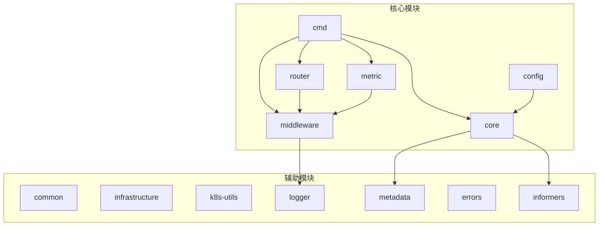
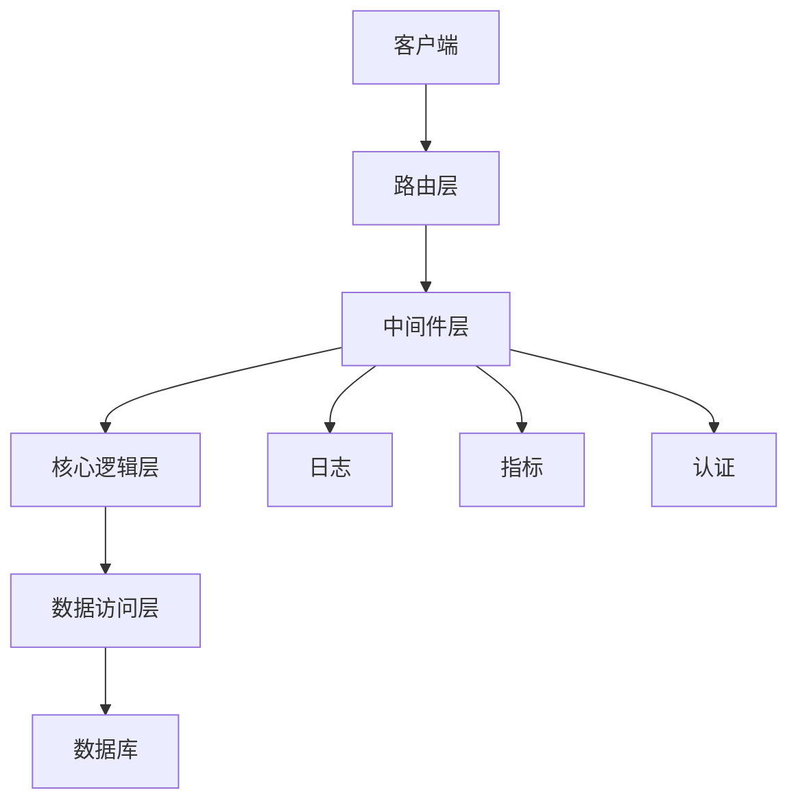
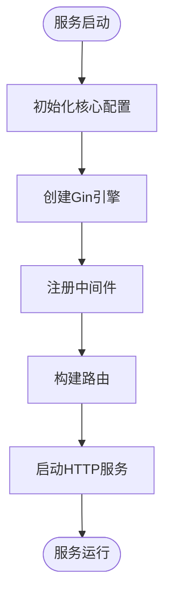
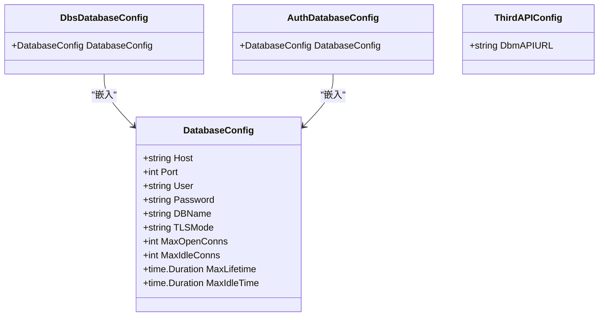
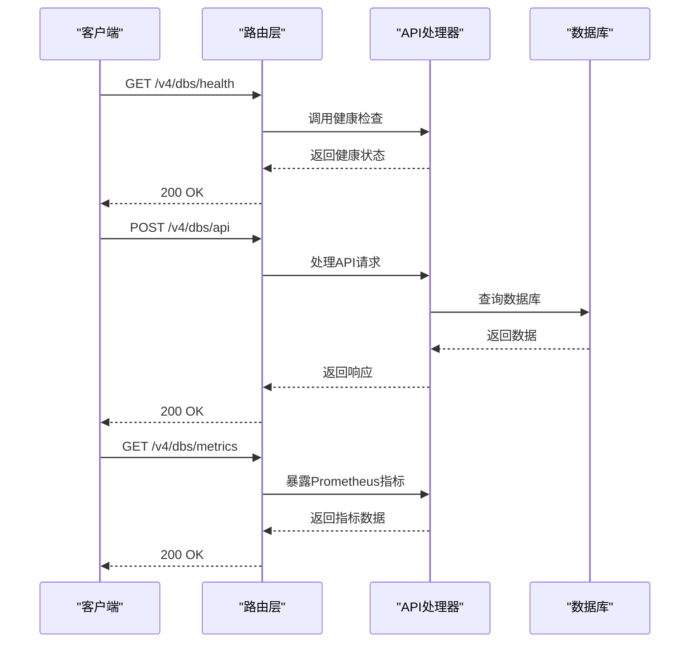
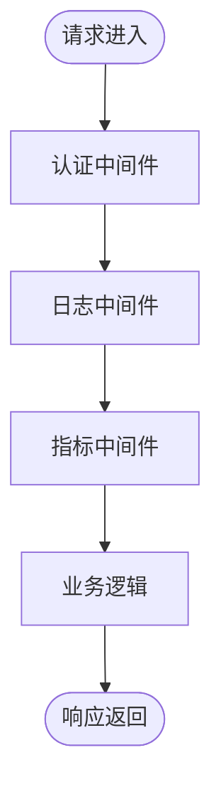
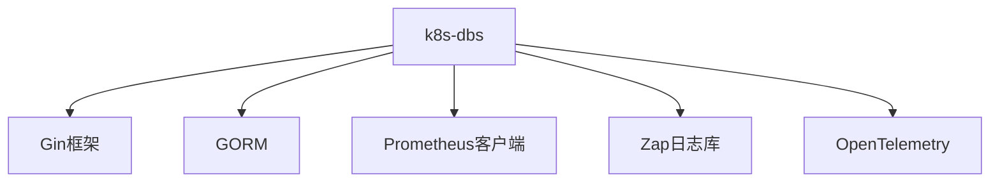

# k8s-dbs服务

<cite>
**本文档引用文件**  
- [server.go](file://dbm-services/k8s-dbs/cmd/server.go)
- [dbs_db_config.go](file://dbm-services/k8s-dbs/config/dbs_db_config.go)
- [thirdapi_config.go](file://dbm-services/k8s-dbs/config/thirdapi_config.go)
- [router.go](file://dbm-services/k8s-dbs/router/router.go)
- [init.go](file://dbm-services/k8s-dbs/core/init.go)
- [api_auth_middleware.go](file://dbm-services/k8s-dbs/middleware/api_auth_middleware.go)
- [api_log_middleware.go](file://dbm-services/k8s-dbs/middleware/api_log_middleware.go)
- [api_metric_middleware.go](file://dbm-services/k8s-dbs/middleware/api_metric_middleware.go)
- [middleware_helper.go](file://dbm-services/k8s-dbs/middleware/middleware_helper.go)
- [router_util.go](file://dbm-services/k8s-dbs/router/util/router_util.go)
- [metric_factory.go](file://dbm-services/k8s-dbs/metric/metric_factory.go)
- [metric_helper.go](file://dbm-services/k8s-dbs/metric/metric_helper.go)
</cite>

## 目录
1. [简介](#简介)
2. [项目结构](#项目结构)
3. [核心组件](#核心组件)
4. [架构概述](#架构概述)
5. [详细组件分析](#详细组件分析)
6. [依赖分析](#依赖分析)
7. [性能考虑](#性能考虑)
8. [故障排除指南](#故障排除指南)
9. [结论](#结论)

## 简介
k8s-dbs服务是蓝鲸智云-DB管理系统中的核心组件，专为Kubernetes环境下的数据库管控而设计。该服务基于Gin框架构建RESTful API，实现了对数据库实例的声明式管理。通过与Kubernetes API的深度集成，k8s-dbs服务能够高效地管理数据库集群的生命周期，包括创建、配置、监控和维护等操作。服务采用模块化设计，包含配置管理、中间件处理、路由控制和指标收集等多个功能模块，确保了系统的可扩展性和稳定性。

## 项目结构
k8s-dbs服务的项目结构清晰，各模块职责分明。主要目录包括cmd、config、core、router、middleware、metric等，分别负责服务启动、配置管理、核心逻辑、路由控制、中间件处理和指标收集等功能。这种结构有利于代码的维护和扩展，同时也便于团队协作开发。

**图源**  
- [server.go](file://dbm-services/k8s-dbs/cmd/server.go#L1-L110)
- [dbs_db_config.go](file://dbm-services/k8s-dbs/config/dbs_db_config.go#L1-L47)
- [init.go](file://dbm-services/k8s-dbs/core/init.go#L1-L45)

**本节来源**  
- [server.go](file://dbm-services/k8s-dbs/cmd/server.go#L1-L110)
- [dbs_db_config.go](file://dbm-services/k8s-dbs/config/dbs_db_config.go#L1-L47)
- [thirdapi_config.go](file://dbm-services/k8s-dbs/config/thirdapi_config.go#L1-L26)

## 核心组件
k8s-dbs服务的核心组件包括服务启动、配置管理、路由控制、中间件处理和指标收集。这些组件协同工作，确保服务的正常运行和高效管理。

**本节来源**  
- [server.go](file://dbm-services/k8s-dbs/cmd/server.go#L1-L110)
- [init.go](file://dbm-services/k8s-dbs/core/init.go#L1-L45)
- [router.go](file://dbm-services/k8s-dbs/router/router.go#L1-L55)

## 架构概述
k8s-dbs服务采用分层架构设计，主要包括服务层、路由层、中间件层、核心逻辑层和数据访问层。服务层负责启动和停止服务，路由层负责处理HTTP请求，中间件层负责认证、日志和指标收集，核心逻辑层负责业务逻辑处理，数据访问层负责与数据库交互。

**图源**  
- [server.go](file://dbm-services/k8s-dbs/cmd/server.go#L1-L110)
- [router.go](file://dbm-services/k8s-dbs/router/router.go#L1-L55)
- [middleware_helper.go](file://dbm-services/k8s-dbs/middleware/middleware_helper.go#L1-L84)

**本节来源**  
- [server.go](file://dbm-services/k8s-dbs/cmd/server.go#L1-L110)
- [router.go](file://dbm-services/k8s-dbs/router/router.go#L1-L55)
- [middleware_helper.go](file://dbm-services/k8s-dbs/middleware/middleware_helper.go#L1-L84)

## 详细组件分析
### 服务启动流程
k8s-dbs服务的启动流程包括初始化核心配置、创建Gin路由引擎、注册中间件、构建路由和启动HTTP服务。服务通过`main`函数启动，首先调用`core.Init()`初始化核心配置，然后创建Gin引擎并注册中间件，接着构建路由，最后启动HTTP服务并监听终止信号。

**图源**  
- [server.go](file://dbm-services/k8s-dbs/cmd/server.go#L48-L109)

**本节来源**  
- [server.go](file://dbm-services/k8s-dbs/cmd/server.go#L48-L109)

### 配置管理
k8s-dbs服务的配置管理通过`dbs_db_config.go`和`thirdapi_config.go`两个文件实现。`dbs_db_config.go`定义了数据库配置结构体，包括主机、端口、用户、密码等信息，通过环境变量注入。`thirdapi_config.go`定义了第三方API配置，如DBM API的URL。

**图源**  
- [dbs_db_config.go](file://dbm-services/k8s-dbs/config/dbs_db_config.go#L24-L47)
- [thirdapi_config.go](file://dbm-services/k8s-dbs/config/thirdapi_config.go#L23-L26)

**本节来源**  
- [dbs_db_config.go](file://dbm-services/k8s-dbs/config/dbs_db_config.go#L24-L47)
- [thirdapi_config.go](file://dbm-services/k8s-dbs/config/thirdapi_config.go#L23-L26)

### RESTful API设计
k8s-dbs服务基于Gin框架设计RESTful API，通过`router.go`文件定义路由规则。服务支持健康检查、API路由和Prometheus指标暴露。路由通过`BuildRouter`函数构建，注册了健康检查路由、API路由和指标路由。

**图源**  
- [router.go](file://dbm-services/k8s-dbs/router/router.go#L33-L54)
- [router_util.go](file://dbm-services/k8s-dbs/router/util/router_util.go#L164-L185)

**本节来源**  
- [router.go](file://dbm-services/k8s-dbs/router/router.go#L33-L54)
- [router_util.go](file://dbm-services/k8s-dbs/router/util/router_util.go#L164-L185)

### 中间件机制
k8s-dbs服务通过中间件机制实现认证、日志和指标收集。中间件在请求处理过程中被调用，确保每个请求都经过必要的处理。`api_auth_middleware.go`实现API权限校验，`api_log_middleware.go`实现日志记录，`api_metric_middleware.go`实现指标收集。

**图源**  
- [middleware_helper.go](file://dbm-services/k8s-dbs/middleware/middleware_helper.go#L36-L57)
- [api_auth_middleware.go](file://dbm-services/k8s-dbs/middleware/api_auth_middleware.go#L20-L74)
- [api_log_middleware.go](file://dbm-services/k8s-dbs/middleware/api_log_middleware.go#L42-L100)
- [api_metric_middleware.go](file://dbm-services/k8s-dbs/middleware/api_metric_middleware.go#L41-L187)

**本节来源**  
- [middleware_helper.go](file://dbm-services/k8s-dbs/middleware/middleware_helper.go#L36-L57)
- [api_auth_middleware.go](file://dbm-services/k8s-dbs/middleware/api_auth_middleware.go#L20-L74)
- [api_log_middleware.go](file://dbm-services/k8s-dbs/middleware/api_log_middleware.go#L42-L100)
- [api_metric_middleware.go](file://dbm-services/k8s-dbs/middleware/api_metric_middleware.go#L41-L187)

### 错误处理机制
k8s-dbs服务通过`errors`包实现统一的错误处理机制。服务定义了多种错误类型，如参数无效、权限不足等，并通过`ErrorResponse`函数返回标准化的错误响应。错误处理机制确保了服务的健壮性和用户体验。

**本节来源**  
- [api_auth_middleware.go](file://dbm-services/k8s-dbs/middleware/api_auth_middleware.go#L37-L69)
- [api_log_middleware.go](file://dbm-services/k8s-dbs/middleware/api_log_middleware.go#L57-L61)

### Kubernetes API交互
k8s-dbs服务通过`informers`包与Kubernetes API交互，实现数据库实例的声明式管理。服务启动时，通过`StartInformers`函数启动informer，监听Kubernetes资源的变化。当资源发生变化时，informer会触发相应的处理逻辑，确保数据库实例的状态与期望状态一致。

**本节来源**  
- [server.go](file://dbm-services/k8s-dbs/cmd/server.go#L69-L72)
- [informers](file://dbm-services/k8s-dbs/informers)

## 依赖分析
k8s-dbs服务依赖多个外部组件，包括Gin框架、GORM、Prometheus客户端库等。这些依赖通过`go.mod`文件管理，确保了服务的可移植性和可维护性。

**图源**  
- [go.mod](file://dbm-services/k8s-dbs/go.mod)

**本节来源**  
- [go.mod](file://dbm-services/k8s-dbs/go.mod)

## 性能考虑
k8s-dbs服务在设计时充分考虑了性能因素。通过使用Gin框架的高性能路由、GORM的连接池管理、Prometheus的高效指标收集等技术，确保了服务的高性能和高可用性。此外，服务还通过中间件机制实现了请求的异步处理，进一步提升了性能。

**本节来源**  
- [dbs_db_config.go](file://dbm-services/k8s-dbs/config/dbs_db_config.go#L32-L35)
- [api_log_middleware.go](file://dbm-services/k8s-dbs/middleware/api_log_middleware.go#L53-L54)
- [api_metric_middleware.go](file://dbm-services/k8s-dbs/middleware/api_metric_middleware.go#L55-L58)

## 故障排除指南
### 常见问题
1. **服务无法启动**：检查配置文件是否正确，确保数据库连接信息无误。
2. **API请求失败**：检查认证信息是否正确，确保请求体包含必要的字段。
3. **指标数据缺失**：检查Prometheus配置是否正确，确保指标路由已注册。

### 排查方法
1. **查看日志**：通过日志文件查看详细的错误信息，定位问题原因。
2. **检查配置**：核对配置文件中的各项参数，确保配置正确。
3. **测试连接**：手动测试数据库连接，确保数据库服务正常运行。

**本节来源**  
- [server.go](file://dbm-services/k8s-dbs/cmd/server.go#L56-L58)
- [api_auth_middleware.go](file://dbm-services/k8s-dbs/middleware/api_auth_middleware.go#L37-L69)
- [api_log_middleware.go](file://dbm-services/k8s-dbs/middleware/api_log_middleware.go#L57-L61)

## 结论
k8s-dbs服务作为蓝鲸智云-DB管理系统的核心组件，通过基于Gin框架的RESTful API设计，实现了对Kubernetes环境中数据库实例的高效管理。服务的模块化设计、丰富的中间件机制和强大的指标收集能力，确保了系统的稳定性和可扩展性。通过本文档的详细说明，开发者可以更好地理解和使用k8s-dbs服务，为数据库管理提供有力支持。