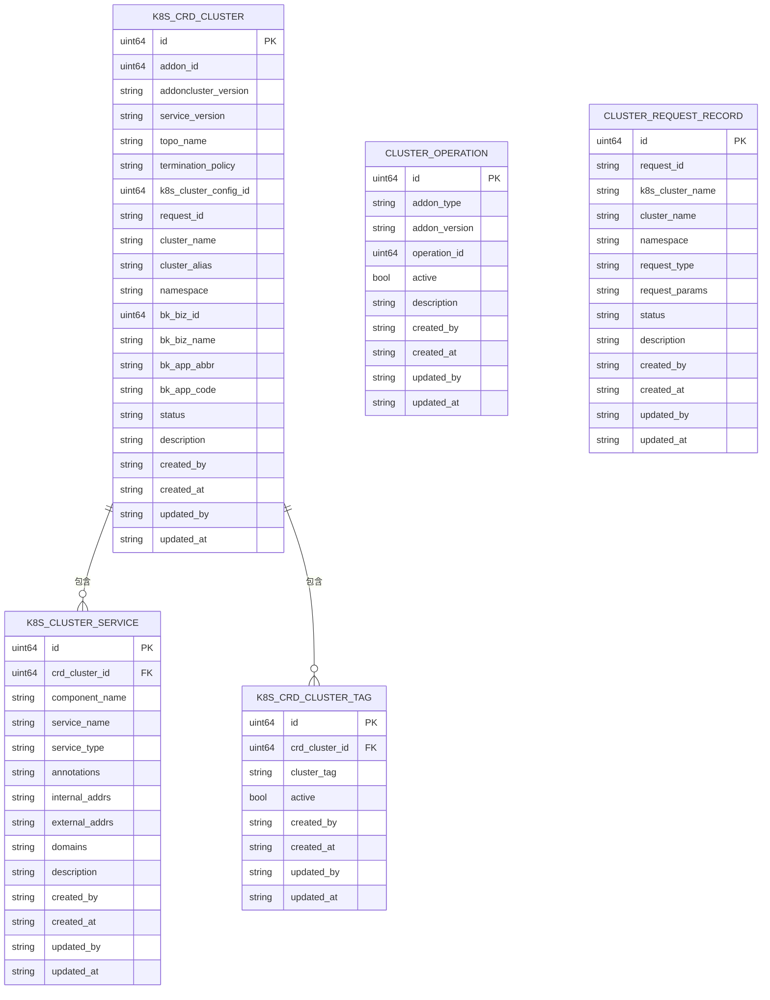

# 数据访问与模型

<cite>
**本文档引用的文件**  
- [cluster_model.go](file://dbm-services/k8s-dbs/metadata/model/cluster_model.go)
- [cluster_dbaccess.go](file://dbm-services/k8s-dbs/metadata/dbaccess/cluster_dbaccess.go)
- [dbs_db_config.go](file://dbm-services/k8s-dbs/config/dbs_db_config.go)
- [db_util.go](file://dbm-services/k8s-dbs/core/util/db_util.go)
- [cluster_operation_model.go](file://dbm-services/k8s-dbs/metadata/model/cluster_operation_model.go)
- [cluster_request_model.go](file://dbm-services/k8s-dbs/metadata/model/cluster_request_model.go)
- [cluster_service_model.go](file://dbm-services/k8s-dbs/metadata/model/cluster_service_model.go)
- [cluster_tag_model.go](file://dbm-services/k8s-dbs/metadata/model/cluster_tag_model.go)
</cite>

## 目录
1. [数据模型定义](#数据模型定义)
2. [数据库表结构与ORM映射](#数据库表结构与orm映射)
3. [数据访问对象（DAO）模式应用](#数据访问对象dao模式应用)
4. [服务配置与数据库连接管理](#服务配置与数据库连接管理)
5. [数据一致性与事务处理](#数据一致性与事务处理)
6. [缓存策略](#缓存策略)
7. [数据模型图](#数据模型图)

## 数据模型定义

k8s-dbs服务的数据模型主要定义在`metadata/model`包中，使用GORM作为ORM框架。核心数据模型包括集群、集群操作、请求记录、集群服务和标签等实体。

`K8sCrdClusterModel`是核心集群模型，包含集群的基本信息，如集群名称、命名空间、业务ID、状态等。该模型通过GORM标签定义了字段与数据库列的映射关系，以及主键、非空约束等数据库特性。

其他相关模型包括：
- `ClusterOperationModel`：定义集群操作类型
- `ClusterRequestRecordModel`：记录集群操作请求
- `K8sClusterServiceModel`：定义集群服务信息
- `K8sCrdClusterTagModel`：存储集群标签信息

这些模型通过`TableName()`方法明确指定对应的数据库表名，表名定义在`metadata/constant`包中。

**本节来源**
- [cluster_model.go](file://dbm-services/k8s-dbs/metadata/model/cluster_model.go#L27-L56)
- [cluster_operation_model.go](file://dbm-services/k8s-dbs/metadata/model/cluster_operation_model.go#L27-L45)
- [cluster_request_model.go](file://dbm-services/k8s-dbs/metadata/model/cluster_request_model.go#L27-L48)
- [cluster_service_model.go](file://dbm-services/k8s-dbs/metadata/model/cluster_service_model.go#L27-L49)
- [cluster_tag_model.go](file://dbm-services/k8s-dbs/metadata/model/cluster_tag_model.go#L27-L43)

## 数据库表结构与ORM映射

数据模型与数据库表的映射通过GORM标签实现。每个模型字段都使用`gorm`标签指定数据库列名、约束和类型。

主要映射特性包括：
- `primaryKey`：指定主键字段
- `autoIncrement`：指定自增属性
- `not null`：指定非空约束
- `size`：指定字符串字段长度
- `type`：指定数据库字段类型
- `default`：指定默认值
- `column`：指定数据库列名

例如，`K8sCrdClusterModel`中的`ID`字段映射为自增主键，`ClusterName`字段映射为非空的32字符varchar字段。时间字段使用`commtypes.JSONDatetime`类型，并映射为timestamp类型，带有默认值和自动更新特性。

**本节来源**
- [cluster_model.go](file://dbm-services/k8s-dbs/metadata/model/cluster_model.go#L27-L56)

## 数据访问对象（DAO）模式应用

数据访问层采用DAO模式，定义在`metadata/dbaccess`包中。该模式通过接口和实现分离的方式提供数据访问服务。

`K8sCrdClusterDbAccess`接口定义了集群数据的CRUD操作，包括：
- `Create`：创建新集群记录
- `DeleteByID`：根据ID删除集群
- `FindByID`：根据ID查询集群
- `FindByParams`：根据参数查询集群
- `Update`：更新集群信息
- `ListByPage`：分页查询集群列表

`K8sCrdClusterDbAccessImpl`是接口的具体实现，封装了GORM数据库操作。实现中使用了错误包装技术，通过`github.com/pkg/errors`包提供详细的错误信息。

CRUD操作实现特点：
- 创建操作使用`db.Create()`方法
- 删除操作使用`db.Delete()`方法
- 查询操作使用`db.First()`方法
- 更新操作使用`db.Omit("CreatedAt", "CreatedBy").Save()`避免更新创建时间字段
- 分页查询使用`Offset`和`Limit`实现分页，按创建时间倒序排列

**本节来源**
- [cluster_dbaccess.go](file://dbm-services/k8s-dbs/metadata/dbaccess/cluster_dbaccess.go#L33-L168)

## 服务配置与数据库连接管理

数据库配置通过`config/dbs_db_config.go`文件定义，使用结构体和环境变量标签实现配置注入。

`DatabaseConfig`结构体定义了通用数据库配置，包括：
- Host：数据库主机地址
- Port：数据库端口
- User：用户名
- Password：密码
- DBName：数据库名
- TLSMode：TLS模式
- MaxOpenConns：最大打开连接数
- MaxIdleConns：最大空闲连接数
- MaxLifetime：连接最大生命周期
- MaxIdleTime：连接最大空闲时间

`DbsDatabaseConfig`和`AuthDatabaseConfig`结构体分别用于DBS元数据库和认证数据库的配置，通过`envPrefix`标签指定环境变量前缀。

数据库连接管理在`core/util/db_util.go`中实现，采用单例模式管理数据库连接。`database`结构体包含`DbsGormDb`和`AuthGormDb`两个字段，分别对应两个数据库的GORM实例。

连接初始化过程：
1. 从环境变量解析数据库配置
2. 使用`gorm.Open()`建立数据库连接
3. 设置连接池参数（最大打开连接、最大空闲连接等）
4. 通过`sqlDb.Ping()`测试连接
5. 使用`sync.Once`确保初始化只执行一次

**本节来源**
- [dbs_db_config.go](file://dbm-services/k8s-dbs/config/dbs_db_config.go#L24-L47)
- [db_util.go](file://dbm-services/k8s-dbs/core/util/db_util.go#L33-L121)

## 数据一致性与事务处理

虽然当前分析的代码片段中未直接展示事务处理逻辑，但基于GORM框架的特性，k8s-dbs服务具备事务处理能力。

GORM支持通过`db.Transaction()`方法创建事务，确保多个数据库操作的原子性。对于需要保证数据一致性的操作，如创建集群及其相关资源，可以使用事务来确保所有操作要么全部成功，要么全部回滚。

错误处理机制通过`github.com/pkg/errors`包实现，使用`errors.Wrapf()`方法包装底层错误，提供上下文信息。这种做法有助于追踪错误源头，提高系统可维护性。

数据一致性保障措施包括：
- 数据库层面的约束（主键、非空、外键等）
- 应用层面的验证逻辑
- 事务处理确保操作原子性
- 适当的错误处理和日志记录

**本节来源**
- [cluster_dbaccess.go](file://dbm-services/k8s-dbs/metadata/dbaccess/cluster_dbaccess.go#L27-L30)

## 缓存策略

当前分析的代码中未直接实现缓存策略。数据访问直接通过GORM与数据库交互，没有明显的缓存层。

然而，GORM本身提供了一些性能优化机制：
- 连接池管理，减少连接创建开销
- 预编译语句，提高查询效率
- 批量操作支持，减少网络往返

对于高频读取、低频更新的场景，可以考虑引入外部缓存（如Redis）来提高性能。缓存策略可能包括：
- 读取时先查询缓存，未命中再查询数据库
- 写入时更新数据库后同步更新或清除缓存
- 设置合理的缓存过期时间
- 使用缓存穿透、缓存雪崩的防护机制

**本节来源**
- [cluster_dbaccess.go](file://dbm-services/k8s-dbs/metadata/dbaccess/cluster_dbaccess.go)

## 数据模型图

**图表来源**
- [cluster_model.go](file://dbm-services/k8s-dbs/metadata/model/cluster_model.go#L27-L56)
- [cluster_operation_model.go](file://dbm-services/k8s-dbs/metadata/model/cluster_operation_model.go#L27-L45)
- [cluster_request_model.go](file://dbm-services/k8s-dbs/metadata/model/cluster_request_model.go#L27-L48)
- [cluster_service_model.go](file://dbm-services/k8s-dbs/metadata/model/cluster_service_model.go#L27-L49)
- [cluster_tag_model.go](file://dbm-services/k8s-dbs/metadata/model/cluster_tag_model.go#L27-L43)