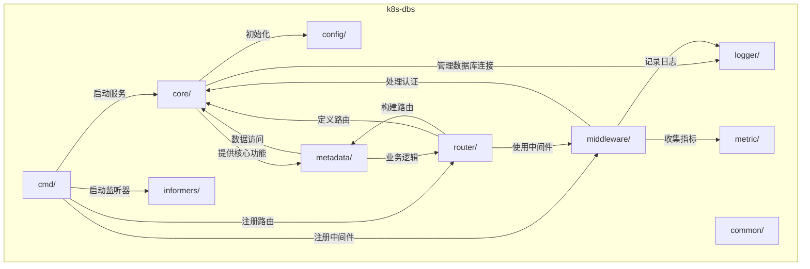
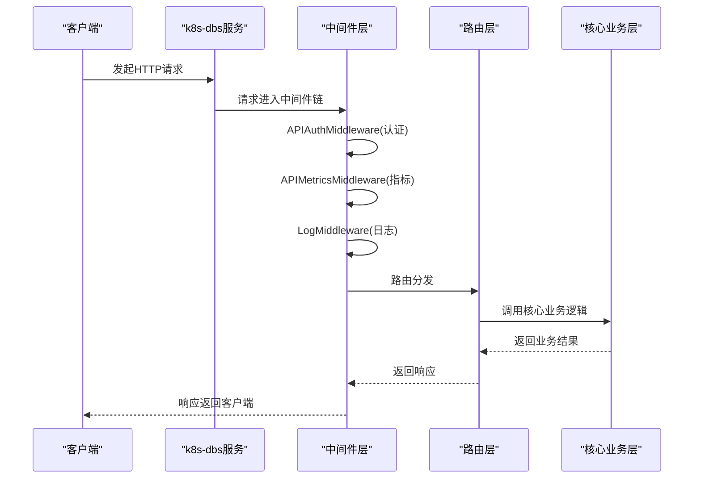
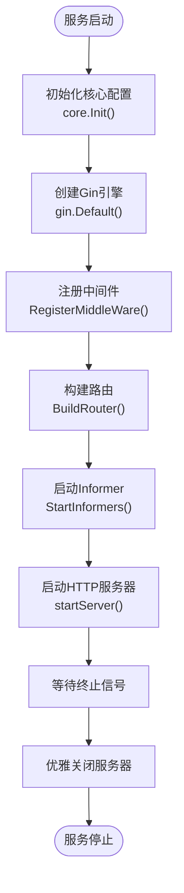
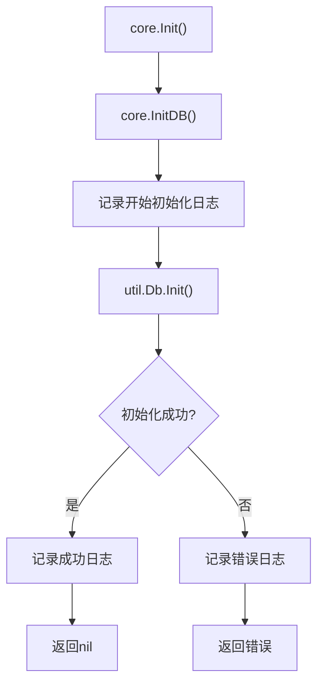
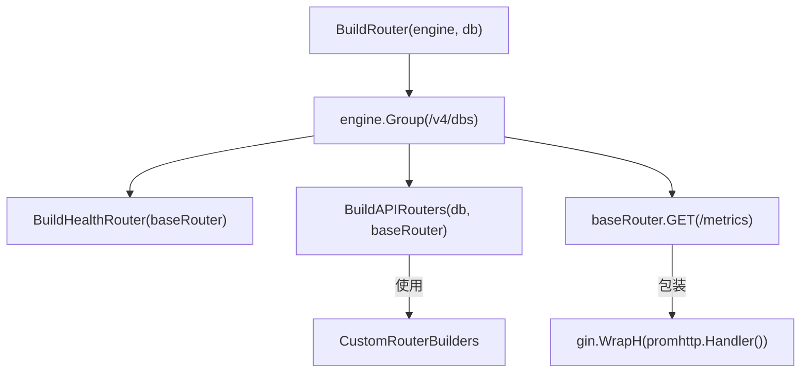
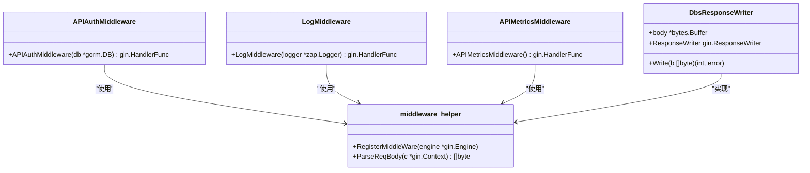
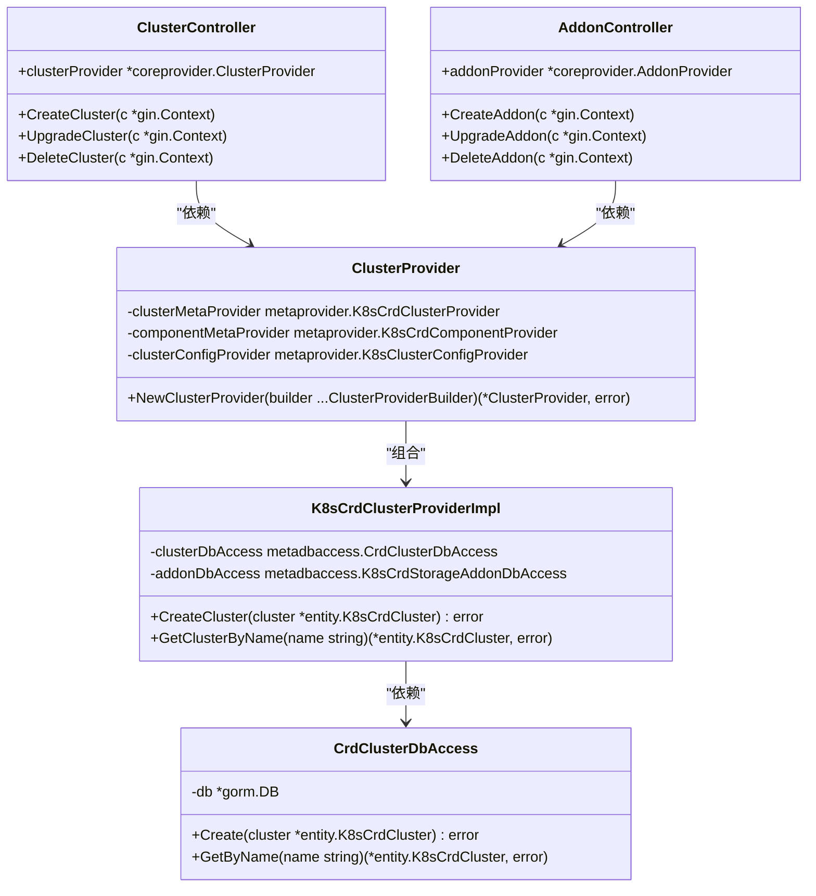
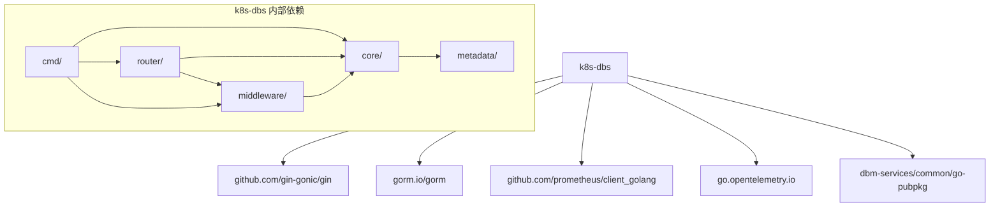

# 服务架构与设计

<cite>
**本文档引用的文件**  
- [server.go](file://dbm-services/k8s-dbs/cmd/server.go)
- [init.go](file://dbm-services/k8s-dbs/core/init.go)
- [router.go](file://dbm-services/k8s-dbs/router/router.go)
- [api_auth_middleware.go](file://dbm-services/k8s-dbs/middleware/api_auth_middleware.go)
- [api_log_middleware.go](file://dbm-services/k8s-dbs/middleware/api_log_middleware.go)
- [api_metric_middleware.go](file://dbm-services/k8s-dbs/middleware/api_metric_middleware.go)
- [middleware_helper.go](file://dbm-services/k8s-dbs/middleware/middleware_helper.go)
- [router_util.go](file://dbm-services/k8s-dbs/router/util/router_util.go)
- [response.go](file://dbm-services/k8s-dbs/common/api/response.go)
- [metric_entity.go](file://dbm-services/k8s-dbs/metric/metric_entity.go)
- [metric_factory.go](file://dbm-services/k8s-dbs/metric/metric_factory.go)
</cite>

## 目录
1. [简介](#简介)
2. [项目结构](#项目结构)
3. [核心组件](#核心组件)
4. [架构概述](#架构概述)
5. [详细组件分析](#详细组件分析)
6. [依赖分析](#依赖分析)
7. [性能考虑](#性能考虑)
8. [故障排除指南](#故障排除指南)
9. [结论](#结论)

## 简介
k8s-dbs服务是蓝鲸DBM平台中的一个关键微服务，专注于Kubernetes环境下的数据库管理。该服务基于Gin框架构建，实现了现代化的微服务架构，为数据库集群的创建、管理和监控提供了一套完整的解决方案。服务通过RESTful API暴露功能，支持对Kubernetes集群中各种数据库组件（如VictoriaMetrics、SurrealDB等）的全生命周期管理。

k8s-dbs服务在蓝鲸DBM平台中扮演着核心协调者的角色，它与db-resource、dbconfig等其他服务紧密集成，共同构建了一个强大的数据库管理生态系统。通过整合认证、日志、指标等中间件，该服务确保了高安全性、可观测性和可维护性。其设计遵循了清晰的分层架构和依赖注入模式，使得代码结构清晰、易于扩展和维护。

## 项目结构

**图源**  
- [server.go](file://dbm-services/k8s-dbs/cmd/server.go#L1-L110)
- [init.go](file://dbm-services/k8s-dbs/core/init.go#L1-L45)
- [router.go](file://dbm-services/k8s-dbs/router/router.go#L1-L55)

**本节来源**  
- [server.go](file://dbm-services/k8s-dbs/cmd/server.go#L1-L110)
- [init.go](file://dbm-services/k8s-dbs/core/init.go#L1-L45)
- [router.go](file://dbm-services/k8s-dbs/router/router.go#L1-L55)

## 核心组件

k8s-dbs服务的核心组件包括服务启动器（server.go）、核心初始化模块（init.go）和路由注册器（router.go）。`server.go`作为程序入口，负责协调整个服务的启动流程，包括核心配置初始化、Gin引擎创建、中间件注册、路由构建和Informer启动。`init.go`文件中的`Init`函数负责初始化服务所需的核心资源，特别是数据库连接，为后续的数据访问提供基础。`router.go`文件定义了服务的路由规则，通过`BuildRouter`函数将所有API端点注册到Gin引擎上，同时集成了健康检查和Prometheus指标暴露功能。

这些核心组件共同构成了服务的骨架，确保了服务能够正确启动并对外提供稳定可靠的API。服务采用模块化设计，各组件职责分明，通过清晰的依赖关系相互协作，体现了良好的软件工程实践。

**本节来源**  
- [server.go](file://dbm-services/k8s-dbs/cmd/server.go#L1-L110)
- [init.go](file://dbm-services/k8s-dbs/core/init.go#L1-L45)
- [router.go](file://dbm-services/k8s-dbs/router/router.go#L1-L55)

## 架构概述

k8s-dbs服务采用了基于Gin框架的微服务架构，整体设计遵循了清晰的分层原则。服务启动时，首先通过`core.Init()`完成数据库等核心资源的初始化，然后创建Gin引擎并注册一系列中间件，最后通过`router.BuildRouter`构建完整的API路由。

服务的架构可以分为四个主要层次：**入口层**由`server.go`构成，负责服务的启动和生命周期管理；**路由层**由`router`包构成，定义了所有API端点；**中间件层**由`middleware`包构成，提供了认证、日志、指标等横切关注点的处理；**核心业务层**由`core`和`metadata`包构成，实现了具体的业务逻辑和数据访问。

**图源**  
- [server.go](file://dbm-services/k8s-dbs/cmd/server.go#L1-L110)
- [middleware_helper.go](file://dbm-services/k8s-dbs/middleware/middleware_helper.go#L1-L84)
- [router.go](file://dbm-services/k8s-dbs/router/router.go#L1-L55)

## 详细组件分析

### 服务启动流程分析

k8s-dbs服务的启动流程始于`server.go`文件中的`main`函数。该函数执行一系列关键步骤来启动服务。首先，它调用`core.Init()`进行核心初始化，确保数据库连接等关键资源已准备就绪。初始化成功后，创建一个默认的Gin引擎实例。接着，通过`middleware.RegisterMiddleWare`函数注册一系列中间件，包括认证、日志和指标收集。然后，调用`router.BuildRouter`函数，将所有API路由注册到Gin引擎上。在启动HTTP服务器之前，还会启动Informer以监听Kubernetes集群中的变化。最后，`startServer`函数启动HTTP服务器并监听终止信号，实现优雅关闭。

**图源**  
- [server.go](file://dbm-services/k8s-dbs/cmd/server.go#L1-L110)

**本节来源**  
- [server.go](file://dbm-services/k8s-dbs/cmd/server.go#L1-L110)

### 核心组件初始化分析

核心组件的初始化主要在`core/init.go`文件中完成。`Init`函数是初始化的入口点，它主要负责数据库连接的建立。该函数调用`InitDB`来初始化MySQL连接，通过`util.Db.Init()`方法创建GORM数据库实例。初始化过程包含了详细的日志记录，便于在启动失败时进行问题排查。如果数据库连接初始化失败，`Init`函数会返回错误，导致服务启动失败，这确保了服务不会在缺少关键依赖的情况下运行。

**图源**  
- [init.go](file://dbm-services/k8s-dbs/core/init.go#L1-L45)

**本节来源**  
- [init.go](file://dbm-services/k8s-dbs/core/init.go#L1-L45)

### 路由注册机制分析

路由注册机制由`router/router.go`文件实现。`BuildRouter`函数是路由构建的核心，它接收一个Gin引擎实例和一个数据库连接作为参数。该函数首先在`/v4/dbs`路径下创建一个基础路由组。然后，调用`routerutil.BuildHealthRouter`添加健康检查端点，调用`routerutil.BuildAPIRouters`注册所有业务API。最后，通过`promhttp.Handler()`暴露Prometheus指标接口，使服务的性能数据可以被监控系统采集。

**图源**  
- [router.go](file://dbm-services/k8s-dbs/router/router.go#L1-L55)
- [router_util.go](file://dbm-services/k8s-dbs/router/util/router_util.go#L1-L185)

**本节来源**  
- [router.go](file://dbm-services/k8s-dbs/router/router.go#L1-L55)
- [router_util.go](file://dbm-services/k8s-dbs/router/util/router_util.go#L1-L185)

### 中间件整合分析

k8s-dbs服务通过`middleware`包整合了多种中间件，以增强服务的功能性和可观测性。`middleware_helper.go`中的`RegisterMiddleWare`函数是中间件注册的入口，它按顺序注册了日志、追踪、指标和认证中间件。

- **认证中间件** (`APIAuthMiddleware`)：基于用户角色进行权限校验，确保只有授权用户才能执行敏感操作。
- **日志中间件** (`LogMiddleware`)：记录详细的请求和响应信息，包括请求方法、路径、查询参数、请求体、响应体、状态码和延迟等，便于问题追踪和审计。
- **指标中间件** (`APIMetricsMiddleware`)：收集API调用的计数和延迟指标，并通过Prometheus暴露，支持对服务性能的实时监控。
- **追踪中间件**：集成OpenTelemetry，为请求链路提供分布式追踪能力。

**图源**  
- [api_auth_middleware.go](file://dbm-services/k8s-dbs/middleware/api_auth_middleware.go#L1-L74)
- [api_log_middleware.go](file://dbm-services/k8s-dbs/middleware/api_log_middleware.go#L1-L100)
- [api_metric_middleware.go](file://dbm-services/k8s-dbs/middleware/api_metric_middleware.go#L1-L187)
- [middleware_helper.go](file://dbm-services/k8s-dbs/middleware/middleware_helper.go#L1-L84)

**本节来源**  
- [api_auth_middleware.go](file://dbm-services/k8s-dbs/middleware/api_auth_middleware.go#L1-L74)
- [api_log_middleware.go](file://dbm-services/k8s-dbs/middleware/api_log_middleware.go#L1-L100)
- [api_metric_middleware.go](file://dbm-services/k8s-dbs/middleware/api_metric_middleware.go#L1-L187)
- [middleware_helper.go](file://dbm-services/k8s-dbs/middleware/middleware_helper.go#L1-L84)

### API分层设计与依赖注入分析

k8s-dbs服务的API分层设计清晰，遵循了`core/api/controller`的模式。控制器（Controller）位于`metadata/api/controller`包中，负责处理HTTP请求和响应。它们不直接访问数据库，而是通过`provider`层与`dbaccess`层进行交互，实现了业务逻辑与数据访问的分离。

依赖注入模式在`router/util/router_util.go`中得到了充分体现。`BuildCoreAPIProviders`函数负责创建和组装所有核心服务提供者（Provider），如`ClusterProvider`、`ComponentProvider`等。这些Provider被注入到相应的Controller中，使得Controller无需关心依赖的创建过程，只需专注于业务逻辑的实现。这种设计极大地提高了代码的可测试性和可维护性。

**图源**  
- [router_util.go](file://dbm-services/k8s-dbs/router/util/router_util.go#L1-L185)
- [response.go](file://dbm-services/k8s-dbs/common/api/response.go#L1-L93)

**本节来源**  
- [router_util.go](file://dbm-services/k8s-dbs/router/util/router_util.go#L1-L185)
- [response.go](file://dbm-services/k8s-dbs/common/api/response.go#L1-L93)

## 依赖分析

k8s-dbs服务的依赖关系清晰且结构化。服务直接依赖于Gin框架进行HTTP处理，GORM进行数据库操作，以及Prometheus客户端库进行指标暴露。在内部，`cmd`包依赖于`core`、`router`和`middleware`包。`core`包是服务的核心，它依赖于`metadata`包进行数据访问，并通过`util`包管理数据库连接。`router`包依赖于`core`包提供的业务逻辑和`middleware`包提供的中间件功能。

服务还通过`dbm-services/common/go-pubpkg`依赖了平台的公共包，如APM（应用性能监控）和Trace（分布式追踪），这确保了与蓝鲸平台其他服务的一致性和集成性。这种依赖管理方式使得k8s-dbs服务既能保持独立性，又能无缝融入整个DBM平台。

**图源**  
- [go.mod](file://dbm-services/k8s-dbs/go.mod)
- [server.go](file://dbm-services/k8s-dbs/cmd/server.go#L1-L110)
- [middleware_helper.go](file://dbm-services/k8s-dbs/middleware/middleware_helper.go#L1-L84)

**本节来源**  
- [go.mod](file://dbm-services/k8s-dbs/go.mod)
- [server.go](file://dbm-services/k8s-dbs/cmd/server.go#L1-L110)
- [middleware_helper.go](file://dbm-services/k8s-dbs/middleware/middleware_helper.go#L1-L84)

## 性能考虑

k8s-dbs服务在设计时充分考虑了性能因素。首先，通过Gin框架的高性能特性，确保了HTTP请求处理的高效性。其次，中间件的实现经过了优化，例如`LogMiddleware`和`APIMetricsMiddleware`都使用了缓冲区来捕获请求和响应体，避免了对原始`io.ReadCloser`的多次读取。

在数据库层面，服务使用GORM进行操作，GORM的连接池机制可以有效管理数据库连接，避免频繁创建和销毁连接带来的开销。此外，`DbsResponseWriter`的设计允许在不阻塞正常响应流的情况下收集响应数据，最小化了对请求延迟的影响。

服务还通过暴露Prometheus指标，为性能监控提供了坚实的基础。通过分析`HTTPAPITotalCounter`和`HTTPAPIDurationHistogram`等指标，运维人员可以实时了解服务的吞吐量和延迟，及时发现性能瓶颈。

## 故障排除指南

当k8s-dbs服务出现问题时，可以按照以下步骤进行排查：

1.  **检查服务日志**：首先查看服务的标准输出和日志文件。`LogMiddleware`记录的详细日志是诊断问题的第一手资料，可以从中找到错误信息、请求参数和堆栈跟踪。
2.  **验证服务健康状态**：访问`/v4/dbs/common/health`端点，确认服务的基本健康状况。如果健康检查失败，问题可能出在数据库连接或核心初始化上。
3.  **检查数据库连接**：如果怀疑是数据库问题，检查`core.InitDB`的日志输出，确认`util.Db.Init()`是否成功。可以尝试直接连接数据库以验证其可用性。
4.  **审查中间件行为**：如果请求被拒绝，检查`APIAuthMiddleware`的日志，确认是否因权限不足而被拦截。如果日志或指标缺失，检查`LogMiddleware`和`APIMetricsMiddleware`的配置。
5.  **监控指标**：通过Prometheus查询`/metrics`端点暴露的指标，分析API调用的成功率、错误率和延迟分布，以定位性能或稳定性问题。
6.  **检查外部依赖**：确认`db-resource`和`dbconfig`等外部服务是否正常运行，因为k8s-dbs服务的某些功能可能依赖于它们。

**本节来源**  
- [api_log_middleware.go](file://dbm-services/k8s-dbs/middleware/api_log_middleware.go#L1-L100)
- [api_auth_middleware.go](file://dbm-services/k8s-dbs/middleware/api_auth_middleware.go#L1-L74)
- [init.go](file://dbm-services/k8s-dbs/core/init.go#L1-L45)

## 结论

k8s-dbs服务是一个设计精良、架构清晰的微服务，它成功地利用了Gin框架的强大功能，构建了一个高性能、高可用的数据库管理API。通过对服务启动流程、核心组件初始化、路由注册机制、中间件整合、API分层设计和依赖注入模式的深入分析，我们可以看到该服务在代码组织、可维护性和可扩展性方面都达到了很高的水平。

服务与蓝鲸DBM平台的其他组件（如db-resource、dbconfig）的集成，使其能够在一个统一的生态系统中发挥核心作用。其完善的认证、日志和指标体系，为服务的稳定运行和持续优化提供了有力保障。总体而言，k8s-dbs服务的架构设计充分体现了现代微服务的最佳实践，为平台的数据库管理能力奠定了坚实的基础。