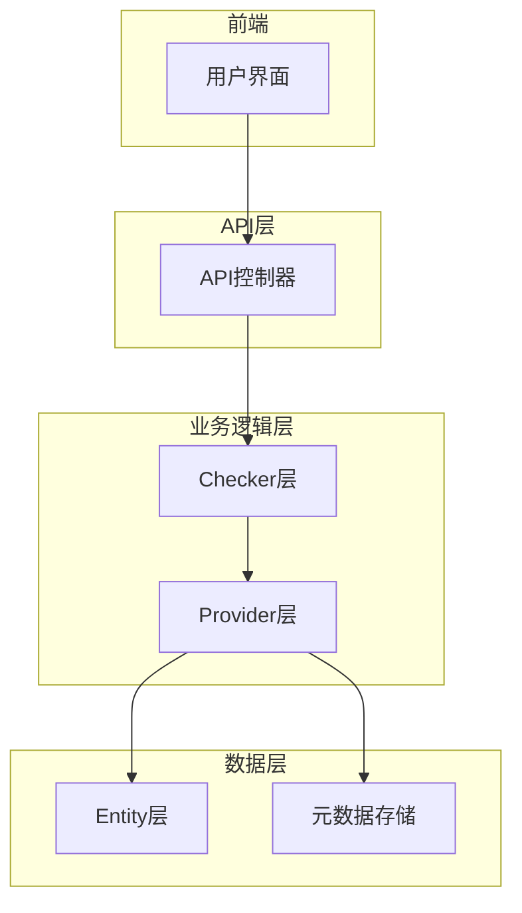
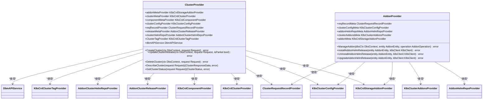
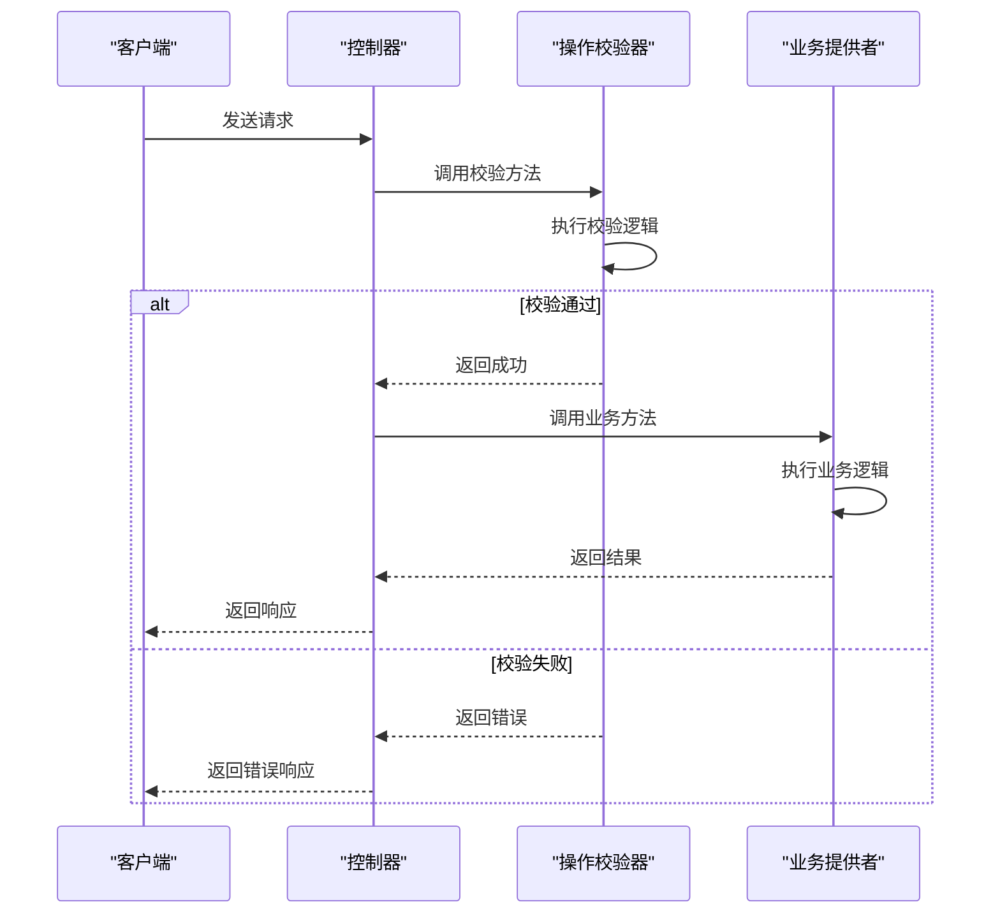
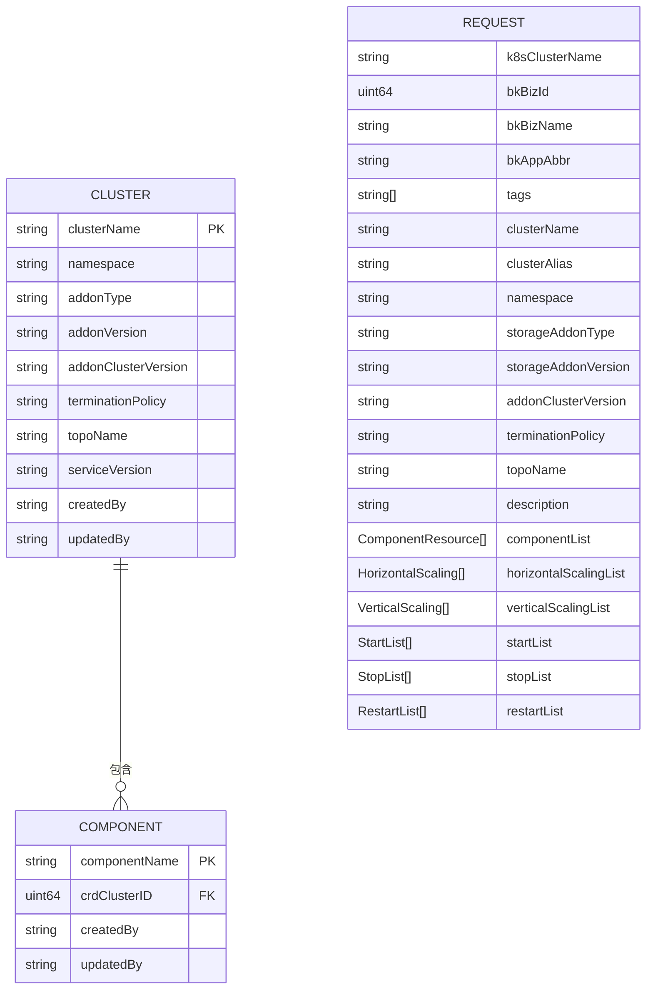
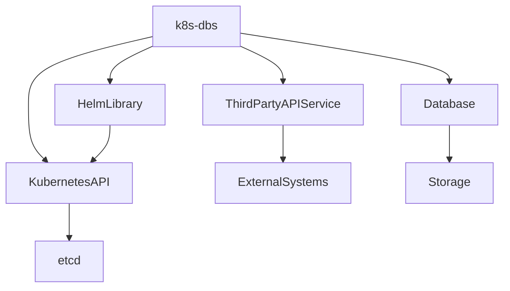

# 核心业务逻辑

<cite>
**本文档引用的文件**   
- [cluster_provider.go](file://dbm-services/k8s-dbs/core/provider/cluster_provider.go)
- [vm_operation_checker.go](file://dbm-services/k8s-dbs/core/checker/addonoperation/vm_operation_checker.go)
- [cluster_data.go](file://dbm-services/k8s-dbs/core/entity/cluster_data.go)
- [addon_provider.go](file://dbm-services/k8s-dbs/core/provider/addon_provider.go)
- [base.go](file://dbm-services/k8s-dbs/core/checker/addonoperation/base.go)
- [request.go](file://dbm-services/k8s-dbs/core/entity/request.go)
- [component_provider.go](file://dbm-services/k8s-dbs/core/provider/component_provider.go)
- [component_operation_checker.go](file://dbm-services/k8s-dbs/core/checker/addonoperation/component_operation_checker.go)
- [cluster_controller.go](file://dbm-services/k8s-dbs/core/api/controller/cluster_controller.go)
- [addon_controller.go](file://dbm-services/k8s-dbs/core/api/controller/addon_controller.go)
</cite>

## 目录
1. [引言](#引言)
2. [架构概览](#架构概览)
3. [核心组件分析](#核心组件分析)
4. [详细组件分析](#详细组件分析)
5. [依赖分析](#依赖分析)
6. [性能考虑](#性能考虑)
7. [故障排除指南](#故障排除指南)
8. [结论](#结论)

## 引言
本文档旨在深入解析k8s-dbs服务的核心业务逻辑，重点阐述Provider层、Checker层和Entity层的实现机制。文档将详细说明服务如何将用户请求转化为对Kubernetes集群的具体操作，如数据库集群的创建和扩缩容，并通过代码示例说明关键业务流程的实现细节。

## 架构概览
k8s-dbs服务采用分层架构，主要包括Provider层、Checker层和Entity层。Provider层负责实现业务操作，Checker层负责操作校验，Entity层负责数据模型定义。服务通过API控制器接收用户请求，经过Checker层校验后，由Provider层执行具体操作，并将结果返回给用户。

**Diagram sources**
- [cluster_controller.go](file://dbm-services/k8s-dbs/core/api/controller/cluster_controller.go)
- [vm_operation_checker.go](file://dbm-services/k8s-dbs/core/checker/addonoperation/vm_operation_checker.go)
- [cluster_provider.go](file://dbm-services/k8s-dbs/core/provider/cluster_provider.go)
- [cluster_data.go](file://dbm-services/k8s-dbs/core/entity/cluster_data.go)

## 核心组件分析
k8s-dbs服务的核心组件包括ClusterProvider、AddonProvider、ClusterOperationChecker和ComponentOperationChecker。这些组件协同工作，实现了对Kubernetes集群的管理和操作。

**Section sources**
- [cluster_provider.go](file://dbm-services/k8s-dbs/core/provider/cluster_provider.go)
- [addon_provider.go](file://dbm-services/k8s-dbs/core/provider/addon_provider.go)
- [base.go](file://dbm-services/k8s-dbs/core/checker/addonoperation/base.go)
- [component_operation_checker.go](file://dbm-services/k8s-dbs/core/checker/addonoperation/component_operation_checker.go)

## 详细组件分析

### Provider层分析
Provider层是k8s-dbs服务的核心，负责实现具体的业务操作。ClusterProvider负责集群的创建、更新、删除等操作，AddonProvider负责插件的安装、卸载和升级。

#### ClusterProvider类图

**Diagram sources**
- [cluster_provider.go](file://dbm-services/k8s-dbs/core/provider/cluster_provider.go)
- [addon_provider.go](file://dbm-services/k8s-dbs/core/provider/addon_provider.go)

### Checker层分析
Checker层负责对用户请求进行校验，确保操作的合法性和安全性。ClusterOperationChecker负责集群级别的操作校验，ComponentOperationChecker负责组件级别的操作校验。

#### Checker层序列图

**Diagram sources**
- [base.go](file://dbm-services/k8s-dbs/core/checker/addonoperation/base.go)
- [component_operation_checker.go](file://dbm-services/k8s-dbs/core/checker/addonoperation/component_operation_checker.go)
- [cluster_controller.go](file://dbm-services/k8s-dbs/core/api/controller/cluster_controller.go)

### Entity层分析
Entity层定义了服务的数据模型，包括集群、组件、请求等实体。这些实体用于在不同层之间传递数据。

#### Entity层数据模型

**Diagram sources**
- [cluster_data.go](file://dbm-services/k8s-dbs/core/entity/cluster_data.go)
- [request.go](file://dbm-services/k8s-dbs/core/entity/request.go)

## 依赖分析
k8s-dbs服务依赖于多个外部组件和库，包括Kubernetes API、Helm库、第三方API服务等。这些依赖通过依赖注入的方式注入到Provider和Checker组件中。

**Diagram sources**
- [go.mod](file://dbm-services/k8s-dbs/go.mod)

**Section sources**
- [go.mod](file://dbm-services/k8s-dbs/go.mod)

## 性能考虑
k8s-dbs服务在设计时考虑了性能因素，通过异步处理、缓存、批量操作等技术提高服务性能。例如，集群创建和删除操作可以异步执行，避免长时间阻塞用户请求。

## 故障排除指南
当k8s-dbs服务出现问题时，可以通过查看日志、检查配置、验证依赖等方式进行故障排除。常见的问题包括Kubernetes连接失败、Helm操作失败、数据库连接失败等。

**Section sources**
- [errors.go](file://dbm-services/k8s-dbs/errors/error.go)
- [logger.go](file://dbm-services/k8s-dbs/logger/logger.go)

## 结论
k8s-dbs服务通过分层架构实现了对Kubernetes集群的高效管理和操作。Provider层、Checker层和Entity层各司其职，协同工作，确保了服务的稳定性和可靠性。通过深入理解这些组件的实现细节，可以更好地使用和维护k8s-dbs服务。