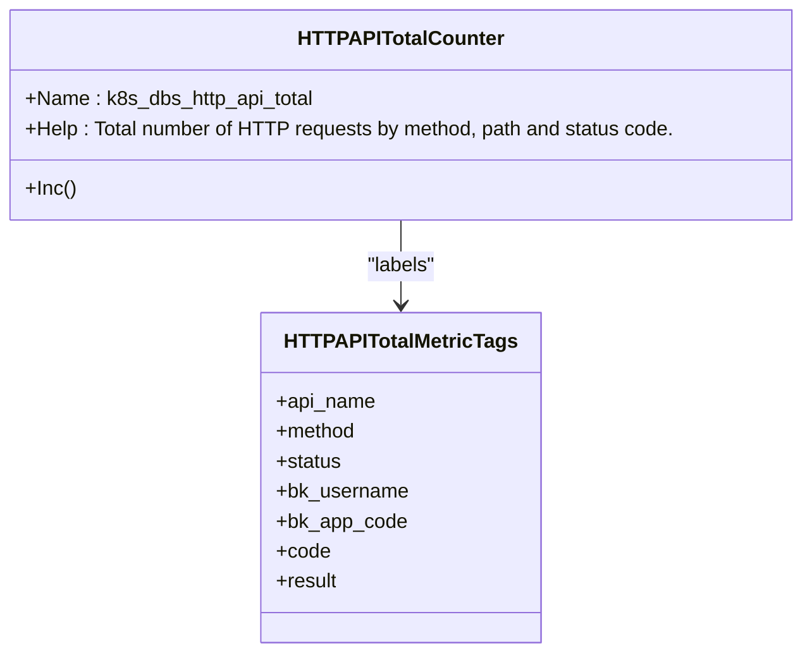
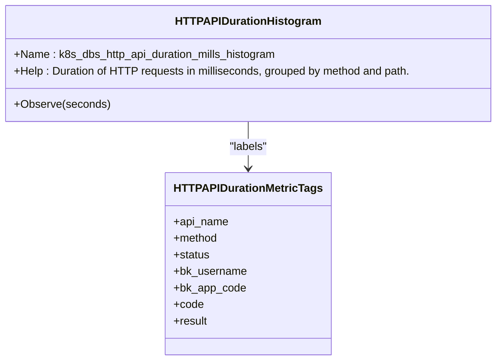
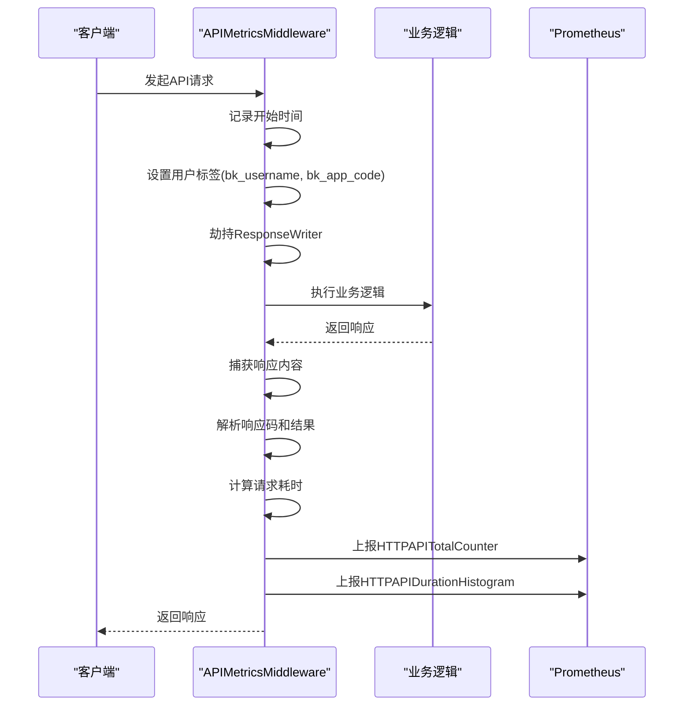
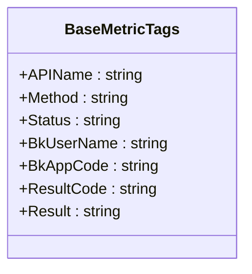
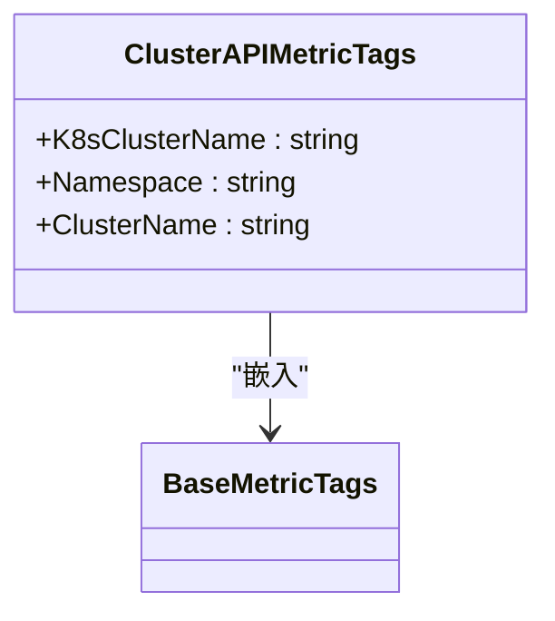
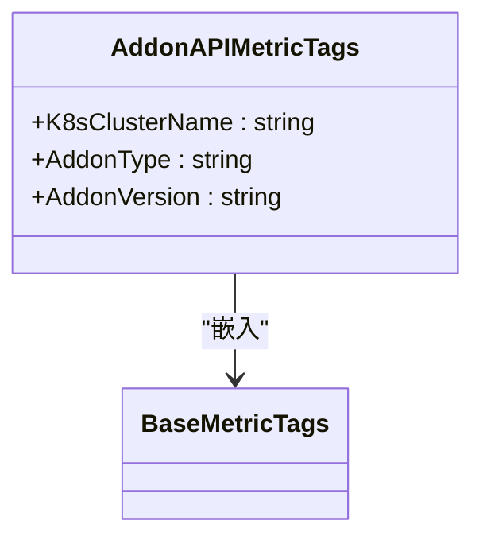
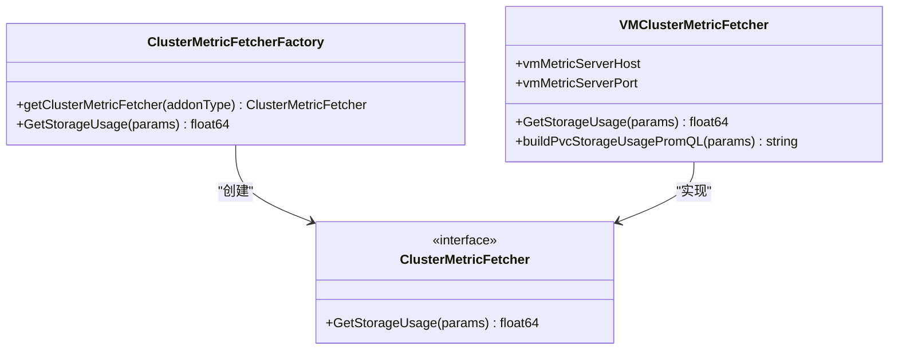

# 监控与指标

<cite>
**本文档引用的文件**   
- [http_api_count_metric.go](file://dbm-services/k8s-dbs/metric/http_api_count_metric.go)
- [http_api_duration_metric.go](file://dbm-services/k8s-dbs/metric/http_api_duration_metric.go)
- [api_metric_middleware.go](file://dbm-services/k8s-dbs/middleware/api_metric_middleware.go)
- [metric_entity.go](file://dbm-services/k8s-dbs/metric/metric_entity.go)
- [cluster_api_count_metric.go](file://dbm-services/k8s-dbs/metric/cluster_api_count_metric.go)
- [addon_api_count_metric.go](file://dbm-services/k8s-dbs/metric/addon_api_count_metric.go)
- [vm_metric.go](file://dbm-services/k8s-dbs/metric/vm_metric.go)
- [metric_factory.go](file://dbm-services/k8s-dbs/metric/metric_factory.go)
</cite>

## 目录
1. [引言](#引言)
2. [核心监控指标](#核心监控指标)
3. [指标中间件工作原理](#指标中间件工作原理)
4. [指标常量与标签定义](#指标常量与标签定义)
5. [集群与Addon专用指标](#集群与addon专用指标)
6. [VictoriaMetrics集成与存储监控](#victoriametrics集成与存储监控)
7. [Grafana仪表板配置示例](#grafana仪表板配置示例)
8. [关键监控告警规则](#关键监控告警规则)
9. [运维监控实践指南](#运维监控实践指南)
10. [总结](#总结)

## 引言
k8s-dbs服务作为蓝鲸智云DB管理系统的核心组件，提供了对Kubernetes上数据库集群和Addon组件的管理能力。为确保服务的稳定性和性能，系统集成了全面的Prometheus监控指标体系。本文档详细说明了k8s-dbs服务暴露的各类监控指标、指标收集中间件的工作机制以及相关的配置和告警策略，为运维人员提供完整的监控指导。

## 核心监控指标

k8s-dbs服务通过Prometheus客户端库暴露了两类核心的HTTP API监控指标：API调用次数和API响应延迟。这些指标是评估服务健康状况和性能瓶颈的基础。

### API调用次数指标
API调用次数指标用于统计所有HTTP API请求的总数，帮助运维人员了解服务的负载情况和使用趋势。



**指标来源**
- [http_api_count_metric.go](file://dbm-services/k8s-dbs/metric/http_api_count_metric.go#L27-L47)

### API响应延迟指标
API响应延迟指标用于记录每个HTTP API请求的处理耗时，帮助识别性能瓶颈和慢请求。



**指标来源**
- [http_api_duration_metric.go](file://dbm-services/k8s-dbs/metric/http_api_duration_metric.go#L27-L48)

## 指标中间件工作原理

k8s-dbs服务通过Gin框架的中间件机制实现了自动化指标收集。`APIMetricsMiddleware`是核心的指标收集中间件，它在请求处理流程中注入指标收集逻辑。



中间件的主要工作流程包括：
1. **请求开始**：记录请求开始时间，并初始化基础指标标签。
2. **标签收集**：从请求中提取用户信息（bk_username, bk_app_code）等标签。
3. **响应捕获**：通过劫持`ResponseWriter`来捕获最终的响应体，用于解析业务返回码和结果。
4. **指标上报**：在请求处理完成后，根据收集到的信息上报计数和耗时指标。
5. **过滤机制**：对于健康检查等高频但无分析价值的接口，通过`IgnoreAPINames`列表进行过滤，避免不必要的指标上报。

**指标来源**
- [api_metric_middleware.go](file://dbm-services/k8s-dbs/middleware/api_metric_middleware.go#L41-L187)

## 指标常量与标签定义

为了统一和规范指标的定义，k8s-dbs服务在代码中定义了清晰的常量和标签结构。

### 核心指标常量
系统定义了多个常量来标识不同的指标名称，确保指标命名的一致性。

```go
// HTTPAPITotalMetric 定义了API调用次数指标的名称
const HTTPAPITotalMetric = "k8s_dbs_http_api_total"

// HTTPAPIDurationMetric 定义了API响应延迟指标的名称
const HTTPAPIDurationMetric = "k8s_dbs_http_api_duration_mills_histogram"
```

### 基础标签结构
`BaseMetricTags`结构体定义了所有API指标共用的基础标签，这些标签提供了请求的上下文信息。



这些标签的含义如下：
- **APIName**: API的唯一标识名称
- **Method**: HTTP请求方法 (GET, POST等)
- **Status**: HTTP响应状态码
- **BkUserName**: 蓝鲸用户名
- **BkAppCode**: 蓝鲸应用编码
- **ResultCode**: 业务返回码
- **Result**: 业务处理结果 (true/false)

**指标来源**
- [metric_entity.go](file://dbm-services/k8s-dbs/metric/metric_entity.go#L22-L31)

## 集群与Addon专用指标

除了通用的HTTP API指标外，k8s-dbs服务还针对特定的业务场景（如集群管理和Addon操作）提供了专用的监控指标。

### 集群API指标
针对集群管理操作，系统定义了`ClusterAPITotalCounter`指标，它在基础标签上增加了集群相关的维度。



该指标通过`ReportClusterAPIMetrics`函数上报，仅当API属于`APIGroupCluster`时才会触发。这使得运维人员可以按集群维度分析操作频率和性能。

### Addon API指标
针对Addon组件的操作，系统定义了`AddonAPITotalCounter`指标，它增加了Addon类型和版本的维度。



该指标通过`ReportAddonAPIMetrics`函数上报，仅当API属于`APIGroupAddon`时才会触发。这有助于分析不同Addon组件的使用情况和性能表现。

**指标来源**
- [cluster_api_count_metric.go](file://dbm-services/k8s-dbs/metric/cluster_api_count_metric.go#L32-L97)
- [addon_api_count_metric.go](file://dbm-services/k8s-dbs/metric/addon_api_count_metric.go#L32-L97)

## VictoriaMetrics集成与存储监控

k8s-dbs服务通过`metric_factory.go`和`vm_metric.go`实现了与VictoriaMetrics的集成，用于获取集群的存储使用量等高级指标。

### 指标工厂模式
系统采用工厂模式（`ClusterMetricFetcherFactory`）来管理不同Addon类型的指标获取器。



### VictoriaMetrics指标获取流程
`VMClusterMetricFetcher`通过VictoriaMetrics的HTTP API查询PVC的存储使用量。

```mermaid
flowchart TD
A[调用GetStorageUsage] --> B["构建PromQL查询: sum(vm_data_size_bytes_value{...})"]
B --> C[发送HTTP请求到VictoriaMetrics]
C --> D{响应成功?}
D --> |是| E[解析JSON响应]
D --> |否| F[返回错误]
E --> G[提取存储大小(字节)]
G --> H[转换为GB并四舍五入]
H --> I[返回存储使用量(GB)]
```

该流程依赖于环境变量`VM_METRIC_SERVER_HOST`和`VM_METRIC_SERVER_PORT`来配置VictoriaMetrics服务器地址。

**指标来源**
- [vm_metric.go](file://dbm-services/k8s-dbs/metric/vm_metric.go#L43-L138)
- [metric_factory.go](file://dbm-services/k8s-dbs/metric/metric_factory.go#L24-L73)

## Grafana仪表板配置示例

以下是一个Grafana仪表板的JSON配置示例，用于可视化k8s-dbs服务的关键指标。

```json
{
  "panels": [
    {
      "title": "API总调用次数",
      "type": "graph",
      "targets": [
        {
          "expr": "sum(rate(k8s_dbs_http_api_total[5m])) by (api_name)",
          "legendFormat": "{{api_name}}"
        }
      ]
    },
    {
      "title": "API平均响应延迟",
      "type": "graph",
      "targets": [
        {
          "expr": "histogram_quantile(0.95, sum(rate(k8s_dbs_http_api_duration_mills_histogram_bucket[5m])) by (le, api_name)) / 1000",
          "legendFormat": "{{api_name}}"
        }
      ]
    },
    {
      "title": "集群操作成功率",
      "type": "gauge",
      "targets": [
        {
          "expr": "sum(k8s_dbs_cluster_api_total{result=\"true\"}) / sum(k8s_dbs_cluster_api_total)"
        }
      ]
    }
  ]
}
```

此仪表板包含三个关键面板：
1. **API总调用次数**：显示过去5分钟内各API的调用速率，按API名称分组。
2. **API平均响应延迟**：显示各API的95%分位响应延迟（单位：秒）。
3. **集群操作成功率**：显示集群操作API的成功率。

## 关键监控告警规则

以下是建议配置的关键Prometheus告警规则，用于及时发现服务异常。

```yaml
groups:
  - name: k8s-dbs-alerts
    rules:
      - alert: HighAPIErrorRate
        expr: sum(rate(k8s_dbs_http_api_total{status=~"5.."}[5m])) / sum(rate(k8s_dbs_http_api_total[5m])) > 0.05
        for: 10m
        labels:
          severity: critical
        annotations:
          summary: "API错误率过高"
          description: "过去10分钟内API错误率超过5%"

      - alert: HighAPILatency
        expr: histogram_quantile(0.95, sum(rate(k8s_dbs_http_api_duration_mills_histogram_bucket[5m])) by (le)) > 5000
        for: 10m
        labels:
          severity: warning
        annotations:
          summary: "API响应延迟过高"
          description: "过去10分钟内95%的API请求延迟超过5秒"

      - alert: ServiceDown
        expr: up{job="k8s-dbs"} == 0
        for: 5m
        labels:
          severity: critical
        annotations:
          summary: "k8s-dbs服务不可用"
          description: "k8s-dbs服务已连续5分钟无法访问"
```

## 运维监控实践指南

### 监控配置步骤
1. **部署Prometheus**：确保Prometheus已正确配置并能抓取k8s-dbs服务的`/metrics`端点。
2. **导入Grafana仪表板**：将上述仪表板配置导入Grafana，以便可视化监控数据。
3. **配置告警规则**：将告警规则添加到Prometheus配置中，并确保告警通知渠道（如邮件、企业微信）已正确设置。
4. **验证指标**：通过Prometheus的查询界面验证关键指标是否正常上报。

### 性能瓶颈分析
当发现性能问题时，可按以下步骤进行分析：
1. **检查延迟指标**：查看`k8s_dbs_http_api_duration_mills_histogram`，识别延迟最高的API。
2. **分析调用频率**：结合`k8s_dbs_http_api_total`，判断高延迟是否由高并发引起。
3. **检查错误率**：分析`k8s_dbs_http_api_total`中`status`为5xx的请求，定位错误来源。
4. **关联业务标签**：利用`bk_username`和`bk_app_code`标签，分析特定用户或应用的请求模式。

## 总结
k8s-dbs服务的监控体系通过Prometheus指标、Gin中间件和工厂模式等技术，实现了全面、灵活的监控能力。运维人员应充分利用这些指标和工具，建立完善的监控告警机制，确保服务的稳定运行。通过持续监控API性能、错误率和集群状态，可以及时发现并解决潜在问题，提升系统的可靠性和用户体验。