# 备份存储

<cite>
**本文档引用的文件**   
- [backup.go](file://dbm-services/mysql/db-tools/mysql-rotatebinlog/pkg/backup/backup.go)
- [backupclient.go](file://dbm-services/common/go-pubpkg/backupclient/backupclient.go)
- [filename.go](file://dbm-services/mongodb/db-tools/mongo-toolkit-go/toolkit/pitr/filename.go)
- [mountpoint.go](file://dbm-services/mysql/db-tools/dbactuator/pkg/util/osutil/mountpoint.go)
- [unix_only.go](file://dbm-services/mysql/db-tools/dbactuator/pkg/util/osutil/unix_only.go)
- [backup_cos.go](file://dbm-services/mysql/db-tools/mysql-rotatebinlog/pkg/backup/backup_cos.go)
- [4.0.0.json](file://dbm-ui/backend/components/dbconfig/migrations/doris/dbconf/4.0.0.json)
- [restore.sh](file://dbm-services/k8s-dbs/k8s-utils/helm/storageAddon/surrealdb/dataprotection/restore.sh)
- [k8s_provider.go](file://dbm-services/k8s-dbs/core/provider/k8s_provider.go)
- [vm_metric.go](file://dbm-services/k8s-dbs/metric/vm_metric.go)
</cite>

## 目录
1. [引言](#引言)
2. [存储架构概述](#存储架构概述)
3. [存储路径配置](#存储路径配置)
4. [存储配额与策略](#存储配额与策略)
5. [备份文件命名规则与目录结构](#备份文件命名规则与目录结构)
6. [元数据管理](#元数据管理)
7. [存储性能优化](#存储性能优化)
8. [存储空间监控](#存储空间监控)
9. [存储故障处理](#存储故障处理)
10. [对象存储系统集成](#对象存储系统集成)

## 引言
本文档全面介绍蓝鲸DBM系统的备份存储架构，涵盖本地存储、网络存储和对象存储等多种存储方式的实现。详细说明了如何配置备份存储路径、存储配额和存储策略。结合代码示例，解释了备份文件的命名规则、目录结构和元数据管理。文档还涵盖了存储性能优化、存储空间监控和存储故障处理等内容，以及与主流对象存储系统（如S3、Ceph）的集成方式。

## 存储架构概述

蓝鲸DBM系统的备份存储架构支持多种存储方式，包括本地存储、网络存储和对象存储。系统通过统一的备份客户端接口与不同的存储后端进行交互，实现了灵活的存储配置和管理。

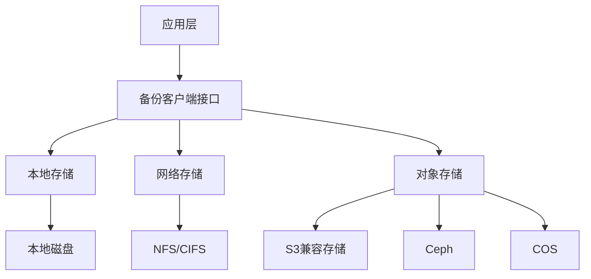

**图示来源**
- [backup.go](file://dbm-services/mysql/db-tools/mysql-rotatebinlog/pkg/backup/backup.go#L4-L10)
- [backupclient.go](file://dbm-services/common/go-pubpkg/backupclient/backupclient.go#L21-L33)

## 存储路径配置

系统提供了多种机制来确定和选择备份存储路径。通过分析文件系统信息和挂载点，系统能够自动选择最适合的存储路径。

### 存储路径选择算法

系统通过以下步骤选择存储路径：
1. 获取主机上的所有文件系统信息
2. 筛选出以`/data`开头的挂载点
3. 选择剩余空间最大的挂载点作为备份存储路径

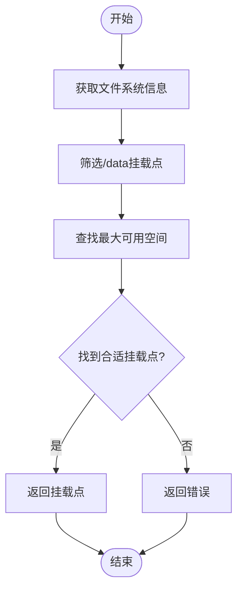

**图示来源**
- [mountpoint.go](file://dbm-services/mysql/db-tools/dbactuator/pkg/util/osutil/mountpoint.go#L117-L177)
- [unix_only.go](file://dbm-services/mysql/db-tools/dbactuator/pkg/util/osutil/unix_only.go#L17-L68)

### 存储路径配置示例

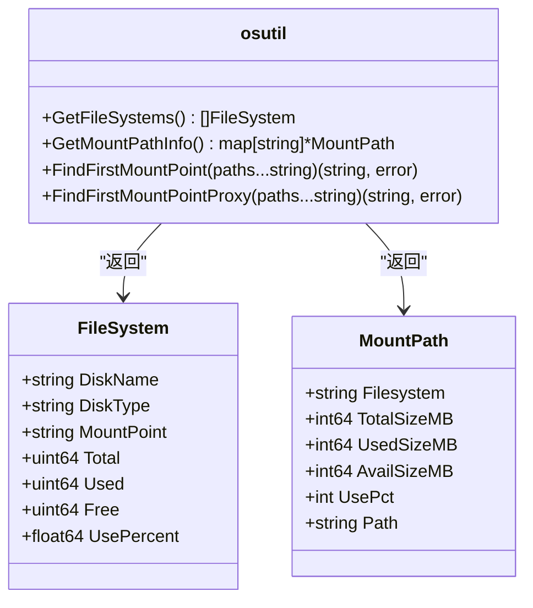

**图示来源**
- [mountpoint.go](file://dbm-services/mysql/db-tools/dbactuator/pkg/util/osutil/mountpoint.go#L117-L177)
- [unix_only.go](file://dbm-services/mysql/db-tools/dbactuator/pkg/util/osutil/unix_only.go#L17-L68)

## 存储配额与策略

系统提供了灵活的存储配额和策略配置，支持基于资源的配额管理和基于标签的存储策略。

### 资源配额管理

在Kubernetes环境中，系统通过ResourceQuota对象管理存储配额。配额可以限制CPU、内存等资源的使用。

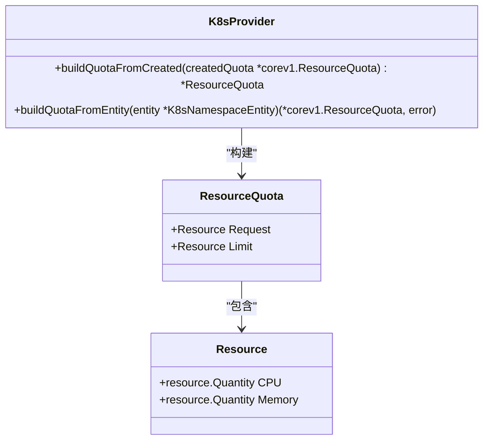

**图示来源**
- [k8s_provider.go](file://dbm-services/k8s-dbs/core/provider/k8s_provider.go#L313-L350)

### 存储策略配置

系统支持基于标签的存储策略，通过不同的标签来区分不同类型的备份数据。

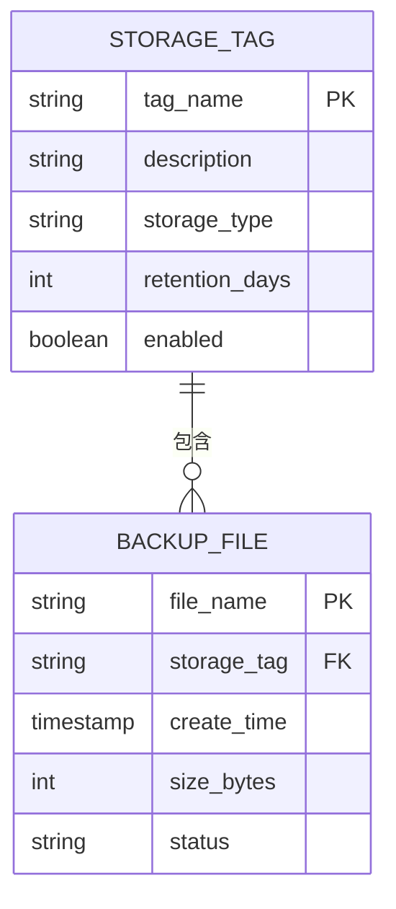

**图示来源**
- [backupclient.go](file://dbm-services/common/go-pubpkg/backupclient/backupclient.go#L26-L28)
- [4.0.0.json](file://dbm-ui/backend/components/dbconfig/migrations/doris/dbconf/4.0.0.json#L8084-L9722)

## 备份文件命名规则与目录结构

系统采用标准化的命名规则和目录结构来组织备份文件，确保文件的可识别性和可管理性。

### MongoDB备份文件命名规则

MongoDB备份文件采用版本化的命名格式，支持V0和V1两种版本。

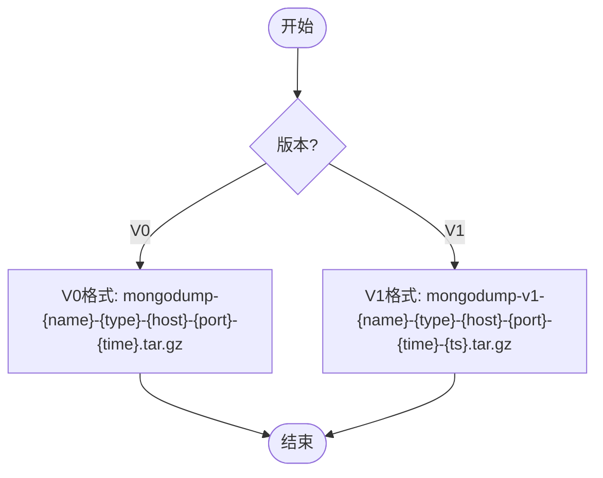

**图示来源**
- [filename.go](file://dbm-services/mongodb/db-tools/mongo-toolkit-go/toolkit/pitr/filename.go#L65-L98)

### 备份文件结构

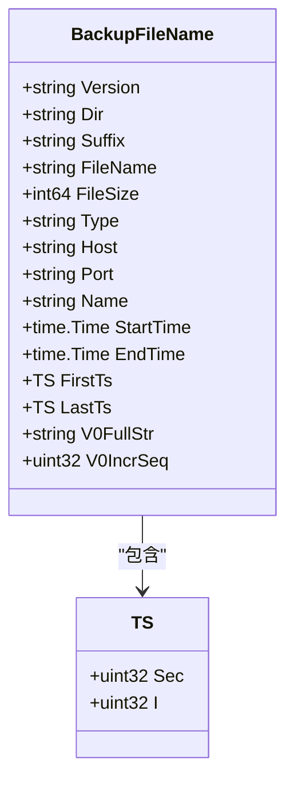

**图示来源**
- [filename.go](file://dbm-services/mongodb/db-tools/mongo-toolkit-go/toolkit/pitr/filename.go#L17-L33)

## 元数据管理

系统通过元数据文件来管理备份的元信息，确保备份数据的完整性和可恢复性。

### 备份元数据文件

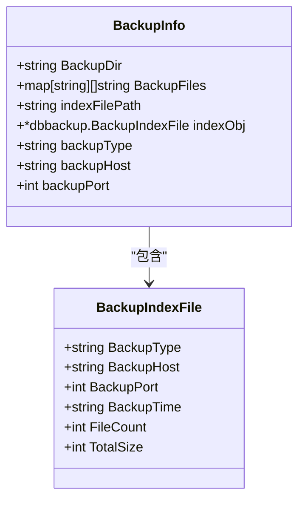

**图示来源**
- [backup.go](file://dbm-services/mysql/db-tools/dbactuator/pkg/components/mysql/restore/backup.go#L50-L83)

## 存储性能优化

系统通过多种机制优化存储性能，包括异步上传、批量处理和缓存机制。

### 异步上传流程

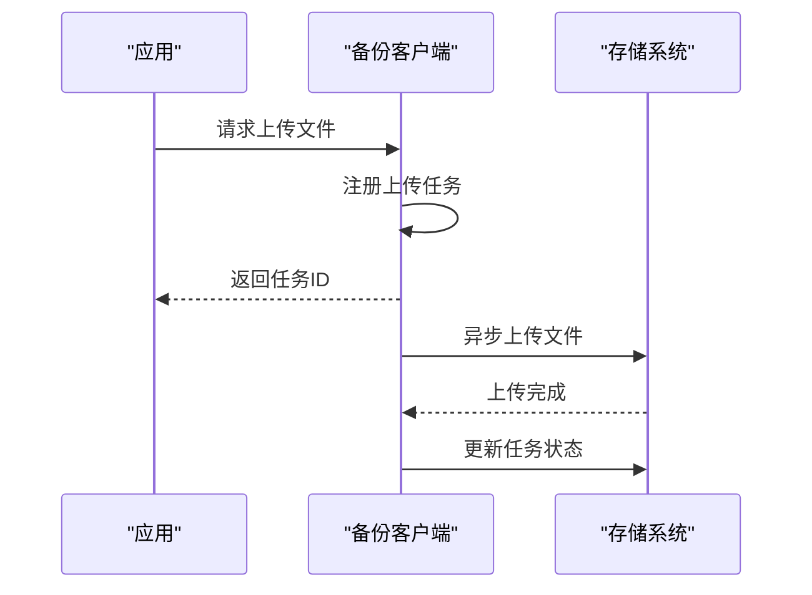

**图示来源**
- [backupclient.go](file://dbm-services/common/go-pubpkg/backupclient/backupclient.go#L105-L108)

## 存储空间监控

系统提供了完善的存储空间监控机制，实时跟踪存储使用情况。

### 存储使用量监控

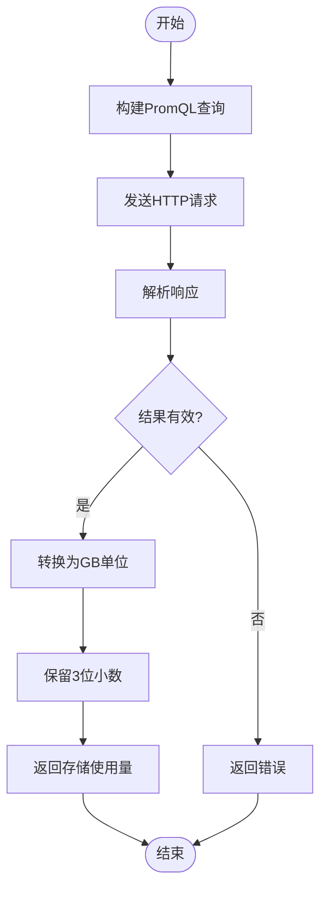

**图示来源**
- [vm_metric.go](file://dbm-services/k8s-dbs/metric/vm_metric.go#L83-L119)

## 存储故障处理

系统具备完善的存储故障处理机制，能够及时发现和处理存储相关的问题。

### 故障处理流程

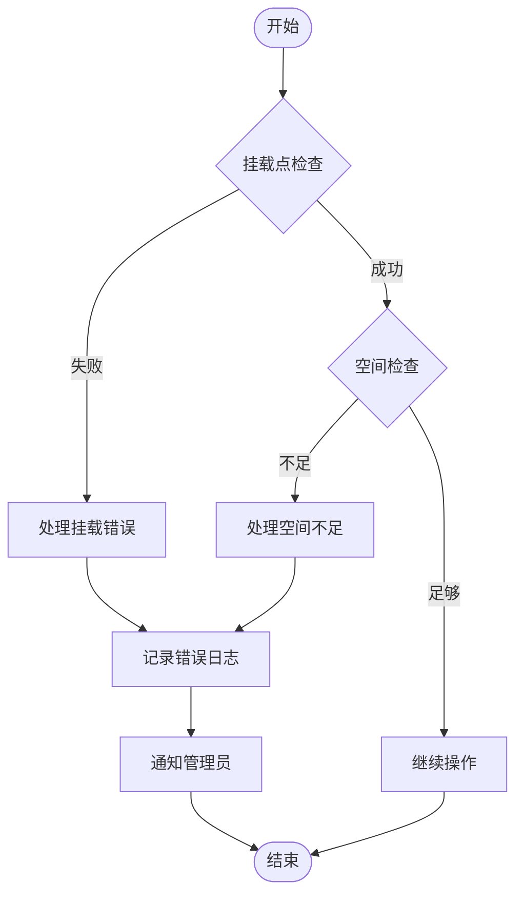

**图示来源**
- [unix_only.go](file://dbm-services/mysql/db-tools/dbactuator/pkg/util/osutil/unix_only.go#L22-L68)
- [mountpoint.go](file://dbm-services/mysql/db-tools/dbactuator/pkg/util/osutil/mountpoint.go#L8-L22)

## 对象存储系统集成

系统支持与多种对象存储系统的集成，包括S3、Ceph和COS等。

### S3存储集成

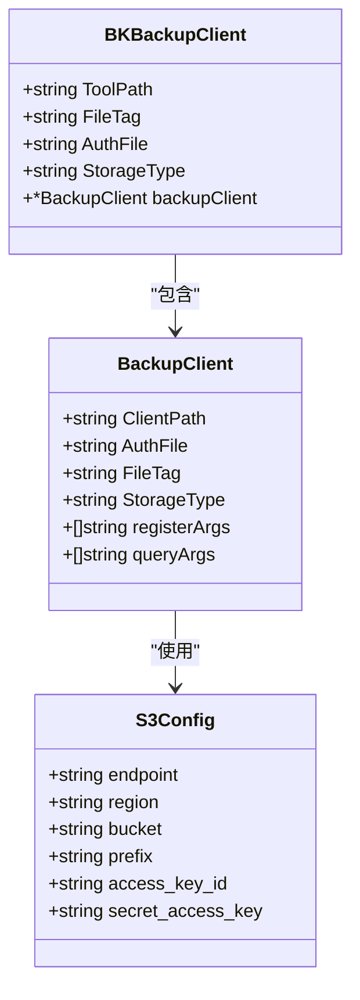

**图示来源**
- [backup_cos.go](file://dbm-services/mysql/db-tools/mysql-rotatebinlog/pkg/backup/backup_cos.go#L9-L17)
- [backupclient.go](file://dbm-services/common/go-pubpkg/backupclient/backupclient.go#L21-L33)
- [4.0.0.json](file://dbm-ui/backend/components/dbconfig/migrations/doris/dbconf/4.0.0.json#L8084-L9722)

### 对象存储集成示例

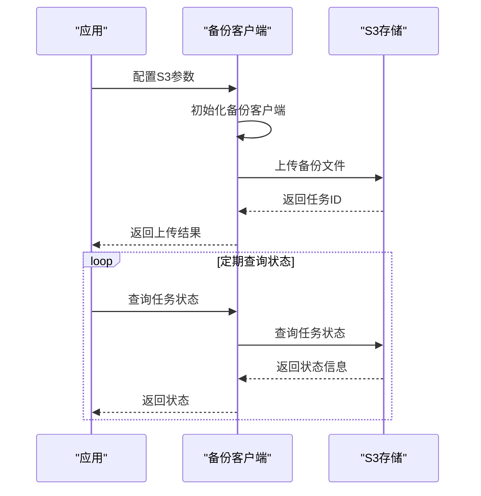

**图示来源**
- [restore.sh](file://dbm-services/k8s-dbs/k8s-utils/helm/storageAddon/surrealdb/dataprotection/restore.sh#L1-L19)
- [backup_cos.go](file://dbm-services/mysql/db-tools/mysql-rotatebinlog/pkg/backup/backup_cos.go#L19-L52)