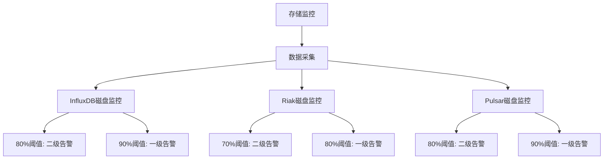
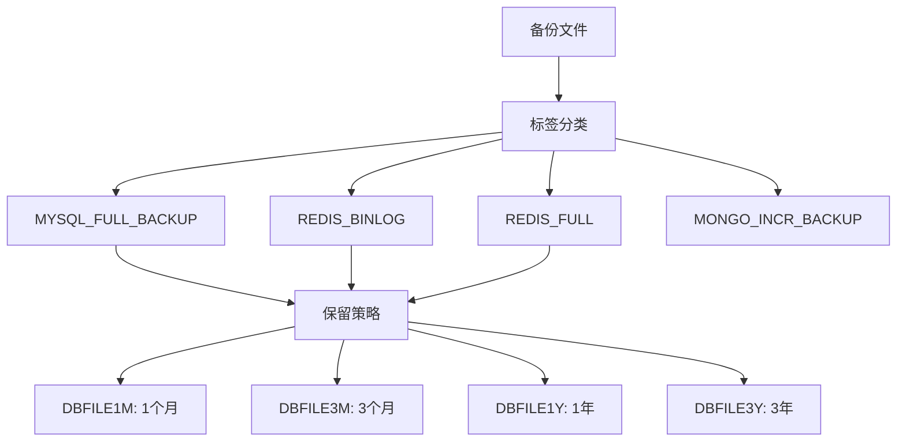
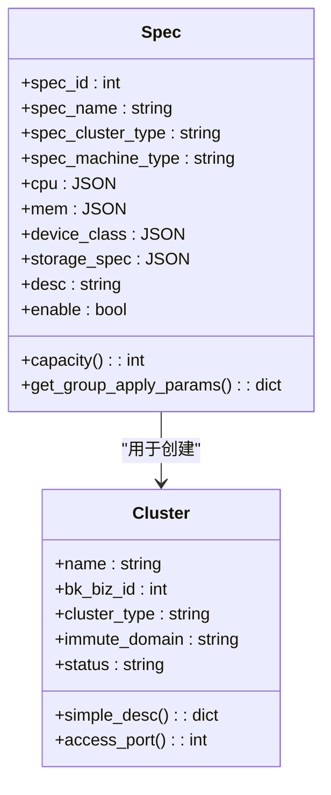
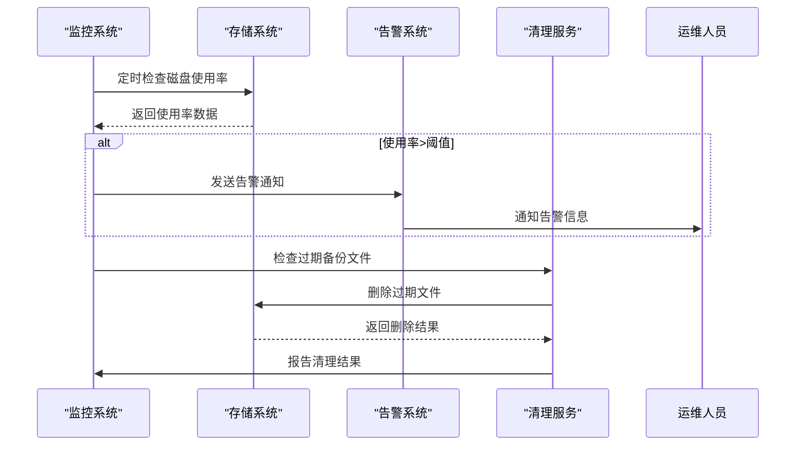
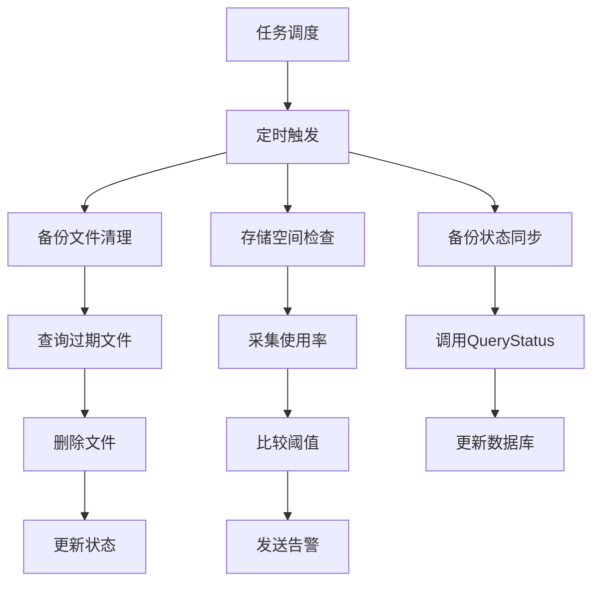

# 存储管理

<cite>
**本文档引用的文件**   
- [backupclient.go](file://dbm-services/common/go-pubpkg/backupclient/backupclient.go)
- [storage_type.go](file://dbm-services/common/go-pubpkg/backupclient/storage_type.go)
- [spec.py](file://dbm-ui/backend/db_meta/models/spec.py)
- [cluster.py](file://dbm-ui/backend/db_meta/models/cluster.py)
- [storage_instance_tuple.py](file://dbm-ui/backend/db_meta/models/storage_instance_tuple.py)
- [storage_set_dtl.py](file://dbm-ui/backend/db_meta/models/storage_set_dtl.py)
- [mysql_backup_result.py](file://dbm-ui/backend/db_periodic_task/local_tasks/backup_files_expire/mysql_backup_result.py)
- [metav2.go](file://dbm-services/mongodb/db-tools/mongo-toolkit-go/toolkit/pitr/metav2.go)
- [osPerf.go](file://dbm-services/redis/redis-dts/pkg/osPerf/osPerf.go)
- [InfluxDB 磁盘空间告警.json](file://dbm-ui/backend/db_monitor/tpls/alarm/influxdb/InfluxDB 磁盘空间告警.json)
- [Riak 磁盘空间告警.json](file://dbm-ui/backend/db_monitor/tpls/alarm/riak/Riak 磁盘空间告警.json)
- [Pulsar 主机磁盘空间使用率.json](file://dbm-ui/backend/db_monitor/tpls/alarm/pulsar/Pulsar 主机磁盘空间使用率.json)
</cite>

## 目录
1. [存储管理概述](#存储管理概述)
2. [存储空间监控](#存储空间监控)
3. [备份文件生命周期管理](#备份文件生命周期管理)
4. [存储性能优化](#存储性能优化)
5. [故障处理](#故障处理)
6. [存储使用率计算方法](#存储使用率计算方法)
7. [存储告警阈值设置](#存储告警阈值设置)
8. [存储清理策略执行机制](#存储清理策略执行机制)
9. [存储管理任务调度与执行](#存储管理任务调度与执行)

## 存储管理概述

存储管理功能是蓝鲸智云-DB管理系统的核心组件之一，负责数据库备份存储的全面管理。系统通过统一的备份客户端（backup_client）实现对不同存储类型（HDFS和COS）的管理，支持多种数据库类型的备份文件管理，包括MySQL、Redis、MongoDB等。存储管理涵盖了从备份文件上传、状态查询、生命周期管理到存储空间监控和故障处理的完整流程。

**Section sources**
- [backupclient.go](file://dbm-services/common/go-pubpkg/backupclient/backupclient.go)
- [storage_type.go](file://dbm-services/common/go-pubpkg/backupclient/storage_type.go)

## 存储空间监控

存储空间监控是确保系统稳定运行的关键功能。系统通过多种机制实时监控存储空间使用情况，并在达到预设阈值时触发告警。监控系统支持对不同数据库类型的存储空间进行监控，包括InfluxDB、Riak、Pulsar等。

监控系统通过BKMonitor平台实现告警功能，配置了不同级别的告警阈值。例如，对于InfluxDB的磁盘空间监控，当使用率达到80%时触发二级告警，达到90%时触发一级告警。类似地，Riak和Pulsar也配置了相应的磁盘空间告警策略。

**Diagram sources**
- [InfluxDB 磁盘空间告警.json](file://dbm-ui/backend/db_monitor/tpls/alarm/influxdb/InfluxDB 磁盘空间告警.json)
- [Riak 磁盘空间告警.json](file://dbm-ui/backend/db_monitor/tpls/alarm/riak/Riak 磁盘空间告警.json)
- [Pulsar 主机磁盘空间使用率.json](file://dbm-ui/backend/db_monitor/tpls/alarm/pulsar/Pulsar 主机磁盘空间使用率.json)

**Section sources**
- [InfluxDB 磁盘空间告警.json](file://dbm-ui/backend/db_monitor/tpls/alarm/influxdb/InfluxDB 磁盘空间告警.json)
- [Riak 磁盘空间告警.json](file://dbm-ui/backend/db_monitor/tpls/alarm/riak/Riak 磁盘空间告警.json)
- [Pulsar 主机磁盘空间使用率.json](file://dbm-ui/backend/db_monitor/tpls/alarm/pulsar/Pulsar 主机磁盘空间使用率.json)

## 备份文件生命周期管理

备份文件生命周期管理是存储管理的重要组成部分，确保备份文件在满足业务需求的同时，不会过度占用存储空间。系统通过配置不同的文件标签（FileTag）来管理不同类型备份文件的生命周期。

系统支持多种备份文件标签，包括：
- MYSQL_FULL_BACKUP：MySQL全量备份
- REDIS_BINLOG：Redis增量备份
- REDIS_FULL：Redis全量备份
- MONGO_INCR_BACKUP：MongoDB增量备份

对于MySQL备份文件，系统根据配置的保留天数自动清理过期文件。不同的文件标签对应不同的保留策略，例如DBFILE1M保留1个月，DBFILE1Y保留1年。

**Diagram sources**
- [mysql_backup_result.py](file://dbm-ui/backend/db_periodic_task/local_tasks/backup_files_expire/mysql_backup_result.py)

**Section sources**
- [mysql_backup_result.py](file://dbm-ui/backend/db_periodic_task/local_tasks/backup_files_expire/mysql_backup_result.py)

## 存储性能优化

存储性能优化通过多种机制实现，包括存储规格管理、资源分配优化和存储空间利用率提升。系统通过Spec模型定义不同类型的存储规格，包括CPU、内存、磁盘等资源配置。

存储规格（Spec）模型定义了详细的资源配置要求，包括：
- CPU配置：最小和最大核心数
- 内存配置：最小和最大内存大小
- 设备类型：支持的机型列表
- 存储规格：磁盘挂载点、最小和最大容量、磁盘类型

系统根据不同的集群类型采用不同的容量计算策略。例如，对于TenDBCluster类型，如果只有/data数据盘，则容量按一半计算；如果有/data和/data1数据盘，则以/data1为准。对于TendisPlus和TendisSSD，以/data1磁盘为准。

**Diagram sources**
- [spec.py](file://dbm-ui/backend/db_meta/models/spec.py)
- [cluster.py](file://dbm-ui/backend/db_meta/models/cluster.py)

**Section sources**
- [spec.py](file://dbm-ui/backend/db_meta/models/spec.py)
- [cluster.py](file://dbm-ui/backend/db_meta/models/cluster.py)

## 故障处理

故障处理机制确保在存储系统出现问题时能够及时发现并采取相应措施。系统通过多种监控和告警机制实现故障的快速诊断和恢复。

对于存储系统，当磁盘使用率超过预设阈值时，系统会自动发送告警通知。例如，在Redis DTS服务中，当磁盘使用率超过预设的最大使用比率时，系统会通过warn_client发送告警信息。告警信息包含详细的使用情况，如"DTS server disk usage:85% > 80%"。

对于MongoDB的备份管理，系统实现了智能的文件清理策略。当磁盘处于紧急状态（使用率>50%）时，备份完成后立即删除本地文件；在正常状态（使用率<25%）下，超过2天且同步完成的文件才会被删除。

**Diagram sources**
- [osPerf.go](file://dbm-services/redis/redis-dts/pkg/osPerf/osPerf.go)
- [metav2.go](file://dbm-services/mongodb/db-tools/mongo-toolkit-go/toolkit/pitr/metav2.go)

**Section sources**
- [osPerf.go](file://dbm-services/redis/redis-dts/pkg/osPerf/osPerf.go)
- [metav2.go](file://dbm-services/mongodb/db-tools/mongo-toolkit-go/toolkit/pitr/metav2.go)

## 存储使用率计算方法

存储使用率的计算方法根据不同的存储类型和业务需求而有所不同。系统通过统一的监控接口采集存储使用数据，并根据预设的算法计算使用率。

对于磁盘存储，使用率通常计算为已使用空间与总空间的比率。系统支持对多个磁盘挂载点进行监控，可以分别计算每个挂载点的使用率，也可以计算整体存储使用率。

在Spec模型中，存储容量的计算方法根据集群类型而异：
- TenDBCluster：如果有/data1磁盘，则以/data1为准；否则以/data磁盘的一半计算
- TendisPlus/TendisSSD：以/data1磁盘为准
- RedisCluster/TendisCache：以内存平均值为准
- 其他类型：所有磁盘容量之和

**Section sources**
- [spec.py](file://dbm-ui/backend/db_meta/models/spec.py)

## 存储告警阈值设置

存储告警阈值的设置是预防存储空间不足的关键措施。系统支持多级告警阈值配置，可以根据业务重要性和存储类型设置不同的告警级别。

告警阈值配置包括：
- 一级告警：严重级别，需要立即处理
- 二级告警：警告级别，需要关注
- 三级告警：提醒级别，需要注意

例如，InfluxDB的磁盘空间告警配置为80%触发二级告警，90%触发一级告警；而Riak的配置为70%触发二级告警，80%触发一级告警。这种分级告警机制可以让运维人员根据告警级别采取相应的处理措施。

**Section sources**
- [InfluxDB 磁盘空间告警.json](file://dbm-ui/backend/db_monitor/tpls/alarm/influxdb/InfluxDB 磁盘空间告警.json)
- [Riak 磁盘空间告警.json](file://dbm-ui/backend/db_monitor/tpls/alarm/riak/Riak 磁盘空间告警.json)

## 存储清理策略执行机制

存储清理策略的执行机制确保备份文件不会无限增长，占用过多存储空间。系统通过定期任务执行存储清理操作，根据预设的生命周期策略删除过期的备份文件。

清理策略的执行流程包括：
1. 遍历所有备份文件标签
2. 根据标签配置的保留天数计算过期时间点
3. 查询该标签下所有过期的备份记录
4. 删除过期的备份文件

对于MongoDB的PITR（Point-in-Time Recovery）备份，系统实现了更智能的清理策略。当磁盘使用率超过50%的紧急阈值时，备份完成后立即删除本地文件；当磁盘使用率低于25%的正常阈值时，只删除超过2天且同步完成的文件。

**Section sources**
- [mysql_backup_result.py](file://dbm-ui/backend/db_periodic_task/local_tasks/backup_files_expire/mysql_backup_result.py)
- [metav2.go](file://dbm-services/mongodb/db-tools/mongo-toolkit-go/toolkit/pitr/metav2.go)

## 存储管理任务调度与执行

存储管理任务通过定期任务（cron job）机制进行调度和执行。系统使用db_periodic_task模块管理各种周期性任务，包括备份文件清理、存储空间检查等。

任务调度机制包括：
- 定时触发：按照预设的时间间隔执行任务
- 任务队列：管理待执行的任务列表
- 执行监控：跟踪任务执行状态和结果
- 错误处理：处理任务执行过程中的异常情况

备份客户端（backup_client）提供了一系列API用于管理备份任务，包括文件上传注册、状态查询等。系统通过调用这些API实现备份文件的全生命周期管理。

**Diagram sources**
- [backupclient.go](file://dbm-services/common/go-pubpkg/backupclient/backupclient.go)
- [mysql_backup_result.py](file://dbm-ui/backend/db_periodic_task/local_tasks/backup_files_expire/mysql_backup_result.py)

**Section sources**
- [backupclient.go](file://dbm-services/common/go-pubpkg/backupclient/backupclient.go)
- [mysql_backup_result.py](file://dbm-ui/backend/db_periodic_task/local_tasks/backup_files_expire/mysql_backup_result.py)