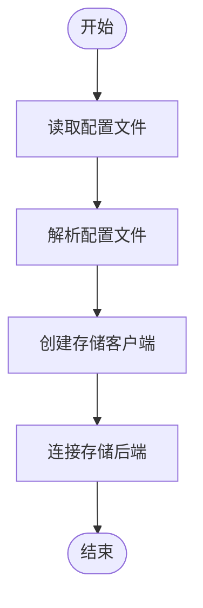
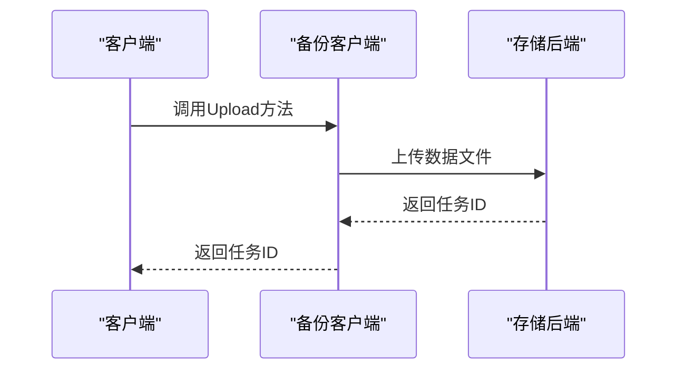
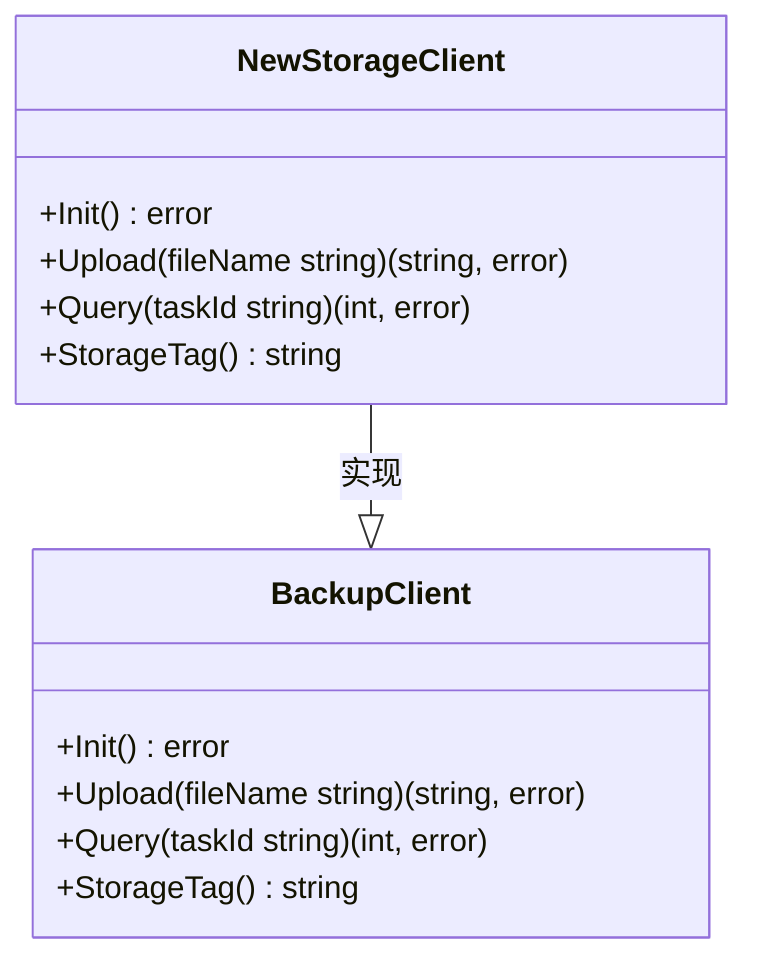

# 存储类型

<cite>
**本文档引用的文件**
- [backup_client.go](file://dbm-services/mysql/db-tools/mysql-dbbackup/pkg/config/backup_client.go)
- [backupclient.go](file://dbm-services/common/go-pubpkg/backupclient/backupclient.go)
- [storage_type.go](file://dbm-services/common/go-pubpkg/backupclient/storage_type.go)
- [backup.go](file://dbm-services/mysql/db-tools/mysql-rotatebinlog/pkg/backup/backup.go)
- [backup_cos.go](file://dbm-services/mysql/db-tools/mysql-rotatebinlog/pkg/backup/backup_cos.go)
- [init.go](file://dbm-services/mysql/db-tools/mysql-rotatebinlog/pkg/backup/init.go)
- [000040_tendbcomm_data.up.sql](file://dbm-services/common/db-config/assets/migrations/000040_tendbcomm_data.up.sql)
- [000015_rediscomm_data.up.sql](file://dbm-services/common/db-config/assets/migrations/000015_rediscomm_data.up.sql)
</cite>

## 目录
1. [引言](#引言)
2. [存储类型概述](#存储类型概述)
3. [本地存储](#本地存储)
4. [S3对象存储](#s3对象存储)
5. [Ceph分布式存储](#ceph分布式存储)
6. [存储类型配置与初始化](#存储类型配置与初始化)
7. [读写操作实现](#读写操作实现)
8. [存储类型扩展机制](#存储类型扩展机制)
9. [存储类型选择最佳实践](#存储类型选择最佳实践)
10. [结论](#结论)

## 引言
本文档详细说明备份系统支持的多种存储类型，包括本地存储、S3对象存储和Ceph分布式存储的实现机制。文档将解释每种存储类型的适用场景、性能特征和配置要求，并结合代码示例展示不同存储类型的初始化过程、连接配置和读写操作。此外，文档还将涵盖存储类型的扩展机制，如何添加新的存储后端，以及存储类型选择的最佳实践。

## 存储类型概述
备份系统支持多种存储类型，包括本地存储、S3对象存储和Ceph分布式存储。这些存储类型通过统一的接口进行管理，确保了系统的灵活性和可扩展性。每种存储类型都有其特定的适用场景和性能特征，用户可以根据实际需求选择合适的存储类型。

**存储类型配置**
- **本地存储**: 适用于小规模数据备份，具有较高的读写性能。
- **S3对象存储**: 适用于大规模数据备份，具有良好的可扩展性和可靠性。
- **Ceph分布式存储**: 适用于高可用性要求的数据备份，具有优秀的容错能力。

**存储类型选择**
- **性能要求**: 本地存储提供最高的读写性能，适合对性能要求较高的场景。
- **可扩展性**: S3对象存储和Ceph分布式存储都具有良好的可扩展性，适合大规模数据备份。
- **成本考虑**: 本地存储的成本较低，而S3对象存储和Ceph分布式存储的成本较高，但提供了更高的可靠性和可用性。

## 本地存储
本地存储是备份系统中最基本的存储类型，适用于小规模数据备份。本地存储通过直接写入本地磁盘来实现数据的持久化，具有较高的读写性能和较低的延迟。

### 适用场景
- **小规模数据备份**: 适用于数据量较小的备份需求，如开发环境或测试环境。
- **高性能要求**: 适用于对读写性能有较高要求的场景，如实时数据处理。

### 性能特征
- **高读写性能**: 由于数据直接写入本地磁盘，读写性能较高。
- **低延迟**: 本地存储的延迟较低，适合对延迟敏感的应用。

### 配置要求
- **磁盘空间**: 确保有足够的磁盘空间用于数据备份。
- **文件系统**: 使用高性能的文件系统，如XFS或ext4，以提高读写性能。

**Section sources**
- [backup_client.go](file://dbm-services/mysql/db-tools/mysql-dbbackup/pkg/config/backup_client.go#L16-L23)

## S3对象存储
S3对象存储是一种云存储服务，适用于大规模数据备份。S3对象存储通过HTTP/HTTPS协议提供数据的读写访问，具有良好的可扩展性和可靠性。

### 适用场景
- **大规模数据备份**: 适用于数据量较大的备份需求，如生产环境。
- **跨地域备份**: 适用于需要跨地域备份的场景，如灾难恢复。

### 性能特征
- **高可扩展性**: S3对象存储可以轻松扩展到PB级，适合大规模数据备份。
- **高可靠性**: S3对象存储提供99.999999999%的数据持久性，确保数据的安全性。

### 配置要求
- **认证信息**: 配置S3对象存储的认证信息，如Access Key和Secret Key。
- **存储桶**: 创建S3存储桶，并配置相应的权限。

**Section sources**
- [backupclient.go](file://dbm-services/common/go-pubpkg/backupclient/backupclient.go#L28-L30)
- [storage_type.go](file://dbm-services/common/go-pubpkg/backupclient/storage_type.go#L5-L7)

## Ceph分布式存储
Ceph分布式存储是一种高可用性存储系统，适用于对数据可用性要求较高的场景。Ceph分布式存储通过分布式架构提供数据的持久化，具有优秀的容错能力和高可用性。

### 适用场景
- **高可用性要求**: 适用于对数据可用性有较高要求的场景，如金融系统。
- **大规模数据备份**: 适用于数据量较大的备份需求，如大数据平台。

### 性能特征
- **高可用性**: Ceph分布式存储通过多副本机制确保数据的高可用性。
- **容错能力**: Ceph分布式存储具有优秀的容错能力，即使部分节点故障，数据仍然可用。

### 配置要求
- **集群配置**: 配置Ceph集群，包括Monitor节点、OSD节点和MDS节点。
- **网络配置**: 确保Ceph集群内部网络的稳定性和低延迟。

**Section sources**
- [backupclient.go](file://dbm-services/common/go-pubpkg/backupclient/backupclient.go#L47)
- [000040_tendbcomm_data.up.sql](file://dbm-services/common/db-config/assets/migrations/000040_tendbcomm_data.up.sql#L67)

## 存储类型配置与初始化
备份系统的存储类型通过配置文件进行管理，用户可以通过配置文件指定不同的存储类型。初始化过程包括读取配置文件、创建存储客户端和连接存储后端。

### 配置文件
配置文件中定义了存储类型的相关参数，如存储类型、认证信息和存储路径。用户可以通过修改配置文件来切换不同的存储类型。



**Diagram sources**
- [backup_client.go](file://dbm-services/mysql/db-tools/mysql-dbbackup/pkg/config/backup_client.go#L16-L23)
- [init.go](file://dbm-services/mysql/db-tools/mysql-rotatebinlog/pkg/backup/init.go#L12-L48)

### 初始化过程
初始化过程通过`InitBackupClient`函数实现，该函数读取配置文件中的存储类型，并创建相应的存储客户端。如果配置文件中指定了多个存储类型，则按顺序尝试初始化，直到成功为止。

**Section sources**
- [init.go](file://dbm-services/mysql/db-tools/mysql-rotatebinlog/pkg/backup/init.go#L12-L48)

## 读写操作实现
备份系统的读写操作通过统一的接口进行管理，确保了不同存储类型之间的兼容性。读写操作包括数据上传、查询和下载。

### 数据上传
数据上传通过`Upload`方法实现，该方法将数据文件上传到指定的存储后端。上传过程中，系统会生成一个唯一的任务ID，用于后续的查询和管理。



**Diagram sources**
- [backup_cos.go](file://dbm-services/mysql/db-tools/mysql-rotatebinlog/pkg/backup/backup_cos.go#L29-L35)
- [backupclient.go](file://dbm-services/common/go-pubpkg/backupclient/backupclient.go#L105-L108)

### 查询操作
查询操作通过`Query`方法实现，该方法根据任务ID查询数据上传的状态。查询结果包括上传状态和状态消息，用户可以根据查询结果判断上传是否成功。

**Section sources**
- [backup.go](file://dbm-services/mysql/db-tools/mysql-rotatebinlog/pkg/backup/backup.go#L8)
- [backup_cos.go](file://dbm-services/mysql/db-tools/mysql-rotatebinlog/pkg/backup/backup_cos.go#L37-L41)

### 数据下载
数据下载通过`Download`方法实现，该方法根据任务ID从存储后端下载数据文件。下载过程中，系统会检查数据文件的完整性，确保数据的正确性。

**Section sources**
- [backupclient.go](file://dbm-services/common/go-pubpkg/backupclient/backupclient.go#L126-L149)

## 存储类型扩展机制
备份系统支持通过插件机制扩展新的存储类型。用户可以通过实现`BackupClient`接口来添加新的存储后端，从而扩展系统的存储能力。

### 扩展步骤
1. **实现接口**: 实现`BackupClient`接口，定义新的存储类型的读写操作。
2. **注册插件**: 在配置文件中注册新的存储类型插件。
3. **测试验证**: 测试新的存储类型插件，确保其功能正常。



**Diagram sources**
- [backup.go](file://dbm-services/mysql/db-tools/mysql-rotatebinlog/pkg/backup/backup.go#L5-L10)
- [backup_cos.go](file://dbm-services/mysql/db-tools/mysql-rotatebinlog/pkg/backup/backup_cos.go#L10-L17)

### 添加新的存储后端
添加新的存储后端需要实现`BackupClient`接口，并在配置文件中注册新的存储类型。例如，添加一个名为`NewStorage`的存储后端，需要在配置文件中添加如下配置：

```ini
[backup_client]
enable = yes
storage_type = newstorage
file_tag = NEW_STORAGE_TAG
tool_path = /usr/local/newstorage/bin/newstorage_client
```

**Section sources**
- [backup.go](file://dbm-services/mysql/db-tools/mysql-rotatebinlog/pkg/backup/backup.go#L5-L10)
- [init.go](file://dbm-services/mysql/db-tools/mysql-rotatebinlog/pkg/backup/init.go#L12-L48)

## 存储类型选择最佳实践
选择合适的存储类型对于备份系统的性能和可靠性至关重要。以下是一些存储类型选择的最佳实践：

### 小规模数据备份
- **推荐存储类型**: 本地存储
- **理由**: 本地存储具有较高的读写性能和较低的延迟，适合小规模数据备份。

### 大规模数据备份
- **推荐存储类型**: S3对象存储或Ceph分布式存储
- **理由**: S3对象存储和Ceph分布式存储都具有良好的可扩展性和可靠性，适合大规模数据备份。

### 高可用性要求
- **推荐存储类型**: Ceph分布式存储
- **理由**: Ceph分布式存储通过多副本机制确保数据的高可用性，适合对数据可用性有较高要求的场景。

### 成本考虑
- **推荐存储类型**: 本地存储
- **理由**: 本地存储的成本较低，适合预算有限的场景。

**Section sources**
- [000040_tendbcomm_data.up.sql](file://dbm-services/common/db-config/assets/migrations/000040_tendbcomm_data.up.sql#L67)
- [000015_rediscomm_data.up.sql](file://dbm-services/common/db-config/assets/migrations/000015_rediscomm_data.up.sql#L76)

## 结论
本文档详细说明了备份系统支持的多种存储类型，包括本地存储、S3对象存储和Ceph分布式存储的实现机制。通过配置文件和统一的接口，系统能够灵活地支持不同的存储类型。用户可以根据实际需求选择合适的存储类型，并通过插件机制扩展新的存储后端。选择合适的存储类型对于备份系统的性能和可靠性至关重要，建议根据数据规模、性能要求和成本考虑来选择最合适的存储类型。