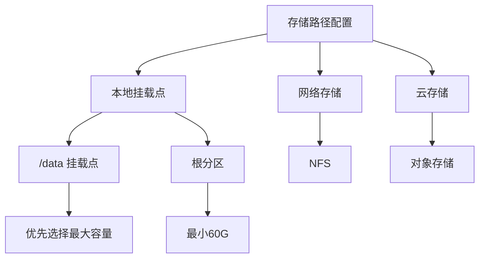
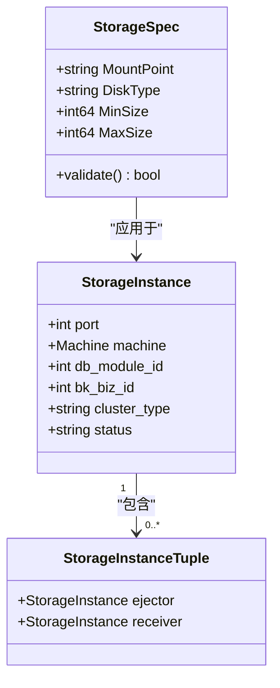
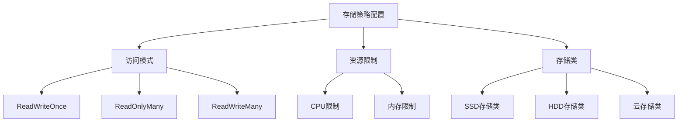
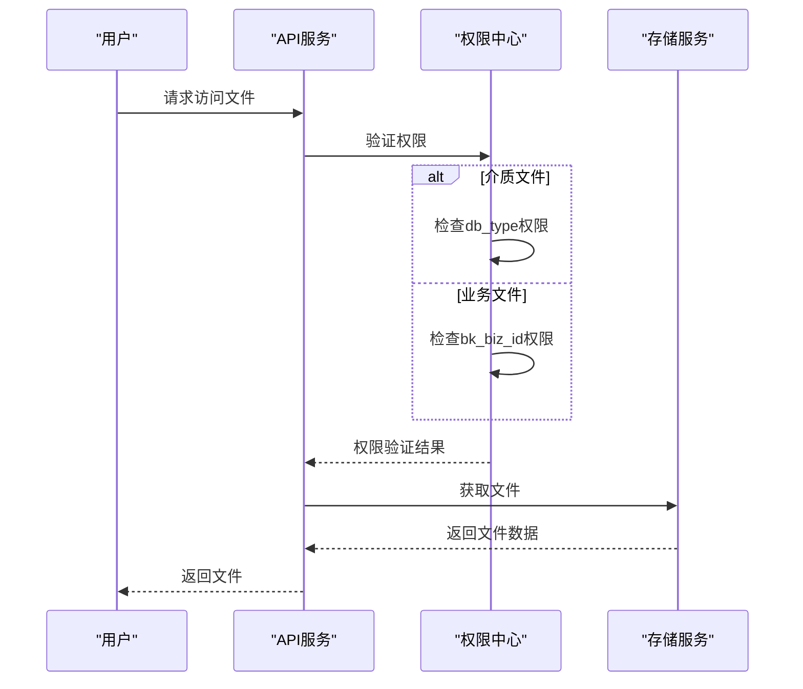
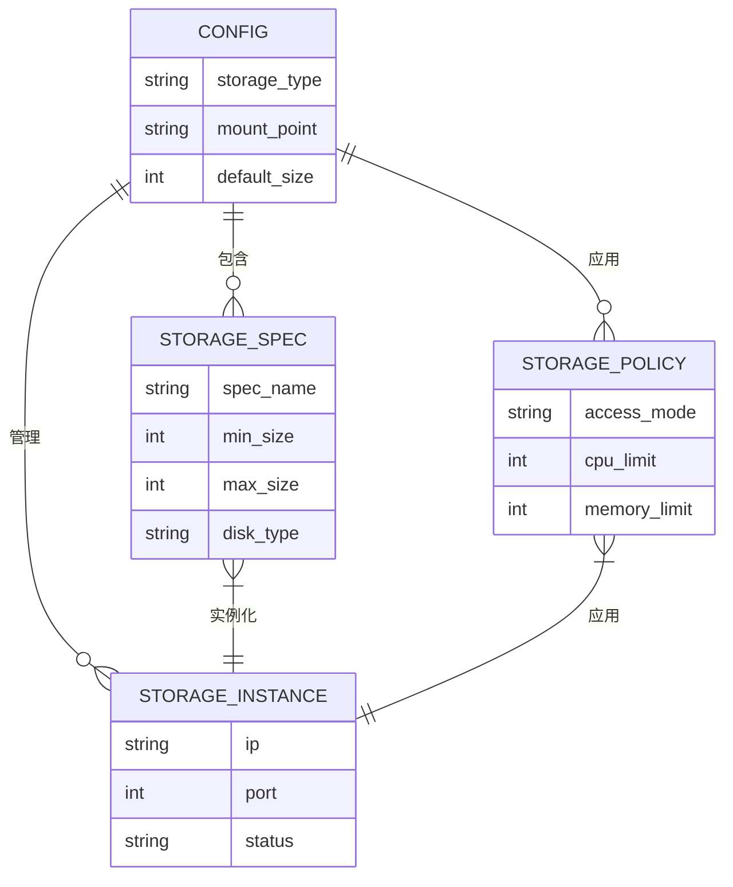
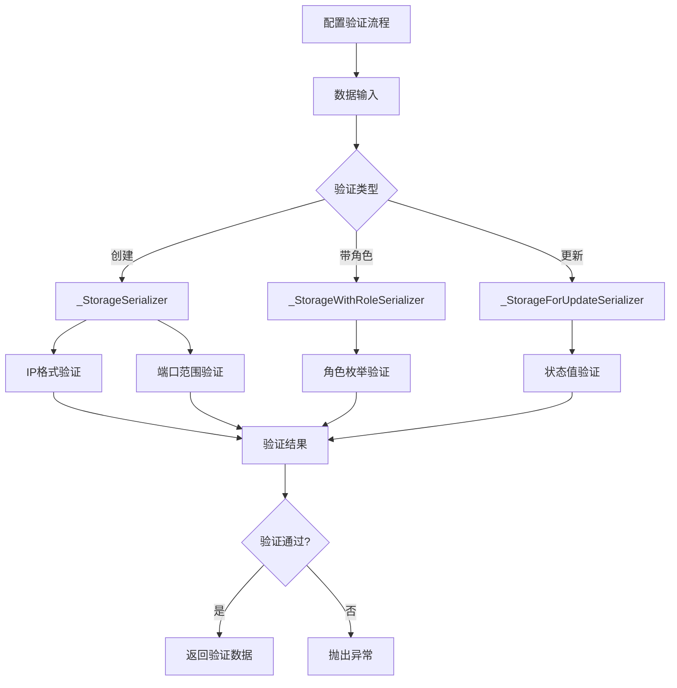
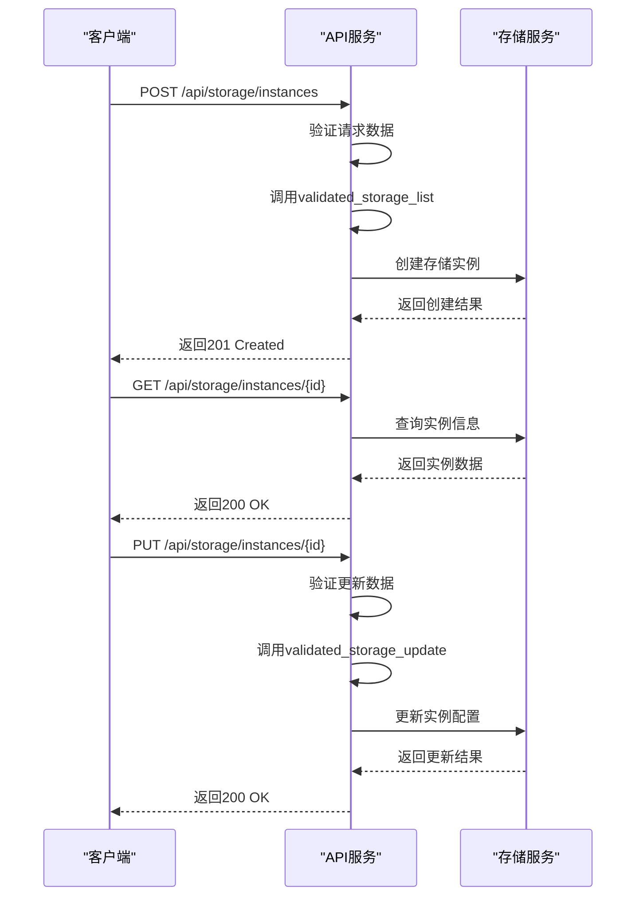
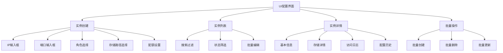
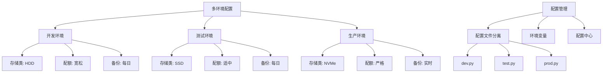
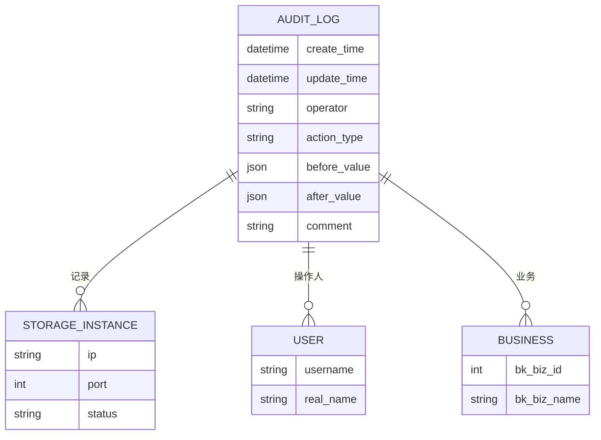

# 存储配置

<cite>
**本文档引用的文件**
- [storage.py](file://dbm-ui/backend/core/storages/storage.py)
- [storage_instance.py](file://dbm-ui/backend/db_meta/request_validator/storage_instance.py)
- [storage_type.go](file://dbm-services/common/go-pubpkg/backupclient/storage_type.go)
- [storageAddonCluster](file://dbm-services/k8s-dbs/k8s-utils/helm/storageAddonCluster/victoriametrics-cluster/templates/cluster.yaml)
- [rs_list.go](file://dbm-services/common/db-resource/internal/controller/manage/rs_list.go)
- [storage.tpl](file://helm-charts/bk-dbm/charts/k8s-dbs/charts/common/templates/_storage.tpl)
- [storage_instance_tuple.py](file://dbm-ui/backend/db_meta/models/storage_instance_tuple.py)
- [storage_set_dtl.py](file://dbm-ui/backend/db_meta/models/storage_set_dtl.py)
- [disk.go](file://dbm-services/bigdata/db-tools/dbactuator/pkg/components/hdfs/util/disk.go)
- [mountpoint.go](file://dbm-services/mysql/db-tools/dbactuator/pkg/util/osutil/mountpoint.go)
</cite>

## 目录
1. [存储配置概述](#存储配置概述)
2. [存储路径配置](#存储路径配置)
3. [存储配额管理](#存储配额管理)
4. [存储策略配置](#存储策略配置)
5. [访问权限控制](#访问权限控制)
6. [配置文件结构](#配置文件结构)
7. [配置验证机制](#配置验证机制)
8. [API配置接口](#api配置接口)
9. [UI界面配置](#ui界面配置)
10. [配置继承机制](#配置继承机制)
11. [多环境配置管理](#多环境配置管理)
12. [配置变更审计](#配置变更审计)

## 存储配置概述

本系统提供全面的备份存储配置功能，支持存储路径、存储配额、存储策略和访问权限的精细化管理。系统通过统一的配置框架实现了存储资源的集中管理，支持多种存储类型和访问方式。存储配置贯穿于数据库实例管理的各个层面，从物理存储设备到逻辑存储实例都有完整的配置体系。

**Section sources**
- [storage.py](file://dbm-ui/backend/core/storages/storage.py#L1-L346)
- [storage_instance.py](file://dbm-ui/backend/db_meta/request_validator/storage_instance.py#L1-L85)

## 存储路径配置

存储路径配置是存储管理的基础，系统支持多种存储路径的定义和管理。在HDFS和Doris等大数据组件中，系统通过`GetMaxSize`函数获取挂载点中最大的磁盘容量，并优先选择`/data`开头的挂载点作为存储路径。系统提供了`IsMountPoint`和`FindFirstMountPoint`等工具函数来检测和查找挂载点。

在Kubernetes环境中，存储路径通过Helm Chart的`volumeClaimTemplates`进行配置，定义了数据卷的名称、访问模式、存储请求和存储类。例如，VictoriaMetrics集群的存储配置中，`data`卷的存储大小由`storage`参数指定。



**Diagram sources**
- [disk.go](file://dbm-services/bigdata/db-tools/dbactuator/pkg/components/hdfs/util/disk.go#L10-L30)
- [mountpoint.go](file://dbm-services/mysql/db-tools/dbactuator/pkg/util/osutil/mountpoint.go#L15-L28)
- [cluster.yaml](file://dbm-services/k8s-dbs/k8s-utils/helm/storageAddonCluster/victoriametrics-cluster/templates/cluster.yaml#L80-L89)

**Section sources**
- [disk.go](file://dbm-services/bigdata/db-tools/dbactuator/pkg/components/hdfs/util/disk.go#L10-L65)
- [mountpoint.go](file://dbm-services/mysql/db-tools/dbactuator/pkg/util/osutil/mountpoint.go#L15-L57)

## 存储配额管理

存储配额管理通过存储规格(StorageSpecs)实现，支持最小和最大存储大小的配置。在资源管理模块中，系统通过`StorageSpecs`结构体定义存储规格，包括挂载点、磁盘类型、最小和最大大小等属性。当配置最大大小大于0时，系统会添加数值范围查询条件；当只有最小大小时，则添加大于等于查询条件。

系统还提供了存储实例的配额管理，通过`StorageInstance`模型中的`db_module_id`、`bk_biz_id`等字段实现业务级别的配额控制。存储配额的配置支持批量操作，可以同时为多个实例设置相同的配额策略。



**Diagram sources**
- [rs_list.go](file://dbm-services/common/db-resource/internal/controller/manage/rs_list.go#L110-L124)
- [storage_instance.py](file://dbm-ui/backend/db_meta/models/instance.py#L113-L161)

**Section sources**
- [rs_list.go](file://dbm-services/common/db-resource/internal/controller/manage/rs_list.go#L110-L137)
- [storage_instance.py](file://dbm-ui/backend/db_meta/models/instance.py#L113-L161)

## 存储策略配置

存储策略配置通过Helm Chart模板和存储类(StorageClass)实现。系统使用通用的存储模板`_storage.tpl`来定义存储类，支持全局存储类配置的覆盖。存储策略包括访问模式、资源限制、存储类名等属性，可以根据不同环境和需求进行灵活配置。

在VictoriaMetrics集群的配置中，存储策略定义了CPU和内存的资源限制和请求，以及数据卷的访问模式和存储类。系统还支持存储策略的继承和覆盖，子模块可以继承父模块的存储策略，也可以根据需要进行个性化配置。



**Diagram sources**
- [cluster.yaml](file://dbm-services/k8s-dbs/k8s-utils/helm/storageAddonCluster/victoriametrics-cluster/templates/cluster.yaml#L74-L91)
- [storage.tpl](file://helm-charts/bk-dbm/charts/k8s-dbs/charts/common/templates/_storage.tpl#L1-L23)

**Section sources**
- [cluster.yaml](file://dbm-services/k8s-dbs/k8s-utils/helm/storageAddonCluster/victoriametrics-cluster/templates/cluster.yaml#L62-L94)
- [storage.tpl](file://helm-charts/bk-dbm/charts/k8s-dbs/charts/common/templates/_storage.tpl#L1-L23)

## 访问权限控制

访问权限控制通过制品库鉴权机制实现，根据文件路径的不同类型应用不同的鉴权策略。对于版本介质文件，系统根据数据库类型进行鉴权；对于业务临时文件，系统根据业务ID(bk_biz_id)进行鉴权。系统禁止同时操作介质文件和业务临时文件，确保权限边界的清晰。

在存储客户端配置中，系统支持用户名密码认证，通过`credential_auth_info`字段存储认证信息。存储访问权限还与云区域(bk_cloud_id)和IP地址绑定，确保只有授权的服务器可以访问存储资源。



**Diagram sources**
- [storage.py](file://dbm-ui/backend/core/storages/storage.py#L192-L198)
- [storage.py](file://dbm-ui/backend/core/storages/storage.py#L293-L294)

**Section sources**
- [storage.py](file://dbm-ui/backend/core/storages/storage.py#L23-L113)
- [storage.py](file://dbm-ui/backend/core/storages/storage.py#L190-L300)

## 配置文件结构

配置文件结构采用分层设计，包括全局配置、模块配置和实例配置。在Helm Chart中，存储配置通过`values.yaml`文件定义，包含存储类、资源限制、持久化设置等属性。系统使用Viper库读取配置，支持环境变量覆盖。

存储配置文件的主要结构包括：
- 存储类型：定义存储后端类型
- 存储路径：定义数据存储的目录
- 资源限制：定义CPU和内存使用上限
- 持久化设置：定义持久化卷的配置
- 访问模式：定义存储的访问权限



**Diagram sources**
- [cluster.yaml](file://dbm-services/k8s-dbs/k8s-utils/helm/storageAddonCluster/victoriametrics-cluster/templates/cluster.yaml#L62-L94)
- [storage.tpl](file://helm-charts/bk-dbm/charts/k8s-dbs/charts/common/templates/_storage.tpl#L1-L23)

**Section sources**
- [cluster.yaml](file://dbm-services/k8s-dbs/k8s-utils/helm/storageAddonCluster/victoriametrics-cluster/templates/cluster.yaml#L62-L94)
- [storage.tpl](file://helm-charts/bk-dbm/charts/k8s-dbs/charts/common/templates/_storage.tpl#L1-L23)

## 配置验证机制

配置验证机制通过序列化器(Serializer)实现，确保配置数据的完整性和正确性。系统定义了多种存储实例序列化器，包括`_StorageSerializer`、`_StorageWithRoleSerializer`和`_StorageForUpdateSerializer`，分别用于不同场景的配置验证。

验证规则包括：
- IP地址格式验证
- 端口范围验证(1025-65535)
- 实例角色枚举值验证
- 状态值验证
- 业务ID一致性验证

系统还提供了批量验证函数，如`validated_storage_list`和`validated_storage_update`，支持批量配置的验证。验证失败时，系统会抛出详细的错误信息，帮助用户快速定位问题。



**Diagram sources**
- [storage_instance.py](file://dbm-ui/backend/db_meta/request_validator/storage_instance.py#L20-L36)

**Section sources**
- [storage_instance.py](file://dbm-ui/backend/db_meta/request_validator/storage_instance.py#L20-L65)

## API配置接口

API配置接口提供了一系列RESTful端点，支持存储配置的增删改查操作。系统通过`create`接口支持实例的批量添加，`update`接口支持配置的更新。API接口采用JSON格式传输数据，支持标准的HTTP状态码返回。

在制品库访问方面，系统提供了临时凭证创建接口`create_bkrepo_access_token`，支持设置过期时间和访问次数限制。下载接口`build_download_url`支持强制下载参数，可以控制浏览器的行为。



**Diagram sources**
- [storage_instance.py](file://dbm-ui/backend/db_meta/request_validator/storage_instance.py#L38-L59)
- [storage.py](file://dbm-ui/backend/core/storages/storage.py#L95-L113)

**Section sources**
- [storage_instance.py](file://dbm-ui/backend/db_meta/request_validator/storage_instance.py#L38-L65)
- [storage.py](file://dbm-ui/backend/core/storages/storage.py#L95-L113)

## UI界面配置

UI界面配置通过前端组件和后端API协同实现。系统提供了存储实例管理界面，支持实例的创建、查看和更新操作。在创建实例时，界面会根据验证规则实时提示用户输入的有效性。

对于存储路径选择，界面会显示可用的挂载点列表，并根据磁盘大小进行排序，帮助用户选择最优的存储路径。存储配额配置界面提供了滑块和输入框，支持直观的配额设置。



**Diagram sources**
- [storage_instance.py](file://dbm-ui/backend/db_meta/request_validator/storage_instance.py#L20-L36)
- [storage.py](file://dbm-ui/backend/core/storages/storage.py#L117-L167)

**Section sources**
- [storage_instance.py](file://dbm-ui/backend/db_meta/request_validator/storage_instance.py#L20-L65)
- [storage.py](file://dbm-ui/backend/core/storages/storage.py#L117-L167)

## 配置继承机制

配置继承机制通过模板和默认值实现，支持配置的层级继承和覆盖。在Helm Chart中，子模板可以继承父模板的存储配置，也可以通过覆盖参数实现个性化配置。系统定义了全局默认存储类，各模块可以继承或覆盖。

存储实例的配置继承体现在多个层面：
- 从集群模板继承存储策略
- 从业务配置继承配额限制
- 从环境配置继承访问权限
- 从默认值继承基础设置

```mermaid
classDiagram
class GlobalConfig {
+string default_storage_class
+int default_size
+string default_access_mode
}
class ClusterTemplate {
+string storage_class
+int size
+string access_mode
}
class BusinessConfig {
+int quota_limit
+string allowed_types
}
class StorageInstance {
+string storage_class
+int size
+string access_mode
+int quota_used
}
GlobalConfig <|-- ClusterTemplate : "继承"
ClusterTemplate <|-- StorageInstance : "实例化"
BusinessConfig <|-- StorageInstance : "应用"
note right of GlobalConfig
全局默认配置
可被所有模块继承
end note
note right of ClusterTemplate
集群模板配置
定义集群级别的存储策略
end note
note right of BusinessConfig
业务配额配置
控制业务的存储使用
end note
```

**Diagram sources**
- [storage.tpl](file://helm-charts/bk-dbm/charts/k8s-dbs/charts/common/templates/_storage.tpl#L8-L12)
- [rs_list.go](file://dbm-services/common/db-resource/internal/controller/manage/rs_list.go#L110-L124)

**Section sources**
- [storage.tpl](file://helm-charts/bk-dbm/charts/k8s-dbs/charts/common/templates/_storage.tpl#L1-L23)
- [rs_list.go](file://dbm-services/common/db-resource/internal/controller/manage/rs_list.go#L110-L137)

## 多环境配置管理

多环境配置管理通过配置文件分离和环境变量实现。系统支持开发、测试、生产等多种环境的配置管理，每个环境有独立的配置文件。配置通过`settings`模块加载，支持环境特定的配置覆盖。

在存储配置方面，不同环境可以有不同的存储策略：
- 开发环境：使用普通HDD存储，配额宽松
- 测试环境：使用SSD存储，配额适中
- 生产环境：使用高性能存储，严格配额控制



**Diagram sources**
- [config.py](file://dbm-ui/backend/config/__init__.py)
- [settings.py](file://dbm-ui/backend/settings.py)

**Section sources**
- [config.py](file://dbm-ui/backend/config/__init__.py)
- [settings.py](file://dbm-ui/backend/settings.py)

## 配置变更审计

配置变更审计通过审计模型(AuditedModel)实现，记录所有配置变更的历史。系统中的`StorageInstance`和`StorageInstanceTuple`等模型都继承自`AuditedModel`，自动记录创建和修改时间、操作人等信息。

审计日志包含以下信息：
- 变更时间
- 操作用户
- 变更类型(创建、更新、删除)
- 变更前后的配置值
- 关联的业务和集群



**Diagram sources**
- [storage_instance.py](file://dbm-ui/backend/db_meta/models/instance.py#L113-L144)
- [storage_instance_tuple.py](file://dbm-ui/backend/db_meta/models/storage_instance_tuple.py#L18-L38)

**Section sources**
- [storage_instance.py](file://dbm-ui/backend/db_meta/models/instance.py#L113-L161)
- [storage_instance_tuple.py](file://dbm-ui/backend/db_meta/models/storage_instance_tuple.py#L18-L38)