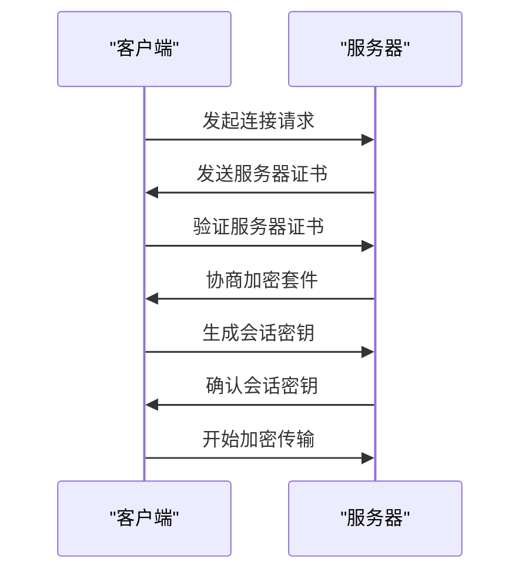
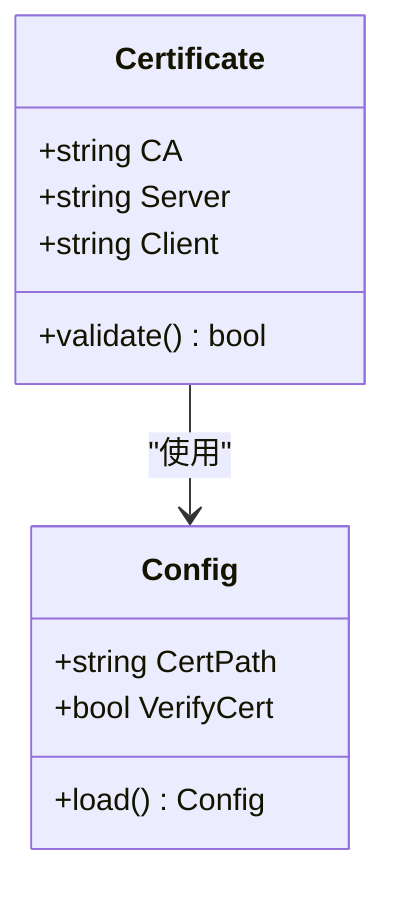
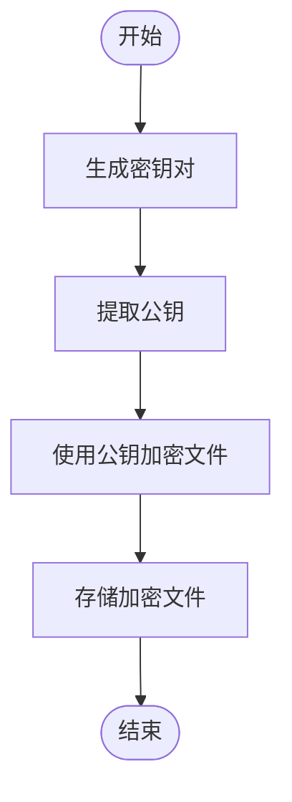
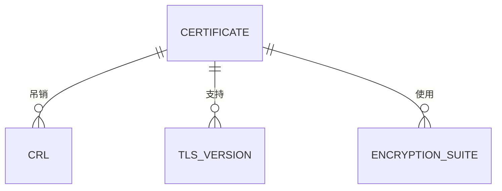

# 备份传输安全

<cite>
**本文档引用的文件**  
- [dbbackup-go readme.md](file://dbm-services/mysql/db-tools/mysql-dbbackup/docs/readme.md)
- [default.py](file://dbm-ui/config/default.py)
- [pt-table-checksum](file://dbm-services/mysql/db-tools/mysql-table-checksum/pt-table-checksum)
- [pt-table-sync](file://dbm-services/mysql/db-tools/mysql-table-checksum/pt-table-sync)
- [pt-config-diff](file://dbm-services/mysql/db-tools/mysql-monitor/pt-config-diff)
- [fullbackup.json](file://dbm-ui/backend/components/dbconfig/migrations/tendbcluster/backup/binlog_rotate.yaml.json)
- [dbbackup.ini.json](file://dbm-ui/backend/components/dbconfig/migrations/tendbha/backup/dbbackup.ini.json)
- [sensitive.go](file://dbm-services/common/db-config/internal/repository/migratespec/sensitive.go)
- [make_ssl_pairs.sh](file://dbm-ui/scripts/make_ssl_pairs.sh)
</cite>

## 目录
1. [引言](#引言)
2. [备份传输安全机制概述](#备份传输安全机制概述)
3. [SSL/TLS协议在备份传输中的应用](#ssl/tls协议在备份传输中的应用)
4. [证书管理与配置](#证书管理与配置)
5. [加密算法与密钥管理](#加密算法与密钥管理)
6. [安全最佳实践](#安全最佳实践)
7. [结论](#结论)

## 引言
本文档系统性地阐述了备份传输过程中的安全机制，重点描述如何通过SSL/TLS协议保障数据在传输过程中的机密性和完整性。文档详细说明了证书的生成、验证和管理流程，包括CA证书、服务器证书和客户端证书的配置与使用。结合代码示例，解释了SSL/TLS握手过程、加密套件选择和会话恢复机制。同时，文档涵盖了证书吊销检查、安全协议版本控制和中间人攻击防护等安全最佳实践。

**Section sources**
- [dbbackup-go readme.md](file://dbm-services/mysql/db-tools/mysql-dbbackup/docs/readme.md#L1-L401)

## 备份传输安全机制概述
备份传输安全机制主要通过SSL/TLS协议来保障数据在传输过程中的机密性和完整性。系统通过配置CA证书、服务器证书和客户端证书，确保通信双方的身份验证和数据加密。此外，系统还支持多种加密算法，包括AES和国密SM4算法，以满足不同的安全需求。

**Section sources**
- [dbbackup-go readme.md](file://dbm-services/mysql/db-tools/mysql-dbbackup/docs/readme.md#L1-L401)
- [default.py](file://dbm-ui/config/default.py#L533-L577)

## SSL/TLS协议在备份传输中的应用
SSL/TLS协议在备份传输中起到了关键作用，确保了数据在传输过程中的机密性和完整性。系统通过以下方式应用SSL/TLS协议：

1. **SSL/TLS握手过程**：在建立连接时，客户端和服务器通过SSL/TLS握手过程协商加密算法和密钥，确保通信的安全性。
2. **加密套件选择**：系统支持多种加密套件，包括AES和SM4算法，可以根据安全需求选择合适的加密套件。
3. **会话恢复机制**：通过会话恢复机制，减少SSL/TLS握手的开销，提高传输效率。

**Diagram sources**
- [pt-table-checksum](file://dbm-services/mysql/db-tools/mysql-table-checksum/pt-table-checksum#L360-L376)
- [pt-table-sync](file://dbm-services/mysql/db-tools/mysql-table-checksum/pt-table-sync#L8795-L8808)
- [pt-config-diff](file://dbm-services/mysql/db-tools/mysql-monitor/pt-config-diff#L4338-L4351)

**Section sources**
- [pt-table-checksum](file://dbm-services/mysql/db-tools/mysql-table-checksum/pt-table-checksum#L360-L376)
- [pt-table-sync](file://dbm-services/mysql/db-tools/mysql-table-checksum/pt-table-sync#L8795-L8808)
- [pt-config-diff](file://dbm-services/mysql/db-tools/mysql-monitor/pt-config-diff#L4338-L4351)

## 证书管理与配置
证书管理是备份传输安全的重要组成部分。系统通过以下方式管理证书：

1. **CA证书**：CA证书用于验证服务器和客户端证书的合法性，确保通信双方的身份可信。
2. **服务器证书**：服务器证书用于标识服务器的身份，确保客户端连接的是正确的服务器。
3. **客户端证书**：客户端证书用于标识客户端的身份，确保服务器只接受来自可信客户端的连接。

系统通过配置文件管理证书，例如在`dbbackup.ini.json`文件中配置证书路径和验证选项。

**Diagram sources**
- [dbbackup.ini.json](file://dbm-ui/backend/components/dbconfig/migrations/tendbha/backup/dbbackup.ini.json#L572-L628)
- [fullbackup.json](file://dbm-ui/backend/components/dbconfig/migrations/tendbcluster/backup/binlog_rotate.yaml.json#L92-L150)

**Section sources**
- [dbbackup.ini.json](file://dbm-ui/backend/components/dbconfig/migrations/tendbha/backup/dbbackup.ini.json#L572-L628)
- [fullbackup.json](file://dbm-ui/backend/components/dbconfig/migrations/tendbcluster/backup/binlog_rotate.yaml.json#L92-L150)

## 加密算法与密钥管理
系统支持多种加密算法，包括AES和国密SM4算法，以满足不同的安全需求。密钥管理通过以下方式实现：

1. **对称加密**：使用AES或SM4算法对备份文件进行加密，确保数据的机密性。
2. **非对称加密**：使用RSA或SM2算法对加密密钥进行加密，确保密钥的安全传输。
3. **密钥生成**：系统通过`openssl`工具生成密钥对，确保密钥的随机性和安全性。

**Diagram sources**
- [dbbackup-go readme.md](file://dbm-services/mysql/db-tools/mysql-dbbackup/docs/readme.md#L249-L254)
- [default.py](file://dbm-ui/config/default.py#L550-L563)

**Section sources**
- [dbbackup-go readme.md](file://dbm-services/mysql/db-tools/mysql-dbbackup/docs/readme.md#L249-L254)
- [default.py](file://dbm-ui/config/default.py#L550-L563)

## 安全最佳实践
为了确保备份传输的安全性，系统遵循以下安全最佳实践：

1. **证书吊销检查**：定期检查证书吊销列表（CRL），确保使用的证书未被吊销。
2. **安全协议版本控制**：禁用不安全的SSL/TLS版本，只允许使用安全的TLS版本。
3. **中间人攻击防护**：通过证书验证和加密套件选择，防止中间人攻击。

**Diagram sources**
- [pt-table-checksum](file://dbm-services/mysql/db-tools/mysql-table-checksum/pt-table-checksum#L664-L759)
- [pt-table-sync](file://dbm-services/mysql/db-tools/mysql-table-checksum/pt-table-sync#L9096-L9191)
- [pt-config-diff](file://dbm-services/mysql/db-tools/mysql-monitor/pt-config-diff#L4639-L4734)

**Section sources**
- [pt-table-checksum](file://dbm-services/mysql/db-tools/mysql-table-checksum/pt-table-checksum#L664-L759)
- [pt-table-sync](file://dbm-services/mysql/db-tools/mysql-table-checksum/pt-table-sync#L9096-L9191)
- [pt-config-diff](file://dbm-services/mysql/db-tools/mysql-monitor/pt-config-diff#L4639-L4734)

## 结论
本文档详细阐述了备份传输过程中的安全机制，重点描述了SSL/TLS协议在保障数据机密性和完整性方面的作用。通过合理的证书管理、加密算法选择和安全最佳实践，系统能够有效防止数据泄露和中间人攻击，确保备份传输的安全性。

**Section sources**
- [dbbackup-go readme.md](file://dbm-services/mysql/db-tools/mysql-dbbackup/docs/readme.md#L1-L401)
- [default.py](file://dbm-ui/config/default.py#L533-L577)