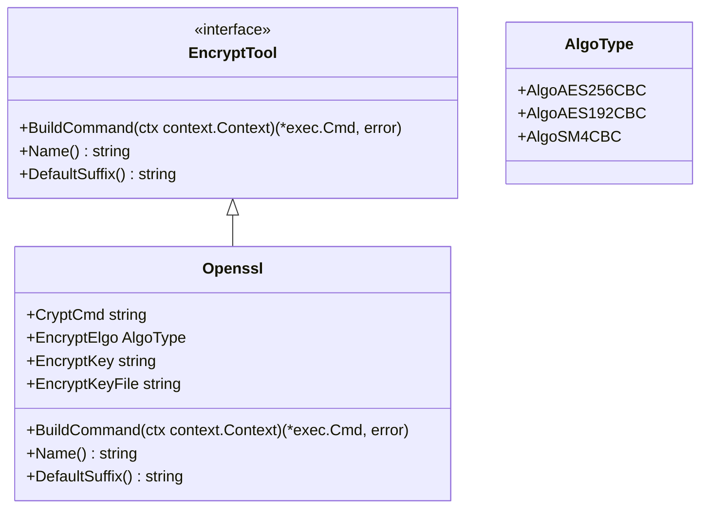
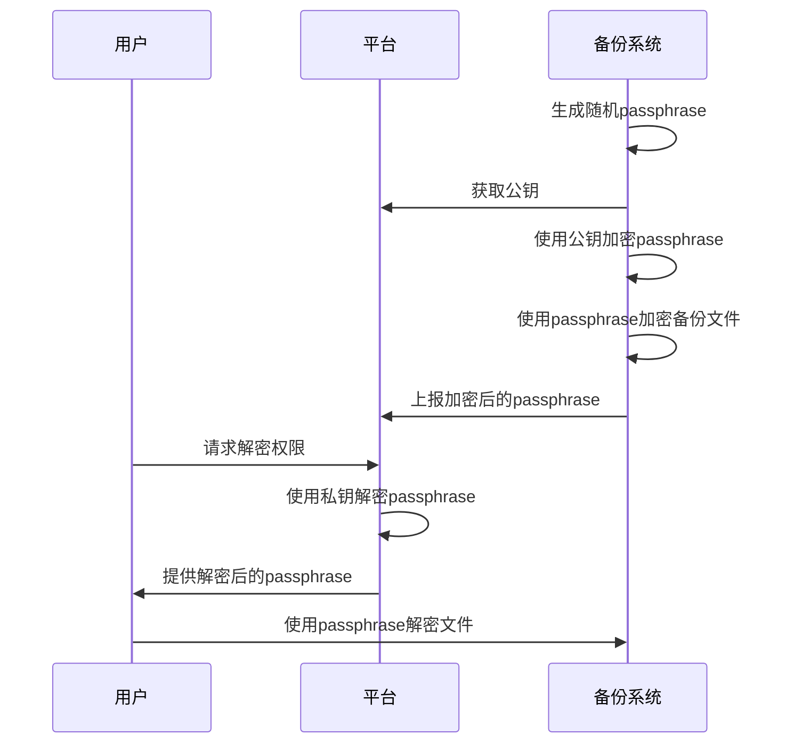
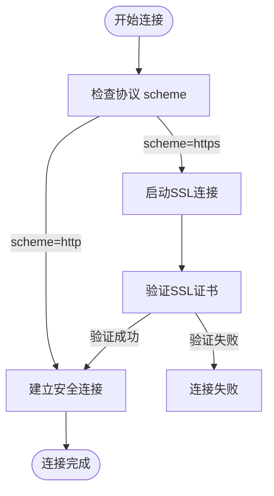
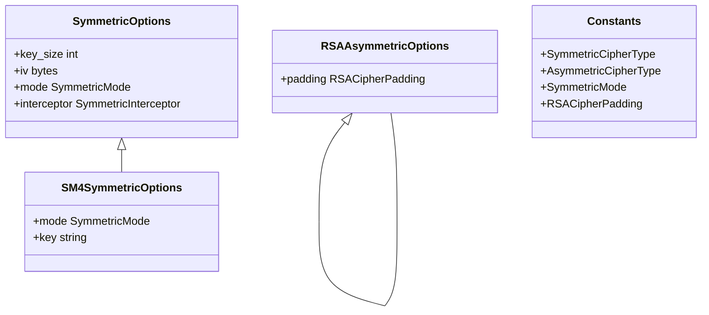
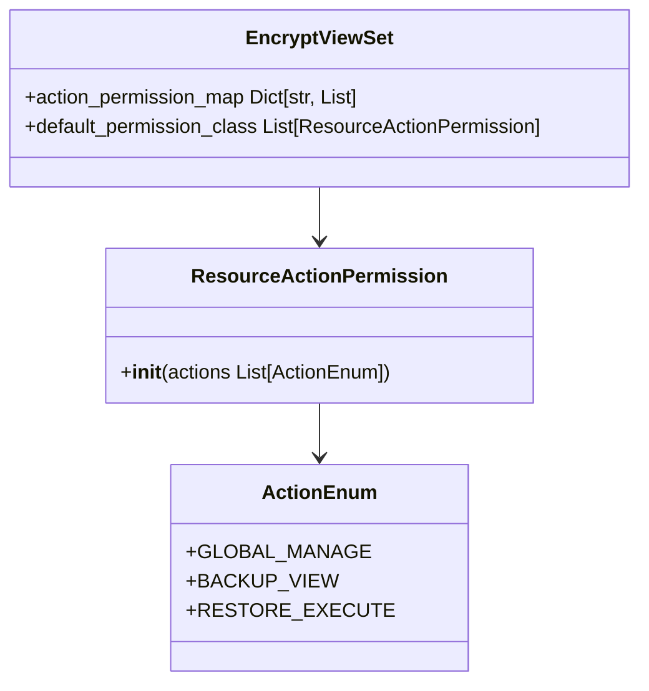
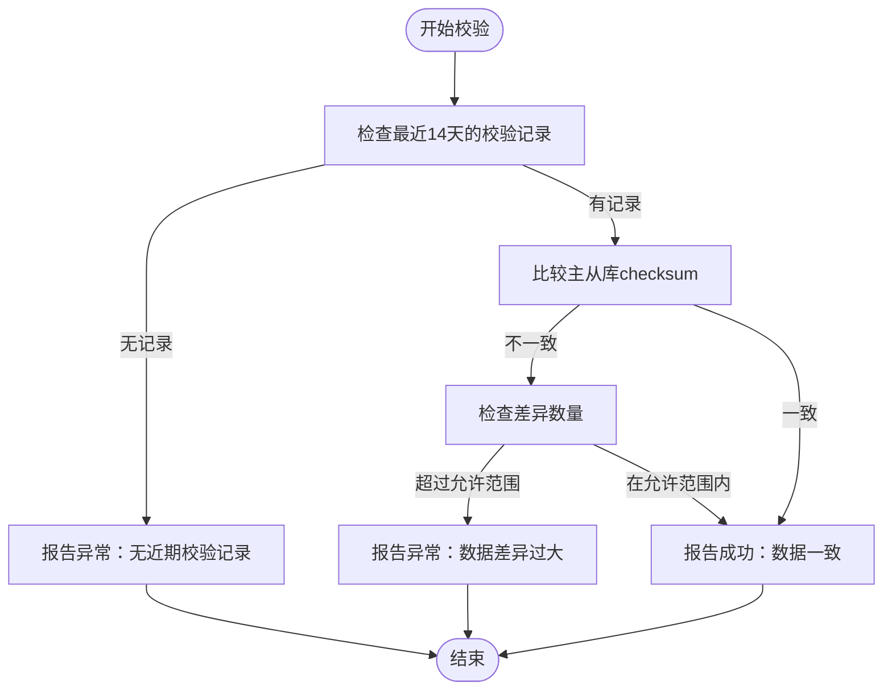
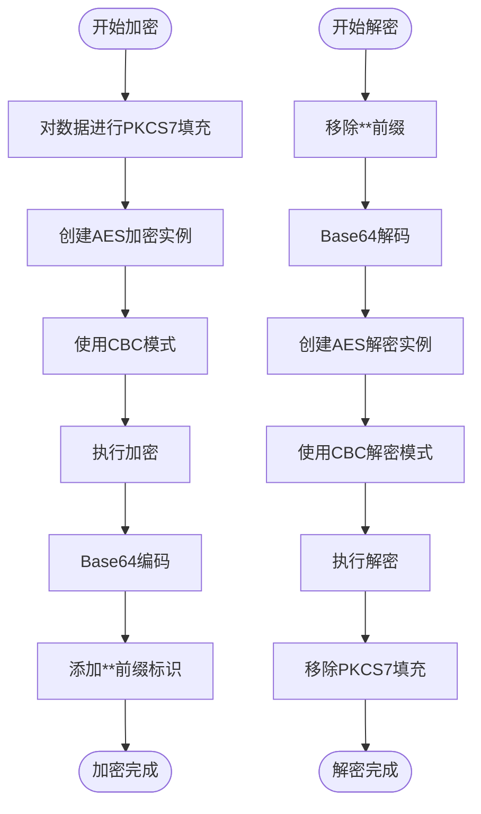

# 备份安全

<cite>
**本文档引用的文件**   
- [readme.md](file://dbm-services/mysql/db-tools/mysql-dbbackup/docs/readme.md)
- [openssl.go](file://dbm-services/common/go-pubpkg/iocrypt/openssl.go)
- [encrypt.go](file://dbm-services/common/db-config/pkg/util/crypt/encrypt.go)
- [backupclient.go](file://dbm-services/common/go-pubpkg/backupclient/backupclient.go)
- [rsa_util.go](file://dbm-services/common/go-pubpkg/iocrypt/rsa_util.go)
- [handlers.py](file://dbm-ui/backend/core/encrypt/handlers.py)
- [views.py](file://dbm-ui/backend/core/encrypt/views.py)
- [verify_checksum.py](file://dbm-ui/backend/flow/plugins/components/collections/mysql/verify_checksum.py)
- [run_command.go](file://dbm-services/mysql/db-tools/mysql-table-checksum/pkg/checker/run_command.go)
- [misc.go](file://dbm-services/mysql/db-tools/mysql-dbbackup/pkg/util/misc.go)
- [backup_index.go](file://dbm-services/mysql/db-tools/dbactuator/pkg/components/mysql/dbbackup/backup_index.go)
- [default.py](file://dbm-ui/config/default.py)
</cite>

## 目录
1. [引言](#引言)
2. [备份数据加密机制](#备份数据加密机制)
3. [传输安全机制](#传输安全机制)
4. [访问控制与密钥管理](#访问控制与密钥管理)
5. [备份验证机制](#备份验证机制)
6. [安全审计与合规性](#安全审计与合规性)

## 引言
本文档系统性地描述了蓝鲸DBM系统的备份安全机制，涵盖备份数据加密、传输安全、访问控制、备份验证、密钥管理以及安全审计等关键安全方面。文档详细说明了如何使用AES等加密算法保护备份数据，通过SSL/TLS保障传输过程的安全性，并结合代码实现解释了备份验证机制，包括校验和计算、完整性检查和恢复测试。

## 备份数据加密机制

蓝鲸DBM系统通过多层次的加密机制确保备份数据的机密性。系统支持对称加密和非对称加密相结合的方案，以保护备份文件和加密密钥本身。

### 对称加密算法（AES）
系统主要采用AES（高级加密标准）算法对备份文件进行加密。根据配置，支持多种AES加密模式：
- **aes-256-cbc**: 256位密钥的AES加密，提供最高级别的安全性
- **aes-128-cbc**: 128位密钥的AES加密，平衡安全性和性能
- **sm4-cbc**: 国密算法SM4，满足特定合规性要求

在代码实现中，`openssl.go`文件定义了`Openssl`结构体，封装了使用OpenSSL工具进行加密的功能。该结构体实现了`EncryptTool`接口，通过`BuildCommand`方法构建加密命令，确保加密过程的安全性和可配置性。



**代码来源**
- [openssl.go](file://dbm-services/common/go-pubpkg/iocrypt/openssl.go#L12-L60)

### 非对称加密与密钥保护
为保护对称加密所使用的密码（passphrase），系统采用RSA非对称加密算法。加密流程如下：
1. 系统生成随机的对称加密密码（passphrase）
2. 使用平台的公钥（public key）对passphrase进行RSA加密
3. 将加密后的passphrase与备份文件关联存储
4. 解密时，用户需通过平台界面获取解密权限，使用私钥（private key）解密passphrase

`rsa_util.go`文件提供了RSA密钥对生成和管理的核心功能，包括`GenerateKeyPair`、`PrivateKeyToBytes`和`PublicKeyToBytes`等方法，确保密钥生成和转换过程的安全性。



**代码来源**
- [rsa_util.go](file://dbm-services/common/go-pubpkg/iocrypt/rsa_util.go#L1-L53)
- [readme.md](file://dbm-services/mysql/db-tools/mysql-dbbackup/docs/readme.md#L248-L267)

## 传输安全机制

### SSL/TLS加密传输
系统在数据传输过程中强制使用SSL/TLS加密，确保数据在传输过程中的机密性和完整性。对于数据库连接和文件传输，系统均配置了相应的SSL/TLS参数。

在`pt-table-sync`脚本中，可以看到明确的SSL连接建立逻辑：


**代码来源**
- [pt-table-sync](file://dbm-services/mysql/db-tools/mysql-table-checksum/pt-table-sync#L8795-L8807)

### 安全配置管理
系统通过配置文件严格管理安全传输参数。在`default.py`配置文件中，定义了对称和非对称加密的默认选项，包括密钥大小、初始化向量（IV）和加密模式等。



**代码来源**
- [default.py](file://dbm-ui/config/default.py#L554-L577)

## 访问控制与密钥管理

### 密钥生命周期管理
系统实现了完整的密钥生命周期管理机制，包括密钥生成、存储、轮换和销毁。`handlers.py`文件中的`get_or_generate_key_pair`方法展示了密钥对的获取或生成逻辑：

```python
@classmethod
def get_or_generate_key_pair(
    cls, asymmetric_cipher: BaseAsymmetricCipher, name: str, description: Optional[str] = None
) -> Tuple[str, str]:
    """
    获取或生成非对称加密的私钥/密钥到DB
    """
    try:
        private_key = AsymmetricCipherKey.objects.get(
            name=name, type=AsymmetricCipherKeyType.PRIVATE_KEY.value, algorithm=env.ASYMMETRIC_CIPHER_TYPE
        ).content
        public_key = AsymmetricCipherKey.objects.get(
            name=name, type=AsymmetricCipherKeyType.PUBLIC_KEY.value, algorithm=env.ASYMMETRIC_CIPHER_TYPE
        ).content
    except AsymmetricCipherKey.DoesNotExist:
        private_key, public_key = asymmetric_cipher.generate_key_pair()
        # 公私钥的创建需保证原子性
        with transaction.atomic():
            asymmetric_keys = [
                AsymmetricCipherKey(
                    name=name,
                    type=AsymmetricCipherKeyType.PRIVATE_KEY.value,
                    algorithm=env.ASYMMETRIC_CIPHER_TYPE,
                    description=f"Private Key::{description}",
                    content=private_key,
                ),
                AsymmetricCipherKey(
                    name=name,
                    type=AsymmetricCipherKeyType.PUBLIC_KEY.value,
                    algorithm=env.ASYMMETRIC_CIPHER_TYPE,
                    description=f"Public Key::{description}",
                    content=public_key,
                ),
            ]
            AsymmetricCipherKey.objects.bulk_create(asymmetric_keys)
    return private_key, public_key
```

该方法确保了密钥生成的原子性和安全性，避免了密钥泄露的风险。

**代码来源**
- [handlers.py](file://dbm-ui/backend/core/encrypt/handlers.py#L77-L117)

### 基于角色的访问控制（RBAC）
系统通过基于角色的访问控制机制管理用户对备份数据的访问权限。只有具备特定权限（如`GLOBAL_MANAGE`）的用户才能执行密钥管理和备份恢复等敏感操作。



**代码来源**
- [views.py](file://dbm-ui/backend/core/encrypt/views.py#L15-L27)

## 备份验证机制

### 校验和计算与完整性检查
系统通过多种机制确保备份数据的完整性和一致性。`verify_checksum.py`文件中的`VerifyChecksumComponent`组件实现了MySQL数据校验功能。



**代码来源**
- [verify_checksum.py](file://dbm-ui/backend/flow/plugins/components/collections/mysql/verify_checksum.py#L123-L143)

### 备份文件完整性验证
系统在备份和恢复过程中执行多层次的完整性检查。`misc.go`文件中的`CheckIntegrity`函数负责验证备份文件的完整性：

```go
// CheckIntegrity 检查备份文件的完整性
func CheckIntegrity(publicConfig *config.Public) error {
    if strings.ToLower(publicConfig.BackupType) == cst.BackupLogical {
        backupPath := publicConfig.BackupDir + "/" + publicConfig.TargetName()
        
        fileExist0, err := FileExist(backupPath)
        if !fileExist0 {
            logger.Log.Error(fmt.Sprintf("备份文件路径: %s 不存在, 错误: %v", backupPath, err))
            return err
        }
        
        fileExist1, err1 := FileExist(backupPath + "/metadata")
        if !fileExist1 {
            logger.Log.Error(fmt.Sprintf("备份文件路径: %s 不存在, 错误: %v", backupPath, err1))
            return err1
        }
    }
    return nil
}
```

此外，`backup_index.go`文件中的`ValidateFiles`方法进一步验证备份文件的连续性、存在性和大小正确性。

**代码来源**
- [misc.go](file://dbm-services/mysql/db-tools/mysql-dbbackup/pkg/util/misc.go#L88-L106)
- [backup_index.go](file://dbm-services/mysql/db-tools/dbactuator/pkg/components/mysql/dbbackup/backup_index.go#L92-L115)

## 安全审计与合规性

### 安全审计日志
系统记录详细的备份操作日志，包括备份开始、备份中、打包、上报和成功等各个阶段的状态信息。这些日志以JSON格式存储，便于后续审计和分析。

```json
{"backup_id":"23d29c7a-7773-11ed-b724-525400b22106","bill_id":"","status":"Begin","report_time":"2022-12-09 11:39:52"}
{"backup_id":"23d29c7a-7773-11ed-b724-525400b22106","bill_id":"","status":"Backup","report_time":"2022-12-09 11:39:52"}
{"backup_id":"23d29c7a-7773-11ed-b724-525400b22106","bill_id":"","status":"Tar","report_time":"2022-12-09 11:39:52"}
{"backup_id":"23d29c7a-7773-11ed-b724-525400b22106","bill_id":"","status":"Report","report_time":"2022-12-09 11:39:52"}
{"backup_id":"23d29c7a-7773-11ed-b724-525400b22106","bill_id":"","status":"Success","report_time":"2022-12-09 11:39:53"}
```

### 合规性要求
系统设计遵循多项安全合规性要求：
1. **数据加密**: 所有备份数据必须经过AES-256或SM4加密
2. **密钥分离**: 加密密钥与数据分离存储，私钥由平台严格保护
3. **访问控制**: 基于角色的访问控制，最小权限原则
4. **审计追踪**: 完整的操作日志记录，支持追溯和审计
5. **传输安全**: 所有数据传输必须通过SSL/TLS加密

系统通过`encrypt.go`文件中的`EncryptByAes`和`DecryptByAes`函数实现了符合PKCS7填充标准的AES-CBC加密，确保加密过程符合行业标准。



**代码来源**
- [encrypt.go](file://dbm-services/common/db-config/pkg/util/crypt/encrypt.go#L50-L102)
- [readme.md](file://dbm-services/mysql/db-tools/mysql-dbbackup/docs/readme.md#L219-L224)