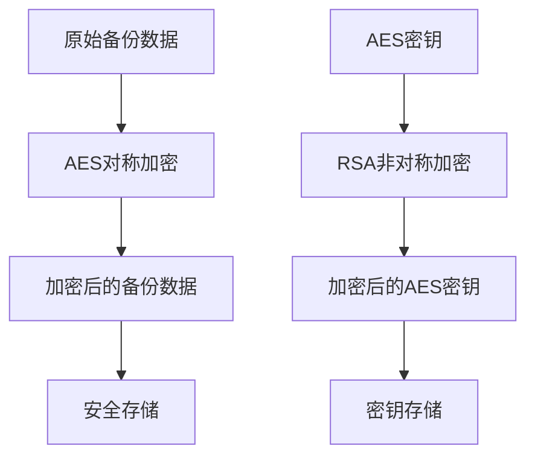
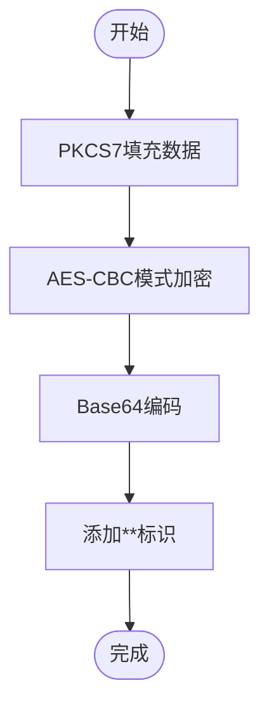
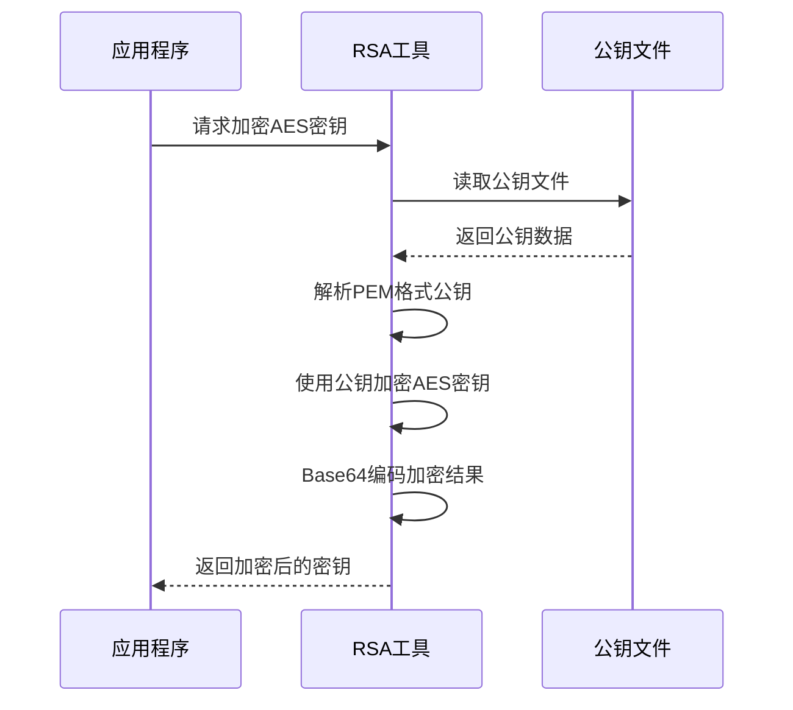
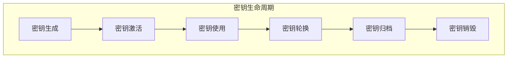
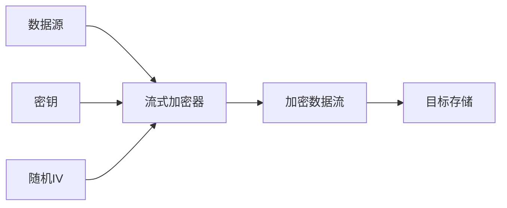
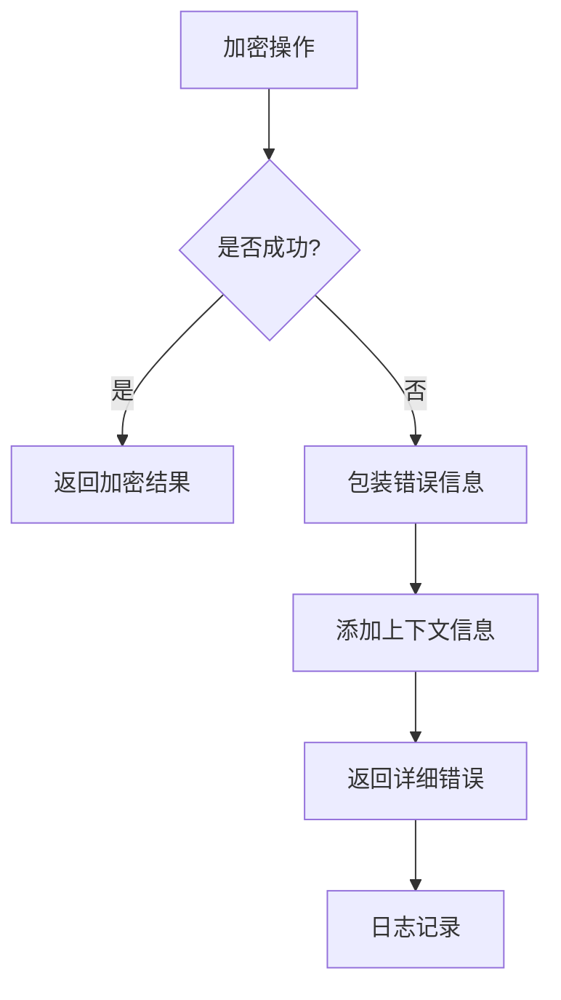
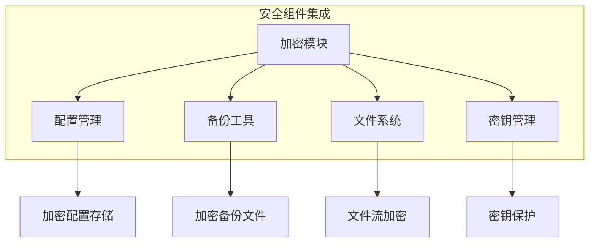

# 备份数据加密

<cite>
**本文档引用的文件**  
- [encrypt.go](file://dbm-services/common/db-config/pkg/util/crypt/encrypt.go)
- [rsa_util.go](file://dbm-services/common/go-pubpkg/iocrypt/rsa_util.go)
- [streamcrypt.go](file://dbm-services/common/go-pubpkg/iocrypt/streamcrypt.go)
- [filecrypt.go](file://dbm-services/common/go-pubpkg/iocrypt/filecrypt.go)
- [example.go](file://dbm-services/common/go-pubpkg/iocrypt/example.go)
</cite>

## 目录
1. [引言](#引言)
2. [加密机制概述](#加密机制概述)
3. [AES对称加密实现](#aes对称加密实现)
4. [RSA非对称加密集成](#rsa非对称加密集成)
5. [密钥管理策略](#密钥管理策略)
6. [加密流程与数据处理](#加密流程与数据处理)
7. [性能优化与错误处理](#性能优化与错误处理)
8. [与其他安全组件的集成](#与其他安全组件的集成)
9. [结论](#结论)

## 引言
本文档详细描述了蓝鲸DBM系统中备份数据的加密机制。该系统采用AES对称加密算法和RSA非对称加密算法相结合的方式，确保备份数据在存储和传输过程中的安全性。文档将深入分析加密算法的实现细节、密钥管理策略以及整体安全架构。

## 加密机制概述
蓝鲸DBM系统的备份数据加密采用混合加密架构，结合了对称加密（AES）和非对称加密（RSA）的优势。系统使用AES算法对实际备份数据进行高效加密，同时使用RSA算法对AES密钥进行加密保护，实现了安全性和性能的平衡。

**图示来源**  
- [encrypt.go](file://dbm-services/common/db-config/pkg/util/crypt/encrypt.go#L50-L73)
- [rsa_util.go](file://dbm-services/common/go-pubpkg/iocrypt/rsa_util.go#L112-L121)

## AES对称加密实现
系统采用AES加密算法对备份数据进行加密，具体实现细节如下：

### 加密模式与填充
- **加密模式**：使用CBC（Cipher Block Chaining）模式
- **填充方式**：采用PKCS7填充标准
- **密钥长度**：支持128、192、256位密钥，系统默认使用AES-256

### 加密流程
1. 数据填充：对明文数据进行PKCS7填充，确保数据长度为块大小的整数倍
2. CBC模式加密：使用AES-CBC模式对填充后的数据进行加密
3. Base64编码：对加密后的二进制数据进行Base64编码，便于存储和传输
4. 标识添加：在加密字符串前添加"**"标识，表示已加密

**图示来源**  
- [encrypt.go](file://dbm-services/common/db-config/pkg/util/crypt/encrypt.go#L50-L73)
- [encrypt.go](file://dbm-services/common/db-config/pkg/util/crypt/encrypt.go#L104-L117)

**本节来源**  
- [encrypt.go](file://dbm-services/common/db-config/pkg/util/crypt/encrypt.go#L26-L33)
- [encrypt.go](file://dbm-services/common/db-config/pkg/util/crypt/encrypt.go#L50-L73)

## RSA非对称加密集成
系统使用RSA算法对AES对称密钥进行加密保护，确保密钥传输和存储的安全性。

### RSA加密实现
- **密钥生成**：支持生成指定长度的RSA密钥对（通常为2048位或4096位）
- **加密算法**：使用PKCS#1 v1.5填充方案进行加密
- **密钥格式**：支持PEM格式的公钥和私钥文件

### 密钥加密流程
1. 读取RSA公钥文件
2. 将公钥从PEM格式解析为RSA PublicKey对象
3. 使用公钥对AES密钥进行RSA加密
4. 对加密结果进行Base64编码

**图示来源**  
- [rsa_util.go](file://dbm-services/common/go-pubpkg/iocrypt/rsa_util.go#L133-L152)
- [rsa_util.go](file://dbm-services/common/go-pubpkg/iocrypt/rsa_util.go#L112-L121)

**本节来源**  
- [rsa_util.go](file://dbm-services/common/go-pubpkg/iocrypt/rsa_util.go#L133-L152)
- [rsa_util.go](file://dbm-services/common/go-pubpkg/iocrypt/rsa_util.go#L112-L121)

## 密钥管理策略
系统实施了严格的密钥管理策略，确保加密密钥的安全性。

### 密钥生成
- **AES密钥**：由系统安全模块生成，长度为256位
- **RSA密钥对**：使用crypto/rsa包生成，支持2048位及以上长度

### 密钥存储
- **公钥**：以PEM格式存储在安全位置，用于加密操作
- **私钥**：以加密的PEM格式存储，需要密码才能解密使用
- **加密标识**：使用"**"前缀标识加密数据，便于识别和处理

### 密钥轮换机制
系统支持定期密钥轮换，通过以下步骤实现：
1. 生成新的密钥对
2. 使用新密钥加密数据
3. 保留旧密钥用于解密历史数据
4. 在安全窗口期后安全删除旧密钥

**图示来源**  
- [rsa_util.go](file://dbm-services/common/go-pubpkg/iocrypt/rsa_util.go#L19-L26)
- [encrypt.go](file://dbm-services/common/db-config/pkg/util/crypt/encrypt.go#L24)

**本节来源**  
- [rsa_util.go](file://dbm-services/common/go-pubpkg/iocrypt/rsa_util.go#L19-L26)
- [encrypt.go](file://dbm-services/common/db-config/pkg/util/crypt/encrypt.go#L24)

## 加密流程与数据处理
系统实现了完整的备份数据加密流程，包括数据分块、流式加密等高级特性。

### 数据分块加密
对于大型备份文件，系统采用流式加密方式：
- 将大文件分割为多个数据块
- 对每个数据块独立进行加密
- 保持加密上下文的一致性

### 初始化向量(IV)使用
- **IV生成**：每次加密时生成随机的初始化向量
- **IV存储**：将IV明文存储在加密数据的开头
- **IV长度**：与AES块大小一致（16字节）

### 流式加密实现
系统提供了流式加密接口，支持对大型文件进行内存友好的加密处理：

**图示来源**  
- [streamcrypt.go](file://dbm-services/common/go-pubpkg/iocrypt/streamcrypt.go#L14-L36)
- [filecrypt.go](file://dbm-services/common/go-pubpkg/iocrypt/filecrypt.go#L15-L21)

**本节来源**  
- [streamcrypt.go](file://dbm-services/common/go-pubpkg/iocrypt/streamcrypt.go#L14-L36)
- [filecrypt.go](file://dbm-services/common/go-pubpkg/iocrypt/filecrypt.go#L15-L21)

## 性能优化与错误处理
系统在保证安全性的同时，也注重性能优化和健壮的错误处理机制。

### 性能优化措施
- **压缩集成**：支持在加密前对数据进行Gzip压缩，减少存储空间和传输时间
- **并行处理**：对大型备份文件支持分块并行加密
- **内存优化**：使用流式处理避免大文件的内存占用

### 错误处理策略
- **详细错误信息**：使用errors.Wrapf包装错误，保留完整的调用栈信息
- **异常恢复**：提供解密失败时的诊断信息和恢复建议
- **日志记录**：记录关键加密操作的日志，便于审计和故障排查

**图示来源**  
- [encrypt.go](file://dbm-services/common/db-config/pkg/util/crypt/encrypt.go#L107-L108)
- [encrypt.go](file://dbm-services/common/db-config/pkg/util/crypt/encrypt.go#L123-L124)

**本节来源**  
- [encrypt.go](file://dbm-services/common/db-config/pkg/util/crypt/encrypt.go#L107-L108)
- [encrypt.go](file://dbm-services/common/db-config/pkg/util/crypt/encrypt.go#L123-L124)

## 与其他安全组件的集成
加密模块与其他安全组件紧密集成，形成完整的安全防护体系。

### 与配置管理集成
- 敏感配置项自动加密存储
- 提供加密/解密配置值的API接口
- 支持加密配置的查询和更新

### 与备份工具集成
- mysql-dbbackup工具调用加密API保护备份文件
- 支持加密备份的恢复流程
- 提供备份加密状态的监控和报告

### 与文件系统集成
- 支持对文件流进行实时加密
- 提供文件加密器(FileEncrypter)抽象
- 支持多种加密工具的插件化集成

**图示来源**  
- [filecrypt.go](file://dbm-services/common/go-pubpkg/iocrypt/filecrypt.go#L15-L21)
- [encrypt.go](file://dbm-services/common/db-config/pkg/util/crypt/encrypt.go#L104-L117)

**本节来源**  
- [filecrypt.go](file://dbm-services/common/go-pubpkg/iocrypt/filecrypt.go#L15-L21)
- [encrypt.go](file://dbm-services/common/db-config/pkg/util/crypt/encrypt.go#L104-L117)

## 结论
蓝鲸DBM系统的备份数据加密机制采用了AES和RSA相结合的混合加密架构，既保证了数据加密的高效性，又确保了密钥管理的安全性。系统实现了完整的加密生命周期管理，包括密钥生成、存储、轮换和销毁。通过流式加密、数据压缩等优化措施，系统能够在保证安全性的同时提供良好的性能表现。加密模块与其他安全组件的深度集成，形成了全方位的数据保护体系，有效防范了数据泄露风险。