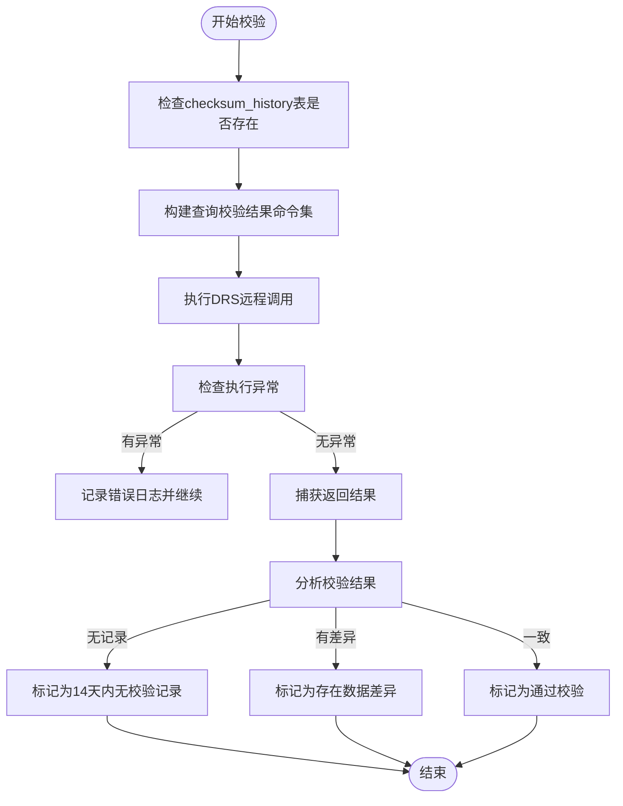
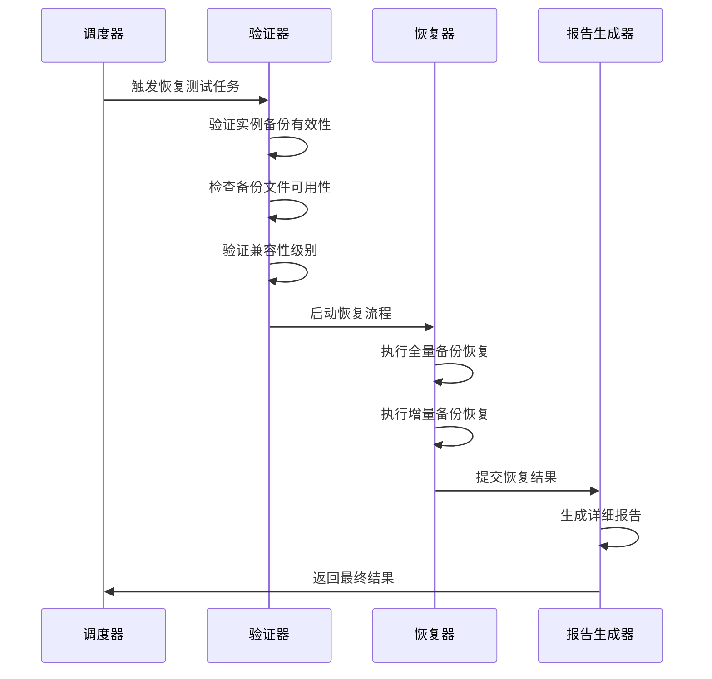

# 备份验证机制

<cite>
**本文档引用的文件**   
- [run_command.go](file://dbm-services/mysql/db-tools/mysql-table-checksum/pkg/checker/run_command.go)
- [verify_checksum.py](file://dbm-ui/backend/flow/plugins/components/collections/mysql/verify_checksum.py)
- [backupclient.go](file://dbm-services/common/go-pubpkg/backupclient/backupclient.go)
- [dumper_physical.go](file://dbm-services/mysql/db-tools/mysql-dbbackup/pkg/src/backupexe/dumper_physical.go)
- [restore_dbs_full_backup.go](file://dbm-services/sqlserver/db-tools/dbactuator/pkg/components/sqlserver/restore_dbs_full_backup.go)
- [cluster_checksum.py](file://dbm-ui/backend/db_periodic_task/local_tasks/mysql_checksum/cluster_checksum.py)
- [base.py](file://dbm-ui/backend/db_periodic_task/local_tasks/redis_backup_rollback/base.py)
</cite>

## 目录
1. [引言](#引言)
2. [校验和计算与完整性检查](#校验和计算与完整性检查)
3. [恢复测试自动化流程](#恢复测试自动化流程)
4. [验证失败处理策略](#验证失败处理策略)
5. [定期验证计划配置](#定期验证计划配置)
6. [验证日志审计](#验证日志审计)
7. [结论](#结论)

## 引言
备份验证机制是确保数据备份完整性和可恢复性的关键环节。本系统通过自动化校验和计算、定期恢复测试和详细的日志审计，全面保障备份数据的可靠性。该机制覆盖了从备份生成到恢复验证的完整生命周期，确保在发生数据丢失或损坏时能够快速、准确地进行数据恢复。

## 校验和计算与完整性检查
系统通过`pt-table-checksum`工具对MySQL数据库进行表级数据一致性校验。校验过程分为常规模式和按需模式，通过比较主从数据库的校验和值来检测数据差异。校验结果存储在`checksum`和`checksum_history`表中，包含主库IP、端口、数据库名、表名、分块信息、校验码和记录时间等关键字段。

校验流程首先检查`checksum_history`表是否存在，然后查询最近14天内的校验记录。如果两个表均无记录，则认为主从节点长时间未进行校验，触发异常告警。系统优先检查`checksum`表的结果，若该表为空则再检查`checksum_history`表的不一致情况。当检测到数据不一致时，系统会记录具体的数据库和表名，并生成相应的告警信息。

**图示来源**
- [verify_checksum.py](file://dbm-ui/backend/flow/plugins/components/collections/mysql/verify_checksum.py#L46-L136)

**本节来源**
- [run_command.go](file://dbm-services/mysql/db-tools/mysql-table-checksum/pkg/checker/run_command.go#L25-L206)
- [verify_checksum.py](file://dbm-ui/backend/flow/plugins/components/collections/mysql/verify_checksum.py#L18-L143)

## 恢复测试自动化流程
恢复测试自动化流程包括测试环境搭建、数据恢复验证和结果报告生成三个主要阶段。系统首先选择需要进行恢复测试的实例，然后验证实例的备份有效性，最后执行恢复操作并生成报告。

在测试环境搭建阶段，系统会检查目标实例的备份信息，包括备份文件的可用性、兼容性级别和存储路径。对于SQL Server数据库，系统会检查备份文件是否与目标数据库名称一致，以及备份文件的兼容性级别是否支持在当前数据库系统中恢复。

数据恢复验证阶段通过执行实际的恢复操作来验证备份的可恢复性。系统会模拟真实的恢复场景，包括全量备份恢复和增量备份恢复。恢复过程中，系统会监控恢复进度，记录关键时间点，如恢复开始时间、结束时间和总耗时。

**图示来源**
- [restore_dbs_full_backup.go](file://dbm-services/sqlserver/db-tools/dbactuator/pkg/components/sqlserver/restore_dbs_full_backup.go#L192-L231)
- [base.py](file://dbm-ui/backend/db_periodic_task/local_tasks/redis_backup_rollback/base.py#L149-L202)

**本节来源**
- [restore_dbs_full_backup.go](file://dbm-services/sqlserver/db-tools/dbactuator/pkg/components/sqlserver/restore_dbs_full_backup.go#L192-L305)
- [base.py](file://dbm-ui/backend/db_periodic_task/local_tasks/redis_backup_rollback/base.py#L149-L202)

## 验证失败处理策略
当备份验证失败时，系统会根据失败类型采取相应的处理策略。对于校验和不一致的情况，系统会记录具体的数据库和表名，并生成详细的错误报告。对于备份文件缺失或不可访问的情况，系统会标记相关实例为不可恢复状态，并触发告警通知。

系统还实现了重试机制，在某些临时性错误（如网络波动）导致验证失败时，会自动进行重试。重试次数和间隔时间可以通过配置进行调整。对于连续多次验证失败的实例，系统会提升告警级别，并通知相关责任人进行人工干预。

验证失败的处理还包括对失败原因的分类统计，帮助运维团队识别常见问题模式。例如，系统会区分是由于备份过程本身的问题，还是由于恢复环境配置不当导致的失败。这些统计数据可用于优化备份策略和改进系统配置。

**本节来源**
- [verify_checksum.py](file://dbm-ui/backend/flow/plugins/components/collections/mysql/verify_checksum.py#L123-L142)
- [restore_dbs_full_backup.go](file://dbm-services/sqlserver/db-tools/dbactuator/pkg/components/sqlserver/restore_dbs_full_backup.go#L118-L139)

## 定期验证计划配置
系统支持灵活的定期验证计划配置，可以根据业务需求设置不同的验证频率。验证计划通过定时任务系统进行管理，支持按日、周、月等不同周期执行。每个验证计划可以独立配置验证范围、验证深度和通知策略。

配置项包括：
- **验证频率**：定义验证执行的时间间隔
- **验证范围**：指定需要验证的数据库实例或集群
- **验证深度**：控制验证的详细程度，如仅检查备份文件存在性或执行完整恢复测试
- **通知策略**：配置验证结果的通知方式和接收人

系统还支持基于业务重要性的差异化验证策略。关键业务系统的验证频率可以设置得更高，验证深度也更全面。非关键系统的验证可以适当降低频率和深度，以平衡资源消耗和数据安全需求。

**本节来源**
- [cluster_checksum.py](file://dbm-ui/backend/db_periodic_task/local_tasks/mysql_checksum/cluster_checksum.py#L104-L123)
- [base.py](file://dbm-ui/backend/db_periodic_task/local_tasks/redis_backup_rollback/base.py#L163-L169)

## 验证日志审计
验证日志审计功能记录了所有备份验证活动的详细信息，包括验证时间、验证结果、执行者、相关实例和任何错误信息。日志数据存储在专门的审计表中，支持按时间范围、实例、验证结果等条件进行查询和分析。

审计日志不仅用于故障排查，还用于合规性检查和性能分析。通过分析历史验证日志，可以识别验证过程中的性能瓶颈，优化验证策略。日志数据还可以与监控系统集成，实现对备份验证健康状况的实时监控。

系统提供了多种日志分析视图，包括：
- **验证成功率统计**：按时间段统计验证成功率
- **失败原因分析**：分类统计各种失败原因的占比
- **验证耗时分析**：分析不同实例或类型的验证耗时趋势
- **异常告警历史**：记录所有触发的异常告警及其处理状态

**本节来源**
- [cluster_checksum.py](file://dbm-ui/backend/db_periodic_task/local_tasks/mysql_checksum/cluster_checksum.py#L247-L314)
- [base.py](file://dbm-ui/backend/db_periodic_task/local_tasks/redis_backup_rollback/base.py#L160-L174)

## 结论
本备份验证机制通过自动化校验和计算、定期恢复测试和全面的日志审计，构建了一个完整的数据保护体系。系统不仅能够及时发现备份数据的完整性问题，还能验证备份的可恢复性，确保在灾难发生时能够快速恢复业务。通过灵活的配置选项和详细的审计功能，该机制能够满足不同业务场景下的数据保护需求，为企业的数据安全提供了坚实保障。