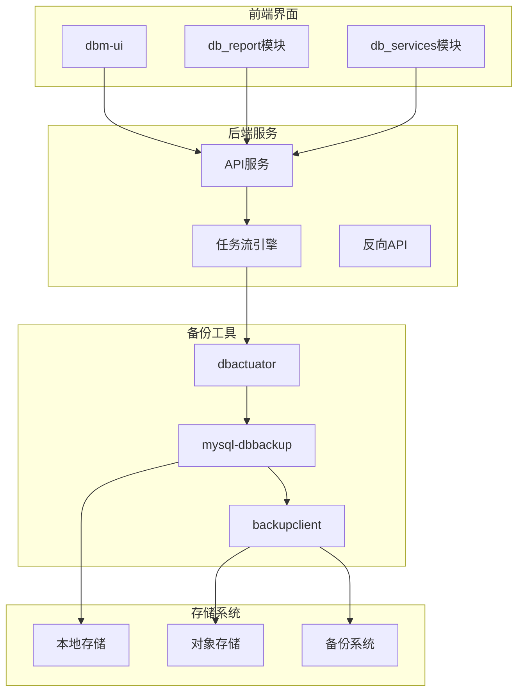
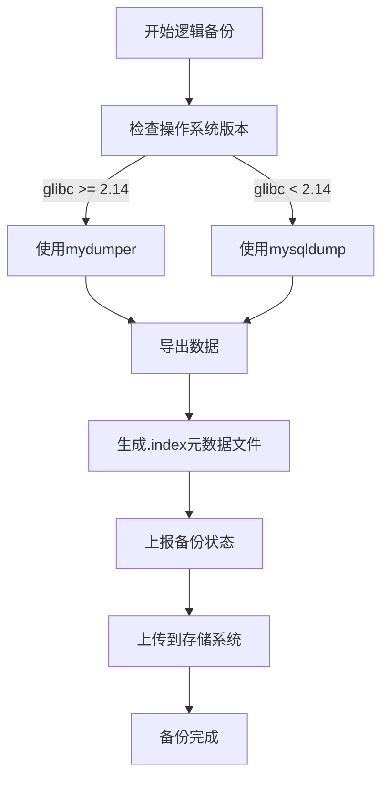
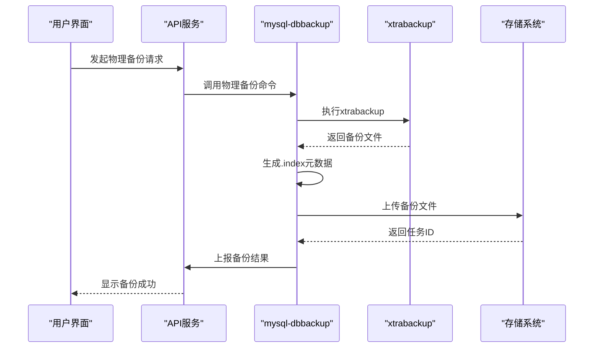
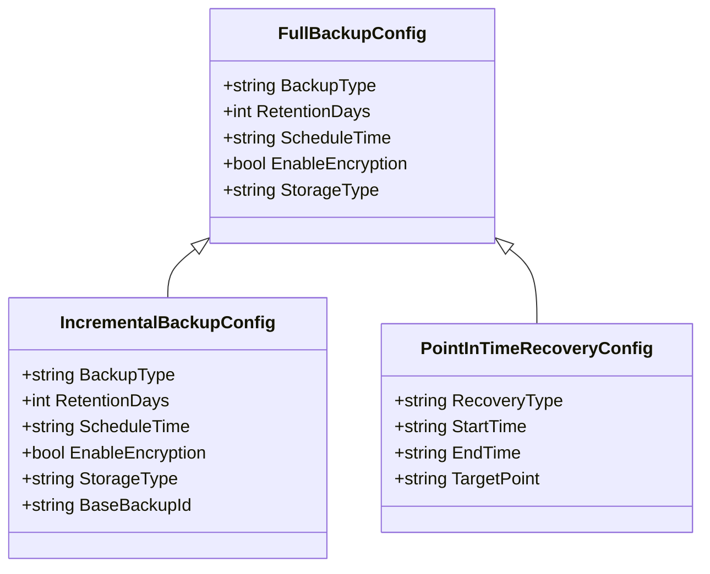
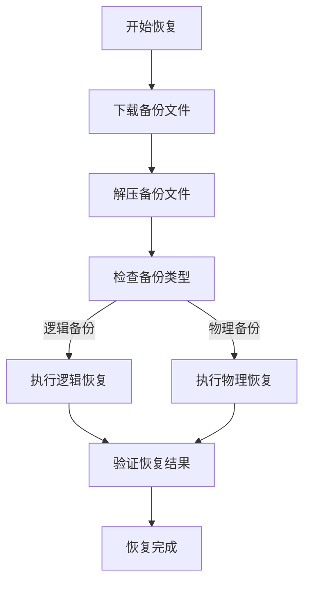
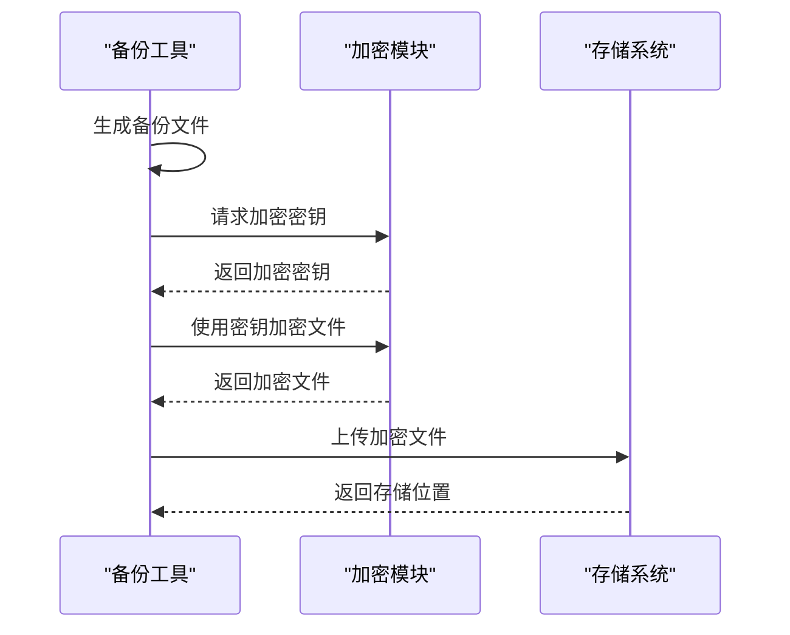
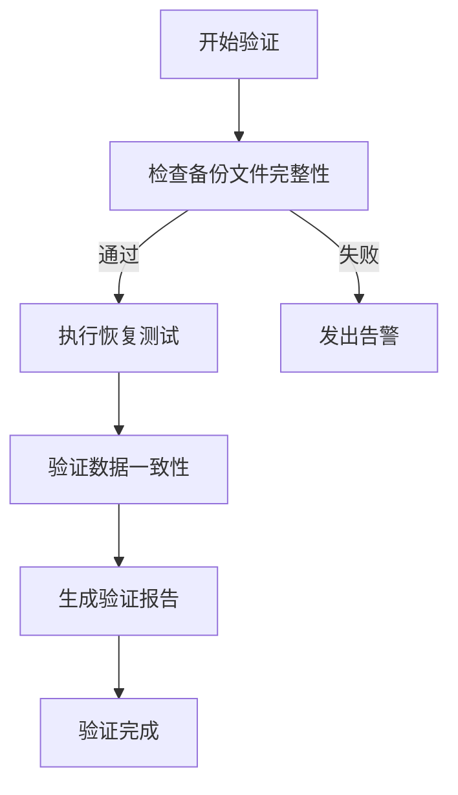
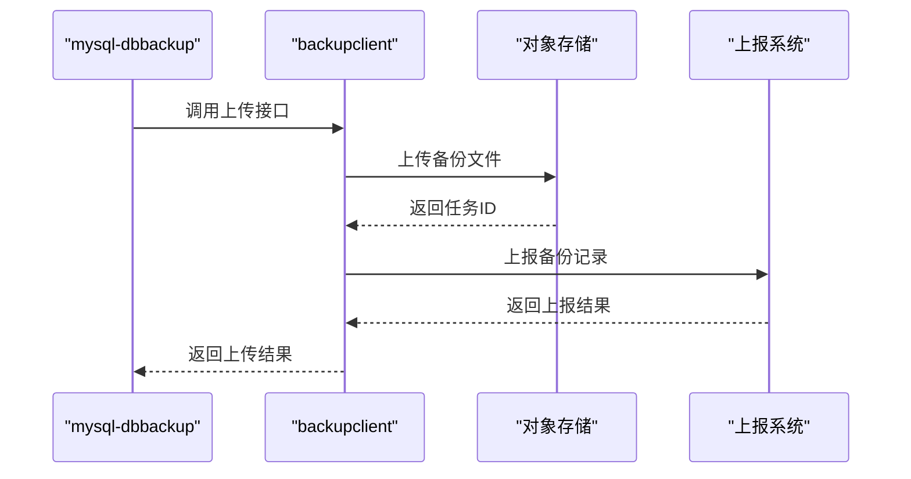

# 备份恢复

<cite>
**本文档引用的文件**
- [mysql-dbbackup](file://dbm-services/mysql/db-tools/mysql-dbbackup)
- [backup_report.go](file://dbm-services/mysql/db-tools/mysql-dbbackup/pkg/src/dbareport/backup_report.go)
- [dump_logical.md](file://dbm-services/mysql/db-tools/mysql-dbbackup/docs/dump_logical.md)
- [loadbackup.md](file://dbm-services/mysql/db-tools/mysql-dbbackup/docs/loadbackup.md)
- [dbactuator](file://dbm-services/mysql/db-tools/dbactuator)
- [db_report](file://dbm-ui/backend/db_report)
- [db_services](file://dbm-ui/backend/db_services)
</cite>

## 目录
1. [简介](#简介)
2. [备份恢复架构](#备份恢复架构)
3. [物理与逻辑备份实现](#物理与逻辑备份实现)
4. [备份任务管理与策略配置](#备份任务管理与策略配置)
5. [恢复操作流程](#恢复操作流程)
6. [备份存储与加密](#备份存储与加密)
7. [备份验证与恢复演练](#备份验证与恢复演练)
8. [对象存储系统集成](#对象存储系统集成)
9. [总结](#总结)

## 简介

蓝鲸智云-DB管理系统（BlueKing-BK-DBM）提供了一套完整的数据库备份恢复解决方案，通过mysql-dbbackup工具实现MySQL数据库的物理和逻辑备份。该系统结合dbm-ui中的db_report和db_services模块，实现了备份任务管理、备份策略配置和恢复操作的完整流程。本文档将详细介绍该系统的各项功能和技术实现。

**本文档引用的文件**
- [mysql-dbbackup](file://dbm-services/mysql/db-tools/mysql-dbbackup)
- [backup_report.go](file://dbm-services/mysql/db-tools/mysql-dbbackup/pkg/src/dbareport/backup_report.go)

## 备份恢复架构

**图表来源**
- [db_report](file://dbm-ui/backend/db_report)
- [db_services](file://dbm-ui/backend/db_services)
- [mysql-dbbackup](file://dbm-services/mysql/db-tools/mysql-dbbackup)

## 物理与逻辑备份实现

mysql-dbbackup工具提供了两种主要的备份方式：物理备份和逻辑备份。

### 逻辑备份

逻辑备份使用mydumper或mysqldump工具进行数据导出，适用于非例行备份的数据导出和迁移场景。

**图表来源**
- [dump_logical.md](file://dbm-services/mysql/db-tools/mysql-dbbackup/docs/dump_logical.md)
- [backup_report.go](file://dbm-services/mysql/db-tools/mysql-dbbackup/pkg/src/dbareport/backup_report.go)

### 物理备份

物理备份使用xtrabackup工具进行数据文件的直接复制，适用于大规模数据的快速备份。

**图表来源**
- [mysql-dbbackup](file://dbm-services/mysql/db-tools/mysql-dbbackup)
- [backup_report.go](file://dbm-services/mysql/db-tools/mysql-dbbackup/pkg/src/dbareport/backup_report.go)

## 备份任务管理与策略配置

通过db_services模块，用户可以配置和管理备份策略，包括全量备份、增量备份和点-in-time恢复。

### 全量备份配置

**图表来源**
- [db_services](file://dbm-ui/backend/db_services)
- [mysql-dbbackup](file://dbm-services/mysql/db-tools/mysql-dbbackup)

## 恢复操作流程

恢复操作包括从存储系统下载备份、解压备份文件和执行恢复命令三个主要步骤。

**图表来源**
- [loadbackup.md](file://dbm-services/mysql/db-tools/mysql-dbbackup/docs/loadbackup.md)
- [db_services](file://dbm-ui/backend/db_services)

## 备份存储与加密

系统支持多种备份存储策略和加密方式，确保数据的安全性和可靠性。

### 备份存储策略

| 存储类型 | 描述 | 适用场景 |
|---------|------|---------|
| 本地存储 | 备份文件存储在本地磁盘 | 快速恢复，临时备份 |
| 对象存储 | 备份文件上传到对象存储系统 | 长期保存，异地容灾 |
| 备份系统 | 备份文件注册到专业备份系统 | 企业级备份管理 |

### 备份加密

**图表来源**
- [backup_report.go](file://dbm-services/mysql/db-tools/mysql-dbbackup/pkg/src/dbareport/backup_report.go)
- [db_services](file://dbm-ui/backend/db_services)

## 备份验证与恢复演练

系统提供了备份验证和恢复演练功能，确保备份数据的完整性和可恢复性。

**图表来源**
- [db_report](file://dbm-ui/backend/db_report)
- [backup_report.go](file://dbm-services/mysql/db-tools/mysql-dbbackup/pkg/src/dbareport/backup_report.go)

## 对象存储系统集成

系统通过backupclient组件与对象存储系统集成，实现了备份文件的自动上传和管理。

**图表来源**
- [backup_report.go](file://dbm-services/mysql/db-tools/mysql-dbbackup/pkg/src/dbareport/backup_report.go)
- [backupclient](file://dbm-services/common/go-pubpkg/backupclient)

## 总结

蓝鲸智云-DB管理系统的备份恢复功能通过mysql-dbbackup工具实现了MySQL数据库的物理和逻辑备份，结合dbm-ui中的db_report和db_services模块，提供了完整的备份任务管理、策略配置和恢复操作流程。系统支持多种备份存储策略、备份加密、备份验证和对象存储系统集成，确保了数据的安全性和可靠性。