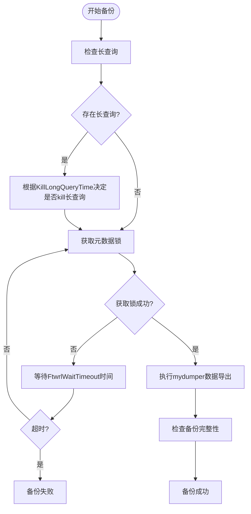
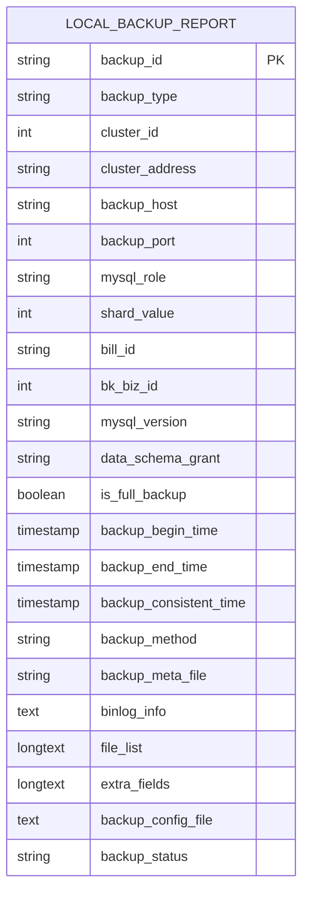
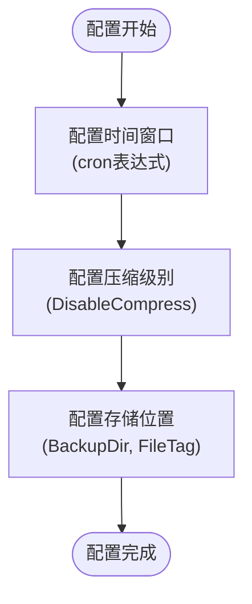
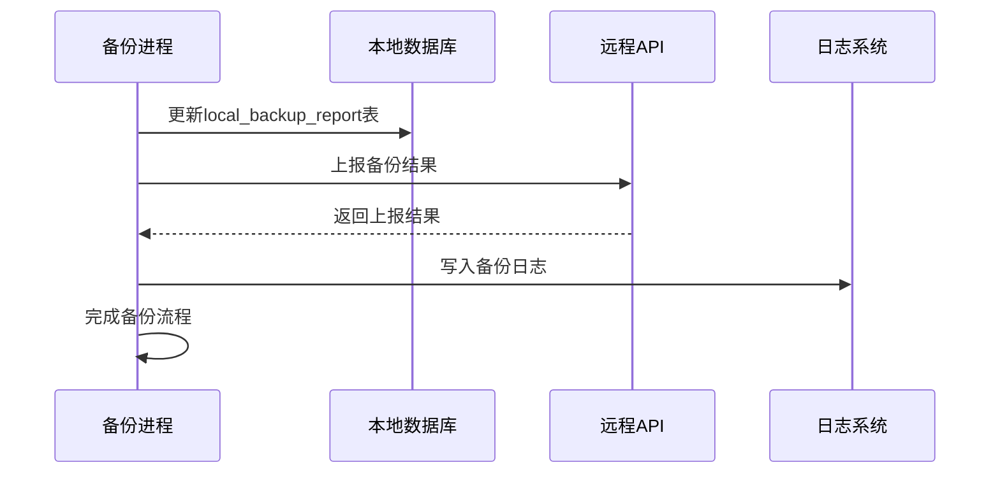
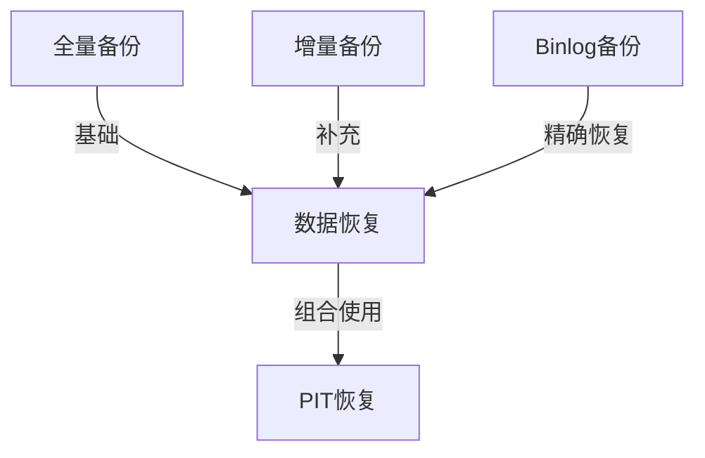

# 全量备份

<cite>
**本文档引用的文件**   
- [dumper_logical.go](file://dbm-services/mysql/db-tools/mysql-dbbackup/pkg/src/backupexe/dumper_logical.go)
- [dumper.go](file://dbm-services/mysql/db-tools/mysql-dbbackup/pkg/src/backupexe/dumper.go)
- [backup_report.go](file://dbm-services/mysql/db-tools/mysql-dbbackup/pkg/src/dbareport/backup_report.go)
- [model.go](file://dbm-services/mysql/db-tools/mysql-dbbackup/pkg/src/dbareport/model.go)
- [public.go](file://dbm-services/mysql/db-tools/mysql-dbbackup/pkg/config/public.go)
- [logical.go](file://dbm-services/mysql/db-tools/mysql-dbbackup/pkg/config/logical.go)
- [backup_client.go](file://dbm-services/mysql/db-tools/mysql-dbbackup/pkg/config/backup_client.go)
- [fullbackup.json](file://dbm-ui/backend/components/dbconfig/migrations/rediscomm/config/fullbackup.json)
- [binlogbackup.json](file://dbm-ui/backend/components/dbconfig/migrations/rediscomm/config/binlogbackup.json)
- [mysql_data_restore.md](file://dbm-ui/backend/docs/mysql_data_restore.md)
- [faq.md](file://dbm-services/mysql/db-tools/mysql-dbbackup/docs/faq.md)
</cite>

## 目录
1. [全量备份实现机制](#全量备份实现机制)
2. [备份触发条件](#备份触发条件)
3. [数据一致性保证方法](#数据一致性保证方法)
4. [备份文件生成流程](#备份文件生成流程)
5. [备份元数据记录](#备份元数据记录)
6. [备份配置](#备份配置)
7. [mydumper工具执行全量数据导出](#mydumper工具执行全量数据导出)
8. [备份完成后的锁释放与状态更新](#备份完成后的锁释放与状态更新)
9. [全量备份在恢复场景中的作用](#全量备份在恢复场景中的作用)
10. [与其他备份类型的关系](#与其他备份类型的关系)

## 全量备份实现机制

全量备份是数据库管理系统中确保数据安全和可恢复性的关键机制。本系统通过`mysql-dbbackup`组件实现全量备份功能，主要依赖`mydumper`工具进行逻辑备份。备份过程包括备份触发、数据一致性保证、备份文件生成和元数据记录等关键步骤。

**Section sources**
- [dumper_logical.go](file://dbm-services/mysql/db-tools/mysql-dbbackup/pkg/src/backupexe/dumper_logical.go#L1-L269)
- [dumper.go](file://dbm-services/mysql/db-tools/mysql-dbbackup/pkg/src/backupexe/dumper.go#L1-L113)

## 备份触发条件

全量备份的触发条件主要由配置文件中的`cron`参数决定。对于Redis实例，全量备份的默认触发时间为每天的05:00、13:00和21:00，通过cron表达式`0 5,13,21 * * *`配置。对于MySQL实例，备份触发条件还包括备份类型、数据量大小和glibc版本等因素。

当`BackupType`设置为`auto`时，系统会根据以下条件自动选择备份方式：
- 磁盘空间数据量大于`BackupTypeAutoDataSizeGB`时，采用物理备份
- glibc版本小于2.14时，采用物理备份

**Section sources**
- [fullbackup.json](file://dbm-ui/backend/components/dbconfig/migrations/rediscomm/config/fullbackup.json#L1-L61)
- [public.go](file://dbm-services/mysql/db-tools/mysql-dbbackup/pkg/config/public.go#L56-L58)

## 数据一致性保证方法

为了保证备份过程中的数据一致性，系统采用`FLUSH TABLES WITH READ LOCK`（FTWRL）机制。在执行`mydumper`备份时，通过`--long-query-guard`参数设置FTWRL等待超时时间。如果在发出FTWRL之前存在长查询，系统会根据`FtwrlWaitTimeout`参数决定等待时间，超时后放弃备份。

此外，系统还支持通过`--trx-consistency-only`参数实现事务一致性，确保备份数据在某个事务点的一致性。对于支持`LOCK TABLES FOR BACKUP`的MySQL版本，系统会使用该命令获取元数据锁，避免备份过程中DDL操作的影响。



**Diagram sources **
- [dumper_logical.go](file://dbm-services/mysql/db-tools/mysql-dbbackup/pkg/src/backupexe/dumper_logical.go#L84-L88)
- [dumper.go](file://dbm-services/mysql/db-tools/mysql-dbbackup/pkg/src/backupexe/dumper.go#L47-L60)

## 备份文件生成流程

全量备份文件的生成流程主要包括以下几个步骤：

1. **初始化配置**：设置备份参数，包括备份主机、端口、用户、密码、备份目录等
2. **执行备份**：调用`mydumper`工具执行逻辑备份，生成SQL文件和元数据文件
3. **打包切分**：根据`TarSizeThreshold`参数对备份文件进行打包和切分，单个tar文件大小默认为128MB以上
4. **上传备份**：通过`backup_client`将备份文件上传到备份系统

备份过程中，系统会根据`IOLimitMBPerSec`参数控制打包速度，单位为MB/s。对于master节点，实际限速为`IOLimitMBPerSec * IOLimitMasterFactor`。

**Section sources**
- [dumper_logical.go](file://dbm-services/mysql/db-tools/mysql-dbbackup/pkg/src/backupexe/dumper_logical.go#L58-L211)
- [faq.md](file://dbm-services/mysql/db-tools/mysql-dbbackup/docs/faq.md#L124-L130)

## 备份元数据记录

备份完成后，系统会生成详细的元数据记录，包括备份ID、备份类型、集群信息、备份主机、端口、角色、分片值、业务ID、MySQL版本、数据权限、是否全备、备份开始时间、结束时间、一致性时间、备份方法、备份元文件、binlog信息、额外字段、文件列表等。

元数据记录主要存储在两个地方：
1. **本地文件**：在备份目录下生成`.index`文件，记录备份的详细信息
2. **数据库表**：写入`infodba_schema.local_backup_report`表，便于后续查询和管理



**Diagram sources **
- [backup_report.go](file://dbm-services/mysql/db-tools/mysql-dbbackup/pkg/src/dbareport/backup_report.go#L293-L329)
- [model.go](file://dbm-services/mysql/db-tools/mysql-dbbackup/pkg/src/dbareport/model.go#L16-L85)

## 备份配置

全量备份的配置主要包括时间窗口、压缩级别和存储位置三个方面。

### 时间窗口配置

时间窗口通过`cron`表达式配置，对于Redis实例，默认配置为`0 5,13,21 * * *`，即每天05:00、13:00和21:00执行全量备份。对于MySQL实例，还可以通过`BackupTimeOut`参数设置备份超时时间。

### 压缩级别配置

压缩级别通过`DisableCompress`参数控制。默认情况下，备份文件会使用zstd算法进行压缩。如果需要禁用压缩，可以将`DisableCompress`设置为`true`。

### 存储位置配置

存储位置通过`BackupDir`参数指定备份文件的存储目录。备份文件上传到备份系统时，通过`BackupClient.FileTag`参数指定文件标签，如`MYSQL_FULL_BACKUP`。



**Section sources**
- [fullbackup.json](file://dbm-ui/backend/components/dbconfig/migrations/rediscomm/config/fullbackup.json#L1-L61)
- [backup_client.go](file://dbm-services/mysql/db-tools/mysql-dbbackup/pkg/config/backup_client.go#L1-L23)
- [public.go](file://dbm-services/mysql/db-tools/mysql-dbbackup/pkg/config/public.go#L48-L49)

## mydumper工具执行全量数据导出

`mydumper`是本系统实现全量数据导出的核心工具。执行流程如下：

1. **构建命令参数**：根据配置文件构建`mydumper`命令行参数
2. **执行导出命令**：调用`mydumper`执行数据导出
3. **处理信号**：监听系统信号，支持优雅终止备份过程
4. **检查完整性**：验证备份文件的完整性

代码示例：
```go
binPath := filepath.Join(l.dbbackupHome, "/bin/mydumper")
args := []string{
    "-h", l.cnf.Public.MysqlHost,
    "-P", strconv.Itoa(l.cnf.Public.MysqlPort),
    "-u", l.cnf.Public.MysqlUser,
    "-p", l.cnf.Public.MysqlPasswd,
    "-o", filepath.Join(l.cnf.Public.BackupDir, l.cnf.Public.TargetName()),
    "--long-query-retry-interval=10",
    fmt.Sprintf("--long-query-retries=%d", l.cnf.LogicalBackup.FlushRetryCount),
    fmt.Sprintf("--set-names=%s", l.cnf.Public.MysqlCharset),
    fmt.Sprintf("--chunk-filesize=%d", l.cnf.LogicalBackup.ChunkFilesize),
    fmt.Sprintf("--threads=%d", l.cnf.LogicalBackup.Threads),
}
```

**Section sources**
- [dumper_logical.go](file://dbm-services/mysql/db-tools/mysql-dbbackup/pkg/src/backupexe/dumper_logical.go#L63-L150)

## 备份完成后的锁释放与状态更新

备份完成后，系统会自动释放相关锁并更新备份状态。

### 锁释放

对于使用`FLUSH TABLES WITH READ LOCK`的场景，系统会在备份完成后自动执行`UNLOCK TABLES`命令释放锁。对于使用`LOCK TABLES FOR BACKUP`的场景，系统会自动释放元数据锁。

### 状态更新

备份状态更新包括以下几个步骤：
1. **本地状态更新**：更新`local_backup_report`表中的备份状态
2. **远程状态上报**：通过`reverseapi`将备份结果上报到DBM系统
3. **日志记录**：在指定日志文件中记录备份结果



**Diagram sources **
- [backup_report.go](file://dbm-services/mysql/db-tools/mysql-dbbackup/pkg/src/dbareport/backup_report.go#L358-L431)

## 全量备份在恢复场景中的作用

全量备份在数据恢复场景中扮演着至关重要的角色。它是数据恢复的基础，提供了某个时间点的完整数据快照。在发生数据丢失、误操作或系统故障时，可以通过全量备份将数据恢复到备份时的状态。

根据文档`mysql_data_restore.md`，数据恢复分为"数据构造"和"数据回档"。全量备份主要用于：
- **基于备份记录构造**：安全地将数据恢复到临时搭建的新集群或指定集群
- **定点构造/异地构造**：在不影响原集群的情况下恢复数据
- **PIT构造(Point-In-Time)**：结合binlog实现精确到某个时间点的数据恢复

**Section sources**
- [mysql_data_restore.md](file://dbm-ui/backend/docs/mysql_data_restore.md#L1-L25)

## 与其他备份类型的关系

全量备份与增量备份、binlog备份等其他备份类型共同构成了完整的数据保护体系。

### 与增量备份的关系

全量备份提供完整数据快照，而增量备份只记录自上次备份以来的变化。在恢复时，通常需要先恢复最近的全量备份，然后应用后续的增量备份。

### 与binlog备份的关系

binlog备份记录了数据库的所有变更操作。全量备份与binlog备份结合，可以实现PIT（Point-In-Time）恢复，将数据恢复到任意时间点。

### 备份策略配置

系统通过不同的配置文件管理各类备份：
- `fullbackup.json`：全量备份配置
- `binlogbackup.json`：binlog备份配置

这种分离的配置方式使得各类备份可以独立管理，灵活调整备份策略。



**Section sources**
- [fullbackup.json](file://dbm-ui/backend/components/dbconfig/migrations/rediscomm/config/fullbackup.json#L1-L61)
- [binlogbackup.json](file://dbm-ui/backend/components/dbconfig/migrations/rediscomm/config/binlogbackup.json#L1-L50)