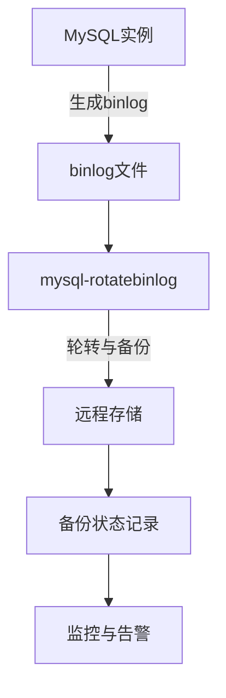

# 增量备份

<cite>
**本文档引用的文件**  
- [mysqlbinlog_util.go](file://dbm-services/mysql/db-tools/dbactuator/pkg/components/mysql/restore/mysqlbinlog_util.go)
- [gomysqlbinlog_util.go](file://dbm-services/mysql/db-tools/dbactuator/pkg/components/mysql/restore/gomysqlbinlog_util.go)
- [main.go](file://dbm-services/mysql/db-tools/mysql-rotatebinlog/main.go)
- [root.go](file://dbm-services/mysql/db-tools/mysql-rotatebinlog/cmd/root.go)
- [main.example.yaml](file://dbm-services/mysql/db-tools/mysql-rotatebinlog/main.example.yaml)
- [backup_client.go](file://dbm-services/mysql/db-tools/mysql-dbbackup/pkg/config/backup_client.go)
- [tendisplus_incrback.go](file://dbm-services/redis/db-tools/dbactuator/pkg/backupsys/tendisplus_incrback.go)
- [tendisplus_incrback.go](file://dbm-services/redis/db-tools/dbactuator/pkg/datastructure/tendisplus_incrback.go)
- [mysql_binlog_result.go](file://dbm-services/common/db-event-consumer/pkg/model/mysql_binlog_result.go)
- [000003_alter_table.up.sql](file://dbm-services/mysql/db-tools/mysql-rotatebinlog/pkg/models/migrations/000003_alter_table.up.sql)
</cite>

## 目录
1. [引言](#引言)
2. [增量备份实现原理](#增量备份实现原理)
3. [基于binlog位点的增量捕获机制](#基于binlog位点的增量捕获机制)
4. [增量备份配置参数](#增量备份配置参数)
5. [增量备份文件命名规范与存储管理](#增量备份文件命名规范与存储管理)
6. [灾难恢复中的应用场景与限制](#灾难恢复中的应用场景与限制)
7. [结论](#结论)

## 引言

增量备份是数据库管理系统中关键的数据保护机制，通过仅备份自上次备份以来发生变化的数据，显著减少了备份所需的时间和存储空间。在蓝鲸智云-DB管理系统(BlueKing-BK-DBM)中，增量备份主要依赖于MySQL的binlog（二进制日志）机制来捕获和应用数据变更。本文档将深入分析增量备份的实现原理，重点描述基于binlog位点的增量捕获机制，以及相关的配置、管理和应用场景。

## 增量备份实现原理

增量备份的核心在于准确捕获数据库自某个时间点以来的所有变更。在MySQL中，这一功能由binlog提供。binlog记录了所有对数据库进行更改的SQL语句或行级变更事件，是实现数据恢复、主从复制和增量备份的基础。

系统通过`mysqlbinlog`工具或自研的`gomysqlbinlog`工具来解析binlog文件，提取出指定时间范围或位置范围内的变更事件。这些事件随后可以被重放（replay）到目标数据库，以实现数据的恢复或同步。在蓝鲸DBM系统中，增量备份的实现涉及多个组件的协同工作，包括备份调度、binlog轮转、远程备份上传和状态报告等。



**图示来源**  
- [main.go](file://dbm-services/mysql/db-tools/mysql-rotatebinlog/main.go)
- [root.go](file://dbm-services/mysql/db-tools/mysql-rotatebinlog/cmd/root.go)

## 基于binlog位点的增量捕获机制

### 确定增量备份的起始位点

确定增量备份的起始位点是增量捕获的第一步。系统支持两种方式来指定起始点：基于时间（`--start-datetime`）和基于位置（`--start-position`）。根据代码分析，系统优先使用位置信息，如果未指定位置，则使用时间信息。

在`MySQLBinlogUtil`结构体中，`StartPos`和`StartTime`字段分别用于存储起始位置和起始时间。`BuildArgs`方法会根据这些字段构建`mysqlbinlog`命令行参数。如果`StartPos`大于0，则使用`--start-position`参数；否则，使用`--start-datetime`参数，并验证时间格式是否符合`time.DateTime`标准。

```go
if b.StartPos > 0 {
    b.cmdArgs = append(b.cmdArgs, "--start-position", cast.ToString(b.StartPos))
}
if b.StartTime != "" {
    _, err := time.ParseInLocation(time.DateTime, b.StartTime, time.Local)
    if err != nil {
        return nil, errors.Errorf("start_time expect format %s but got %s", time.DateTime, b.StartTime)
    }
    b.cmdArgs = append(b.cmdArgs, "--start-datetime", b.StartTime)
}
```

**代码来源**  
- [mysqlbinlog_util.go](file://dbm-services/mysql/db-tools/dbactuator/pkg/components/mysql/restore/mysqlbinlog_util.go#L80-L88)

### 安全地截取binlog日志

安全截取binlog日志需要确保捕获的范围完整且不遗漏任何变更。系统通过`--stop-datetime`或`--stop-position`参数来定义截取的结束点。与起始点类似，`StopTime`字段用于指定结束时间，系统会验证其格式的正确性。

此外，系统还支持幂等模式（`--idempotent`），这在处理可能重复的事件时非常重要，可以避免因重复应用同一事件而导致的数据不一致。该模式仅在MySQL版本>=5.7且`mysqlbinlog`工具支持该选项时启用。

```go
if b.IdempotentMode && mysqlcomm.MysqlbinlogHasOpt(b.binlogCmd, "--idempotent") == nil {
    b.cmdArgs = append(b.cmdArgs, "--idempotent")
}
```

**代码来源**  
- [mysqlbinlog_util.go](file://dbm-services/mysql/db-tools/dbactuator/pkg/components/mysql/restore/mysqlbinlog_util.go#L104-L106)

### 保证增量备份链的完整性

增量备份链的完整性对于灾难恢复至关重要。系统通过以下机制来保证：

1.  **连续性检查**：在获取binlog文件列表后，系统会检查文件序号的连续性。例如，在`TplusRocksDBIncrBack`的`isGetAllBinlogInfo`方法中，会验证第一个和第二个binlog文件的序号是否连续（相差1），以及最后一个和倒数第二个文件的序号是否连续。
2.  **时间范围验证**：确保所选的binlog文件能够覆盖指定的开始和结束时间范围。系统会查找最接近开始时间但早于开始时间的文件作为起始文件，以及最接近结束时间但晚于结束时间的文件作为结束文件。
3.  **元数据记录**：每个binlog文件的元数据（如`start_time`, `stop_time`, `file_mtime`）都会被记录到数据库（如`tb_mysql_binlog_result`表）中，以便后续查询和验证。

```go
if secondBinlog.BinlogIdx-firstBinlog.BinlogIdx != 1 {
    incr.Err = fmt.Errorf("...第一binlog:%s 和 第二binlog:%s 不连续", firstBinlog.BackupFile, secondBinlog.BackupFile)
}
```

**代码来源**  
- [tendisplus_incrback.go](file://dbm-services/redis/db-tools/dbactuator/pkg/backupsys/tendisplus_incrback.go#L476-L483)
- [mysql_binlog_result.go](file://dbm-services/common/db-event-consumer/pkg/model/mysql_binlog_result.go#L31-L32)

## 增量备份配置参数

### binlog保留策略

binlog的保留策略由`mysql-rotatebinlog`服务的配置文件（如`main.example.yaml`）定义。关键参数包括：

-   **`keep_policy`**：保留策略，可选`least`（尽可能少保留）或`most`（尽可能多保留）。通常主库使用`most`，从库使用`least`。
-   **`max_binlog_total_size`**：每个实例允许的binlog目录总大小上限。
-   **`max_disk_used_pct`**：binlog所在磁盘分区的空间使用率上限百分比。
-   **`max_keep_duration`**：binlog的最大保留时间，超过此时间的binlog将被直接删除。

```yaml
public:
  keep_policy: most
  max_binlog_total_size: 2000g
  max_disk_used_pct: 80
  max_keep_duration: 61d
```

**配置来源**  
- [main.example.yaml](file://dbm-services/mysql/db-tools/mysql-rotatebinlog/main.example.yaml#L5-L11)

### 备份频率

备份频率由`crond`调度器控制。`mysql-rotatebinlog`服务会定期执行，检查并轮转过期的binlog文件，然后将其备份到远程存储。`rotate_interval`参数定义了轮转的间隔时间。

```yaml
crond:
  schedule: "*/5 * * * *"  # 每5分钟执行一次
rotate_interval: 10m
```

**配置来源**  
- [main.example.yaml](file://dbm-services/mysql/db-tools/mysql-rotatebinlog/main.example.yaml#L21-L22)

### 网络传输优化

网络传输优化主要通过`backup_client`组件实现。该组件负责将本地的binlog文件上传到远程存储（如COS）。相关配置包括：

-   **`StorageType`**：存储类型，如`cos`。
-   **`DoChecksum`**：是否在上传前进行校验和计算，以保证数据完整性。
-   **`BackupClientBin`**：备份客户端的执行路径。

```go
type BackupClient struct {
    EnableBackupClient string `ini:"EnableBackupClient" enum:",auto,yes,no"`
    FileTag     string `ini:"FileTag"`
    StorageType string `ini:"StorageType"`
    DoChecksum  bool   `ini:"DoChecksum"`
    BackupClientBin string `ini:"BackupClientBin"`
}
```

**代码来源**  
- [backup_client.go](file://dbm-services/mysql/db-tools/mysql-dbbackup/pkg/config/backup_client.go#L12-L23)

## 增量备份文件命名规范与存储管理

### 命名规范

虽然具体的命名规范在提供的代码片段中未直接体现，但可以从上下文推断。binlog文件通常由MySQL服务器自动生成，命名格式为`mysql-bin.000001`。在备份过程中，系统可能会根据业务需求添加额外的标识，如时间戳、集群域名等。例如，在TendisPlus的增量备份中，文件名可能包含IP、端口、rocksdb索引和时间戳等信息。

### 存储管理策略

存储管理策略由`backup_client`和`mysql-rotatebinlog`共同实现：

1.  **本地存储**：binlog文件首先存储在数据库服务器的本地磁盘上，受`max_binlog_total_size`和`max_disk_used_pct`等参数限制。
2.  **远程存储**：`mysql-rotatebinlog`服务将过期的binlog文件通过`backup_client`上传到远程对象存储（如COS）。
3.  **元数据管理**：所有备份文件的元数据（文件名、大小、时间戳、备份状态等）都记录在`tb_mysql_binlog_result`数据库表中，便于查询和审计。
4.  **生命周期管理**：通过`max_keep_duration`参数控制binlog的保留时间，过期文件会被自动清理。

```sql
CREATE TABLE tb_mysql_binlog_result (
    filename varchar(64) not null,
    filesize bigint not null,
    file_mtime varchar(32) not null,
    start_time varchar(32) default '',
    stop_time varchar(32) default '',
    backup_status int default -2,
    task_id varchar(64) default '',
    ...
);
```

**数据库来源**  
- [000004_create.up.sql](file://dbm-services/common/bkdata-kafka-consumer/pkg/model/migrations/000004_create.up.sql#L1-L28)

## 灾难恢复中的应用场景与限制

### 应用场景

1.  **点-in-time恢复 (PITR)**：这是增量备份最主要的应用场景。当数据库发生逻辑错误（如误删数据）时，管理员可以利用全量备份和一系列增量备份，将数据库恢复到错误发生前的任意时间点。
2.  **主从延迟修复**：当从库因网络或硬件问题导致复制延迟时，可以通过应用增量备份快速追上主库的数据。
3.  **数据迁移与同步**：在进行跨地域或跨平台的数据迁移时，增量备份可以作为持续同步数据的手段。

### 限制

1.  **依赖全量备份**：增量备份链必须从一个有效的全量备份开始。如果全量备份丢失或损坏，整个增量链将失效。
2.  **恢复时间较长**：相比于全量恢复，增量恢复需要按顺序应用多个备份文件，耗时更长。
3.  **复杂性高**：管理一个长的增量备份链需要复杂的元数据管理和严格的流程控制，增加了运维的复杂性。
4.  **binlog格式依赖**：增量备份的效果依赖于binlog的格式（STATEMENT, ROW, MIXED）。ROW格式提供了最精确的变更记录，但文件体积最大。

## 结论

蓝鲸智云-DB管理系统通过`mysql-rotatebinlog`和`dbactuator`等组件，构建了一套完整的基于binlog位点的增量备份解决方案。该方案通过精确的起始位点确定、安全的binlog截取和严格的完整性校验，确保了增量备份的可靠性和有效性。合理的配置参数和存储管理策略进一步优化了备份的性能和成本。尽管存在依赖全量备份和恢复时间较长等限制，但其在点-in-time恢复等关键场景中的价值无可替代。未来可进一步探索自动化备份链验证和更智能的保留策略，以提升系统的健壮性和易用性。