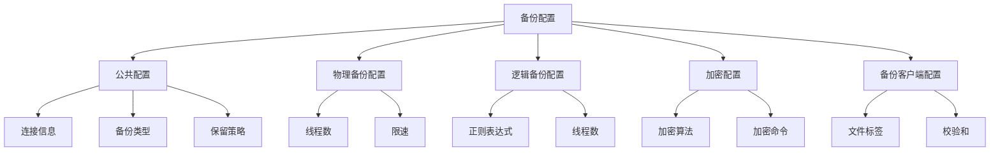
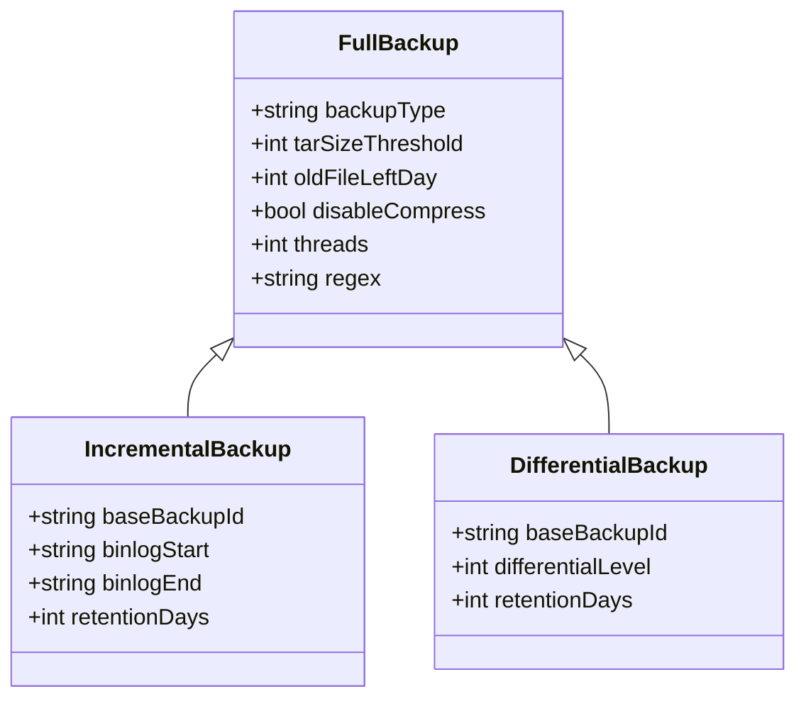
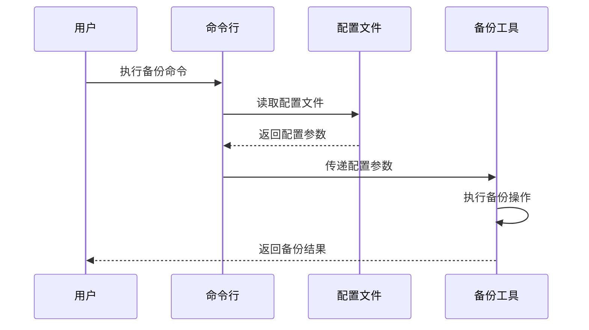
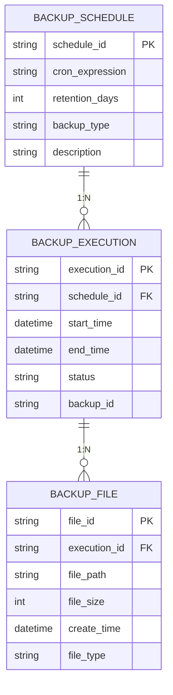
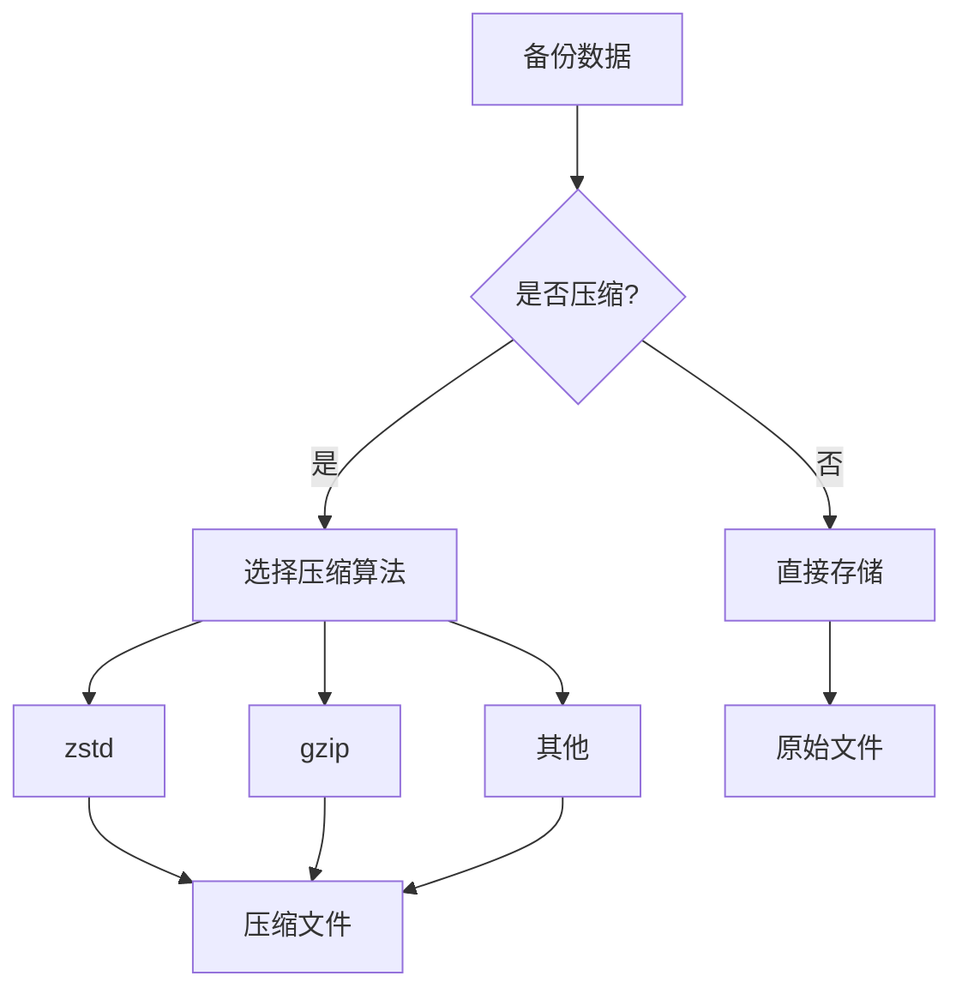
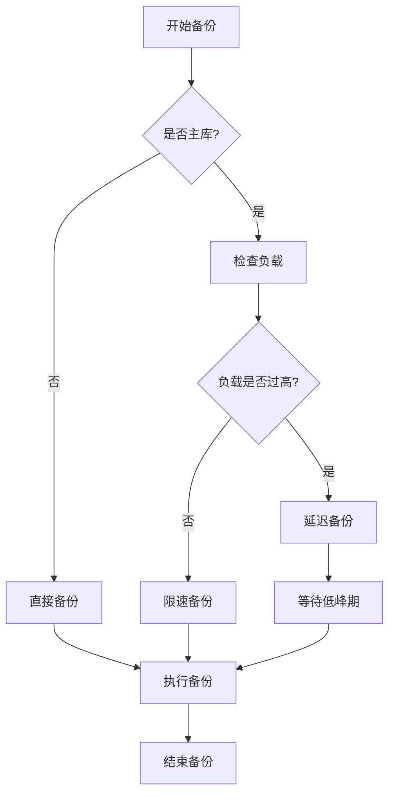

# 备份策略

<cite>
**本文档引用的文件**   
- [readme.md](file://dbm-services/mysql/db-tools/mysql-dbbackup/docs/readme.md)
- [public.go](file://dbm-services/mysql/db-tools/mysql-dbbackup/pkg/config/public.go)
- [dump.3305.ini.example](file://dbm-services/mysql/db-tools/mysql-dbbackup/dump.3305.ini.example)
- [client.py](file://dbm-ui/backend/components/mysql_backup/client.py)
- [task.py](file://dbm-ui/backend/db_periodic_task/local_tasks/mysql_backup/task.py)
- [constants.py](file://dbm-ui/backend/db_report/mysql_backup/constants.py)
</cite>

## 目录

1. [引言](#引言)
2. [备份策略配置机制](#备份策略配置机制)
3. [全量、增量与差异备份实现](#全量增量与差异备份实现)
4. [命令行与配置文件配置](#命令行与配置文件配置)
5. [dbm-ui可视化配置](#dbm-ui可视化配置)
6. [备份频率与保留策略](#备份频率与保留策略)
7. [压缩算法与性能协调](#压缩算法与性能协调)
8. [备份策略与工作负载协调](#备份策略与工作负载协调)
9. [总结](#总结)

## 引言

mysql-dbbackup工具是蓝鲸智云DB管理系统中的核心组件，用于实现MySQL数据库的高效备份。该工具支持多种备份模式，包括全量备份、增量备份和差异备份，并通过灵活的配置机制确保备份操作与生产环境的协调。本文档详细阐述mysql-dbbackup工具中的备份策略配置，包括各种备份模式的实现机制、配置方法以及性能优化策略。

## 备份策略配置机制

mysql-dbbackup工具通过INI格式的配置文件来定义备份策略，配置文件包含多个配置段，每个段对应不同的备份参数。主要配置段包括[Public]、[PhysicalBackup]、[LogicalBackup]、[EncryptOpt]和[BackupClient]。

[Public]段包含通用备份参数，如MysqlHost、MysqlPort、MysqlUser等数据库连接信息，以及BackupType（备份类型）、OldFileLeftDay（旧文件保留天数）、TarSizeThreshold（tar包大小阈值）等关键配置。这些参数决定了备份的基本行为和存储策略。



**Diagram sources**
- [readme.md](file://dbm-services/mysql/db-tools/mysql-dbbackup/docs/readme.md#L32-L99)

**Section sources**
- [readme.md](file://dbm-services/mysql/db-tools/mysql-dbbackup/docs/readme.md#L30-L100)
- [public.go](file://dbm-services/mysql/db-tools/mysql-dbbackup/pkg/config/public.go#L22-L101)

## 全量增量与差异备份实现

mysql-dbbackup工具支持三种主要的备份模式：全量备份、增量备份和差异备份。每种模式都有其特定的应用场景和实现机制。

全量备份通过[PhysicalBackup]或[LogicalBackup]配置段来实现。物理备份使用xtrabackup工具直接复制InnoDB存储引擎的数据文件，而逻辑备份使用mydumper生成SQL文件。全量备份的特点是备份数据完整，恢复速度快，但占用存储空间较大。



**Diagram sources**
- [readme.md](file://dbm-services/mysql/db-tools/mysql-dbbackup/docs/readme.md#L62-L83)
- [public.go](file://dbm-services/mysql/db-tools/mysql-dbbackup/pkg/config/public.go#L59-L63)

**Section sources**
- [readme.md](file://dbm-services/mysql/db-tools/mysql-dbbackup/docs/readme.md#L104-L110)
- [public.go](file://dbm-services/mysql/db-tools/mysql-dbbackup/pkg/config/public.go#L59-L63)

## 命令行与配置文件配置

mysql-dbbackup工具支持通过命令行参数和配置文件两种方式来定义备份计划。命令行方式适用于临时或一次性备份操作，而配置文件方式更适合定期和自动化备份。

命令行使用方式如下：
```
./dbbackup --config=/path/to/config.ini --dumpbackup
```

配置文件采用INI格式，结构清晰，易于维护。以下是一个典型的配置文件示例：

```ini
[Public]
MysqlHost       = 127.0.0.1
MysqlPort       = 3306
MysqlUser       = backup_user
MysqlPasswd     = backup_password
BackupType      = physical
OldFileLeftDay  = 7
TarSizeThreshold = 8192

[PhysicalBackup]
Threads = 4
Throttle = 200

[BackupClient]
FileTag = MYSQL_FULL_BACKUP
DoChecksum = true
```



**Diagram sources**
- [readme.md](file://dbm-services/mysql/db-tools/mysql-dbbackup/docs/readme.md#L7-L23)
- [dump.3305.ini.example](file://dbm-services/mysql/db-tools/mysql-dbbackup/dump.3305.ini.example#L1-L68)

**Section sources**
- [readme.md](file://dbm-services/mysql/db-tools/mysql-dbbackup/docs/readme.md#L7-L23)
- [dump.3305.ini.example](file://dbm-services/mysql/db-tools/mysql-dbbackup/dump.3305.ini.example#L1-L68)

## dbm-ui可视化配置

在dbm-ui中，可以通过db_services模块进行备份策略的可视化配置。用户可以在Web界面中直观地设置备份参数，而无需直接编辑配置文件。

dbm-ui的备份配置功能主要通过以下组件实现：
- mysql_backup/client.py：提供备份相关的API接口
- db_periodic_task/local_tasks/mysql_backup/task.py：定义定期备份任务
- db_report/mysql_backup/constants.py：定义备份相关的常量

用户可以通过Web界面设置备份频率、保留策略、压缩算法等参数，系统会自动生成相应的配置文件并调度备份任务。


**Diagram sources**
- [client.py](file://dbm-ui/backend/components/mysql_backup/client.py#L17-L57)
- [task.py](file://dbm-ui/backend/db_periodic_task/local_tasks/mysql_backup/task.py#L24-L46)
- [constants.py](file://dbm-ui/backend/db_report/mysql_backup/constants.py#L13-L19)

**Section sources**
- [client.py](file://dbm-ui/backend/components/mysql_backup/client.py#L17-L57)
- [task.py](file://dbm-ui/backend/db_periodic_task/local_tasks/mysql_backup/task.py#L24-L46)
- [constants.py](file://dbm-ui/backend/db_report/mysql_backup/constants.py#L13-L19)

## 备份频率与保留策略

备份频率和保留策略是备份管理中的关键参数。mysql-dbbackup工具通过OldFileLeftDay参数来控制旧备份文件的清理策略，确保磁盘空间的有效利用。

备份频率通常通过定时任务来实现，例如使用cron表达式来定义每日、每周或每月的备份计划。保留策略则决定了备份文件的保存期限，可以根据业务需求和存储容量来调整。

在dbm-ui中，可以通过可视化界面设置备份频率和保留天数，系统会自动将这些设置转换为相应的配置参数。



**Diagram sources**
- [public.go](file://dbm-services/mysql/db-tools/mysql-dbbackup/pkg/config/public.go#L60-L61)
- [constants.py](file://dbm-ui/backend/db_report/mysql_backup/constants.py#L13-L19)

**Section sources**
- [public.go](file://dbm-services/mysql/db-tools/mysql-dbbackup/pkg/config/public.go#L60-L61)
- [constants.py](file://dbm-ui/backend/db_report/mysql_backup/constants.py#L13-L19)

## 压缩算法与性能协调

mysql-dbbackup工具支持多种压缩算法来减少备份文件的大小，包括zstd、gzip等。压缩算法的选择需要在存储空间节省和CPU资源消耗之间进行权衡。

在[LogicalBackup]配置段中，可以通过DisableCompress参数来控制是否启用压缩。启用压缩可以显著减少存储空间占用，但会增加CPU负载。对于I/O密集型的生产环境，建议适当调整压缩级别以平衡性能和存储需求。



**Diagram sources**
- [readme.md](file://dbm-services/mysql/db-tools/mysql-dbbackup/docs/readme.md#L76-L77)
- [public.go](file://dbm-services/mysql/db-tools/mysql-dbbackup/pkg/config/public.go#L74-L75)

**Section sources**
- [readme.md](file://dbm-services/mysql/db-tools/mysql-dbbackup/docs/readme.md#L76-L77)
- [public.go](file://dbm-services/mysql/db-tools/mysql-dbbackup/pkg/config/public.go#L74-L75)

## 备份策略与工作负载协调

为了避免备份操作对生产环境造成性能影响，mysql-dbbackup工具提供了多种性能协调机制。这些机制包括I/O限速、备份时间窗口控制和资源隔离等。

通过IOLimitMBPerSec参数可以限制备份过程中的I/O速度，防止备份操作占用过多的磁盘带宽。BackupTimeout参数可以设置备份操作的时间窗口，确保备份不会在业务高峰期持续运行。

对于主库备份，建议使用从库进行备份，以减少对主库性能的影响。同时，可以通过设置合理的备份频率和时间，将备份操作安排在业务低峰期进行。



**Diagram sources**
- [public.go](file://dbm-services/mysql/db-tools/mysql-dbbackup/pkg/config/public.go#L64-L67)
- [readme.md](file://dbm-services/mysql/db-tools/mysql-dbbackup/docs/readme.md#L380-L382)

**Section sources**
- [public.go](file://dbm-services/mysql/db-tools/mysql-dbbackup/pkg/config/public.go#L64-L67)
- [readme.md](file://dbm-services/mysql/db-tools/mysql-dbbackup/docs/readme.md#L380-L382)

## 总结

mysql-dbbackup工具提供了全面的备份策略配置功能，支持全量、增量和差异备份模式。通过命令行参数和配置文件，用户可以灵活地定义备份计划。在dbm-ui中，可以通过可视化界面进行备份配置，提高了操作的便捷性。合理的备份频率、保留策略和压缩算法选择，以及与工作负载的协调机制，确保了备份操作的高效性和对生产环境的最小影响。