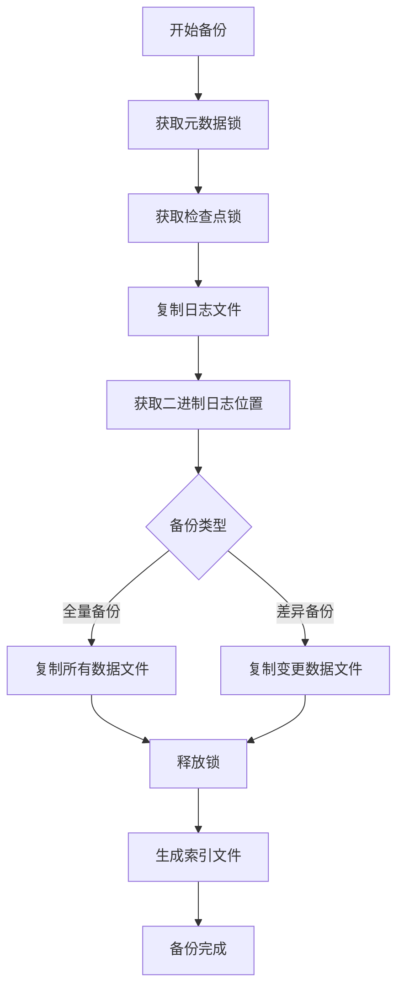
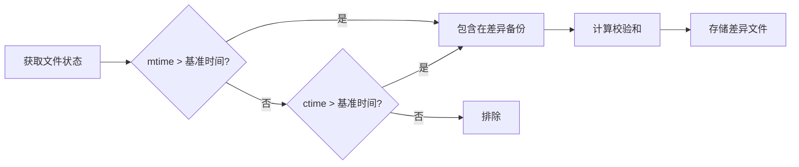

# 差异备份

<cite>
**本文档引用的文件**
- [tokudb_back.pl](file://dbm-services/mysql/db-tools/mysql-dbbackup/dbbackup-go-deps/bin/tokudb_back.pl)
- [backup_demand.go](file://dbm-services/mysql/db-tools/dbactuator/pkg/components/mysql/backupdemand/backup_demand.go)
- [public.go](file://dbm-services/mysql/db-tools/mysql-dbbackup/pkg/config/public.go)
- [backup_client.go](file://dbm-services/mongodb/db-tools/mongo-toolkit-go/pkg/backupsys/backup_client.go)
- [pitr_recover.go](file://dbm-services/mongodb/db-tools/mongo-toolkit-go/cmd/mongo-toolkit-go/tools/pitr_recover.go)
- [dbbackup.ini.json](file://dbm-ui/backend/components/dbconfig/migrations/tendbsingle/backup/dbbackup.ini.json)
- [readme.md](file://dbm-services/mysql/db-tools/mysql-dbbackup/docs/readme.md)
</cite>

## 目录
1. [差异备份实现机制](#差异备份实现机制)
2. [变更数据块识别方法](#变更数据块识别方法)
3. [差异文件生成过程](#差异文件生成过程)
4. [备份策略配置](#备份策略配置)
5. [时间戳与校验和对比](#时间戳与校验和对比)
6. [快速恢复优势](#快速恢复优势)
7. [性能对比与适用场景](#性能对比与适用场景)

## 差异备份实现机制

差异备份的实现基于全量备份作为基准点，通过识别自上次全量备份以来发生变更的数据块来创建差异备份。系统首先执行全量备份，然后在后续的备份周期中，通过比较文件的修改时间戳和创建时间戳来识别变更的数据。

在TokuDB存储引擎的备份实现中，系统通过`tokudb_back.pl`脚本管理备份过程。脚本首先检查是否存在之前的全量备份信息文件，如果存在则获取全量备份的时间戳作为基准点。系统通过`fully_stamp_and_name`哈希表存储全量备份的时间戳和名称，确保能够准确找到最近的全量备份作为基准。

当执行增量备份时，系统会检查每个数据文件的修改时间（mtime）和创建时间（ctime）是否大于全量备份的时间戳。如果是，则将该文件包含在差异备份中。这种机制确保了差异备份只包含自上次全量备份以来发生变更的数据，从而显著减少了备份数据量。

**Section sources**
- [tokudb_back.pl](file://dbm-services/mysql/db-tools/mysql-dbbackup/dbbackup-go-deps/bin/tokudb_back.pl#L379-L420)
- [backup_demand.go](file://dbm-services/mysql/db-tools/dbactuator/pkg/components/mysql/backupdemand/backup_demand.go#L164-L194)

## 变更数据块识别方法

变更数据块的识别主要通过文件系统的时间戳和校验和两种机制实现。时间戳方法通过比较文件的修改时间和创建时间与基准点时间戳来确定文件是否发生变更。

在TokuDB备份脚本中，系统使用`stat`函数获取文件的详细信息，包括修改时间（mtime）和创建时间（ctime）。核心识别逻辑如下：如果文件的修改时间或创建时间大于全量备份的时间戳，则认为该文件已变更，需要包含在差异备份中。

```perl
my($device, $inode, $mode, $nlink, $uid, $gid, $rdev, $size,$atime, $mtime, $ctime, $blksize, $blocks) = stat("$tokudb_data_dir/$file");
if($mtime>$fully_stamp ||($ctime>$fully_stamp)){
    system("cp  $tokudb_data_dir/$file  $backdir/tokudb_data") ==0 or die "failed:$!";
}
```

此外，系统还实现了校验和验证机制，通过`DoChecksum`配置项控制是否在备份过程中计算和验证数据校验和。当`DoChecksum`设置为`true`时，系统会在备份和恢复过程中验证数据完整性，确保备份数据的可靠性。

**Section sources**
- [tokudb_back.pl](file://dbm-services/mysql/db-tools/mysql-dbbackup/dbbackup-go-deps/bin/tokudb_back.pl#L418-L423)
- [dbbackup.ini.json](file://dbm-ui/backend/components/dbconfig/migrations/tendbsingle/backup/dbbackup.ini.json#L19-L23)

## 差异文件生成过程

差异文件的生成过程包含多个步骤，从获取备份锁到最终生成差异备份文件。整个过程确保了数据的一致性和完整性。

首先，系统获取元数据锁，确保在备份过程中表结构不会发生变化。对于TokuDB存储引擎，系统执行`lock tables for backup`命令获取元数据锁。然后，系统获取检查点锁，通过设置`tokudb_checkpoint_lock=on`确保DML操作只影响重做日志。

接下来，系统复制TokuDB相关的日志文件和回滚日志，同时获取二进制日志位置信息。这一步骤确保了备份的一致性点。系统通过`show master status`命令获取主库状态，记录二进制日志文件名和位置。

在复制数据文件阶段，系统根据备份类型决定复制策略。对于全量备份，复制所有数据文件；对于差异备份，只复制自上次全量备份以来发生变更的文件。最后，系统释放所有锁，并生成包含备份信息的索引文件。



**Diagram sources**
- [tokudb_back.pl](file://dbm-services/mysql/db-tools/mysql-dbbackup/dbbackup-go-deps/bin/tokudb_back.pl#L164-L435)

**Section sources**
- [tokudb_back.pl](file://dbm-services/mysql/db-tools/mysql-dbbackup/dbbackup-go-deps/bin/tokudb_back.pl#L164-L435)

## 备份策略配置

差异备份的配置通过多个参数进行控制，包括比较策略、时间间隔和存储优化选项。系统提供了灵活的配置机制，允许用户根据具体需求调整备份策略。

在`dbbackup.ini`配置文件中，`BackupType`参数控制备份类型，可设置为`logical`、`physical`或`auto`。`OldFileLeftDay`参数指定保留旧备份文件的天数，系统在执行新备份前会自动清理超过指定天数的旧备份文件。

存储优化方面，`TarSizeThreshold`参数控制每个tar包的大小，单位为MB。系统会将备份文件按此大小进行拆分，避免单个文件过大。`IOLimitMBPerSec`参数限制备份过程中的I/O速度，防止备份操作对生产系统造成过大影响。

```ini
[Public]
BackupType = physical
OldFileLeftDay = 2
TarSizeThreshold = 8192
IOLimitMBPerSec = 300
IOLimitMasterFactor = 0.5
```

对于主库备份，`IOLimitMasterFactor`参数进一步限制I/O速度，实际限速为`IOLimitMBPerSec`乘以该因子。这种分层限速机制确保了主库的性能不受备份操作的严重影响。

**Section sources**
- [public.go](file://dbm-services/mysql/db-tools/mysql-dbbackup/pkg/config/public.go#L59-L67)
- [readme.md](file://dbm-services/mysql/db-tools/mysql-dbbackup/docs/readme.md#L100-L102)

## 时间戳与校验和对比

系统通过对比数据页的修改时间戳和校验和来识别差异部分，确保备份的准确性和完整性。时间戳对比是差异识别的主要机制，而校验和验证则用于确保数据完整性。

在TokuDB备份脚本中，系统通过`stat`函数获取文件的修改时间（mtime）和创建时间（ctime），并与全量备份的时间戳进行比较。如果任一时间戳大于基准时间戳，则认为文件已变更。这种双重时间戳检查机制能够捕获文件内容和元数据的所有变更。

```perl
my($device, $inode, $mode, $nlink, $uid, $gid, $rdev, $size,$atime, $mtime, $ctime, $blksize, $blocks) = stat("$tokudb_data_dir/$file");
if($mtime>$fully_stamp ||($ctime>$fully_stamp)){
    system("cp  $tokudb_data_dir/$file  $backdir/tokudb_data") ==0 or die "failed:$!";
}
```

校验和验证通过`BackupClient.DoChecksum`配置项控制。当启用时，系统在备份过程中计算数据校验和，并在恢复时验证校验和，确保数据未被损坏。这种双重验证机制提供了可靠的数据保护。



**Diagram sources**
- [tokudb_back.pl](file://dbm-services/mysql/db-tools/mysql-dbbackup/dbbackup-go-deps/bin/tokudb_back.pl#L418-L423)
- [dbbackup.ini.json](file://dbm-ui/backend/components/dbconfig/migrations/tendbsingle/backup/dbbackup.ini.json#L19-L23)

## 快速恢复优势

差异备份在快速恢复特定时间点数据方面具有显著优势。由于差异备份只包含自上次全量备份以来的变更数据，恢复过程可以快速定位到目标时间点，大大缩短了恢复时间。

恢复过程首先应用最近的全量备份，然后按顺序应用差异备份，直到达到目标时间点。这种机制避免了从头开始应用所有事务日志的耗时过程。对于需要频繁恢复到不同时间点的场景，差异备份提供了高效的解决方案。

在MongoDB的PITR（Point-In-Time Recovery）实现中，系统首先导入全量备份，然后按顺序导入增量备份。这种分层恢复策略确保了数据的一致性，同时最大限度地减少了恢复时间。

```go
// Recover PITR backup. This command executes mongorestore locally to restore backup files.
// The recovery process follows these steps:
// 1. First imports the full backup
// 2. Then imports incremental backups in sequence
```

此外，差异备份的存储效率也提高了恢复速度。由于备份数据量较小，网络传输和磁盘I/O操作都更加高效，进一步缩短了整体恢复时间。

**Section sources**
- [pitr_recover.go](file://dbm-services/mongodb/db-tools/mongo-toolkit-go/cmd/mongo-toolkit-go/tools/pitr_recover.go#L25-L29)

## 性能对比与适用场景

差异备份与增量备份在性能和适用场景上有明显区别。差异备份的恢复速度通常快于增量备份，但备份速度和存储空间占用相对较大。

| 特性 | 差异备份 | 增量备份 |
|------|---------|---------|
| 备份速度 | 中等 | 快 |
| 存储空间 | 中等 | 小 |
| 恢复速度 | 快 | 慢 |
| 恢复复杂度 | 简单 | 复杂 |

差异备份适用于需要频繁恢复到不同时间点的场景，如开发测试环境的数据恢复、数据审计和合规性检查。由于恢复过程只需要应用最近的全量备份和少量差异备份，恢复时间较短。

增量备份更适合长期归档和灾难恢复场景，因为它占用的存储空间最小。然而，恢复过程需要按顺序应用所有增量备份，恢复时间较长。

在配置选择上，对于OLTP系统，建议使用差异备份以确保快速恢复能力；对于数据仓库等OLAP系统，可以考虑使用增量备份以节省存储空间。

**Section sources**
- [tokudb_back.pl](file://dbm-services/mysql/db-tools/mysql-dbbackup/dbbackup-go-deps/bin/tokudb_back.pl#L369-L392)
- [pitr_recover.go](file://dbm-services/mongodb/db-tools/mongo-toolkit-go/cmd/mongo-toolkit-go/tools/pitr_recover.go#L25-L29)